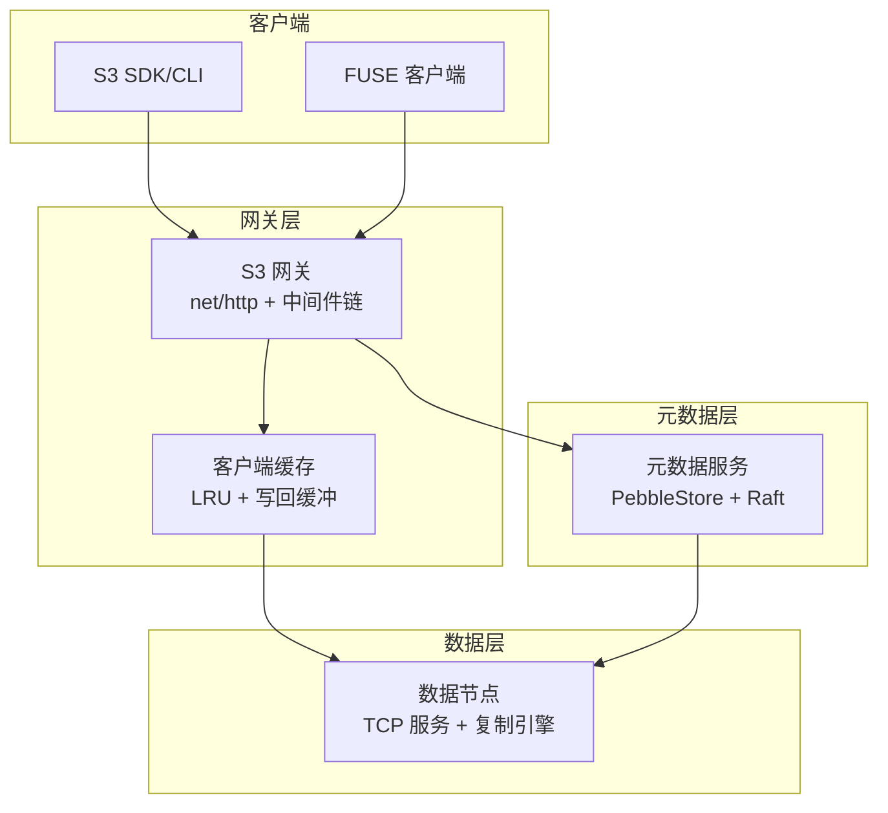
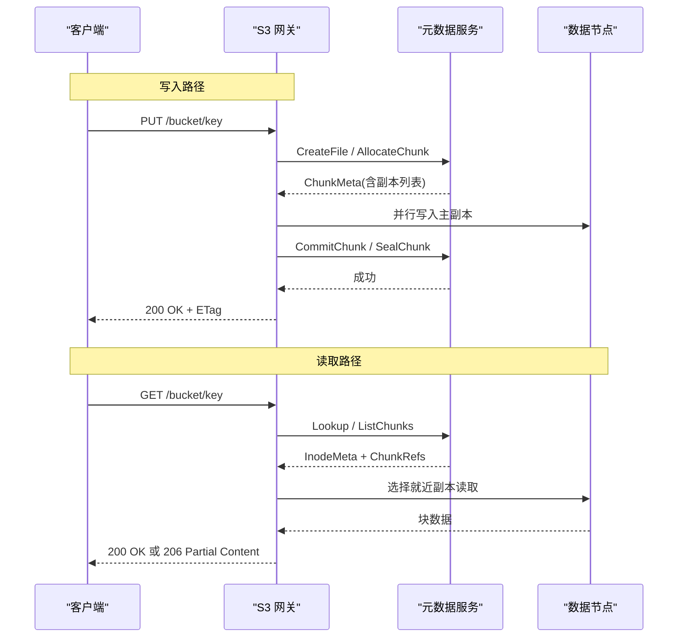
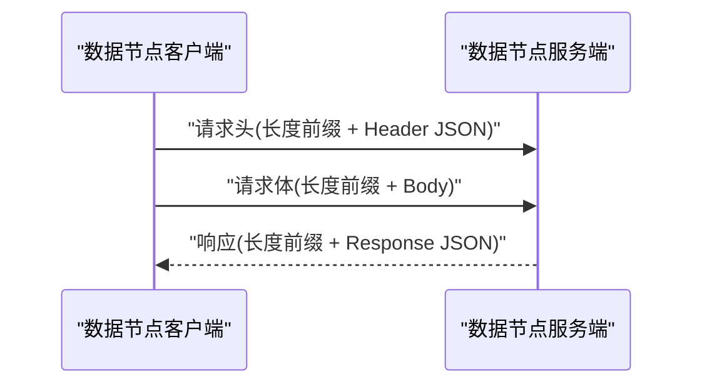
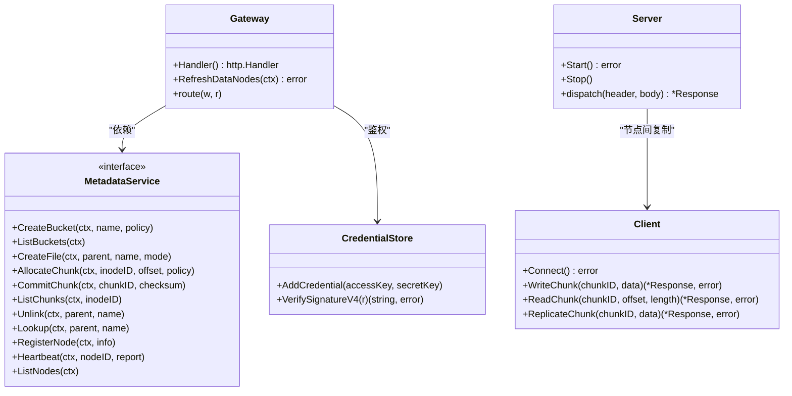

# API参考

<cite>
**本文引用的文件**
- [nufs-core/cmd/s3gw/main.go](file://nufs-core/cmd/s3gw/main.go)
- [nufs-core/gateway/s3/handler.go](file://nufs-core/gateway/s3/handler.go)
- [nufs-core/gateway/s3/auth.go](file://nufs-core/gateway/s3/auth.go)
- [nufs-core/gateway/s3/bucket.go](file://nufs-core/gateway/s3/bucket.go)
- [nufs-core/gateway/s3/object.go](file://nufs-core/gateway/s3/object.go)
- [nufs-core/gateway/s3/multipart.go](file://nufs-core/gateway/s3/multipart.go)
- [nufs-core/gateway/s3/response.go](file://nufs-core/gateway/s3/response.go)
- [nufs-core/datanode/server.go](file://nufs-core/datanode/server.go)
- [nufs-core/datanode/types.go](file://nufs-core/datanode/types.go)
- [nufs-core/metadata/service.go](file://nufs-core/metadata/service.go)
- [nufs-core/metadata/types.go](file://nufs-core/metadata/types.go)
- [nufs-core/metadata/errors.go](file://nufs-core/metadata/errors.go)
- [nufs-core/gateway/cache.go](file://nufs-core/gateway/cache.go)
- [nufs-core/ARCHITECTURE.md](file://nufs-core/ARCHITECTURE.md)
</cite>

## 目录
1. [简介](#简介)
2. [项目结构](#项目结构)
3. [核心组件](#核心组件)
4. [架构总览](#架构总览)
5. [详细组件分析](#详细组件分析)
6. [依赖关系分析](#依赖关系分析)
7. [性能考量](#性能考量)
8. [故障排查指南](#故障排查指南)
9. [结论](#结论)
10. [附录](#附录)

## 简介
本文件为NUFS分布式文件系统的完整API参考，覆盖以下内容：
- S3兼容REST API：HTTP方法、URL模式、请求/响应模式、鉴权方式
- 数据节点TCP协议：消息帧、二进制格式、状态管理
- 协议特定的错误处理策略、安全考虑、速率限制与版本信息
- 常见用例、客户端实现建议与性能优化技巧
- S3 API兼容性、内部RPC协议与客户端缓存策略
- 协议调试工具与监控方法

## 项目结构
NUFS采用分层架构：网关层（S3/FUSE）、元数据层（Pebble/共识）、数据层（数据节点）。S3网关负责S3兼容的HTTP接口；数据节点负责块的读写与复制；元数据服务统一管理命名空间、块映射与集群拓扑。

图表来源
- [nufs-core/ARCHITECTURE.md:39-101](file://nufs-core/ARCHITECTURE.md#L39-L101)
- [nufs-core/cmd/s3gw/main.go:18-90](file://nufs-core/cmd/s3gw/main.go#L18-L90)
- [nufs-core/gateway/s3/handler.go:11-54](file://nufs-core/gateway/s3/handler.go#L11-L54)
- [nufs-core/gateway/cache.go:29-96](file://nufs-core/gateway/cache.go#L29-L96)
- [nufs-core/metadata/service.go:15-63](file://nufs-core/metadata/service.go#L15-L63)
- [nufs-core/datanode/server.go:18-51](file://nufs-core/datanode/server.go#L18-L51)

章节来源
- [nufs-core/ARCHITECTURE.md:25-116](file://nufs-core/ARCHITECTURE.md#L25-L116)

## 核心组件
- S3网关：提供S3兼容的HTTP接口，内置中间件链（恢复、请求ID、CORS、日志），支持AWS Signature V4鉴权与匿名模式。
- 元数据服务：统一的MetadataService接口，PebbleStore实现，支持Raft共识、MVCC、租约、GC、清洗等生产特性。
- 数据节点：TCP服务，提供块读写、复制、健康检查等RPC；支持并发读写限制与心跳上报。
- 客户端缓存：FUSE/S3客户端侧的属性缓存、数据缓存与写回缓冲，提升读写性能与降低后端压力。

章节来源
- [nufs-core/gateway/s3/handler.go:11-54](file://nufs-core/gateway/s3/handler.go#L11-L54)
- [nufs-core/metadata/service.go:15-63](file://nufs-core/metadata/service.go#L15-L63)
- [nufs-core/datanode/server.go:18-51](file://nufs-core/datanode/server.go#L18-L51)
- [nufs-core/gateway/cache.go:29-96](file://nufs-core/gateway/cache.go#L29-L96)

## 架构总览
下图展示写入与读取的端到端流程，以及各组件间的交互。

图表来源
- [nufs-core/ARCHITECTURE.md:350-412](file://nufs-core/ARCHITECTURE.md#L350-L412)
- [nufs-core/gateway/s3/object.go:17-95](file://nufs-core/gateway/s3/object.go#L17-L95)
- [nufs-core/gateway/s3/bucket.go:11-34](file://nufs-core/gateway/s3/bucket.go#L11-L34)

## 详细组件分析

### S3 兼容 REST API

- 服务器启动与监听
  - 监听地址与端口：默认:8080
  - 元数据存储：PebbleStore
  - 鉴权：可配置Access Key/Secret Key；未配置时为匿名模式
  - 中间件链：恢复、请求ID、CORS、日志

- 请求路由与鉴权
  - 路由：基于URL路径与HTTP方法进行分发
  - 鉴权：支持AWS Signature V4；也支持查询字符串预签名URL；匿名模式允许未鉴权请求

- 响应格式
  - 成功：标准HTTP状态码
  - 失败：S3风格XML错误响应，包含Code、Message、Resource、RequestId

- API定义（按资源层级）

  - 服务级
    - GET / → 列出桶
  - 桶级
    - PUT /{bucket} → 创建桶
    - DELETE /{bucket} → 删除桶
    - HEAD /{bucket} → 检查桶是否存在
    - GET /{bucket} → 列出对象（支持前缀、分隔符、最大条数、V2分页）
    - POST /{bucket}?delete → 批量删除（预留）
  - 对象级
    - PUT /{bucket}/{key+} → 上传对象
    - GET /{bucket}/{key+} → 下载对象（支持Range）
    - DELETE /{bucket}/{key+} → 删除对象
    - HEAD /{bucket}/{key+} → 获取对象元信息
    - PUT /{bucket}/{key+}（带X-Amz-Copy-Source）→ 服务端复制
  - 分段上传
    - POST /{bucket}/{key}?uploads → 初始化分段上传
    - PUT /{bucket}/{key}?partNumber=N&uploadId=... → 上传分段
    - POST /{bucket}/{key}?uploadId=... → 完成分段上传
    - DELETE /{bucket}/{key}?uploadId=... → 终止分段上传
    - GET /{bucket}/{key}?uploadId=... → 列出分段
    - GET /{bucket}?uploads → 列出桶内活跃分段上传

- 鉴权与安全
  - AWS Signature V4：校验日期、范围头、签名
  - 匿名模式：当未配置凭据时允许未鉴权请求
  - 建议：生产环境启用鉴权，使用HTTPS传输

- 错误处理
  - 使用S3错误码映射到HTTP状态码
  - 失败响应包含RequestId便于追踪

- 速率限制与版本
  - 未实现全局速率限制；可通过反向代理或上游网关实现
  - 服务版本：通过ServiceBundle选项配置，默认版本信息在服务选项中

- 常见用例
  - 上传大文件：使用分段上传，分段大小建议≥5MB
  - 断点续传：利用分段上传与分段列表
  - 服务端复制：通过X-Amz-Copy-Source实现零数据出站复制
  - 批量删除：POST ?delete（预留功能）

- 客户端实现建议
  - 使用SDK时启用重试与指数退避
  - 对于高并发场景，合理设置分段大小与并发数
  - 利用Range请求实现并行下载

- 性能优化技巧
  - 启用客户端缓存（属性缓存、数据缓存、写回缓冲）
  - 使用就近副本读取
  - 合理设置分段大小以平衡吞吐与内存占用

章节来源
- [nufs-core/cmd/s3gw/main.go:18-90](file://nufs-core/cmd/s3gw/main.go#L18-L90)
- [nufs-core/gateway/s3/handler.go:70-166](file://nufs-core/gateway/s3/handler.go#L70-L166)
- [nufs-core/gateway/s3/auth.go:31-98](file://nufs-core/gateway/s3/auth.go#L31-L98)
- [nufs-core/gateway/s3/bucket.go:11-103](file://nufs-core/gateway/s3/bucket.go#L11-L103)
- [nufs-core/gateway/s3/object.go:17-208](file://nufs-core/gateway/s3/object.go#L17-L208)
- [nufs-core/gateway/s3/multipart.go:85-203](file://nufs-core/gateway/s3/multipart.go#L85-L203)
- [nufs-core/gateway/s3/response.go:128-215](file://nufs-core/gateway/s3/response.go#L128-L215)

### 数据节点 TCP 协议

- 服务器与客户端
  - 服务端：监听TCP端口（默认:9100），接受连接并处理请求
  - 客户端：用于节点间复制与管理调用

- 消息帧格式
  - 请求：长度前缀 + Header(JSON) + 长度前缀 + Body
  - 响应：长度前缀 + Response(JSON)

- 请求类型
  - 写入块：ReqWriteChunk
  - 读取块：ReqReadChunk（支持偏移与长度）
  - 删除块：ReqDeleteChunk
  - 复制块：ReqReplicateChunk（来自对端）
  - 块信息：ReqChunkInfo
  - 列出块：ReqListChunks
  - 健康检查：ReqHealth

- 请求头字段
  - Type、ChunkID、Offset、Length、Checksum、RequestID、Extra

- 响应状态
  - OK、Error、NotFound、Full、Busy

- 二进制块文件格式
  - 固定头：魔数、ChunkID、数据长度、CRC32
  - 数据体：块数据
  - 元数据边车：可选的ChunkMeta快照文件

- 状态管理
  - 块生命周期：写入中 → 写入完成（密封）→ 就绪（所有副本确认）
  - 副本状态：同步中、就绪、陈旧、失败
  - 节点状态：在线、下线、故障、退役中

- 协议特定示例
  - 写入：客户端构造Header（含CRC32），发送请求，等待响应
  - 读取：客户端指定Offset/Length，服务端返回数据与校验和
  - 复制：源节点读取块，目标节点写入并校验

- 错误处理策略
  - 校验和不匹配：返回错误
  - 块不存在：返回NotFound
  - 资源不足/繁忙：返回Full/Busy

- 安全考虑
  - 未内置TLS；建议通过反向代理或内网隔离
  - 严格限制请求体大小（头部与主体均有上限）

- 版本信息
  - 协议版本：随Header/Response结构稳定；块文件魔数用于版本识别

- 调试与监控
  - 健康检查：ReqHealth返回节点统计信息
  - 心跳上报：节点定期上报使用量、副本状态
  - 日志：请求/响应错误与异常均记录

图表来源
- [nufs-core/datanode/server.go:273-337](file://nufs-core/datanode/server.go#L273-L337)
- [nufs-core/datanode/types.go:87-107](file://nufs-core/datanode/types.go#L87-L107)

章节来源
- [nufs-core/datanode/server.go:18-271](file://nufs-core/datanode/server.go#L18-L271)
- [nufs-core/datanode/types.go:14-171](file://nufs-core/datanode/types.go#L14-L171)

### 元数据服务接口

- 接口职责
  - 桶与命名空间：创建/删除/列举/查询、目录与文件操作
  - Inode：获取/更新元数据
  - 块：分配/提交/密封/列举/删除、报告副本状态
  - 集群：节点注册/心跳/退役/列举/查询
  - 修复：获取修复队列/触发修复
  - 生命周期：关闭

- 关键数据结构
  - InodeMeta、DirEntry、BucketInfo、ChunkMeta、ReplicaInfo、NodeInfo
  - 状态枚举：ChunkState、ReplicaState、NodeState、StorageTier、TopologySpread

- 生产特性
  - 服务组合：事件总线、指标、健康检查、租约管理、GC、清洗、Raft
  - 乐观并发控制：MVCC版本冲突检测与重试
  - 租约与心跳：节点自动上下线与修复触发
  - 副本与放置：拓扑感知、权重评分、跨机房复制

章节来源
- [nufs-core/metadata/service.go:15-131](file://nufs-core/metadata/service.go#L15-L131)
- [nufs-core/metadata/types.go:30-209](file://nufs-core/metadata/types.go#L30-L209)

### 客户端缓存策略

- 缓存层次
  - 内核页缓存：透明提升热点数据命中
  - 用户态缓存：属性缓存（TTL）、数据缓存（TTL更长）、写回缓冲（阈值触发/定时刷新）

- 一致性保证
  - 读：TTL过期后重新验证
  - 写：写回缓冲异步刷写，进程退出时同步剩余脏数据

- 刷新策略
  - 属性缓存：5s TTL
  - 数据缓存：50s TTL
  - 写回缓冲：默认500MB阈值或10s定时刷新

- 效果
  - 热数据读延迟显著降低；写入延迟接近异步写回成本

章节来源
- [nufs-core/gateway/cache.go:29-325](file://nufs-core/gateway/cache.go#L29-L325)
- [nufs-core/ARCHITECTURE.md:642-684](file://nufs-core/ARCHITECTURE.md#L642-L684)

## 依赖关系分析

图表来源
- [nufs-core/gateway/s3/handler.go:13-54](file://nufs-core/gateway/s3/handler.go#L13-L54)
- [nufs-core/gateway/s3/auth.go:14-29](file://nufs-core/gateway/s3/auth.go#L14-L29)
- [nufs-core/metadata/service.go:15-63](file://nufs-core/metadata/service.go#L15-L63)
- [nufs-core/datanode/server.go:18-51](file://nufs-core/datanode/server.go#L18-L51)
- [nufs-core/datanode/types.go:340-406](file://nufs-core/datanode/types.go#L340-L406)

章节来源
- [nufs-core/gateway/s3/handler.go:11-54](file://nufs-core/gateway/s3/handler.go#L11-L54)
- [nufs-core/metadata/service.go:15-63](file://nufs-core/metadata/service.go#L15-L63)
- [nufs-core/datanode/server.go:18-51](file://nufs-core/datanode/server.go#L18-L51)

## 性能考量
- 读取优化
  - 属性缓存与数据缓存显著降低后端压力
  - 就近副本读取减少网络延迟
- 写入优化
  - 分段上传与并行写入提升吞吐
  - 写回缓冲降低同步写开销
- 元数据层
  - 批量原子写入、MVCC乐观锁避免阻塞
  - Raft共识保障强一致写
- 数据层
  - 并发读写限制防止资源争用
  - 健康检查与副本状态驱动自动修复

## 故障排查指南
- S3 API错误
  - 使用S3错误码映射HTTP状态码，结合x-amz-request-id定位问题
  - 常见错误：NoSuchBucket、NoSuchKey、InvalidArgument、AccessDenied、InternalError
- 数据节点
  - 校验和不匹配：检查块文件完整性与传输过程
  - NotFound：确认ChunkID存在且已Sealed
  - Full/Busy：调整并发参数或扩容
- 元数据服务
  - 版本冲突：重试并携带最新版本
  - 节点离线：检查租约与心跳，触发修复流程
- 客户端缓存
  - 缓存失效：TTL到期后自动重新验证
  - 写回失败：缓冲区重试，最终退出时同步

章节来源
- [nufs-core/gateway/s3/response.go:128-215](file://nufs-core/gateway/s3/response.go#L128-L215)
- [nufs-core/datanode/server.go:128-271](file://nufs-core/datanode/server.go#L128-L271)
- [nufs-core/metadata/errors.go:12-89](file://nufs-core/metadata/errors.go#L12-L89)
- [nufs-core/gateway/cache.go:196-221](file://nufs-core/gateway/cache.go#L196-L221)

## 结论
NUFS提供了完整的S3兼容API与高性能的数据节点TCP协议，并通过元数据服务实现强一致与容错能力。配合客户端缓存策略与生产特性（租约、GC、清洗、Raft），可在大规模场景下实现高可用与低延迟。建议在生产环境中启用鉴权、合理配置分段大小与并发参数，并结合监控与告警体系保障稳定性。

## 附录

### S3 API 速查表
- 服务级
  - GET / → 列出桶
- 桶级
  - PUT /{bucket} → 创建桶
  - DELETE /{bucket} → 删除桶
  - HEAD /{bucket} → 检查桶
  - GET /{bucket} → 列出对象（前缀/分隔符/最大条数/V2）
  - POST /{bucket}?delete → 批量删除（预留）
- 对象级
  - PUT /{bucket}/{key+} → 上传对象
  - GET /{bucket}/{key+} → 下载对象（Range）
  - DELETE /{bucket}/{key+} → 删除对象
  - HEAD /{bucket}/{key+} → 对象元信息
  - PUT /{bucket}/{key+}?X-Amz-Copy-Source → 服务端复制
- 分段上传
  - POST ?uploads → 初始化
  - PUT ?partNumber&uploadId → 上传分段
  - POST ?uploadId → 完成
  - DELETE ?uploadId → 终止
  - GET ?uploadId → 列出分段
  - GET ?uploads → 列出桶内活跃分段

章节来源
- [nufs-core/gateway/s3/handler.go:70-166](file://nufs-core/gateway/s3/handler.go#L70-L166)
- [nufs-core/gateway/s3/bucket.go:105-215](file://nufs-core/gateway/s3/bucket.go#L105-L215)
- [nufs-core/gateway/s3/object.go:97-208](file://nufs-core/gateway/s3/object.go#L97-L208)
- [nufs-core/gateway/s3/multipart.go:85-255](file://nufs-core/gateway/s3/multipart.go#L85-L255)

### 数据节点协议速查表
- 请求类型
  - ReqWriteChunk、ReqReadChunk、ReqDeleteChunk、ReqReplicateChunk、ReqChunkInfo、ReqListChunks、ReqHealth
- 消息格式
  - 请求：长度前缀 + Header(JSON) + 长度前缀 + Body
  - 响应：长度前缀 + Response(JSON)
- 块文件格式
  - 魔数、ChunkID、数据长度、CRC32、数据体
- 状态
  - 块：Sealing、Sealed、Ready、Degraded、Orphan
  - 副本：Syncing、Ready、Stale、Failed
  - 节点：Online、Draining、Offline、Failed

章节来源
- [nufs-core/datanode/types.go:74-171](file://nufs-core/datanode/types.go#L74-L171)
- [nufs-core/datanode/server.go:273-337](file://nufs-core/datanode/server.go#L273-L337)