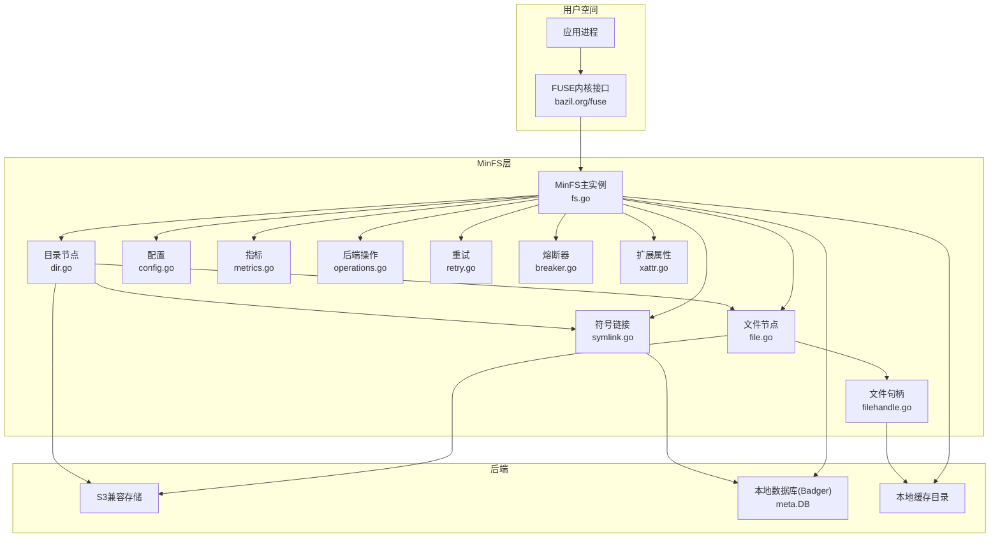
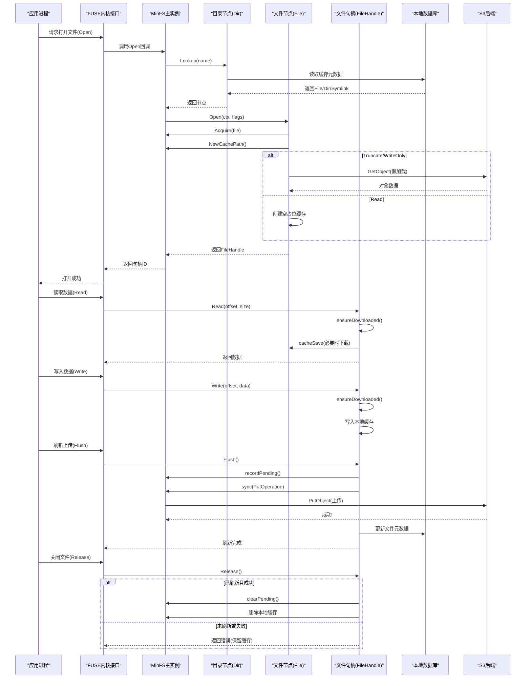
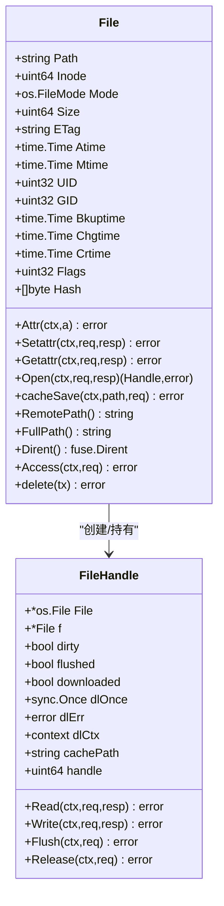
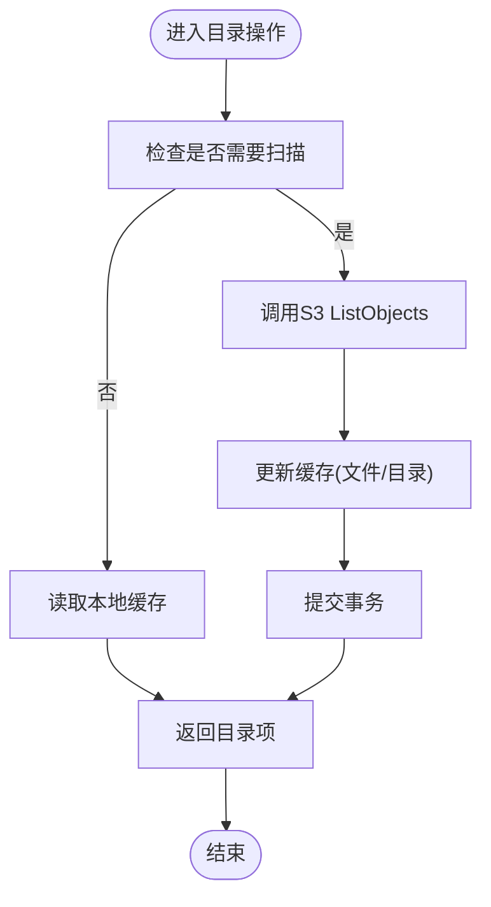
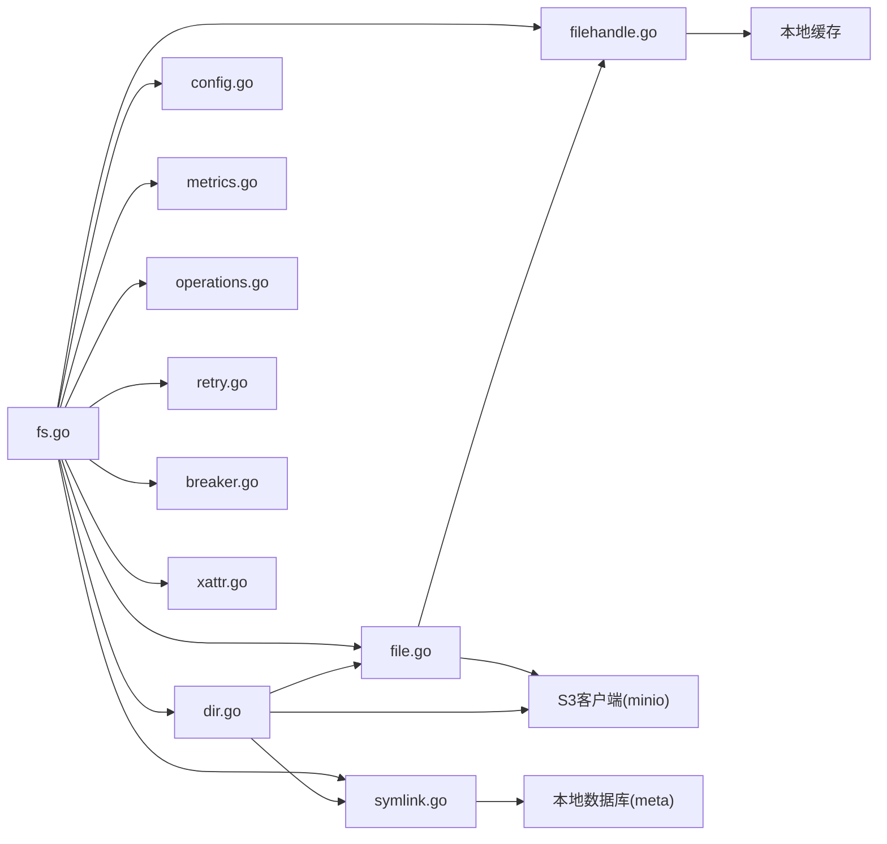

# FUSE API接口

<cite>
**本文档引用的文件**
- [fs.go](file://nufs-fuse/fs/fs.go)
- [file.go](file://nufs-fuse/fs/file.go)
- [dir.go](file://nufs-fuse/fs/dir.go)
- [symlink.go](file://nufs-fuse/fs/symlink.go)
- [filehandle.go](file://nufs-fuse/fs/filehandle.go)
- [config.go](file://nufs-fuse/fs/config.go)
- [metrics.go](file://nufs-fuse/fs/metrics.go)
- [operations.go](file://nufs-fuse/fs/operations.go)
- [retry.go](file://nufs-fuse/fs/retry.go)
- [breaker.go](file://nufs-fuse/fs/breaker.go)
- [xattr.go](file://nufs-fuse/fs/xattr.go)
- [globals.go](file://nufs-fuse/fs/globals.go)
- [DESIGN.md](file://nufs-fuse/DESIGN.md)
- [README.md](file://nufs-fuse/README.md)
</cite>

## 目录
1. [简介](#简介)
2. [项目结构](#项目结构)
3. [核心组件](#核心组件)
4. [架构总览](#架构总览)
5. [详细组件分析](#详细组件分析)
6. [依赖关系分析](#依赖关系分析)
7. [性能考量](#性能考量)
8. [故障排除指南](#故障排除指南)
9. [结论](#结论)
10. [附录](#附录)

## 简介
本文件系统接口基于 FUSE 实现，将 S3 兼容对象存储作为本地 POSIX 文件系统暴露。该实现通过 bazil.org/fuse 提供的 FUSE 接口，结合本地缓存与数据库持久化，提供文件读写、目录遍历、元数据管理以及符号链接等能力。同时，针对网络不稳定场景提供了重试与熔断机制，并提供指标监控与健康检查端点。

## 项目结构
- 核心文件系统实现位于 nufs-fuse/fs 目录，包含：
  - 文件节点与句柄：file.go、filehandle.go
  - 目录节点：dir.go
  - 符号链接：symlink.go
  - 配置与全局常量：config.go、globals.go
  - FUSE 挂载与服务：fs.go
  - 指标与度量：metrics.go
  - 后端操作封装：operations.go
  - 可靠性：retry.go、breaker.go
  - 扩展属性：xattr.go

图表来源
- [fs.go:164-307](file://nufs-fuse/fs/fs.go#L164-L307)
- [file.go:33-61](file://nufs-fuse/fs/file.go#L33-L61)
- [dir.go:33-60](file://nufs-fuse/fs/dir.go#L33-L60)
- [symlink.go:30-50](file://nufs-fuse/fs/symlink.go#L30-L50)
- [filehandle.go:40-65](file://nufs-fuse/fs/filehandle.go#L40-L65)
- [config.go:34-67](file://nufs-fuse/fs/config.go#L34-L67)
- [metrics.go:85-137](file://nufs-fuse/fs/metrics.go#L85-L137)
- [operations.go:18-68](file://nufs-fuse/fs/operations.go#L18-L68)
- [retry.go:37-104](file://nufs-fuse/fs/retry.go#L37-L104)
- [breaker.go:35-131](file://nufs-fuse/fs/breaker.go#L35-L131)
- [xattr.go:27-84](file://nufs-fuse/fs/xattr.go#L27-L84)

章节来源
- [fs.go:164-307](file://nufs-fuse/fs/fs.go#L164-L307)
- [file.go:33-61](file://nufs-fuse/fs/file.go#L33-L61)
- [dir.go:33-60](file://nufs-fuse/fs/dir.go#L33-L60)
- [symlink.go:30-50](file://nufs-fuse/fs/symlink.go#L30-L50)
- [filehandle.go:40-65](file://nufs-fuse/fs/filehandle.go#L40-L65)
- [config.go:34-67](file://nufs-fuse/fs/config.go#L34-L67)
- [metrics.go:85-137](file://nufs-fuse/fs/metrics.go#L85-L137)
- [operations.go:18-68](file://nufs-fuse/fs/operations.go#L18-L68)
- [retry.go:37-104](file://nufs-fuse/fs/retry.go#L37-L104)
- [breaker.go:35-131](file://nufs-fuse/fs/breaker.go#L35-L131)
- [xattr.go:27-84](file://nufs-fuse/fs/xattr.go#L27-L84)

## 核心组件
- MinFS 主实例：负责挂载、服务启动、数据库初始化、S3 客户端、同步工作池、缓存回收、审计日志等。
- 节点模型：
  - File：文件节点，支持 Attr/Setattr/Getattr/Open/Read/Write/Flush/Release 等。
  - Dir：目录节点，支持 Attr/Setattr/Lookup/ReadDirAll/Mkdir/Create/Remove/Rename/Symlink/Link 等。
  - Symlink：符号链接节点，仅本地存储，不上传至 S3。
- 文件句柄 FileHandle：封装本地缓存文件，提供懒加载下载、写入、刷新上传、释放清理等。
- 配置 Config：挂载点、目标 S3、凭证、缓存目录、扫描 TTL、只读模式、缓存配额、指标服务器地址等。
- 指标与度量：统计 FUSE/S3 操作次数、延迟直方图、活跃句柄数、熔断状态等。
- 后端操作封装：Move/Copy/Put 等异步同步任务，通过通道与工作协程队列执行。
- 可靠性：指数回退重试与三态熔断器，提升网络不稳定时的稳定性。
- 扩展属性：支持文件/目录级扩展属性的增删查改。

章节来源
- [fs.go:62-95](file://nufs-fuse/fs/fs.go#L62-L95)
- [file.go:33-61](file://nufs-fuse/fs/file.go#L33-L61)
- [dir.go:33-60](file://nufs-fuse/fs/dir.go#L33-L60)
- [symlink.go:30-50](file://nufs-fuse/fs/symlink.go#L30-L50)
- [filehandle.go:40-65](file://nufs-fuse/fs/filehandle.go#L40-L65)
- [config.go:34-67](file://nufs-fuse/fs/config.go#L34-L67)
- [metrics.go:85-137](file://nufs-fuse/fs/metrics.go#L85-L137)
- [operations.go:18-68](file://nufs-fuse/fs/operations.go#L18-L68)
- [retry.go:37-104](file://nufs-fuse/fs/retry.go#L37-L104)
- [breaker.go:35-131](file://nufs-fuse/fs/breaker.go#L35-L131)
- [xattr.go:27-84](file://nufs-fuse/fs/xattr.go#L27-L84)

## 架构总览
MinFS 通过 FUSE 将 S3 对象映射为本地文件系统节点，采用“本地缓存 + 数据库元数据”的混合策略：
- 读：首次访问时从 S3 下载到本地缓存；后续读取直接从缓存文件进行。
- 写：先写入本地缓存文件；在 Flush 阶段上传到 S3；Release 清理缓存或保留以避免数据丢失。
- 目录：目录内容通过扫描 S3 列表并缓存到本地数据库，支持 TTL 控制刷新频率。
- 符号链接：仅本地存储，不上传至 S3。
- 错误处理：网络错误与临时 S3 错误自动重试；熔断器在持续失败时快速失败并探测恢复。
- 指标：提供 Prometheus 文本格式与 JSON 快照，便于运维监控。

图表来源
- [fs.go:164-307](file://nufs-fuse/fs/fs.go#L164-L307)
- [dir.go:126-160](file://nufs-fuse/fs/dir.go#L126-L160)
- [file.go:242-313](file://nufs-fuse/fs/file.go#L242-L313)
- [filehandle.go:93-243](file://nufs-fuse/fs/filehandle.go#L93-L243)
- [operations.go:18-68](file://nufs-fuse/fs/operations.go#L18-L68)
- [retry.go:37-104](file://nufs-fuse/fs/retry.go#L37-L104)
- [breaker.go:61-96](file://nufs-fuse/fs/breaker.go#L61-L96)

## 详细组件分析

### 文件节点 File
- 属性与元数据：Attr/Setattr/Getattr 支持 inode、大小、时间戳、权限、UID/GID、标志等。
- 打开流程：Open 中根据 flags 决定是否立即下载或懒加载；创建本地缓存文件；Acquire 获取句柄并登记。
- 懒加载：ensureDownloaded 在首次 Read 前从 S3 下载到本地缓存。
- 写入与刷新：Write 支持偏移写入；Flush 将缓存上传到 S3；Release 根据 flush 状态决定是否删除本地缓存。
- 截断：当文件打开时截断缓存；关闭且大小为 0 时直接上传空对象；大于 0 的截断通过后续写入修正。

图表来源
- [file.go:33-61](file://nufs-fuse/fs/file.go#L33-L61)
- [filehandle.go:40-65](file://nufs-fuse/fs/filehandle.go#L40-L65)

章节来源
- [file.go:68-176](file://nufs-fuse/fs/file.go#L68-L176)
- [file.go:188-240](file://nufs-fuse/fs/file.go#L188-L240)
- [file.go:242-313](file://nufs-fuse/fs/file.go#L242-L313)
- [filehandle.go:67-91](file://nufs-fuse/fs/filehandle.go#L67-L91)
- [filehandle.go:93-153](file://nufs-fuse/fs/filehandle.go#L93-L153)
- [filehandle.go:201-243](file://nufs-fuse/fs/filehandle.go#L201-L243)

### 目录节点 Dir
- 目录扫描：needsScan + scan 结合 S3 ListObjects，将远端对象映射为本地缓存；支持 TTL 控制刷新。
- 查找与遍历：Lookup 从缓存读取；ReadDirAll 返回目录项列表。
- 创建/删除/重命名：Create/Mkdir/Remove/Rename；重命名涉及 MoveOperation 异步上传；符号链接本地处理。
- 硬链接：S3 不支持硬链接，通过复制对象实现。

图表来源
- [dir.go:62-72](file://nufs-fuse/fs/dir.go#L62-L72)
- [dir.go:274-375](file://nufs-fuse/fs/dir.go#L274-L375)
- [dir.go:377-409](file://nufs-fuse/fs/dir.go#L377-L409)

章节来源
- [dir.go:62-124](file://nufs-fuse/fs/dir.go#L62-L124)
- [dir.go:126-160](file://nufs-fuse/fs/dir.go#L126-L160)
- [dir.go:274-375](file://nufs-fuse/fs/dir.go#L274-L375)
- [dir.go:377-409](file://nufs-fuse/fs/dir.go#L377-L409)
- [dir.go:425-527](file://nufs-fuse/fs/dir.go#L425-L527)
- [dir.go:549-623](file://nufs-fuse/fs/dir.go#L549-L623)
- [dir.go:625-747](file://nufs-fuse/fs/dir.go#L625-L747)
- [dir.go:749-793](file://nufs-fuse/fs/dir.go#L749-L793)

### 符号链接 Symlink
- 仅本地存储，不上传至 S3；支持读取目标、设置属性、访问控制。
- FullPath 返回本地路径；Dirent 返回类型 Link。

章节来源
- [symlink.go:30-125](file://nufs-fuse/fs/symlink.go#L30-L125)

### 文件句柄 FileHandle
- 缓冲池复用：使用 sync.Pool 复用 128KB 读缓冲，降低 GC 压力。
- 懒加载：ensureDownloaded 在首次 Read 前完成下载与重新打开缓存文件。
- 写入：支持偏移写入，自动更新文件大小；写入后标记 dirty。
- 刷新与释放：Flush 记录待上传、异步上传、更新元数据；Release 根据 flush 状态清理缓存或保留。

章节来源
- [filehandle.go:31-38](file://nufs-fuse/fs/filehandle.go#L31-L38)
- [filehandle.go:67-91](file://nufs-fuse/fs/filehandle.go#L67-L91)
- [filehandle.go:93-153](file://nufs-fuse/fs/filehandle.go#L93-L153)
- [filehandle.go:174-243](file://nufs-fuse/fs/filehandle.go#L174-L243)

### 配置 Config
- 关键参数：挂载点、目标 S3、桶名、基础路径、缓存目录、UID/GID、模式、扫描 TTL、指标地址、只读模式、缓存配额、调试开关。
- 凭证提供：refreshableProvider 支持配置文件与环境变量轮换，无需重启即可生效。
- 挂载前校验：检查挂载点存在性、是否已挂载。

章节来源
- [config.go:34-67](file://nufs-fuse/fs/config.go#L34-L67)
- [config.go:220-250](file://nufs-fuse/fs/config.go#L220-L250)
- [config.go:252-276](file://nufs-fuse/fs/config.go#L252-L276)
- [config.go:278-344](file://nufs-fuse/fs/config.go#L278-L344)

### 指标与度量 Metrics
- 运行时计数器：FUSE/S3 操作次数、错误与重试、活跃句柄数、延迟直方图。
- Prometheus 暴露：/metrics 文本格式；/metrics/json JSON 快照；/healthz 健康检查。
- 熔断状态：通过定时同步将熔断器状态写入指标。

章节来源
- [metrics.go:85-137](file://nufs-fuse/fs/metrics.go#L85-L137)
- [metrics.go:172-201](file://nufs-fuse/fs/metrics.go#L172-L201)
- [metrics.go:216-301](file://nufs-fuse/fs/metrics.go#L216-L301)
- [metrics.go:317-340](file://nufs-fuse/fs/metrics.go#L317-L340)

### 后端操作封装 Operations
- MoveOperation/CopyOperation/PutOperation：封装 S3 操作请求，通过 syncChan 与工作协程队列执行。
- 异步执行：sync 将请求入队；startSync 启动固定数量的工作协程；syncWorker 分发处理。

章节来源
- [operations.go:18-68](file://nufs-fuse/fs/operations.go#L18-L68)
- [fs.go:339-474](file://nufs-fuse/fs/fs.go#L339-L474)

### 可靠性：重试与熔断
- 指数回退重试：retryWithBackoff 支持抖动与最大重试次数；isRetryableError 识别网络/HTTP 临时错误。
- 熔断器：三态状态机，超过阈值快速失败，超时后半开探测恢复。

章节来源
- [retry.go:37-104](file://nufs-fuse/fs/retry.go#L37-L104)
- [breaker.go:35-131](file://nufs-fuse/fs/breaker.go#L35-L131)

### 扩展属性 Xattr
- 存储位置：每个节点的子桶 __xattr__/ 下。
- 支持：Get/Set/List/Remove；对文件与目录分别实现。
- 复制：xattrCopyAll 支持跨桶复制。

章节来源
- [xattr.go:27-84](file://nufs-fuse/fs/xattr.go#L27-L84)
- [xattr.go:86-134](file://nufs-fuse/fs/xattr.go#L86-L134)
- [xattr.go:136-184](file://nufs-fuse/fs/xattr.go#L136-L184)

## 依赖关系分析

图表来源
- [fs.go:19-43](file://nufs-fuse/fs/fs.go#L19-L43)
- [file.go:18-31](file://nufs-fuse/fs/file.go#L18-L31)
- [dir.go:18-31](file://nufs-fuse/fs/dir.go#L18-L31)
- [symlink.go:18-28](file://nufs-fuse/fs/symlink.go#L18-L28)
- [filehandle.go:18-29](file://nufs-fuse/fs/filehandle.go#L18-L29)
- [config.go:18-32](file://nufs-fuse/fs/config.go#L18-L32)
- [metrics.go:18-26](file://nufs-fuse/fs/metrics.go#L18-L26)
- [operations.go:16-18](file://nufs-fuse/fs/operations.go#L16-L18)
- [retry.go:18-24](file://nufs-fuse/fs/retry.go#L18-L24)
- [breaker.go:18-23](file://nufs-fuse/fs/breaker.go#L18-L23)
- [xattr.go:18-25](file://nufs-fuse/fs/xattr.go#L18-L25)

章节来源
- [fs.go:19-43](file://nufs-fuse/fs/fs.go#L19-L43)
- [file.go:18-31](file://nufs-fuse/fs/file.go#L18-L31)
- [dir.go:18-31](file://nufs-fuse/fs/dir.go#L18-L31)
- [symlink.go:18-28](file://nufs-fuse/fs/symlink.go#L18-L28)
- [filehandle.go:18-29](file://nufs-fuse/fs/filehandle.go#L18-L29)
- [config.go:18-32](file://nufs-fuse/fs/config.go#L18-L32)
- [metrics.go:18-26](file://nufs-fuse/fs/metrics.go#L18-L26)
- [operations.go:16-18](file://nufs-fuse/fs/operations.go#L16-L18)
- [retry.go:18-24](file://nufs-fuse/fs/retry.go#L18-L24)
- [breaker.go:18-23](file://nufs-fuse/fs/breaker.go#L18-L23)
- [xattr.go:18-25](file://nufs-fuse/fs/xattr.go#L18-L25)

## 性能考量
- 缓冲池：Read 使用 128KB 固定大小缓冲池，减少分配与 GC 压力。
- 懒加载：首次 Read 才触发 S3 下载，降低冷读延迟。
- 目录扫描缓存：scanTTL 控制刷新频率，避免频繁 ListObjects。
- 并发上传：startSync 启动多个工作协程处理 Put/Move/Copy，提高吞吐。
- 缓存配额：evictCache 基于 LRU 淘汰，防止磁盘占用过高。
- 指标直方图：延迟分布帮助定位热点与异常。

章节来源
- [filehandle.go:31-38](file://nufs-fuse/fs/filehandle.go#L31-L38)
- [dir.go:62-72](file://nufs-fuse/fs/dir.go#L62-L72)
- [fs.go:291-293](file://nufs-fuse/fs/fs.go#L291-L293)
- [fs.go:523-589](file://nufs-fuse/fs/fs.go#L523-L589)
- [metrics.go:29-81](file://nufs-fuse/fs/metrics.go#L29-L81)

## 故障排除指南
- 挂载失败
  - 检查挂载点是否存在且为目录，确认未被其他进程占用。
  - 确认目标 S3 地址、桶名、凭证正确。
- 无法读取/写入
  - 若为只读模式，相关操作会返回权限错误。
  - 网络不稳定导致的 S3 错误会被自动重试；若持续失败，熔断器会快速失败。
- 上传失败
  - Flush 返回错误时，缓存文件会被保留以便后续重试；检查 S3 权限与网络。
- 目录项缺失
  - 检查 scanTTL 是否过短导致频繁刷新；必要时增大 TTL 或等待缓存重建。
- 指标与健康
  - 通过 /healthz 检查服务可用性；/metrics 与 /metrics/json 查看运行指标与延迟分布。

章节来源
- [config.go:220-250](file://nufs-fuse/fs/config.go#L220-L250)
- [config.go:252-276](file://nufs-fuse/fs/config.go#L252-L276)
- [filehandle.go:174-199](file://nufs-fuse/fs/filehandle.go#L174-L199)
- [retry.go:67-104](file://nufs-fuse/fs/retry.go#L67-L104)
- [breaker.go:61-96](file://nufs-fuse/fs/breaker.go#L61-L96)
- [metrics.go:317-340](file://nufs-fuse/fs/metrics.go#L317-L340)

## 结论
该 FUSE 接口通过本地缓存与数据库持久化，实现了对 S3 的近似 POSIX 文件系统语义，具备良好的可维护性与可观测性。其懒加载、并发上传、指数回退与熔断机制有效提升了在网络不稳定场景下的可靠性。对于严格 POSIX 兼容的应用并不适用，但对传统应用与静态内容服务具有较高价值。

## 附录

### POSIX 文件系统API实现概览
- 文件操作
  - open：Open 中根据 flags 决定懒加载或立即下载；Acquire 获取句柄并登记。
  - read：Read 使用缓冲池；ensureDownloaded 首次读取时从 S3 下载。
  - write：Write 支持偏移写入；写入后更新文件大小并标记 dirty。
  - flush：Flush 将缓存上传到 S3；更新元数据；标记 flushed。
  - release：根据 flush 状态清理缓存或保留。
- 目录操作
  - opendir/readdir/closedir：通过 ReadDirAll 返回目录项；内部使用懒加载与缓存。
  - mkdir/create/remove/rename/symlink/link：对应 Dir 的相应方法，重命名通过 MoveOperation 异步处理。
- 元数据操作
  - getattr/setattr：Attr/Setattr 支持 inode、大小、时间戳、权限、UID/GID、标志等。
  - 扩展属性：Getxattr/Setxattr/Listxattr/Removexattr。
- 错误码处理
  - 常见错误如 ENOENT、EPERM、ENOSYS 等按需返回。
- 缓冲区管理
  - 读缓冲池复用；写入通过本地缓存文件进行。
- 文件句柄管理
  - Acquire/Release 维护句柄表；支持并发安全。
- 目录项缓存
  - scan + TTL 控制缓存刷新；本地数据库存储目录项。
- 符号链接处理
  - 仅本地存储，不上传至 S3。
- FUSE挂载选项
  - 通过配置项设置挂载点、目标 S3、缓存目录、UID/GID、只读模式、扫描 TTL、指标地址等。
- 性能调优参数
  - 缓存配额、扫描 TTL、并发上传工作协程数、读缓冲池大小。
- 故障排除
  - 指标监控、健康检查、熔断状态、重试与错误日志。

章节来源
- [file.go:68-176](file://nufs-fuse/fs/file.go#L68-L176)
- [file.go:242-313](file://nufs-fuse/fs/file.go#L242-L313)
- [filehandle.go:93-153](file://nufs-fuse/fs/filehandle.go#L93-L153)
- [filehandle.go:201-243](file://nufs-fuse/fs/filehandle.go#L201-L243)
- [dir.go:377-409](file://nufs-fuse/fs/dir.go#L377-L409)
- [dir.go:425-527](file://nufs-fuse/fs/dir.go#L425-L527)
- [dir.go:549-623](file://nufs-fuse/fs/dir.go#L549-L623)
- [dir.go:625-747](file://nufs-fuse/fs/dir.go#L625-L747)
- [dir.go:749-793](file://nufs-fuse/fs/dir.go#L749-L793)
- [symlink.go:62-107](file://nufs-fuse/fs/symlink.go#L62-L107)
- [xattr.go:86-134](file://nufs-fuse/fs/xattr.go#L86-L134)
- [xattr.go:136-184](file://nufs-fuse/fs/xattr.go#L136-L184)
- [config.go:34-67](file://nufs-fuse/fs/config.go#L34-L67)
- [metrics.go:216-301](file://nufs-fuse/fs/metrics.go#L216-L301)
- [breaker.go:61-96](file://nufs-fuse/fs/breaker.go#L61-L96)
- [retry.go:37-104](file://nufs-fuse/fs/retry.go#L37-L104)