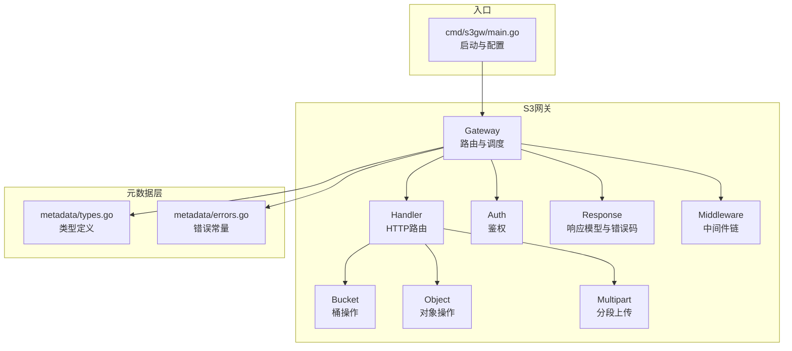
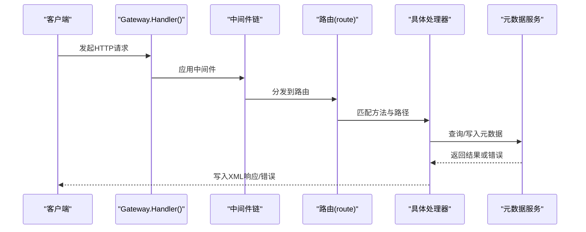
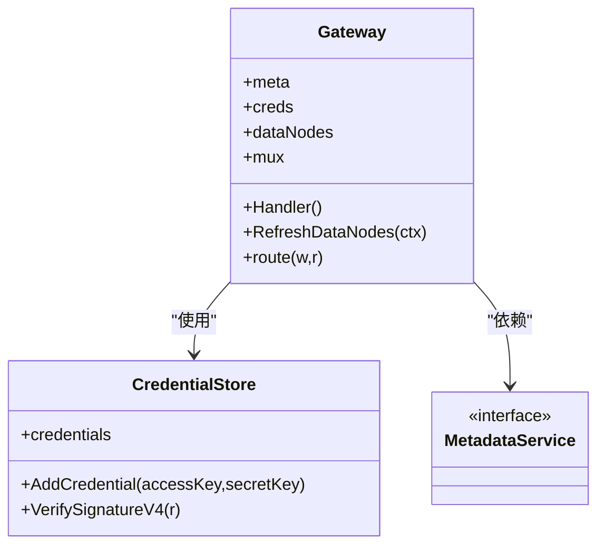

# S3 API接口

<cite>
**本文引用的文件**
- [nufs-core/gateway/s3/handler.go](file://nufs-core/gateway/s3/handler.go)
- [nufs-core/gateway/s3/bucket.go](file://nufs-core/gateway/s3/bucket.go)
- [nufs-core/gateway/s3/object.go](file://nufs-core/gateway/s3/object.go)
- [nufs-core/gateway/s3/multipart.go](file://nufs-core/gateway/s3/multipart.go)
- [nufs-core/gateway/s3/auth.go](file://nufs-core/gateway/s3/auth.go)
- [nufs-core/gateway/s3/response.go](file://nufs-core/gateway/s3/response.go)
- [nufs-core/gateway/s3/middleware.go](file://nufs-core/gateway/s3/middleware.go)
- [nufs-core/cmd/s3gw/main.go](file://nufs-core/cmd/s3gw/main.go)
- [nufs-core/metadata/types.go](file://nufs-core/metadata/types.go)
- [nufs-core/metadata/errors.go](file://nufs-core/metadata/errors.go)
- [nufs-core/gateway/s3/handler_test.go](file://nufs-core/gateway/s3/handler_test.go)
</cite>

## 目录
1. [简介](#简介)
2. [项目结构](#项目结构)
3. [核心组件](#核心组件)
4. [架构总览](#架构总览)
5. [详细组件分析](#详细组件分析)
6. [依赖关系分析](#依赖关系分析)
7. [性能考虑](#性能考虑)
8. [故障排查指南](#故障排查指南)
9. [结论](#结论)
10. [附录](#附录)

## 简介
本文件为 NUFS 的 S3 兼容 API 接口文档，覆盖以下能力：
- 桶操作：列出桶、创建桶、删除桶、桶存在性检查
- 对象操作：上传对象、下载对象、删除对象、对象存在性检查
- 分段上传：初始化上传、上传分片、完成上传、中止上传、列举分片与活动上传
- 认证机制：AWS Signature Version 4（含预签名 URL）
- CORS 配置：浏览器直连 S3 客户端的跨域支持
- 中间件链：请求ID注入、日志、CORS、鉴权、异常恢复
- 错误码映射与响应格式：统一的 XML 响应与状态码映射
- 使用示例与最佳实践：常见场景与性能优化建议

## 项目结构
S3 网关位于 nufs-core/gateway/s3，入口程序在 nufs-core/cmd/s3gw。元数据接口定义在 nufs-core/metadata。

图表来源
- [nufs-core/gateway/s3/handler.go:70-166](file://nufs-core/gateway/s3/handler.go#L70-L166)
- [nufs-core/gateway/s3/bucket.go:11-34](file://nufs-core/gateway/s3/bucket.go#L11-L34)
- [nufs-core/gateway/s3/object.go:17-95](file://nufs-core/gateway/s3/object.go#L17-L95)
- [nufs-core/gateway/s3/multipart.go:85-95](file://nufs-core/gateway/s3/multipart.go#L85-L95)
- [nufs-core/gateway/s3/auth.go:31-98](file://nufs-core/gateway/s3/auth.go#L31-L98)
- [nufs-core/gateway/s3/response.go:11-216](file://nufs-core/gateway/s3/response.go#L11-L216)
- [nufs-core/gateway/s3/middleware.go:11-93](file://nufs-core/gateway/s3/middleware.go#L11-L93)
- [nufs-core/cmd/s3gw/main.go:18-91](file://nufs-core/cmd/s3gw/main.go#L18-L91)
- [nufs-core/metadata/types.go:60-108](file://nufs-core/metadata/types.go#L60-L108)
- [nufs-core/metadata/errors.go:45-90](file://nufs-core/metadata/errors.go#L45-L90)

章节来源
- [nufs-core/gateway/s3/handler.go:11-184](file://nufs-core/gateway/s3/handler.go#L11-L184)
- [nufs-core/cmd/s3gw/main.go:18-91](file://nufs-core/cmd/s3gw/main.go#L18-L91)

## 核心组件
- 路由与调度：根据 URL 与 HTTP 方法分发到具体处理器
- 桶操作：列表、创建、删除、HEAD
- 对象操作：PUT/GET/DELETE/HEAD；支持 Range 下载与拷贝
- 分段上传：初始化、上传分片、完成、中止、列举
- 鉴权：AWS Signature Version 4 与预签名 URL
- 响应：统一 XML 结构与错误码映射
- 中间件：请求ID、日志、CORS、鉴权、异常恢复
- 元数据接口：桶、目录、文件、块、节点等抽象

章节来源
- [nufs-core/gateway/s3/handler.go:70-166](file://nufs-core/gateway/s3/handler.go#L70-L166)
- [nufs-core/gateway/s3/response.go:11-216](file://nufs-core/gateway/s3/response.go#L11-L216)
- [nufs-core/gateway/s3/middleware.go:11-111](file://nufs-core/gateway/s3/middleware.go#L11-L111)
- [nufs-core/metadata/types.go:30-108](file://nufs-core/metadata/types.go#L30-L108)

## 架构总览
S3 网关通过中间件链包装 ServeMux，按路径与方法分派到各处理器。处理器调用元数据服务进行命名空间与块管理，并返回标准 XML 响应或错误。

图表来源
- [nufs-core/gateway/s3/handler.go:46-54](file://nufs-core/gateway/s3/handler.go#L46-L54)
- [nufs-core/gateway/s3/middleware.go:88-93](file://nufs-core/gateway/s3/middleware.go#L88-L93)
- [nufs-core/gateway/s3/handler.go:81-166](file://nufs-core/gateway/s3/handler.go#L81-L166)

## 详细组件分析

### 路由与中间件链
- 路由规则基于 URL 路径与 HTTP 方法，支持服务级、桶级与对象级操作
- 中间件链顺序：恢复、请求ID、CORS、日志
- 鉴权中间件可选启用

章节来源
- [nufs-core/gateway/s3/handler.go:70-166](file://nufs-core/gateway/s3/handler.go#L70-L166)
- [nufs-core/gateway/s3/middleware.go:11-93](file://nufs-core/gateway/s3/middleware.go#L11-L93)

### 桶操作
- 列出桶：GET /
- 创建桶：PUT /{bucket}
- 删除桶：DELETE /{bucket}
- 桶存在性：HEAD /{bucket}

章节来源
- [nufs-core/gateway/s3/bucket.go:11-103](file://nufs-core/gateway/s3/bucket.go#L11-L103)

### 对象操作
- 上传对象：PUT /{bucket}/{key}
- 下载对象：GET /{bucket}/{key}（支持 Range）
- 删除对象：DELETE /{bucket}/{key}
- 对象存在性：HEAD /{bucket}/{key}
- 对象拷贝：PUT /{bucket}/{key}（带 X-Amz-Copy-Source）

章节来源
- [nufs-core/gateway/s3/object.go:17-208](file://nufs-core/gateway/s3/object.go#L17-L208)

### 分段上传
- 初始化上传：POST /{bucket}/{key}?uploads
- 上传分片：PUT /{bucket}/{key}?partNumber=&uploadId=
- 完成分片上传：POST /{bucket}/{key}?uploadId=（请求体为 CompleteMultipartUpload）
- 中止上传：DELETE /{bucket}/{key}?uploadId=
- 列举分片：GET /{bucket}/{key}?uploadId=
- 列举活动上传：GET /{bucket}?uploads

注意：当前实现使用内存跟踪上传会话，生产环境需持久化。

章节来源
- [nufs-core/gateway/s3/multipart.go:85-285](file://nufs-core/gateway/s3/multipart.go#L85-L285)

### 认证与CORS
- AWS Signature Version 4 验证，支持预签名 URL
- CORS 头部设置，允许常见 S3 请求头与方法
- 可配置匿名访问或启用鉴权

章节来源
- [nufs-core/gateway/s3/auth.go:31-121](file://nufs-core/gateway/s3/auth.go#L31-L121)
- [nufs-core/gateway/s3/middleware.go:35-70](file://nufs-core/gateway/s3/middleware.go#L35-L70)

### 响应模型与错误码
- 统一 XML 响应结构（列表、拷贝、分片等）
- 错误响应包含 Code、Message、Resource、RequestID
- 错误码映射到 HTTP 状态码

章节来源
- [nufs-core/gateway/s3/response.go:11-216](file://nufs-core/gateway/s3/response.go#L11-L216)

## 依赖关系分析

图表来源
- [nufs-core/gateway/s3/handler.go:13-33](file://nufs-core/gateway/s3/handler.go#L13-L33)
- [nufs-core/gateway/s3/auth.go:14-29](file://nufs-core/gateway/s3/auth.go#L14-L29)
- [nufs-core/metadata/types.go:60-66](file://nufs-core/metadata/types.go#L60-L66)

章节来源
- [nufs-core/gateway/s3/handler.go:13-33](file://nufs-core/gateway/s3/handler.go#L13-L33)
- [nufs-core/metadata/types.go:60-66](file://nufs-core/metadata/types.go#L60-L66)

## 性能考虑
- 单机限流：PUT/上传分片对请求体有上限限制，避免过大请求导致内存压力
- 分片合并：完成分片时按序合并，建议合理拆分分片大小以提升并发与可靠性
- Range 下载：服务端返回 Accept-Ranges 与 Content-Range，客户端可断点续传
- 数据节点：当前下载/上传为占位逻辑，生产需对接数据节点进行流式传输
- 中间件开销：日志与CORS会增加少量开销，建议在高吞吐场景评估

章节来源
- [nufs-core/gateway/s3/object.go:126-145](file://nufs-core/gateway/s3/object.go#L126-L145)
- [nufs-core/gateway/s3/multipart.go:117-137](file://nufs-core/gateway/s3/multipart.go#L117-L137)

## 故障排查指南
- 常见错误码与状态映射：参考错误码表与状态映射函数
- 鉴权失败：检查 Authorization 头或预签名参数是否正确
- CORS 问题：确认浏览器请求携带 Origin 并允许相应头部
- 上传/下载异常：查看中间件日志输出的请求方法、路径、状态与耗时
- 测试用例：可参考测试文件中的典型场景验证行为

章节来源
- [nufs-core/gateway/s3/response.go:128-215](file://nufs-core/gateway/s3/response.go#L128-L215)
- [nufs-core/gateway/s3/middleware.go:23-33](file://nufs-core/gateway/s3/middleware.go#L23-L33)
- [nufs-core/gateway/s3/handler_test.go:374-800](file://nufs-core/gateway/s3/handler_test.go#L374-L800)

## 结论
NUFS S3 网关实现了核心的 S3 兼容接口，覆盖桶与对象的基本操作以及分段上传流程。通过中间件链提供统一的请求处理、CORS 支持与鉴权能力。生产部署建议：
- 启用鉴权并配置密钥
- 将分段上传会话持久化
- 实现与数据节点的流式读写
- 在高并发场景下评估中间件与网络栈开销

[无需章节来源]

## 附录

### API 端点一览与规范

- 服务级
  - GET / → 列出所有桶
    - 请求参数：无
    - 响应：ListAllMyBucketsResult
    - 错误：内部错误
  - 示例：参见测试用例中的“列出桶”场景
    - 章节来源
      - [nufs-core/gateway/s3/handler_test.go:375-397](file://nufs-core/gateway/s3/handler_test.go#L375-L397)

- 桶级
  - GET /{bucket} → 列举对象（支持前缀、分隔符、最大数量、V2参数）
    - 查询参数：prefix、delimiter、marker、max-keys、list-type=2、start-after、continuation-token
    - 响应：ListBucketResult
    - 错误：桶不存在、内部错误
  - PUT /{bucket} → 创建桶
    - 请求：无
    - 响应：200，Location 头
    - 错误：桶已存在、内部错误
  - DELETE /{bucket} → 删除桶
    - 请求：无
    - 响应：204，若非空则 409（BucketNotEmpty）
    - 错误：桶不存在、内部错误
  - HEAD /{bucket} → 桶存在性检查
    - 响应：200 或 404
    - 特殊头：x-amz-bucket-region
  - POST /{bucket}?delete → 批量删除（占位）
    - 响应：200
  - 示例：参见测试用例中的“创建/删除/HEAD/列举对象”
    - 章节来源
      - [nufs-core/gateway/s3/handler_test.go:399-481](file://nufs-core/gateway/s3/handler_test.go#L399-L481)
      - [nufs-core/gateway/s3/handler_test.go:483-506](file://nufs-core/gateway/s3/handler_test.go#L483-L506)
      - [nufs-core/gateway/s3/handler_test.go:636-671](file://nufs-core/gateway/s3/handler_test.go#L636-L671)

- 对象级
  - PUT /{bucket}/{key} → 上传对象
    - 请求体：对象内容（有大小限制）
    - 响应：200，ETag 头
    - 错误：桶不存在、内部错误
  - GET /{bucket}/{key} → 下载对象（支持 Range）
    - 头：Range: bytes=start-end
    - 响应：200 或 206，Content-Range、Accept-Ranges
    - 错误：键不存在、内部错误
  - DELETE /{bucket}/{key} → 删除对象（键不存在返回 204）
    - 响应：204
    - 错误：内部错误
  - HEAD /{bucket}/{key} → 对象存在性与元信息
    - 响应：200，Content-Length、ETag、Last-Modified、Accept-Ranges
    - 错误：键不存在、内部错误
  - PUT /{bucket}/{key}（带 X-Amz-Copy-Source）→ 拷贝对象
    - 响应：CopyObjectResult
    - 错误：源桶/键不存在、内部错误
  - 示例：参见测试用例中的“上传/下载/删除/HEAD/拷贝”
    - 章节来源
      - [nufs-core/gateway/s3/handler_test.go:520-559](file://nufs-core/gateway/s3/handler_test.go#L520-L559)
      - [nufs-core/gateway/s3/handler_test.go:561-579](file://nufs-core/gateway/s3/handler_test.go#L561-L579)
      - [nufs-core/gateway/s3/handler_test.go:581-634](file://nufs-core/gateway/s3/handler_test.go#L581-L634)
      - [nufs-core/gateway/s3/handler_test.go:520-559](file://nufs-core/gateway/s3/handler_test.go#L520-L559)

- 分段上传
  - POST /{bucket}/{key}?uploads → 初始化上传
    - 响应：InitiateMultipartUploadResult
  - PUT /{bucket}/{key}?partNumber=&uploadId= → 上传分片
    - 响应：200，ETag 头
  - POST /{bucket}/{key}?uploadId= → 完成分片上传（请求体为 CompleteMultipartUpload）
    - 响应：CompleteMultipartUploadResult
  - DELETE /{bucket}/{key}?uploadId= → 中止上传
    - 响应：204
  - GET /{bucket}/{key}?uploadId= → 列举分片
    - 响应：ListPartsResult
  - GET /{bucket}?uploads → 列举活动上传
    - 响应：ListMultipartUploadsResult
  - 示例：参见测试用例中的“分段上传/列举/完成/中止”
    - 章节来源
      - [nufs-core/gateway/s3/handler_test.go:673-751](file://nufs-core/gateway/s3/handler_test.go#L673-L751)
      - [nufs-core/gateway/s3/handler_test.go:753-787](file://nufs-core/gateway/s3/handler_test.go#L753-L787)

### 认证机制（AWS Signature Version 4）
- 支持 Authorization 头与预签名 URL
- 校验 Credential、SignedHeaders、Signature、日期范围
- 未知 AccessKey 或签名不匹配返回 403

章节来源
- [nufs-core/gateway/s3/auth.go:31-121](file://nufs-core/gateway/s3/auth.go#L31-L121)

### CORS 配置
- 默认允许来源为请求 Origin，若缺失则为 *
- 允许方法：GET、PUT、POST、DELETE、HEAD、OPTIONS
- 允许头：Authorization、Content-Type、X-Amz-Date、X-Amz-Content-Sha256、x-amz-request-id
- 预检请求返回 200

章节来源
- [nufs-core/gateway/s3/middleware.go:35-56](file://nufs-core/gateway/s3/middleware.go#L35-L56)

### 中间件链处理流程
- RecoveryMiddleware：捕获 panic，返回 500
- RequestIDMiddleware：注入 x-amz-request-id 与 x-amz-id-2
- CORSMiddleware：设置 CORS 头与 OPTIONS 预检
- LoggingMiddleware：记录方法、路径、状态、耗时、远端地址
- AuthMiddleware：可选鉴权

章节来源
- [nufs-core/gateway/s3/middleware.go:11-111](file://nufs-core/gateway/s3/middleware.go#L11-L111)

### 错误码与响应格式
- 错误响应结构：包含 Code、Message、Resource、RequestID
- 常用错误码：NoSuchBucket、BucketAlreadyExists、BucketNotEmpty、NoSuchKey、InvalidArgument、InvalidRequest、InternalError、AccessDenied、NoSuchUpload、InvalidPart、MethodNotAllowed、NotImplemented
- 状态码映射：按错误码映射到 404/409/403/400/500 等

章节来源
- [nufs-core/gateway/s3/response.go:128-215](file://nufs-core/gateway/s3/response.go#L128-L215)

### 元数据类型与错误
- 桶信息：名称、根 inode、策略、创建时间
- inode：类型、大小、链接数、权限、时间戳、块映射
- 块元数据：ID、大小、状态、副本、EC组、校验和
- 常见错误：桶已存在/不存在/非空、条目已存在/不存在、块未封存/校验和不匹配、节点离线/不足、内部错误等

章节来源
- [nufs-core/metadata/types.go:60-108](file://nufs-core/metadata/types.go#L60-L108)
- [nufs-core/metadata/errors.go:45-90](file://nufs-core/metadata/errors.go#L45-L90)

### 请求/响应示例（路径指引）
- 列出桶：[nufs-core/gateway/s3/handler_test.go:375-397](file://nufs-core/gateway/s3/handler_test.go#L375-L397)
- 创建/删除/HEAD 桶：[nufs-core/gateway/s3/handler_test.go:399-506](file://nufs-core/gateway/s3/handler_test.go#L399-L506)
- 上传/下载/删除/HEAD 对象：[nufs-core/gateway/s3/handler_test.go:520-634](file://nufs-core/gateway/s3/handler_test.go#L520-L634)
- 拷贝对象：[nufs-core/gateway/s3/handler_test.go:520-559](file://nufs-core/gateway/s3/handler_test.go#L520-L559)
- 列举对象（V1/V2）：[nufs-core/gateway/s3/handler_test.go:636-671](file://nufs-core/gateway/s3/handler_test.go#L636-L671)
- 分段上传（初始化/上传分片/完成/中止/列举）：[nufs-core/gateway/s3/handler_test.go:673-787](file://nufs-core/gateway/s3/handler_test.go#L673-L787)
- CORS 头部验证：[nufs-core/gateway/s3/handler_test.go:789-800](file://nufs-core/gateway/s3/handler_test.go#L789-L800)