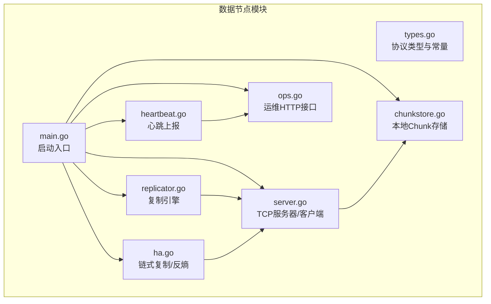
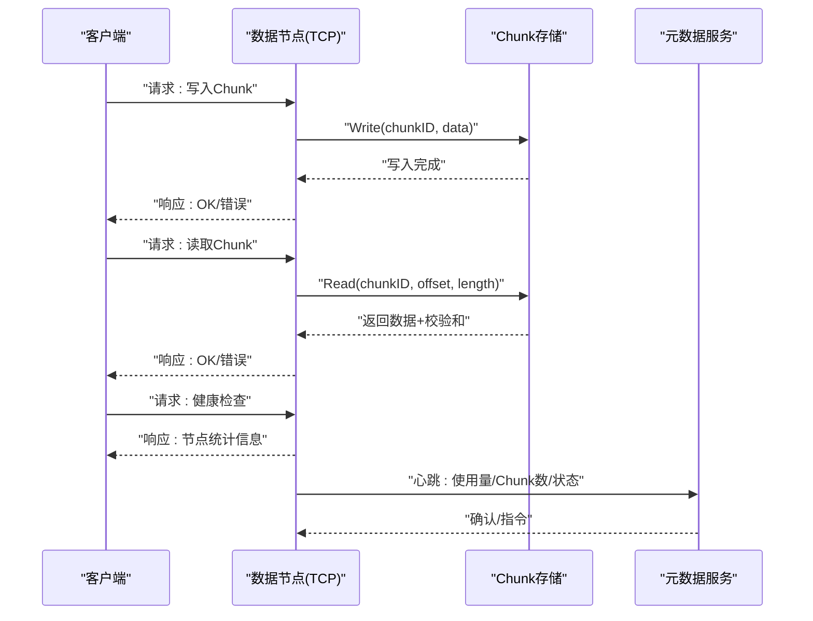
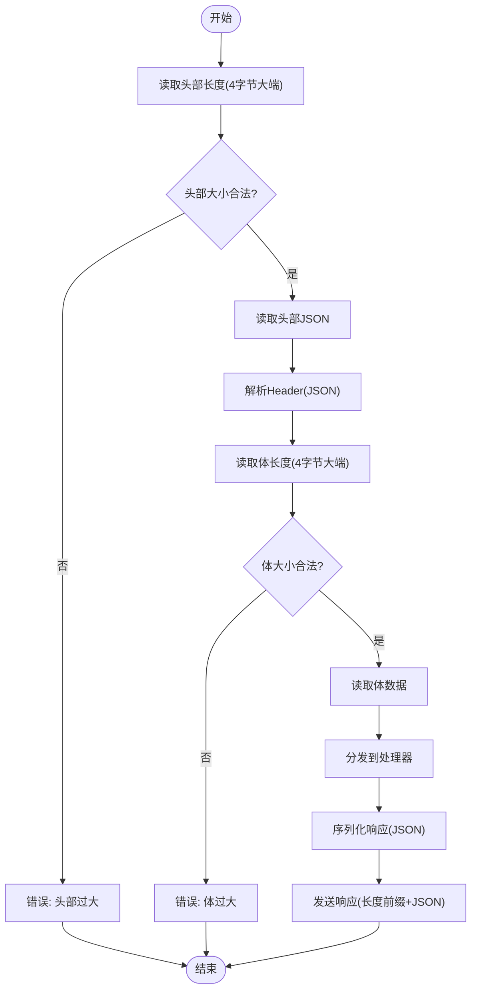
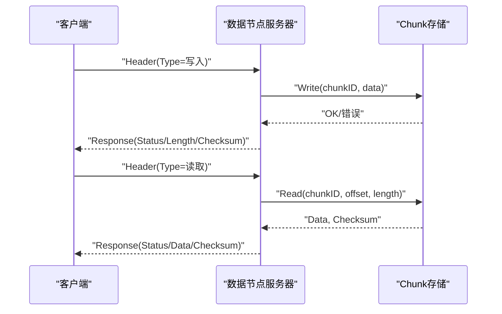
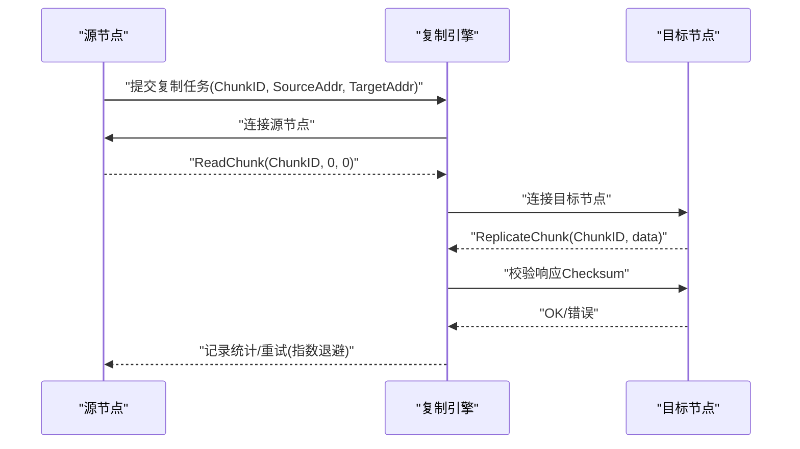
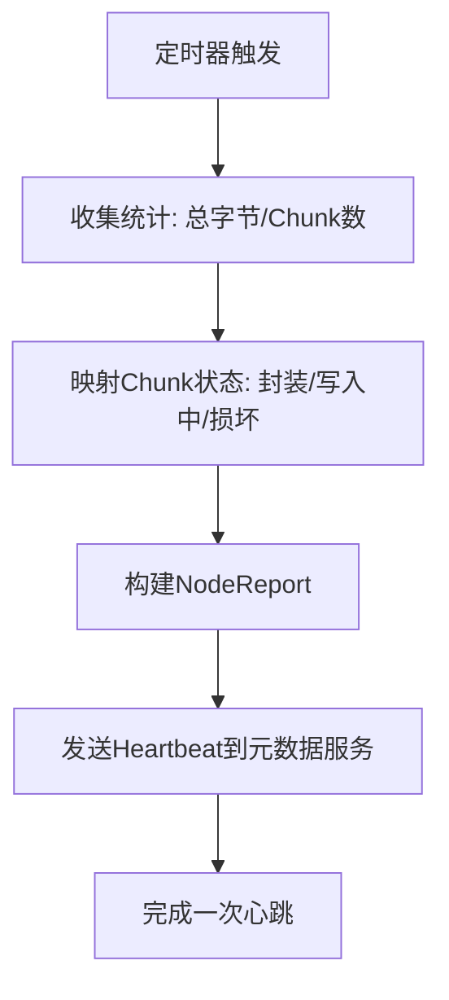
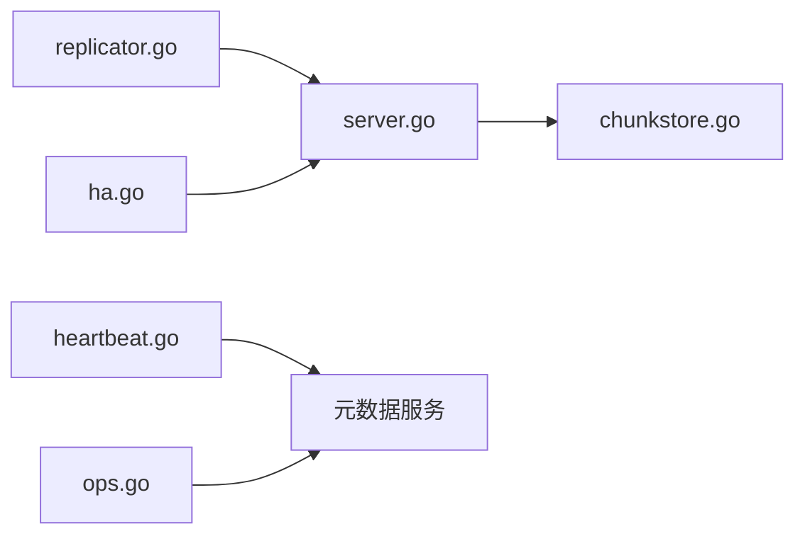

# 数据节点协议

<cite>
**本文档引用的文件**
- [server.go](file://nufs-core/datanode/server.go)
- [types.go](file://nufs-core/datanode/types.go)
- [chunkstore.go](file://nufs-core/datanode/chunkstore.go)
- [replicator.go](file://nufs-core/datanode/replicator.go)
- [heartbeat.go](file://nufs-core/datanode/heartbeat.go)
- [ops.go](file://nufs-core/datanode/ops.go)
- [repair.go](file://nufs-core/datanode/repair.go)
- [ha.go](file://nufs-core/datanode/ha.go)
- [main.go](file://nufs-core/cmd/datanode/main.go)
- [server_test.go](file://nufs-core/datanode/server_test.go)
- [replicator_test.go](file://nufs-core/datanode/replicator_test.go)
</cite>

## 目录
1. [简介](#简介)
2. [项目结构](#项目结构)
3. [核心组件](#核心组件)
4. [架构总览](#架构总览)
5. [详细组件分析](#详细组件分析)
6. [依赖关系分析](#依赖关系分析)
7. [性能考虑](#性能考虑)
8. [故障排查指南](#故障排查指南)
9. [结论](#结论)
10. [附录](#附录)

## 简介
本文件为NUFS数据节点通信协议的技术文档，聚焦于数据节点之间的TCP通信协议格式、数据帧结构、二进制编码规则，以及所有数据节点操作类型（Chunk读写、复制协议、心跳检测、状态同步等）。文档还说明了消息格式、字段定义、序列化方式、错误处理机制，并提供了客户端与数据节点的交互流程示例，涵盖数据上传时的Chunk分配、复制过程中的数据传输、故障恢复时的状态同步等。最后给出协议实现示例、调试方法及网络异常处理、超时重试机制和连接池管理建议。

## 项目结构
数据节点协议主要位于nufs-core/datanode目录中，核心文件包括：
- 协议与类型定义：types.go
- TCP服务器与客户端：server.go
- Chunk存储与磁盘布局：chunkstore.go
- 复制与修复：replicator.go、repair.go、ha.go
- 心跳上报：heartbeat.go
- 运维HTTP接口：ops.go
- 启动入口：cmd/datanode/main.go
- 测试用例：server_test.go、replicator_test.go

图表来源
- [server.go:1-462](file://nufs-core/datanode/server.go#L1-L462)
- [types.go:1-171](file://nufs-core/datanode/types.go#L1-L171)
- [chunkstore.go:1-395](file://nufs-core/datanode/chunkstore.go#L1-L395)
- [replicator.go:1-192](file://nufs-core/datanode/replicator.go#L1-L192)
- [heartbeat.go:1-107](file://nufs-core/datanode/heartbeat.go#L1-L107)
- [ops.go:1-318](file://nufs-core/datanode/ops.go#L1-L318)
- [ha.go:1-402](file://nufs-core/datanode/ha.go#L1-L402)
- [main.go:1-134](file://nufs-core/cmd/datanode/main.go#L1-L134)

章节来源
- [server.go:1-462](file://nufs-core/datanode/server.go#L1-L462)
- [types.go:1-171](file://nufs-core/datanode/types.go#L1-L171)
- [main.go:1-134](file://nufs-core/cmd/datanode/main.go#L1-L134)

## 核心组件
- 协议类型与常量：定义请求类型、响应状态、Header/Response结构体、磁盘文件头格式等。
- TCP服务器：监听端口、接收请求、分发到对应处理器、写出响应。
- 客户端：用于节点间复制、读取Chunk数据。
- Chunk存储：负责本地磁盘读写、校验和计算、元信息维护。
- 复制引擎：异步复制任务队列、工作协程、指数退避重试。
- 心跳上报：周期性向元数据服务发送节点状态、Chunk状态。
- 链式复制与反熵：链式写入策略、一致性读取、后台一致性检查与修复。
- 运维HTTP接口：集群状态、节点管理、Chunk校验、修复队列、指标查询。

章节来源
- [types.go:72-171](file://nufs-core/datanode/types.go#L72-L171)
- [server.go:18-271](file://nufs-core/datanode/server.go#L18-L271)
- [chunkstore.go:18-395](file://nufs-core/datanode/chunkstore.go#L18-L395)
- [replicator.go:23-192](file://nufs-core/datanode/replicator.go#L23-L192)
- [heartbeat.go:12-107](file://nufs-core/datanode/heartbeat.go#L12-L107)
- [ops.go:19-318](file://nufs-core/datanode/ops.go#L19-L318)
- [ha.go:16-402](file://nufs-core/datanode/ha.go#L16-L402)

## 架构总览
数据节点通过TCP提供Chunk读写、复制、健康检查等RPC能力；同时通过心跳上报节点状态，通过运维HTTP接口提供管理功能。复制引擎支持异步复制与链式复制，反熵引擎定期进行一致性检查与修复。

图表来源
- [server.go:102-271](file://nufs-core/datanode/server.go#L102-L271)
- [chunkstore.go:73-227](file://nufs-core/datanode/chunkstore.go#L73-L227)
- [heartbeat.go:71-100](file://nufs-core/datanode/heartbeat.go#L71-L100)

## 详细组件分析

### 协议格式与二进制编码
- 消息格式（长度前缀+JSON头+二进制体）
  - 头部长度：4字节大端无符号整型
  - 头部内容：Header的JSON序列化
  - 体长度：4字节大端无符号整型
  - 体内容：请求体或响应体数据
- Header字段
  - type：请求类型（写/读/删/复制/信息/列表/健康）
  - chunk_id：Chunk标识
  - offset：字节偏移（读取时使用）
  - length：数据长度（0表示整个Chunk）
  - checksum：CRC32C校验和（写入/复制时携带）
  - request_id：请求序号（用于关联请求与响应）
  - extra：扩展字段（可选）
- Response字段
  - request_id：回显请求ID
  - status：状态码（OK/错误/未找到/满/忙）
  - error：错误信息（可选）
  - data：响应数据（可选）
  - length：数据长度
  - checksum：返回数据的CRC32C校验和
- 二进制Chunk文件头
  - 魔数："DFS\x01"
  - chunk_id：8字节大端无符号整型
  - data_length：4字节大端无符号整型
  - crc32c_checksum：4字节大端无符号整型
  - 数据区：原始数据

图表来源
- [server.go:281-337](file://nufs-core/datanode/server.go#L281-L337)
- [types.go:87-107](file://nufs-core/datanode/types.go#L87-L107)
- [types.go:120-146](file://nufs-core/datanode/types.go#L120-L146)

章节来源
- [server.go:273-337](file://nufs-core/datanode/server.go#L273-L337)
- [types.go:72-146](file://nufs-core/datanode/types.go#L72-L146)

### 请求类型与处理流程
- 写入Chunk（ReqWriteChunk）
  - 校验请求头checksum（可选）
  - 调用ChunkStore.Write写入磁盘
  - 返回长度与状态
- 读取Chunk（ReqReadChunk）
  - 调用ChunkStore.Read读取指定范围
  - 返回数据与校验和
- 删除Chunk（ReqDeleteChunk）
  - 调用ChunkStore.Delete删除
- 复制Chunk（ReqReplicateChunk）
  - 类似写入但标记为副本
- 获取Chunk信息（ReqChunkInfo）
  - 返回本地Chunk元信息JSON
- 列出Chunk（ReqListChunks）
  - 返回本地Chunk列表JSON
- 健康检查（ReqHealth）
  - 返回节点统计信息JSON

图表来源
- [server.go:102-271](file://nufs-core/datanode/server.go#L102-L271)
- [chunkstore.go:73-227](file://nufs-core/datanode/chunkstore.go#L73-L227)

章节来源
- [server.go:102-271](file://nufs-core/datanode/server.go#L102-L271)
- [chunkstore.go:73-227](file://nufs-core/datanode/chunkstore.go#L73-L227)

### 复制协议与链式复制
- 异步复制（Replicator）
  - 任务队列：1024容量
  - 工作协程：并发执行复制任务
  - 指数退避重试：最多3次（1s, 2s, 4s）
  - 支持提交多目标复制与修复
- 链式复制（ChainReplicator）
  - 写路径：Head→Node2→Node3→Tail，同步确认
  - 读路径：就近读取，优先尾节点保证强一致
  - 失败处理：头节点失败切换新头，中间节点失败跳过，尾节点失败则前一节点成为新尾
- 反熵（AntiEntropy）
  - 周期性扫描本地Chunk与元数据一致性
  - 不一致时触发从健康副本修复

图表来源
- [replicator.go:65-174](file://nufs-core/datanode/replicator.go#L65-L174)
- [ha.go:16-246](file://nufs-core/datanode/ha.go#L16-L246)

章节来源
- [replicator.go:23-192](file://nufs-core/datanode/replicator.go#L23-L192)
- [ha.go:16-402](file://nufs-core/datanode/ha.go#L16-L402)

### 心跳检测与状态同步
- 心跳上报周期：由配置控制，默认10秒
- 上报内容：已用容量、Chunk数量、磁盘IO利用率、各Chunk状态映射
- Chunk状态映射：密封=就绪，写入中=同步中，损坏=失败
- 运维HTTP接口提供健康检查与指标查询

图表来源
- [heartbeat.go:52-100](file://nufs-core/datanode/heartbeat.go#L52-L100)
- [ops.go:209-298](file://nufs-core/datanode/ops.go#L209-L298)

章节来源
- [heartbeat.go:12-107](file://nufs-core/datanode/heartbeat.go#L12-L107)
- [ops.go:19-318](file://nufs-core/datanode/ops.go#L19-L318)

### 错误处理机制
- 协议层
  - 头部/体大小限制，防止内存溢出
  - JSON解析失败返回错误
  - 读写失败返回错误响应
- 存储层
  - Chunk不存在返回未找到状态
  - 写入/读取/封印失败返回错误
- 复制层
  - 连接失败、读取失败、写入失败均触发重试
  - 校验和不匹配返回错误
- 心跳层
  - 发送失败记录日志，不影响主流程

章节来源
- [server.go:281-337](file://nufs-core/datanode/server.go#L281-L337)
- [chunkstore.go:169-296](file://nufs-core/datanode/chunkstore.go#L169-L296)
- [replicator.go:106-174](file://nufs-core/datanode/replicator.go#L106-L174)

### 客户端交互流程示例
- 数据上传时的Chunk分配
  - 客户端向元数据服务申请ChunkID与放置策略
  - 元数据返回ChunkID与目标节点列表
  - 客户端按链式复制策略写入Head节点，后续节点按顺序同步
- 复制过程中的数据传输
  - 源节点读取完整Chunk数据
  - 目标节点以ReplicateChunk写入
  - 校验和验证一致性
- 故障恢复时的状态同步
  - 反熵扫描发现不一致
  - 触发从健康副本复制
  - 更新元数据状态

章节来源
- [server_test.go:14-403](file://nufs-core/datanode/server_test.go#L14-L403)
- [replicator_test.go:31-282](file://nufs-core/datanode/replicator_test.go#L31-L282)
- [ha.go:285-342](file://nufs-core/datanode/ha.go#L285-L342)

## 依赖关系分析
- server依赖chunkstore进行磁盘读写
- replicator通过server客户端发起跨节点读写
- heartbeat通过元数据服务上报节点状态
- ops通过元数据服务查询节点/桶/Chunk信息
- ha协调链式复制与反熵策略

图表来源
- [server.go:18-271](file://nufs-core/datanode/server.go#L18-L271)
- [chunkstore.go:18-395](file://nufs-core/datanode/chunkstore.go#L18-L395)
- [replicator.go:23-192](file://nufs-core/datanode/replicator.go#L23-L192)
- [heartbeat.go:12-107](file://nufs-core/datanode/heartbeat.go#L12-L107)
- [ops.go:19-318](file://nufs-core/datanode/ops.go#L19-L318)
- [ha.go:16-402](file://nufs-core/datanode/ha.go#L16-L402)

## 性能考虑
- 并发控制
  - ChunkStore对写/读分别设置信号量，避免资源争用
- 背压与限流
  - 复制队列容量1024，防止复制风暴
  - 指数退避重试降低瞬时压力
- 序列化开销
  - Header使用JSON，Response使用JSON，适合小对象
  - 大数据体直接二进制传输，减少序列化成本
- 磁盘I/O
  - 写入后fsync确保持久化
  - 分片目录避免单目录文件过多

章节来源
- [chunkstore.go:29-51](file://nufs-core/datanode/chunkstore.go#L29-L51)
- [replicator.go:48-75](file://nufs-core/datanode/replicator.go#L48-L75)

## 故障排查指南
- 协议层面
  - 检查头部/体长度是否超过限制
  - 校验Header JSON解析是否成功
- 存储层面
  - 确认Chunk文件头魔数与长度字段正确
  - 校验写入后fsync是否成功
- 复制层面
  - 查看复制队列是否积压
  - 关注重试次数与退避时间
- 心跳层面
  - 检查心跳间隔与上报内容
  - 关注元数据服务可达性

章节来源
- [server.go:281-337](file://nufs-core/datanode/server.go#L281-L337)
- [chunkstore.go:325-351](file://nufs-core/datanode/chunkstore.go#L325-L351)
- [replicator.go:106-174](file://nufs-core/datanode/replicator.go#L106-L174)
- [heartbeat.go:71-100](file://nufs-core/datanode/heartbeat.go#L71-L100)

## 结论
NUFS数据节点采用简洁可靠的TCP协议，结合Chunk二进制文件头与JSON头部，实现了高效、可扩展的分布式存储通信。通过链式复制与反熵机制，系统在可用性与一致性之间取得平衡；通过心跳与运维接口，提供可观测性与可治理能力。建议在生产环境中配合连接池、超时控制与监控告警，进一步提升稳定性与可维护性。

## 附录

### 协议字段定义与示例路径
- Header字段定义：[types.go:87-97](file://nufs-core/datanode/types.go#L87-L97)
- Response字段定义：[types.go:99-107](file://nufs-core/datanode/types.go#L99-L107)
- 请求类型枚举：[types.go:77-85](file://nufs-core/datanode/types.go#L77-L85)
- 响应状态枚举：[types.go:112-118](file://nufs-core/datanode/types.go#L112-L118)
- Chunk文件头格式：[types.go:128-146](file://nufs-core/datanode/types.go#L128-L146)

### 实现示例与测试参考
- 写读循环测试：[server_test.go:14-70](file://nufs-core/datanode/server_test.go#L14-L70)
- 健康检查测试：[server_test.go:103-145](file://nufs-core/datanode/server_test.go#L103-L145)
- 大Chunk传输测试：[server_test.go:147-193](file://nufs-core/datanode/server_test.go#L147-L193)
- 多Chunk并发读测试：[server_test.go:333-402](file://nufs-core/datanode/server_test.go#L333-L402)
- 复制流程测试：[server_test.go:247-331](file://nufs-core/datanode/server_test.go#L247-L331)
- 复制引擎基本功能测试：[replicator_test.go:31-101](file://nufs-core/datanode/replicator_test.go#L31-L101)
- 多目标复制测试：[replicator_test.go:103-148](file://nufs-core/datanode/replicator_test.go#L103-L148)
- 失败重试测试：[replicator_test.go:150-185](file://nufs-core/datanode/replicator_test.go#L150-L185)
- 修复测试：[replicator_test.go:187-224](file://nufs-core/datanode/replicator_test.go#L187-L224)

### 调试方法与建议
- 网络异常处理
  - 连接失败：检查地址与防火墙，记录错误原因
  - 读写超时：调整超时参数，增加重试
  - EOF：连接被对端关闭，需重建连接
- 超时重试机制
  - 复制：指数退避（1s, 2s, 4s），最多3次
  - 心跳：固定间隔，失败记录日志
- 连接池管理
  - 为每个目标节点维护少量长连接
  - 超时后自动回收，避免连接泄漏
  - 统计连接数与错误率，动态调节