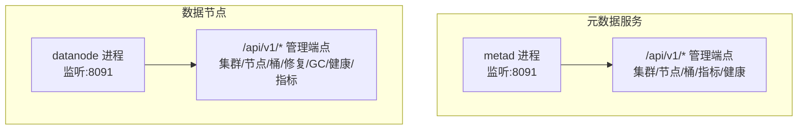
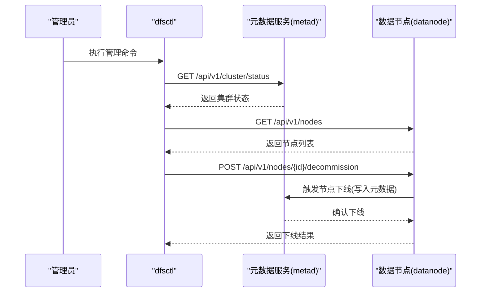
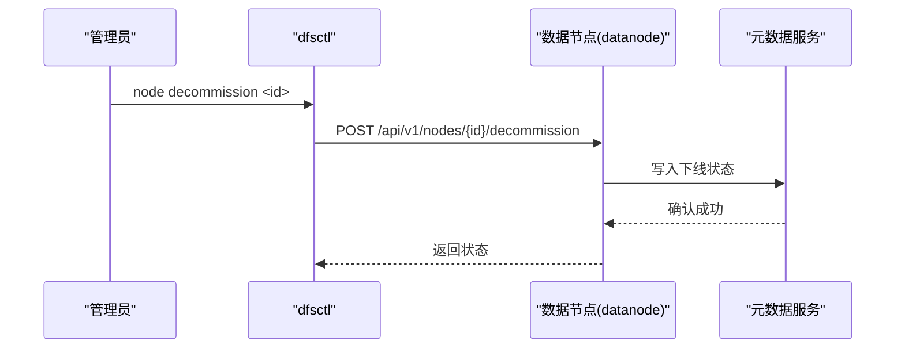
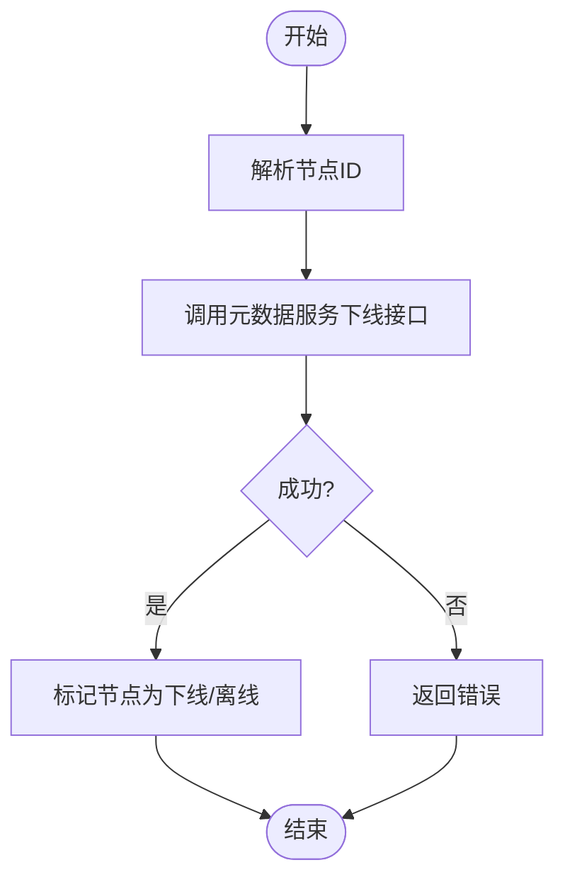
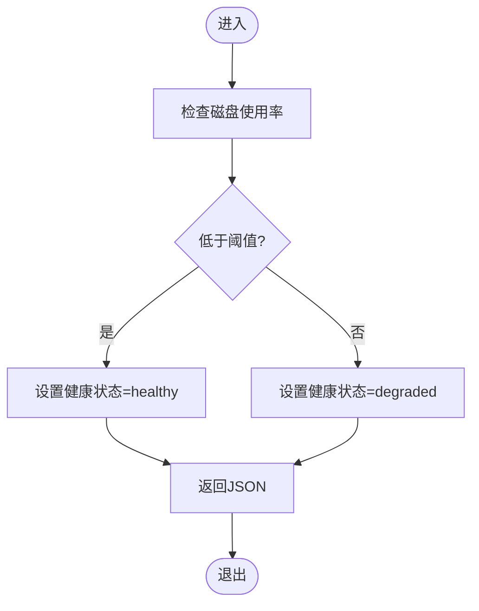
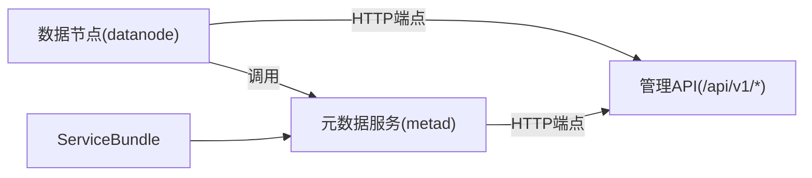

# 管理API

<cite>
**本文引用的文件**
- [nufs-core/cmd/dfsctl/main.go](file://nufs-core/cmd/dfsctl/main.go)
- [nufs-core/cmd/metad/main.go](file://nufs-core/cmd/metad/main.go)
- [nufs-core/datanode/ops.go](file://nufs-core/datanode/ops.go)
- [nufs-core/metadata/service.go](file://nufs-core/metadata/service.go)
- [nufs-core/metadata/health.go](file://nufs-core/metadata/health.go)
- [nufs-core/metadata/types.go](file://nufs-core/metadata/types.go)
- [nufs-core/metadata/errors.go](file://nufs-core/metadata/errors.go)
- [nufs-core/metadata/production.go](file://nufs-core/metadata/production.go)
- [nufs-core/datanode/server.go](file://nufs-core/datanode/server.go)
</cite>

## 目录
1. [简介](#简介)
2. [项目结构](#项目结构)
3. [核心组件](#核心组件)
4. [架构总览](#架构总览)
5. [详细组件分析](#详细组件分析)
6. [依赖关系分析](#依赖关系分析)
7. [性能考量](#性能考量)
8. [故障排查指南](#故障排查指南)
9. [结论](#结论)
10. [附录](#附录)

## 简介
本文件面向NUFS管理与运维团队，系统化梳理管理API的设计与使用，覆盖集群状态查询、节点管理、配置更新、健康检查、运维操作（扩容缩容、节点上下线、数据迁移）以及最佳实践（批量操作、权限控制、审计日志）。同时给出dfsctl命令行工具的使用方法与参数说明，并总结安全与访问控制建议。

## 项目结构
NUFS管理API由两类服务构成：
- 元数据服务（metad）：提供统一的元数据操作与健康/就绪探针，暴露管理HTTP接口。
- 数据节点（datanode）：提供数据节点的管理HTTP接口（ops API），用于节点状态、复制、修复、健康检查等。

图表来源
- [nufs-core/cmd/metad/main.go:107-212](file://nufs-core/cmd/metad/main.go#L107-L212)
- [nufs-core/datanode/ops.go:45-71](file://nufs-core/datanode/ops.go#L45-L71)

章节来源
- [nufs-core/cmd/metad/main.go:107-212](file://nufs-core/cmd/metad/main.go#L107-L212)
- [nufs-core/datanode/ops.go:45-71](file://nufs-core/datanode/ops.go#L45-L71)

## 核心组件
- 元数据服务（metad）
  - 提供健康/就绪探针与管理API（/api/v1/*）。
  - 支持Raft一致性（可选），通过ServiceBundle组合事件总线、指标、健康检查、租约、GC、擦洗、生命周期引擎与Raft节点。
- 数据节点ops服务器（datanode）
  - 提供节点级管理API，包括集群状态、节点列表、节点下线、桶列表、修复队列、GC扫描、健康与指标。
- 命令行工具
  - dfsctl：管理端命令行工具，默认连接本地8091端口，支持集群信息、节点列表/下线、桶列表/创建、修复队列、GC扫描、指标、健康检查。
  - ctl：元数据侧CLI，支持节点列表、桶列表、重平衡计划、触发重平衡、下线节点、修复队列、查看Raft Leader等。

章节来源
- [nufs-core/cmd/metad/main.go:107-212](file://nufs-core/cmd/metad/main.go#L107-L212)
- [nufs-core/datanode/ops.go:45-71](file://nufs-core/datanode/ops.go#L45-L71)
- [nufs-core/cmd/dfsctl/main.go:30-77](file://nufs-core/cmd/dfsctl/main.go#L30-L77)
- [nufs-core/cmd/ctl/main.go:17-84](file://nufs-core/cmd/ctl/main.go#L17-L84)

## 架构总览
管理API采用“元数据服务 + 数据节点ops”的双栈架构：
- 元数据服务负责全局一致性与元数据操作，提供健康/就绪探针与管理端点。
- 数据节点ops负责节点级运维能力（复制、修复、GC、健康检查、指标）。

图表来源
- [nufs-core/cmd/dfsctl/main.go:81-117](file://nufs-core/cmd/dfsctl/main.go#L81-L117)
- [nufs-core/datanode/ops.go:144-159](file://nufs-core/datanode/ops.go#L144-L159)

## 详细组件分析

### 管理端点定义与行为
- 元数据服务（metad）
  - GET /api/v1/cluster/status：返回集群状态（当前节点是否为Leader、版本、Raft模式等）。
  - GET /api/v1/nodes：返回所有节点信息（ID、地址、机架、可用区、容量、使用量、状态等）。
  - GET /api/v1/buckets：返回桶名称列表。
  - GET /api/v1/metrics：返回元数据服务指标快照。
  - GET /health、GET /ready：健康与就绪探针。
- 数据节点ops
  - GET /api/v1/cluster/status：返回节点级集群状态（节点ID、状态、地址、磁盘统计、复制统计、反熵统计）。
  - GET /api/v1/nodes：返回节点列表。
  - POST /api/v1/nodes/{id}/decommission：标记节点进入下线流程（写入元数据）。
  - GET /api/v1/buckets：返回桶列表。
  - GET /api/v1/repair/queue：返回待处理修复任务队列。
  - POST /api/v1/gc/scan：触发孤儿块扫描（占位实现）。
  - GET /api/v1/metrics：返回节点级指标（磁盘、缓存、复制、反熵）。
  - GET /api/v1/health：返回节点健康状态（基于磁盘使用率阈值判断）。

章节来源
- [nufs-core/cmd/metad/main.go:172-211](file://nufs-core/cmd/metad/main.go#L172-L211)
- [nufs-core/datanode/ops.go:45-71](file://nufs-core/datanode/ops.go#L45-L71)
- [nufs-core/datanode/ops.go:115-159](file://nufs-core/datanode/ops.go#L115-L159)
- [nufs-core/datanode/ops.go:200-227](file://nufs-core/datanode/ops.go#L200-L227)
- [nufs-core/datanode/ops.go:254-298](file://nufs-core/datanode/ops.go#L254-L298)

### HTTP管理接口规范
- 统一响应
  - Content-Type: application/json
  - 成功：200 OK；部分端点在降级时返回200但内部状态字段提示degraded；不支持的方法返回405。
- 请求与响应要点
  - 节点下线：POST /api/v1/nodes/{id}/decommission，成功返回包含状态与节点ID的对象。
  - 修复队列：GET /api/v1/repair/queue，返回任务数组（chunk_id、reason、priority、created_at）。
  - GC扫描：POST /api/v1/gc/scan，返回扫描完成与孤儿块计数。
  - 指标：GET /api/v1/metrics，返回磁盘、缓存、复制、反熵等统计。
  - 健康：GET /api/v1/health，返回状态、节点ID、磁盘与元数据健康标志。

章节来源
- [nufs-core/datanode/ops.go:144-159](file://nufs-core/datanode/ops.go#L144-L159)
- [nufs-core/datanode/ops.go:200-227](file://nufs-core/datanode/ops.go#L200-L227)
- [nufs-core/datanode/ops.go:254-298](file://nufs-core/datanode/ops.go#L254-L298)

### dfsctl 命令行工具
- 默认连接地址：http://localhost:8091
- 支持命令
  - cluster info：显示集群状态。
  - node list：列出节点。
  - node decommission <id>：对指定节点发起下线。
  - bucket list：列出桶。
  - bucket create <name>：创建桶（演示输出）。
  - repair queue：显示修复队列。
  - gc scan：触发孤儿块扫描。
  - metrics：显示节点指标。
  - health：检查节点健康。
- 参数
  - -u <url>：自定义Ops API地址。

章节来源
- [nufs-core/cmd/dfsctl/main.go:30-77](file://nufs-core/cmd/dfsctl/main.go#L30-L77)
- [nufs-core/cmd/dfsctl/main.go:81-190](file://nufs-core/cmd/dfsctl/main.go#L81-L190)

### 元数据服务与节点模型
- 节点状态
  - 在线、下线中、离线、失败。
- 存储分层
  - 热、温、冷、归档等分层，支持拓扑隔离（按节点/机架/可用区）。
- 指标与健康
  - 元数据服务提供读写计数、延迟直方图、错误计数、键/块/节点/桶总数、Raft状态等。
  - 健康检查综合Pebble可读性、根inode存在性、Raft状态与错误率，输出健康状态与角色（leader/follower/standalone）。

章节来源
- [nufs-core/metadata/types.go:127-170](file://nufs-core/metadata/types.go#L127-L170)
- [nufs-core/metadata/types.go:199-209](file://nufs-core/metadata/types.go#L199-L209)
- [nufs-core/metadata/health.go:16-116](file://nufs-core/metadata/health.go#L16-L116)
- [nufs-core/metadata/health.go:190-290](file://nufs-core/metadata/health.go#L190-L290)

### 运维操作流程

#### 集群状态查询
- 使用dfsctl cluster info或直接访问元数据服务的 /api/v1/cluster/status 获取集群状态。

章节来源
- [nufs-core/cmd/dfsctl/main.go:81-86](file://nufs-core/cmd/dfsctl/main.go#L81-L86)
- [nufs-core/cmd/metad/main.go:196-203](file://nufs-core/cmd/metad/main.go#L196-L203)

#### 节点管理
- 列表：GET /api/v1/nodes。
- 下线：POST /api/v1/nodes/{id}/decommission，元数据服务会将节点标记为下线并触发迁移流程。

图表来源
- [nufs-core/cmd/dfsctl/main.go:110-117](file://nufs-core/cmd/dfsctl/main.go#L110-L117)
- [nufs-core/datanode/ops.go:144-159](file://nufs-core/datanode/ops.go#L144-L159)

章节来源
- [nufs-core/datanode/ops.go:135-159](file://nufs-core/datanode/ops.go#L135-L159)

#### 配置更新与策略
- 存储分层与拓扑隔离：通过存储分层与拓扑传播策略控制副本分布。
- 租约与心跳：通过租约管理器维护节点在线状态，超时自动标记离线并触发修复。

章节来源
- [nufs-core/metadata/types.go:172-198](file://nufs-core/metadata/types.go#L172-L198)
- [nufs-core/metadata/production.go:273-303](file://nufs-core/metadata/production.go#L273-L303)

#### 健康检查与指标
- 健康：GET /api/v1/health，基于磁盘使用率阈值判断节点健康；GET /health、/ready用于元数据服务。
- 指标：GET /api/v1/metrics，返回读写次数、延迟、错误、键/块/节点/桶总数、Raft状态等。

章节来源
- [nufs-core/datanode/ops.go:279-298](file://nufs-core/datanode/ops.go#L279-L298)
- [nufs-core/metadata/health.go:292-327](file://nufs-core/metadata/health.go#L292-L327)
- [nufs-core/metadata/health.go:16-116](file://nufs-core/metadata/health.go#L16-L116)

#### 数据修复与GC
- 修复队列：GET /api/v1/repair/queue，查看待修复任务。
- GC扫描：POST /api/v1/gc/scan，触发孤儿块扫描（占位实现）。

章节来源
- [nufs-core/datanode/ops.go:200-227](file://nufs-core/datanode/ops.go#L200-L227)

### 数据流与处理逻辑

#### 节点下线流程

图表来源
- [nufs-core/datanode/ops.go:144-159](file://nufs-core/datanode/ops.go#L144-L159)

#### 健康检查流程

图表来源
- [nufs-core/datanode/ops.go:279-298](file://nufs-core/datanode/ops.go#L279-L298)

## 依赖关系分析
- 元数据服务（metad）
  - 通过ServiceBundle组合指标、健康检查、租约、GC、擦洗、生命周期引擎与Raft节点。
  - 管理API注册于HTTP ServeMux，统一对外提供REST风格端点。
- 数据节点ops
  - 依赖元数据服务进行节点状态变更与查询，依赖磁盘管理器、复制器与反熵模块提供指标与健康状态。

图表来源
- [nufs-core/cmd/metad/main.go:107-212](file://nufs-core/cmd/metad/main.go#L107-L212)
- [nufs-core/datanode/ops.go:45-71](file://nufs-core/datanode/ops.go#L45-L71)
- [nufs-core/metadata/service.go:76-93](file://nufs-core/metadata/service.go#L76-L93)

章节来源
- [nufs-core/metadata/service.go:76-135](file://nufs-core/metadata/service.go#L76-L135)
- [nufs-core/cmd/metad/main.go:107-212](file://nufs-core/cmd/metad/main.go#L107-L212)

## 性能考量
- 指标采集
  - 元数据服务提供读写计数、延迟直方图（微秒级）、错误计数与Raft状态，便于定位性能瓶颈。
- 延迟与吞吐
  - 复制与反熵统计可用于评估写放大与网络负载。
- 磁盘使用率
  - 节点健康检查以磁盘使用率阈值作为降级依据，避免过载导致的不可用。

章节来源
- [nufs-core/metadata/health.go:16-116](file://nufs-core/metadata/health.go#L16-L116)
- [nufs-core/datanode/ops.go:254-298](file://nufs-core/datanode/ops.go#L254-L298)

## 故障排查指南
- 常见错误
  - 节点不存在、节点已离线、节点正在下线、元数据服务关闭、不是Raft Leader、租约过期、操作超时等。
- 排查步骤
  - 使用dfsctl health与元数据服务的 /health、/ready确认服务状态。
  - 查看 /api/v1/metrics 与 /api/v1/repair/queue 定位异常。
  - 对于节点下线失败，检查节点状态与元数据一致性。

章节来源
- [nufs-core/metadata/errors.go:68-89](file://nufs-core/metadata/errors.go#L68-L89)
- [nufs-core/datanode/ops.go:279-298](file://nufs-core/datanode/ops.go#L279-L298)

## 结论
NUFS管理API提供了清晰的REST风格端点与命令行工具，覆盖集群状态、节点管理、修复与GC、健康检查与指标等关键运维场景。结合元数据服务的Raft一致性与数据节点的复制/反熵能力，可支撑稳定的分布式存储运维。建议在生产环境中配合权限控制与审计日志，确保操作可追溯与安全可控。

## 附录

### 端点一览与示例
- 元数据服务（默认端口：8091）
  - GET /api/v1/cluster/status
  - GET /api/v1/nodes
  - GET /api/v1/buckets
  - GET /api/v1/metrics
  - GET /health、GET /ready
- 数据节点ops（默认端口：8091）
  - GET /api/v1/cluster/status
  - GET /api/v1/nodes
  - POST /api/v1/nodes/{id}/decommission
  - GET /api/v1/buckets
  - GET /api/v1/repair/queue
  - POST /api/v1/gc/scan
  - GET /api/v1/metrics
  - GET /api/v1/health

章节来源
- [nufs-core/cmd/metad/main.go:172-211](file://nufs-core/cmd/metad/main.go#L172-L211)
- [nufs-core/datanode/ops.go:45-71](file://nufs-core/datanode/ops.go#L45-L71)

### dfsctl 使用示例
- 查看集群状态：dfsctl cluster info
- 列出节点：dfsctl node list
- 下线节点：dfsctl node decommission <id>
- 查修复验队列：dfsctl repair queue
- 触发GC扫描：dfsctl gc scan
- 查看指标：dfsctl metrics
- 健康检查：dfsctl health
- 自定义地址：dfsctl -u http://<host>:<port> <command>

章节来源
- [nufs-core/cmd/dfsctl/main.go:30-77](file://nufs-core/cmd/dfsctl/main.go#L30-L77)

### 最佳实践与安全建议
- 批量操作
  - 使用dfsctl或脚本循环调用端点，注意幂等性与重试策略。
- 权限控制
  - 建议在网关层启用鉴权与TLS，限制管理端口访问范围。
- 审计日志
  - 记录所有管理API调用（路径、参数、时间、用户/来源IP），便于审计与回溯。
- 可靠性
  - 对关键操作（如节点下线）增加前置校验与后置检查，确保一致性。
- 监控告警
  - 基于 /api/v1/metrics 与 /api/v1/health 设置阈值告警。

[本节为通用指导，无需特定文件引用]