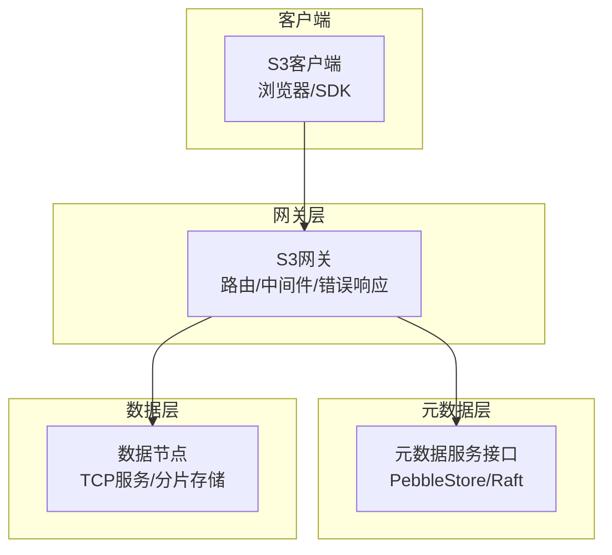
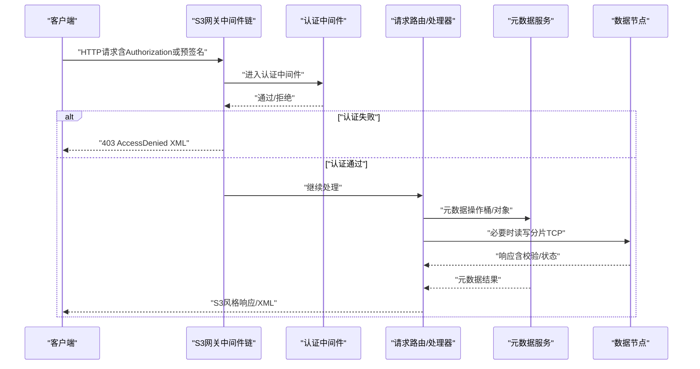
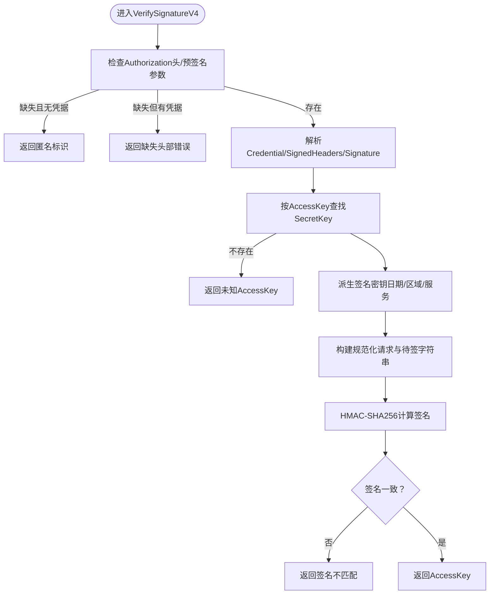
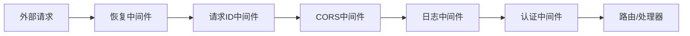
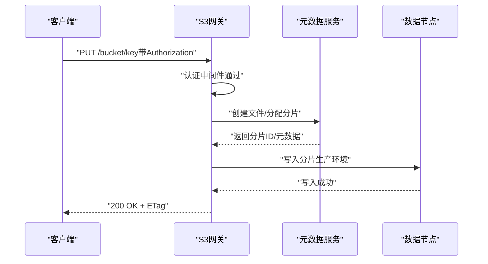
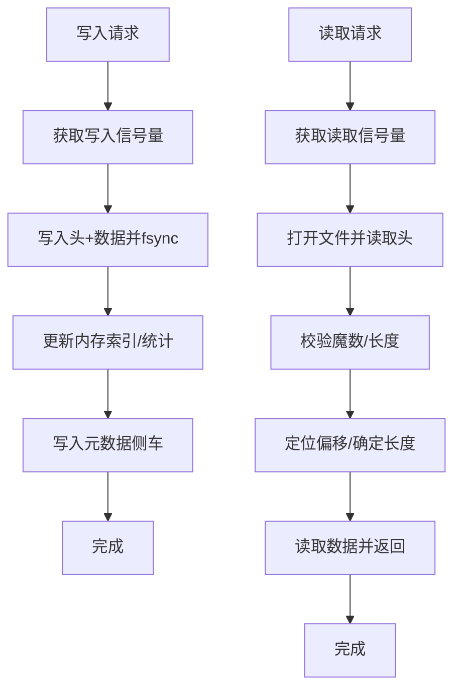
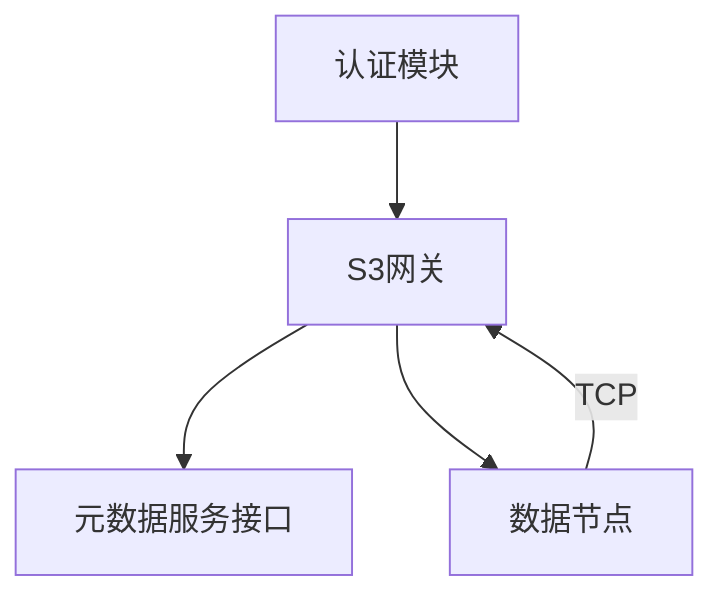

# 安全设计

<cite>
**本文引用的文件**
- [nufs-core/gateway/s3/auth.go](file://nufs-core/gateway/s3/auth.go)
- [nufs-core/gateway/s3/middleware.go](file://nufs-core/gateway/s3/middleware.go)
- [nufs-core/gateway/s3/handler.go](file://nufs-core/gateway/s3/handler.go)
- [nufs-core/gateway/s3/response.go](file://nufs-core/gateway/s3/response.go)
- [nufs-core/gateway/s3/bucket.go](file://nufs-core/gateway/s3/bucket.go)
- [nufs-core/gateway/s3/object.go](file://nufs-core/gateway/s3/object.go)
- [nufs-core/cmd/s3gw/main.go](file://nufs-core/cmd/s3gw/main.go)
- [nufs-core/datanode/server.go](file://nufs-core/datanode/server.go)
- [nufs-core/datanode/chunkstore.go](file://nufs-core/datanode/chunkstore.go)
- [nufs-core/datanode/types.go](file://nufs-core/datanode/types.go)
- [nufs-core/metadata/service.go](file://nufs-core/metadata/service.go)
</cite>

## 目录
1. [引言](#引言)
2. [项目结构](#项目结构)
3. [核心组件](#核心组件)
4. [架构总览](#架构总览)
5. [详细组件分析](#详细组件分析)
6. [依赖分析](#依赖分析)
7. [性能与安全权衡](#性能与安全权衡)
8. [故障排查与审计](#故障排查与审计)
9. [结论](#结论)
10. [附录：安全配置与最佳实践](#附录安全配置与最佳实践)

## 引言
本文件面向NUFS分布式文件系统的安全设计，聚焦于认证授权、数据加密、访问控制与审计日志等关键领域。文档从代码实现出发，结合S3 API的身份验证与签名流程、中间件链中的安全组件、数据传输与静态数据保护、密钥管理、威胁模型与合规建议，为开发者与运维人员提供可落地的安全方案。

## 项目结构
NUFS由“网关层（S3兼容）—元数据服务—数据节点”三层组成。S3网关负责解析S3请求、执行认证与日志记录；元数据服务统一管理命名空间、桶与对象元信息；数据节点负责本地磁盘上的分片存储与读写，并通过TCP协议与网关交互。

**图表来源**
- [nufs-core/gateway/s3/handler.go:11-68](file://nufs-core/gateway/s3/handler.go#L11-L68)
- [nufs-core/metadata/service.go:16-67](file://nufs-core/metadata/service.go#L16-L67)
- [nufs-core/datanode/server.go:18-51](file://nufs-core/datanode/server.go#L18-L51)

**章节来源**
- [nufs-core/gateway/s3/handler.go:11-68](file://nufs-core/gateway/s3/handler.go#L11-L68)
- [nufs-core/metadata/service.go:16-67](file://nufs-core/metadata/service.go#L16-L67)
- [nufs-core/datanode/server.go:18-51](file://nufs-core/datanode/server.go#L18-L51)

## 核心组件
- 认证与签名（S3 Signature v4）
  - 凭证存储与校验：支持基于AccessKey/SecretKey的签名验证，支持查询字符串预签名URL。
  - 中间件集成：在网关中以中间件形式接入，失败返回S3标准错误。
- 中间件链（安全与可观测性）
  - 请求ID注入、CORS、日志、异常恢复、认证。
- 元数据与对象操作
  - 桶/对象生命周期管理、目录列举、复制、范围读取占位。
- 数据节点与分片存储
  - 分片文件布局、CRC32校验、健康检查、长度/校验头写入。
- 配置入口
  - S3网关启动参数：监听地址、元数据目录、访问凭据。

**章节来源**
- [nufs-core/gateway/s3/auth.go:14-98](file://nufs-core/gateway/s3/auth.go#L14-L98)
- [nufs-core/gateway/s3/middleware.go:11-93](file://nufs-core/gateway/s3/middleware.go#L11-L93)
- [nufs-core/gateway/s3/handler.go:45-68](file://nufs-core/gateway/s3/handler.go#L45-L68)
- [nufs-core/gateway/s3/bucket.go:11-34](file://nufs-core/gateway/s3/bucket.go#L11-L34)
- [nufs-core/gateway/s3/object.go:17-95](file://nufs-core/gateway/s3/object.go#L17-L95)
- [nufs-core/datanode/chunkstore.go:18-127](file://nufs-core/datanode/chunkstore.go#L18-L127)
- [nufs-core/cmd/s3gw/main.go:18-52](file://nufs-core/cmd/s3gw/main.go#L18-L52)

## 架构总览
下图展示S3请求在系统内的端到端流转，以及安全控制点的分布。

**图表来源**
- [nufs-core/gateway/s3/middleware.go:58-70](file://nufs-core/gateway/s3/middleware.go#L58-L70)
- [nufs-core/gateway/s3/handler.go:81-166](file://nufs-core/gateway/s3/handler.go#L81-L166)
- [nufs-core/gateway/s3/response.go:154-183](file://nufs-core/gateway/s3/response.go#L154-L183)
- [nufs-core/datanode/server.go:102-126](file://nufs-core/datanode/server.go#L102-L126)

## 详细组件分析

### 认证与授权（S3 Signature v4）
- 凭证存储
  - 内存映射：accessKey -> secretKey。
  - 支持动态添加，便于运行时配置。
- 签名验证流程
  - 解析Authorization头部或查询字符串（预签名URL）。
  - 校验日期、区域、服务、签名头集合与签名值。
  - 使用派生密钥对规范化请求进行HMAC-SHA256计算比对。
  - 匿名模式：未配置凭据时允许匿名访问。
- 错误处理
  - 缺失/不支持的认证方案、未知AccessKey、签名不匹配均返回S3标准错误码。

**图表来源**
- [nufs-core/gateway/s3/auth.go:31-98](file://nufs-core/gateway/s3/auth.go#L31-L98)

**章节来源**
- [nufs-core/gateway/s3/auth.go:14-98](file://nufs-core/gateway/s3/auth.go#L14-L98)
- [nufs-core/gateway/s3/middleware.go:58-70](file://nufs-core/gateway/s3/middleware.go#L58-L70)
- [nufs-core/gateway/s3/response.go:130-143](file://nufs-core/gateway/s3/response.go#L130-L143)

### 中间件链与安全控制
- 请求ID中间件：为每条请求生成唯一ID，贯穿日志与错误响应。
- 日志中间件：记录方法、路径、状态码、耗时与远端地址。
- CORS中间件：设置跨域响应头，处理OPTIONS预检。
- 认证中间件：调用凭证校验，失败返回S3错误。
- 恢复中间件：捕获panic并返回内部错误。
- 路由与处理器：根据S3语义分发至桶/对象操作。

**图表来源**
- [nufs-core/gateway/s3/middleware.go:11-93](file://nufs-core/gateway/s3/middleware.go#L11-L93)
- [nufs-core/gateway/s3/handler.go:45-68](file://nufs-core/gateway/s3/handler.go#L45-L68)

**章节来源**
- [nufs-core/gateway/s3/middleware.go:11-93](file://nufs-core/gateway/s3/middleware.go#L11-L93)
- [nufs-core/gateway/s3/handler.go:45-68](file://nufs-core/gateway/s3/handler.go#L45-L68)

### S3 API与权限管理
- 路由与方法
  - 服务级：列举桶（GET /）。
  - 桶级：创建/删除/存在性检查/列举对象/多部分初始化/批量删除。
  - 对象级：PUT/GET/DELETE/HEAD；支持分片上传/完成/列举/范围下载占位。
- 权限与错误
  - 认证失败统一返回AccessDenied。
  - 其他业务错误映射为S3标准错误码与HTTP状态码。
- ETag与校验
  - 对象写入时计算内容哈希作为ETag占位；分片读取流式输出占位。

**图表来源**
- [nufs-core/gateway/s3/handler.go:70-166](file://nufs-core/gateway/s3/handler.go#L70-L166)
- [nufs-core/gateway/s3/object.go:17-95](file://nufs-core/gateway/s3/object.go#L17-L95)
- [nufs-core/gateway/s3/response.go:154-183](file://nufs-core/gateway/s3/response.go#L154-L183)

**章节来源**
- [nufs-core/gateway/s3/handler.go:70-166](file://nufs-core/gateway/s3/handler.go#L70-L166)
- [nufs-core/gateway/s3/bucket.go:11-34](file://nufs-core/gateway/s3/bucket.go#L11-L34)
- [nufs-core/gateway/s3/object.go:17-95](file://nufs-core/gateway/s3/object.go#L17-L95)
- [nufs-core/gateway/s3/response.go:128-143](file://nufs-core/gateway/s3/response.go#L128-L143)

### 数据节点与静态数据保护
- 存储布局
  - 分片文件：固定头（魔数、分片ID、长度、CRC32）、数据体。
  - 元数据侧车：JSON快照，便于启动重建索引。
- 写入与校验
  - 写入时计算CRC32，写入后同步落盘；封顶（Seal）阶段重新计算并更新头。
  - 读取时校验头魔数与长度，支持偏移读取。
- 并发与容量
  - 读写并发信号量限制；按分片目录散列避免单目录文件过多。
- 健康与统计
  - 提供健康检查与统计接口，便于运维监控。

**图表来源**
- [nufs-core/datanode/chunkstore.go:73-127](file://nufs-core/datanode/chunkstore.go#L73-L127)
- [nufs-core/datanode/chunkstore.go:169-227](file://nufs-core/datanode/chunkstore.go#L169-L227)
- [nufs-core/datanode/types.go:120-171](file://nufs-core/datanode/types.go#L120-L171)

**章节来源**
- [nufs-core/datanode/chunkstore.go:18-127](file://nufs-core/datanode/chunkstore.go#L18-L127)
- [nufs-core/datanode/chunkstore.go:169-227](file://nufs-core/datanode/chunkstore.go#L169-L227)
- [nufs-core/datanode/types.go:120-171](file://nufs-core/datanode/types.go#L120-L171)

### 元数据服务与一致性
- 接口抽象
  - 统一的元数据操作接口，PebbleStore实现为后端，可选Raft共识。
- 生产化组合
  - 事件总线、指标、健康检查、租约、GC、修复、再平衡、生命周期引擎等子系统编排。
- 运行期选项
  - 版本、租约TTL、GC间隔、修复间隔、生命周期规则、是否启用Raft及配置。

**章节来源**
- [nufs-core/metadata/service.go:16-67](file://nufs-core/metadata/service.go#L16-L67)
- [nufs-core/metadata/service.go:76-135](file://nufs-core/metadata/service.go#L76-L135)
- [nufs-core/metadata/service.go:136-273](file://nufs-core/metadata/service.go#L136-L273)

## 依赖分析
- 网关依赖元数据服务接口，不直接依赖具体实现，便于替换后端。
- 数据节点通过TCP协议与网关交互，协议为长度前缀+JSON头+二进制体。
- 认证模块独立于业务逻辑，通过中间件注入，降低耦合。

**图表来源**
- [nufs-core/gateway/s3/auth.go:14-98](file://nufs-core/gateway/s3/auth.go#L14-L98)
- [nufs-core/gateway/s3/handler.go:13-33](file://nufs-core/gateway/s3/handler.go#L13-L33)
- [nufs-core/datanode/server.go:273-337](file://nufs-core/datanode/server.go#L273-L337)

**章节来源**
- [nufs-core/gateway/s3/handler.go:13-33](file://nufs-core/gateway/s3/handler.go#L13-L33)
- [nufs-core/datanode/server.go:273-337](file://nufs-core/datanode/server.go#L273-L337)

## 性能与安全权衡
- 并发控制
  - 数据节点通过信号量限制读写并发，避免IO抖动与资源争用。
- IO路径
  - 写入后fsync确保持久性；封顶阶段二次校验提升完整性。
- 超时与健壮性
  - 网关HTTP服务器设置读/写/空闲超时；恢复中间件防止崩溃传播。
- 传输安全
  - 当前未见TLS/HTTPS强制策略；建议在反向代理层启用TLS终止。

[本节为通用性能讨论，无需特定文件来源]

## 故障排查与审计
- 错误响应
  - 统一使用S3风格XML错误响应，包含Code、Message、Resource、RequestID。
  - 通过状态码映射函数将S3错误映射到HTTP状态码。
- 日志
  - 中间件记录请求方法、路径、状态、耗时与远端地址，便于追踪。
- 请求ID
  - 每个请求注入x-amz-request-id，贯穿错误响应，便于端到端关联。
- 健康检查
  - 数据节点提供健康接口，返回节点ID、容量、分片计数等信息。

**章节来源**
- [nufs-core/gateway/s3/response.go:130-143](file://nufs-core/gateway/s3/response.go#L130-L143)
- [nufs-core/gateway/s3/response.go:154-183](file://nufs-core/gateway/s3/response.go#L154-L183)
- [nufs-core/gateway/s3/middleware.go:23-33](file://nufs-core/gateway/s3/middleware.go#L23-L33)
- [nufs-core/gateway/s3/middleware.go:106-111](file://nufs-core/gateway/s3/middleware.go#L106-L111)
- [nufs-core/datanode/server.go:256-271](file://nufs-core/datanode/server.go#L256-L271)

## 结论
NUFS在S3网关层实现了完整的签名认证与中间件安全控制，在数据节点层提供了基于CRC32的静态数据完整性保障。当前实现强调可扩展与可观测性，建议在部署层面补充传输加密、细粒度访问控制与密钥轮换策略，以满足更严格的安全与合规要求。

## 附录：安全配置与最佳实践

### 认证与密钥管理
- 启用认证
  - 在启动参数中提供access-key与secret-key，否则运行在匿名模式。
- 密钥轮换
  - 建议通过外部密钥管理系统注入，定期轮换secret-key并清理旧凭据。
- 凭证最小权限
  - 为不同客户端分配独立的AccessKey，限制其可操作的桶/前缀。

**章节来源**
- [nufs-core/cmd/s3gw/main.go:18-52](file://nufs-core/cmd/s3gw/main.go#L18-L52)
- [nufs-core/gateway/s3/auth.go:14-29](file://nufs-core/gateway/s3/auth.go#L14-L29)

### 数据传输加密
- TLS终止
  - 在反向代理（如Nginx/Caddy）启用TLS，将明文流量转为加密后转发给网关。
- 证书管理
  - 使用自动化证书颁发与续期（ACME），并启用HSTS与现代密码套件。
- 内部通信
  - 数据节点与网关之间的TCP通道建议置于受控网络内，或在边缘启用mTLS。

[本节为通用安全建议，无需特定文件来源]

### 静态数据保护
- 校验与封顶
  - 写入后立即校验CRC32，封顶阶段重新计算并更新头，确保落盘一致性。
- 存储布局
  - 分片目录散列避免单目录文件过多，提升文件系统性能与可维护性。
- 备份与恢复
  - 定期备份元数据与分片侧车，验证恢复流程。

**章节来源**
- [nufs-core/datanode/chunkstore.go:73-127](file://nufs-core/datanode/chunkstore.go#L73-L127)
- [nufs-core/datanode/chunkstore.go:229-275](file://nufs-core/datanode/chunkstore.go#L229-L275)
- [nufs-core/datanode/types.go:120-171](file://nufs-core/datanode/types.go#L120-L171)

### 访问控制策略
- 网关层
  - 仅在认证中间件通过后放行；对匿名访问严格限制。
- 元数据与对象
  - 建议在上层引入桶/对象级ACL与IAM策略，结合预签名URL的过期时间与条件约束。

**章节来源**
- [nufs-core/gateway/s3/middleware.go:58-70](file://nufs-core/gateway/s3/middleware.go#L58-L70)
- [nufs-core/gateway/s3/handler.go:70-166](file://nufs-core/gateway/s3/handler.go#L70-L166)

### 审计与合规
- 审计日志
  - 开启网关日志中间件，记录请求上下文；结合请求ID进行关联分析。
- 合规基线
  - 参考行业合规要求（如数据分类、最小可见性、不可否认性），完善策略与流程。

**章节来源**
- [nufs-core/gateway/s3/middleware.go:23-33](file://nufs-core/gateway/s3/middleware.go#L23-L33)
- [nufs-core/gateway/s3/response.go:154-183](file://nufs-core/gateway/s3/response.go#L154-L183)