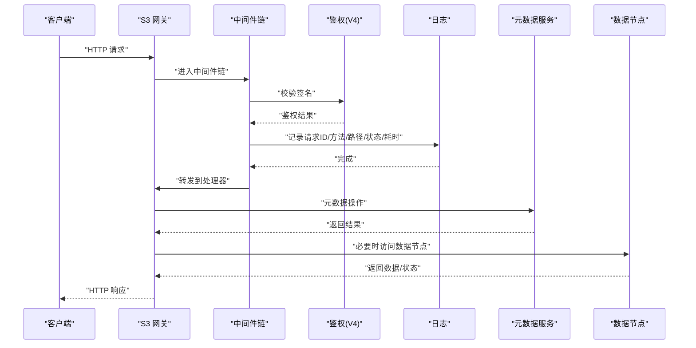
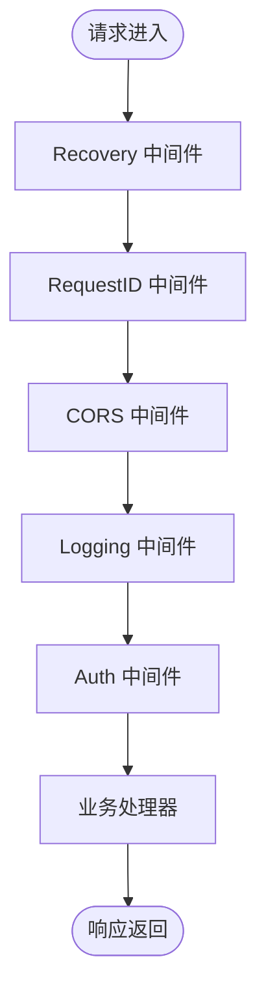
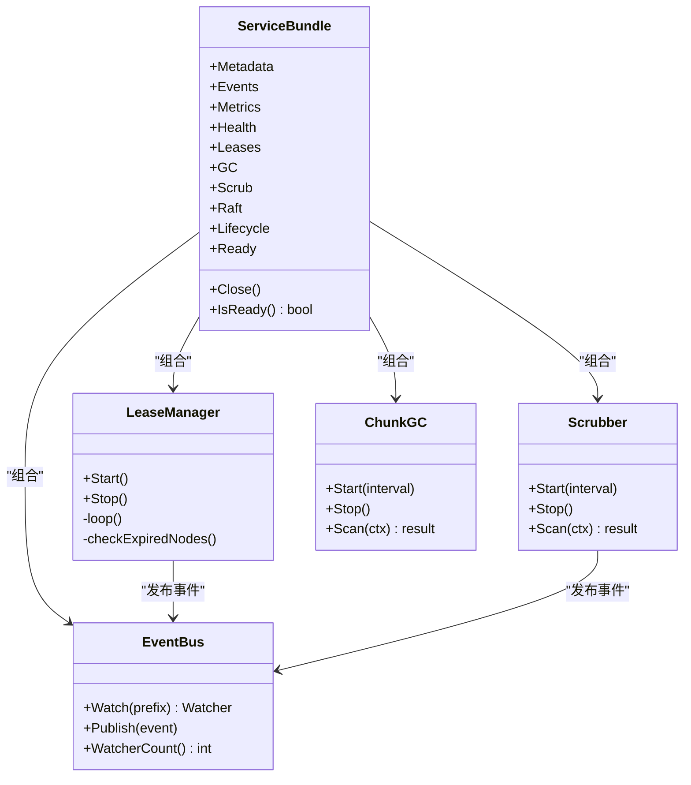
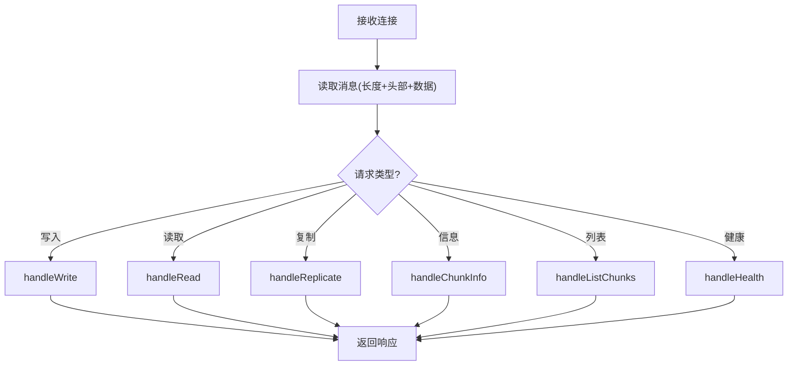
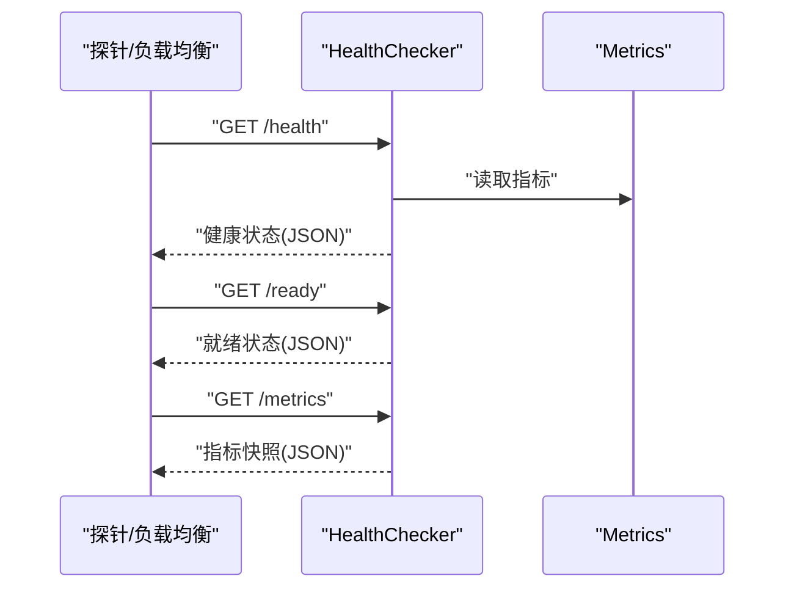
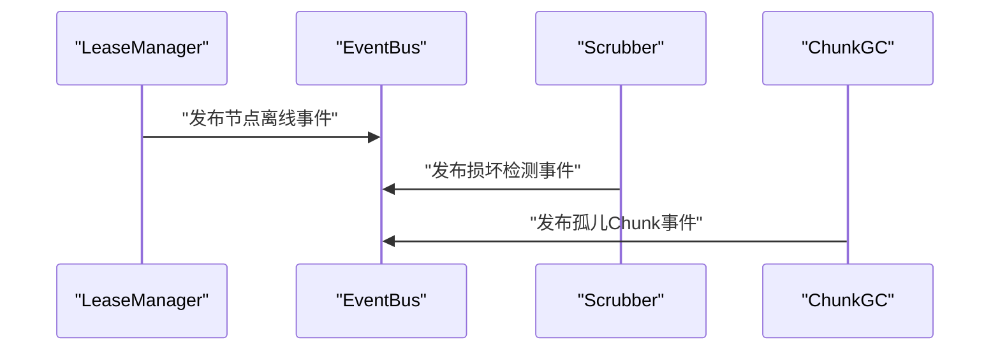

# 审计与安全监控

<cite>
**本文引用的文件**
- [ARCHITECTURE.md](file://nufs-core/ARCHITECTURE.md)
- [main.go](file://nufs-core/cmd/metad/main.go)
- [main.go](file://nufs-core/cmd/datanode/main.go)
- [main.go](file://nufs-core/cmd/s3gw/main.go)
- [main.go](file://nufs-core/cmd/fusegw/main.go)
- [auth.go](file://nufs-core/gateway/s3/auth.go)
- [middleware.go](file://nufs-core/gateway/s3/middleware.go)
- [service.go](file://nufs-core/metadata/service.go)
- [health.go](file://nufs-core/metadata/health.go)
- [errors.go](file://nufs-core/metadata/errors.go)
- [production.go](file://nufs-core/metadata/production.go)
- [server.go](file://nufs-core/datanode/server.go)
- [cluster.yaml](file://nufs-core/deploy/config/cluster.yaml)
- [metrics.go](file://nufs-fuse/fs/metrics.go)
- [TODO.md](file://nufs-core/TODO.md)
</cite>

## 目录
1. [简介](#简介)
2. [项目结构](#项目结构)
3. [核心组件](#核心组件)
4. [架构总览](#架构总览)
5. [详细组件分析](#详细组件分析)
6. [依赖分析](#依赖分析)
7. [性能考虑](#性能考虑)
8. [故障排查指南](#故障排查指南)
9. [结论](#结论)
10. [附录](#附录)

## 简介
本文件面向NUFS分布式文件系统的审计与安全监控，围绕操作审计日志、安全事件监控、异常行为检测与入侵防护、用户活动跟踪、API调用审计与数据访问日志、完整性保护与防篡改、长期保存策略、安全告警与实时监控仪表板、事件响应流程、合规报告与基线检查、风险评估方法、日志分析工具集成、威胁情报联动以及自动化响应机制进行系统化说明。文档基于仓库现有代码与架构文档进行提炼，并结合待实现清单给出扩展建议。

## 项目结构
NUFS采用分层架构：客户端层（S3/FUSE/CLI）、网关层（S3/FUSE）、元数据层（Pebble+Raft）、数据层（DataNode）。各组件均具备可观测性与健康检查能力，为审计与安全监控奠定基础。

```mermaid
graph TB
subgraph "客户端层"
S3Client["S3 客户端"]
FuseClient["FUSE 客户端"]
CLIClient["CLI(dfsctl)"]
end
subgraph "网关层"
S3GW["S3 网关"]
FUSEGW["FUSE 网关"]
end
subgraph "元数据层"
MetaD["元数据服务(Metadata)"]
Pebble["Pebble 存储"]
Raft["Raft 共识"]
Metrics["指标(Metrics)"]
Health["健康检查(Health)"]
end
subgraph "数据层"
DN["数据节点(DataNode)"]
ChunkStore["ChunkStore"]
Replicator["复制引擎"]
end
S3Client --> S3GW
FuseClient --> FUSEGW
CLIClient --> S3GW
S3GW --> MetaD
FUSEGW --> MetaD
MetaD --> Pebble
MetaD --> Raft
MetaD --> Metrics
MetaD --> Health
MetaD <- --> DN
DN --> ChunkStore
DN --> Replicator
```

**图表来源**
- [ARCHITECTURE.md:37-101](file://nufs-core/ARCHITECTURE.md#L37-L101)
- [main.go:18-61](file://nufs-core/cmd/s3gw/main.go#L18-L61)
- [main.go:17-48](file://nufs-core/cmd/fusegw/main.go#L17-L48)
- [main.go:21-126](file://nufs-core/cmd/metad/main.go#L21-L126)
- [main.go:19-121](file://nufs-core/cmd/datanode/main.go#L19-L121)

**章节来源**
- [ARCHITECTURE.md:25-116](file://nufs-core/ARCHITECTURE.md#L25-L116)

## 核心组件
- 网关层中间件链：Recovery → RequestID → CORS → Logging → Auth(V4签名) → Handler。该链路提供请求追踪、跨域、日志与鉴权能力，是审计日志与安全监控的关键入口。
- 元数据服务与生产子系统：ServiceBundle组合了事件总线、指标、健康检查、租约、GC、清洗、生命周期、Raft等模块，形成完整的可观测与治理闭环。
- 数据节点：提供TCP协议的Chunk读写、复制、健康检查接口，配合心跳上报与复制引擎，支撑数据一致性与可用性保障。
- 部署配置：cluster.yaml定义了服务参数、认证开关、跨机房复制策略等，为安全策略落地提供配置基础。

**章节来源**
- [middleware.go:11-93](file://nufs-core/gateway/s3/middleware.go#L11-L93)
- [service.go:76-213](file://nufs-core/metadata/service.go#L76-L213)
- [server.go:18-126](file://nufs-core/datanode/server.go#L18-L126)
- [cluster.yaml:1-62](file://nufs-core/deploy/config/cluster.yaml#L1-L62)

## 架构总览
下图展示S3网关到元数据与数据层的调用路径，标注了鉴权、日志、指标与健康检查的关键节点，便于审计与安全监控的落点定位。



**图表来源**
- [middleware.go:13-84](file://nufs-core/gateway/s3/middleware.go#L13-L84)
- [auth.go:31-98](file://nufs-core/gateway/s3/auth.go#L31-L98)
- [main.go:48-61](file://nufs-core/cmd/s3gw/main.go#L48-L61)
- [server.go:102-126](file://nufs-core/datanode/server.go#L102-L126)

## 详细组件分析

### S3网关中间件与审计入口
- RequestID中间件：为每个请求注入唯一标识，便于跨组件关联审计。
- Logging中间件：记录方法、路径、状态码、耗时与远端地址，构成API调用审计的基础。
- Auth中间件：基于AWS Signature V4进行鉴权；匿名模式下允许无凭证访问。
- Recovery中间件：捕获panic并返回标准错误，避免敏感信息泄露。



**图表来源**
- [middleware.go:13-93](file://nufs-core/gateway/s3/middleware.go#L13-L93)
- [auth.go:31-98](file://nufs-core/gateway/s3/auth.go#L31-L98)

**章节来源**
- [middleware.go:11-111](file://nufs-core/gateway/s3/middleware.go#L11-L111)
- [auth.go:14-204](file://nufs-core/gateway/s3/auth.go#L14-L204)

### 元数据服务与事件总线
- ServiceBundle：组合指标、健康检查、租约、GC、清洗、生命周期、Raft等子系统，提供Ready通道与关闭流程。
- EventBus：发布订阅机制，支持按键前缀订阅，用于事件驱动的审计与告警。
- LeaseManager：节点租约与离线检测，触发事件总线发布“节点离线”事件。
- Scrubber：定期扫描检测损坏Chunk，发布修复事件。
- ChunkGC：扫描孤儿Chunk并回收，支持dry-run模式。



**图表来源**
- [service.go:76-213](file://nufs-core/metadata/service.go#L76-L213)
- [production.go:54-124](file://nufs-core/metadata/production.go#L54-L124)
- [production.go:220-303](file://nufs-core/metadata/production.go#L220-L303)
- [production.go:309-329](file://nufs-core/metadata/production.go#L309-L329)

**章节来源**
- [service.go:76-273](file://nufs-core/metadata/service.go#L76-L273)
- [production.go:18-124](file://nufs-core/metadata/production.go#L18-L124)
- [production.go:220-329](file://nufs-core/metadata/production.go#L220-L329)

### 数据节点TCP协议与审计落点
- 协议格式：长度前缀+JSON头部+数据体，支持写、读、复制、信息查询、列表、健康检查等请求类型。
- 校验与错误处理：写入时可校验CRC32；读取失败区分未找到与其它错误；健康接口返回节点统计信息。
- 审计落点：可在Server.dispatch与各处理器处埋点，记录请求类型、ChunkID、偏移、长度、校验结果与错误信息。



**图表来源**
- [server.go:273-337](file://nufs-core/datanode/server.go#L273-L337)
- [server.go:102-271](file://nufs-core/datanode/server.go#L102-L271)

**章节来源**
- [server.go:18-462](file://nufs-core/datanode/server.go#L18-L462)

### 健康检查与指标
- HealthChecker：提供/health、/ready、/metrics端点，输出服务状态、角色、版本、运行时长、各项检查结果与错误率阈值判断。
- Metrics：原子计数器与微秒级延迟直方图（环形缓冲），支持快照导出，适配Prometheus格式。



**图表来源**
- [health.go:292-327](file://nufs-core/metadata/health.go#L292-L327)
- [health.go:16-116](file://nufs-core/metadata/health.go#L16-L116)

**章节来源**
- [health.go:16-328](file://nufs-core/metadata/health.go#L16-L328)

### 错误类型与安全影响
- 错误分类：命名空间、桶、Chunk、节点/集群、一致性、系统等错误类别，便于区分安全事件与一般故障。
- 安全影响：鉴权失败、签名不匹配、节点离线、租约过期、Raft非Leader、内部错误等均可能引发安全告警。

**章节来源**
- [errors.go:12-90](file://nufs-core/metadata/errors.go#L12-L90)

### 用户活动跟踪与API调用审计
- RequestID：为每条请求生成唯一ID，贯穿日志与指标，便于用户活动跟踪。
- Logging中间件：记录方法、路径、状态码、耗时与远端地址，作为API调用审计日志。
- 事件总线：节点离线、损坏检测、孤儿Chunk回收等事件可用于异常行为与运维审计。

**章节来源**
- [middleware.go:13-84](file://nufs-core/gateway/s3/middleware.go#L13-L84)
- [production.go:273-303](file://nufs-core/metadata/production.go#L273-L303)

### 数据访问日志
- 数据节点读写：在handleRead/handleWrite中记录ChunkID、偏移、长度、校验结果与错误，作为数据访问日志。
- 健康接口：返回节点统计信息，可用于容量与健康度审计。

**章节来源**
- [server.go:128-271](file://nufs-core/datanode/server.go#L128-L271)

### 安全事件监控与异常行为检测
- 租约与离线：LeaseManager定期检查节点心跳，超时标记离线并发布事件，用于异常行为检测与入侵防护。
- 数据清洗：Scrubber检测无副本、所有副本不健康、未密封但无校验等情形，触发修复队列。
- 孤儿Chunk：GC扫描并回收无引用Chunk，防止资源泄漏与潜在滥用。

**章节来源**
- [production.go:220-303](file://nufs-core/metadata/production.go#L220-L303)
- [production.go:309-329](file://nufs-core/metadata/production.go#L309-L329)

### 入侵防护机制
- 鉴权：AWS Signature V4签名验证，支持预签名URL；匿名模式需显式配置。
- CORS：设置允许的源、方法与头，限制跨域访问范围。
- Recovery：捕获panic并返回标准错误，避免敏感信息泄露。

**章节来源**
- [auth.go:31-98](file://nufs-core/gateway/s3/auth.go#L31-L98)
- [middleware.go:35-84](file://nufs-core/gateway/s3/middleware.go#L35-L84)

### 审计日志的完整性保护与防篡改
- Raft共识：元数据写入通过Raft日志提交，确保顺序与多数派确认，天然具备抗篡改特性。
- 事件总线：事件发布采用内存通道，结合Raft持久化，降低事件丢失风险。
- 数据校验：数据节点写入支持CRC32校验，读取返回校验值，便于数据完整性审计。

**章节来源**
- [ARCHITECTURE.md:156-174](file://nufs-core/ARCHITECTURE.md#L156-L174)
- [server.go:130-156](file://nufs-core/datanode/server.go#L130-L156)

### 长期保存策略
- Raft快照与尾随日志：定期快照与保留尾随日志，兼顾恢复效率与存储占用。
- 元数据KV布局：键空间清晰，便于归档与检索。

**章节来源**
- [ARCHITECTURE.md:169-174](file://nufs-core/ARCHITECTURE.md#L169-L174)
- [ARCHITECTURE.md:442-455](file://nufs-core/ARCHITECTURE.md#L442-L455)

### 安全告警配置与实时监控仪表板
- 健康检查端点：/health、/ready、/metrics，适配Kubernetes探针与Prometheus抓取。
- 指标导出：支持Prometheus兼容格式，便于构建仪表板与告警规则。
- 告警规则建议：磁盘使用率、节点离线、复制延迟、孤儿Chunk数量、错误率阈值等。

**章节来源**
- [health.go:292-327](file://nufs-core/metadata/health.go#L292-L327)
- [metrics.go:255-285](file://nufs-fuse/fs/metrics.go#L255-L285)
- [TODO.md:100-110](file://nufs-core/TODO.md#L100-L110)

### 事件响应流程
- 节点离线：LeaseManager检测并标记离线，发布事件，触发修复与再平衡。
- 数据损坏：Scrubber检测并发布修复事件，触发复制修复。
- 孤儿Chunk：GC扫描并回收，dry-run模式支持审计验证。



**图表来源**
- [production.go:273-303](file://nufs-core/metadata/production.go#L273-L303)
- [production.go:309-329](file://nufs-core/metadata/production.go#L309-L329)

**章节来源**
- [production.go:220-329](file://nufs-core/metadata/production.go#L220-L329)

### 合规报告与基线检查
- 健康检查：包含Pebble可读性、根Inode存在性、Raft状态、错误率等检查项，可作为基线检查内容。
- 指标快照：提供运行时长、操作总数、延迟分位数、节点在线数等，支持合规报告生成。

**章节来源**
- [health.go:218-290](file://nufs-core/metadata/health.go#L218-L290)
- [health.go:72-116](file://nufs-core/metadata/health.go#L72-L116)

### 风险评估方法
- 一致性与可用性：Raft强一致写、MVCC乐观并发、读写保证与原子性，降低数据风险。
- 容错能力：节点宕机、磁盘静默损坏、孤儿Chunk、网络分区等场景的自动检测与恢复。
- 小文件优化：减少元数据爆炸与空间浪费，间接降低运维与安全风险。

**章节来源**
- [ARCHITECTURE.md:537-585](file://nufs-core/ARCHITECTURE.md#L537-L585)
- [ARCHITECTURE.md:588-638](file://nufs-core/ARCHITECTURE.md#L588-L638)

### 日志分析工具集成与威胁情报联动
- Prometheus指标：/metrics端点输出，便于集成Prometheus/Grafana。
- 告警系统：结合AlertManager配置磁盘使用、节点离线、复制延迟、孤儿Chunk等阈值告警。
- 威胁情报：可将外部威胁情报导入，结合事件总线与日志进行联动分析与阻断。

**章节来源**
- [health.go:317-324](file://nufs-core/metadata/health.go#L317-L324)
- [TODO.md:100-110](file://nufs-core/TODO.md#L100-L110)

### 自动化响应机制
- 事件驱动：EventBus订阅与发布，支持自动修复、再平衡与回收。
- 生产子系统：ServiceBundle统一启动与关闭，确保自动化组件有序运行。

**章节来源**
- [service.go:136-213](file://nufs-core/metadata/service.go#L136-L213)
- [production.go:54-124](file://nufs-core/metadata/production.go#L54-L124)

## 依赖分析
- 组件耦合：网关层依赖元数据服务；元数据服务依赖Pebble与可选Raft；数据节点依赖元数据服务进行注册与心跳上报。
- 外部依赖：hashicorp/raft（可选）、CockroachDB/Pebble（LSM-Tree）、Prometheus兼容指标。

```mermaid
graph TB
S3GW["S3 网关"] --> META["元数据服务"]
FUSEGW["FUSE 网关"] --> META
META --> PEBBLE["Pebble"]
META --> RAFT["Raft(可选)"]
META < --> DN["数据节点"]
```

**图表来源**
- [ARCHITECTURE.md:103-114](file://nufs-core/ARCHITECTURE.md#L103-L114)
- [main.go:30-52](file://nufs-core/cmd/s3gw/main.go#L30-L52)
- [main.go:34-44](file://nufs-core/cmd/fusegw/main.go#L34-L44)

**章节来源**
- [ARCHITECTURE.md:103-115](file://nufs-core/ARCHITECTURE.md#L103-L115)

## 性能考虑
- 指标采集：LatencyHistogram采用固定大小环形缓冲，O(1)写入与排序计算，适合高吞吐场景。
- 指标导出：Prometheus格式便于高效抓取与聚合。
- 读写延迟：FUSE侧指标导出包含S3与文件系统读写延迟直方图，有助于定位性能瓶颈。

**章节来源**
- [health.go:122-184](file://nufs-core/metadata/health.go#L122-L184)
- [metrics.go:255-285](file://nufs-fuse/fs/metrics.go#L255-L285)

## 故障排查指南
- 健康检查：通过/health与/ready端点快速判断服务状态；/metrics导出指标辅助定位问题。
- 错误类型：根据错误代码分类（命名空间、桶、Chunk、节点/集群、系统）快速定位问题域。
- 事件总线：检查EventBus订阅与发布情况，确认异常事件是否正确传播。

**章节来源**
- [health.go:292-327](file://nufs-core/metadata/health.go#L292-L327)
- [errors.go:12-90](file://nufs-core/metadata/errors.go#L12-L90)
- [production.go:54-124](file://nufs-core/metadata/production.go#L54-L124)

## 结论
NUFS在架构层面已具备完善的可观测性与事件驱动能力，为审计与安全监控提供了坚实基础。通过中间件链、事件总线、健康检查与指标导出，可实现对用户活动、API调用与数据访问的全流程审计；结合租约、清洗与GC等机制，能够有效识别与处置异常行为。建议在现有基础上完善审计日志的结构化存储、完整性保护与长期保存策略，并接入Prometheus/AlertManager与威胁情报平台，形成闭环的安全运营体系。

## 附录
- 待实现清单：包含Web UI、告警系统、审计日志等P3级别功能，可作为后续扩展方向。

**章节来源**
- [TODO.md:107-110](file://nufs-core/TODO.md#L107-L110)