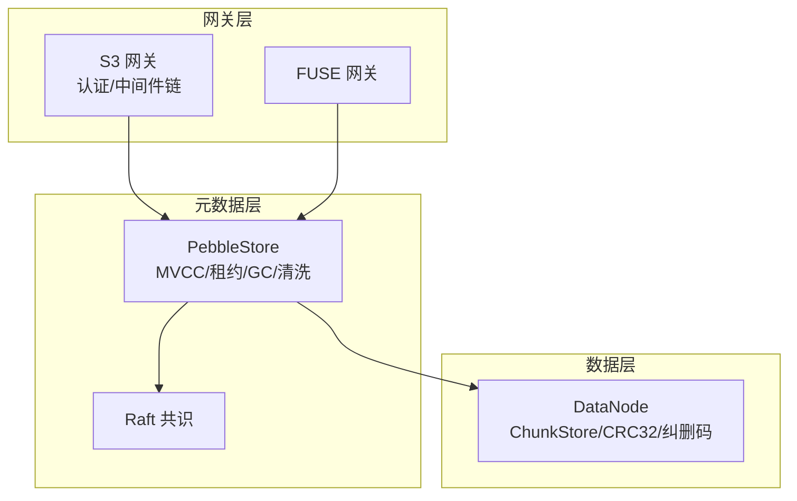
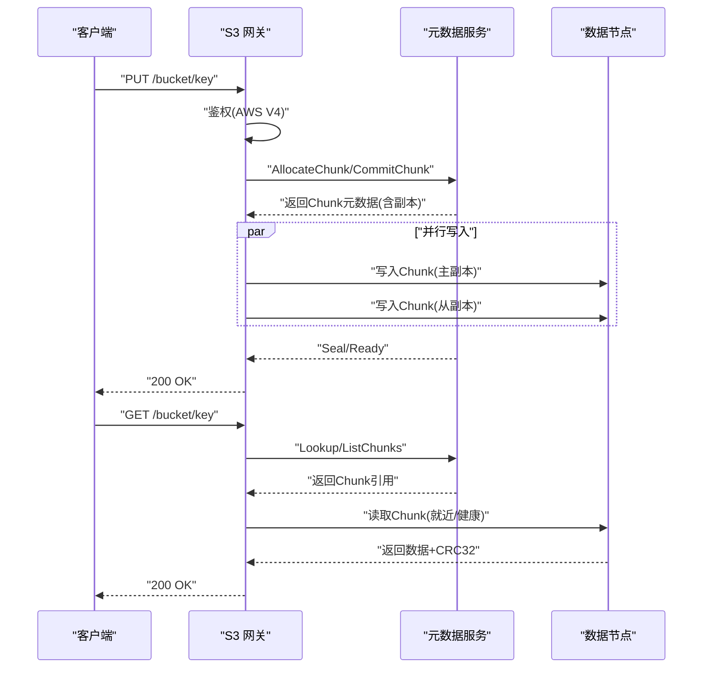
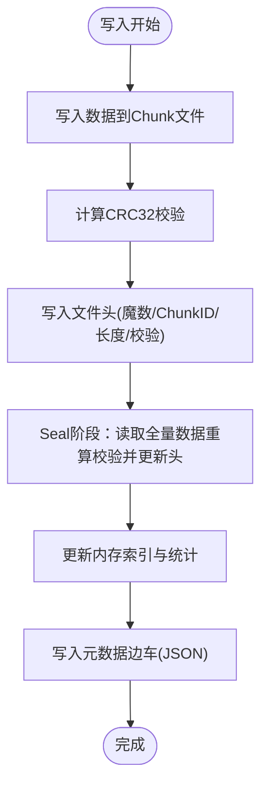
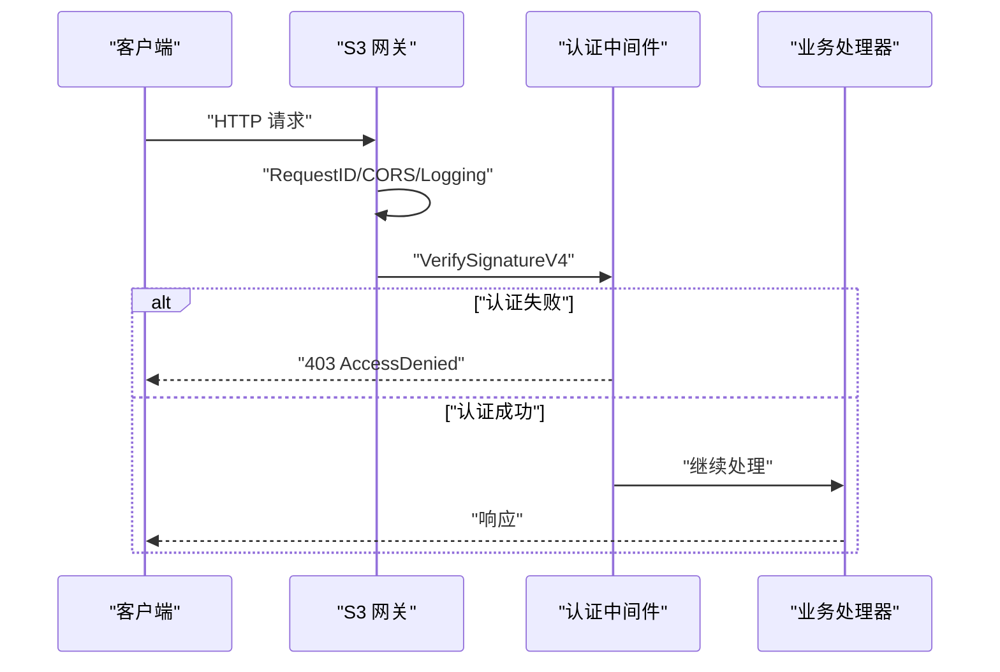
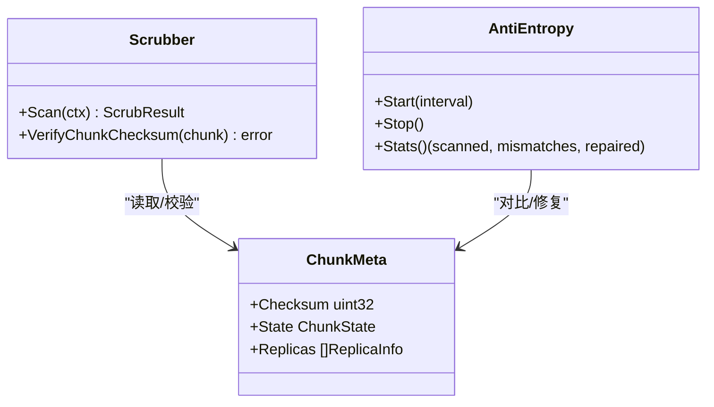
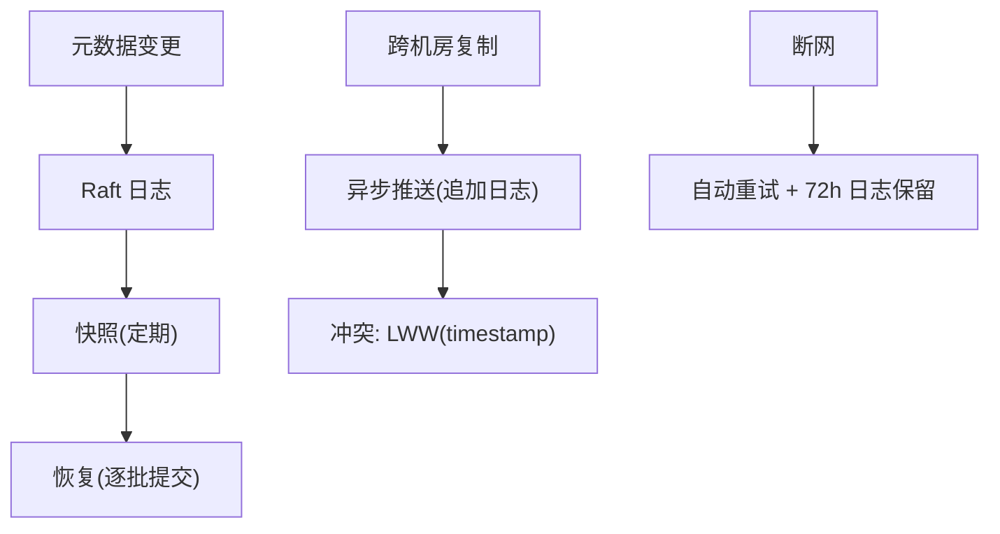
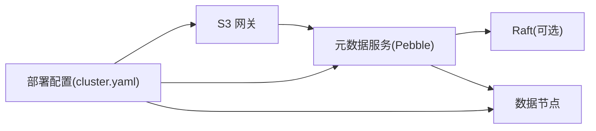

# 数据保护方案

<cite>
**本文引用的文件**
- [ARCHITECTURE.md](file://nufs-core/ARCHITECTURE.md)
- [types.go](file://nufs-core/metadata/types.go)
- [ec.go](file://nufs-core/metadata/ec.go)
- [chunkstore.go](file://nufs-core/datanode/chunkstore.go)
- [auth.go](file://nufs-core/gateway/s3/auth.go)
- [middleware.go](file://nufs-core/gateway/s3/middleware.go)
- [main.go](file://nufs-core/cmd/s3gw/main.go)
- [cluster.yaml](file://nufs-core/deploy/config/cluster.yaml)
- [production.go](file://nufs-core/metadata/production.go)
- [main.go](file://nufs-core/cmd/metad/main.go)
- [main.go](file://nufs-core/cmd/datanode/main.go)
- [ops.go](file://nufs-core/datanode/ops.go)
- [ha.go](file://nufs-core/datanode/ha.go)
</cite>

## 目录
1. [简介](#简介)
2. [项目结构](#项目结构)
3. [核心组件](#核心组件)
4. [架构总览](#架构总览)
5. [详细组件分析](#详细组件分析)
6. [依赖分析](#依赖分析)
7. [性能考量](#性能考量)
8. [故障排查指南](#故障排查指南)
9. [结论](#结论)
10. [附录](#附录)

## 简介
本方案围绕NUFS分布式文件系统的数据保护进行系统化梳理，覆盖静态数据保护（加密算法、密钥管理、存储安全）、传输层安全（TLS配置、证书管理、网络安全策略）、数据完整性校验（哈希验证、防篡改机制）、敏感数据处理（脱敏与隐私保护）、备份恢复与灾难恢复、数据生命周期管理与删除安全、以及合规性考虑。文档以代码为依据，结合架构文档与配置文件，形成可落地的安全实践建议。

## 项目结构
NUFS由三层构成：网关层（S3/FUSE）、元数据层（Pebble+Raft）、数据层（DataNode）。数据保护相关的关键位置如下：
- 网关层：S3认证与中间件链（鉴权、CORS、日志、请求ID）
- 元数据层：元数据KV存储、MVCC、租约、GC、清洗（Scrubber）
- 数据层：Chunk文件格式、CRC32校验、纠删码（演示实现）

**图表来源**
- [ARCHITECTURE.md:288-330](file://nufs-core/ARCHITECTURE.md#L288-L330)
- [types.go:78-126](file://nufs-core/metadata/types.go#L78-L126)
- [chunkstore.go:18-31](file://nufs-core/datanode/chunkstore.go#L18-L31)

**章节来源**
- [ARCHITECTURE.md:25-116](file://nufs-core/ARCHITECTURE.md#L25-L116)

## 核心组件
- 元数据模型与一致性
  - InodeMeta/ChunkMeta等核心数据结构定义了命名空间、Chunk映射、副本信息、校验和等
  - MVCC版本字段用于乐观并发控制，保障读写一致性
- 数据完整性与纠删码
  - Chunk文件头包含CRC32校验；DataNode侧提供CRC32C工具函数
  - 纠删码编码器提供演示实现（K+M），用于数据耐久性
- 网关安全
  - S3认证采用AWS Signature V4；中间件链包含CORS、鉴权、日志、请求ID
  - 支持匿名模式（无凭证时）
- 运维与可观测性
  - 元数据服务与数据节点均提供健康检查、指标导出、运维HTTP接口

**章节来源**
- [types.go:30-126](file://nufs-core/metadata/types.go#L30-L126)
- [production.go:127-189](file://nufs-core/metadata/production.go#L127-L189)
- [chunkstore.go:73-127](file://nufs-core/datanode/chunkstore.go#L73-L127)
- [ec.go:13-82](file://nufs-core/metadata/ec.go#L13-L82)
- [auth.go:31-98](file://nufs-core/gateway/s3/auth.go#L31-L98)
- [middleware.go:11-93](file://nufs-core/gateway/s3/middleware.go#L11-L93)

## 架构总览
下图展示数据在系统内的流向与保护要点：写入路径先经S3网关鉴权，进入元数据层分配Chunk并放置副本，随后写入数据层并进行CRC32校验；读取路径同样经过网关与元数据层，优先选择就近/健康副本，并进行校验。

**图表来源**
- [ARCHITECTURE.md:349-417](file://nufs-core/ARCHITECTURE.md#L349-L417)
- [auth.go:31-98](file://nufs-core/gateway/s3/auth.go#L31-L98)
- [types.go:78-126](file://nufs-core/metadata/types.go#L78-L126)
- [chunkstore.go:73-127](file://nufs-core/datanode/chunkstore.go#L73-L127)

## 详细组件分析

### 静态数据保护与存储安全
- 数据格式与校验
  - Chunk文件头包含魔数、ChunkID、数据长度、CRC32校验，写入后进行密封（Seal）更新校验和
  - DataNode提供CRC32C工具函数，确保与标准Castagnoli多项式的兼容性
- 纠删码（演示实现）
  - 提供K+M纠删码编码/解码与校验逻辑，演示基于有限域的运算
  - 注意：注释提示生产应使用成熟库（如klauspost/reedsolomon）
- 存储布局
  - 按256个分片目录组织，避免单目录文件过多；支持元数据边车文件

**图表来源**
- [chunkstore.go:73-127](file://nufs-core/datanode/chunkstore.go#L73-L127)
- [chunkstore.go:229-275](file://nufs-core/datanode/chunkstore.go#L229-L275)
- [chunkstore.go:386-394](file://nufs-core/datanode/chunkstore.go#L386-L394)

**章节来源**
- [chunkstore.go:18-395](file://nufs-core/datanode/chunkstore.go#L18-L395)
- [ec.go:13-213](file://nufs-core/metadata/ec.go#L13-L213)
- [types.go:78-88](file://nufs-core/metadata/types.go#L78-L88)

### 传输层安全（TLS）与网络安全
- 认证与中间件链
  - S3网关中间件链：Recovery → RequestID → CORS → Logging → Auth(V4签名) → Handler
  - 支持匿名模式（未配置凭证时）
- TLS与证书管理
  - 当前仓库未发现内置TLS监听或证书管理实现
  - 建议在网关前置反向代理（如Nginx/TLS终止）或容器编排中注入证书
- 网络安全策略
  - CORS中间件允许指定来源与方法
  - 建议限制来源、启用HTTPS、强制HSTS、最小权限访问

**图表来源**
- [middleware.go:11-93](file://nufs-core/gateway/s3/middleware.go#L11-L93)
- [auth.go:31-98](file://nufs-core/gateway/s3/auth.go#L31-L98)
- [main.go:18-52](file://nufs-core/cmd/s3gw/main.go#L18-L52)

**章节来源**
- [middleware.go:35-70](file://nufs-core/gateway/s3/middleware.go#L35-L70)
- [auth.go:14-98](file://nufs-core/gateway/s3/auth.go#L14-L98)
- [main.go:18-52](file://nufs-core/cmd/s3gw/main.go#L18-L52)

### 数据完整性校验与防篡改
- 元数据一致性
  - MVCC版本字段用于乐观并发控制，CAS更新失败需重试
  - 租约机制（LeaseManager）检测节点离线，触发修复与再平衡
- 数据层校验
  - Chunk文件头包含CRC32校验；DataNode提供CRC32C工具
  - Scrubber定期扫描，验证Chunk元数据一致性并触发修复
- 抗熵（Anti-Entropy）
  - 数据节点内置抗熵引擎，周期性扫描与修复不一致副本

**图表来源**
- [production.go:435-528](file://nufs-core/metadata/production.go#L435-L528)
- [types.go:78-126](file://nufs-core/metadata/types.go#L78-L126)
- [ops.go:236-270](file://nufs-core/datanode/ops.go#L236-L270)
- [ha.go:382-401](file://nufs-core/datanode/ha.go#L382-L401)

**章节来源**
- [production.go:127-189](file://nufs-core/metadata/production.go#L127-L189)
- [production.go:435-571](file://nufs-core/metadata/production.go#L435-L571)
- [ops.go:236-291](file://nufs-core/datanode/ops.go#L236-L291)
- [ha.go:369-401](file://nufs-core/datanode/ha.go#L369-L401)

### 敏感数据处理、脱敏与隐私保护
- 认证与访问控制
  - AWS Signature V4鉴权；支持匿名模式
  - 建议：生产环境必须启用鉴权，严格控制访问密钥
- 日志与追踪
  - RequestID中间件为每请求生成唯一ID，便于审计与追踪
  - 建议：脱敏日志输出，避免敏感信息泄露
- CORS与来源控制
  - 建议限制Access-Control-Allow-Origin，防止跨源滥用

**章节来源**
- [middleware.go:13-33](file://nufs-core/gateway/s3/middleware.go#L13-L33)
- [middleware.go:35-56](file://nufs-core/gateway/s3/middleware.go#L35-L56)
- [auth.go:31-98](file://nufs-core/gateway/s3/auth.go#L31-L98)

### 备份恢复、灾难恢复与迁移安全
- 元数据备份与恢复
  - Raft快照与日志保留策略；快照格式与恢复流程
  - 建议：定期备份Pebble数据目录与Raft WAL，制定恢复演练
- 数据节点健康与再平衡
  - 健康检查与磁盘使用率阈值；再平衡阈值与迁移策略
- 跨机房复制（异步多活）
  - 元数据追加日志异步推送；Chunk仅复制已Seal数据
  - 冲突解决采用CRDT Last-Write-Wins；断网自动重试与日志保留

**图表来源**
- [ARCHITECTURE.md:156-174](file://nufs-core/ARCHITECTURE.md#L156-L174)
- [ARCHITECTURE.md:729-761](file://nufs-core/ARCHITECTURE.md#L729-L761)

**章节来源**
- [ARCHITECTURE.md:537-586](file://nufs-core/ARCHITECTURE.md#L537-L586)
- [ARCHITECTURE.md:729-761](file://nufs-core/ARCHITECTURE.md#L729-L761)

### 数据生命周期管理、删除安全与合规
- 生命周期规则
  - 支持按天过渡到不同存储层级（热/温/冷/归档），到期删除
- 删除与GC
  - GC扫描孤儿Chunk，定期清理无引用数据
  - Scrubber检测损坏/降级Chunk并触发修复
- 合规性
  - 建议：结合生命周期策略与删除安全，满足数据保留与销毁合规要求

**章节来源**
- [ARCHITECTURE.md:686-727](file://nufs-core/ARCHITECTURE.md#L686-L727)
- [production.go:400-429](file://nufs-core/metadata/production.go#L400-L429)
- [production.go:435-528](file://nufs-core/metadata/production.go#L435-L528)

## 依赖分析
- 组件耦合
  - 网关层依赖元数据服务；元数据服务依赖Pebble与可选Raft；数据层依赖本地文件系统
- 关键依赖链
  - S3请求 → 鉴权中间件 → 元数据服务 → 数据节点 → 副本校验
- 外部集成点
  - 部署配置文件提供服务地址、认证开关、CORS策略等

**图表来源**
- [ARCHITECTURE.md:288-330](file://nufs-core/ARCHITECTURE.md#L288-L330)
- [cluster.yaml:27-46](file://nufs-core/deploy/config/cluster.yaml#L27-L46)

**章节来源**
- [cluster.yaml:1-62](file://nufs-core/deploy/config/cluster.yaml#L1-L62)

## 性能考量
- 读写路径优化
  - Attr/Data缓存降低延迟；就近/低负载副本选择
- 并发与资源
  - 数据节点读写信号量限制并发；复制引擎多Worker并行
- 指标与可观测性
  - 提供延迟直方图、错误计数、磁盘使用率、复制延迟等指标

**章节来源**
- [ARCHITECTURE.md:418-437](file://nufs-core/ARCHITECTURE.md#L418-L437)
- [ARCHITECTURE.md:856-916](file://nufs-core/ARCHITECTURE.md#L856-L916)
- [ops.go:236-291](file://nufs-core/datanode/ops.go#L236-L291)

## 故障排查指南
- 健康检查
  - 元数据服务与数据节点均提供/health与/ready端点
- 常见问题定位
  - 磁盘使用率过高 → 调整再平衡阈值与迁移策略
  - 复制延迟高 → 检查网络与副本状态
  - 孤儿Chunk过多 → 触发GC扫描
  - 数据损坏 → 启动Scrubber扫描并查看修复队列

**章节来源**
- [main.go:151-220](file://nufs-core/cmd/metad/main.go#L151-L220)
- [main.go:118-134](file://nufs-core/cmd/datanode/main.go#L118-L134)
- [ops.go:272-291](file://nufs-core/datanode/ops.go#L272-L291)
- [production.go:400-429](file://nufs-core/metadata/production.go#L400-L429)

## 结论
NUFS在数据完整性与一致性方面具备良好基础：MVCC、租约、GC、清洗与抗熵机制共同保障数据可靠；Chunk文件头CRC32校验与纠删码演示实现进一步增强耐久性。传输层安全当前依赖外部TLS终止与严格的访问控制；建议在生产中强制启用鉴权、限制来源、启用HTTPS与HSTS，并完善证书轮换与密钥管理流程。结合生命周期策略与灾难恢复方案，可满足企业级数据保护与合规需求。

## 附录
- 部署与运维
  - 元数据服务与数据节点分别提供运维HTTP接口，便于健康检查与指标查询
- 配置参考
  - 部署配置文件提供S3网关认证、CORS、跨机房复制等参数示例

**章节来源**
- [main.go:107-149](file://nufs-core/cmd/metad/main.go#L107-L149)
- [main.go:118-134](file://nufs-core/cmd/datanode/main.go#L118-L134)
- [cluster.yaml:27-62](file://nufs-core/deploy/config/cluster.yaml#L27-L62)