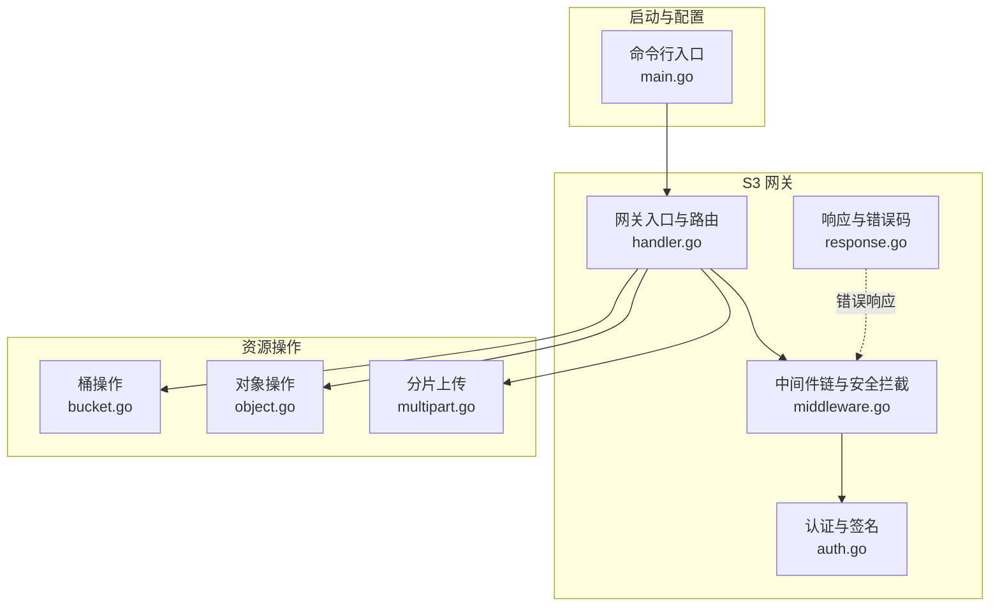
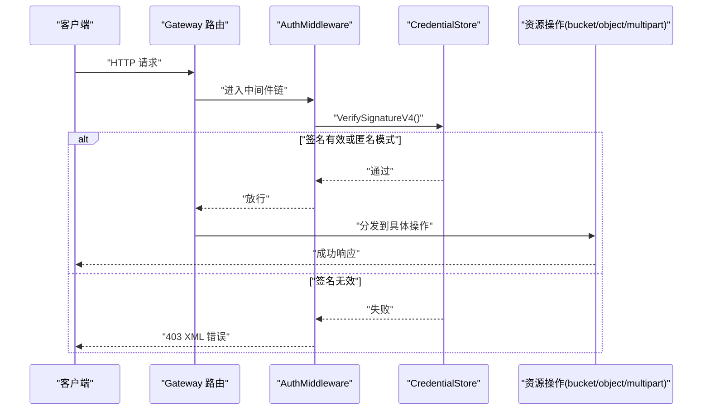
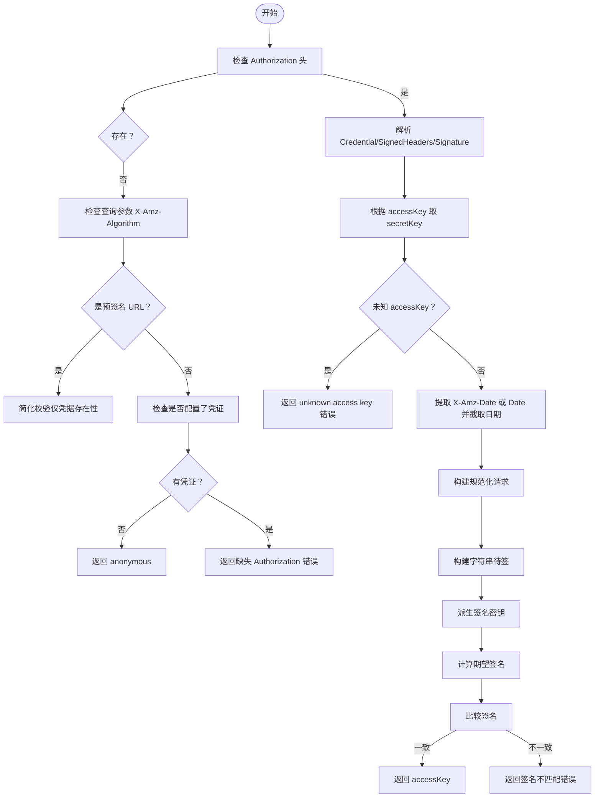
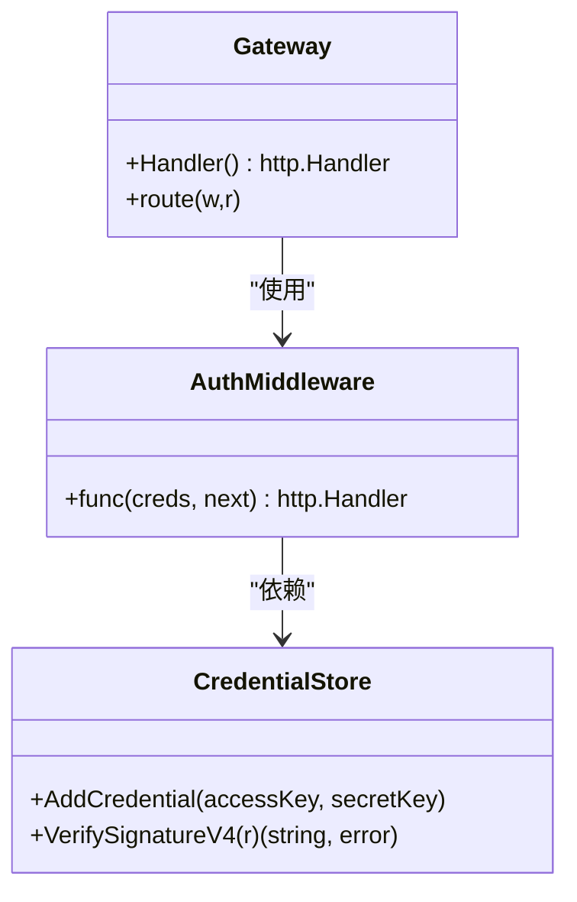
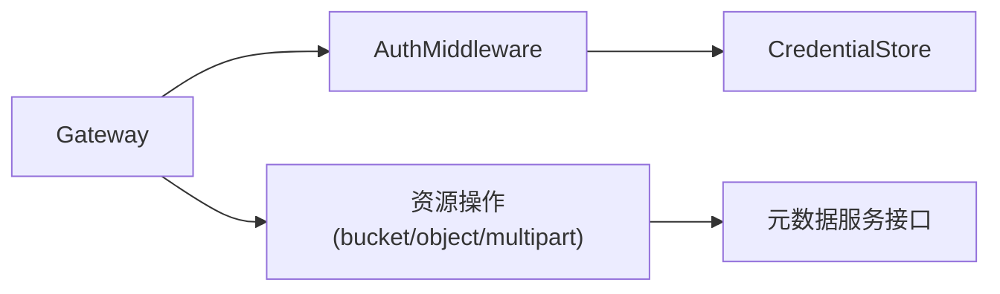

# 认证授权机制

<cite>
**本文引用的文件**
- [auth.go](file://nufs-core/gateway/s3/auth.go)
- [middleware.go](file://nufs-core/gateway/s3/middleware.go)
- [handler.go](file://nufs-core/gateway/s3/handler.go)
- [response.go](file://nufs-core/gateway/s3/response.go)
- [main.go](file://nufs-core/cmd/s3gw/main.go)
- [bucket.go](file://nufs-core/gateway/s3/bucket.go)
- [object.go](file://nufs-core/gateway/s3/object.go)
- [multipart.go](file://nufs-core/gateway/s3/multipart.go)
</cite>

## 目录
1. [简介](#简介)
2. [项目结构](#项目结构)
3. [核心组件](#核心组件)
4. [架构总览](#架构总览)
5. [详细组件分析](#详细组件分析)
6. [依赖分析](#依赖分析)
7. [性能考虑](#性能考虑)
8. [故障排查指南](#故障排查指南)
9. [结论](#结论)
10. [附录](#附录)

## 简介
本文件系统性阐述 NUFS 分布式文件系统的认证与授权机制，重点覆盖：
- AWS Signature Version 4 签名验证的完整实现：凭证存储、头部解析、规范化请求构建、签名计算与比对
- 预签名 URL 的验证流程与限制
- 匿名访问控制策略与启用方式
- 中间件链中的安全拦截器、权限检查流程与访问控制策略
- 错误处理与响应格式规范
- 安全配置最佳实践、常见问题排查与性能优化建议

## 项目结构
与认证授权直接相关的模块主要集中在 S3 网关层，包括：
- 认证与签名验证：gateway/s3/auth.go
- 中间件链与安全拦截：gateway/s3/middleware.go
- 网关入口与路由：gateway/s3/handler.go
- 响应与错误码：gateway/s3/response.go
- 启动参数与匿名模式：cmd/s3gw/main.go
- 资源操作（桶/对象/分片）：gateway/s3/bucket.go、object.go、multipart.go

**图表来源**
- [auth.go:1-204](file://nufs-core/gateway/s3/auth.go#L1-L204)
- [middleware.go:1-111](file://nufs-core/gateway/s3/middleware.go#L1-L111)
- [handler.go:1-184](file://nufs-core/gateway/s3/handler.go#L1-L184)
- [response.go:1-216](file://nufs-core/gateway/s3/response.go#L1-L216)
- [main.go:1-91](file://nufs-core/cmd/s3gw/main.go#L1-L91)
- [bucket.go:1-259](file://nufs-core/gateway/s3/bucket.go#L1-L259)
- [object.go:1-318](file://nufs-core/gateway/s3/object.go#L1-L318)
- [multipart.go:1-286](file://nufs-core/gateway/s3/multipart.go#L1-L286)

**章节来源**
- [auth.go:1-204](file://nufs-core/gateway/s3/auth.go#L1-L204)
- [middleware.go:1-111](file://nufs-core/gateway/s3/middleware.go#L1-L111)
- [handler.go:1-184](file://nufs-core/gateway/s3/handler.go#L1-L184)
- [response.go:1-216](file://nufs-core/gateway/s3/response.go#L1-L216)
- [main.go:1-91](file://nufs-core/cmd/s3gw/main.go#L1-L91)
- [bucket.go:1-259](file://nufs-core/gateway/s3/bucket.go#L1-L259)
- [object.go:1-318](file://nufs-core/gateway/s3/object.go#L1-L318)
- [multipart.go:1-286](file://nufs-core/gateway/s3/multipart.go#L1-L286)

## 核心组件
- 凭证存储（CredentialStore）
  - 存储 access key 与 secret key 映射，支持动态添加
  - 提供 VerifySignatureV4 方法完成 AWS Signature V4 验证
- 安全中间件（AuthMiddleware）
  - 在请求进入业务逻辑前执行签名验证
  - 失败时返回标准化的 S3 XML 错误响应
- 网关入口（Gateway）
  - 组装中间件链，统一处理请求分发与错误响应
  - 支持匿名模式（未配置凭证时允许访问）

**章节来源**
- [auth.go:14-98](file://nufs-core/gateway/s3/auth.go#L14-L98)
- [middleware.go:58-70](file://nufs-core/gateway/s3/middleware.go#L58-L70)
- [handler.go:26-54](file://nufs-core/gateway/s3/handler.go#L26-L54)

## 架构总览
下图展示了从客户端到资源操作的端到端调用路径，以及认证与授权在中间件链中的位置。

**图表来源**
- [middleware.go:58-70](file://nufs-core/gateway/s3/middleware.go#L58-L70)
- [auth.go:31-98](file://nufs-core/gateway/s3/auth.go#L31-L98)
- [handler.go:46-54](file://nufs-core/gateway/s3/handler.go#L46-L54)

## 详细组件分析

### 凭证存储与签名验证（AWS Signature V4）
- 凭证存储
  - 结构：map[string]string（accessKey -> secretKey）
  - 操作：NewCredentialStore、AddCredential
- 签名验证流程
  - 头部解析：从 Authorization 解析 Credential、SignedHeaders、Signature
  - 预签名 URL：若 Authorization 缺失但查询参数含 X-Amz-Algorithm，则走预签名 URL 验证
  - 匿名访问：若未配置任何凭证且请求无 Authorization，则返回“anonymous”
  - 规范化请求：
    - 规范化头：按字母序拼接 host 与其他已签名头
    - 载荷哈希：优先使用 X-Amz-Content-Sha256，否则使用 UNSIGNED-PAYLOAD
    - 规范化请求串：方法、路径、查询、规范化头、已签名头、载荷哈希
  - 字符串待签：AWS4-HMAC-SHA256 + \n + 时间戳 + \n + Scope + \n + CanonicalRequest 哈希
  - 导出密钥：基于 SecretKey 与日期、区域、服务派生
  - 签名比对：HMAC-SHA256 比较提供的签名与期望签名

**图表来源**
- [auth.go:31-98](file://nufs-core/gateway/s3/auth.go#L31-L98)
- [auth.go:100-121](file://nufs-core/gateway/s3/auth.go#L100-L121)
- [auth.go:123-147](file://nufs-core/gateway/s3/auth.go#L123-L147)
- [auth.go:149-179](file://nufs-core/gateway/s3/auth.go#L149-L179)
- [auth.go:181-198](file://nufs-core/gateway/s3/auth.go#L181-L198)

**章节来源**
- [auth.go:14-98](file://nufs-core/gateway/s3/auth.go#L14-L98)
- [auth.go:100-121](file://nufs-core/gateway/s3/auth.go#L100-L121)
- [auth.go:123-147](file://nufs-core/gateway/s3/auth.go#L123-L147)
- [auth.go:149-179](file://nufs-core/gateway/s3/auth.go#L149-L179)
- [auth.go:181-198](file://nufs-core/gateway/s3/auth.go#L181-L198)

### 预签名 URL 验证机制
- 条件：当 Authorization 头缺失且查询参数包含 X-Amz-Algorithm 时触发
- 流程：解析 X-Amz-Credential 获取 accessKey；校验该 accessKey 是否存在于凭证库中
- 限制：当前实现采用“仅凭据存在性”的简化校验，未进行时间窗口、范围限制等严格校验
- 使用场景：允许第三方在受限时间内访问特定资源，常用于临时授权下载/上传

**章节来源**
- [auth.go:100-121](file://nufs-core/gateway/s3/auth.go#L100-L121)

### 匿名访问控制
- 启用条件：未显式配置 access-key/secret-key
- 行为：允许所有请求通过，返回标识为“anonymous”
- 安全建议：生产环境务必配置凭证，避免匿名访问

**章节来源**
- [auth.go:35-45](file://nufs-core/gateway/s3/auth.go#L35-L45)
- [main.go:41-46](file://nufs-core/cmd/s3gw/main.go#L41-L46)

### 中间件链与安全拦截器
- 中间件顺序（外层到内层）：RecoveryMiddleware → RequestIDMiddleware → CORSMiddleware → LoggingMiddleware → AuthMiddleware
- AuthMiddleware
  - 调用 VerifySignatureV4
  - 失败时写入 403 XML 错误（包含请求 ID），不再进入业务处理
- 其他中间件
  - RequestIDMiddleware：注入 x-amz-request-id/x-amz-id-2
  - LoggingMiddleware：记录方法、路径、状态码、耗时与远端地址
  - CORSMiddleware：设置跨域头并处理 OPTIONS 预检
  - RecoveryMiddleware：捕获 panic，返回 500 XML 错误

**图表来源**
- [auth.go:14-30](file://nufs-core/gateway/s3/auth.go#L14-L30)
- [middleware.go:58-70](file://nufs-core/gateway/s3/middleware.go#L58-L70)
- [handler.go:46-54](file://nufs-core/gateway/s3/handler.go#L46-L54)

**章节来源**
- [middleware.go:58-70](file://nufs-core/gateway/s3/middleware.go#L58-L70)
- [handler.go:46-54](file://nufs-core/gateway/s3/handler.go#L46-L54)

### 权限检查流程与访问控制策略
- 当前实现
  - 仅执行签名验证与匿名模式判定，未在网关层引入细粒度的权限策略（如基于用户/桶/对象的 ACL）
- 建议扩展方向
  - 在 VerifySignatureV4 返回的 accessKey 基础上，结合元数据服务查询用户/桶/对象级策略
  - 在 AuthMiddleware 内增加策略评估与授权决策
  - 对敏感操作（删除、覆盖）增加二次确认或更严格的策略校验

**章节来源**
- [auth.go:31-98](file://nufs-core/gateway/s3/auth.go#L31-L98)
- [middleware.go:58-70](file://nufs-core/gateway/s3/middleware.go#L58-L70)

### 资源操作中的错误处理
- 统一错误响应
  - 使用 WriteXMLError 输出标准化的 S3 XML 错误体，包含 Code、Message、Resource、RequestId
  - StatusForS3Error 将 S3 错误码映射到 HTTP 状态码
- 典型场景
  - 桶不存在、对象不存在、方法不允许、内部错误、访问拒绝等
- 示例（路径参考）
  - [WriteXMLError:154-169](file://nufs-core/gateway/s3/response.go#L154-L169)
  - [StatusForS3Error:195-215](file://nufs-core/gateway/s3/response.go#L195-L215)
  - [桶操作错误处理:14-18](file://nufs-core/gateway/s3/bucket.go#L14-L18)
  - [对象操作错误处理:18-19](file://nufs-core/gateway/s3/object.go#L18-L19)
  - [分片上传错误处理:104-107](file://nufs-core/gateway/s3/multipart.go#L104-L107)

**章节来源**
- [response.go:154-215](file://nufs-core/gateway/s3/response.go#L154-L215)
- [bucket.go:14-18](file://nufs-core/gateway/s3/bucket.go#L14-L18)
- [object.go:18-19](file://nufs-core/gateway/s3/object.go#L18-L19)
- [multipart.go:104-107](file://nufs-core/gateway/s3/multipart.go#L104-L107)

## 依赖分析
- 组件耦合
  - Gateway 依赖 CredentialStore（可选，匿名模式下为空）
  - AuthMiddleware 依赖 CredentialStore 进行签名验证
  - 所有资源操作依赖 Gateway 的路由与中间件链
- 外部依赖
  - 标准库 crypto/hmac、crypto/sha256、encoding/hex、net/http、time
  - 元数据服务接口（用于桶/对象/分片等操作）

**图表来源**
- [handler.go:13-33](file://nufs-core/gateway/s3/handler.go#L13-L33)
- [middleware.go:58-70](file://nufs-core/gateway/s3/middleware.go#L58-L70)
- [auth.go:14-30](file://nufs-core/gateway/s3/auth.go#L14-L30)

**章节来源**
- [handler.go:13-33](file://nufs-core/gateway/s3/handler.go#L13-L33)
- [middleware.go:58-70](file://nufs-core/gateway/s3/middleware.go#L58-L70)
- [auth.go:14-30](file://nufs-core/gateway/s3/auth.go#L14-L30)

## 性能考虑
- 中间件链开销
  - 每个请求均会经过 Recovery、RequestID、CORS、Logging、Auth 等中间件，建议在高并发场景下关注日志输出与签名计算成本
- 签名验证成本
  - HMAC-SHA256 与 SHA256 计算为 CPU 密集型，建议：
    - 合理设置服务器 CPU 与线程数
    - 使用硬件加速（如 AES-NI）或更高性能的运行环境
- 日志与追踪
  - LoggingMiddleware 记录每次请求的耗时，便于定位慢请求
  - RequestIDMiddleware 为每条请求生成唯一 ID，便于跨服务追踪

[本节为通用性能建议，无需特定文件引用]

## 故障排查指南
- 常见错误与定位
  - 缺少 Authorization 头：VerifySignatureV4 返回缺失头错误
  - 不支持的鉴权方案：Authorization 头必须以 AWS4-HMAC-SHA256 开头
  - unknown access key：凭证库中不存在该 accessKey
  - 签名不匹配：本地计算的签名与提供的签名不一致
  - 预签名 URL 参数缺失：缺少 X-Amz-Credential 或格式不正确
  - 匿名模式：未配置凭证时允许访问，若需拒绝请配置凭证
- 响应格式
  - 所有错误均以 S3 XML 错误体返回，包含 Code、Message、Resource、RequestId
- 排查步骤
  - 确认 Authorization 头或预签名参数是否正确
  - 核对 X-Amz-Date、X-Amz-Content-Sha256、SignedHeaders 是否齐全
  - 检查签名计算流程与日期、区域、服务是否匹配
  - 查看中间件日志与请求 ID，定位具体环节

**章节来源**
- [auth.go:35-45](file://nufs-core/gateway/s3/auth.go#L35-L45)
- [auth.go:48-50](file://nufs-core/gateway/s3/auth.go#L48-L50)
- [auth.go:63-66](file://nufs-core/gateway/s3/auth.go#L63-L66)
- [auth.go:93-95](file://nufs-core/gateway/s3/auth.go#L93-L95)
- [auth.go:102-111](file://nufs-core/gateway/s3/auth.go#L102-L111)
- [response.go:154-169](file://nufs-core/gateway/s3/response.go#L154-L169)

## 结论
NUFS 的 S3 网关实现了完整的 AWS Signature V4 签名验证流程，并通过中间件链在进入业务逻辑前进行统一的安全拦截。当前版本未内置细粒度的权限策略，建议在签名验证后引入基于用户/桶/对象的授权决策，以满足生产环境的安全需求。同时，通过合理的配置与中间件组合，可在保证安全性的同时兼顾性能与可观测性。

[本节为总结性内容，无需特定文件引用]

## 附录

### 安全配置最佳实践
- 必须配置凭证
  - 启动时通过命令行参数传入 access-key 与 secret-key，或在运行时通过管理接口添加
- 匿名模式仅限测试
  - 生产环境务必启用认证，避免匿名访问
- 预签名 URL 限制
  - 严格控制有效期与允许的操作范围，避免长期有效的预签名链接
- 中间件顺序
  - 保持 Recovery → RequestID → CORS → Logging → Auth 的顺序，确保异常与日志信息完整

**章节来源**
- [main.go:41-46](file://nufs-core/cmd/s3gw/main.go#L41-L46)
- [middleware.go:58-70](file://nufs-core/gateway/s3/middleware.go#L58-L70)

### 代码示例（路径参考）
- 初始化凭证存储与网关
  - [main.go:39-52](file://nufs-core/cmd/s3gw/main.go#L39-L52)
- 添加凭证
  - [auth.go:27-29](file://nufs-core/gateway/s3/auth.go#L27-L29)
- 验证签名（外部调用）
  - [auth.go:33-97](file://nufs-core/gateway/s3/auth.go#L33-L97)
- 中间件链装配
  - [handler.go:46-54](file://nufs-core/gateway/s3/handler.go#L46-L54)
- 错误响应写入
  - [response.go:154-169](file://nufs-core/gateway/s3/response.go#L154-L169)