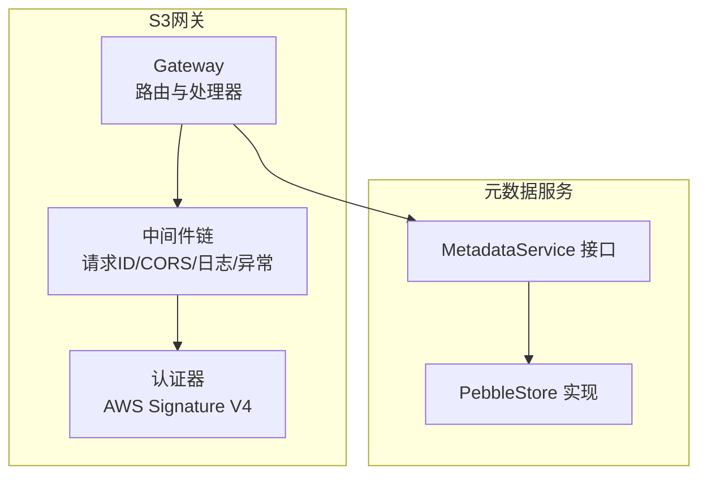
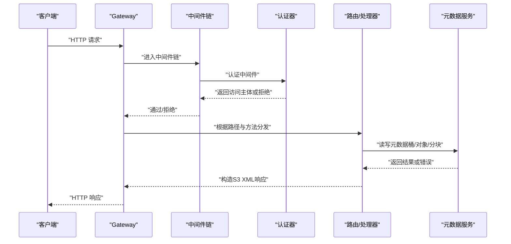
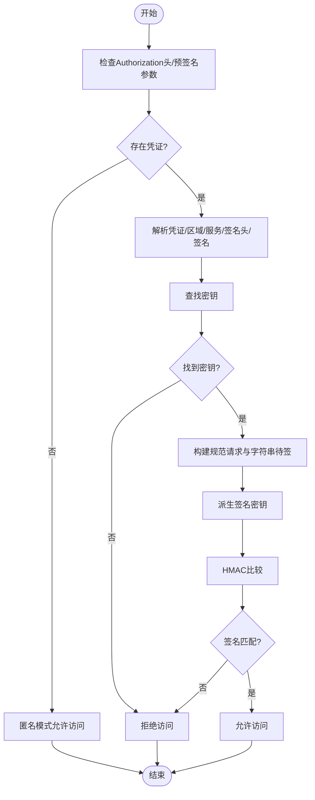
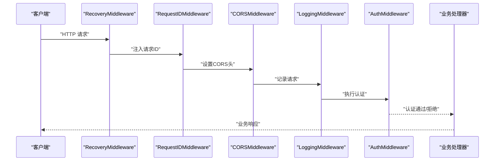
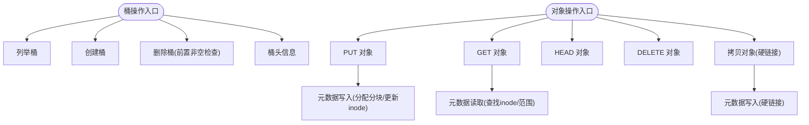
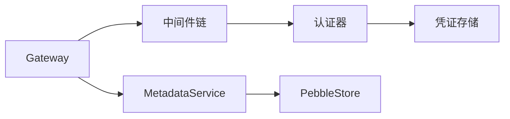

# 访问控制策略

<cite>
**本文引用的文件**
- [nufs-core/gateway/s3/auth.go](file://nufs-core/gateway/s3/auth.go)
- [nufs-core/gateway/s3/middleware.go](file://nufs-core/gateway/s3/middleware.go)
- [nufs-core/gateway/s3/handler.go](file://nufs-core/gateway/s3/handler.go)
- [nufs-core/gateway/s3/bucket.go](file://nufs-core/gateway/s3/bucket.go)
- [nufs-core/gateway/s3/object.go](file://nufs-core/gateway/s3/object.go)
- [nufs-core/gateway/s3/response.go](file://nufs-core/gateway/s3/response.go)
- [nufs-core/metadata/types.go](file://nufs-core/metadata/types.go)
- [nufs-core/metadata/service.go](file://nufs-core/metadata/service.go)
- [nufs-core/metadata/errors.go](file://nufs-core/metadata/errors.go)
- [nufs-core/gateway/cache.go](file://nufs-core/gateway/cache.go)
- [nufs-core/ARCHITECTURE.md](file://nufs-core/ARCHITECTURE.md)
</cite>

## 目录
1. [简介](#简介)
2. [项目结构](#项目结构)
3. [核心组件](#核心组件)
4. [架构总览](#架构总览)
5. [详细组件分析](#详细组件分析)
6. [依赖分析](#依赖分析)
7. [性能考虑](#性能考虑)
8. [故障排查指南](#故障排查指南)
9. [结论](#结论)
10. [附录](#附录)

## 简介
本文件面向NUFS分布式文件系统的访问控制策略，聚焦于S3兼容的认证与授权实现、权限模型设计、资源访问规则与中间件权限检查流程。当前代码库中，认证采用AWS Signature Version 4签名验证；中间件链路包含请求ID注入、CORS支持、日志与异常恢复；对象命名空间与桶元数据由元数据服务统一管理。本文在不直接展示具体代码内容的前提下，通过源码路径定位与图示化方式，系统阐述RBAC与ACL相关能力现状、扩展建议与最佳实践。

## 项目结构
- S3网关位于 nufs-core/gateway/s3，负责HTTP路由、认证、CORS、日志与错误响应。
- 元数据层位于 nufs-core/metadata，提供桶、目录项、inode、分块等核心数据结构与服务接口。
- 网关侧还包含客户端缓存模块，用于本地属性与数据缓存优化。

**图示来源**
- [nufs-core/gateway/s3/handler.go:11-54](file://nufs-core/gateway/s3/handler.go#L11-L54)
- [nufs-core/gateway/s3/middleware.go:11-93](file://nufs-core/gateway/s3/middleware.go#L11-L93)
- [nufs-core/gateway/s3/auth.go:14-98](file://nufs-core/gateway/s3/auth.go#L14-L98)
- [nufs-core/metadata/service.go:16-67](file://nufs-core/metadata/service.go#L16-L67)

**章节来源**
- [nufs-core/gateway/s3/handler.go:11-54](file://nufs-core/gateway/s3/handler.go#L11-L54)
- [nufs-core/gateway/s3/middleware.go:11-93](file://nufs-core/gateway/s3/middleware.go#L11-L93)
- [nufs-core/metadata/service.go:16-67](file://nufs-core/metadata/service.go#L16-L67)

## 核心组件
- 认证与凭证存储
  - 凭证存储结构与签名验证逻辑，支持预签名URL与匿名模式。
  - 参考路径：[nufs-core/gateway/s3/auth.go:14-98](file://nufs-core/gateway/s3/auth.go#L14-L98)
- 中间件链
  - 请求ID注入、CORS、日志、异常恢复与认证中间件组合。
  - 参考路径：[nufs-core/gateway/s3/middleware.go:11-93](file://nufs-core/gateway/s3/middleware.go#L11-L93)
- 路由与处理器
  - 服务级、桶级与对象级路由分发，以及各操作的处理函数。
  - 参考路径：[nufs-core/gateway/s3/handler.go:70-166](file://nufs-core/gateway/s3/handler.go#L70-L166)
- 桶与对象操作
  - 桶的创建、删除、列举、头信息；对象的PUT/GET/HEAD/DELETE/拷贝等。
  - 参考路径：[nufs-core/gateway/s3/bucket.go:11-103](file://nufs-core/gateway/s3/bucket.go#L11-L103)、[nufs-core/gateway/s3/object.go:17-176](file://nufs-core/gateway/s3/object.go#L17-L176)
- 元数据类型与服务接口
  - Inode、Bucket、Chunk等核心类型定义；MetadataService接口。
  - 参考路径：[nufs-core/metadata/types.go:30-66](file://nufs-core/metadata/types.go#L30-L66)、[nufs-core/metadata/service.go:16-67](file://nufs-core/metadata/service.go#L16-L67)
- 错误与响应
  - S3错误码与XML响应封装、HTTP状态映射。
  - 参考路径：[nufs-core/gateway/s3/response.go:128-215](file://nufs-core/gateway/s3/response.go#L128-L215)、[nufs-core/metadata/errors.go:12-90](file://nufs-core/metadata/errors.go#L12-L90)

**章节来源**
- [nufs-core/gateway/s3/auth.go:14-98](file://nufs-core/gateway/s3/auth.go#L14-L98)
- [nufs-core/gateway/s3/middleware.go:11-93](file://nufs-core/gateway/s3/middleware.go#L11-L93)
- [nufs-core/gateway/s3/handler.go:70-166](file://nufs-core/gateway/s3/handler.go#L70-L166)
- [nufs-core/gateway/s3/bucket.go:11-103](file://nufs-core/gateway/s3/bucket.go#L11-L103)
- [nufs-core/gateway/s3/object.go:17-176](file://nufs-core/gateway/s3/object.go#L17-L176)
- [nufs-core/metadata/types.go:30-66](file://nufs-core/metadata/types.go#L30-L66)
- [nufs-core/metadata/service.go:16-67](file://nufs-core/metadata/service.go#L16-L67)
- [nufs-core/gateway/s3/response.go:128-215](file://nufs-core/gateway/s3/response.go#L128-L215)
- [nufs-core/metadata/errors.go:12-90](file://nufs-core/metadata/errors.go#L12-L90)

## 架构总览
下图展示了从HTTP请求到元数据服务的端到端访问控制与处理流程，包括认证、中间件、路由与业务处理。

**图示来源**
- [nufs-core/gateway/s3/handler.go:46-166](file://nufs-core/gateway/s3/handler.go#L46-L166)
- [nufs-core/gateway/s3/middleware.go:58-70](file://nufs-core/gateway/s3/middleware.go#L58-L70)
- [nufs-core/gateway/s3/auth.go:33-98](file://nufs-core/gateway/s3/auth.go#L33-L98)
- [nufs-core/metadata/service.go:16-67](file://nufs-core/metadata/service.go#L16-L67)

## 详细组件分析

### 组件A：认证与签名验证（AWS Signature V4）
- 能力概述
  - 支持标准Authorization头与预签名URL两种校验路径。
  - 未配置凭证时允许匿名访问；缺失凭证时返回禁止访问。
  - 生成规范请求、字符串待签、派生密钥并进行HMAC比对。
- 关键流程
  - 解析Authorization头，提取凭证、区域、服务、签名头与签名值。
  - 从凭证存储匹配密钥，派生签名密钥，计算期望签名并与提供签名比较。
  - 预签名URL场景仅做基本格式与密钥存在性校验。
- 适配S3 ACL
  - 当前未实现S3 ACL字段解析与细粒度权限判断；签名通过即放行，后续可在此处扩展“主体-桶/对象-权限”映射。

**图示来源**
- [nufs-core/gateway/s3/auth.go:33-98](file://nufs-core/gateway/s3/auth.go#L33-L98)

**章节来源**
- [nufs-core/gateway/s3/auth.go:33-98](file://nufs-core/gateway/s3/auth.go#L33-L98)

### 组件B：中间件与权限检查（当前实现与扩展建议）
- 当前实现
  - 请求ID注入、CORS支持、日志记录、异常恢复与认证中间件。
  - 认证中间件在通过签名验证后才放行至业务处理器。
- RBAC与ACL扩展建议
  - 在认证中间件之后增加“主体-资源-动作”权限矩阵检查。
  - 对桶级与对象级操作分别映射为“读/写/删除/列出”等动作。
  - 结合Inode中的UID/GID/Mode字段，实现POSIX风格的属主与权限判断。
  - 对跨域请求，可在CORS中间件中加入基于来源的白名单与凭据策略。
- 中间件链顺序
  - Recovery → RequestID → CORS → Logging → Auth → 业务处理器

**图示来源**
- [nufs-core/gateway/s3/middleware.go:11-93](file://nufs-core/gateway/s3/middleware.go#L11-L93)
- [nufs-core/gateway/s3/handler.go:46-54](file://nufs-core/gateway/s3/handler.go#L46-L54)

**章节来源**
- [nufs-core/gateway/s3/middleware.go:11-93](file://nufs-core/gateway/s3/middleware.go#L11-L93)
- [nufs-core/gateway/s3/handler.go:46-54](file://nufs-core/gateway/s3/handler.go#L46-L54)

### 组件C：桶级权限控制与对象级访问管理
- 桶级操作
  - 列举桶、创建桶、删除桶、头信息查询；删除前检查非空。
  - 参考路径：[nufs-core/gateway/s3/bucket.go:11-103](file://nufs-core/gateway/s3/bucket.go#L11-L103)
- 对象级操作
  - PUT/GET/HEAD/DELETE/拷贝；范围读取、ETag计算、硬链接复制。
  - 参考路径：[nufs-core/gateway/s3/object.go:17-176](file://nufs-core/gateway/s3/object.go#L17-L176)
- 元数据支撑
  - Inode包含UID/GID/Mode等权限字段；BucketInfo包含根Inode与放置策略。
  - 参考路径：[nufs-core/metadata/types.go:30-66](file://nufs-core/metadata/types.go#L30-L66)

**图示来源**
- [nufs-core/gateway/s3/bucket.go:11-103](file://nufs-core/gateway/s3/bucket.go#L11-L103)
- [nufs-core/gateway/s3/object.go:17-176](file://nufs-core/gateway/s3/object.go#L17-L176)
- [nufs-core/metadata/types.go:30-66](file://nufs-core/metadata/types.go#L30-L66)

**章节来源**
- [nufs-core/gateway/s3/bucket.go:11-103](file://nufs-core/gateway/s3/bucket.go#L11-L103)
- [nufs-core/gateway/s3/object.go:17-176](file://nufs-core/gateway/s3/object.go#L17-L176)
- [nufs-core/metadata/types.go:30-66](file://nufs-core/metadata/types.go#L30-L66)

### 组件D：S3兼容ACL与精细权限设置（现状与建议）
- 现状
  - 未实现S3 ACL字段解析与Canned ACL常量支持；未见bucket/object ACL字段。
  - 认证通过即放行，未在处理器内部进行细粒度权限判断。
- 建议
  - 在路由分发后、业务处理前增加“动作-主体-资源-权限”检查。
  - 引入ACL字段（如Owner、Grants），在BucketInfo与InodeMeta中扩展。
  - 支持常见Canned ACL（如private、public-read等）映射到具体权限集合。
  - 对跨域请求，结合CORS中间件与ACL白名单共同控制。

**章节来源**
- [nufs-core/gateway/s3/auth.go:33-98](file://nufs-core/gateway/s3/auth.go#L33-L98)
- [nufs-core/gateway/s3/middleware.go:58-70](file://nufs-core/gateway/s3/middleware.go#L58-L70)
- [nufs-core/metadata/types.go:30-66](file://nufs-core/metadata/types.go#L30-L66)

### 组件E：用户组与多租户隔离（现状与建议）
- 现状
  - 未发现用户组与多租户隔离的显式实现。
- 建议
  - 引入用户/用户组/角色模型，结合RBAC在认证后进行“角色-权限”映射。
  - 多租户可通过命名空间隔离（不同租户使用独立桶前缀/命名空间）与租户维度的ACL共同实现。
  - 在元数据层面，为每个租户维护独立的策略索引与审计日志。

**章节来源**
- [nufs-core/metadata/service.go:16-67](file://nufs-core/metadata/service.go#L16-L67)

### 组件F：权限缓存策略
- 现状
  - 网关侧提供客户端缓存模块，用于属性与数据缓存，但未见针对权限决策的专用缓存。
- 建议
  - 将“主体-资源-动作”权限结果按TTL缓存，降低重复鉴权开销。
  - 缓存失效策略：基于主体/资源变更触发失效，或定期刷新。
  - 与元数据一致性结合，确保缓存命中与实际权限状态一致。

**章节来源**
- [nufs-core/gateway/cache.go:17-111](file://nufs-core/gateway/cache.go#L17-L111)

## 依赖分析
- 组件耦合
  - Gateway依赖MetadataService进行桶与对象的元数据操作。
  - 认证器依赖CredentialStore进行密钥管理。
  - 中间件链对认证器形成依赖，认证通过后才进入业务处理。
- 外部集成
  - S3响应格式与错误码遵循S3规范，便于与S3客户端兼容。
  - CORS中间件支持浏览器直连S3客户端。

**图示来源**
- [nufs-core/gateway/s3/auth.go:14-29](file://nums-core/gateway/s3/auth.go#L14-L29)
- [nufs-core/gateway/s3/middleware.go:58-70](file://nufs-core/gateway/s3/middleware.go#L58-L70)
- [nufs-core/gateway/s3/handler.go:13-33](file://nufs-core/gateway/s3/handler.go#L13-L33)
- [nufs-core/metadata/service.go:16-67](file://nufs-core/metadata/service.go#L16-L67)

**章节来源**
- [nufs-core/gateway/s3/auth.go:14-29](file://nufs-core/gateway/s3/auth.go#L14-L29)
- [nufs-core/gateway/s3/middleware.go:58-70](file://nufs-core/gateway/s3/middleware.go#L58-L70)
- [nufs-core/gateway/s3/handler.go:13-33](file://nufs-core/gateway/s3/handler.go#L13-L33)
- [nufs-core/metadata/service.go:16-67](file://nufs-core/metadata/service.go#L16-L67)

## 性能考虑
- 认证性能
  - AWS Signature V4计算包含哈希与HMAC，建议在高并发场景启用连接池与限流。
- 缓存优化
  - 使用客户端缓存减少元数据查询往返；对权限结果进行短期缓存以降低鉴权成本。
- 路由与中间件
  - 中间件链顺序合理，避免在认证前进行昂贵操作；异常恢复中间件防止崩溃影响整体稳定性。

[本节为通用指导，无需特定文件引用]

## 故障排查指南
- 常见错误与定位
  - 认证失败：检查Authorization头格式、签名是否匹配、时间戳是否过期。
  - 桶不存在/非空：确认桶名正确与桶内是否仍有对象。
  - 对象不存在：确认键名与桶名拼接正确。
- 错误响应
  - 使用S3错误码与XML响应格式，便于客户端识别与处理。
- 日志与追踪
  - 中间件链输出请求日志，配合请求ID快速定位问题。

**章节来源**
- [nufs-core/gateway/s3/response.go:128-215](file://nufs-core/gateway/s3/response.go#L128-L215)
- [nufs-core/metadata/errors.go:12-90](file://nufs-core/metadata/errors.go#L12-L90)
- [nufs-core/gateway/s3/middleware.go:23-33](file://nufs-core/gateway/s3/middleware.go#L23-L33)

## 结论
- 当前实现以AWS Signature V4为基础完成认证，并通过中间件链提供CORS、日志与异常恢复；桶与对象操作由元数据服务支撑。
- RBAC与ACL尚未实现，建议在认证后引入“主体-资源-动作-权限”矩阵，并结合POSIX权限字段与Canned ACL支持逐步完善。
- 多租户与用户组可通过命名空间隔离与策略映射实现，配合权限缓存与审计日志提升安全性与可观测性。

[本节为总结性内容，无需特定文件引用]

## 附录

### A. 权限配置示例（概念性）
- 凭证配置
  - 在CredentialStore中注册accessKey/secretKey对，用于签名验证。
- ACL策略（建议）
  - 为桶/对象设置Owner与Grants，映射到读/写/删除/列出等动作。
  - 支持Canned ACL常量，如private、public-read等。
- 用户组与角色（建议）
  - 定义角色与权限集合，将用户加入相应组，实现集中式权限管理。

**章节来源**
- [nufs-core/gateway/s3/auth.go:14-29](file://nufs-core/gateway/s3/auth.go#L14-L29)
- [nufs-core/metadata/types.go:30-66](file://nufs-core/metadata/types.go#L30-L66)

### B. 权限继承规则（建议）
- 桶级默认ACL可作为对象ACL的默认值，对象ACL优先于桶级ACL。
- 新建对象继承父目录的ACL属性，支持覆盖与显式设置。

**章节来源**
- [nufs-core/metadata/types.go:30-66](file://nufs-core/metadata/types.go#L30-L66)

### C. 权限审计方法（建议）
- 记录每次鉴权尝试（主体、资源、动作、结果、请求ID、时间戳）。
- 定期导出审计日志，结合指标监控与告警系统进行合规检查。

**章节来源**
- [nufs-core/gateway/s3/middleware.go:23-33](file://nufs-core/gateway/s3/middleware.go#L23-L33)
- [nufs-core/ARCHITECTURE.md:856-916](file://nufs-core/ARCHITECTURE.md#L856-L916)