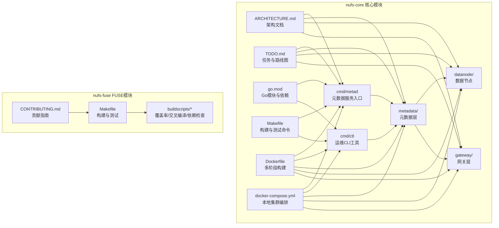
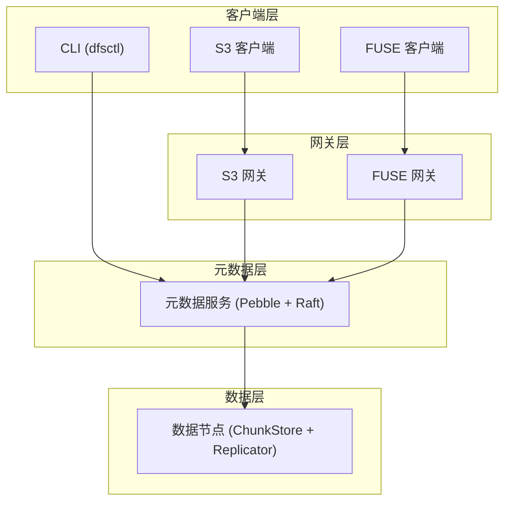
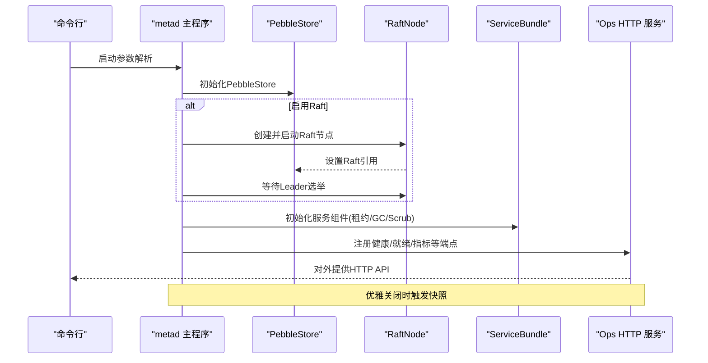
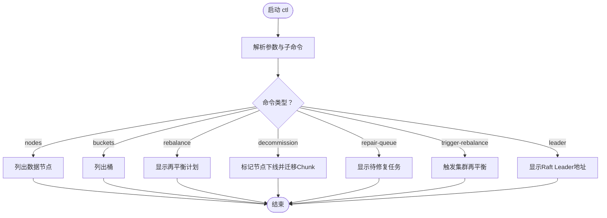
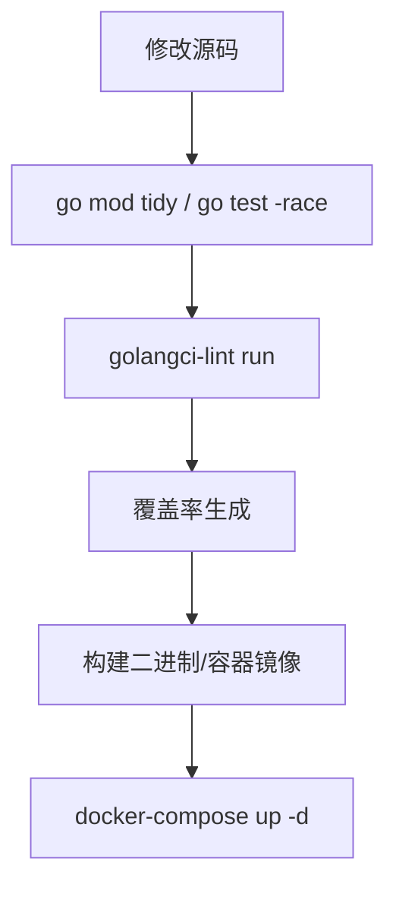
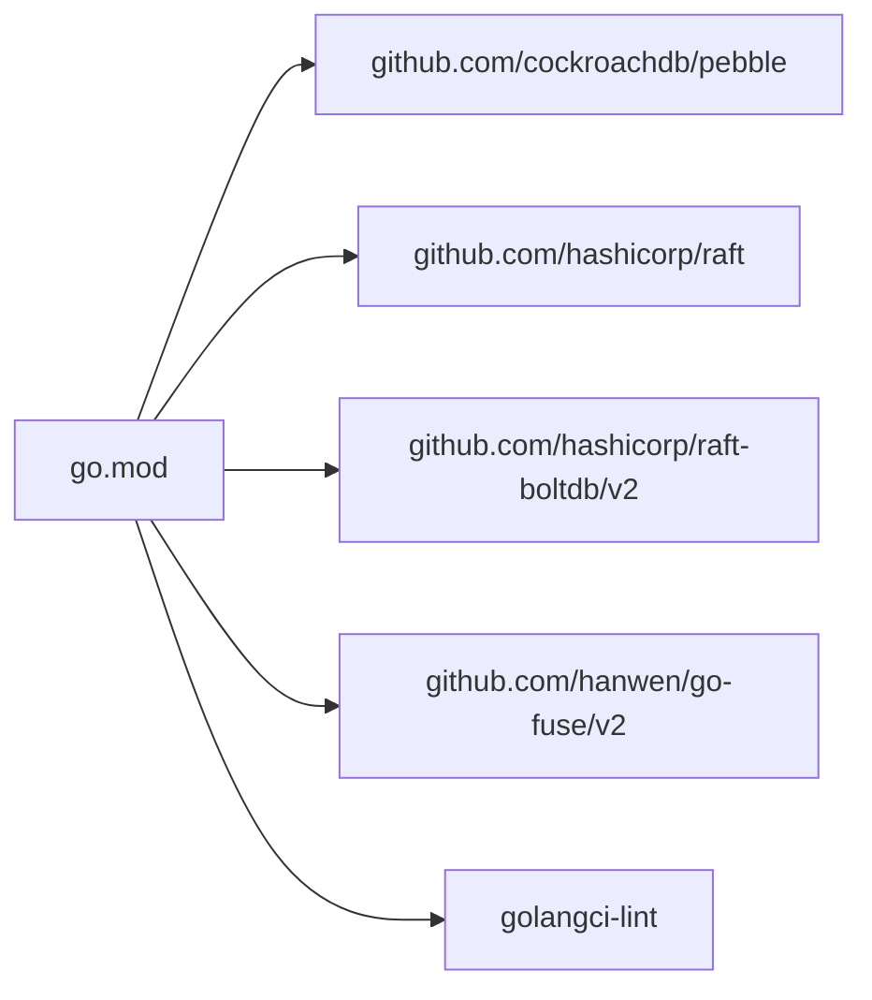

# 代码贡献流程

<cite>
**本文引用的文件**
- [nufs-core/ARCHITECTURE.md](file://nufs-core/ARCHITECTURE.md)
- [nufs-core/TODO.md](file://nufs-core/TODO.md)
- [nufs-core/go.mod](file://nufs-core/go.mod)
- [nufs-core/Makefile](file://nufs-core/Makefile)
- [nufs-core/docker-compose.yml](file://nufs-core/docker-compose.yml)
- [nufs-core/Dockerfile](file://nufs-core/Dockerfile)
- [nufs-core/cmd/metad/main.go](file://nufs-core/cmd/metad/main.go)
- [nufs-core/cmd/ctl/main.go](file://nufs-core/cmd/ctl/main.go)
- [nufs-fuse/CONTRIBUTING.md](file://nufs-fuse/CONTRIBUTING.md)
- [nufs-fuse/Makefile](file://nufs-fuse/Makefile)
- [nufs-fuse/buildscripts/go-coverage.sh](file://nufs-fuse/buildscripts/go-coverage.sh)
- [nufs-fuse/buildscripts/cross-compile.sh](file://nufs-fuse/buildscripts/cross-compile.sh)
- [nufs-fuse/buildscripts/checkdeps.sh](file://nufs-fuse/buildscripts/checkdeps.sh)
</cite>

## 目录
1. [简介](#简介)
2. [项目结构](#项目结构)
3. [核心组件](#核心组件)
4. [架构总览](#架构总览)
5. [详细组件分析](#详细组件分析)
6. [依赖分析](#依赖分析)
7. [性能考虑](#性能考虑)
8. [故障排查指南](#故障排查指南)
9. [结论](#结论)
10. [附录](#附录)

## 简介
本指南面向NUFS项目的贡献者，提供从零开始的完整贡献流程，涵盖以下方面：
- GitHub Fork 与 Pull Request 工作流
- 分支管理策略、提交规范与代码审查流程
- 编码规范与Go语言最佳实践（结合Effective Go）
- 依赖管理（govendor使用方式）
- 测试要求与代码质量检查流程
- 如何新增功能、修复Bug与改进现有代码
- Pull Request 模板、代码审查标准与合并要求
- 新贡献者入门与常见问题解答

## 项目结构
NUFS采用多模块组织方式，核心代码位于 nufs-core，FUSE相关代码位于 nufs-fuse。每个模块均包含独立的构建脚本、测试与依赖声明。

**图表来源**
- [nufs-core/cmd/metad/main.go:1-220](file://nufs-core/cmd/metad/main.go#L1-L220)
- [nufs-core/cmd/ctl/main.go:1-228](file://nufs-core/cmd/ctl/main.go#L1-L228)
- [nufs-core/ARCHITECTURE.md:1-1005](file://nufs-core/ARCHITECTURE.md#L1-L1005)
- [nufs-core/TODO.md:1-194](file://nufs-core/TODO.md#L1-L194)
- [nufs-core/go.mod:1-51](file://nufs-core/go.mod#L1-L51)
- [nufs-core/Makefile:1-76](file://nufs-core/Makefile#L1-L76)
- [nufs-core/Dockerfile:1-50](file://nufs-core/Dockerfile#L1-L50)
- [nufs-core/docker-compose.yml:1-148](file://nufs-core/docker-compose.yml#L1-L148)
- [nufs-fuse/CONTRIBUTING.md:1-72](file://nufs-fuse/CONTRIBUTING.md#L1-L72)
- [nufs-fuse/Makefile:1-58](file://nufs-fuse/Makefile#L1-L58)

**章节来源**
- [nufs-core/ARCHITECTURE.md:1-1005](file://nufs-core/ARCHITECTURE.md#L1-L1005)
- [nufs-core/TODO.md:1-194](file://nufs-core/TODO.md#L1-L194)
- [nufs-core/go.mod:1-51](file://nufs-core/go.mod#L1-L51)
- [nufs-core/Makefile:1-76](file://nufs-core/Makefile#L1-L76)
- [nufs-core/Dockerfile:1-50](file://nufs-core/Dockerfile#L1-L50)
- [nufs-core/docker-compose.yml:1-148](file://nufs-core/docker-compose.yml#L1-L148)
- [nufs-fuse/CONTRIBUTING.md:1-72](file://nufs-fuse/CONTRIBUTING.md#L1-L72)
- [nufs-fuse/Makefile:1-58](file://nufs-fuse/Makefile#L1-L58)

## 核心组件
- 元数据服务（metad）：基于Pebble + Raft，提供命名空间、Inode、Chunk映射与集群治理能力。
- 数据节点（datanode）：提供Chunk的存储、复制、心跳上报与磁盘管理。
- 网关层（gateway）：S3兼容API与FUSE挂载接口。
- 运维CLI（ctl）：节点列表、桶管理、再平衡计划、修复队列、触发再平衡等。
- 构建与测试：Makefile统一管理构建、测试、覆盖率、静态检查与Docker打包。

**章节来源**
- [nufs-core/cmd/metad/main.go:1-220](file://nufs-core/cmd/metad/main.go#L1-L220)
- [nufs-core/cmd/ctl/main.go:1-228](file://nufs-core/cmd/ctl/main.go#L1-L228)
- [nufs-core/Makefile:1-76](file://nufs-core/Makefile#L1-L76)

## 架构总览
NUFS采用“客户端层—网关层—元数据层—数据层”的四层架构，支持S3 API与FUSE挂载，并通过Raft保证元数据一致性，通过复制引擎保障数据可靠性。

**图表来源**
- [nufs-core/ARCHITECTURE.md:37-115](file://nufs-core/ARCHITECTURE.md#L37-L115)
- [nufs-core/cmd/metad/main.go:1-220](file://nufs-core/cmd/metad/main.go#L1-L220)

**章节来源**
- [nufs-core/ARCHITECTURE.md:1-1005](file://nufs-core/ARCHITECTURE.md#L1-L1005)

## 详细组件分析

### 元数据服务（metad）启动流程
元数据服务负责初始化Pebble存储、可选的Raft共识、服务组件与HTTP运维接口，并在优雅关闭前触发快照。

**图表来源**
- [nufs-core/cmd/metad/main.go:21-149](file://nufs-core/cmd/metad/main.go#L21-L149)

**章节来源**
- [nufs-core/cmd/metad/main.go:1-220](file://nufs-core/cmd/metad/main.go#L1-L220)

### 运维CLI（ctl）命令流程
ctl提供节点、桶、再平衡、下线、修复队列、触发再平衡与Leader查询等命令。

**图表来源**
- [nufs-core/cmd/ctl/main.go:17-228](file://nufs-core/cmd/ctl/main.go#L17-L228)

**章节来源**
- [nufs-core/cmd/ctl/main.go:1-228](file://nufs-core/cmd/ctl/main.go#L1-L228)

### 依赖与构建流程
- 依赖管理：使用Go模块（go.mod/go.sum），核心依赖包括Pebble、Raft、Raft-boltdb、go-fuse等。
- 构建：Makefile提供统一构建、测试、覆盖率、静态检查、Docker镜像与docker-compose编排。
- Docker：多阶段构建，分别产出各服务二进制，运行时镜像精简。

**图表来源**
- [nufs-core/go.mod:1-51](file://nufs-core/go.mod#L1-L51)
- [nufs-core/Makefile:1-76](file://nufs-core/Makefile#L1-L76)
- [nufs-core/Dockerfile:1-50](file://nufs-core/Dockerfile#L1-L50)
- [nufs-core/docker-compose.yml:1-148](file://nufs-core/docker-compose.yml#L1-L148)

**章节来源**
- [nufs-core/go.mod:1-51](file://nufs-core/go.mod#L1-L51)
- [nufs-core/Makefile:1-76](file://nufs-core/Makefile#L1-L76)
- [nufs-core/Dockerfile:1-50](file://nufs-core/Dockerfile#L1-L50)
- [nufs-core/docker-compose.yml:1-148](file://nufs-core/docker-compose.yml#L1-L148)

## 依赖分析
- 模块依赖：nufs-core/cmd/* 依赖 metadata、datanode、gateway 等子包；各子包之间通过接口与类型耦合。
- 外部依赖：Pebble用于元数据存储，Raft用于共识，go-fuse用于FUSE挂载，golangci-lint用于静态检查。
- 依赖变更：通过go.mod管理，建议使用go mod tidy保持一致性。

**图表来源**
- [nufs-core/go.mod:5-10](file://nufs-core/go.mod#L5-L10)

**章节来源**
- [nufs-core/go.mod:1-51](file://nufs-core/go.mod#L1-L51)

## 性能考虑
- 读写路径优化：客户端缓存（属性与数据）、就近副本读取、写入异步复制。
- 元数据优化：小文件合并存储（SmallFileBlock），显著降低元数据开销与磁盘浪费。
- 复制与修复：链式复制、指数退避重试、定期扫描与GC。
- 部署与弹性：Raft Leader选举、租约管理、再平衡与下线迁移。

**章节来源**
- [nufs-core/ARCHITECTURE.md:347-586](file://nufs-core/ARCHITECTURE.md#L347-L586)

## 故障排查指南
- 本地集群启动失败：检查docker-compose健康检查端点与端口映射，确保metad先就绪。
- 元数据异常：查看metad的/health与/ready端点，确认Raft Leader状态与服务组件是否初始化完成。
- 数据节点不可达：检查数据节点监听端口、与metad的连接参数以及磁盘路径权限。
- 构建/测试问题：使用Makefile提供的命令进行验证，确保golangci-lint、覆盖率脚本与交叉编译脚本可用。

**章节来源**
- [nufs-core/docker-compose.yml:28-33](file://nufs-core/docker-compose.yml#L28-L33)
- [nufs-core/cmd/metad/main.go:154-211](file://nufs-core/cmd/metad/main.go#L154-L211)
- [nufs-fuse/Makefile:23-28](file://nufs-fuse/Makefile#L23-L28)
- [nufs-fuse/buildscripts/go-coverage.sh:1-6](file://nufs-fuse/buildscripts/go-coverage.sh#L1-L6)
- [nufs-fuse/buildscripts/cross-compile.sh:1-36](file://nufs-fuse/buildscripts/cross-compile.sh#L1-L36)
- [nufs-fuse/buildscripts/checkdeps.sh:63-118](file://nufs-fuse/buildscripts/checkdeps.sh#L63-L118)

## 结论
本指南提供了NUFS项目的完整贡献流程与最佳实践，建议贡献者遵循既定的分支策略、提交规范与代码审查流程，确保代码质量与可维护性。同时，利用现有的构建与测试工具链，快速定位问题并推动功能迭代。

## 附录

### GitHub Fork 与 Pull Request 工作流
- Fork上游仓库至个人账户
- 在本地创建功能分支（建议以feat/fix/docs开头）
- 提交前执行：go mod tidy、go test -race、golangci-lint run
- 提交信息格式：类型(scope): 描述（参考Angular风格）
- 推送分支并创建PR，等待代码审查与CI验证

### 分支管理策略
- 主分支：保护分支，仅允许通过PR合并
- 开发分支：develop 或 main，用于集成日常变更
- 功能分支：按功能或任务创建短期分支，完成后合并回develop/main
- 热修复分支：紧急修复可从主分支切出，修复后同时合并回主分支与develop

### 提交规范
- 类型：feat、fix、docs、style、refactor、perf、test、build、ci、chore、revert
- Scope：模块或子系统名称（如metadata、datanode、gateway、fuse）
- 描述：简洁明确地描述变更内容，必要时补充动机与影响范围

### 代码审查流程
- 至少一名维护者审查
- 关注点：正确性、可读性、性能、安全性、测试覆盖、文档更新
- 通过CI与本地测试（race检测、覆盖率）

### 依赖管理（govendor使用方式）
- 添加依赖：go get <包名>，编辑代码导入，执行 make pkg-add PKG=<包名>
- 移除依赖：编辑代码移除导入，执行 make pkg-remove PKG=<包名>
- 保持 go.mod 与 go.sum 同步：go mod tidy

**章节来源**
- [nufs-fuse/CONTRIBUTING.md:45-72](file://nufs-fuse/CONTRIBUTING.md#L45-L72)

### 测试要求与代码质量检查
- 单元测试：go test -race ./...
- 覆盖率：go test -race -coverprofile=coverage/cover.out ./... 并生成HTML报告
- 静态检查：golangci-lint run ./...
- 构建验证：CGO_ENABLED=0 go build ./cmd/...

**章节来源**
- [nufs-core/Makefile:33-52](file://nufs-core/Makefile#L33-L52)
- [nufs-fuse/Makefile:23-28](file://nufs-fuse/Makefile#L23-L28)
- [nufs-fuse/buildscripts/go-coverage.sh:1-6](file://nufs-fuse/buildscripts/go-coverage.sh#L1-L6)

### 新增功能/修复Bug/改进代码步骤
- 新增功能
  - 在TODO.md中登记任务，必要时与维护者讨论设计
  - 在对应模块编写单元测试，确保边界与错误路径覆盖
  - 提交前执行测试、静态检查与覆盖率
- 修复Bug
  - 编写最小化复现测试，定位问题根因
  - 提供修复方案与回归测试
- 改进现有代码
  - 重构时保持行为不变，增加测试覆盖
  - 优化性能与可读性，避免破坏兼容性

**章节来源**
- [nufs-core/TODO.md:57-194](file://nufs-core/TODO.md#L57-L194)

### Pull Request 模板与审查标准
- PR模板建议字段
  - 更改摘要、类型、模块、影响范围
  - 问题背景与解决方案、测试策略、性能影响
  - 是否破坏兼容性、是否需要发布说明
- 审查标准
  - 代码风格与可读性（遵循Effective Go）
  - 正确性与健壮性（边界条件、错误处理）
  - 性能与资源使用（避免热点与泄漏）
  - 文档与注释（接口、算法、配置项）

**章节来源**
- [nufs-fuse/CONTRIBUTING.md:45-72](file://nufs-fuse/CONTRIBUTING.md#L45-L72)

### 合并要求
- 通过所有CI检查（测试、静态检查、覆盖率）
- 至少一名维护者批准
- 无阻塞性评论，必要时进行二次审查
- 合并前确保分支最新并解决冲突

### 新贡献者入门
- 准备工作：安装Go环境、克隆仓库、设置upstream
- 环境验证：make test、make lint、make docker-up
- 首次贡献：选择good first issue或文档类任务，遵循上述流程

**章节来源**
- [nufs-fuse/CONTRIBUTING.md:1-72](file://nufs-fuse/CONTRIBUTING.md#L1-L72)
- [nufs-core/Makefile:1-76](file://nufs-core/Makefile#L1-L76)
- [nufs-core/docker-compose.yml:1-148](file://nufs-core/docker-compose.yml#L1-L148)