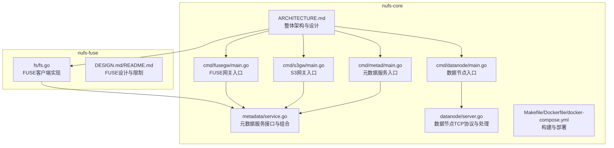
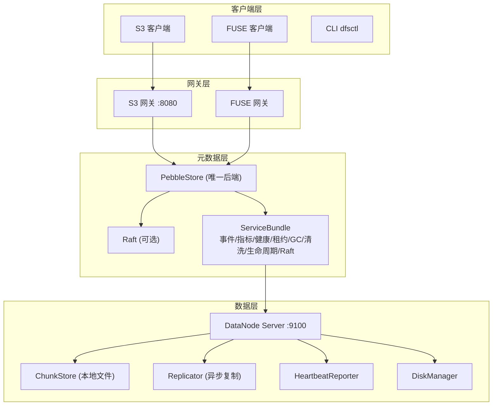
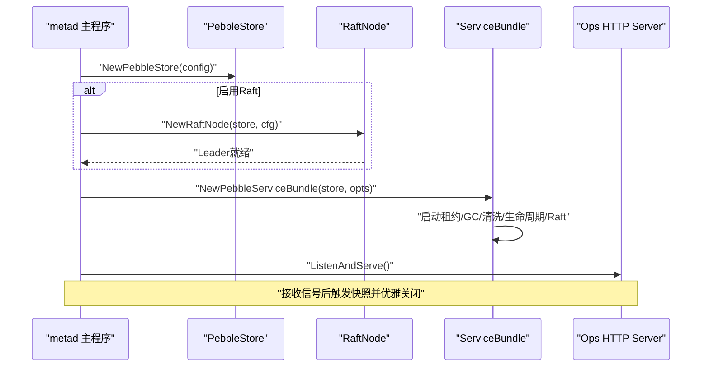
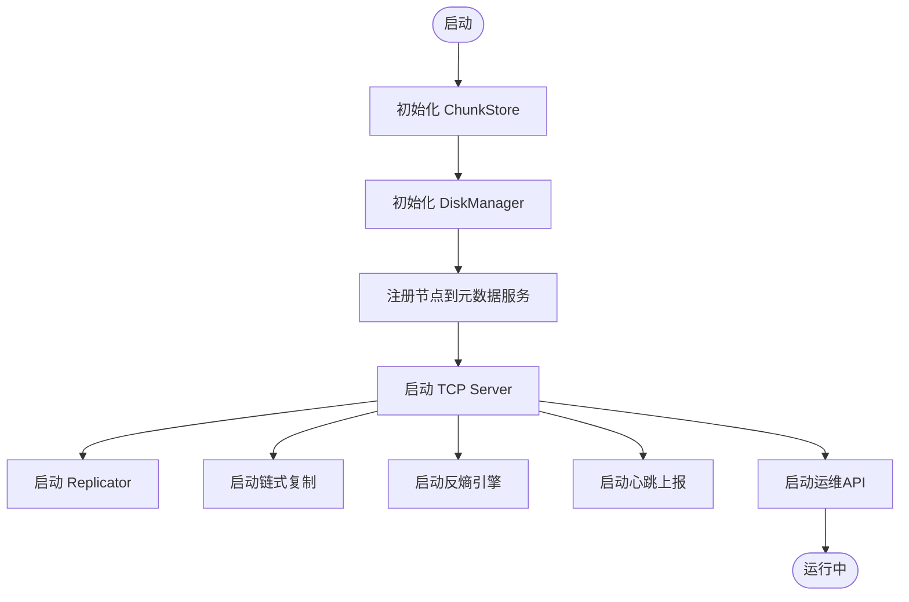
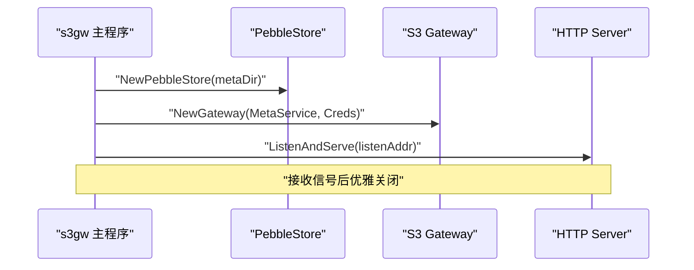
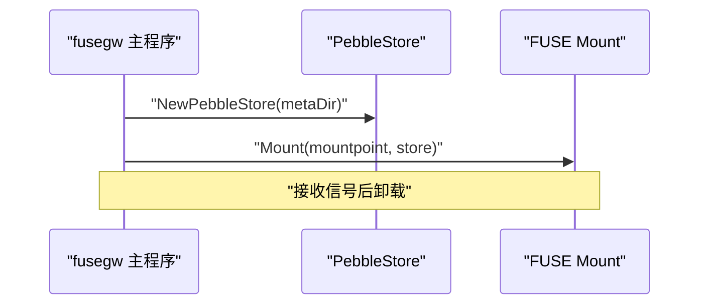
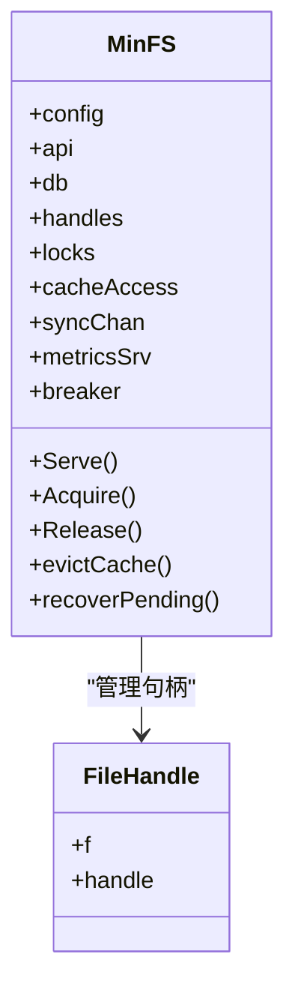
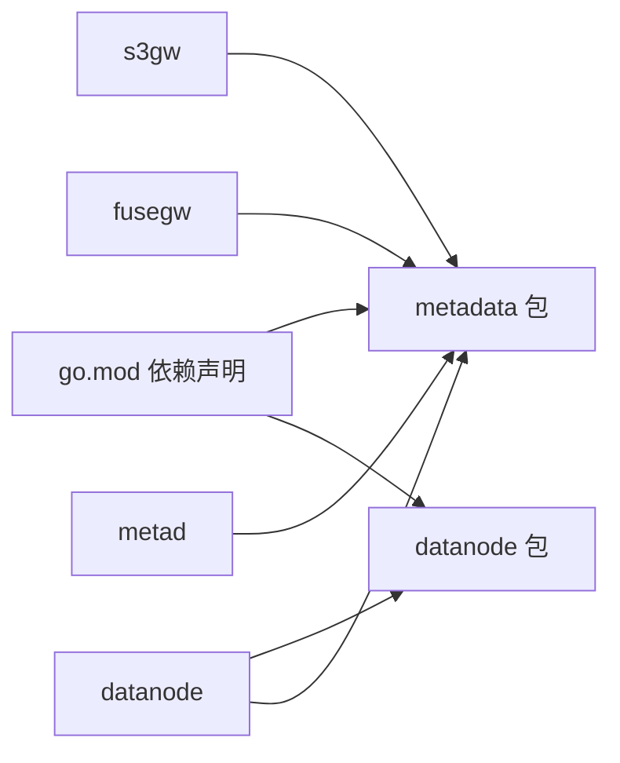

# 开发指南

<cite>
**本文引用的文件**
- [ARCHITECTURE.md](file://nufs-core/ARCHITECTURE.md)
- [TODO.md](file://nufs-core/TODO.md)
- [go.mod](file://nufs-core/go.mod)
- [Makefile](file://nufs-core/Makefile)
- [Dockerfile](file://nufs-core/Dockerfile)
- [docker-compose.yml](file://nufs-core/docker-compose.yml)
- [cmd/metad/main.go](file://nufs-core/cmd/metad/main.go)
- [cmd/datanode/main.go](file://nufs-core/cmd/datanode/main.go)
- [cmd/s3gw/main.go](file://nufs-core/cmd/s3gw/main.go)
- [cmd/fusegw/main.go](file://nufs-core/cmd/fusegw/main.go)
- [metadata/service.go](file://nufs-core/metadata/service.go)
- [datanode/server.go](file://nufs-core/datanode/server.go)
- [nufs-fuse/CONTRIBUTING.md](file://nufs-fuse/CONTRIBUTING.md)
- [nufs-fuse/DESIGN.md](file://nufs-fuse/DESIGN.md)
- [nufs-fuse/README.md](file://nufs-fuse/README.md)
- [nufs-fuse/fs/fs.go](file://nufs-fuse/fs/fs.go)
</cite>

## 目录
1. [简介](#简介)
2. [项目结构](#项目结构)
3. [核心组件](#核心组件)
4. [架构总览](#架构总览)
5. [详细组件分析](#详细组件分析)
6. [依赖分析](#依赖分析)
7. [性能考虑](#性能考虑)
8. [调试与排障指南](#调试与排障指南)
9. [结论](#结论)
10. [附录](#附录)

## 简介
本指南面向NUFS分布式文件系统的开发者，覆盖开发环境搭建、代码贡献流程、调试技巧、性能分析、代码结构与设计原则、构建与测试、发布流程、IDE配置建议以及版本管理策略。文档同时兼顾新贡献者的入门引导与资深开发者的深入技术细节与最佳实践。

## 项目结构
NUFS由两部分组成：
- nufs-core：分布式文件系统核心，包含元数据服务、数据节点、网关层（S3/FUSE）、部署与构建脚本等。
- nufs-fuse：FUSE网关客户端（兼容MinIO风格），提供POSIX挂载能力。

**图表来源**
- [cmd/metad/main.go:21-150](file://nufs-core/cmd/metad/main.go#L21-L150)
- [cmd/datanode/main.go:19-135](file://nufs-core/cmd/datanode/main.go#L19-L135)
- [cmd/s3gw/main.go:18-91](file://nufs-core/cmd/s3gw/main.go#L18-L91)
- [cmd/fusegw/main.go:17-63](file://nufs-core/cmd/fusegw/main.go#L17-L63)
- [metadata/service.go:16-67](file://nufs-core/metadata/service.go#L16-L67)
- [datanode/server.go:18-126](file://nufs-core/datanode/server.go#L18-L126)
- [ARCHITECTURE.md:25-116](file://nufs-core/ARCHITECTURE.md#L25-L116)
- [Makefile:1-76](file://nufs-core/Makefile#L1-L76)
- [Dockerfile:1-50](file://nufs-core/Dockerfile#L1-L50)
- [docker-compose.yml:1-148](file://nufs-core/docker-compose.yml#L1-L148)
- [nufs-fuse/fs/fs.go:62-162](file://nufs-fuse/fs/fs.go#L62-L162)

**章节来源**
- [ARCHITECTURE.md:25-116](file://nufs-core/ARCHITECTURE.md#L25-L116)
- [Makefile:1-76](file://nufs-core/Makefile#L1-L76)
- [Dockerfile:1-50](file://nufs-core/Dockerfile#L1-L50)
- [docker-compose.yml:1-148](file://nufs-core/docker-compose.yml#L1-L148)

## 核心组件
- 元数据服务（metad）：基于Pebble的KV存储，可选Raft共识；提供统一的MetadataService接口与ServiceBundle组合生产子系统（事件总线、指标、健康检查、租约、GC、数据清洗、生命周期、Raft）。
- 数据节点（datanode）：提供ChunkStore本地存储、Replicator复制引擎、链式复制、反熵引擎、心跳上报、TCP协议服务与运维API。
- 网关层（s3gw/fusegw）：S3兼容REST API与FUSE POSIX挂载，均通过PebbleStore访问元数据。
- 构建与部署：多阶段Dockerfile、Makefile命令、docker-compose编排，支持单机开发、Docker Compose生产小集群与Kubernetes部署（待完善）。

**章节来源**
- [metadata/service.go:16-67](file://nufs-core/metadata/service.go#L16-L67)
- [metadata/service.go:76-135](file://nufs-core/metadata/service.go#L76-L135)
- [cmd/metad/main.go:21-150](file://nufs-core/cmd/metad/main.go#L21-L150)
- [cmd/datanode/main.go:19-135](file://nufs-core/cmd/datanode/main.go#L19-L135)
- [cmd/s3gw/main.go:18-91](file://nufs-core/cmd/s3gw/main.go#L18-L91)
- [cmd/fusegw/main.go:17-63](file://nufs-core/cmd/fusegw/main.go#L17-L63)

## 架构总览
NUFS采用分层架构：客户端层（S3/FUSE/CLI）→ 网关层（S3/FUSE）→ 元数据层（Pebble+Raft）→ 数据层（DataNode ChunkStore/Replicator/Heartbeat）→ 存储后端（本地文件系统）。系统强调一致性模型（Raft多数派+MVCC）、容错（租约/心跳/修复/反熵）、小文件优化（SmallFileBlock合并）、客户端缓存策略与生命周期管理。

**图表来源**
- [ARCHITECTURE.md:37-116](file://nufs-core/ARCHITECTURE.md#L37-L116)
- [cmd/metad/main.go:44-106](file://nufs-core/cmd/metad/main.go#L44-L106)
- [cmd/datanode/main.go:51-123](file://nufs-core/cmd/datanode/main.go#L51-L123)
- [cmd/s3gw/main.go:30-52](file://nufs-core/cmd/s3gw/main.go#L30-L52)
- [cmd/fusegw/main.go:34-47](file://nufs-core/cmd/fusegw/main.go#L34-L47)

## 详细组件分析

### 元数据服务（metad）
- 初始化PebbleStore与可选Raft节点，等待Leader就绪。
- 创建ServiceBundle，组合事件总线、指标、健康检查、租约、GC、数据清洗、生命周期与Raft。
- 启动运维HTTP API（健康/就绪/集群状态/指标）。
- 支持优雅关闭与快照触发。

**图表来源**
- [cmd/metad/main.go:44-150](file://nufs-core/cmd/metad/main.go#L44-L150)
- [metadata/service.go:136-213](file://nufs-core/metadata/service.go#L136-L213)

**章节来源**
- [cmd/metad/main.go:21-150](file://nufs-core/cmd/metad/main.go#L21-L150)
- [metadata/service.go:76-135](file://nufs-core/metadata/service.go#L76-L135)

### 数据节点（datanode）
- 初始化ChunkStore与DiskManager，注册节点到元数据服务。
- 启动TCP Server处理写/读/复制/列表/健康等请求。
- 启动Replicator、链式复制、反熵引擎、心跳上报与运维API。
- 提供Client封装跨节点通信。

**图表来源**
- [cmd/datanode/main.go:51-123](file://nufs-core/cmd/datanode/main.go#L51-L123)
- [datanode/server.go:36-126](file://nufs-core/datanode/server.go#L36-L126)

**章节来源**
- [cmd/datanode/main.go:19-135](file://nufs-core/cmd/datanode/main.go#L19-L135)
- [datanode/server.go:18-126](file://nufs-core/datanode/server.go#L18-L126)

### S3网关（s3gw）
- 创建PebbleStore作为元数据后端，按需启用凭证。
- 构造S3网关处理器，启动HTTP服务。
- 支持优雅关闭。

**图表来源**
- [cmd/s3gw/main.go:30-90](file://nufs-core/cmd/s3gw/main.go#L30-L90)

**章节来源**
- [cmd/s3gw/main.go:18-91](file://nufs-core/cmd/s3gw/main.go#L18-L91)

### FUSE网关（fusegw）
- 校验并创建挂载点，连接PebbleStore，调用挂载函数。
- 等待中断信号后卸载。

**图表来源**
- [cmd/fusegw/main.go:27-61](file://nufs-core/cmd/fusegw/main.go#L27-L61)

**章节来源**
- [cmd/fusegw/main.go:17-63](file://nufs-core/cmd/fusegw/main.go#L17-L63)

### FUSE客户端（nufs-fuse）
- MinFS提供S3兼容的FUSE客户端，使用BadgerDB缓存元数据与待上传队列，支持并发上传工作池、电路 breaker、审计日志与缓存配额淘汰。
- 设计上强调对传统应用的兼容而非严格POSIX语义。

**图表来源**
- [nufs-fuse/fs/fs.go:62-162](file://nufs-fuse/fs/fs.go#L62-L162)
- [nufs-fuse/fs/fs.go:486-514](file://nufs-fuse/fs/fs.go#L486-L514)

**章节来源**
- [nufs-fuse/DESIGN.md:1-37](file://nufs-fuse/DESIGN.md#L1-L37)
- [nufs-fuse/README.md:1-61](file://nufs-fuse/README.md#L1-L61)
- [nufs-fuse/fs/fs.go:62-162](file://nufs-fuse/fs/fs.go#L62-L162)

## 依赖分析
- 语言与工具：Go 1.23，Makefile、Docker、docker-compose。
- 关键依赖：Pebble（KV存储）、hashicorp/raft（共识）、raft-boltdb（WAL）、go-fuse/v2（FUSE）等。
- 组件耦合：网关层通过MetadataService接口访问元数据；数据节点直接与元数据交互并维护ChunkStore；ServiceBundle将生产子系统注入元数据服务。

**图表来源**
- [go.mod:5-44](file://nufs-core/go.mod#L5-L44)
- [cmd/metad/main.go:18-18](file://nufs-core/cmd/metad/main.go#L18-L18)
- [cmd/datanode/main.go:15-16](file://nufs-core/cmd/datanode/main.go#L15-L16)
- [cmd/s3gw/main.go:14-15](file://nufs-core/cmd/s3gw/main.go#L14-L15)
- [cmd/fusegw/main.go:13-14](file://nufs-core/cmd/fusegw/main.go#L13-L14)

**章节来源**
- [go.mod:1-45](file://nufs-core/go.mod#L1-L45)

## 性能考虑
- 一致性与延迟：Raft多数派提交保障强一致写；MVCC乐观锁降低冲突；缓存读取（属性/数据）显著降低延迟。
- 小文件优化：SmallFileBlock合并存储，阈值与块大小策略减少元数据与磁盘浪费。
- 复制与容错：链式复制+反熵修复+就近读；租约与心跳检测节点故障。
- 并发与吞吐：数据节点支持高并发读写；S3/FUSE网关通过中间件链与缓存优化请求路径。
- 部署与扩展：Docker Compose快速搭建生产小集群；Kubernetes部署待完善（Helm、滚动升级、零停机）。

**章节来源**
- [ARCHITECTURE.md:537-586](file://nufs-core/ARCHITECTURE.md#L537-L586)
- [ARCHITECTURE.md:588-684](file://nufs-core/ARCHITECTURE.md#L588-L684)
- [ARCHITECTURE.md:686-762](file://nufs-core/ARCHITECTURE.md#L686-L762)
- [TODO.md:76-127](file://nufs-core/TODO.md#L76-L127)

## 调试与排障指南
- 开发环境
  - 使用Makefile命令：build、test、test-verbose、test-cover、vet、fmt、lint、docker、docker-up、docker-down、docker-logs、clean、tidy。
  - 使用docker-compose一键启动元数据、数据节点与S3网关集群。
- 调试技巧
  - 元数据服务：查看/health与/ready端点，确认ServiceBundle就绪；通过/cluster/status与/metrics获取状态与指标。
  - 数据节点：通过/ops API查询节点健康、统计与运维信息；关注心跳上报与复制进度。
  - 网关层：S3网关开启鉴权或匿名模式；FUSE网关注意挂载点权限与内核缓存行为。
- 排障要点
  - 节点离线：租约超时触发离线，健康检查与事件总线联动修复；检查/health与心跳。
  - 孤儿块与损坏：GC与Scrub定期扫描；关注孤儿块与损坏标记。
  - 复制异常：链式复制与反熵引擎协同；检查源节点与目标节点连通性与校验和。
  - FUSE客户端：电路 breaker、重试与缓存配额；审计日志定位写入问题。

**章节来源**
- [Makefile:13-76](file://nufs-core/Makefile#L13-L76)
- [docker-compose.yml:1-148](file://nufs-core/docker-compose.yml#L1-L148)
- [cmd/metad/main.go:152-221](file://nufs-core/cmd/metad/main.go#L152-L221)
- [cmd/datanode/main.go:119-123](file://nufs-core/cmd/datanode/main.go#L119-L123)
- [nufs-fuse/fs/fs.go:310-337](file://nufs-fuse/fs/fs.go#L310-L337)

## 结论
NUFS通过清晰的分层架构、强一致与最终一致相结合的一致性模型、小文件优化与客户端缓存策略，提供了高性能、可扩展且易于运维的分布式文件系统。结合完善的构建、测试与部署脚本，开发者可以快速搭建开发与生产环境，并通过ServiceBundle与运维API进行可观测与治理。

## 附录

### 开发环境搭建
- 安装Go 1.23及以上版本。
- 克隆仓库后，使用Makefile构建二进制或镜像；或使用docker-compose快速启动集群。
- 如需FUSE挂载，请确保Linux环境与FUSE库。

**章节来源**
- [go.mod:3-3](file://nufs-core/go.mod#L3-L3)
- [Makefile:17-23](file://nufs-core/Makefile#L17-L23)
- [Dockerfile:1-50](file://nufs-core/Dockerfile#L1-L50)
- [docker-compose.yml:1-148](file://nufs-core/docker-compose.yml#L1-L148)

### 代码贡献流程
- Fork仓库并创建功能分支。
- 提交前运行：go fmt、go vet、golangci-lint、go test -race、go test -cover。
- 准备PR：单个功能一次提交，必要时rebase整理历史。
- 参考nufs-fuse的贡献指南（MinFS风格）进行协作。

**章节来源**
- [nufs-fuse/CONTRIBUTING.md:45-72](file://nufs-fuse/CONTRIBUTING.md#L45-L72)

### 构建与测试
- 构建：make build 或 make build-linux（交叉编译）。
- 测试：make test、make test-verbose、make test-cover。
- Lint：make lint；格式化：make fmt。
- Docker：make docker；集群：make docker-up、make docker-down、make docker-logs。

**章节来源**
- [Makefile:17-76](file://nufs-core/Makefile#L17-L76)

### 发布流程
- 多阶段Dockerfile产出精简镜像；Docker Compose定义服务与端口映射；Kubernetes部署（Helm）待完善。
- 建议遵循语义化版本与变更日志，配合CI/CD流水线自动化构建与推送。

**章节来源**
- [Dockerfile:1-50](file://nufs-core/Dockerfile#L1-L50)
- [docker-compose.yml:1-148](file://nufs-core/docker-compose.yml#L1-L148)
- [TODO.md:76-92](file://nufs-core/TODO.md#L76-L92)

### IDE配置建议
- Go插件：启用go fmt、go vet、golangci-lint集成；启用测试运行器。
- 调试：为各main包设置运行配置（metad、datanode、s3gw、fusegw），传入必要参数（如-raft、-listen、-data-dir等）。
- FUSE：Linux环境调试fusegw，注意挂载点权限与内核日志。

**章节来源**
- [cmd/metad/main.go:22-37](file://nufs-core/cmd/metad/main.go#L22-L37)
- [cmd/datanode/main.go:20-29](file://nufs-core/cmd/datanode/main.go#L20-L29)
- [cmd/s3gw/main.go:19-24](file://nufs-core/cmd/s3gw/main.go#L19-L24)
- [cmd/fusegw/main.go:18-21](file://nufs-core/cmd/fusegw/main.go#L18-L21)

### 性能分析方法
- 指标采集：/metrics端点输出Prometheus兼容指标；/health与/ready辅助健康判断。
- 基准测试：参考TODO.md中的性能目标（小文件、大文件、混合负载）制定基准场景。
- 网络与存储：关注复制延迟、磁盘IO与ChunkStore并发参数；评估缓存命中率与淘汰策略。

**章节来源**
- [cmd/metad/main.go:206-212](file://nufs-core/cmd/metad/main.go#L206-L212)
- [TODO.md:123-127](file://nufs-core/TODO.md#L123-L127)

### 代码审查与文档
- 代码审查：遵循Effective Go风格；关注一致性模型、错误处理与并发安全。
- 文档：保持ARCHITECTURE.md与TODO.md同步；新增功能补充设计说明与测试用例。

**章节来源**
- [nufs-fuse/CONTRIBUTING.md:69-72](file://nufs-fuse/CONTRIBUTING.md#L69-L72)
- [ARCHITECTURE.md:1-23](file://nufs-core/ARCHITECTURE.md#L1-L23)
- [TODO.md:1-55](file://nufs-core/TODO.md#L1-L55)