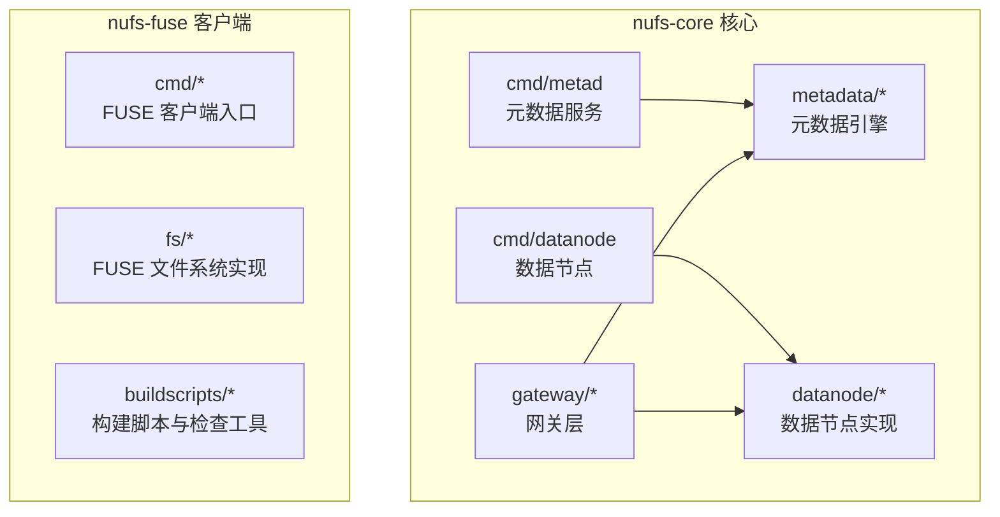
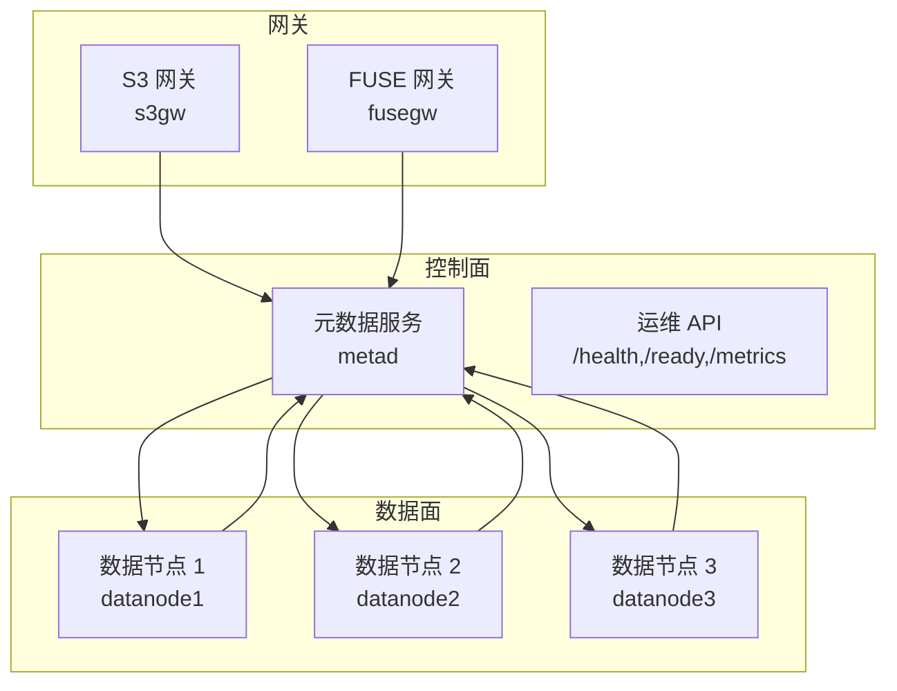
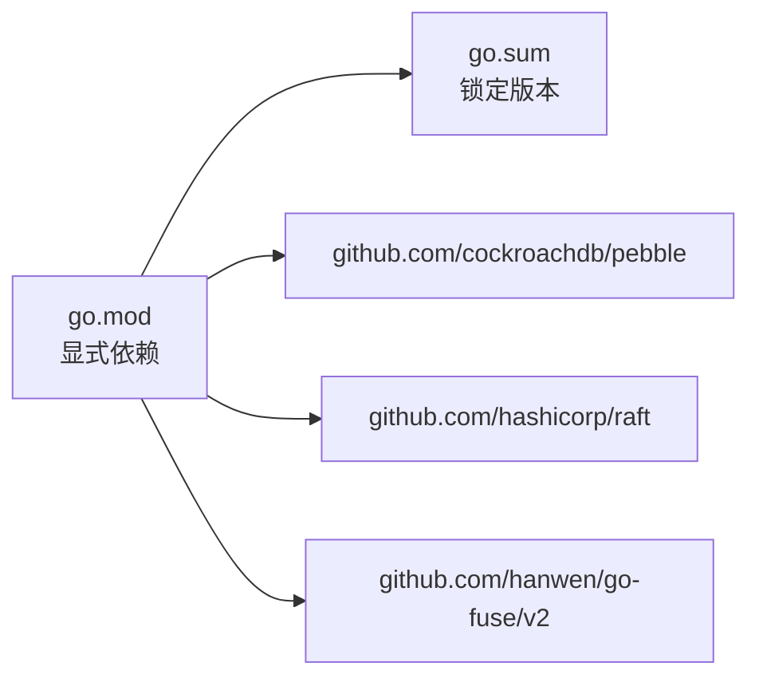

# 开发环境搭建

<cite>
**本文引用的文件**
- [nufs-core/go.mod](file://nufs-core/go.mod)
- [nufs-core/go.sum](file://nufs-core/go.sum)
- [nufs-core/Makefile](file://nufs-core/Makefile)
- [nufs-core/Dockerfile](file://nufs-core/Dockerfile)
- [nufs-core/docker-compose.yml](file://nufs-core/docker-compose.yml)
- [nufs-core/cmd/metad/main.go](file://nufs-core/cmd/metad/main.go)
- [nufs-core/cmd/datanode/main.go](file://nufs-core/cmd/datanode/main.go)
- [nufs-fuse/Makefile](file://nufs-fuse/Makefile)
- [nufs-fuse/README.md](file://nufs-fuse/README.md)
- [nufs-fuse/buildscripts/checkdeps.sh](file://nufs-fuse/buildscripts/checkdeps.sh)
- [nufs-fuse/buildscripts/cross-compile.sh](file://nufs-fuse/buildscripts/cross-compile.sh)
- [nufs-fuse/buildscripts/build.env](file://nufs-fuse/buildscripts/build.env)
</cite>

## 目录
1. [简介](#简介)
2. [项目结构](#项目结构)
3. [核心组件](#核心组件)
4. [架构总览](#架构总览)
5. [详细组件分析](#详细组件分析)
6. [依赖关系分析](#依赖关系分析)
7. [性能考虑](#性能考虑)
8. [故障排除指南](#故障排除指南)
9. [结论](#结论)
10. [附录](#附录)

## 简介
本指南面向NUFS分布式文件系统的开发者，提供从零开始搭建开发环境的完整步骤，涵盖：
- Go 1.23.3 环境安装与配置
- GOPATH、模块与环境变量设置
- IDE 推荐配置
- 项目依赖获取与管理（go.mod/go.sum）
- 克隆、编译与运行
- Makefile 构建目标与常用命令
- Docker 环境搭建与容器化开发流程
- 常见问题与故障排除

## 项目结构
NUFS 由两个主要子项目组成：
- nufs-core：分布式存储核心服务（元数据、数据节点、网关等）
- nufs-fuse：FUSE 文件系统客户端（用于挂载对象存储）

图表来源
- [nufs-core/cmd/metad/main.go:1-220](file://nufs-core/cmd/metad/main.go#L1-L220)
- [nufs-core/cmd/datanode/main.go:1-134](file://nufs-core/cmd/datanode/main.go#L1-L134)
- [nufs-fuse/README.md:1-61](file://nufs-fuse/README.md#L1-L61)

章节来源
- [nufs-core/go.mod:1-51](file://nufs-core/go.mod#L1-L51)
- [nufs-fuse/README.md:1-61](file://nufs-fuse/README.md#L1-L61)

## 核心组件
- 元数据服务（metad）：基于 Pebble 存储与可选 Raft 共识，提供操作与健康检查 API。
- 数据节点（datanode）：负责本地磁盘块存储、心跳上报、复制与反熵。
- 网关层：S3 网关与 FUSE 网关，对外暴露统一接口。
- FUSE 客户端：将对象存储作为本地文件系统挂载。

章节来源
- [nufs-core/cmd/metad/main.go:21-149](file://nufs-core/cmd/metad/main.go#L21-L149)
- [nufs-core/cmd/datanode/main.go:19-133](file://nufs-core/cmd/datanode/main.go#L19-L133)

## 架构总览
NUFS 采用多服务协作的分布式架构：元数据服务集中管理集群状态，数据节点负责块存储与复制，网关层提供外部访问入口，FUSE 客户端支持本地挂载。

图表来源
- [nufs-core/docker-compose.yml:5-133](file://nufs-core/docker-compose.yml#L5-L133)

## 详细组件分析

### Go 环境与依赖管理
- 版本要求：Go 1.23.3
- 模块模式：使用 go.mod 管理依赖，go.sum 锁定版本
- 依赖下载：通过 go mod download 或在 Docker 构建中自动拉取
- 依赖更新：执行 go mod tidy 同步依赖清单

章节来源
- [nufs-core/go.mod:1-51](file://nufs-core/go.mod#L1-L51)
- [nufs-core/go.sum:1-282](file://nufs-core/go.sum#L1-L282)
- [nufs-core/Makefile:74-76](file://nufs-core/Makefile#L74-L76)

### Makefile 构建目标与常用命令
- build：构建所有二进制（metad、datanode、s3gw、fusegw、ctl）
- build-linux：交叉编译 Linux/amd64 二进制
- test/test-verbose/test-cover：测试与覆盖率报告
- vet/fmt/lint：静态检查、格式化、代码质量
- docker/docker-up/docker-down/docker-logs：Docker 镜像构建与集群启停
- clean：清理构建产物与缓存
- tidy：同步 go.mod 依赖

章节来源
- [nufs-core/Makefile:1-76](file://nufs-core/Makefile#L1-L76)

### Docker 环境与容器化
- 多阶段构建：builder 阶段下载依赖并编译，最终镜像使用 distroless 或 slim 基础镜像
- 服务定义：docker-compose 中定义 metad、datanode1/2/3、s3gw，并配置端口映射、卷与健康检查
- 运行方式：make docker 构建镜像；make docker-up 启动集群；make docker-down 停止

章节来源
- [nufs-core/Dockerfile:1-50](file://nufs-core/Dockerfile#L1-L50)
- [nufs-core/docker-compose.yml:1-148](file://nufs-core/docker-compose.yml#L1-L148)

### FUSE 客户端构建与依赖检查
- 依赖检查：checkdeps.sh 校验操作系统、架构与 Go 版本
- 跨平台编译：cross-compile.sh 测试 Linux/FreeBSD 等多平台构建
- 构建脚本：buildscripts/build.env 提供版本比较工具

章节来源
- [nufs-fuse/buildscripts/checkdeps.sh:1-119](file://nufs-fuse/buildscripts/checkdeps.sh#L1-L119)
- [nufs-fuse/buildscripts/cross-compile.sh:1-37](file://nufs-fuse/buildscripts/cross-compile.sh#L1-L37)
- [nufs-fuse/buildscripts/build.env:1-26](file://nufs-fuse/buildscripts/build.env#L1-L26)
- [nufs-fuse/Makefile:1-58](file://nufs-fuse/Makefile#L1-L58)

## 依赖关系分析
- nufs-core 使用 CockroachDB Pebble、HashiCorp Raft、hanwen/go-fuse/v2 等库
- 依赖通过 require 显式声明，indirect 表示间接依赖
- go.mod 与 go.sum 协同确保可复现构建

图表来源
- [nufs-core/go.mod:5-10](file://nufs-core/go.mod#L5-L10)
- [nufs-core/go.sum:31-31](file://nufs-core/go.sum#L31-L31)

章节来源
- [nufs-core/go.mod:1-51](file://nufs-core/go.mod#L1-L51)
- [nufs-core/go.sum:1-282](file://nufs-core/go.sum#L1-L282)

## 性能考虑
- 构建优化：使用 -trimpath 与 -s -w 去除符号表与路径信息，减小二进制体积
- 并发限制：datanode 中对读写并发数进行上限控制
- GC 与 Scrub：元数据服务提供 GC 与 Scrub 间隔配置，平衡空间回收与性能
- 磁盘 I/O：datanode 的磁盘管理器负责容量与目录管理，避免过载

章节来源
- [nufs-core/Makefile:7-8](file://nufs-core/Makefile#L7-L8)
- [nufs-core/cmd/datanode/main.go:33-46](file://nufs-core/cmd/datanode/main.go#L33-L46)
- [nufs-core/cmd/metad/main.go:23-36](file://nufs-core/cmd/metad/main.go#L23-L36)

## 故障排除指南
- Go 版本不匹配
  - 现象：构建失败或提示版本过低
  - 处理：安装 Go 1.23.3，确认 go version 输出
  - 参考：FUSE 构建脚本对 Go 最低版本的校验逻辑
- GOPATH 与模块模式冲突
  - 现象：在 GOPATH 下无法正确解析模块
  - 处理：启用 GO111MODULE=on 或迁移到模块工作区
- 依赖下载缓慢或失败
  - 处理：使用 go mod download 或在 Docker 构建中重试
- FUSE 挂载失败
  - 现象：权限不足或内核不支持
  - 处理：以 root 权限运行，确认内核已加载 FUSE 支持
- Docker 端口冲突
  - 现象：启动时端口被占用
  - 处理：修改 docker-compose.yml 中的 hostPort 映射或释放端口
- 健康检查失败
  - 现象：容器反复重启
  - 处理：检查 metad 的 /health 与 /ready 接口返回值，确认依赖服务可用

章节来源
- [nufs-fuse/buildscripts/checkdeps.sh:82-93](file://nufs-fuse/buildscripts/checkdeps.sh#L82-L93)
- [nufs-core/docker-compose.yml:28-33](file://nufs-core/docker-compose.yml#L28-L33)

## 结论
通过本指南，您可以在本地快速搭建 NUFS 的开发与调试环境，掌握依赖管理、构建与容器化流程，并具备排查常见问题的能力。建议优先使用 Docker 组合启动集群，再结合本地二进制进行功能验证与性能调优。

## 附录

### 开发环境搭建步骤
- 安装 Go 1.23.3
  - 设置 GOPATH 与 GO111MODULE
  - 在 IDE 中启用模块支持
- 获取源码
  - 克隆仓库后进入 nufs-core 与 nufs-fuse 目录
- 获取依赖
  - 执行 go mod download 或在 Docker 构建中自动拉取
- 编译与运行
  - 使用 make build 构建二进制
  - 使用 make docker 构建镜像，make docker-up 启动集群
- FUSE 客户端
  - 使用 nufs-fuse/Makefile 的检查与构建目标

章节来源
- [nufs-core/Makefile:17-23](file://nufs-core/Makefile#L17-L23)
- [nufs-core/Makefile:54-65](file://nufs-core/Makefile#L54-L65)
- [nufs-fuse/Makefile:9-18](file://nufs-fuse/Makefile#L9-L18)