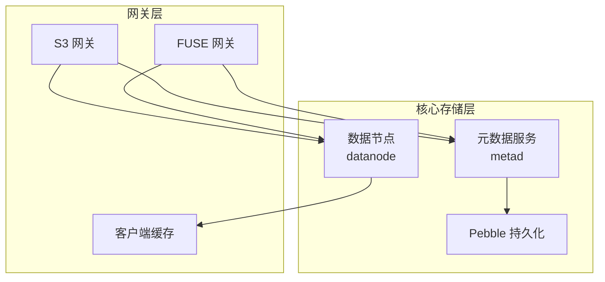
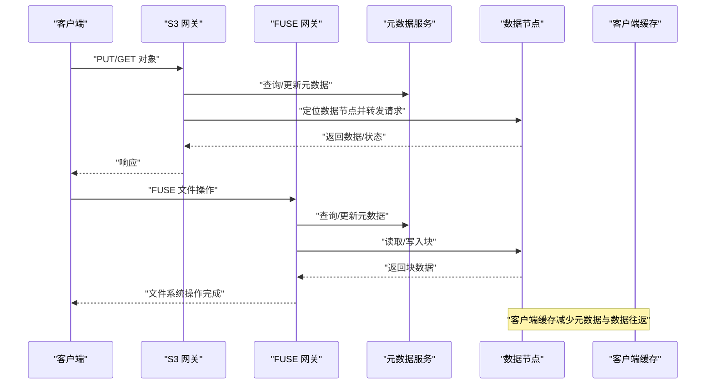
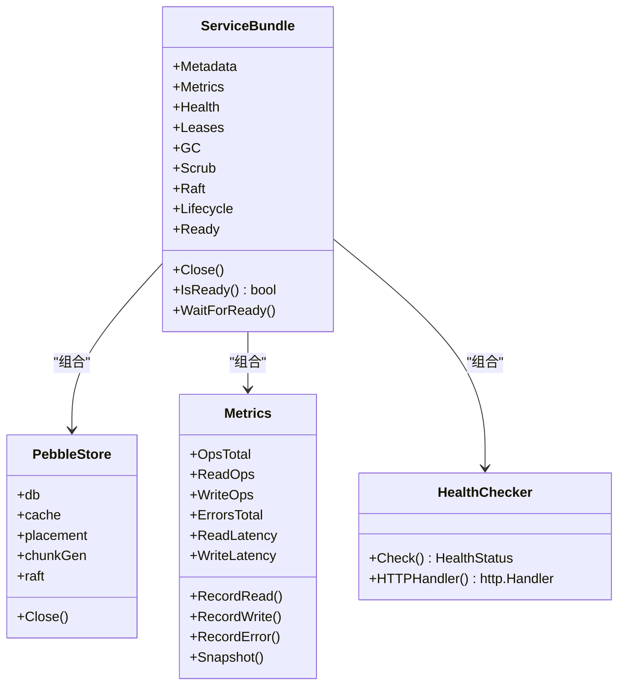
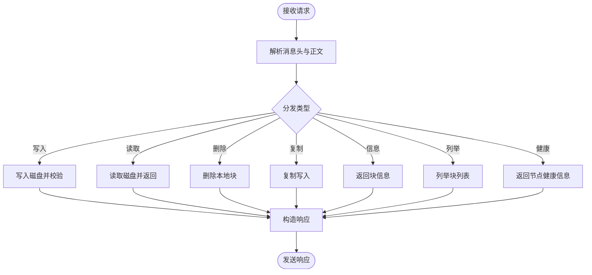
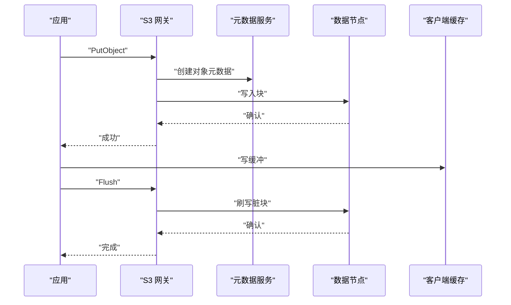
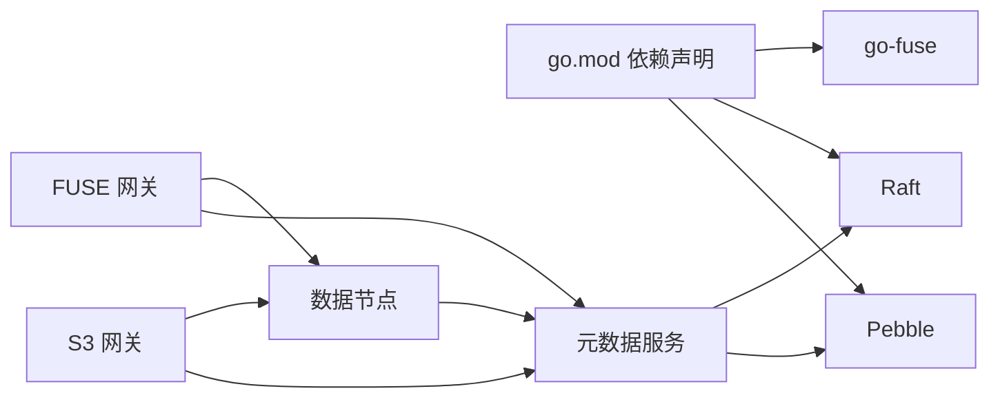

# 性能分析

<cite>
**本文引用的文件**
- [nufs-core/go.mod](file://nufs-core/go.mod)
- [nufs-core/cmd/metad/main.go](file://nufs-core/cmd/metad/main.go)
- [nufs-core/cmd/datanode/main.go](file://nufs-core/cmd/datanode/main.go)
- [nufs-core/metadata/service.go](file://nufs-core/metadata/service.go)
- [nufs-core/metadata/pebble_store.go](file://nufs-core/metadata/pebble_store.go)
- [nufs-core/metadata/health.go](file://nufs-core/metadata/health.go)
- [nufs-core/metadata/placement.go](file://nufs-core/metadata/placement.go)
- [nufs-core/metadata/smallfile.go](file://nufs-core/metadata/smallfile.go)
- [nufs-core/datanode/server.go](file://nufs-core/datanode/server.go)
- [nufs-core/datanode/chunkstore.go](file://nufs-core/datanode/chunkstore.go)
- [nufs-core/gateway/cache.go](file://nufs-core/gateway/cache.go)
- [nufs-core/gateway/s3/handler.go](file://nufs-core/gateway/s3/handler.go)
- [nufs-core/gateway/fuse/fs.go](file://nufs-core/gateway/fuse/fs.go)
- [nufs-fuse/fs/metrics.go](file://nufs-fuse/fs/metrics.go)
</cite>

## 目录
1. [简介](#简介)
2. [项目结构](#项目结构)
3. [核心组件](#核心组件)
4. [架构总览](#架构总览)
5. [详细组件分析](#详细组件分析)
6. [依赖关系分析](#依赖关系分析)
7. [性能考量](#性能考量)
8. [故障排查指南](#故障排查指南)
9. [结论](#结论)
10. [附录](#附录)

## 简介
本指南面向NUFS项目的性能分析与优化，聚焦以下目标：
- 使用pprof、trace等Go内置工具进行性能剖析与内存分析
- 关键性能指标监控：延迟（含P50/P99）、吞吐量、资源利用率
- 缓存策略对性能的影响与调优
- 小文件优化的性能分析与改进方案
- 元数据服务与数据节点的性能瓶颈识别与优化技术
- 压力测试设计与执行、性能基准测试实施
- 性能回归测试与持续性能监控的实施方案

## 项目结构
NUFS由“核心存储层”和“网关层”组成：
- 核心存储层：元数据服务（metad）基于Pebble持久化；数据节点（datanode）负责块存储与复制；网关层提供S3/FUSE接口。
- 网关层：S3兼容网关与FUSE网关，均通过元数据服务与数据节点交互。

图示来源
- [nufs-core/cmd/metad/main.go:21-149](file://nufs-core/cmd/metad/main.go#L21-L149)
- [nufs-core/cmd/datanode/main.go:19-133](file://nufs-core/cmd/datanode/main.go#L19-L133)
- [nufs-core/gateway/s3/handler.go:11-54](file://nufs-core/gateway/s3/handler.go#L11-L54)
- [nufs-core/gateway/fuse/fs.go:17-56](file://nufs-core/gateway/fuse/fs.go#L17-L56)
- [nufs-core/gateway/cache.go:29-101](file://nufs-core/gateway/cache.go#L29-L101)

章节来源
- [nufs-core/cmd/metad/main.go:21-149](file://nufs-core/cmd/metad/main.go#L21-L149)
- [nufs-core/cmd/datanode/main.go:19-133](file://nufs-core/cmd/datanode/main.go#L19-L133)
- [nufs-core/gateway/s3/handler.go:11-54](file://nufs-core/gateway/s3/handler.go#L11-L54)
- [nufs-core/gateway/fuse/fs.go:17-56](file://nufs-core/gateway/fuse/fs.go#L17-L56)
- [nufs-core/gateway/cache.go:29-101](file://nufs-core/gateway/cache.go#L29-L101)

## 核心组件
- 元数据服务（metad）
  - 启动参数：数据目录、缓存目录、节点ID、内存表大小、Raft开关、监听地址、租约TTL、GC/校验间隔等
  - 提供HTTP操作接口与健康检查端点
  - 集成Pebble存储与可选Raft共识
- 数据节点（datanode）
  - 监听TCP端口，处理写/读/删除/复制/列举等请求
  - 内置并发限制（读/写信号量），支持磁盘管理、心跳上报、复制与反熵
- 网关层
  - S3网关：路由S3语义到元数据与数据节点
  - FUSE网关：挂载DFS为本地文件系统
  - 客户端缓存：属性与数据缓存、写缓冲与异步刷写

章节来源
- [nufs-core/cmd/metad/main.go:21-149](file://nufs-core/cmd/metad/main.go#L21-L149)
- [nufs-core/cmd/datanode/main.go:19-133](file://nufs-core/cmd/datanode/main.go#L19-L133)
- [nufs-core/metadata/service.go:136-213](file://nufs-core/metadata/service.go#L136-L213)
- [nufs-core/metadata/pebble_store.go:49-89](file://nufs-core/metadata/pebble_store.go#L49-L89)
- [nufs-core/datanode/server.go:18-63](file://nufs-core/datanode/server.go#L18-L63)
- [nufs-core/gateway/cache.go:29-101](file://nufs-core/gateway/cache.go#L29-L101)

## 架构总览

图示来源
- [nufs-core/gateway/s3/handler.go:70-166](file://nufs-core/gateway/s3/handler.go#L70-L166)
- [nufs-core/gateway/fuse/fs.go:36-56](file://nufs-core/gateway/fuse/fs.go#L36-L56)
- [nufs-core/metadata/service.go:16-67](file://nufs-core/metadata/service.go#L16-L67)
- [nufs-core/datanode/server.go:102-126](file://nufs-core/datanode/server.go#L102-L126)
- [nufs-core/gateway/cache.go:98-101](file://nufs-core/gateway/cache.go#L98-L101)

## 详细组件分析

### 元数据服务（metad）性能分析
- 运行参数与性能配置
  - 数据目录与缓存目录：控制Pebble读缓存与I/O路径
  - 内存表大小：影响写放大与内存占用
  - Raft：启用分布式一致性时会引入日志复制开销
  - 租约TTL/GC/校验周期：影响后台任务频率与CPU占用
- 指标与可观测性
  - 操作计数（读/写/错误）、延迟直方图（P50/P99）、键总数、块数量、在线节点数、桶数量
  - Raft状态（角色、任期、日志索引、快照数）
  - 健康检查端点：/health、/ready、/metrics
- 性能优化建议
  - 调整内存表大小与最大打开文件数以匹配工作负载
  - 合理设置租约TTL与GC周期，避免频繁扫描
  - 在Raft模式下关注日志复制延迟与快照触发频率

图示来源
- [nufs-core/metadata/service.go:76-135](file://nufs-core/metadata/service.go#L76-L135)
- [nufs-core/metadata/pebble_store.go:19-31](file://nufs-core/metadata/pebble_store.go#L19-L31)
- [nufs-core/metadata/health.go:16-51](file://nufs-core/metadata/health.go#L16-L51)
- [nufs-core/metadata/health.go:200-216](file://nufs-core/metadata/health.go#L200-L216)

章节来源
- [nufs-core/cmd/metad/main.go:21-149](file://nufs-core/cmd/metad/main.go#L21-L149)
- [nufs-core/metadata/service.go:136-213](file://nufs-core/metadata/service.go#L136-L213)
- [nufs-core/metadata/health.go:16-94](file://nufs-core/metadata/health.go#L16-L94)
- [nufs-core/metadata/health.go:292-327](file://nufs-core/metadata/health.go#L292-L327)

### 数据节点（datanode）性能分析
- 请求处理与并发控制
  - TCP监听与连接接受循环
  - 请求分发：写/读/删除/复制/信息/列举/健康
  - 并发限制：读/写信号量，避免资源争用
- 存储引擎（ChunkStore）
  - 分片目录组织，头文件格式（魔数、ChunkID、长度、CRC）
  - 写入：落盘+同步+元数据侧车
  - 读取：偏移/长度解析、访问统计更新
  - 封印：计算全量CRC并回填头部
- 性能优化建议
  - 调整读/写并发上限以适配磁盘能力
  - 合理设置分片数量与目录层级，降低目录项过多导致的查找成本
  - 写入路径采用顺序写，减少随机写放大

图示来源
- [nufs-core/datanode/server.go:102-126](file://nufs-core/datanode/server.go#L102-L126)
- [nufs-core/datanode/server.go:130-271](file://nufs-core/datanode/server.go#L130-L271)
- [nufs-core/datanode/chunkstore.go:73-127](file://nufs-core/datanode/chunkstore.go#L73-L127)
- [nufs-core/datanode/chunkstore.go:169-227](file://nufs-core/datanode/chunkstore.go#L169-L227)
- [nufs-core/datanode/chunkstore.go:229-275](file://nufs-core/datanode/chunkstore.go#L229-L275)

章节来源
- [nufs-core/cmd/datanode/main.go:19-133](file://nufs-core/cmd/datanode/main.go#L19-L133)
- [nufs-core/datanode/server.go:18-63](file://nufs-core/datanode/server.go#L18-L63)
- [nufs-core/datanode/chunkstore.go:18-61](file://nufs-core/datanode/chunkstore.go#L18-L61)

### 网关层性能分析
- S3网关
  - 路由S3语义到元数据与数据节点，支持多部分上传/下载、拷贝等
  - 中间件链：恢复、请求ID、CORS、日志
- FUSE网关
  - 将DFS映射为本地文件系统，具备inode缓存
- 客户端缓存
  - 属性缓存（TTL）、数据缓存（TTL延长）、写缓冲（异步刷写）
  - 刷新回调：将脏块写回后端

图示来源
- [nufs-core/gateway/s3/handler.go:70-166](file://nufs-core/gateway/s3/handler.go#L70-L166)
- [nufs-core/gateway/cache.go:98-101](file://nufs-core/gateway/cache.go#L98-L101)
- [nufs-core/gateway/cache.go:225-260](file://nufs-core/gateway/cache.go#L225-L260)

章节来源
- [nufs-core/gateway/s3/handler.go:11-54](file://nufs-core/gateway/s3/handler.go#L11-L54)
- [nufs-core/gateway/fuse/fs.go:17-56](file://nufs-core/gateway/fuse/fs.go#L17-L56)
- [nufs-core/gateway/cache.go:29-101](file://nufs-core/gateway/cache.go#L29-L101)

### 小文件优化
- 小文件阈值与块大小
  - 小于等于64KB的小文件按1MB块聚合存储
  - 每块最多容纳256个小文件
- 块内索引
  - 记录文件名、在块内偏移、长度、CRC
  - 达到一定数量（如≥50）时创建新块
- 性能收益
  - 减少大量小文件带来的元数据与目录项开销
  - 降低FS元数据压力与目录扫描成本
- 调优建议
  - 根据业务中小文件占比动态调整阈值与块大小
  - 控制块内文件数量上限，避免单块过大影响定位效率

章节来源
- [nufs-core/metadata/smallfile.go:9-89](file://nufs-core/metadata/smallfile.go#L9-L89)

## 依赖关系分析
- 外部依赖
  - Pebble：LSM树存储引擎，用于元数据持久化
  - Raft：分布式一致性（可选）
  - go-fuse：FUSE网关
- 组件耦合
  - 元数据服务与Pebble强耦合，Raft可选集成
  - 数据节点与元数据服务通过HTTP/gRPC交互（代码中体现为直接连接示例）
  - 网关层通过元数据服务与数据节点解耦

图示来源
- [nufs-core/go.mod:5-49](file://nufs-core/go.mod#L5-L49)
- [nufs-core/metadata/pebble_store.go:55-71](file://nufs-core/metadata/pebble_store.go#L55-L71)
- [nufs-core/cmd/metad/main.go:57-89](file://nufs-core/cmd/metad/main.go#L57-L89)
- [nufs-core/cmd/datanode/main.go:66-76](file://nufs-core/cmd/datanode/main.go#L66-L76)
- [nufs-core/gateway/s3/handler.go:13-18](file://nufs-core/gateway/s3/handler.go#L13-L18)
- [nufs-core/gateway/fuse/fs.go:12-14](file://nufs-core/gateway/fuse/fs.go#L12-L14)

章节来源
- [nufs-core/go.mod:5-49](file://nufs-core/go.mod#L5-L49)
- [nufs-core/metadata/pebble_store.go:55-71](file://nufs-core/metadata/pebble_store.go#L55-L71)
- [nufs-core/cmd/metad/main.go:57-89](file://nufs-core/cmd/metad/main.go#L57-L89)
- [nufs-core/cmd/datanode/main.go:66-76](file://nufs-core/cmd/datanode/main.go#L66-L76)

## 性能考量
- 延迟与吞吐量
  - 元数据服务：记录读/写延迟直方图（P50/P99），结合操作计数评估吞吐
  - 数据节点：请求分发与磁盘I/O是关键瓶颈，需控制并发与优化顺序写
  - 网关层：S3/FUSE路径差异明显，S3多部分上传/下载涉及多次往返
- 资源利用率
  - CPU：Raft日志复制、编码/解码（如启用纠删码）、元数据扫描
  - 内存：Pebble内存表、客户端缓存、写缓冲
  - 磁盘：顺序写优于随机写，合理分片与目录层级
- 缓存策略
  - 客户端缓存：属性与数据缓存、写缓冲异步刷写，显著降低后端压力
  - 元数据缓存：FUSE inode映射缓存，减少重复查找
- 小文件优化
  - 聚合存储降低元数据与目录项开销
  - 块内索引提升定位效率

[本节为通用指导，无需列出具体文件来源]

## 故障排查指南
- 健康检查
  - /health：综合状态（健康/降级/不健康）
  - /ready：就绪状态
  - /metrics：JSON指标快照
- 常见问题
  - 元数据服务不可用：检查Pebble可读性、根inode存在性、Raft状态
  - 错误率过高：结合错误计数与操作总数判断
  - Raft异常：关注状态、最后联系时间、快照次数

章节来源
- [nufs-core/metadata/health.go:292-327](file://nufs-core/metadata/health.go#L292-L327)

## 结论
NUFS通过清晰的分层架构实现了元数据与数据分离，并提供了S3/FUSE双栈网关。性能优化应围绕以下主线展开：元数据服务的Pebble参数与Raft配置、数据节点的并发与磁盘写策略、网关层的缓存与写缓冲、以及小文件聚合存储。配合完善的指标体系与健康检查，可有效识别瓶颈并持续优化。

[本节为总结性内容，无需列出具体文件来源]

## 附录

### 使用pprof与trace进行性能分析
- pprof
  - 在服务启动时启用pprof HTTP端点（例如在主函数中注册pprof处理器）
  - 使用go tool pprof抓取CPU/内存/profile数据，定位热点函数与内存分配
- trace
  - 使用go test -run=^$ -bench=. -benchtime=10s -benchmem -trace=trace.out生成trace文件
  - 使用go tool trace trace.out查看调度器与锁竞争情况
- 实施要点
  - 在生产环境谨慎开启高采样率profile，避免对性能造成额外影响
  - 将pprof端点置于受控网络或仅本地访问

[本节为通用指导，无需列出具体文件来源]

### 关键性能指标监控清单
- 元数据服务
  - 指标：操作总数、读/写P50/P99延迟、错误总数、键总数、块总数、在线节点数、桶总数、Raft状态/任期/日志索引/快照数
  - 来源：元数据服务指标与健康检查快照
- 数据节点
  - 指标：写/读延迟、吞吐量、并发读/写、磁盘I/O、封印耗时
  - 来源：服务端请求处理与ChunkStore统计
- 网关层
  - 指标：S3/FUSE操作计数、延迟直方图、活跃句柄数、重试/错误数
  - 来源：MinFS指标模块

章节来源
- [nufs-core/metadata/health.go:16-94](file://nufs-core/metadata/health.go#L16-L94)
- [nufs-fuse/fs/metrics.go:86-201](file://nufs-fuse/fs/metrics.go#L86-L201)
- [nufs-core/datanode/server.go:256-271](file://nufs-core/datanode/server.go#L256-L271)
- [nufs-core/datanode/chunkstore.go:318-321](file://nufs-core/datanode/chunkstore.go#L318-L321)

### 缓存策略的性能影响与调优
- 客户端缓存
  - 属性缓存：短TTL，适合频繁元数据访问
  - 数据缓存：长TTL，适合重复读取
  - 写缓冲：大缓冲区+定时刷新，降低后端写放大
- 调优建议
  - 根据工作负载调整MaxSize、AttrTTL、WriteBufferSize、FlushInterval
  - 监控缓存命中率与写缓冲积压，动态调整

章节来源
- [nufs-core/gateway/cache.go:17-27](file://nufs-core/gateway/cache.go#L17-L27)
- [nufs-core/gateway/cache.go:71-96](file://nufs-core/gateway/cache.go#L71-L96)
- [nufs-core/gateway/cache.go:225-260](file://nufs-core/gateway/cache.go#L225-L260)

### 小文件优化的性能分析与改进方案
- 现状
  - 小于等于64KB的文件按1MB块聚合，每块最多256个文件
  - 块内索引记录文件名、偏移、长度、CRC
- 改进方案
  - 动态阈值与块大小：根据业务分布自适应
  - 块内排序与二分查找：加速定位
  - 批量封印与压缩：减少元数据与I/O

章节来源
- [nufs-core/metadata/smallfile.go:9-89](file://nufs-core/metadata/smallfile.go#L9-L89)

### 元数据服务与数据节点的性能瓶颈识别与优化
- 元数据服务
  - 瓶颈：Pebble写放大、Raft日志复制、扫描/迭代
  - 优化：增大内存表、提高MaxOpenFiles、合理设置租约与GC周期
- 数据节点
  - 瓶颈：磁盘随机写、网络复制延迟
  - 优化：顺序写、限流并发、批量复制、反熵策略

章节来源
- [nufs-core/metadata/pebble_store.go:55-71](file://nufs-core/metadata/pebble_store.go#L55-L71)
- [nufs-core/metadata/placement.go:66-137](file://nufs-core/metadata/placement.go#L66-L137)
- [nufs-core/datanode/chunkstore.go:73-127](file://nufs-core/datanode/chunkstore.go#L73-L127)

### 压力测试设计与执行方法
- 设计原则
  - 覆盖典型场景：小文件写入、大文件顺序写、随机读、多部分上传/下载
  - 并发与持久性：并发用户数、持续时间、失败重试策略
- 执行步骤
  - 使用S3 SDK或FUSE进行自动化脚本
  - 采集延迟直方图、吞吐量、错误率、资源使用
  - 对比不同配置（缓存、并发、Pebble参数）

[本节为通用指导，无需列出具体文件来源]

### 性能基准测试实施
- 基准范围
  - 元数据：创建/删除桶、目录、文件、读目录、查找、重命名
  - 数据：写/读/删除块、复制、封印
  - 网关：S3 Put/Get/List、FUSE Open/Read/Write
- 工具与方法
  - 使用go test -bench=. -benchtime=10s -benchmem
  - 采集P50/P95/P99延迟与吞吐量
  - 对比不同版本或配置的基准结果

[本节为通用指导，无需列出具体文件来源]

### 性能回归测试与持续性能监控
- 回归测试
  - 将关键基准纳入CI流水线，设定阈值告警
  - 异常波动自动报警并阻断发布
- 持续监控
  - 指标面板：延迟直方图、吞吐量、错误率、资源利用率
  - 健康检查：/health、/ready、/metrics
  - 日志与trace：定期抽样分析

章节来源
- [nufs-core/metadata/health.go:292-327](file://nufs-core/metadata/health.go#L292-L327)
- [nufs-fuse/fs/metrics.go:317-340](file://nufs-fuse/fs/metrics.go#L317-L340)