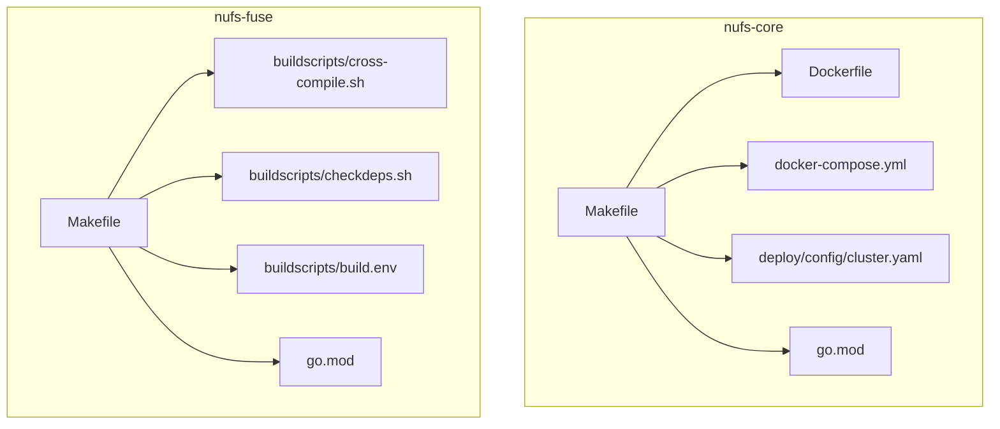
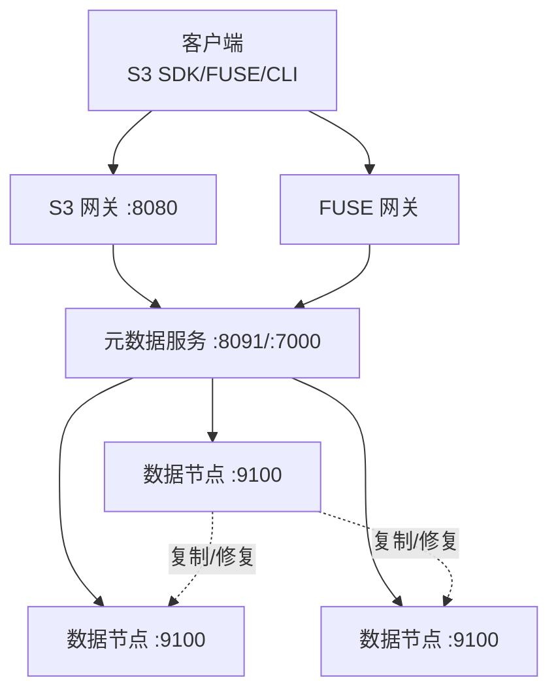
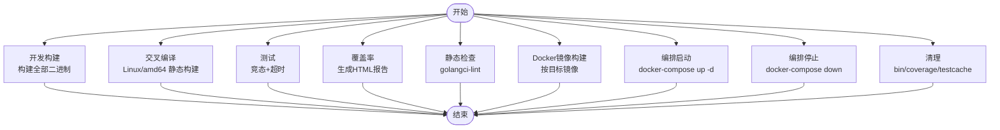
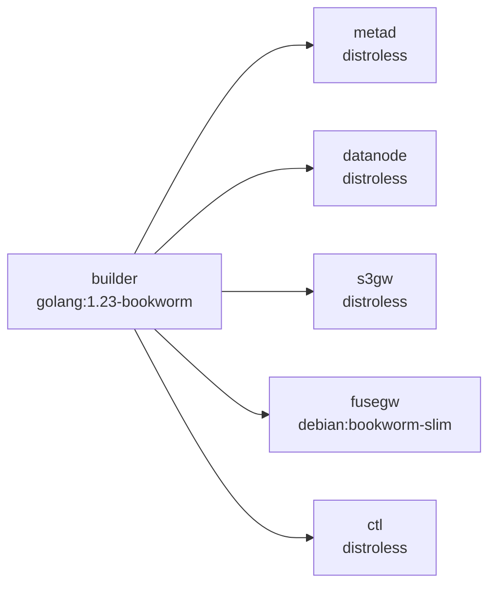
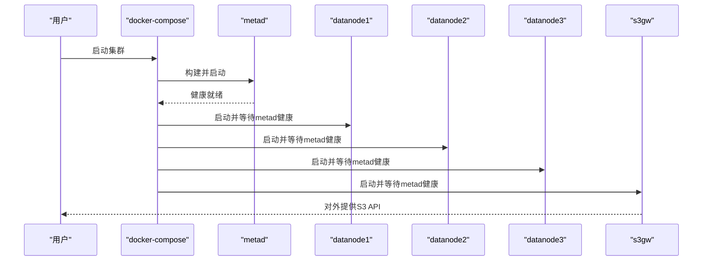
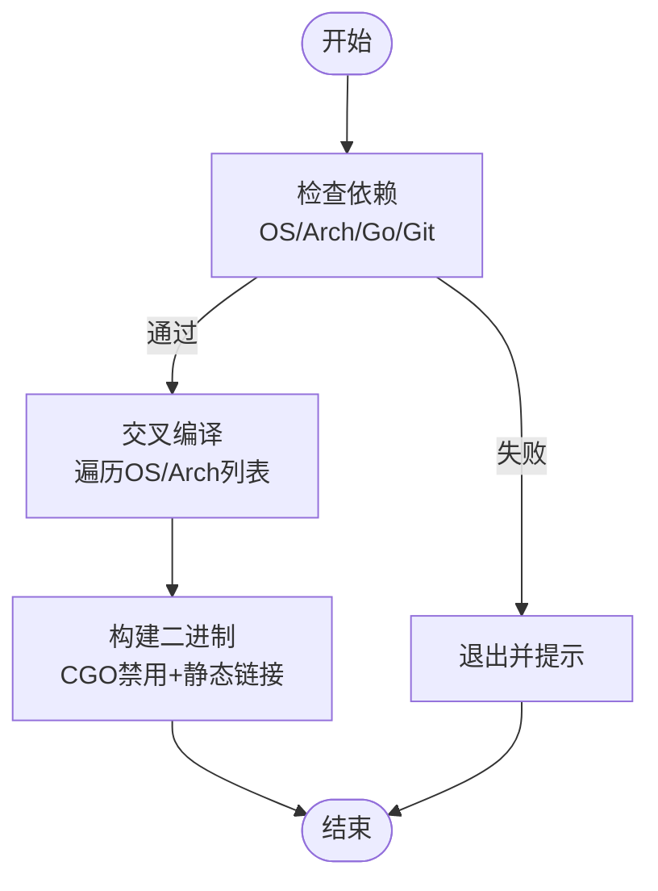
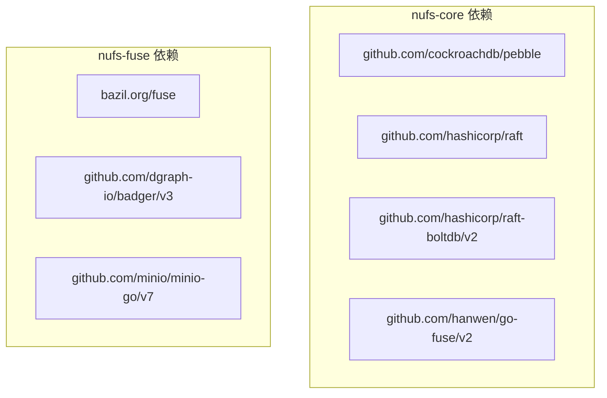

# 构建与部署

<cite>
**本文引用的文件**
- [nufs-core/Makefile](file://nufs-core/Makefile)
- [nufs-core/Dockerfile](file://nufs-core/Dockerfile)
- [nufs-core/docker-compose.yml](file://nufs-core/docker-compose.yml)
- [nufs-core/deploy/config/cluster.yaml](file://nufs-core/deploy/config/cluster.yaml)
- [nufs-core/go.mod](file://nufs-core/go.mod)
- [nufs-fuse/Makefile](file://nufs-fuse/Makefile)
- [nufs-fuse/buildscripts/cross-compile.sh](file://nufs-fuse/buildscripts/cross-compile.sh)
- [nufs-fuse/buildscripts/checkdeps.sh](file://nufs-fuse/buildscripts/checkdeps.sh)
- [nufs-fuse/buildscripts/build.env](file://nufs-fuse/buildscripts/build.env)
- [nufs-fuse/go.mod](file://nufs-fuse/go.mod)
- [nufs-core/ARCHITECTURE.md](file://nufs-core/ARCHITECTURE.md)
</cite>

## 目录
1. [简介](#简介)
2. [项目结构](#项目结构)
3. [核心组件](#核心组件)
4. [架构总览](#架构总览)
5. [详细组件分析](#详细组件分析)
6. [依赖关系分析](#依赖关系分析)
7. [性能考虑](#性能考虑)
8. [故障排查指南](#故障排查指南)
9. [结论](#结论)
10. [附录](#附录)

## 简介
本指南面向NUFS项目的构建与部署，覆盖以下主题：
- Makefile构建目标：开发构建、生产构建、交叉编译
- Docker容器化：镜像构建与Compose编排
- Kubernetes部署：集群配置、服务部署与服务发现
- 环境差异与配置管理：开发/测试/生产
- CI/CD流水线与自动化部署
- 部署后验证与监控

## 项目结构
NUFS由两个主要模块组成：
- nufs-core：分布式文件系统核心，包含元数据、数据节点、网关等服务，提供构建、打包与编排能力
- nufs-fuse：FUSE客户端工具链，提供构建脚本与交叉编译校验

图表来源
- [nufs-core/Makefile:1-76](file://nufs-core/Makefile#L1-L76)
- [nufs-core/Dockerfile:1-50](file://nufs-core/Dockerfile#L1-L50)
- [nufs-core/docker-compose.yml:1-148](file://nufs-core/docker-compose.yml#L1-L148)
- [nufs-core/deploy/config/cluster.yaml:1-62](file://nufs-core/deploy/config/cluster.yaml#L1-L62)
- [nufs-core/go.mod:1-51](file://nufs-core/go.mod#L1-L51)
- [nufs-fuse/Makefile:1-58](file://nufs-fuse/Makefile#L1-L58)
- [nufs-fuse/buildscripts/cross-compile.sh:1-37](file://nufs-fuse/buildscripts/cross-compile.sh#L1-L37)
- [nufs-fuse/buildscripts/checkdeps.sh:1-119](file://nufs-fuse/buildscripts/checkdeps.sh#L1-L119)
- [nufs-fuse/buildscripts/build.env:1-26](file://nufs-fuse/buildscripts/build.env#L1-L26)
- [nufs-fuse/go.mod:1-14](file://nufs-fuse/go.mod#L1-L14)

章节来源
- [nufs-core/Makefile:1-76](file://nufs-core/Makefile#L1-L76)
- [nufs-core/Dockerfile:1-50](file://nufs-core/Dockerfile#L1-L50)
- [nufs-core/docker-compose.yml:1-148](file://nufs-core/docker-compose.yml#L1-L148)
- [nufs-core/deploy/config/cluster.yaml:1-62](file://nufs-core/deploy/config/cluster.yaml#L1-L62)
- [nufs-fuse/Makefile:1-58](file://nufs-fuse/Makefile#L1-L58)
- [nufs-fuse/buildscripts/cross-compile.sh:1-37](file://nufs-fuse/buildscripts/cross-compile.sh#L1-L37)
- [nufs-fuse/buildscripts/checkdeps.sh:1-119](file://nufs-fuse/buildscripts/checkdeps.sh#L1-L119)
- [nufs-fuse/buildscripts/build.env:1-26](file://nufs-fuse/buildscripts/build.env#L1-L26)
- [nufs-core/go.mod:1-51](file://nufs-core/go.mod#L1-L51)
- [nufs-fuse/go.mod:1-14](file://nufs-fuse/go.mod#L1-L14)

## 核心组件
- 服务二进制：metad、datanode、s3gw、fusegw、ctl
- 构建与测试：Go构建标志、测试与覆盖率、静态检查、格式化、清理
- 容器化：多阶段Dockerfile，按目标镜像拆分
- 编排：docker-compose定义元数据、数据节点、S3网关与持久卷
- 生产配置：cluster.yaml集中管理集群参数

章节来源
- [nufs-core/Makefile:10-22](file://nufs-core/Makefile#L10-L22)
- [nufs-core/Makefile:17-22](file://nufs-core/Makefile#L17-L22)
- [nufs-core/Makefile:25-31](file://nufs-core/Makefile#L25-L31)
- [nufs-core/Makefile:33-43](file://nufs-core/Makefile#L33-L43)
- [nufs-core/Makefile:54-59](file://nufs-core/Makefile#L54-L59)
- [nufs-core/Dockerfile:14-18](file://nufs-core/Dockerfile#L14-L18)
- [nufs-core/Dockerfile:21-49](file://nufs-core/Dockerfile#L21-L49)
- [nufs-core/docker-compose.yml:5-27](file://nufs-core/docker-compose.yml#L5-L27)
- [nufs-core/docker-compose.yml:36-112](file://nufs-core/docker-compose.yml#L36-L112)
- [nufs-core/docker-compose.yml:115-133](file://nufs-core/docker-compose.yml#L115-L133)
- [nufs-core/deploy/config/cluster.yaml:4-62](file://nufs-core/deploy/config/cluster.yaml#L4-L62)

## 架构总览
NUFS采用“网关层-元数据层-数据层”的三层架构，支持S3兼容API与FUSE挂载。容器化与编排用于快速搭建开发/测试集群；生产环境可通过cluster.yaml集中配置。

图表来源
- [nufs-core/docker-compose.yml:5-27](file://nufs-core/docker-compose.yml#L5-L27)
- [nufs-core/docker-compose.yml:36-112](file://nufs-core/docker-compose.yml#L36-L112)
- [nufs-core/docker-compose.yml:115-133](file://nufs-core/docker-compose.yml#L115-L133)
- [nufs-core/ARCHITECTURE.md:25-101](file://nufs-core/ARCHITECTURE.md#L25-L101)

## 详细组件分析

### Makefile构建目标详解
- 开发构建：一次性构建所有服务二进制，输出至bin目录
- 交叉编译：针对Linux/amd64进行CGO禁用的静态构建
- 测试：启用竞态检测与超时；支持覆盖率HTML报告
- 静态检查：集成golangci-lint
- Docker镜像：按目标镜像分别构建metad、datanode、s3gw、fusegw、ctl
- 编排：一键启动/停止集群，查看日志
- 清理：移除构建产物与测试缓存

图表来源
- [nufs-core/Makefile:13-76](file://nufs-core/Makefile#L13-L76)

章节来源
- [nufs-core/Makefile:13-76](file://nufs-core/Makefile#L13-L76)

### Dockerfile与镜像拆分
- 多阶段构建：先以golang基础镜像构建，再拷贝到精简运行时镜像
- 目标镜像：
  - metad：基于distroless，暴露元数据与Raft端口
  - datanode：基于distroless，声明数据卷与数据端口
  - s3gw：基于distroless，暴露S3端口
  - fusegw：基于debian slim，安装FUSE库，声明挂载点
  - ctl：基于distroless，作为运维CLI

图表来源
- [nufs-core/Dockerfile:1-50](file://nufs-core/Dockerfile#L1-L50)

章节来源
- [nufs-core/Dockerfile:1-50](file://nufs-core/Dockerfile#L1-L50)

### docker-compose编排
- 元数据服务：Pebble+Raft，健康检查基于HTTP探针
- 数据节点：3个副本，跨Rack部署，声明数据卷与端口映射
- S3网关：依赖元数据健康，声明元数据卷
- 网络与卷：自定义bridge网络与命名卷，便于持久化

图表来源
- [nufs-core/docker-compose.yml:5-27](file://nufs-core/docker-compose.yml#L5-L27)
- [nufs-core/docker-compose.yml:36-112](file://nufs-core/docker-compose.yml#L36-L112)
- [nufs-core/docker-compose.yml:115-133](file://nufs-core/docker-compose.yml#L115-L133)

章节来源
- [nufs-core/docker-compose.yml:1-148](file://nufs-core/docker-compose.yml#L1-L148)

### 生产配置与环境差异
- cluster.yaml集中管理集群名称、区域、元数据/数据节点/网关参数、放置策略、修复与再平衡阈值
- 环境差异建议：
  - 开发：使用docker-compose，简化端口映射与卷
  - 测试：使用Kubernetes最小化部署，启用探针与资源限制
  - 生产：使用Kubernetes高可用部署，结合外部etcd/对象存储，启用TLS与鉴权

章节来源
- [nufs-core/deploy/config/cluster.yaml:1-62](file://nufs-core/deploy/config/cluster.yaml#L1-L62)

### nufs-fuse构建与交叉编译
- 依赖检查：校验操作系统、架构、Go/Git版本
- 交叉编译：支持linux/ppc64le、linux/arm64、linux/s390x、darwin/amd64、freebsd/amd64等组合
- 构建：CGO禁用，静态链接，带标签与精简LDFLAGS

图表来源
- [nufs-fuse/buildscripts/checkdeps.sh:52-119](file://nufs-fuse/buildscripts/checkdeps.sh#L52-L119)
- [nufs-fuse/buildscripts/cross-compile.sh:14-36](file://nufs-fuse/buildscripts/cross-compile.sh#L14-L36)
- [nufs-fuse/Makefile:38-48](file://nufs-fuse/Makefile#L38-L48)

章节来源
- [nufs-fuse/Makefile:1-58](file://nufs-fuse/Makefile#L1-L58)
- [nufs-fuse/buildscripts/cross-compile.sh:1-37](file://nufs-fuse/buildscripts/cross-compile.sh#L1-L37)
- [nufs-fuse/buildscripts/checkdeps.sh:1-119](file://nufs-fuse/buildscripts/checkdeps.sh#L1-L119)
- [nufs-fuse/buildscripts/build.env:1-26](file://nufs-fuse/buildscripts/build.env#L1-L26)

### Kubernetes部署指南（概念性）
- 集群准备：确保kubectl可用，具备RBAC权限
- 命名空间与资源：创建命名空间，部署ConfigMap/Secret（如需），部署StatefulSet/Deployment与Service
- 服务发现：通过ClusterIP或LoadBalancer暴露服务，配置Headless Service用于元数据服务
- 持久化：使用PV/PVC绑定数据卷
- 可观测性：部署Prometheus/Grafana，配置探针与指标抓取
- 安全：启用ServiceAccount、RBAC、网络策略与TLS

（本节为概念性指导，不直接对应具体源文件）

## 依赖关系分析
- nufs-core依赖：
  - 元数据：Pebble、Raft、Bolt
  - 网关：S3兼容HTTP处理
  - FUSE：Linux POSIX挂载
- nufs-fuse依赖：
  - bazil.org/fuse、badger、minio-go等

图表来源
- [nufs-core/go.mod:5-50](file://nufs-core/go.mod#L5-L50)
- [nufs-fuse/go.mod:5-13](file://nufs-fuse/go.mod#L5-L13)

章节来源
- [nufs-core/go.mod:1-51](file://nufs-core/go.mod#L1-L51)
- [nufs-fuse/go.mod:1-14](file://nufs-fuse/go.mod#L1-L14)

## 性能考虑
- 构建优化：使用trimpath与strip标志减小二进制体积
- 静态构建：CGO禁用提升可移植性
- 容器镜像：多阶段构建与精简运行时减少攻击面
- 网络与存储：合理设置端口映射与卷挂载，避免I/O瓶颈
- 压力测试：在测试环境中模拟高并发读写，评估复制与修复性能

（本节提供通用建议，不直接分析具体文件）

## 故障排查指南
- 构建问题：检查Go版本、依赖下载是否成功、CGO设置
- 容器问题：查看各服务健康检查结果，确认端口占用与卷挂载
- 服务连通性：确认元数据服务地址、数据节点注册与心跳
- 日志定位：使用docker-compose logs -f跟踪异常

章节来源
- [nufs-core/Makefile:51-52](file://nufs-core/Makefile#L51-L52)
- [nufs-core/Makefile:67-68](file://nufs-core/Makefile#L67-L68)
- [nufs-core/docker-compose.yml:28-33](file://nufs-core/docker-compose.yml#L28-L33)

## 结论
本指南提供了NUFS从本地构建到容器化编排的完整路径，并给出了生产配置与Kubernetes部署的概念性方案。建议在不同环境采用差异化配置与安全加固，配合CI/CD自动化流水线实现持续交付与可观测性落地。

## 附录
- 关键命令速查
  - 开发构建：make build
  - 交叉编译：make build-linux
  - 测试与覆盖率：make test / make test-cover
  - 静态检查：make lint
  - 容器镜像：make docker
  - 编排启动/停止：make docker-up / make docker-down
- 参考架构文档：[nufs-core/ARCHITECTURE.md](file://nufs-core/ARCHITECTURE.md)