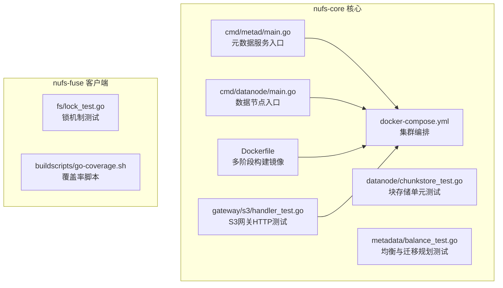
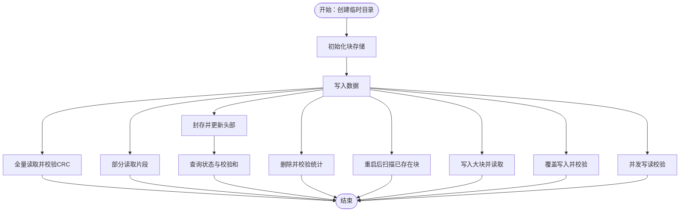
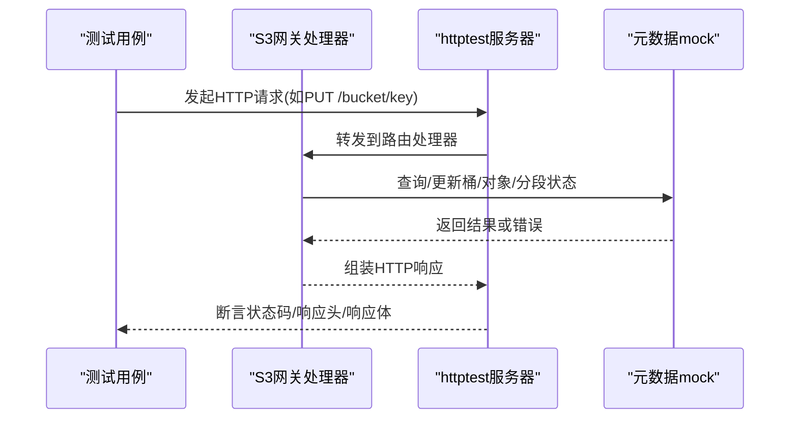
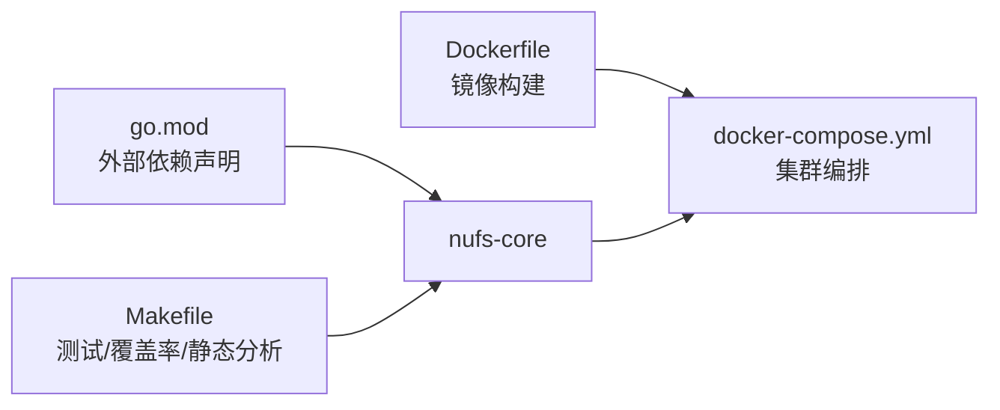

# 调试与测试

<cite>
**本文引用的文件**
- [nufs-core/go.mod](file://nufs-core/go.mod)
- [nufs-core/Makefile](file://nufs-core/Makefile)
- [nufs-core/Dockerfile](file://nufs-core/Dockerfile)
- [nufs-core/docker-compose.yml](file://nufs-core/docker-compose.yml)
- [nufs-core/cmd/metad/main.go](file://nufs-core/cmd/metad/main.go)
- [nufs-core/cmd/datanode/main.go](file://nufs-core/cmd/datanode/main.go)
- [nufs-core/datanode/chunkstore_test.go](file://nufs-core/datanode/chunkstore_test.go)
- [nufs-core/gateway/s3/handler_test.go](file://nufs-core/gateway/s3/handler_test.go)
- [nufs-core/metadata/balance_test.go](file://nufs-core/metadata/balance_test.go)
- [nufs-fuse/fs/lock_test.go](file://nufs-fuse/fs/lock_test.go)
- [nufs-fuse/buildscripts/go-coverage.sh](file://nufs-fuse/buildscripts/go-coverage.sh)
- [nufs-core/deploy/config/cluster.yaml](file://nufs-core/deploy/config/cluster.yaml)
</cite>

## 目录
1. [简介](#简介)
2. [项目结构](#项目结构)
3. [核心组件](#核心组件)
4. [架构总览](#架构总览)
5. [详细组件分析](#详细组件分析)
6. [依赖分析](#依赖分析)
7. [性能考虑](#性能考虑)
8. [故障排查指南](#故障排查指南)
9. [结论](#结论)
10. [附录](#附录)

## 简介
本指南面向NUFS项目的开发者与测试工程师，系统性地阐述单元测试、集成测试与端到端测试的编写与执行方法；介绍调试工具（Go调试器、日志分析、性能分析）的使用；明确测试覆盖率要求与持续集成流程建议；提供常见问题诊断与并发测试实践（含race detector）。文档以仓库现有测试文件与构建脚本为基础，结合服务启动入口与容器化部署配置，给出可操作的实践步骤。

## 项目结构
NUFS由两大部分组成：nufs-core（核心存储与网关）、nufs-fuse（FUSE客户端）。核心测试集中在nufs-core中，覆盖数据节点、元数据、S3网关等模块；nufs-fuse包含其自身的单元测试与覆盖率脚本。

图表来源
- [nufs-core/cmd/metad/main.go:1-220](file://nufs-core/cmd/metad/main.go#L1-L220)
- [nufs-core/cmd/datanode/main.go:1-134](file://nufs-core/cmd/datanode/main.go#L1-L134)
- [nufs-core/datanode/chunkstore_test.go:1-473](file://nufs-core/datanode/chunkstore_test.go#L1-L473)
- [nufs-core/gateway/s3/handler_test.go:1-800](file://nufs-core/gateway/s3/handler_test.go#L1-L800)
- [nufs-core/metadata/balance_test.go:1-130](file://nufs-core/metadata/balance_test.go#L1-L130)
- [nufs-core/Dockerfile:1-50](file://nufs-core/Dockerfile#L1-L50)
- [nufs-core/docker-compose.yml:1-148](file://nufs-core/docker-compose.yml#L1-L148)
- [nufs-fuse/fs/lock_test.go:1-144](file://nufs-fuse/fs/lock_test.go#L1-L144)
- [nufs-fuse/buildscripts/go-coverage.sh:1-6](file://nufs-fuse/buildscripts/go-coverage.sh#L1-L6)

章节来源
- [nufs-core/Makefile:1-76](file://nufs-core/Makefile#L1-L76)
- [nufs-core/Dockerfile:1-50](file://nufs-core/Dockerfile#L1-L50)
- [nufs-core/docker-compose.yml:1-148](file://nufs-core/docker-compose.yml#L1-L148)

## 核心组件
- 元数据服务（metad）：基于Pebble存储引擎，支持可选Raft共识，提供健康检查与运维接口。
- 数据节点（datanode）：负责本地块存储、读写、心跳上报、复制与反熵。
- S3网关：通过HTTP接口实现S3兼容语义，内部依赖元数据服务进行桶与对象管理。
- FUSE客户端：提供挂载能力与锁机制测试，确保并发访问安全。

章节来源
- [nufs-core/cmd/metad/main.go:1-220](file://nufs-core/cmd/metad/main.go#L1-L220)
- [nufs-core/cmd/datanode/main.go:1-134](file://nufs-core/cmd/datanode/main.go#L1-L134)
- [nufs-core/docker-compose.yml:1-148](file://nufs-core/docker-compose.yml#L1-L148)

## 架构总览
下图展示服务启动与测试运行的关键路径，以及容器化部署与健康检查策略。

```mermaid
graph TB
subgraph "容器编排"
DC["docker-compose.yml<br/>服务定义与健康检查"]
IMG["Dockerfile<br/>多阶段构建镜像"]
end
subgraph "元数据服务"
MMAIN["cmd/metad/main.go<br/>启动Pebble/Raft/运维API"]
HEALTH["/health 接口<br/>健康检查"]
end
subgraph "数据节点"
DMAIN["cmd/datanode/main.go<br/>启动块存储/TCP/心跳/运维API"]
end
subgraph "S3网关"
S3TEST["gateway/s3/handler_test.go<br/>HTTP测试套件"]
end
IMG --> DC
DC --> MMAIN
DC --> DMAIN
MMAIN --> HEALTH
S3TEST --> DC
```

图表来源
- [nufs-core/Dockerfile:1-50](file://nufs-core/Dockerfile#L1-L50)
- [nufs-core/docker-compose.yml:1-148](file://nufs-core/docker-compose.yml#L1-L148)
- [nufs-core/cmd/metad/main.go:107-212](file://nufs-core/cmd/metad/main.go#L107-L212)
- [nufs-core/cmd/datanode/main.go:93-122](file://nufs-core/cmd/datanode/main.go#L93-L122)
- [nufs-core/gateway/s3/handler_test.go:360-371](file://nufs-core/gateway/s3/handler_test.go#L360-L371)

## 详细组件分析

### 单元测试：块存储（ChunkStore）
- 测试范围：初始化与分片目录创建、写入/读取/部分读取、截断读取、封存校验、删除与统计、扫描已存在数据、大块处理、覆盖写入、并发访问。
- 关键点：
  - 使用临时目录隔离测试状态。
  - 通过封存计算并校验CRC，验证头部信息一致性。
  - 并发场景使用goroutine与通道收集错误，确保一致性。
- 建议用例设计：
  - 边界条件：空数据、超长数据、零长度偏移与长度。
  - 错误路径：不存在的块读取、重复删除、并发覆盖。
  - 性能回归：批量写入与随机访问模式。

图表来源
- [nufs-core/datanode/chunkstore_test.go:15-473](file://nufs-core/datanode/chunkstore_test.go#L15-L473)

章节来源
- [nufs-core/datanode/chunkstore_test.go:1-473](file://nufs-core/datanode/chunkstore_test.go#L1-L473)

### 单元测试：S3网关处理器
- 测试范围：桶生命周期（创建/删除/列举/存在性检查）、对象上传/下载/删除/存在性检查、分段上传（初始化/上传/列出/完成/中止）、CORS头设置、错误码与状态码。
- 关键点：
  - 使用httptest服务器模拟HTTP请求，配合内存化的元数据服务mock。
  - 对S3语义进行精确验证，包括ETag、Content-Length、CORS响应头等。
- 建议用例设计：
  - 多租户/多桶隔离。
  - 分段上传的并发与顺序一致性。
  - 异常路径：桶非空删除、不存在对象读取、无效上传ID。

图表来源
- [nufs-core/gateway/s3/handler_test.go:360-371](file://nufs-core/gateway/s3/handler_test.go#L360-L371)
- [nufs-core/gateway/s3/handler_test.go:520-559](file://nufs-core/gateway/s3/handler_test.go#L520-L559)
- [nufs-core/gateway/s3/handler_test.go:673-751](file://nufs-core/gateway/s3/handler_test.go#L673-L751)

章节来源
- [nufs-core/gateway/s3/handler_test.go:1-800](file://nufs-core/gateway/s3/handler_test.go#L1-L800)

### 单元测试：元数据均衡与迁移规划
- 测试范围：在线节点均衡、离线节点排除、节点退役计划生成、目标节点选择与错误处理。
- 关键点：
  - 输入不同负载分布，验证是否产生合理的迁移计划。
  - 针对异常输入（不存在节点、无可用目标）进行错误断言。
- 建议用例设计：
  - 模拟网络分区/节点下线后的再平衡。
  - 不同阈值下的迁移触发与数量控制。

章节来源
- [nufs-core/metadata/balance_test.go:1-130](file://nufs-core/metadata/balance_test.go#L1-L130)

### 单元测试：FUSE锁机制
- 测试范围：加解锁、阻塞等待、超时、多等待者顺序、不同路径互不干扰。
- 关键点：
  - 使用轻量级结构体模拟锁表，验证等待队列与释放顺序。
- 建议用例设计：
  - 与文件系统并发操作结合的端到端测试。

章节来源
- [nufs-fuse/fs/lock_test.go:1-144](file://nufs-fuse/fs/lock_test.go#L1-L144)

### 集成测试与端到端测试策略
- 集成测试（基于docker-compose）：
  - 启动元数据服务、多个数据节点、S3网关，验证跨组件交互。
  - 使用健康检查确认服务就绪后再进行HTTP请求。
- 端到端测试（基于真实环境）：
  - 通过S3网关进行桶与对象操作，结合元数据服务的运维接口验证状态。
  - 可在CI中拉起容器集群，执行S3兼容性测试套件。
- 建议流程：
  - 构建镜像 → 启动集群 → 等待健康 → 执行测试 → 收敛日志 → 停止集群。

章节来源
- [nufs-core/docker-compose.yml:1-148](file://nufs-core/docker-compose.yml#L1-L148)
- [nufs-core/Dockerfile:1-50](file://nufs-core/Dockerfile#L1-L50)

### 测试覆盖率与持续集成
- 覆盖率要求建议：
  - 单元测试：核心包（如datanode、metadata、gateway）达到中高覆盖率（例如≥80%），关键路径≥90%。
  - 集成测试：覆盖跨组件边界（S3网关→元数据服务→数据节点）。
- CI流程建议：
  - 代码提交触发：格式化检查、静态分析、单元测试（带race）、覆盖率报告。
  - PR合并前：集成测试（docker-compose）、端到端测试（可选）。
- 工具与脚本：
  - nufs-core：使用Makefile中的test、test-cover、lint、vet。
  - nufs-fuse：使用buildscripts/go-coverage.sh生成覆盖率报告。

章节来源
- [nufs-core/Makefile:33-43](file://nufs-core/Makefile#L33-L43)
- [nufs-fuse/buildscripts/go-coverage.sh:1-6](file://nufs-fuse/buildscripts/go-coverage.sh#L1-L6)

### 调试工具与方法
- Go调试器（dlv）：
  - 在本地或容器内启动服务（如metad、datanode），使用dlv attach或dlv exec连接进程，设置断点、检查变量、查看调用栈。
  - 结合日志级别与结构化输出定位问题。
- 日志分析：
  - 元数据服务提供/health与/ready接口，便于快速判断服务状态。
  - docker-compose日志聚合，关注启动顺序与健康检查失败原因。
- 性能分析（pprof）：
  - 在服务入口启用pprof HTTP端点（开发环境），采集CPU/内存/阻塞分析数据。
  - 结合压测工具（如wrk、JMeter或自研压测）定位热点。
- race检测：
  - 使用go test -race执行所有测试，确保并发安全。
  - 在CI中强制开启race检测，避免竞态引入主干。

章节来源
- [nufs-core/cmd/metad/main.go:107-212](file://nufs-core/cmd/metad/main.go#L107-L212)
- [nufs-core/Makefile:33-37](file://nufs-core/Makefile#L33-L37)

### 并发测试与竞态检测
- 使用-race标志运行测试，覆盖以下场景：
  - 并发写入/读取块存储。
  - 并发HTTP请求（S3网关）。
  - FUSE锁竞争与等待超时。
- 建议：
  - 将高并发用例作为每日CI任务的一部分。
  - 对共享资源（锁、全局计数器、缓存）增加竞态检测。

章节来源
- [nufs-core/Makefile:33-37](file://nufs-core/Makefile#L33-L37)
- [nufs-core/datanode/chunkstore_test.go:431-472](file://nufs-core/datanode/chunkstore_test.go#L431-L472)
- [nufs-fuse/fs/lock_test.go:42-74](file://nufs-fuse/fs/lock_test.go#L42-L74)

### 性能测试与压力测试
- 场景建议：
  - 小文件密集写入/读取（模拟日志/小对象）。
  - 大文件顺序/随机读写（验证吞吐与延迟）。
  - 并发上传/下载（分段上传）。
- 工具与指标：
  - 工具：自研压测脚本或开源工具。
  - 指标：QPS、P95/P99延迟、CPU/内存/磁盘I/O、网络带宽、错误率。
- 实施步骤：
  - 在docker-compose集群上执行压测 → 收集pprof与系统指标 → 分析瓶颈 → 优化后回归。

[本节为通用指导，无需特定文件引用]

## 依赖分析
- 模块依赖：
  - nufs-core/go.mod声明了Pebble、Raft、go-fuse等关键依赖，影响测试与运行时行为。
- 构建与测试耦合：
  - Makefile统一管理构建、测试、覆盖率、静态分析与Docker打包。
  - Dockerfile与docker-compose确保测试环境一致性。

图表来源
- [nufs-core/go.mod:1-51](file://nufs-core/go.mod#L1-L51)
- [nufs-core/Makefile:1-76](file://nufs-core/Makefile#L1-L76)
- [nufs-core/Dockerfile:1-50](file://nufs-core/Dockerfile#L1-L50)
- [nufs-core/docker-compose.yml:1-148](file://nufs-core/docker-compose.yml#L1-L148)

章节来源
- [nufs-core/go.mod:1-51](file://nufs-core/go.mod#L1-L51)
- [nufs-core/Makefile:1-76](file://nufs-core/Makefile#L1-L76)

## 性能考虑
- I/O模型：块存储采用分片目录与封存校验，注意磁盘寻道与顺序写入优化。
- 并发控制：限制最大并发读写，避免资源争用导致抖动。
- 网络与序列化：S3网关应减少不必要的拷贝与字符串拼接，使用流式处理大对象。
- GC与内存：合理设置Pebble内存参数，避免频繁GC停顿。

[本节为通用指导，无需特定文件引用]

## 故障排查指南
- 常见问题与定位：
  - 服务未就绪：检查/health与/ready接口返回，确认Raft选举与元数据初始化完成。
  - 连接失败：核对元数据地址、端口映射与容器网络。
  - 并发错误：启用-race检测，复现并修复数据竞争。
  - 覆盖率不足：补充关键分支与异常路径测试。
- 定位步骤：
  - 查看容器日志与健康检查失败时间点。
  - 使用pprof采集CPU/阻塞快照，定位热点函数。
  - 在测试中加入更细粒度的断言与日志标记。

章节来源
- [nufs-core/cmd/metad/main.go:107-212](file://nufs-core/cmd/metad/main.go#L107-L212)
- [nufs-core/docker-compose.yml:28-33](file://nufs-core/docker-compose.yml#L28-L33)
- [nufs-core/Makefile:33-43](file://nufs-core/Makefile#L33-L43)

## 结论
通过统一的Makefile与Docker编排，NUFS具备良好的测试与集成基础。建议在CI中强制执行-race与覆盖率检查，并以docker-compose为集成测试基座，逐步完善端到端测试与性能回归。针对并发与I/O热点，结合pprof与日志进行持续优化。

[本节为总结性内容，无需特定文件引用]

## 附录
- 配置参考：生产部署配置示例位于cluster.yaml，可用于端到端测试的参数校准。
- 快速命令：
  - 单元测试：make test 或 make test-verbose
  - 覆盖率：make test-cover
  - 静态分析：make vet 与 make lint
  - 启动集群：make docker-up；查看日志：make docker-logs；停止：make docker-down

章节来源
- [nufs-core/Makefile:33-72](file://nufs-core/Makefile#L33-L72)
- [nufs-core/deploy/config/cluster.yaml:1-62](file://nufs-core/deploy/config/cluster.yaml#L1-L62)