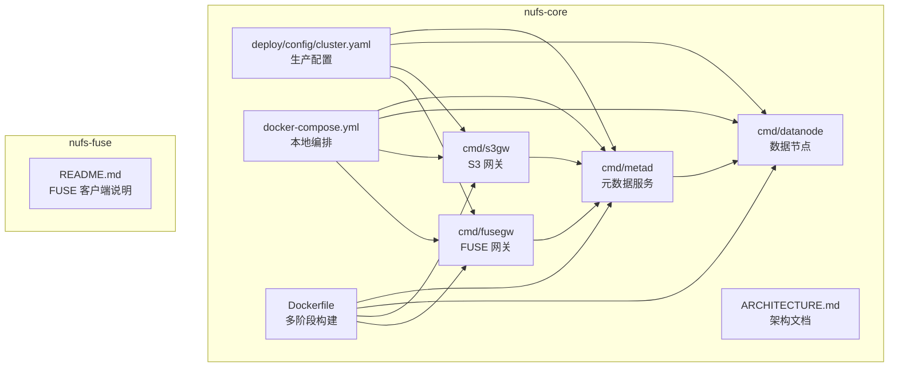
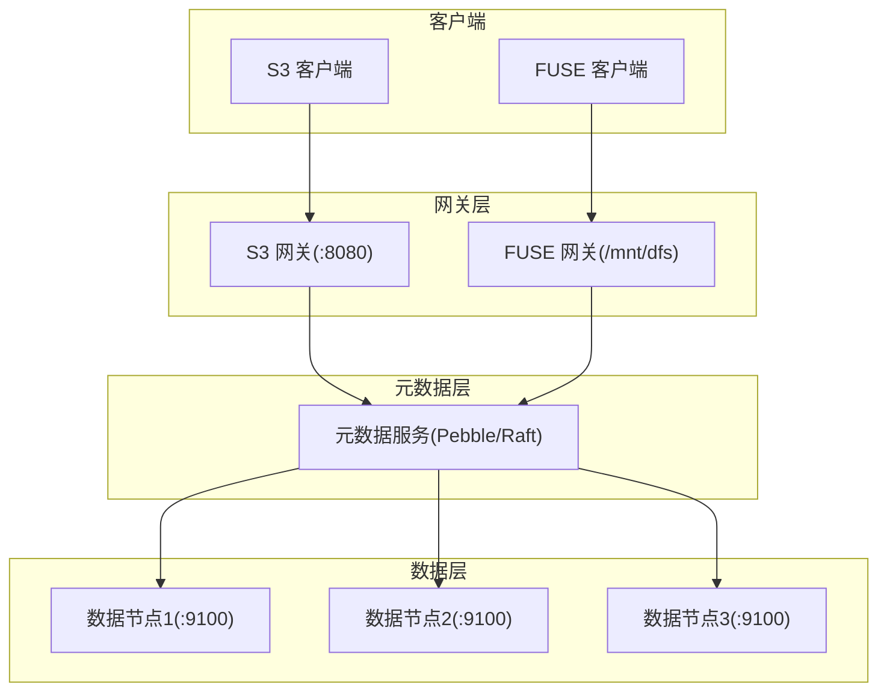
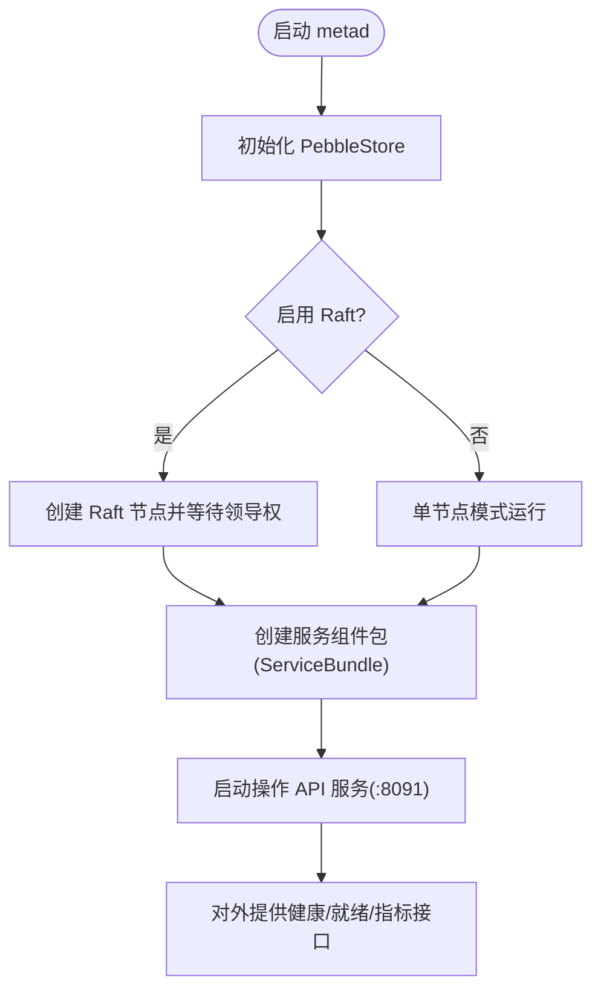
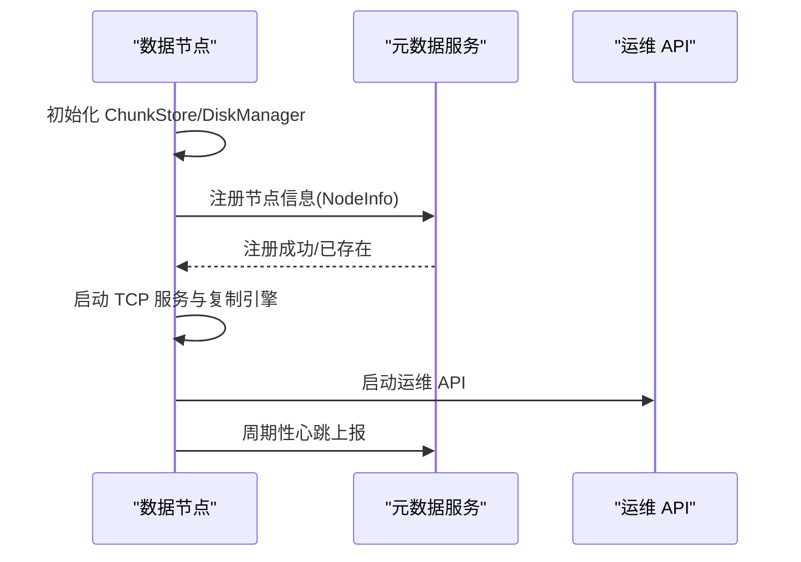
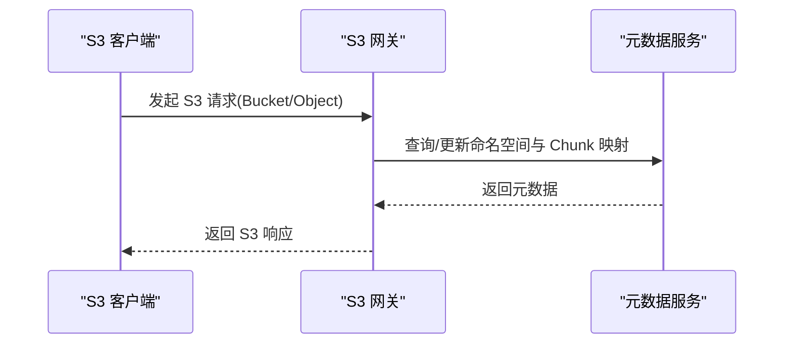
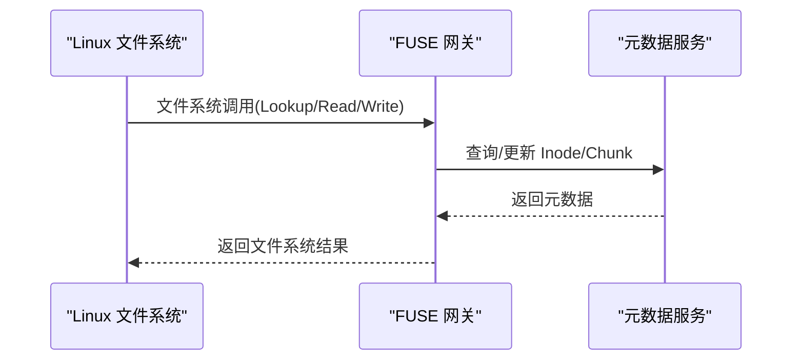
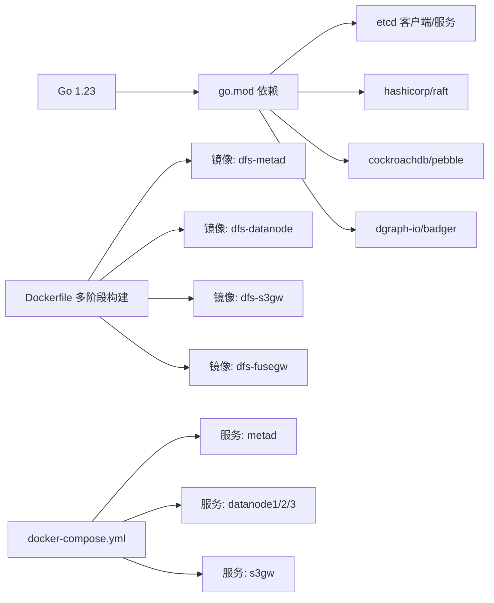
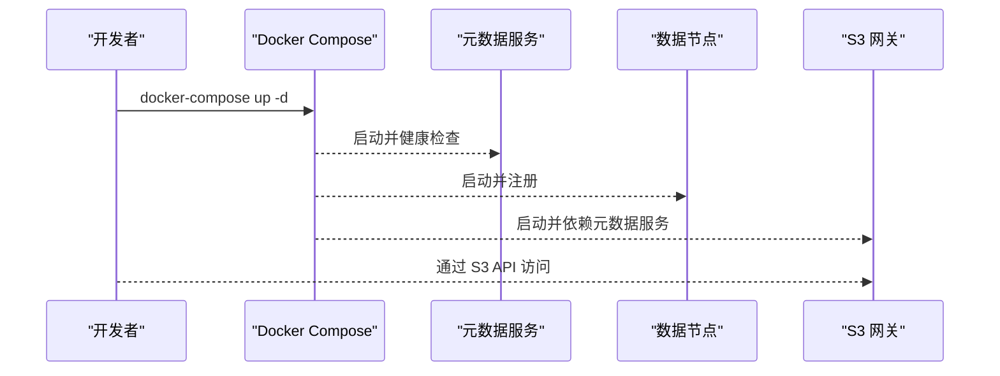

# 快速开始

<cite>
**本文引用的文件**
- [docker-compose.yml](file://nufs-core/docker-compose.yml)
- [cluster.yaml](file://nufs-core/deploy/config/cluster.yaml)
- [Dockerfile](file://nufs-core/Dockerfile)
- [ARCHITECTURE.md](file://nufs-core/ARCHITECTURE.md)
- [go.mod](file://nufs-core/go.mod)
- [Makefile](file://nufs-core/Makefile)
- [metad/main.go](file://nufs-core/cmd/metad/main.go)
- [datanode/main.go](file://nufs-core/cmd/datanode/main.go)
- [s3gw/main.go](file://nufs-core/cmd/s3gw/main.go)
- [fusegw/main.go](file://nufs-core/cmd/fusegw/main.go)
- [TODO.md](file://nufs-core/TODO.md)
</cite>

## 目录
1. [简介](#简介)
2. [项目结构](#项目结构)
3. [核心组件](#核心组件)
4. [架构总览](#架构总览)
5. [详细组件分析](#详细组件分析)
6. [依赖关系分析](#依赖关系分析)
7. [性能考虑](#性能考虑)
8. [故障排查指南](#故障排查指南)
9. [结论](#结论)
10. [附录](#附录)

## 简介
本指南面向初学者与开发者，帮助你在本地快速搭建并验证 NUFS 分布式文件系统。你将学会：
- 搭建开发环境（Go、Docker、Docker Compose）
- 使用 docker-compose.yml 快速启动本地开发集群
- 使用 cluster.yaml 配置生产环境参数
- 通过 S3 API 与 FUSE 挂载访问文件系统
- 常见初始化步骤与验证方法

## 项目结构
仓库采用多模块组织方式，核心在 nufs-core，包含元数据服务、数据节点、S3 网关、FUSE 网关等；nufs-fuse 为独立的 FUSE 客户端工具，与本项目网关层互补。

**图表来源**
- [docker-compose.yml:1-137](file://nufs-core/docker-compose.yml#L1-L137)
- [cluster.yaml:1-62](file://nufs-core/deploy/config/cluster.yaml#L1-L62)
- [Dockerfile:1-50](file://nufs-core/Dockerfile#L1-L50)
- [ARCHITECTURE.md:1-120](file://nufs-core/ARCHITECTURE.md#L1-L120)

**章节来源**
- [docker-compose.yml:1-137](file://nufs-core/docker-compose.yml#L1-L137)
- [cluster.yaml:1-62](file://nufs-core/deploy/config/cluster.yaml#L1-L62)
- [Dockerfile:1-50](file://nufs-core/Dockerfile#L1-L50)
- [ARCHITECTURE.md:1-120](file://nufs-core/ARCHITECTURE.md#L1-L120)

## 核心组件
- 元数据服务（metad）：负责命名空间、Inode、Chunk 映射、节点注册与租约管理等。支持嵌入式 etcd 模式用于开发，生产模式使用 Pebble + Raft。
- 数据节点（datanode）：负责本地 Chunk 存储、复制、心跳上报、反熵修复等。
- S3 网关（s3gw）：提供 S3 兼容 API，支持鉴权、CORS、中间件链等。
- FUSE 网关（fusegw）：在 Linux 上将 DFS 挂载为本地文件系统，支持属性缓存与写回缓冲。

**章节来源**
- [metad/main.go:1-150](file://nufs-core/cmd/metad/main.go#L1-L150)
- [datanode/main.go:1-135](file://nufs-core/cmd/datanode/main.go#L1-L135)
- [s3gw/main.go:1-91](file://nufs-core/cmd/s3gw/main.go#L1-L91)
- [fusegw/main.go:1-63](file://nufs-core/cmd/fusegw/main.go#L1-L63)
- [ARCHITECTURE.md:119-345](file://nufs-core/ARCHITECTURE.md#L119-L345)

## 架构总览
NUFS 采用“网关层-元数据层-数据层”的三层架构，支持 S3 API 与 FUSE 挂载，具备高可用与一致性保障。

**图表来源**
- [ARCHITECTURE.md:37-101](file://nufs-core/ARCHITECTURE.md#L37-L101)
- [docker-compose.yml:106-124](file://nufs-core/docker-compose.yml#L106-L124)

## 详细组件分析

### 元数据服务（metad）
- 启动参数要点：数据目录、缓存目录、节点 ID、是否启用 Raft、Raft 地址与对等节点、操作 API 地址、租约 TTL、GC 与 Scrub 间隔等。
- 运维接口：/health、/ready、/api/v1/buckets、/api/v1/nodes、/api/v1/cluster/status、/api/v1/metrics。
- 生产建议：启用 Raft，设置合理的快照阈值与尾随日志，配置租约 TTL 与 GC/Scrub 周期。

**图表来源**
- [metad/main.go:21-127](file://nufs-core/cmd/metad/main.go#L21-L127)

**章节来源**
- [metad/main.go:21-150](file://nufs-core/cmd/metad/main.go#L21-L150)

### 数据节点（datanode）
- 启动参数要点：节点 ID、监听地址、数据目录、元数据服务地址、机架/可用区、容量、操作 API 地址等。
- 关键组件：ChunkStore、DiskManager、Replicator、HeartbeatReporter、OpsServer。
- 运行流程：初始化存储与磁盘管理 → 注册到元数据服务 → 启动 TCP 服务与复制引擎 → 启动心跳与运维 API。

**图表来源**
- [datanode/main.go:34-122](file://nufs-core/cmd/datanode/main.go#L34-L122)

**章节来源**
- [datanode/main.go:1-135](file://nufs-core/cmd/datanode/main.go#L1-L135)

### S3 网关（s3gw）
- 启动参数要点：监听地址、元数据目录、访问密钥/密钥。
- 功能：S3 兼容 API、鉴权（AWS V4）、CORS、中间件链、HTTP 服务器。
- 使用场景：通过标准 S3 SDK 或 CLI 访问 DFS。

**图表来源**
- [s3gw/main.go:18-61](file://nufs-core/cmd/s3gw/main.go#L18-L61)

**章节来源**
- [s3gw/main.go:1-91](file://nufs-core/cmd/s3gw/main.go#L1-L91)

### FUSE 网关（fusegw）
- 启动参数要点：挂载点、元数据目录。
- 功能：将 DFS 挂载为本地文件系统，支持属性缓存与写回缓冲。
- 注意：仅 Linux 平台可用。

**图表来源**
- [fusegw/main.go:17-48](file://nufs-core/cmd/fusegw/main.go#L17-L48)

**章节来源**
- [fusegw/main.go:1-63](file://nufs-core/cmd/fusegw/main.go#L1-L63)

## 依赖关系分析
- 构建与运行依赖：Go 1.23、etcd 客户端、hashicorp/raft、pebble、badger 等。
- Docker 多阶段构建：分别产出 metad、datanode、s3gw、fusegw、ctl 二进制镜像。
- Compose 编排：元数据服务（嵌入式 etcd）、3 个数据节点、S3 网关，以及网络与卷。

**图表来源**
- [go.mod:1-108](file://nufs-core/go.mod#L1-L108)
- [Dockerfile:1-50](file://nufs-core/Dockerfile#L1-L50)
- [docker-compose.yml:1-137](file://nufs-core/docker-compose.yml#L1-L137)

**章节来源**
- [go.mod:1-108](file://nufs-core/go.mod#L1-L108)
- [Dockerfile:1-50](file://nufs-core/Dockerfile#L1-L50)
- [docker-compose.yml:1-137](file://nufs-core/docker-compose.yml#L1-L137)

## 性能考虑
- 元数据写入：Pebble + Raft 提供强一致写，适合高并发场景；合理设置快照阈值与尾随日志以平衡性能与恢复速度。
- 读取路径：Attr 缓存（5s TTL）与 Data 缓存（50s TTL）显著降低延迟；就近副本读取与写回缓冲进一步优化吞吐。
- 小文件优化：SmallFileBlock 合并存储，减少元数据开销与磁盘碎片。
- 容量与副本：根据业务 SLA 设置副本因子与拓扑分布，结合再平衡阈值与并发限制。

**章节来源**
- [ARCHITECTURE.md:538-763](file://nufs-core/ARCHITECTURE.md#L538-L763)

## 故障排查指南
- 健康检查：S3 网关与元数据服务均提供健康探针，Compose 中已内置健康检查脚本。
- 日志采集：使用 Makefile 提供的日志命令查看各服务输出。
- 常见问题定位：
  - 元数据服务未就绪：检查 Raft 集群是否选举成功，租约 TTL 是否过短。
  - 数据节点未注册：确认元数据服务地址与端口正确，心跳上报是否正常。
  - S3 网关鉴权失败：确认访问密钥/密钥配置，或切换匿名模式进行验证。
  - FUSE 挂载失败：确认挂载点存在且权限足够，内核是否支持 FUSE。

**章节来源**
- [docker-compose.yml:26-31](file://nufs-core/docker-compose.yml#L26-L31)
- [metad/main.go:154-212](file://nufs-core/cmd/metad/main.go#L154-L212)
- [s3gw/main.go:39-46](file://nufs-core/cmd/s3gw/main.go#L39-L46)
- [fusegw/main.go:27-32](file://nufs-core/cmd/fusegw/main.go#L27-L32)
- [Makefile:67-68](file://nufs-core/Makefile#L67-L68)

## 结论
通过本指南，你可以在本地快速启动 NUFS 集群，使用 S3 API 与 FUSE 挂载进行基础验证。生产部署可参考 cluster.yaml 的配置项，结合 Docker Compose 或未来 Kubernetes Helm Chart 进行规模化部署。建议在上线前完成性能压测与故障演练，确保满足业务 SLA。

## 附录

### A. 开发环境搭建
- 安装 Go（版本要求见 go.mod）
- 安装 Docker 与 Docker Compose
- 克隆仓库并进入 nufs-core 目录

**章节来源**
- [go.mod:1-10](file://nufs-core/go.mod#L1-L10)
- [Makefile:1-76](file://nufs-core/Makefile#L1-L76)

### B. 使用 docker-compose.yml 快速启动本地开发环境
- 构建镜像：使用多阶段 Dockerfile 产出各服务镜像
- 启动集群：docker-compose up -d
- 访问服务：
  - S3 网关：http://localhost:8080
  - 元数据服务运维 API：http://localhost:8091
  - 数据节点：默认监听 9100，可通过 ops API 检查状态

**图表来源**
- [docker-compose.yml:3-124](file://nufs-core/docker-compose.yml#L3-L124)
- [Dockerfile:14-18](file://nufs-core/Dockerfile#L14-L18)

**章节来源**
- [docker-compose.yml:1-137](file://nufs-core/docker-compose.yml#L1-L137)
- [Dockerfile:1-50](file://nufs-core/Dockerfile#L1-L50)
- [Makefile:54-65](file://nufs-core/Makefile#L54-L65)

### C. 使用 cluster.yaml 配置生产环境
- 集群名称与区域：cluster.name、cluster.region
- 元数据服务：etcd_endpoints、badger_cache_dir、node_id
- 数据节点：listen、data_dir、capacity_gb、tier、rack、zone、heartbeat_interval
- S3 网关：listen、etcd_endpoints、auth、cors
- FUSE 网关：mountpoint、etcd_endpoints、badger_cache_dir
- 放置策略：replication_factor、topology_spread、storage_tier
- 维修与再平衡：repair.scan_interval、repair.max_concurrent_repairs、rebalance.threshold、rebalance.max_migrations_per_run、rebalance.scan_interval

**章节来源**
- [cluster.yaml:1-62](file://nufs-core/deploy/config/cluster.yaml#L1-L62)

### D. 基本使用示例

#### 通过 S3 API 访问
- 创建桶与对象：使用 aws-cli 或任意 S3 SDK
- 列举桶与对象：验证 S3 网关连通性
- 上传/下载/删除：验证写入与读取路径

**章节来源**
- [s3gw/main.go:18-61](file://nufs-core/cmd/s3gw/main.go#L18-L61)
- [ARCHITECTURE.md:291-318](file://nufs-core/ARCHITECTURE.md#L291-L318)

#### 通过 FUSE 挂载访问
- 在 Linux 上创建挂载点并启动 fusegw
- 使用标准文件系统命令（ls/cat/vim）验证读写

**章节来源**
- [fusegw/main.go:17-48](file://nufs-core/cmd/fusegw/main.go#L17-L48)
- [ARCHITECTURE.md:320-331](file://nufs-core/ARCHITECTURE.md#L320-L331)

### E. 初始化与验证步骤
- 初始化元数据服务：确保 Raft 集群就绪，节点注册成功
- 初始化数据节点：确认磁盘容量、副本策略与心跳上报
- 验证 S3 网关：通过 /health 与 /ready 探针，再进行对象操作
- 验证 FUSE：挂载后进行文件读写与目录浏览

**章节来源**
- [metad/main.go:154-212](file://nufs-core/cmd/metad/main.go#L154-L212)
- [datanode/main.go:79-92](file://nufs-core/cmd/datanode/main.go#L79-L92)
- [docker-compose.yml:26-31](file://nufs-core/docker-compose.yml#L26-L31)

### F. Kubernetes 部署（待实现）
- TODO：Helm Chart、StatefulSet、PVC、Service/Ingress、滚动升级与零停机策略
- 当前进度：已完成 Docker Compose 与多阶段构建

**章节来源**
- [TODO.md:76-92](file://nufs-core/TODO.md#L76-L92)