# 存储优化

<cite>
**本文引用的文件列表**
- [ARCHITECTURE.md](file://nufs-core/ARCHITECTURE.md)
- [chunkstore.go](file://nufs-core/datanode/chunkstore.go)
- [diskmanager.go](file://nufs-core/datanode/diskmanager.go)
- [placement.go](file://nufs-core/metadata/placement.go)
- [ec.go](file://nufs-core/metadata/ec.go)
- [smallfile.go](file://nufs-core/metadata/smallfile.go)
- [ops.go](file://nufs-core/datanode/ops.go)
- [types.go](file://nufs-core/datanode/types.go)
- [balance.go](file://nufs-core/metadata/balance.go)
- [replicator.go](file://nufs-core/datanode/replicator.go)
- [types.go](file://nufs-core/metadata/types.go)
</cite>

## 目录
1. [简介](#简介)
2. [项目结构](#项目结构)
3. [核心组件](#核心组件)
4. [架构概览](#架构概览)
5. [详细组件分析](#详细组件分析)
6. [依赖关系分析](#依赖关系分析)
7. [性能考量](#性能考量)
8. [故障排查指南](#故障排查指南)
9. [结论](#结论)
10. [附录](#附录)

## 简介
本文件面向NUFS分布式文件系统的存储优化策略，聚焦磁盘I/O优化、存储布局设计、数据组织策略、Chunk存储优化、放置策略与数据分布算法、空间利用率提升、读写性能优化、磁盘管理策略、存储性能监控指标与瓶颈分析方法，以及不同存储介质下的优化策略与配置建议，并提供开发者调优与容量规划指南。

## 项目结构
- 数据层（DataNode）：负责本地Chunk存储、复制、心跳上报与运维接口。
- 元数据层（Metadata）：负责命名空间、Chunk映射、放置策略、纠删码、生命周期与再平衡。
- 网关层（Gateway）：提供S3与FUSE接口，内置客户端缓存与写回策略。

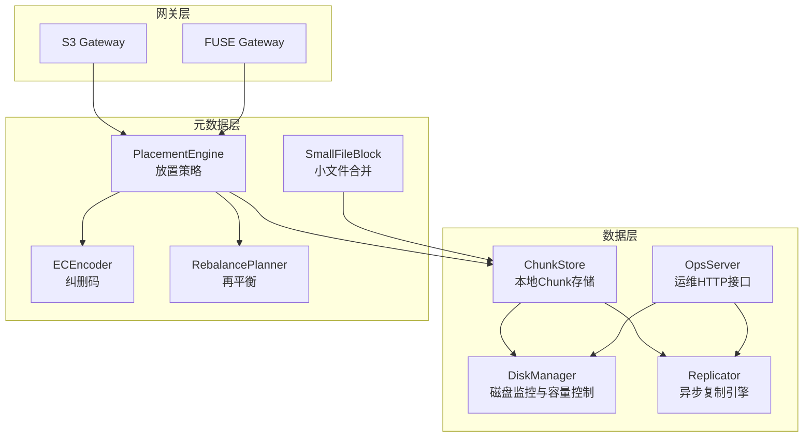

图表来源
- [chunkstore.go:18-31](file://nufs-core/datanode/chunkstore.go#L18-L31)
- [diskmanager.go:24-45](file://nufs-core/datanode/diskmanager.go#L24-L45)
- [placement.go:27-42](file://nufs-core/metadata/placement.go#L27-L42)
- [ec.go:13-34](file://nufs-core/metadata/ec.go#L13-L34)
- [balance.go:14-26](file://nufs-core/metadata/balance.go#L14-L26)
- [smallfile.go:9-18](file://nufs-core/metadata/smallfile.go#L9-L18)
- [ops.go:19-43](file://nufs-core/datanode/ops.go#L19-L43)

章节来源
- [ARCHITECTURE.md:37-101](file://nufs-core/ARCHITECTURE.md#L37-L101)

## 核心组件
- ChunkStore：本地Chunk文件存储与读写，采用二进制头部+数据体+校验，支持并发读写信号量与元数据边车。
- DiskManager：容量限制、实时磁盘统计、WAL崩溃恢复、分层迁移（Tier Hot/Warm/Cold/Archive）。
- PlacementEngine：基于容量、负载、拓扑与介质的加权评分，生成主从副本节点列表。
- ECEncoder：纠删码编码/解码（演示为XOR），支持校验与重建。
- Replicator：多Worker并行复制、指数退避重试、校验一致性。
- RebalancePlanner：基于变异系数的再平衡与节点下线迁移。
- SmallFileBlock：小文件合并存储，显著降低元数据与空间浪费。
- OpsServer：运维接口，暴露磁盘、复制、反熵等指标与健康状态。

章节来源
- [chunkstore.go:18-31](file://nufs-core/datanode/chunkstore.go#L18-L31)
- [diskmanager.go:24-45](file://nufs-core/datanode/diskmanager.go#L24-L45)
- [placement.go:27-42](file://nufs-core/metadata/placement.go#L27-L42)
- [ec.go:13-34](file://nufs-core/metadata/ec.go#L13-L34)
- [replicator.go:23-46](file://nufs-core/datanode/replicator.go#L23-L46)
- [balance.go:14-26](file://nufs-core/metadata/balance.go#L14-L26)
- [smallfile.go:9-18](file://nufs-core/metadata/smallfile.go#L9-L18)
- [ops.go:19-43](file://nufs-core/datanode/ops.go#L19-L43)

## 架构概览
- 写入路径：S3/FUSE → 元数据分配Chunk → 主节点写入 → 异步复制 → 元数据提交。
- 读取路径：S3/FUSE → 元数据查询 → 选择就近副本 → 本地读取 → 客户端缓存。
- 放置策略：过滤可用节点 → 加权评分 → 拓扑分散 → 生成主从副本。
- 纠删码：K+M分片，任意M丢失可重建。
- 小文件优化：目录内≥50个小文件时创建Block，单Block容纳最多256个文件，显著降低元数据与空间浪费。
- 再平衡：基于变异系数检测集群不平衡，生成迁移计划，避免热点节点。

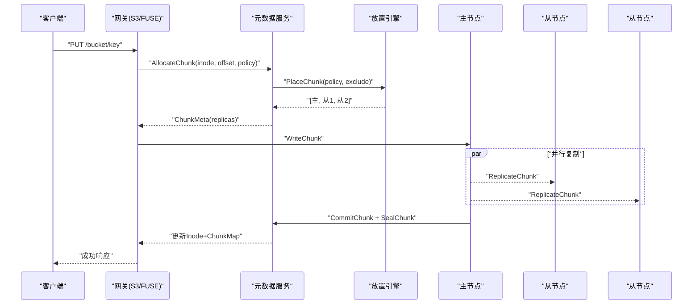

图表来源
- [ARCHITECTURE.md:349-383](file://nufs-core/ARCHITECTURE.md#L349-L383)
- [placement.go:66-137](file://nufs-core/metadata/placement.go#L66-L137)
- [replicator.go:77-94](file://nufs-core/datanode/replicator.go#L77-L94)

章节来源
- [ARCHITECTURE.md:349-436](file://nufs-core/ARCHITECTURE.md#L349-L436)

## 详细组件分析

### Chunk存储优化与磁盘布局
- 存储布局：每个Chunk以二进制头部+数据体形式存储，头部包含魔数、ChunkID、数据长度、CRC32校验；数据体为原始数据；支持元数据边车文件快速启动。
- 并发控制：读写通道信号量限制并发，避免磁盘争用导致抖动。
- 读写流程：写入时先写头部与数据，再fsync；读取时校验头部魔数与长度，支持offset+length范围读取；封印阶段计算全量数据CRC并更新头部。
- 元数据边车：写入完成后写入JSON边车，便于启动时快速重建索引。
- 目录分片：按chunk_id % 256进行256路分片，避免单目录文件过多。

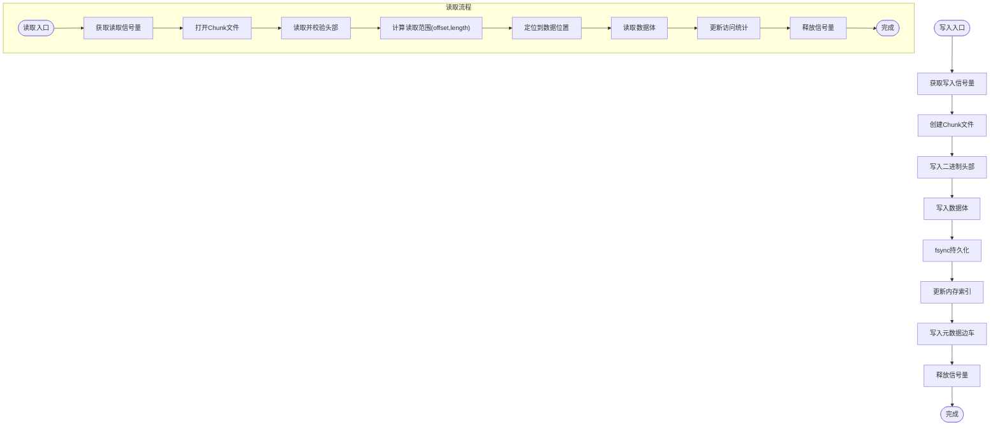

图表来源
- [chunkstore.go:73-127](file://nufs-core/datanode/chunkstore.go#L73-L127)
- [chunkstore.go:169-227](file://nufs-core/datanode/chunkstore.go#L169-L227)
- [chunkstore.go:229-275](file://nufs-core/datanode/chunkstore.go#L229-L275)
- [chunkstore.go:386-394](file://nufs-core/datanode/chunkstore.go#L386-L394)

章节来源
- [chunkstore.go:18-31](file://nufs-core/datanode/chunkstore.go#L18-L31)
- [chunkstore.go:61-71](file://nufs-core/datanode/chunkstore.go#L61-L71)
- [chunkstore.go:73-127](file://nufs-core/datanode/chunkstore.go#L73-L127)
- [chunkstore.go:169-227](file://nufs-core/datanode/chunkstore.go#L169-L227)
- [chunkstore.go:229-275](file://nufs-core/datanode/chunkstore.go#L229-L275)
- [chunkstore.go:325-351](file://nufs-core/datanode/chunkstore.go#L325-L351)
- [chunkstore.go:386-394](file://nufs-core/datanode/chunkstore.go#L386-L394)

### 放置策略与数据分布算法
- 过滤：排除离线、容量>95%、介质不匹配节点。
- 评分：基于空闲容量权重40%、低负载权重30%、介质匹配权重30%，并加入微小抖动避免“惊群”。
- 拓扑：按Zone/Rack/Node级别进行故障域分散，若无法满足约束则回退到宽松选择。
- 生成：返回主节点与从节点列表，供写入与复制使用。
- ID生成：Snowflake风格64位ID，包含毫秒时间戳、节点ID与序列号。

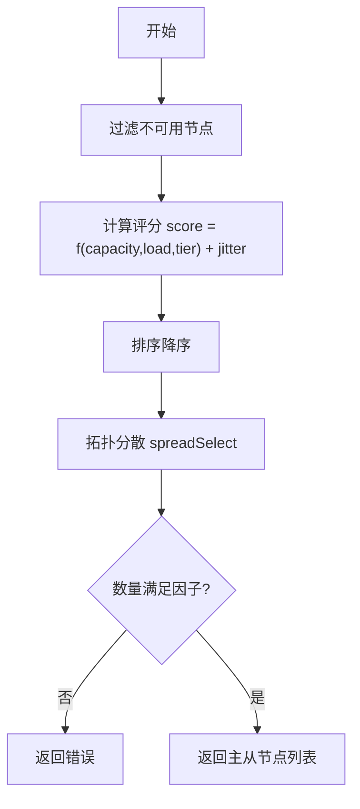

图表来源
- [placement.go:66-137](file://nufs-core/metadata/placement.go#L66-L137)
- [placement.go:139-182](file://nufs-core/metadata/placement.go#L139-L182)
- [placement.go:197-234](file://nufs-core/metadata/placement.go#L197-L234)

章节来源
- [placement.go:66-137](file://nufs-core/metadata/placement.go#L66-L137)
- [placement.go:139-182](file://nufs-core/metadata/placement.go#L139-L182)
- [placement.go:197-234](file://nufs-core/metadata/placement.go#L197-L234)

### 纠错编码（EC）与数据组织
- 编码：将数据切分为K个数据分片，计算M个奇偶分片，任意M个分片丢失仍可重建。
- 解码：当缺失数据分片时，利用奇偶分片与现有分片进行重建。
- 校验：对奇偶分片进行一致性校验，确保数据完整性。
- 注意：演示采用XOR方式，生产环境建议使用成熟库如klauspost/reedsolomon。

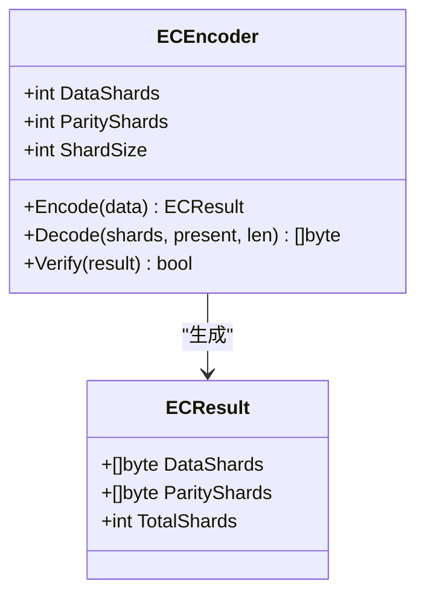

图表来源
- [ec.go:13-34](file://nufs-core/metadata/ec.go#L13-L34)
- [ec.go:36-82](file://nufs-core/metadata/ec.go#L36-L82)
- [ec.go:84-187](file://nufs-core/metadata/ec.go#L84-L187)
- [ec.go:189-213](file://nufs-core/metadata/ec.go#L189-L213)

章节来源
- [ec.go:13-34](file://nufs-core/metadata/ec.go#L13-L34)
- [ec.go:36-82](file://nufs-core/metadata/ec.go#L36-L82)
- [ec.go:84-187](file://nufs-core/metadata/ec.go#L84-L187)
- [ec.go:189-213](file://nufs-core/metadata/ec.go#L189-L213)

### 小文件优化与空间利用率提升
- 阈值：文件大小≤64KB时合并到Block；目录内≥50个小文件时创建Block。
- Block：1MB大小，最多容纳256个小文件，包含索引与校验。
- 效果：显著降低元数据与空间浪费，提升磁盘利用率。

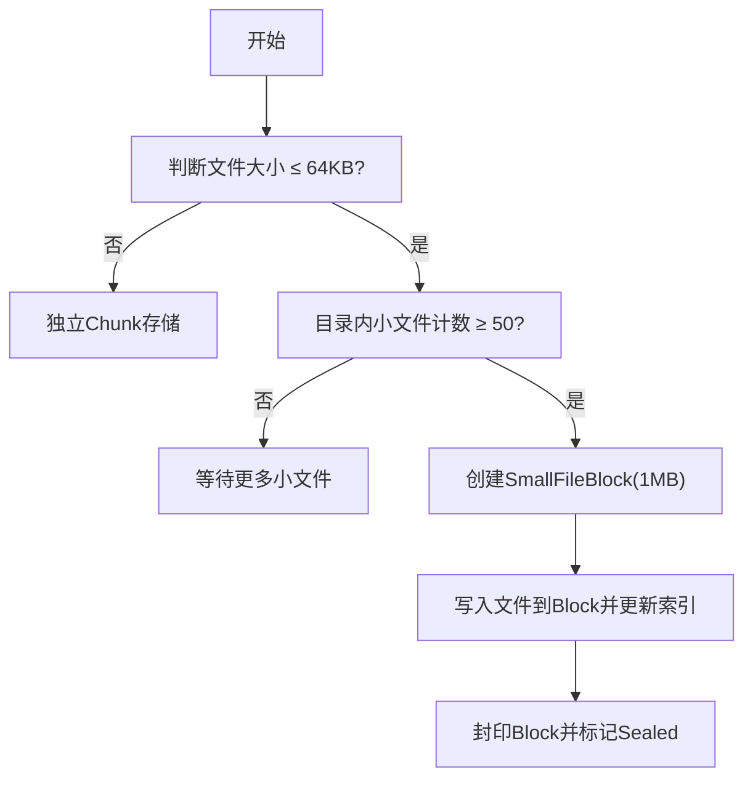

图表来源
- [smallfile.go:70-79](file://nufs-core/metadata/smallfile.go#L70-L79)
- [smallfile.go:28-36](file://nufs-core/metadata/smallfile.go#L28-L36)

章节来源
- [smallfile.go:9-18](file://nufs-core/metadata/smallfile.go#L9-L18)
- [smallfile.go:70-79](file://nufs-core/metadata/smallfile.go#L70-L79)
- [smallfile.go:28-36](file://nufs-core/metadata/smallfile.go#L28-L36)

### 磁盘管理与容量规划
- 容量限制：可配置拒绝阈值（默认90%），超过阈值拒绝新写入。
- 实时统计：记录总字节、已用字节、可用字节、使用率、Chunk数量、读写IOPS与字节。
- WAL：崩溃恢复，记录未提交写入，重启后清理孤儿Chunk。
- 分层迁移：按年龄与访问模式将数据从Hot迁移到Warm/Cold/Archive，控制各层最大占比。
- 配置项：并发读写限制、心跳间隔、节点拓扑（Rack/Zone）、容量上限等。

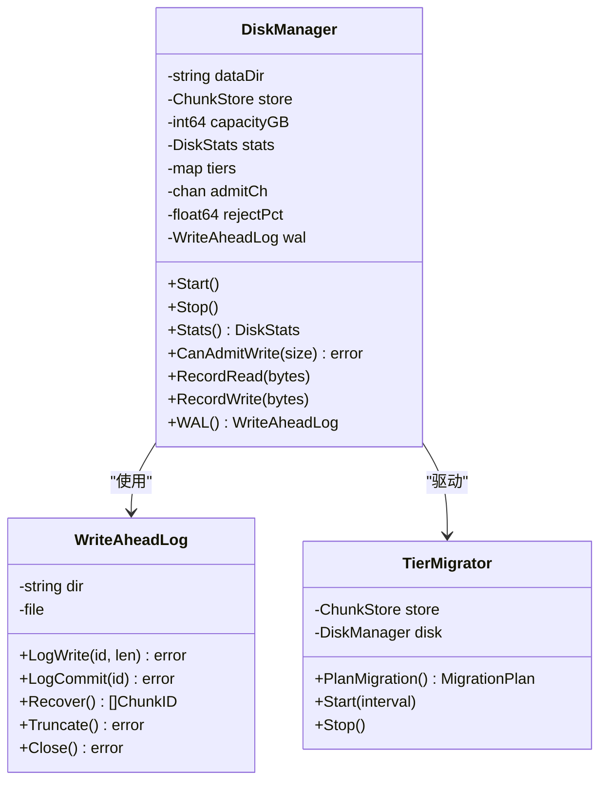

图表来源
- [diskmanager.go:24-45](file://nufs-core/datanode/diskmanager.go#L24-L45)
- [diskmanager.go:190-205](file://nufs-core/datanode/diskmanager.go#L190-L205)
- [diskmanager.go:335-350](file://nufs-core/datanode/diskmanager.go#L335-L350)

章节来源
- [diskmanager.go:68-88](file://nufs-core/datanode/diskmanager.go#L68-L88)
- [diskmanager.go:122-139](file://nufs-core/datanode/diskmanager.go#L122-L139)
- [diskmanager.go:141-151](file://nufs-core/datanode/diskmanager.go#L141-L151)
- [diskmanager.go:172-184](file://nufs-core/datanode/diskmanager.go#L172-L184)
- [diskmanager.go:200-205](file://nufs-core/datanode/diskmanager.go#L200-L205)
- [diskmanager.go:220-256](file://nufs-core/datanode/diskmanager.go#L220-L256)
- [diskmanager.go:258-329](file://nufs-core/datanode/diskmanager.go#L258-L329)
- [diskmanager.go:335-350](file://nufs-core/datanode/diskmanager.go#L335-L350)
- [diskmanager.go:360-386](file://nufs-core/datanode/diskmanager.go#L360-L386)
- [diskmanager.go:388-420](file://nufs-core/datanode/diskmanager.go#L388-L420)

### 复制引擎与数据一致性
- 多Worker并行复制，任务队列缓冲1024，指数退避重试最多3次。
- 复制流程：源节点读Chunk → 目标节点写Chunk → 校验CRC。
- 修复流程：从存活副本读取 → 写入新目标节点。
- 运维接口：暴露复制统计、健康状态、修复队列等。

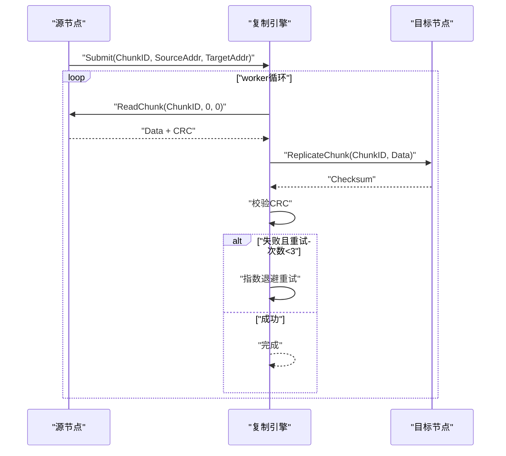

图表来源
- [replicator.go:77-94](file://nufs-core/datanode/replicator.go#L77-L94)
- [replicator.go:128-174](file://nufs-core/datanode/replicator.go#L128-L174)
- [ops.go:115-133](file://nufs-core/datanode/ops.go#L115-L133)

章节来源
- [replicator.go:23-46](file://nufs-core/datanode/replicator.go#L23-L46)
- [replicator.go:77-94](file://nufs-core/datanode/replicator.go#L77-L94)
- [replicator.go:128-174](file://nufs-core/datanode/replicator.go#L128-L174)
- [ops.go:115-133](file://nufs-core/datanode/ops.go#L115-L133)

### 再平衡与集群均衡
- 指标：基于变异系数衡量集群不平衡程度。
- 策略：将超载节点的Chunk迁移到欠载节点，限制每次迁移比例。
- 下线迁移：为节点下线生成高优先级迁移计划，优先选择空闲容量最大的目标节点。

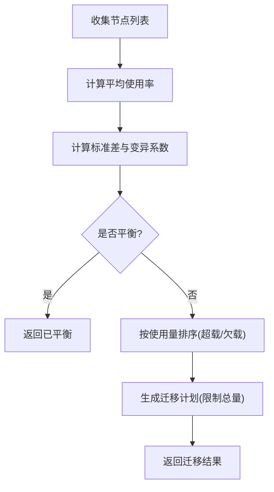

图表来源
- [balance.go:46-106](file://nufs-core/metadata/balance.go#L46-L106)
- [balance.go:179-224](file://nufs-core/metadata/balance.go#L179-L224)

章节来源
- [balance.go:46-106](file://nufs-core/metadata/balance.go#L46-L106)
- [balance.go:179-224](file://nufs-core/metadata/balance.go#L179-L224)

### 存储性能监控与运维接口
- 运维接口：集群状态、节点列表、桶列表、Chunk校验、修复队列、GC扫描、指标与健康检查。
- 指标：磁盘使用、缓存统计、复制写入/错误/平均延迟、反熵扫描/不匹配/修复数量。
- 健康：根据使用率判定健康状态，接近阈值返回降级状态。

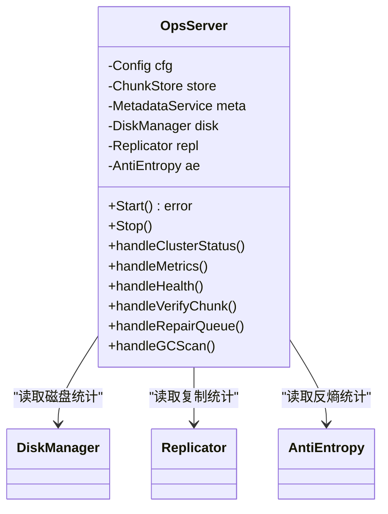

图表来源
- [ops.go:19-43](file://nufs-core/datanode/ops.go#L19-L43)
- [ops.go:115-133](file://nufs-core/datanode/ops.go#L115-L133)
- [ops.go:254-270](file://nufs-core/datanode/ops.go#L254-L270)
- [ops.go:279-298](file://nufs-core/datanode/ops.go#L279-L298)

章节来源
- [ops.go:19-43](file://nufs-core/datanode/ops.go#L19-L43)
- [ops.go:115-133](file://nufs-core/datanode/ops.go#L115-L133)
- [ops.go:254-270](file://nufs-core/datanode/ops.go#L254-L270)
- [ops.go:279-298](file://nufs-core/datanode/ops.go#L279-L298)

## 依赖关系分析
- 数据层依赖元数据层提供的放置策略与Chunk元数据；同时通过运维接口暴露运行状态。
- 元数据层内部依赖：放置引擎依赖节点负载与拓扑；再平衡依赖节点统计；纠删码独立于存储层。
- 网关层通过元数据服务间接依赖放置引擎与再平衡。

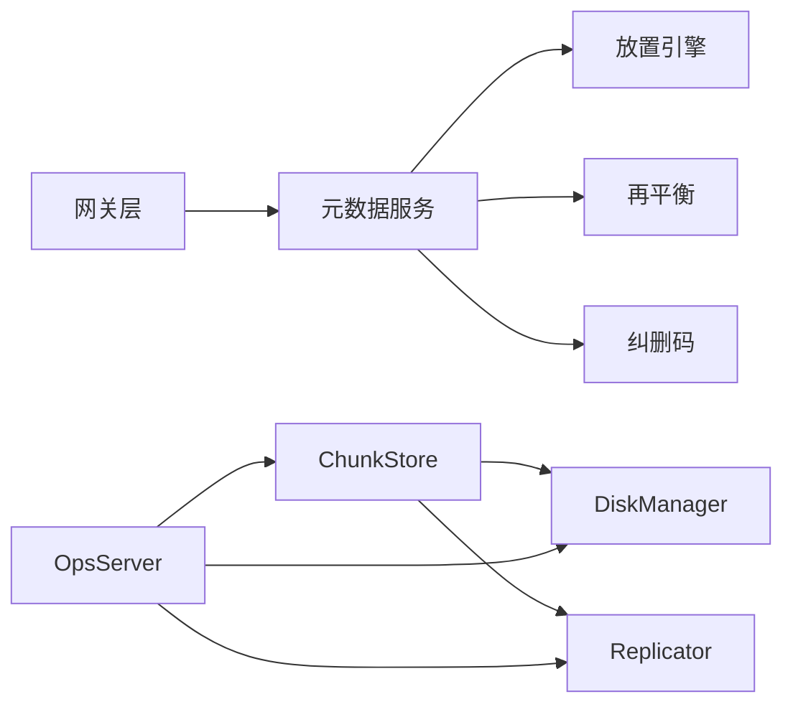

图表来源
- [ARCHITECTURE.md:118-123](file://nufs-core/ARCHITECTURE.md#L118-L123)
- [ops.go:19-43](file://nufs-core/datanode/ops.go#L19-L43)

章节来源
- [ARCHITECTURE.md:118-123](file://nufs-core/ARCHITECTURE.md#L118-L123)
- [ops.go:19-43](file://nufs-core/datanode/ops.go#L19-L43)

## 性能考量
- 读写路径优化
  - 读取：Attr/Data缓存（TTL 5s/50s）显著降低元数据与重复读开销；就近副本选择减少网络延迟。
  - 写入：主节点先写，异步复制到从节点；WAL保障崩溃恢复；并发信号量限制磁盘争用。
- 存储布局
  - 256路分片目录避免单目录文件过多；二进制头部+校验减少解析成本；元数据边车加速启动。
- 小文件优化
  - Block合并显著降低元数据与空间浪费，提升磁盘利用率。
- 复制与再平衡
  - 多Worker并行复制与指数退避重试提高可靠性；再平衡降低热点节点，提升整体吞吐。
- 纠删码
  - K+M分片提升容错能力，适合冷/归档数据；生产建议使用成熟库替代演示方案。

[本节为通用性能讨论，无需特定文件引用]

## 故障排查指南
- Chunk校验
  - 通过运维接口对指定Chunk进行校验，比较元数据与本地CRC，定位不一致问题。
- 崩溃恢复
  - WAL记录未提交写入，重启后清理孤儿Chunk，避免脏数据残留。
- 健康检查
  - 使用健康接口查看磁盘使用率，接近阈值返回降级状态，提示扩容或迁移。
- 复制异常
  - 查看复制统计与错误计数，结合指数退避日志定位网络或磁盘问题。
- 再平衡
  - 若迁移计划未执行，检查目标节点容量与可达性。

章节来源
- [ops.go:177-200](file://nufs-core/datanode/ops.go#L177-L200)
- [ops.go:279-298](file://nufs-core/datanode/ops.go#L279-L298)
- [diskmanager.go:258-329](file://nufs-core/datanode/diskmanager.go#L258-L329)
- [replicator.go:106-125](file://nufs-core/datanode/replicator.go#L106-L125)

## 结论
NUFS通过分层架构实现了高效的存储优化：Chunk二进制布局与并发控制降低磁盘I/O开销；放置策略与拓扑分散提升可靠性；小文件Block合并显著提升空间利用率；纠删码与再平衡保障数据安全与集群均衡；运维接口提供全面监控与健康状态。开发者可据此进行容量规划与性能调优，结合不同介质特性制定Tier策略与迁移节奏。

[本节为总结性内容，无需特定文件引用]

## 附录

### 不同存储介质下的优化策略与配置建议
- NVMe（Hot）
  - 高IOPS、低延迟，适合热数据；建议提高并发读写限制与复制Worker数量。
  - 配置：容量上限合理设置，拒绝阈值可适当提高以充分利用高性能介质。
- SSD（Warm）
  - 平衡性能与成本，适合温数据；建议启用Tier迁移，定期从Hot迁移到Warm。
  - 配置：默认Tier热占比30%，温占比40%，冷占比25%，归档5%。
- HDD（Cold）
  - 低成本存储，适合冷数据；建议开启纠删码，降低冗余需求。
  - 配置：延长迁移周期，降低对在线性能影响。
- 归档/对象（Archive）
  - 极低成本，适合长期归档；建议使用纠删码与较低访问频率策略。

章节来源
- [diskmanager.go:90-97](file://nufs-core/datanode/diskmanager.go#L90-L97)
- [diskmanager.go:335-350](file://nufs-core/datanode/diskmanager.go#L335-L350)
- [types.go:199-209](file://nufs-core/metadata/types.go#L199-L209)

### 存储性能调优与容量规划指南
- 调优要点
  - 控制并发读写：根据磁盘类型调整MaxConcurrentWrites/Reads，避免过度争用。
  - 合理放置：优先选择介质匹配与低负载节点，启用拓扑分散。
  - 小文件合并：开启小文件Block策略，减少元数据与碎片。
  - 复制与再平衡：保持复制Worker数量与队列容量适配业务峰值；定期执行再平衡。
  - 纠删码：对冷/归档数据启用，降低冗余成本。
- 容量规划
  - 基于业务数据增长预测与Tier占比，预留扩展空间；监控使用率与迁移效果，动态调整阈值。
  - 通过运维接口持续观察磁盘、复制与反熵指标，及时发现瓶颈。

章节来源
- [types.go:56-70](file://nufs-core/datanode/types.go#L56-L70)
- [placement.go:66-137](file://nufs-core/metadata/placement.go#L66-L137)
- [smallfile.go:70-79](file://nufs-core/metadata/smallfile.go#L70-L79)
- [balance.go:46-106](file://nufs-core/metadata/balance.go#L46-L106)
- [ops.go:254-270](file://nufs-core/datanode/ops.go#L254-L270)