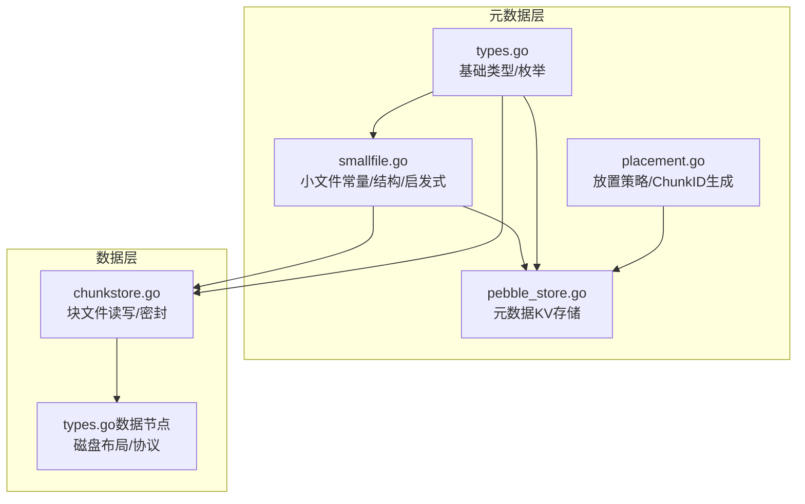
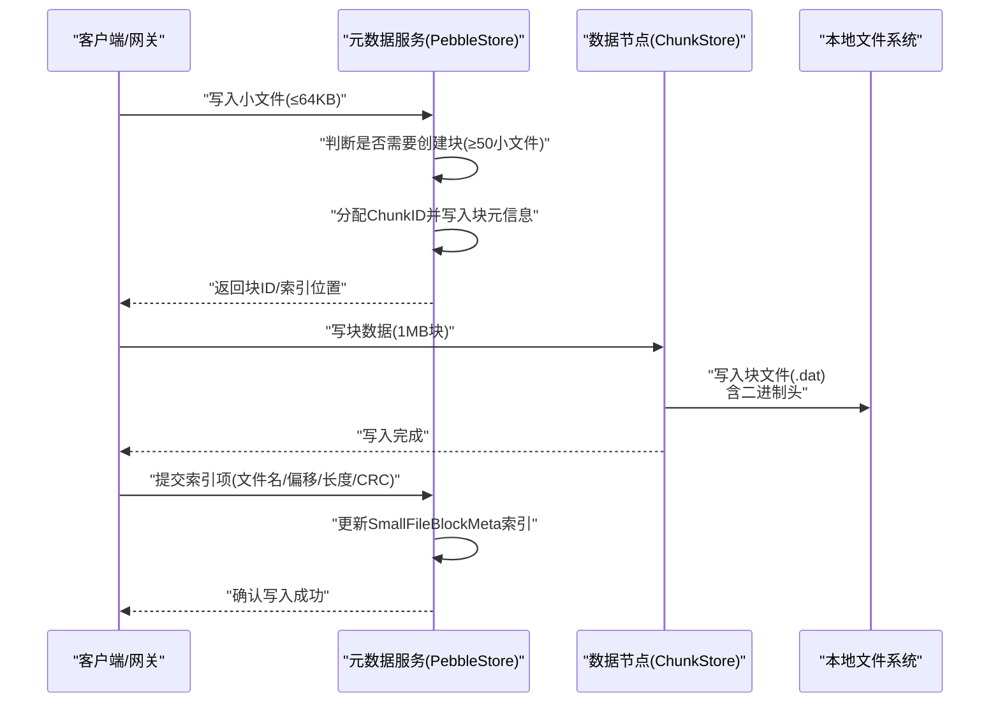
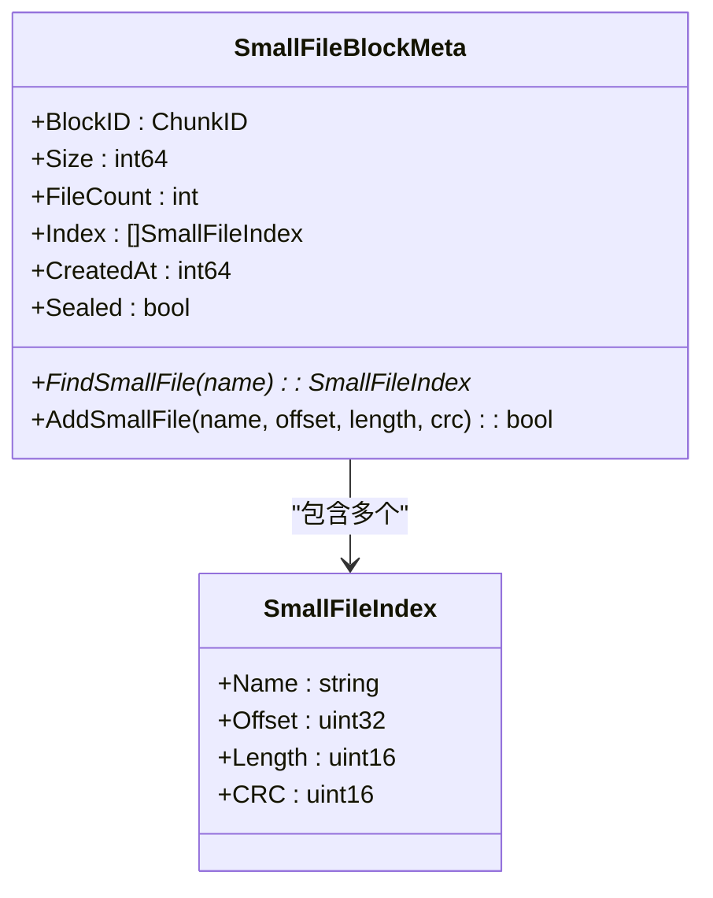
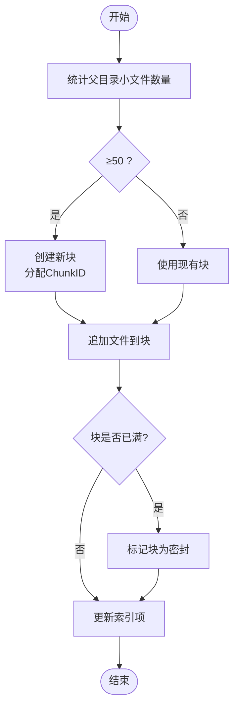
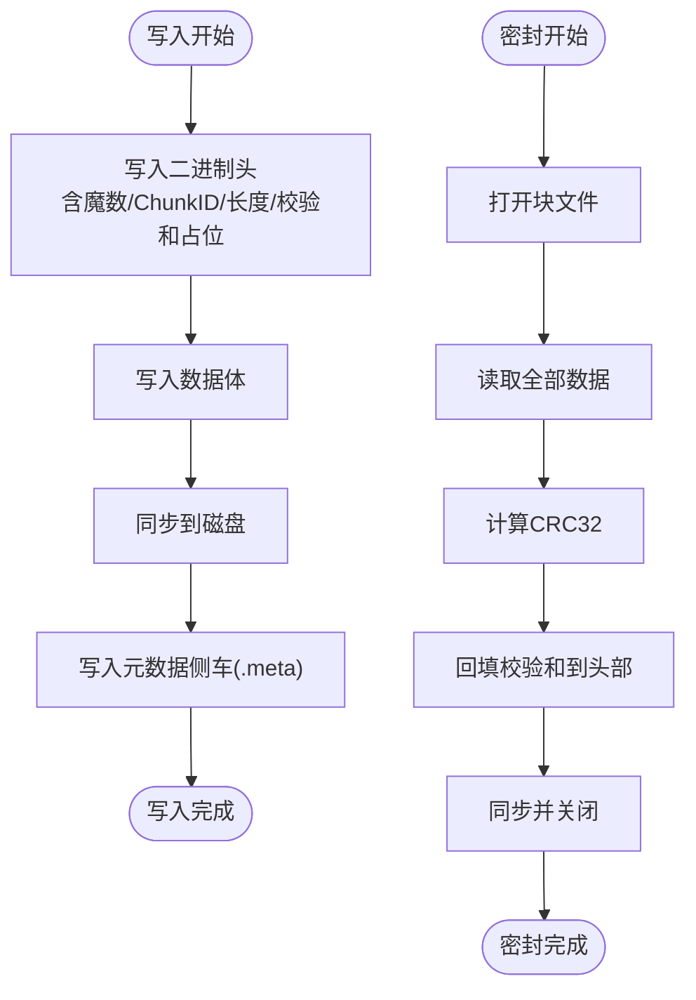
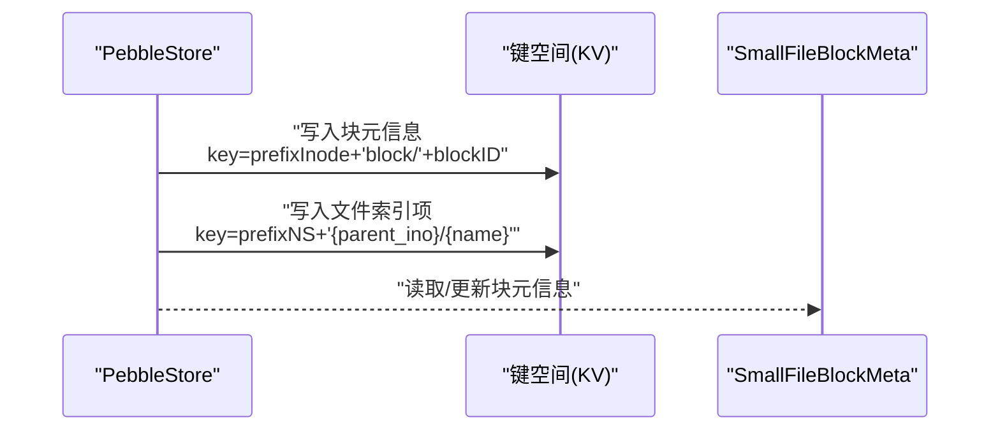
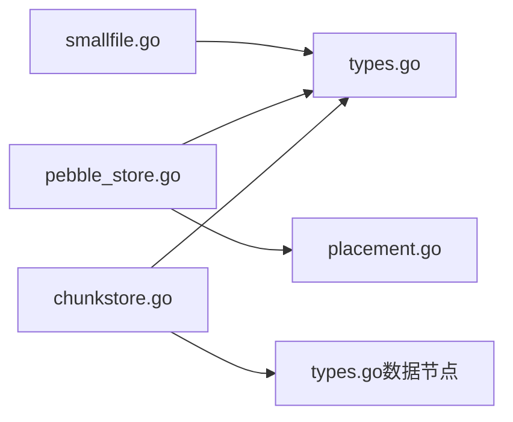

# 小文件优化

<cite>
**本文引用的文件**
- [smallfile.go](file://nufs-core/metadata/smallfile.go)
- [types.go](file://nufs-core/metadata/types.go)
- [chunkstore.go](file://nufs-core/datanode/chunkstore.go)
- [types.go（数据节点）](file://nufs-core/datanode/types.go)
- [pebble_store.go](file://nufs-core/metadata/pebble_store.go)
- [placement.go](file://nufs-core/metadata/placement.go)
</cite>

## 目录
1. [简介](#简介)
2. [项目结构](#项目结构)
3. [核心组件](#核心组件)
4. [架构总览](#架构总览)
5. [详细组件分析](#详细组件分析)
6. [依赖关系分析](#依赖关系分析)
7. [性能考量](#性能考量)
8. [故障排查指南](#故障排查指南)
9. [结论](#结论)
10. [附录](#附录)

## 简介
本文件面向NUFS分布式文件系统的“小文件优化”机制，围绕小文件块存储的设计与实现进行系统化说明。重点包括：
- 小文件阈值与块大小配置
- SmallFileBlockMeta与SmallFileIndex的数据结构设计
- 块内文件管理策略与块密封机制
- 块创建启发式算法
- 性能优势与适用场景
- 开发者最佳实践与调优建议

## 项目结构
小文件优化涉及元数据层与数据层的协同：
- 元数据层：定义小文件阈值、块元信息、索引项、键空间等
- 数据层：负责块文件的写入、校验与密封
- 存储后端：通过Pebble持久化元数据；通过数据节点本地磁盘存储块文件

**图表来源**
- [smallfile.go:1-89](file://nufs-core/metadata/smallfile.go#L1-L89)
- [types.go:1-209](file://nufs-core/metadata/types.go#L1-L209)
- [pebble_store.go:1-1178](file://nufs-core/metadata/pebble_store.go#L1-L1178)
- [placement.go:1-234](file://nufs-core/metadata/placement.go#L1-L234)
- [chunkstore.go:1-395](file://nufs-core/datanode/chunkstore.go#L1-L395)
- [types.go（数据节点）:1-171](file://nufs-core/datanode/types.go#L1-L171)

**章节来源**
- [smallfile.go:1-89](file://nufs-core/metadata/smallfile.go#L1-L89)
- [types.go:1-209](file://nufs-core/metadata/types.go#L1-L209)
- [chunkstore.go:1-395](file://nufs-core/datanode/chunkstore.go#L1-L395)
- [types.go（数据节点）:1-171](file://nufs-core/datanode/types.go#L1-L171)
- [pebble_store.go:1-1178](file://nufs-core/metadata/pebble_store.go#L1-L1178)
- [placement.go:1-234](file://nufs-core/metadata/placement.go#L1-L234)

## 核心组件
- 小文件阈值与块大小
  - 小文件阈值：不超过64KB的文件被判定为小文件
  - 块大小：每个小文件块容量为1MB
  - 每块最多容纳256个小文件
- SmallFileBlockMeta
  - 记录块文件的ChunkID、块大小、文件计数、索引列表、创建时间、是否已密封
- SmallFileIndex
  - 记录块内单个文件的名称、在块内的偏移、长度、CRC16校验
- 块创建启发式
  - 当父目录中小文件数量达到或超过50时，触发创建新块
- 块密封机制
  - 块写满后标记为密封，便于后续读取与一致性保证

**章节来源**
- [smallfile.go:9-18](file://nufs-core/metadata/smallfile.go#L9-L18)
- [smallfile.go:28-36](file://nufs-core/metadata/smallfile.go#L28-L36)
- [smallfile.go:20-26](file://nufs-core/metadata/smallfile.go#L20-L26)
- [smallfile.go:75-79](file://nufs-core/metadata/smallfile.go#L75-L79)
- [smallfile.go:38-39](file://nufs-core/metadata/smallfile.go#L38-L39)

## 架构总览
小文件优化的整体流程：
- 文件写入路径：客户端/网关发起写请求，若文件小于阈值，则选择或创建小文件块，将文件追加到块并更新索引
- 元数据持久化：块元信息与文件索引项通过Pebble写入键空间
- 数据落盘：块文件由数据节点以独立文件形式存储，采用二进制头+数据格式
- 读取路径：根据父目录的块元信息定位块文件，再依据索引项定位具体文件数据

**图表来源**
- [pebble_store.go:781-832](file://nufs-core/metadata/pebble_store.go#L781-L832)
- [chunkstore.go:74-127](file://nufs-core/datanode/chunkstore.go#L74-L127)
- [smallfile.go:75-79](file://nufs-core/metadata/smallfile.go#L75-L79)
- [smallfile.go:51-68](file://nufs-core/metadata/smallfile.go#L51-L68)

## 详细组件分析

### SmallFileBlockMeta与SmallFileIndex
- SmallFileBlockMeta
  - 字段含义：块ID、块大小、文件数量、索引数组、创建时间、密封状态
  - 作用：作为inode中的块元信息，承载块级元数据
- SmallFileIndex
  - 字段含义：文件名、块内偏移、文件长度、CRC16
  - 作用：在块内快速定位与校验单个文件

**图表来源**
- [smallfile.go:28-36](file://nufs-core/metadata/smallfile.go#L28-L36)
- [smallfile.go:20-26](file://nufs-core/metadata/smallfile.go#L20-L26)

**章节来源**
- [smallfile.go:28-36](file://nufs-core/metadata/smallfile.go#L28-L36)
- [smallfile.go:20-26](file://nufs-core/metadata/smallfile.go#L20-L26)

### 块创建启发式与块内文件管理
- 启发式规则
  - 当父目录中小文件数量达到或超过50时，创建新的小文件块
- 块内文件管理
  - 添加文件时检查块容量上限与重复文件名
  - 成功添加后递增文件计数
- 密封机制
  - 块满后标记为密封，防止继续写入

**图表来源**
- [smallfile.go:75-79](file://nufs-core/metadata/smallfile.go#L75-L79)
- [smallfile.go:51-68](file://nufs-core/metadata/smallfile.go#L51-L68)
- [smallfile.go:34-36](file://nufs-core/metadata/smallfile.go#L34-L36)

**章节来源**
- [smallfile.go:75-79](file://nufs-core/metadata/smallfile.go#L75-L79)
- [smallfile.go:51-68](file://nufs-core/metadata/smallfile.go#L51-L68)

### 数据落盘与块文件格式
- 块文件存储于数据节点本地磁盘，采用分片目录组织，避免单目录文件过多
- 文件格式包含固定长度的二进制头（魔数、ChunkID、数据长度、校验和），随后为数据体
- 写入完成后可执行密封操作，计算全量数据校验并更新头部

**图表来源**
- [chunkstore.go:74-127](file://nufs-core/datanode/chunkstore.go#L74-L127)
- [chunkstore.go:229-275](file://nufs-core/datanode/chunkstore.go#L229-L275)
- [types.go（数据节点）:120-146](file://nufs-core/datanode/types.go#L120-L146)

**章节来源**
- [chunkstore.go:74-127](file://nufs-core/datanode/chunkstore.go#L74-L127)
- [chunkstore.go:229-275](file://nufs-core/datanode/chunkstore.go#L229-L275)
- [types.go（数据节点）:120-146](file://nufs-core/datanode/types.go#L120-L146)

### 元数据持久化与键空间
- 小文件块元信息键：基于inode键前缀拼接“block/{blockID}”
- 块内文件键：基于命名空间键前缀拼接“{parent_ino}/{name}”
- 元数据后端采用Pebble，支持批量写入与事务性更新

**图表来源**
- [smallfile.go:81-89](file://nufs-core/metadata/smallfile.go#L81-L89)
- [pebble_store.go:141-156](file://nufs-core/metadata/pebble_store.go#L141-L156)

**章节来源**
- [smallfile.go:81-89](file://nufs-core/metadata/smallfile.go#L81-L89)
- [pebble_store.go:141-156](file://nufs-core/metadata/pebble_store.go#L141-L156)

## 依赖关系分析
- SmallFileBlockMeta与SmallFileIndex依赖基础类型（如ChunkID、InodeID）
- 元数据服务（PebbleStore）依赖放置引擎（PlacementEngine）与ChunkID生成器
- 数据节点（ChunkStore）依赖磁盘布局与协议定义

**图表来源**
- [smallfile.go:1-89](file://nufs-core/metadata/smallfile.go#L1-L89)
- [types.go:1-209](file://nufs-core/metadata/types.go#L1-L209)
- [pebble_store.go:1-1178](file://nufs-core/metadata/pebble_store.go#L1-L1178)
- [placement.go:1-234](file://nufs-core/metadata/placement.go#L1-L234)
- [chunkstore.go:1-395](file://nufs-core/datanode/chunkstore.go#L1-L395)
- [types.go（数据节点）:1-171](file://nufs-core/datanode/types.go#L1-L171)

**章节来源**
- [smallfile.go:1-89](file://nufs-core/metadata/smallfile.go#L1-L89)
- [types.go:1-209](file://nufs-core/metadata/types.go#L1-L209)
- [pebble_store.go:1-1178](file://nufs-core/metadata/pebble_store.go#L1-L1178)
- [placement.go:1-234](file://nufs-core/metadata/placement.go#L1-L234)
- [chunkstore.go:1-395](file://nufs-core/datanode/chunkstore.go#L1-L395)
- [types.go（数据节点）:1-171](file://nufs-core/datanode/types.go#L1-L171)

## 性能考量
- 小文件阈值与块大小
  - 阈值64KB与块大小1MB的组合，适合大量微小文件的高并发写入与读取
  - 每块最多256个小文件，避免索引过大导致查找开销上升
- 读放大与索引效率
  - 通过块内索引直接定位文件，减少对命名空间树的遍历
- 写放大与密封
  - 块写满后密封，避免频繁更新元数据；数据节点侧边车元信息加速启动
- 并发控制
  - 数据节点对读写操作设置信号量，限制并发度，提升吞吐稳定性
- 存储布局
  - 块文件按ChunkID分片至256个子目录，降低单目录文件数量带来的I/O压力

**章节来源**
- [smallfile.go:9-18](file://nufs-core/metadata/smallfile.go#L9-L18)
- [chunkstore.go:29-31](file://nufs-core/datanode/chunkstore.go#L29-L31)
- [types.go（数据节点）:120-146](file://nufs-core/datanode/types.go#L120-L146)

## 故障排查指南
- 常见问题与定位
  - 写入失败：检查块是否已密封、是否超出每块文件数量上限
  - 读取异常：核对索引项中的偏移与长度是否匹配实际数据
  - 校验不一致：确认块文件是否已完成密封，校验和是否正确回填
- 调试建议
  - 查看块元信息与索引项的键空间内容
  - 检查数据节点侧边车元信息与块文件是否存在
  - 关注并发写入是否受信号量限制影响

**章节来源**
- [smallfile.go:51-68](file://nufs-core/metadata/smallfile.go#L51-L68)
- [chunkstore.go:229-275](file://nufs-core/datanode/chunkstore.go#L229-L275)
- [chunkstore.go:386-394](file://nufs-core/datanode/chunkstore.go#L386-L394)

## 结论
NUFS的小文件优化通过“阈值+块”的方式，将大量微小文件聚合到统一块中，显著降低命名空间树的元数据压力与目录项数量，同时保持高效的随机读取能力。配合块密封与侧边车元信息，系统在一致性与性能之间取得良好平衡。开发者可根据业务特征调整阈值与块大小，并结合并发参数与拓扑策略进行调优。

## 附录

### 参数与配置清单
- 小文件阈值：≤64KB
- 小文件块大小：1MB
- 每块最大文件数：256
- 块创建启发式：父目录中小文件数量≥50时创建新块
- 块密封：写满后标记密封，回填校验和

**章节来源**
- [smallfile.go:9-18](file://nufs-core/metadata/smallfile.go#L9-L18)
- [smallfile.go:75-79](file://nufs-core/metadata/smallfile.go#L75-L79)
- [smallfile.go:34-36](file://nufs-core/metadata/smallfile.go#L34-L36)