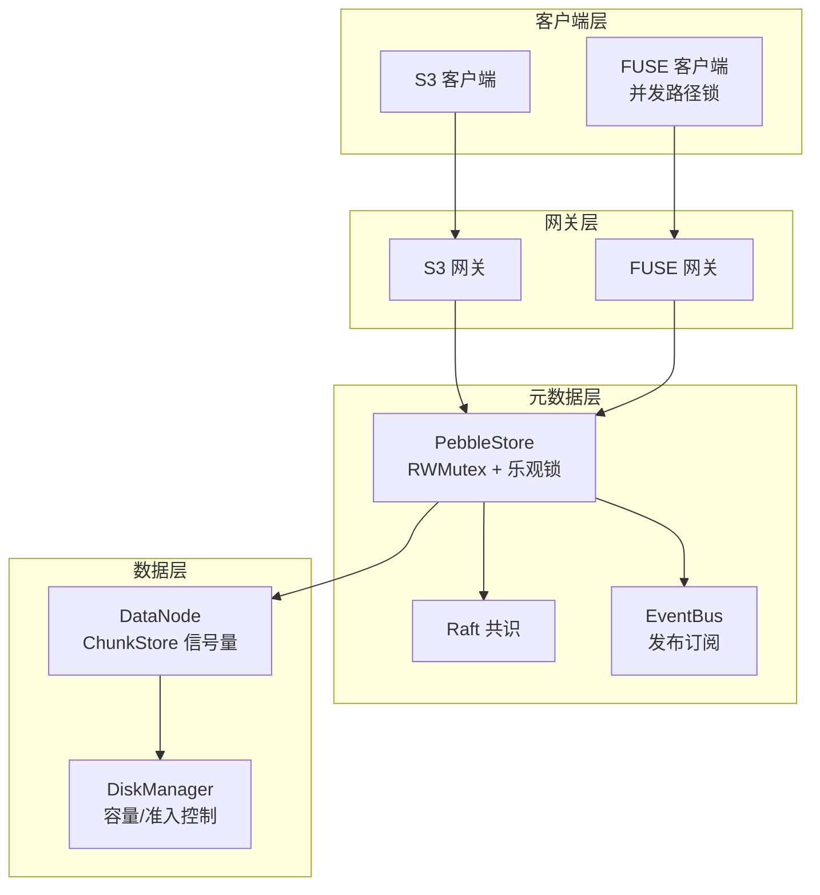
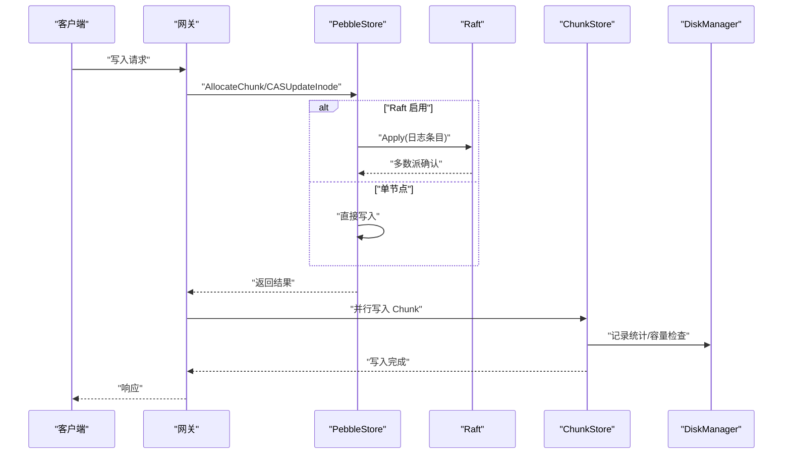
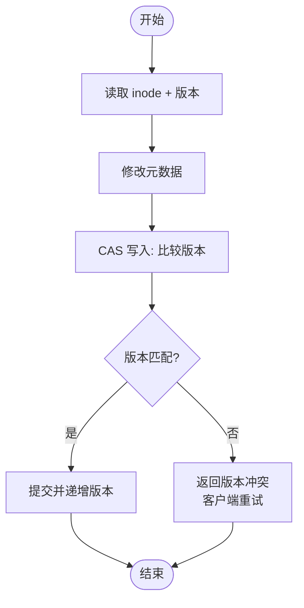
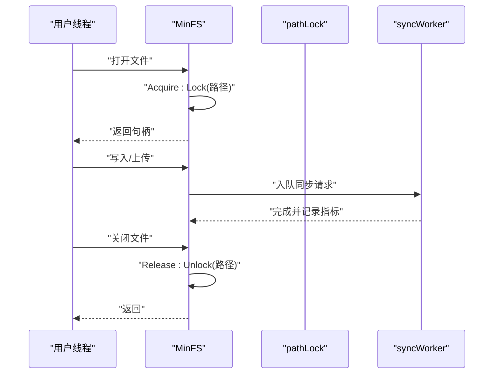
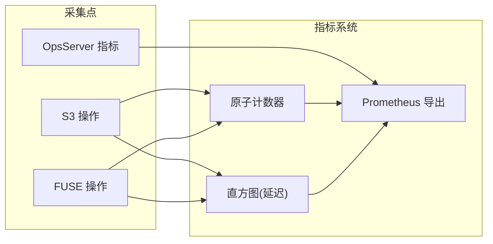
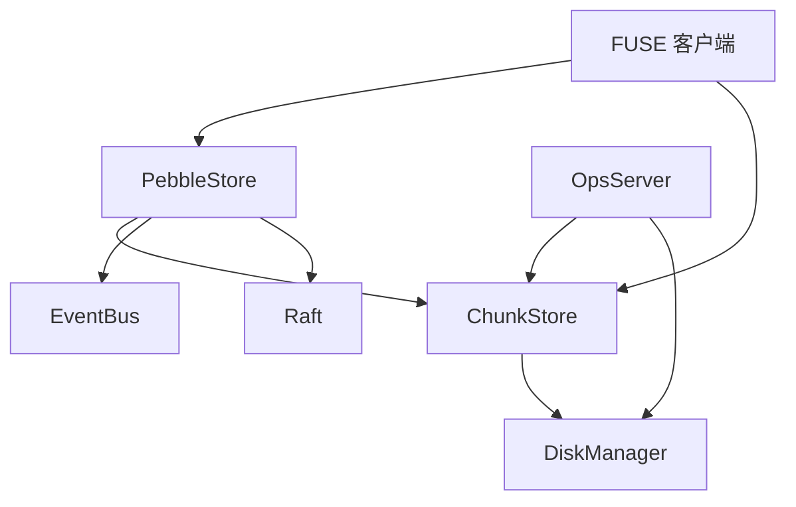

# 并发控制

<cite>
**本文引用的文件**
- [ARCHITECTURE.md](file://nufs-core/ARCHITECTURE.md)
- [service.go](file://nufs-core/metadata/service.go)
- [production.go](file://nufs-core/metadata/production.go)
- [pebble_store.go](file://nufs-core/metadata/pebble_store.go)
- [chunkstore.go](file://nufs-core/datanode/chunkstore.go)
- [diskmanager.go](file://nufs-core/datanode/diskmanager.go)
- [ops.go](file://nufs-core/datanode/ops.go)
- [lock.go](file://nufs-fuse/fs/lock.go)
- [metrics.go](file://nufs-fuse/fs/metrics.go)
- [fs.go](file://nufs-fuse/fs/fs.go)
</cite>

## 目录
1. [引言](#引言)
2. [项目结构](#项目结构)
3. [核心组件](#核心组件)
4. [架构总览](#架构总览)
5. [详细组件分析](#详细组件分析)
6. [依赖分析](#依赖分析)
7. [性能考虑](#性能考虑)
8. [故障排查指南](#故障排查指南)
9. [结论](#结论)
10. [附录](#附录)

## 引言
本文件聚焦 NUFS 分布式文件系统的并发控制机制，系统性阐述多线程并发访问的策略与实现，覆盖锁机制、并发安全保证、资源竞争处理、并发性能优化、死锁预防与性能监控指标，并给出并发场景的最佳实践与调优建议。内容基于仓库中实际代码进行分析，帮助开发者理解各组件间的并发协调与同步策略。

## 项目结构
NUFS 采用分层架构：客户端层（S3/FUSE）、网关层（S3/FUSE 网关）、元数据层（Pebble + Raft）、数据层（DataNode）。并发控制贯穿各层，既有进程内互斥（RWMutex/互斥锁），也有跨进程/跨节点的协调（Raft、乐观锁、信号量）。



**图表来源**
- [ARCHITECTURE.md:37-101](file://nufs-core/ARCHITECTURE.md#L37-L101)
- [service.go:76-93](file://nufs-core/metadata/service.go#L76-L93)
- [production.go:54-124](file://nufs-core/metadata/production.go#L54-L124)
- [pebble_store.go:19-31](file://nufs-core/metadata/pebble_store.go#L19-L31)
- [chunkstore.go:22-31](file://nufs-core/datanode/chunkstore.go#L22-L31)
- [diskmanager.go:24-45](file://nufs-core/datanode/diskmanager.go#L24-L45)

**章节来源**
- [ARCHITECTURE.md:25-101](file://nufs-core/ARCHITECTURE.md#L25-L101)

## 核心组件
- 元数据层（PebbleStore）
  - 进程内互斥：RWMutex 保护内部状态；乐观锁（MVCC）保障并发写入一致性。
  - Raft 集成：写路径通过 Raft 日志达成全局顺序与一致性。
  - 生产子系统：EventBus（发布订阅）、LeaseManager（租约/心跳）、GC/Scrubber（后台任务）。
- 数据层（DataNode）
  - ChunkStore：读写信号量限制并发；RWMutex 保护内存索引；原子计数统计。
  - DiskManager：容量/准入控制；WAL 保障崩溃恢复；Tier 迁移。
  - OpsServer：HTTP 管理接口，聚合运行时指标。
- 客户端层（FUSE）
  - 路径级互斥锁：确保同一路径的并发写入串行化。
  - 指标系统：直方图与计数器，Prometheus 导出。

**章节来源**
- [service.go:16-67](file://nufs-core/metadata/service.go#L16-L67)
- [production.go:127-189](file://nufs-core/metadata/production.go#L127-L189)
- [pebble_store.go:19-31](file://nufs-core/metadata/pebble_store.go#L19-L31)
- [chunkstore.go:22-31](file://nufs-core/datanode/chunkstore.go#L22-L31)
- [diskmanager.go:24-45](file://nufs-core/datanode/diskmanager.go#L24-L45)
- [ops.go:19-71](file://nufs-core/datanode/ops.go#L19-L71)
- [lock.go:24-84](file://nufs-fuse/fs/lock.go#L24-L84)
- [metrics.go:85-137](file://nufs-fuse/fs/metrics.go#L85-L137)

## 架构总览
并发控制在以下维度协同：
- 进程内：互斥锁（RWMutex/互斥锁）与原子变量。
- 跨节点：Raft 保证写入顺序；乐观锁（MVCC）避免冲突写。
- 资源限制：信号量（semaphore）限制并发读写；容量/准入控制防止过载。
- 事件驱动：EventBus 实现松耦合通知，后台任务（GC/Scrubber/Rebalance）异步执行。



**图表来源**
- [ARCHITECTURE.md:349-376](file://nufs-core/ARCHITECTURE.md#L349-L376)
- [pebble_store.go:1097-1131](file://nufs-core/metadata/pebble_store.go#L1097-L1131)
- [chunkstore.go:74-127](file://nufs-core/datanode/chunkstore.go#L74-L127)
- [diskmanager.go:122-139](file://nufs-core/datanode/diskmanager.go#L122-L139)

## 详细组件分析

### 元数据服务与乐观并发控制（MVCC）
- 乐观锁（MVCCVersion）：每次读取 inode 附带版本号，写入时比较版本，冲突则返回版本冲突，由客户端重试。
- 互斥保护：PebbleStore 内部使用 RWMutex 保护关键状态；CASUpdateInode 在持有锁期间完成读取-比较-写入。
- Raft 集成：当启用 Raft 时，写路径通过 Raft 日志提交，保证全局顺序与多数派一致性。



**图表来源**
- [production.go:140-189](file://nufs-core/metadata/production.go#L140-L189)
- [pebble_store.go:19-31](file://nufs-core/metadata/pebble_store.go#L19-L31)

**章节来源**
- [production.go:127-189](file://nufs-core/metadata/production.go#L127-L189)
- [pebble_store.go:1097-1131](file://nufs-core/metadata/pebble_store.go#L1097-L1131)

### 数据节点并发控制（ChunkStore 与 DiskManager）
- 读写信号量：ChunkStore 使用两个通道（信号量）分别限制并发读和并发写，避免磁盘 IO 竞争导致的性能抖动。
- 互斥保护：RWMutex 保护内存索引（chunks 映射）与访问统计；原子变量统计总字节数与块数量。
- 容量与准入：DiskManager 周期刷新磁盘统计，CanAdmitWrite 基于阈值拒绝写入，防止磁盘打满。
- WAL：崩溃恢复阶段识别未提交写入并清理孤儿块，保障一致性。

```mermaid
classDiagram
class ChunkStore {
-string dataDir
-string chunksDir
-RWMutex mu
-map chunks
-AtomicInt64 totalBytes
-AtomicInt64 chunkCount
-chan struct{} writeSem
-chan struct{} readSem
+Write()
+Read()
+Seal()
+Delete()
+Info()
+ListChunks()
+Stats()
}
class DiskManager {
-string dataDir
-ChunkStore store
-int64 capacityGB
-RWMutex mu
-DiskStats stats
-chan struct{} admitCh
-float64 rejectPct
-WriteAheadLog wal
+CanAdmitWrite()
+Stats()
+Start()/Stop()
}
ChunkStore --> DiskManager : "统计/容量"
```

**图表来源**
- [chunkstore.go:22-31](file://nufs-core/datanode/chunkstore.go#L22-L31)
- [diskmanager.go:24-45](file://nufs-core/datanode/diskmanager.go#L24-L45)

**章节来源**
- [chunkstore.go:22-127](file://nufs-core/datanode/chunkstore.go#L22-L127)
- [diskmanager.go:68-139](file://nufs-core/datanode/diskmanager.go#L68-L139)

### FUSE 客户端并发与路径锁
- 路径级互斥：同一路径同时只能有一个写操作，避免竞态；等待超时（默认 5 秒）防止无限阻塞。
- 句柄管理：Acquire/Release 原子维护活动句柄计数；释放时解锁对应路径。
- 并发上传：同步通道 + 多工作线程处理上传/复制/移动等操作，避免阻塞 FUSE 主循环。



**图表来源**
- [lock.go:32-75](file://nufs-fuse/fs/lock.go#L32-L75)
- [fs.go:486-514](file://nufs-fuse/fs/fs.go#L486-L514)
- [fs.go:451-474](file://nufs-fuse/fs/fs.go#L451-L474)

**章节来源**
- [lock.go:24-118](file://nufs-fuse/fs/lock.go#L24-L118)
- [fs.go:486-514](file://nufs-fuse/fs/fs.go#L486-L514)

### 指标与性能监控
- 全局指标：原子计数器跟踪各类操作次数；直方图记录延迟分布（S3/FUSE）。
- Prometheus 导出：/metrics 文本格式，包含直方图桶、计数器、运行时信息。
- 运行时聚合：OpsServer 聚合复制/反熵/磁盘等指标，便于运维观察。



**图表来源**
- [metrics.go:85-137](file://nufs-fuse/fs/metrics.go#L85-L137)
- [metrics.go:205-301](file://nufs-fuse/fs/metrics.go#L205-L301)
- [ops.go:236-298](file://nufs-core/datanode/ops.go#L236-L298)

**章节来源**
- [metrics.go:85-340](file://nufs-fuse/fs/metrics.go#L85-L340)
- [ops.go:115-298](file://nufs-core/datanode/ops.go#L115-L298)

## 依赖分析
- 组件耦合
  - 元数据层（PebbleStore）与数据层（ChunkStore）通过元数据键空间交互；元数据变更通过 EventBus 通知。
  - DataNode 的 OpsServer 作为管理面入口，聚合复制/反熵/磁盘等指标。
  - FUSE 客户端通过路径锁与同步通道降低对后端的并发压力。
- 潜在风险
  - 信号量上限设置不当可能导致排队过长；需结合磁盘 IO 能力与网络带宽调优。
  - Raft 日志风暴可能影响写入延迟，应关注多数派确认耗时与快照策略。
  - 乐观锁冲突率高时需评估客户端重试策略与批处理写入。



**图表来源**
- [service.go:76-93](file://nufs-core/metadata/service.go#L76-L93)
- [production.go:54-124](file://nufs-core/metadata/production.go#L54-L124)
- [pebble_store.go:19-31](file://nufs-core/metadata/pebble_store.go#L19-L31)
- [ops.go:19-71](file://nufs-core/datanode/ops.go#L19-L71)

**章节来源**
- [service.go:76-213](file://nufs-core/metadata/service.go#L76-L213)
- [production.go:54-124](file://nufs-core/metadata/production.go#L54-L124)
- [ops.go:19-94](file://nufs-core/datanode/ops.go#L19-L94)

## 性能考虑
- 读写并发限制
  - ChunkStore 的读/写信号量可调，建议根据磁盘吞吐与 CPU 核数进行压测调优，避免过度排队。
  - DiskManager 的拒绝阈值（默认 90%）可按业务峰值流量调整，防止磁盘饱和引发级联失败。
- 乐观锁与重试
  - 高并发写入场景下，乐观锁冲突率上升，建议客户端批量合并写入、指数退避重试。
- Raft 写入延迟
  - 关注多数派确认耗时与快照频率；必要时提升磁盘性能或减少日志大小。
- 指标与告警
  - 使用 Prometheus 指标监控延迟直方图、错误计数与活跃句柄数，建立阈值告警。

[本节为通用性能建议，不直接分析具体文件]

## 故障排查指南
- 路径锁相关问题
  - 症状：长时间阻塞或超时（默认 5 秒）。
  - 排查：确认是否存在长时间持有锁的写操作；检查客户端是否正确释放句柄。
- ChunkStore 并发瓶颈
  - 症状：写入延迟升高、磁盘 IO 抖动。
  - 排查：检查读/写信号量上限与磁盘性能；适当降低并发或升级硬件。
- Raft 写入卡顿
  - 症状：写入超时或延迟异常。
  - 排查：查看多数派确认耗时、快照与日志清理策略；检查网络分区与节点健康。
- 指标异常
  - 症状：错误计数激增、延迟直方图尾部增长。
  - 排查：结合 Prometheus 指标定位热点操作与失败原因；关注磁盘使用率与复制错误。

**章节来源**
- [lock.go:86-117](file://nufs-fuse/fs/lock.go#L86-L117)
- [chunkstore.go:74-127](file://nufs-core/datanode/chunkstore.go#L74-L127)
- [ops.go:115-133](file://nufs-core/datanode/ops.go#L115-L133)
- [metrics.go:205-301](file://nufs-fuse/fs/metrics.go#L205-L301)

## 结论
NUFS 的并发控制以“进程内互斥 + 乐观锁 + 信号量限制 + 事件驱动 + Raft 协调”为核心，兼顾了高并发与一致性。通过合理的参数调优（信号量、拒绝阈值、重试策略）与完善的监控体系，可在大规模场景下保持稳定与高性能。建议在生产环境持续压测与观测，动态调整并发参数与资源配额。

[本节为总结性内容，不直接分析具体文件]

## 附录
- 最佳实践
  - 客户端侧：批量写入、指数退避重试、合理设置路径锁超时。
  - 元数据侧：Raft 配置与快照策略、乐观锁冲突率监控。
  - 数据侧：磁盘性能与信号量上限匹配、容量阈值与 WAL 策略。
- 性能调优建议
  - 读/写信号量：结合磁盘 IOPS 与 CPU 核数压测确定最优上限。
  - 容量阈值：根据 SLA 调整拒绝阈值，避免磁盘饱和。
  - 指标导出：开启 Prometheus 导出，建立延迟与错误的阈值告警。

[本节为通用建议，不直接分析具体文件]