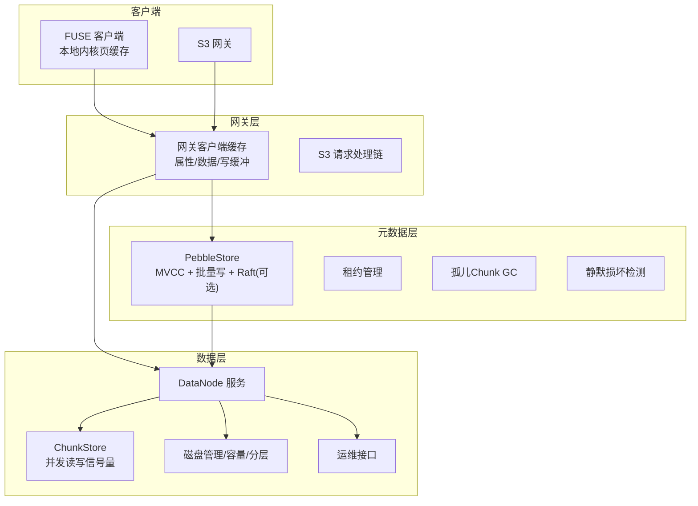
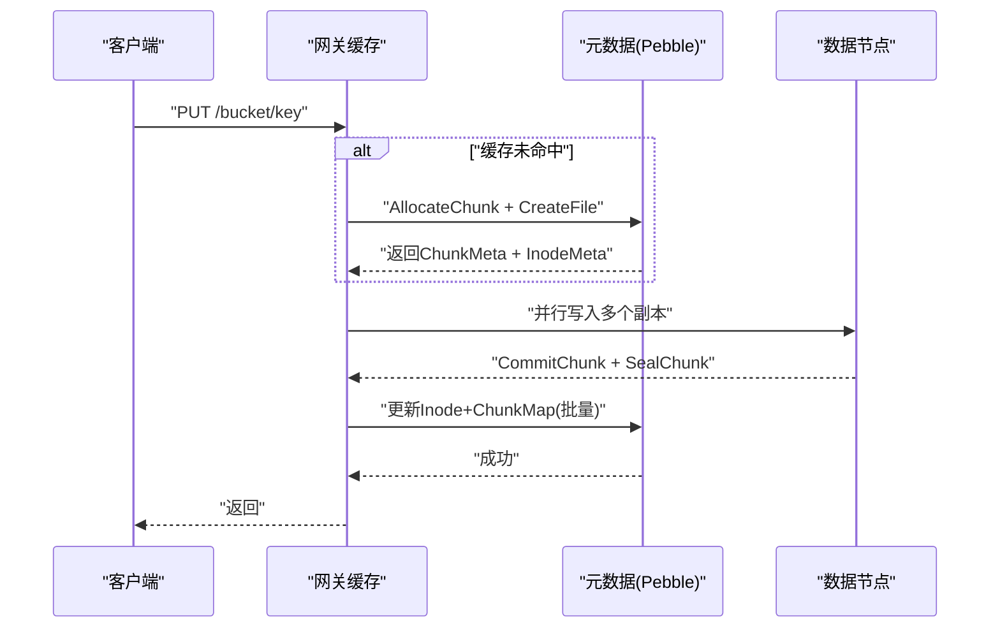
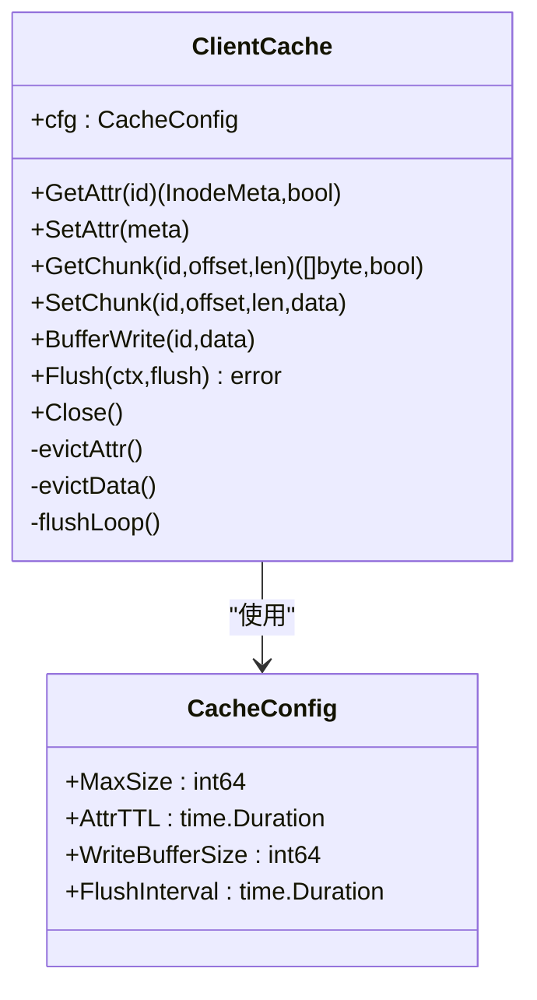
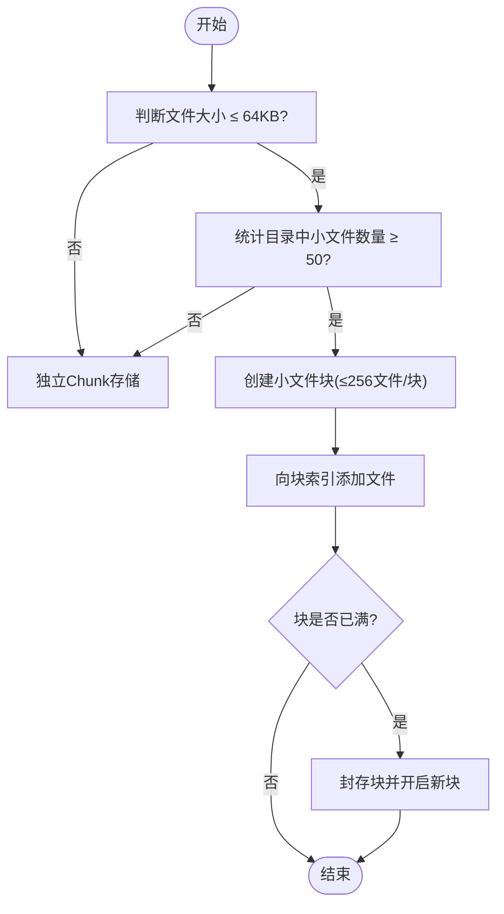
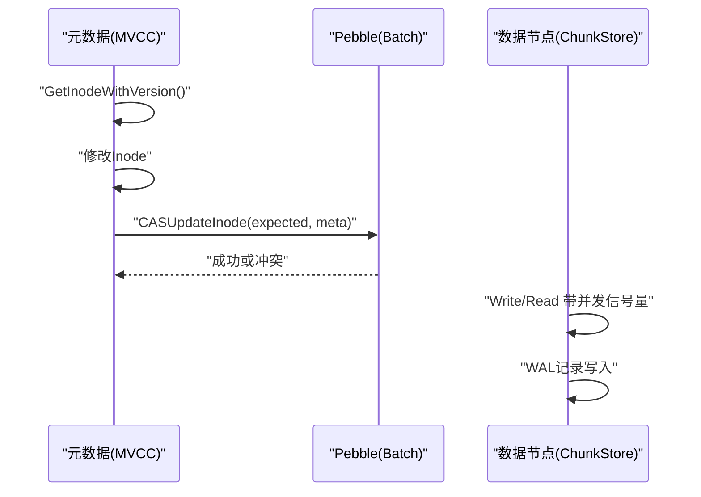
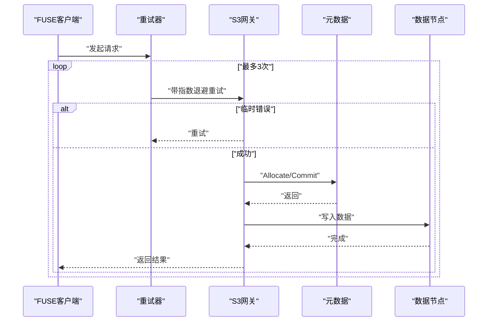
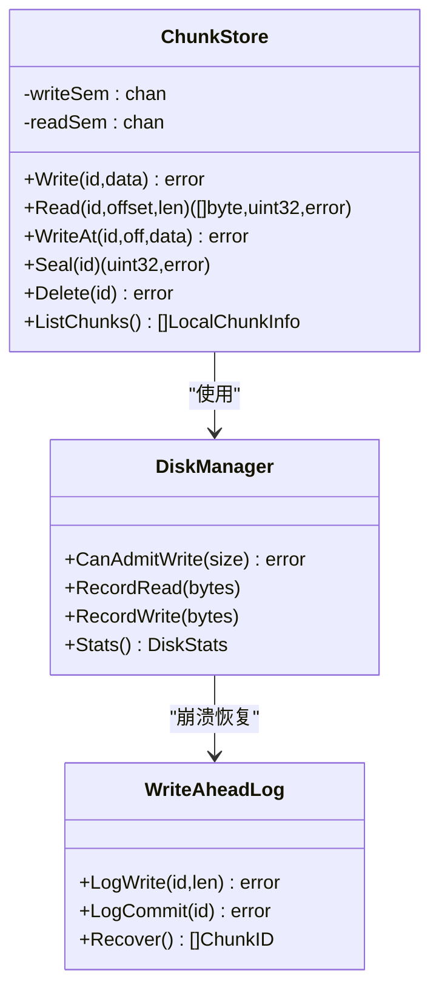
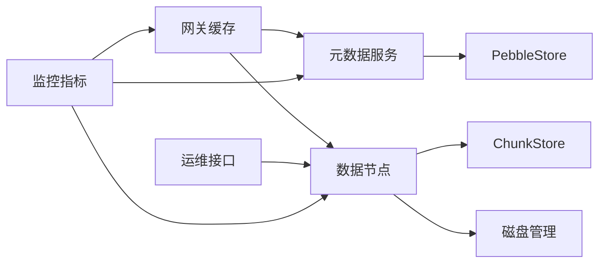

# 性能优化

<cite>
**本文引用的文件**
- [nufs-core/ARCHITECTURE.md](file://nufs-core/ARCHITECTURE.md)
- [nufs-core/metadata/smallfile.go](file://nufs-core/metadata/smallfile.go)
- [nufs-core/gateway/cache.go](file://nufs-core/gateway/cache.go)
- [nufs-core/datanode/chunkstore.go](file://nufs-core/datanode/chunkstore.go)
- [nufs-core/datanode/diskmanager.go](file://nufs-core/datanode/diskmanager.go)
- [nufs-core/datanode/ops.go](file://nufs-core/datanode/ops.go)
- [nufs-core/metadata/pebble_store.go](file://nufs-core/metadata/pebble_store.go)
- [nufs-core/metadata/ec.go](file://nufs-core/metadata/ec.go)
- [nufs-core/metadata/service.go](file://nufs-core/metadata/service.go)
- [nufs-core/gateway/s3/handler.go](file://nufs-core/gateway/s3/handler.go)
- [nufs-fuse/fs/metrics.go](file://nufs-fuse/fs/metrics.go)
- [nufs-fuse/fs/config.go](file://nufs-fuse/fs/config.go)
- [nufs-fuse/fs/retry.go](file://nufs-fuse/fs/retry.go)
</cite>

## 目录
1. [简介](#简介)
2. [项目结构](#项目结构)
3. [核心组件](#核心组件)
4. [架构总览](#架构总览)
5. [详细组件分析](#详细组件分析)
6. [依赖分析](#依赖分析)
7. [性能考虑](#性能考虑)
8. [故障排查指南](#故障排查指南)
9. [结论](#结论)
10. [附录](#附录)

## 简介
本文件面向NUFS分布式文件系统的性能优化，围绕缓存策略设计、小文件优化、并发控制机制、网络优化与存储优化展开，结合代码实现与架构文档，给出原理说明、实现细节、性能指标、瓶颈识别方法、调优案例与最佳实践。目标是帮助开发者与运维人员在不同使用场景下进行有针对性的性能调优。

## 项目结构
NUFS由三层组成：网关层（S3/FUSE）、元数据层（Pebble+Raft）、数据层（DataNode ChunkStore）。整体采用“客户端缓存 + 服务器端缓存 + 存储I/O优化 + 网络传输优化”的多维优化策略，并辅以纠删码、生命周期与跨机房复制等能力。

图表来源
- [nufs-core/ARCHITECTURE.md:37-101](file://nufs-core/ARCHITECTURE.md#L37-L101)
- [nufs-core/gateway/cache.go:29-56](file://nufs-core/gateway/cache.go#L29-L56)
- [nufs-core/metadata/pebble_store.go:16-31](file://nufs-core/metadata/pebble_store.go#L16-L31)
- [nufs-core/datanode/chunkstore.go:18-31](file://nufs-core/datanode/chunkstore.go#L18-L31)
- [nufs-core/datanode/diskmanager.go:22-45](file://nufs-core/datanode/diskmanager.go#L22-L45)

章节来源
- [nufs-core/ARCHITECTURE.md:25-116](file://nufs-core/ARCHITECTURE.md#L25-L116)

## 核心组件
- 客户端缓存（网关侧）：属性缓存（TTL 5s）、数据缓存（TTL 50s）、写缓冲（异步刷写），降低元数据与数据往返开销。
- 元数据服务（PebbleStore）：LSM树KV存储，批量写保证原子性；可选Raft共识；MVCC乐观并发控制；租约、GC、静默检测等生产子系统。
- 数据节点（ChunkStore）：本地磁盘块存储，二进制头+数据体+校验；并发读写信号量；WAL保障崩溃恢复；磁盘容量与分层管理。
- 小文件优化：小文件块合并（≤64KB），减少元数据与磁盘碎片。
- 网络与S3兼容：S3网关中间件链、请求路由、重试与指数退避、断路器状态上报。
- 性能监控：FUSE侧直方图计数器与Prometheus导出，支持延迟直方图与运行时指标。

章节来源
- [nufs-core/gateway/cache.go:17-96](file://nufs-core/gateway/cache.go#L17-L96)
- [nufs-core/metadata/pebble_store.go:16-89](file://nufs-core/metadata/pebble_store.go#L16-L89)
- [nufs-core/datanode/chunkstore.go:18-59](file://nufs-core/datanode/chunkstore.go#L18-L59)
- [nufs-core/metadata/smallfile.go:9-79](file://nufs-core/metadata/smallfile.go#L9-L79)
- [nufs-fuse/fs/metrics.go:28-137](file://nufs-fuse/fs/metrics.go#L28-L137)
- [nufs-core/gateway/s3/handler.go:11-54](file://nufs-core/gateway/s3/handler.go#L11-L54)

## 架构总览
NUFS的性能目标与实现要点：
- 元数据层：Lookup/ReadDir/CreateFile等延迟目标明确，Pebble+批量写+MVCC冲突率低。
- 数据层：顺序写/读吞吐高，随机读延迟低，复制吞吐与并发度可控。
- 网关层：S3 PUT/GET延迟目标明确，FUSE缓存命中极低延迟。

图表来源
- [nufs-core/ARCHITECTURE.md:349-383](file://nufs-core/ARCHITECTURE.md#L349-L383)
- [nufs-core/metadata/pebble_store.go:781-832](file://nufs-core/metadata/pebble_store.go#L781-L832)
- [nufs-core/datanode/chunkstore.go:74-127](file://nufs-core/datanode/chunkstore.go#L74-L127)

章节来源
- [nufs-core/ARCHITECTURE.md:917-949](file://nufs-core/ARCHITECTURE.md#L917-L949)

## 详细组件分析

### 客户端缓存策略（网关侧）
- 设计要点
  - 属性缓存：TTL 5s，ls/stat直接返回，显著降低元数据查询开销。
  - 数据缓存：TTL 50s，热数据本地读取，减少重复网络往返。
  - 写缓冲：最大500MB，定时（10s）或阈值触发刷写，异步写回后端。
  - 淘汰策略：LRU；属性缓存达上限10%时淘汰最旧条目。
- 实现位置
  - 缓存配置、结构体、读写与淘汰逻辑、后台flush循环。
- 性能收益
  - 热数据读延迟从5-10ms降至<100μs；写延迟从5-10ms降至~1ms（异步）。

图表来源
- [nufs-core/gateway/cache.go:17-96](file://nufs-core/gateway/cache.go#L17-L96)
- [nufs-core/gateway/cache.go:29-56](file://nufs-core/gateway/cache.go#L29-L56)

章节来源
- [nufs-core/ARCHITECTURE.md:641-684](file://nufs-core/ARCHITECTURE.md#L641-L684)
- [nufs-core/gateway/cache.go:17-325](file://nufs-core/gateway/cache.go#L17-L325)

### 小文件优化
- 痛点
  - 每个小文件产生1个inode+1-3个chunk，导致元数据爆炸与磁盘空间浪费。
- 方案
  - 小于等于64KB的文件合并到1MB的小文件块（最多256个小文件/块）。
  - 目录内≥50个小文件时创建块；块满后封存并写新块。
  - 块内索引记录文件偏移、长度与CRC，读取时快速定位。
- 效果
  - 元数据减少80%，磁盘利用率从25%提升至90%。

图表来源
- [nufs-core/metadata/smallfile.go:71-79](file://nufs-core/metadata/smallfile.go#L71-L79)

章节来源
- [nufs-core/ARCHITECTURE.md:588-638](file://nufs-core/ARCHITECTURE.md#L588-L638)
- [nufs-core/metadata/smallfile.go:9-89](file://nufs-core/metadata/smallfile.go#L9-L89)

### 并发控制机制
- 元数据并发
  - MVCC乐观锁：读取inode+version，修改后CAS更新，冲突重试。
  - 批量写：Pebble Batch原子更新Inode+ChunkMap，降低写放大。
- 数据节点并发
  - ChunkStore对读写分别设置信号量，限制并发度（写64、读256）。
  - WAL保障崩溃恢复，避免脏写。
- 网关层并发
  - S3网关中间件链（恢复/请求ID/CORS/日志/鉴权）串行处理，保持低开销。
  - FUSE客户端侧重试与指数退避，避免瞬时抖动放大。

图表来源
- [nufs-core/ARCHITECTURE.md:202-212](file://nufs-core/ARCHITECTURE.md#L202-L212)
- [nufs-core/metadata/pebble_store.go:828-832](file://nufs-core/metadata/pebble_store.go#L828-L832)
- [nufs-core/datanode/chunkstore.go:29-50](file://nufs-core/datanode/chunkstore.go#L29-L50)

章节来源
- [nufs-core/ARCHITECTURE.md:156-174](file://nufs-core/ARCHITECTURE.md#L156-L174)
- [nufs-core/metadata/pebble_store.go:16-89](file://nufs-core/metadata/pebble_store.go#L16-L89)
- [nufs-core/datanode/chunkstore.go:18-59](file://nufs-core/datanode/chunkstore.go#L18-L59)

### 网络优化
- S3网关
  - 中间件链：Recovery → RequestID → CORS → Logging → Auth(V4) → Handler。
  - 路由清晰，支持批量删除、分片上传等S3特性。
- 重试与断路器
  - FUSE侧指数退避+抖动，最多3次重试；错误计数与重试计数指标。
  - 断路器状态上报，便于外部观察。
- 连接与传输
  - 网关层与数据节点之间采用二进制协议（带长度前缀），减少解析开销。

图表来源
- [nufs-fuse/fs/retry.go:37-65](file://nufs-fuse/fs/retry.go#L37-L65)
- [nufs-core/gateway/s3/handler.go:46-54](file://nufs-core/gateway/s3/handler.go#L46-L54)

章节来源
- [nufs-core/gateway/s3/handler.go:11-184](file://nufs-core/gateway/s3/handler.go#L11-L184)
- [nufs-fuse/fs/retry.go:1-105](file://nufs-fuse/fs/retry.go#L1-L105)

### 存储优化
- ChunkStore
  - 二进制头+数据体+校验，支持WriteAt偏移写（复制/修复场景）。
  - 读写并发信号量，避免资源争用。
  - 写入后立即更新内存索引与元数据边车，便于快速查询。
- 磁盘管理与分层
  - 容量上限与拒绝阈值（90%），防止写放大与不可用。
  - I/O计数器（读写IOPS/字节）与最后更新时间，便于监控。
  - Tier分层（Hot/Warm/Cold/Archive）与迁移计划，按年龄迁移。
- 纠删码（演示）
  - 简单XOR型纠删码示例，展示K+M分片与重建流程，生产可用时替换为成熟库。

图表来源
- [nufs-core/datanode/chunkstore.go:18-59](file://nufs-core/datanode/chunkstore.go#L18-L59)
- [nufs-core/datanode/diskmanager.go:22-88](file://nufs-core/datanode/diskmanager.go#L22-L88)
- [nufs-core/datanode/diskmanager.go:190-256](file://nufs-core/datanode/diskmanager.go#L190-L256)

章节来源
- [nufs-core/datanode/chunkstore.go:73-296](file://nufs-core/datanode/chunkstore.go#L73-L296)
- [nufs-core/datanode/diskmanager.go:68-184](file://nufs-core/datanode/diskmanager.go#L68-L184)
- [nufs-core/metadata/ec.go:13-82](file://nufs-core/metadata/ec.go#L13-L82)

## 依赖分析
- 组件耦合
  - 网关缓存依赖元数据服务与数据节点；元数据服务依赖Pebble与可选Raft；数据节点依赖ChunkStore与磁盘管理。
- 关键依赖链
  - 写入：S3网关 → AllocateChunk/CommitChunk → 多副本写 → 批量更新Inode+ChunkMap。
  - 读取：S3网关 → 缓存命中？ → 元数据查询 → 副本选择 → 数据读取 → 写入缓存。
- 外部集成
  - Prometheus指标导出；FUSE侧直方图与运行时指标；运维HTTP接口（OpsServer）。

图表来源
- [nufs-core/gateway/cache.go:29-56](file://nufs-core/gateway/cache.go#L29-L56)
- [nufs-core/metadata/pebble_store.go:16-31](file://nufs-core/metadata/pebble_store.go#L16-L31)
- [nufs-core/datanode/chunkstore.go:18-31](file://nufs-core/datanode/chunkstore.go#L18-L31)
- [nufs-core/datanode/diskmanager.go:22-45](file://nufs-core/datanode/diskmanager.go#L22-L45)
- [nufs-fuse/fs/metrics.go:203-301](file://nufs-fuse/fs/metrics.go#L203-L301)

章节来源
- [nufs-core/metadata/service.go:76-114](file://nufs-core/metadata/service.go#L76-L114)
- [nufs-core/datanode/ops.go:19-71](file://nufs-core/datanode/ops.go#L19-L71)

## 性能考虑
- 缓存策略
  - 客户端缓存：合理设置MaxSize/AttrTTL/WriteBufferSize/FlushInterval，结合业务热点特征调整。
  - 热点数据：优先提升Data Cache TTL与Attr Cache命中率。
- 小文件优化
  - 对大量小文件目录启用块合并；监控块封存与索引大小，避免过度碎片。
- 并发与吞吐
  - 数据节点并发：根据磁盘IOPS与CPU核数调整读写信号量上限。
  - 元数据批量写：尽量合并操作，减少Raft日志压力。
- 网络与传输
  - S3网关中间件链保持简洁；对长连接与压缩进行评估；重试参数与断路器状态需结合SLA。
- 存储与I/O
  - 磁盘容量与分层：设定合理拒绝阈值，定期迁移冷数据；监控I/O计数器与使用率。
  - 纠删码：生产环境使用成熟库，关注编码/解码开销与重建时延。

## 故障排查指南
- 性能指标
  - FUSE侧：直方图（S3 Get/Put/List、FUSE Read/Write）、活跃句柄数、错误与重试计数。
  - 运维接口：集群状态、节点健康、复制统计、反熵扫描与修复统计。
- 常见问题
  - 读延迟升高：检查客户端缓存命中率、Attr/Data TTL是否过短；查看元数据层MVCC冲突率。
  - 写延迟升高：检查ChunkStore并发信号量、磁盘容量与分层迁移；确认WAL恢复是否异常。
  - 网络抖动：观察S3重试次数与断路器状态；评估中间件链耗时。
- 调优步骤
  - 采集Prometheus指标与/healthz探针；定位瓶颈（元数据/网络/磁盘）。
  - 调整缓存参数、并发上限、分层迁移策略与重试退避。
  - 验证后滚动发布并持续监控。

章节来源
- [nufs-fuse/fs/metrics.go:83-137](file://nufs-fuse/fs/metrics.go#L83-L137)
- [nufs-fuse/fs/metrics.go:203-301](file://nufs-fuse/fs/metrics.go#L203-L301)
- [nufs-core/datanode/ops.go:96-133](file://nufs-core/datanode/ops.go#L96-L133)
- [nufs-fuse/fs/retry.go:37-65](file://nufs-fuse/fs/retry.go#L37-L65)

## 结论
NUFS通过“客户端缓存 + 小文件块合并 + 并发信号量 + 批量写 + 磁盘分层 + 纠删码 + 监控指标”的组合拳，在元数据、数据与网络层面实现了高效与稳定。针对不同场景（高并发小文件、大文件顺序写、跨机房容灾），应分别优化缓存参数、小文件策略、并发上限与分层迁移节奏，并以监控指标为依据持续迭代。

## 附录
- 性能目标（摘自架构文档）
  - 元数据层：Lookup/ReadDir/CreateFile延迟目标；亿级元数据启动时间目标。
  - 数据层：顺序写/读吞吐、随机读延迟、复制吞吐与并发度目标。
  - 网关层：S3 PUT/GET延迟、FUSE缓存命中延迟、QPS目标。
- 配置参考
  - FUSE客户端缓存配额与扫描TTL、只读挂载、指标监听地址等。
  - 网关缓存大小、属性TTL、写缓冲与刷新间隔。

章节来源
- [nufs-core/ARCHITECTURE.md:917-949](file://nufs-core/ARCHITECTURE.md#L917-L949)
- [nufs-fuse/fs/config.go:34-67](file://nufs-fuse/fs/config.go#L34-L67)
- [nufs-fuse/fs/config.go:197-218](file://nufs-fuse/fs/config.go#L197-L218)