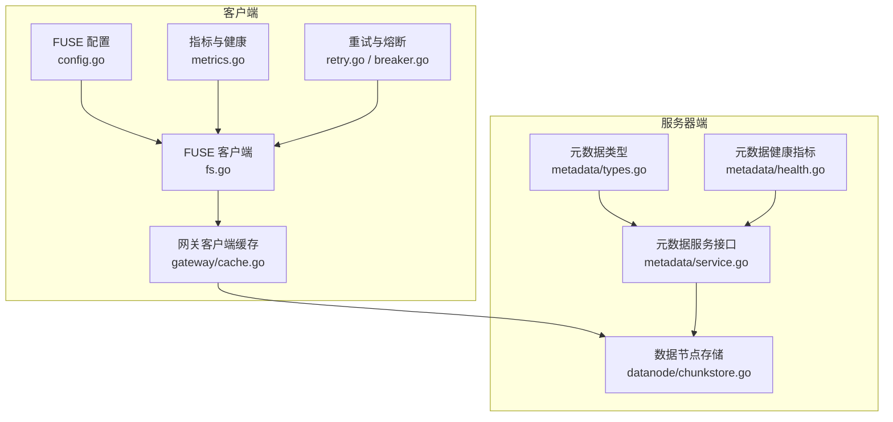
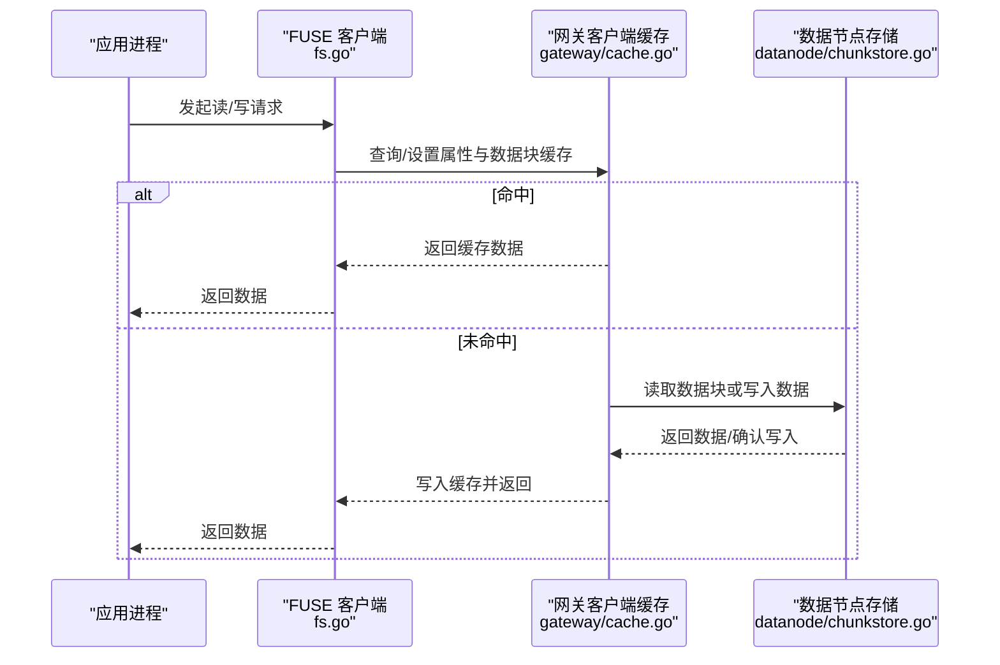
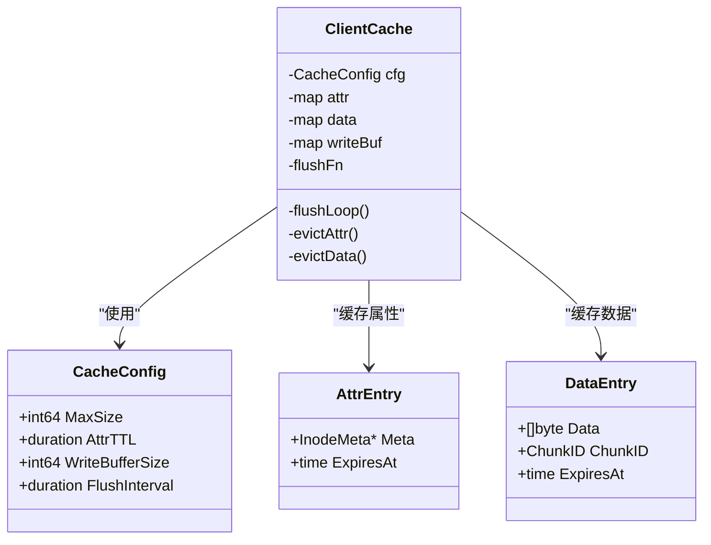
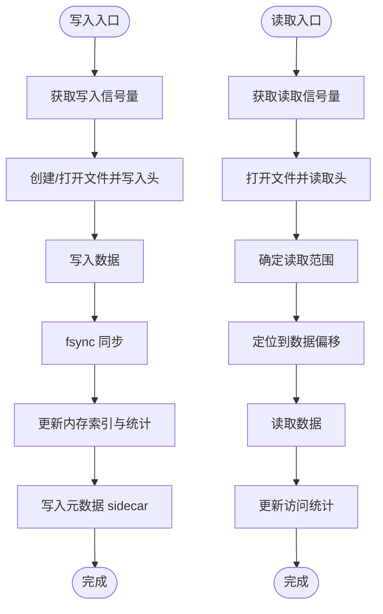
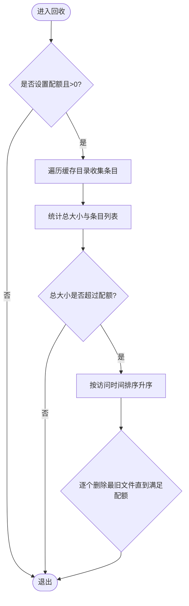
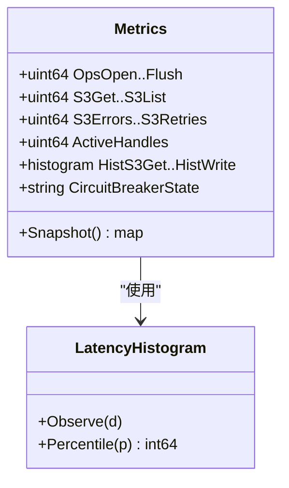
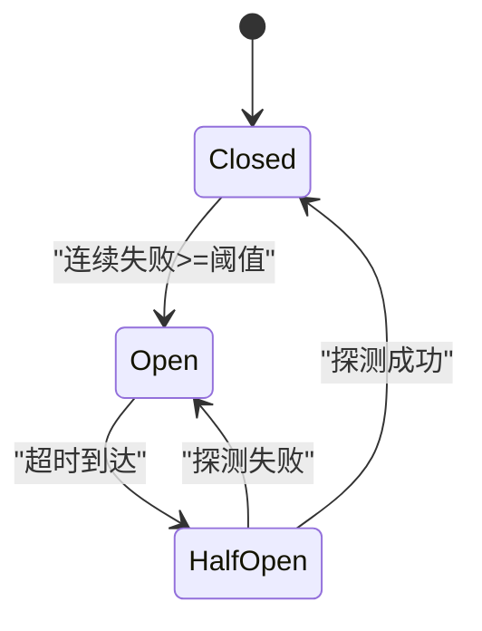
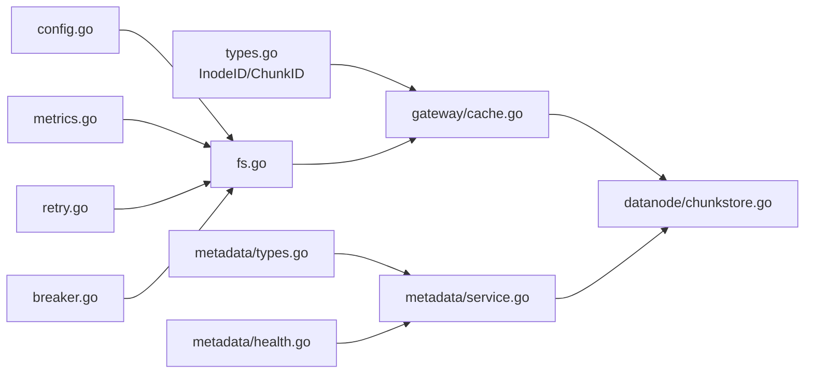

# 缓存策略

<cite>
**本文引用的文件**
- [nufs-core/gateway/cache.go](file://nufs-core/gateway/cache.go)
- [nufs-core/datanode/chunkstore.go](file://nufs-core/datanode/chunkstore.go)
- [nufs-fuse/fs/config.go](file://nufs-fuse/fs/config.go)
- [nufs-fuse/fs/fs.go](file://nufs-fuse/fs/fs.go)
- [nufs-fuse/fs/metrics.go](file://nufs-fuse/fs/metrics.go)
- [nufs-fuse/fs/breaker.go](file://nufs-fuse/fs/breaker.go)
- [nufs-fuse/fs/retry.go](file://nufs-fuse/fs/retry.go)
- [nufs-core/metadata/types.go](file://nufs-core/metadata/types.go)
- [nufs-core/metadata/service.go](file://nufs-core/metadata/service.go)
- [nufs-core/metadata/health.go](file://nufs-core/metadata/health.go)
</cite>

## 目录
1. [简介](#简介)
2. [项目结构](#项目结构)
3. [核心组件](#核心组件)
4. [架构总览](#架构总览)
5. [详细组件分析](#详细组件分析)
6. [依赖关系分析](#依赖关系分析)
7. [性能考量](#性能考量)
8. [故障排除指南](#故障排除指南)
9. [结论](#结论)
10. [附录](#附录)

## 简介
本文件系统性阐述 NUFS 分布式文件系统的缓存策略，覆盖客户端缓存与服务器端缓存的设计原理、实现机制与运行时行为，并给出缓存命中率优化、失效策略、一致性保障、配置参数、大小限制、淘汰算法、性能监控指标与评估方法，以及不同场景下的策略选择与调优建议。目标是帮助开发者在不同部署形态（FUSE 客户端、S3 网关）下正确配置与使用缓存，获得稳定且高性能的访问体验。

## 项目结构
本仓库中与缓存相关的关键模块分布如下：
- 客户端侧缓存（FUSE/S3 网关）：nufs-core/gateway/cache.go
- 服务器端数据块存储（datanode）：nufs-core/datanode/chunkstore.go
- FUSE 客户端本地磁盘缓存与配额：nufs-fuse/fs/fs.go、nufs-fuse/fs/config.go
- 运行时指标与可观测性：nufs-fuse/fs/metrics.go、nufs-core/metadata/health.go
- 网络重试与熔断：nufs-fuse/fs/retry.go、nufs-fuse/fs/breaker.go
- 元数据类型与服务接口：nufs-core/metadata/types.go、nufs-core/metadata/service.go

**图表来源**
- [nufs-core/gateway/cache.go:1-325](file://nufs-core/gateway/cache.go#L1-L325)
- [nufs-core/datanode/chunkstore.go:1-395](file://nufs-core/datanode/chunkstore.go#L1-L395)
- [nufs-fuse/fs/fs.go:1-729](file://nufs-fuse/fs/fs.go#L1-L729)
- [nufs-fuse/fs/config.go:1-345](file://nufs-fuse/fs/config.go#L1-L345)
- [nufs-fuse/fs/metrics.go:1-340](file://nufs-fuse/fs/metrics.go#L1-L340)
- [nufs-fuse/fs/retry.go:1-105](file://nufs-fuse/fs/retry.go#L1-L105)
- [nufs-fuse/fs/breaker.go:1-132](file://nufs-fuse/fs/breaker.go#L1-L132)
- [nufs-core/metadata/service.go:1-273](file://nufs-core/metadata/service.go#L1-L273)
- [nufs-core/metadata/types.go:1-209](file://nufs-core/metadata/types.go#L1-L209)
- [nufs-core/metadata/health.go:1-188](file://nufs-core/metadata/health.go#L1-L188)

**章节来源**
- [nufs-core/gateway/cache.go:1-325](file://nufs-core/gateway/cache.go#L1-L325)
- [nufs-core/datanode/chunkstore.go:1-395](file://nufs-core/datanode/chunkstore.go#L1-L395)
- [nufs-fuse/fs/fs.go:1-729](file://nufs-fuse/fs/fs.go#L1-L729)
- [nufs-fuse/fs/config.go:1-345](file://nufs-fuse/fs/config.go#L1-L345)
- [nufs-fuse/fs/metrics.go:1-340](file://nufs-fuse/fs/metrics.go#L1-L340)
- [nufs-fuse/fs/retry.go:1-105](file://nufs-fuse/fs/retry.go#L1-L105)
- [nufs-fuse/fs/breaker.go:1-132](file://nufs-fuse/fs/breaker.go#L1-L132)
- [nufs-core/metadata/service.go:1-273](file://nufs-core/metadata/service.go#L1-L273)
- [nufs-core/metadata/types.go:1-209](file://nufs-core/metadata/types.go#L1-L209)
- [nufs-core/metadata/health.go:1-188](file://nufs-core/metadata/health.go#L1-L188)

## 核心组件
- 客户端缓存（网关侧）
  - 提供 inode 属性缓存与数据块缓存，支持写缓冲异步回写，后台定时刷新。
  - 关键字段：最大缓存大小、属性 TTL、写缓冲大小、刷新间隔。
  - 关键能力：按 LRU 淘汰、TTL 过期、写缓冲聚合与异步刷盘。
- 服务器端数据块存储（datanode）
  - 基于分片目录的本地磁盘存储，支持并发读写信号量、CRC 校验、封顶（Seal）更新头信息。
  - 关键字段：分片目录、内存索引、字节计数、块计数、读写信号量。
  - 关键能力：随机偏移写、范围读取、访问统计更新。
- FUSE 客户端本地缓存与配额
  - 使用本地目录作为缓存空间，支持缓存配额（quota），基于 LRU 的回收策略。
  - 关键字段：缓存目录、扫描 TTL、缓存配额、访问时间跟踪。
  - 关键能力：缓存配额强制回收、访问时间记录、崩溃恢复待上传队列。
- 指标与健康
  - 提供 FUSE/S3 操作计数、延迟直方图、错误与重试计数、熔断器状态等。
  - 提供元数据服务的延迟直方图与关键指标快照。
- 网络可靠性
  - 重试与熔断：指数退避+抖动、可重试错误识别；熔断器三态机，快速失败与探测恢复。

**章节来源**
- [nufs-core/gateway/cache.go:17-96](file://nufs-core/gateway/cache.go#L17-L96)
- [nufs-core/datanode/chunkstore.go:18-59](file://nufs-core/datanode/chunkstore.go#L18-L59)
- [nufs-fuse/fs/fs.go:62-95](file://nufs-fuse/fs/fs.go#L62-L95)
- [nufs-fuse/fs/config.go:34-67](file://nufs-fuse/fs/config.go#L34-L67)
- [nufs-fuse/fs/metrics.go:85-137](file://nufs-fuse/fs/metrics.go#L85-L137)
- [nufs-core/metadata/health.go:16-51](file://nufs-core/metadata/health.go#L16-L51)
- [nufs-fuse/fs/retry.go:26-65](file://nufs-fuse/fs/retry.go#L26-L65)
- [nufs-fuse/fs/breaker.go:25-50](file://nufs-fuse/fs/breaker.go#L25-L50)

## 架构总览
下图展示客户端缓存与服务器端存储之间的交互路径，以及 FUSE 客户端本地缓存与指标系统的关系。

**图表来源**
- [nufs-core/gateway/cache.go:103-172](file://nufs-core/gateway/cache.go#L103-L172)
- [nufs-core/datanode/chunkstore.go:169-227](file://nufs-core/datanode/chunkstore.go#L169-L227)
- [nufs-fuse/fs/fs.go:1-729](file://nufs-fuse/fs/fs.go#L1-L729)

## 详细组件分析

### 客户端缓存（网关侧）
- 设计要点
  - 双层缓存：属性缓存（inode 属性）与数据缓存（chunk 数据块）。
  - 写缓冲：聚合小写入，降低后端压力；支持定时刷新与阈值触发刷新。
  - 失效策略：TTL 过期、容量超限触发 LRU 淘汰。
  - 并发安全：读写锁保护各自缓存表，后台刷新循环独立于业务锁。
- 关键配置
  - 最大缓存大小：控制属性与数据缓存总体占用。
  - 属性 TTL：控制 inode 属性缓存有效期。
  - 写缓冲大小：触发批量刷新的阈值。
  - 刷新间隔：定时刷新周期。
- 实现细节
  - 属性缓存：按 inode ID 查找，过期检查；设置时按近似固定大小估算占用。
  - 数据缓存：以 chunkID+offset+length 组合生成键；设置时使用更长的 TTL。
  - 写缓冲：累计写入字节数，超过阈值立即刷新；否则由定时器驱动。
  - 后台刷新：ticker 触发，快照当前脏缓冲，释放锁后逐个 flush，失败则重新入缓冲。
  - 淘汰：按 LRU 队列头部逐出，属性与数据分别维护队列与大小。

**图表来源**
- [nufs-core/gateway/cache.go:17-96](file://nufs-core/gateway/cache.go#L17-L96)
- [nufs-core/gateway/cache.go:58-69](file://nufs-core/gateway/cache.go#L58-L69)

**章节来源**
- [nufs-core/gateway/cache.go:17-96](file://nufs-core/gateway/cache.go#L17-L96)
- [nufs-core/gateway/cache.go:103-172](file://nufs-core/gateway/cache.go#L103-L172)
- [nufs-core/gateway/cache.go:225-260](file://nufs-core/gateway/cache.go#L225-L260)
- [nufs-core/gateway/cache.go:262-282](file://nufs-core/gateway/cache.go#L262-L282)
- [nufs-core/gateway/cache.go:318-324](file://nufs-core/gateway/cache.go#L318-L324)

### 服务器端数据块存储（datanode）
- 设计要点
  - 分片目录组织：按 chunkID 对分片数取模决定目录，降低单目录文件数量。
  - 文件头格式：包含魔数、chunkID、长度、CRC32 校验等，便于校验与定位。
  - 并发控制：读写信号量限制并发，避免磁盘竞争。
  - 访问统计：读取后更新最近访问时间与访问次数，用于后续淘汰策略。
- 关键流程
  - 写入：生成带校验的头，写入数据并 fsync；更新内存索引与统计。
  - 读取：按偏移范围读取，支持全量或部分读；更新访问统计。
  - 封顶：计算全量数据 CRC 并回填到头，标记为已封顶。
  - 删除：删除文件与元数据 sidecar，更新统计。
- 淘汰依据
  - 当前实现通过访问统计字段记录最近访问时间与访问次数，可用于上层策略决策（例如元数据层的 GC/回收）。

**图表来源**
- [nufs-core/datanode/chunkstore.go:73-127](file://nufs-core/datanode/chunkstore.go#L73-L127)
- [nufs-core/datanode/chunkstore.go:169-227](file://nufs-core/datanode/chunkstore.go#L169-L227)
- [nufs-core/datanode/chunkstore.go:229-275](file://nufs-core/datanode/chunkstore.go#L229-L275)
- [nufs-core/datanode/chunkstore.go:277-296](file://nufs-core/datanode/chunkstore.go#L277-L296)

**章节来源**
- [nufs-core/datanode/chunkstore.go:18-59](file://nufs-core/datanode/chunkstore.go#L18-L59)
- [nufs-core/datanode/chunkstore.go:73-127](file://nufs-core/datanode/chunkstore.go#L73-L127)
- [nufs-core/datanode/chunkstore.go:169-227](file://nufs-core/datanode/chunkstore.go#L169-L227)
- [nufs-core/datanode/chunkstore.go:229-275](file://nufs-core/datanode/chunkstore.go#L229-L275)
- [nufs-core/datanode/chunkstore.go:277-296](file://nufs-core/datanode/chunkstore.go#L277-L296)
- [nufs-core/datanode/chunkstore.go:325-351](file://nufs-core/datanode/chunkstore.go#L325-L351)

### FUSE 客户端本地缓存与配额
- 设计要点
  - 本地目录作为缓存根，每个实例隔离缓存目录，避免冲突。
  - 支持缓存配额（quota），超出时按 LRU 回收。
  - 访问时间跟踪：内部维护缓存文件的最近访问时间，用于排序回收。
  - 待上传队列：崩溃恢复时重放未完成的上传任务。
- 关键配置
  - 缓存目录：本地缓存根路径。
  - 缓存配额：字节上限，0 表示无限制。
  - 扫描 TTL：目录扫描结果缓存的有效期。
- 回收策略
  - 遍历缓存目录，统计总大小；若超过配额，则按访问时间升序删除最旧文件，直至满足配额。

**图表来源**
- [nufs-fuse/fs/fs.go:523-589](file://nufs-fuse/fs/fs.go#L523-L589)
- [nufs-fuse/fs/config.go:34-67](file://nufs-fuse/fs/config.go#L34-L67)

**章节来源**
- [nufs-fuse/fs/fs.go:62-95](file://nufs-fuse/fs/fs.go#L62-L95)
- [nufs-fuse/fs/fs.go:523-589](file://nufs-fuse/fs/fs.go#L523-L589)
- [nufs-fuse/fs/config.go:34-67](file://nufs-fuse/fs/config.go#L34-L67)

### 指标与健康
- FUSE/S3 指标
  - 操作计数：open/read/write/release/lookup/readdir/mkdir/remove/rename/create/flush。
  - S3 操作计数：get/put/copy/remove/list，以及错误与重试计数。
  - 延迟直方图：S3 Get/Put/List 与 FUSE Read/Write 的延迟分布。
  - 熔断器状态：closed/open/half-open。
- 元数据健康指标
  - 操作总数、读写计数、错误总数、读写延迟直方图（微秒级）、键/块/节点/桶统计、Raft 状态与快照计数。

**图表来源**
- [nufs-fuse/fs/metrics.go:85-137](file://nufs-fuse/fs/metrics.go#L85-L137)
- [nufs-fuse/fs/metrics.go:139-171](file://nufs-fuse/fs/metrics.go#L139-L171)
- [nufs-core/metadata/health.go:16-51](file://nufs-core/metadata/health.go#L16-L51)
- [nufs-core/metadata/health.go:122-171](file://nufs-core/metadata/health.go#L122-L171)

**章节来源**
- [nufs-fuse/fs/metrics.go:85-137](file://nufs-fuse/fs/metrics.go#L85-L137)
- [nufs-fuse/fs/metrics.go:172-201](file://nufs-fuse/fs/metrics.go#L172-L201)
- [nufs-fuse/fs/metrics.go:216-301](file://nufs-fuse/fs/metrics.go#L216-L301)
- [nufs-core/metadata/health.go:16-51](file://nufs-core/metadata/health.go#L16-L51)
- [nufs-core/metadata/health.go:67-116](file://nufs-core/metadata/health.go#L67-L116)
- [nufs-core/metadata/health.go:122-171](file://nufs-core/metadata/health.go#L122-L171)

### 网络重试与熔断
- 重试策略
  - 最多重试次数、基础退避时间、最大退避时间、抖动（±25%）。
  - 可重试错误：网络错误、连接被拒绝/管道破裂、HTTP 429/5xx。
- 熔断策略
  - 三态机：closed（正常）、open（快速失败）、half-open（探测）。
  - 连续失败达到阈值后开启熔断；超时后半开探测一次；成功则关闭，失败则再次开启。

**图表来源**
- [nufs-fuse/fs/breaker.go:25-50](file://nufs-fuse/fs/breaker.go#L25-L50)
- [nufs-fuse/fs/breaker.go:61-96](file://nufs-fuse/fs/breaker.go#L61-L96)
- [nufs-fuse/fs/breaker.go:114-131](file://nufs-fuse/fs/breaker.go#L114-L131)

**章节来源**
- [nufs-fuse/fs/retry.go:26-65](file://nufs-fuse/fs/retry.go#L26-L65)
- [nufs-fuse/fs/retry.go:67-104](file://nufs-fuse/fs/retry.go#L67-L104)
- [nufs-fuse/fs/breaker.go:25-50](file://nufs-fuse/fs/breaker.go#L25-L50)
- [nufs-fuse/fs/breaker.go:61-96](file://nufs-fuse/fs/breaker.go#L61-L96)
- [nufs-fuse/fs/breaker.go:114-131](file://nufs-fuse/fs/breaker.go#L114-L131)

## 依赖关系分析
- 客户端缓存依赖元数据类型（inode/chunk ID 等）进行键构造与缓存项管理。
- FUSE 客户端依赖网关缓存与本地磁盘缓存协同工作，同时受指标系统与熔断/重试影响。
- 服务器端 datanode 存储为客户端缓存提供可靠的数据源，其内部统计可用于上层策略（如元数据层的 GC/回收）。

**图表来源**
- [nufs-core/metadata/types.go:19-26](file://nufs-core/metadata/types.go#L19-L26)
- [nufs-core/gateway/cache.go:1-12](file://nufs-core/gateway/cache.go#L1-L12)
- [nufs-core/datanode/chunkstore.go:1-16](file://nufs-core/datanode/chunkstore.go#L1-L16)
- [nufs-fuse/fs/fs.go:1-43](file://nufs-fuse/fs/fs.go#L1-L43)
- [nufs-fuse/fs/config.go:1-32](file://nufs-fuse/fs/config.go#L1-L32)
- [nufs-fuse/fs/metrics.go:1-26](file://nufs-fuse/fs/metrics.go#L1-L26)
- [nufs-fuse/fs/retry.go:1-24](file://nufs-fuse/fs/retry.go#L1-L24)
- [nufs-fuse/fs/breaker.go:1-23](file://nufs-fuse/fs/breaker.go#L1-L23)
- [nufs-core/metadata/service.go:16-67](file://nufs-core/metadata/service.go#L16-L67)
- [nufs-core/metadata/health.go:1-14](file://nufs-core/metadata/health.go#L1-L14)

**章节来源**
- [nufs-core/metadata/types.go:19-26](file://nufs-core/metadata/types.go#L19-L26)
- [nufs-core/gateway/cache.go:1-12](file://nufs-core/gateway/cache.go#L1-L12)
- [nufs-core/datanode/chunkstore.go:1-16](file://nufs-core/datanode/chunkstore.go#L1-L16)
- [nufs-fuse/fs/fs.go:1-43](file://nufs-fuse/fs/fs.go#L1-L43)
- [nufs-fuse/fs/config.go:1-32](file://nufs-fuse/fs/config.go#L1-L32)
- [nufs-fuse/fs/metrics.go:1-26](file://nufs-fuse/fs/metrics.go#L1-L26)
- [nufs-fuse/fs/retry.go:1-24](file://nufs-fuse/fs/retry.go#L1-L24)
- [nufs-fuse/fs/breaker.go:1-23](file://nufs-fuse/fs/breaker.go#L1-L23)
- [nufs-core/metadata/service.go:16-67](file://nufs-core/metadata/service.go#L16-L67)
- [nufs-core/metadata/health.go:1-14](file://nufs-core/metadata/health.go#L1-L14)

## 性能考量
- 命中率优化
  - 调整属性 TTL 与数据 TTL，使热点属性与数据保持在缓存期内。
  - 合理设置写缓冲大小与刷新间隔，平衡吞吐与延迟。
  - 在高并发场景下，适当增大读写信号量，减少磁盘争用。
- 失效策略
  - TTL 过期：自动失效，避免陈旧数据。
  - LRU 淘汰：按访问时间排序，优先淘汰最久未用项。
  - FUSE 本地配额：当缓存目录占用超过配额时，强制 LRU 回收。
- 一致性保障
  - 写缓冲异步回写：失败时重新入缓冲，确保最终一致。
  - datanode 封顶（Seal）：写入完成后回填 CRC，保证后续读取一致性。
  - 熔断与重试：在网络不稳定时避免雪崩，提升整体可用性。
- 监控与评估
  - 使用指标系统观测 S3 与 FUSE 操作延迟直方图、错误与重试次数、活动句柄数。
  - 结合元数据健康指标（读写 P50/P99、键/块/节点统计）评估系统负载与健康度。

[本节为通用指导，无需具体文件分析]

## 故障排除指南
- 网络错误与重试
  - 若出现网络超时、连接被拒或 429/5xx 错误，系统会自动重试并记录重试次数；若仍失败，检查后端可达性与限流策略。
- 熔断器状态
  - 当熔断器处于 open 或 half-open 时，会快速失败或允许单次探测；通过指标查看熔断器状态，判断后端健康状况。
- 写入失败与回写
  - 客户端写缓冲回写失败时会重新入缓冲；若持续失败，检查后端存储与网络稳定性。
- 本地缓存配额不足
  - 当缓存目录占用超过配额时，系统会按 LRU 回收；可通过增大配额或清理缓存解决。
- datanode 读写异常
  - 检查磁盘权限、文件头魔数、CRC 校验与 fsync 是否成功；关注访问统计更新情况。

**章节来源**
- [nufs-fuse/fs/retry.go:26-65](file://nufs-fuse/fs/retry.go#L26-L65)
- [nufs-fuse/fs/retry.go:67-104](file://nufs-fuse/fs/retry.go#L67-L104)
- [nufs-fuse/fs/breaker.go:61-96](file://nufs-fuse/fs/breaker.go#L61-L96)
- [nufs-fuse/fs/breaker.go:114-131](file://nufs-fuse/fs/breaker.go#L114-L131)
- [nufs-core/gateway/cache.go:248-254](file://nufs-core/gateway/cache.go#L248-L254)
- [nufs-fuse/fs/fs.go:523-589](file://nufs-fuse/fs/fs.go#L523-L589)
- [nufs-core/datanode/chunkstore.go:169-227](file://nufs-core/datanode/chunkstore.go#L169-L227)

## 结论
NUFS 的缓存体系在客户端与服务器端形成互补：客户端侧通过属性与数据缓存、写缓冲与定时刷新降低后端压力并提升响应速度；服务器端通过分片存储与并发控制保障数据持久化与一致性。配合指标系统与熔断/重试机制，可在复杂网络环境下维持稳定性能。合理配置缓存参数、监控关键指标并根据场景调优，是获得最佳缓存效果的关键。

[本节为总结，无需具体文件分析]

## 附录

### 缓存配置参数与默认值
- 网关客户端缓存（gateway/cache.go）
  - 最大缓存大小：默认 1GB
  - 属性 TTL：默认 5 秒
  - 写缓冲大小：默认 500MB
  - 刷新间隔：默认 10 秒
- FUSE 客户端缓存（nufs-fuse/fs/config.go）
  - 缓存配额：默认 0（无限制）

**章节来源**
- [nufs-core/gateway/cache.go:72-84](file://nufs-core/gateway/cache.go#L72-L84)
- [nufs-fuse/fs/config.go:60-62](file://nufs-fuse/fs/config.go#L60-L62)

### 缓存大小限制与淘汰算法
- 网关客户端缓存
  - 属性缓存与数据缓存分别维护大小与 LRU 队列；当任一类别占用超过设定阈值时触发淘汰。
- FUSE 本地缓存
  - 当总占用超过配额时，按访问时间排序删除最旧文件，直至满足配额。

**章节来源**
- [nufs-core/gateway/cache.go:120-131](file://nufs-core/gateway/cache.go#L120-L131)
- [nufs-core/gateway/cache.go:160-172](file://nufs-core/gateway/cache.go#L160-L172)
- [nufs-fuse/fs/fs.go:523-589](file://nufs-fuse/fs/fs.go#L523-L589)

### 缓存一致性与失效策略
- TTL 过期：属性与数据缓存均支持 TTL 控制。
- LRU 淘汰：按访问时间排序，优先淘汰最久未用项。
- 写缓冲回写：失败重试并重新入缓冲，确保最终一致。
- 封顶（Seal）：datanode 写入完成后回填 CRC，保证后续读取一致性。

**章节来源**
- [nufs-core/gateway/cache.go:108-112](file://nufs-core/gateway/cache.go#L108-L112)
- [nufs-core/gateway/cache.go:146-150](file://nufs-core/gateway/cache.go#L146-L150)
- [nufs-core/gateway/cache.go:248-254](file://nufs-core/gateway/cache.go#L248-L254)
- [nufs-core/datanode/chunkstore.go:229-275](file://nufs-core/datanode/chunkstore.go#L229-L275)

### 缓存性能监控指标与评估方法
- FUSE/S3 指标
  - 操作计数、延迟直方图、错误与重试次数、活动句柄数、熔断器状态。
- 元数据健康指标
  - 读写 P50/P99、键/块/节点/桶统计、Raft 状态与快照计数。
- 评估方法
  - 通过直方图观察尾延迟变化，结合错误与重试趋势判断网络与后端健康度；对比不同配置下的命中率与延迟，选择最优参数组合。

**章节来源**
- [nufs-fuse/fs/metrics.go:85-137](file://nufs-fuse/fs/metrics.go#L85-L137)
- [nufs-fuse/fs/metrics.go:172-201](file://nufs-fuse/fs/metrics.go#L172-L201)
- [nufs-fuse/fs/metrics.go:216-301](file://nufs-fuse/fs/metrics.go#L216-L301)
- [nufs-core/metadata/health.go:67-116](file://nufs-core/metadata/health.go#L67-L116)

### 不同场景下的缓存策略选择与调优建议
- 高并发写入场景
  - 增大写缓冲大小与刷新间隔，减少后端写放大；适当提高读写信号量，避免磁盘争用。
- 大文件访问场景
  - 提高数据 TTL，减少重复读取；合理设置属性 TTL，避免频繁查询 inode 元信息。
- 低带宽/高延迟网络
  - 启用熔断与重试，适当增大重试次数与最大退避时间；监控错误与重试指标，必要时调整阈值。
- 本地缓存受限
  - 设置合理的缓存配额，启用 LRU 回收；定期清理不再使用的缓存文件。

[本节为通用指导，无需具体文件分析]

### 开发者最佳实践
- 明确缓存边界：区分客户端缓存与服务器端存储职责，避免过度依赖客户端缓存导致一致性问题。
- 参数化配置：将缓存大小、TTL、刷新间隔等参数化，便于在不同环境与场景下快速切换。
- 监控先行：在生产环境中启用指标系统，持续观察延迟、错误与重试趋势，及时发现潜在问题。
- 渐进式调优：从默认值开始，逐步调整参数并验证效果，避免一次性大幅变更造成不可控影响。

[本节为通用指导，无需具体文件分析]