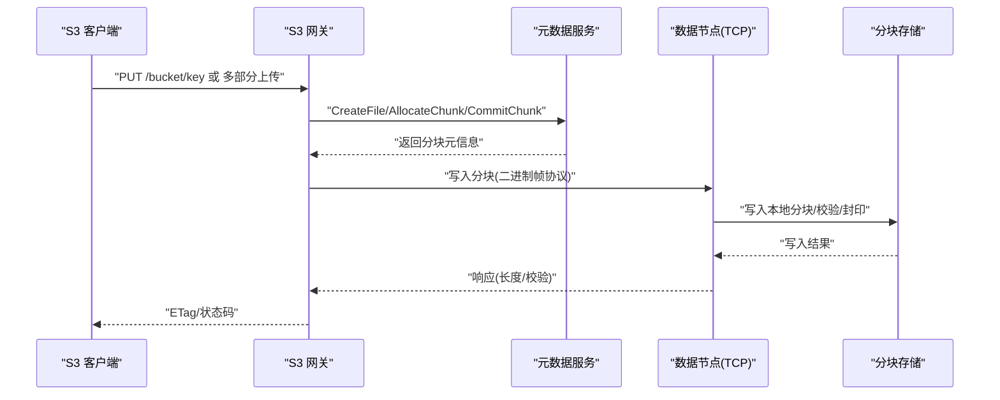
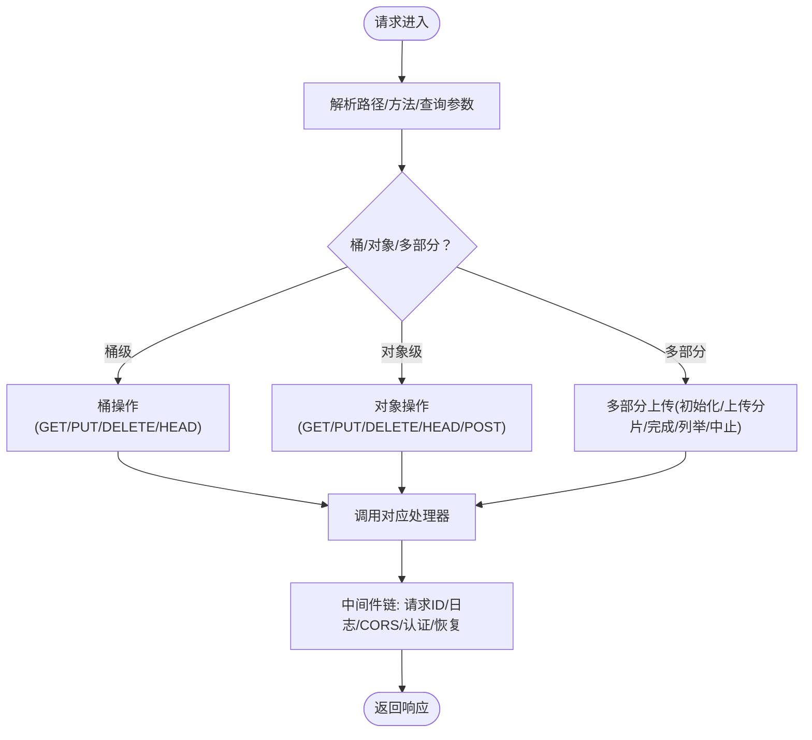
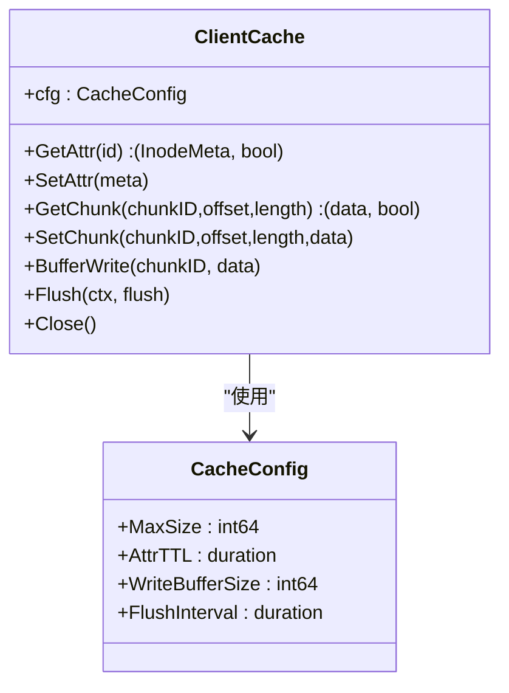
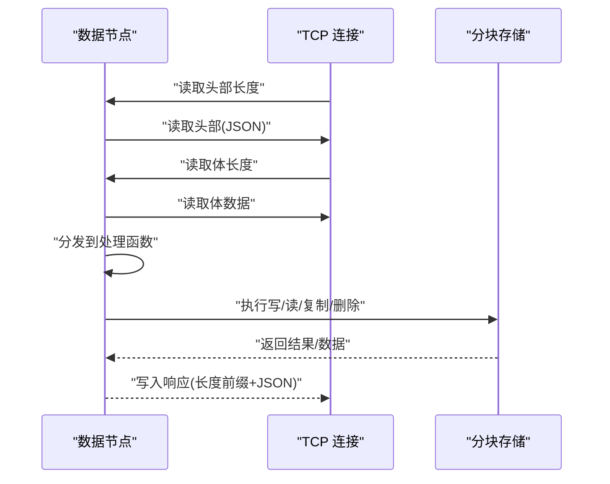
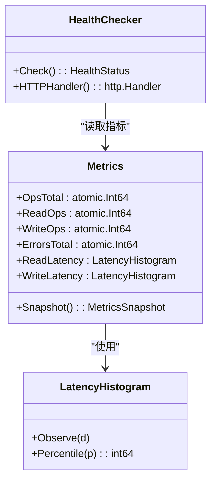
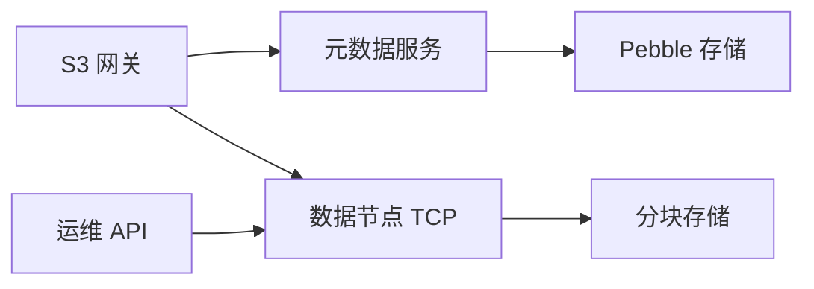

# 网络优化

<cite>
**本文引用的文件**
- [nufs-core/gateway/s3/handler.go](file://nufs-core/gateway/s3/handler.go)
- [nufs-core/gateway/s3/multipart.go](file://nufs-core/gateway/s3/multipart.go)
- [nufs-core/gateway/s3/object.go](file://nufs-core/gateway/s3/object.go)
- [nufs-core/gateway/s3/middleware.go](file://nufs-core/gateway/s3/middleware.go)
- [nufs-core/gateway/cache.go](file://nufs-core/gateway/cache.go)
- [nufs-core/datanode/server.go](file://nufs-core/datanode/server.go)
- [nufs-core/datanode/chunkstore.go](file://nufs-core/datanode/chunkstore.go)
- [nufs-core/datanode/ops.go](file://nufs-core/datanode/ops.go)
- [nufs-core/metadata/service.go](file://nufs-core/metadata/service.go)
- [nufs-core/metadata/health.go](file://nufs-core/metadata/health.go)
- [nufs-core/metadata/pebble_store.go](file://nufs-core/metadata/pebble_store.go)
- [nufs-core/cmd/s3gw/main.go](file://nufs-core/cmd/s3gw/main.go)
- [nufs-core/cmd/datanode/main.go](file://nufs-core/cmd/datanode/main.go)
- [nufs-core/deploy/config/cluster.yaml](file://nufs-core/deploy/config/cluster.yaml)
</cite>

## 目录
1. [简介](#简介)
2. [项目结构](#项目结构)
3. [核心组件](#核心组件)
4. [架构总览](#架构总览)
5. [详细组件分析](#详细组件分析)
6. [依赖分析](#依赖分析)
7. [性能考量](#性能考量)
8. [故障排查指南](#故障排查指南)
9. [结论](#结论)
10. [附录](#附录)

## 简介
本文件面向NUFS分布式文件系统的网络优化策略，聚焦于S3 API的网络协议与数据传输优化、连接管理与带宽利用、延迟与吞吐量提升、连接池与并发控制、性能监控与瓶颈识别，以及在不同网络环境下的配置建议与调优实践。文档以代码级分析为基础，结合系统架构图与流程图，帮助开发者快速定位问题并进行针对性优化。

## 项目结构
NUFS由“网关层（S3/FUSE）—元数据服务（Pebble）—数据节点（Chunk存储/TCP）”三层组成。S3网关负责S3兼容协议解析与路由；元数据服务提供命名空间、桶、分块等元信息；数据节点负责本地磁盘分块存储与跨节点复制。

```mermaid
graph TB
subgraph "客户端"
C1["S3 客户端"]
C2["FUSE 客户端"]
end
subgraph "网关层"
GW_S3["S3 网关<br/>路由/中间件/多部分上传"]
GW_CACHE["客户端缓存<br/>属性/数据/写缓冲"]
end
subgraph "元数据层"
META["元数据服务(Pebble)<br/>桶/命名空间/分块/节点"]
end
subgraph "数据层"
DN_TCP["数据节点 TCP 服务器<br/>请求分发/读写/复制"]
DN_STORE["分块存储<br/>并发读写信号量"]
OPS["运维 API<br/>健康/指标/修复"]
end
C1 --> GW_S3
C2 --> GW_CACHE
GW_S3 --> META
GW_S3 --> DN_TCP
GW_CACHE --> META
META --> DN_TCP
OPS <- --> DN_TCP
```

图表来源
- [nufs-core/gateway/s3/handler.go:11-54](file://nufs-core/gateway/s3/handler.go#L11-L54)
- [nufs-core/gateway/cache.go:29-101](file://nufs-core/gateway/cache.go#L29-L101)
- [nufs-core/metadata/service.go:16-67](file://nufs-core/metadata/service.go#L16-L67)
- [nufs-core/datanode/server.go:18-126](file://nufs-core/datanode/server.go#L18-L126)
- [nufs-core/datanode/chunkstore.go:18-51](file://nufs-core/datanode/chunkstore.go#L18-L51)
- [nufs-core/datanode/ops.go:19-71](file://nufs-core/datanode/ops.go#L19-L71)

章节来源
- [nufs-core/gateway/s3/handler.go:11-54](file://nufs-core/gateway/s3/handler.go#L11-L54)
- [nufs-core/gateway/cache.go:29-101](file://nufs-core/gateway/cache.go#L29-L101)
- [nufs-core/metadata/service.go:16-67](file://nufs-core/metadata/service.go#L16-L67)
- [nufs-core/datanode/server.go:18-126](file://nufs-core/datanode/server.go#L18-L126)
- [nufs-core/datanode/chunkstore.go:18-51](file://nufs-core/datanode/chunkstore.go#L18-L51)
- [nufs-core/datanode/ops.go:19-71](file://nufs-core/datanode/ops.go#L19-L71)

## 核心组件
- S3 网关：HTTP 路由、中间件链、S3 兼容语义、多部分上传跟踪与完成。
- 客户端缓存：属性缓存、数据块缓存、写缓冲异步刷写，降低元数据与数据往返。
- 数据节点 TCP 服务器：请求/响应二进制帧协议、读写/复制处理、并发限制。
- 分块存储：分片目录组织、头信息校验、并发读写信号量、封印计算校验。
- 元数据服务：统一接口抽象、Pebble 存储后端、Raft 可选一致性、健康检查与指标。
- 运维 API：集群状态、节点管理、修复队列、指标与健康检查。

章节来源
- [nufs-core/gateway/s3/handler.go:11-54](file://nufs-core/gateway/s3/handler.go#L11-L54)
- [nufs-core/gateway/s3/multipart.go:14-83](file://nufs-core/gateway/s3/multipart.go#L14-L83)
- [nufs-core/gateway/cache.go:29-101](file://nufs-core/gateway/cache.go#L29-L101)
- [nufs-core/datanode/server.go:18-126](file://nufs-core/datanode/server.go#L18-L126)
- [nufs-core/datanode/chunkstore.go:18-51](file://nufs-core/datanode/chunkstore.go#L18-L51)
- [nufs-core/metadata/service.go:16-67](file://nufs-core/metadata/service.go#L16-L67)
- [nufs-core/metadata/health.go:16-94](file://nufs-core/metadata/health.go#L16-L94)

## 架构总览
下图展示S3请求从进入网关到元数据与数据节点交互的关键路径，并标注可优化点（连接复用、并发限制、缓存命中、协议开销）。



图表来源
- [nufs-core/gateway/s3/object.go:17-95](file://nufs-core/gateway/s3/object.go#L17-L95)
- [nufs-core/gateway/s3/multipart.go:85-203](file://nufs-core/gateway/s3/multipart.go#L85-L203)
- [nufs-core/datanode/server.go:102-126](file://nufs-core/datanode/server.go#L102-L126)
- [nufs-core/datanode/chunkstore.go:73-127](file://nufs-core/datanode/chunkstore.go#L73-L127)

章节来源
- [nufs-core/gateway/s3/object.go:17-95](file://nufs-core/gateway/s3/object.go#L17-L95)
- [nufs-core/gateway/s3/multipart.go:85-203](file://nufs-core/gateway/s3/multipart.go#L85-L203)
- [nufs-core/datanode/server.go:102-126](file://nufs-core/datanode/server.go#L102-L126)
- [nufs-core/datanode/chunkstore.go:73-127](file://nufs-core/datanode/chunkstore.go#L73-L127)

## 详细组件分析

### S3 网关与中间件链
- 路由与分发：根据URL路径与查询参数区分桶/对象/多部分操作，集中于路由函数。
- 中间件链：请求ID注入、日志记录、CORS、认证、异常恢复，保证S3兼容性与可观测性。
- 多部分上传：内存跟踪上传会话与分片，支持初始化、上传分片、完成合并、列举与中止。



图表来源
- [nufs-core/gateway/s3/handler.go:70-166](file://nufs-core/gateway/s3/handler.go#L70-L166)
- [nufs-core/gateway/s3/middleware.go:13-93](file://nufs-core/gateway/s3/middleware.go#L13-L93)
- [nufs-core/gateway/s3/multipart.go:85-285](file://nufs-core/gateway/s3/multipart.go#L85-L285)

章节来源
- [nufs-core/gateway/s3/handler.go:70-166](file://nufs-core/gateway/s3/handler.go#L70-L166)
- [nufs-core/gateway/s3/middleware.go:13-93](file://nufs-core/gateway/s3/middleware.go#L13-L93)
- [nufs-core/gateway/s3/multipart.go:85-285](file://nufs-core/gateway/s3/multipart.go#L85-L285)

### 客户端缓存与写缓冲
- 属性缓存：inode 元信息短时缓存，减少元数据查询。
- 数据缓存：按块粒度缓存，延长TTL，提升顺序读命中率。
- 写缓冲：异步批量刷写，达到阈值或定时触发，降低小块写放大。
- 刷新回调：将脏块刷新至数据节点，失败重试并回退缓冲。



图表来源
- [nufs-core/gateway/cache.go:17-101](file://nufs-core/gateway/cache.go#L17-L101)

章节来源
- [nufs-core/gateway/cache.go:17-101](file://nufs-core/gateway/cache.go#L17-L101)

### 数据节点 TCP 协议与并发控制
- 协议格式：长度前缀 + JSON 头部 + 长度前缀 + 体数据，简洁稳定。
- 请求分发：写/读/删除/复制/信息/列表/健康等类型路由。
- 并发控制：写/读信号量限制并发，避免磁盘竞争导致的尾延迟放大。
- 健康与运维：健康检查、指标导出、修复扫描、反熵引擎。



图表来源
- [nufs-core/datanode/server.go:273-337](file://nufs-core/datanode/server.go#L273-L337)
- [nufs-core/datanode/chunkstore.go:73-127](file://nufs-core/datanode/chunkstore.go#L73-L127)

章节来源
- [nufs-core/datanode/server.go:273-337](file://nufs-core/datanode/server.go#L273-L337)
- [nufs-core/datanode/chunkstore.go:73-127](file://nufs-core/datanode/chunkstore.go#L73-L127)

### 元数据服务与健康监控
- 统一接口：桶/命名空间/分块/节点/修复/再平衡等能力抽象。
- 指标体系：操作总数、读写计数、错误计数、延迟直方图（P50/P99）、键/分块/在线节点/桶数量、Raft 状态。
- 健康检查：Pebble 可读性、根 inode 存在、Raft 角色/最后联系、错误率阈值。
- 运维接口：/metrics、/health、/ready、集群状态、节点管理、修复队列、GC 扫描。



图表来源
- [nufs-core/metadata/health.go:16-94](file://nufs-core/metadata/health.go#L16-L94)
- [nufs-core/metadata/health.go:96-184](file://nufs-core/metadata/health.go#L96-L184)

章节来源
- [nufs-core/metadata/health.go:16-94](file://nufs-core/metadata/health.go#L16-L94)
- [nufs-core/metadata/health.go:96-184](file://nufs-core/metadata/health.go#L96-L184)

### S3 API 网络协议与传输优化要点
- 路由与中间件：通过中间件链统一注入请求ID、日志、CORS与认证，便于端到端追踪与安全控制。
- 多部分上传：内存跟踪上传会话，避免大对象多次往返；完成阶段按序合并与校验。
- 对象读写：PUT/GET/HEAD/DELETE/拷贝等操作均通过元数据服务协调分块分配与提交，读取路径在生产中应直接从数据节点流式返回（当前注释提示）。
- 限流与超时：HTTP 服务设置读/写/空闲超时，防止慢连接与资源泄漏。

章节来源
- [nufs-core/gateway/s3/handler.go:70-166](file://nufs-core/gateway/s3/handler.go#L70-L166)
- [nufs-core/gateway/s3/middleware.go:13-93](file://nufs-core/gateway/s3/middleware.go#L13-L93)
- [nufs-core/gateway/s3/multipart.go:85-203](file://nufs-core/gateway/s3/multipart.go#L85-L203)
- [nufs-core/gateway/s3/object.go:17-95](file://nufs-core/gateway/s3/object.go#L17-L95)
- [nufs-core/cmd/s3gw/main.go:54-61](file://nufs-core/cmd/s3gw/main.go#L54-L61)

## 依赖分析
- S3 网关依赖元数据服务进行桶/命名空间/分块管理，并与数据节点通过TCP协议交互。
- 数据节点内部通过分块存储模块实现并发控制与磁盘访问，同时暴露运维API供管理与监控。
- 元数据服务基于Pebble实现高吞吐KV存储，支持可选Raft一致性与运维子系统。



图表来源
- [nufs-core/gateway/s3/handler.go:13-33](file://nufs-core/gateway/s3/handler.go#L13-L33)
- [nufs-core/datanode/server.go:18-34](file://nufs-core/datanode/server.go#L18-L34)
- [nufs-core/datanode/chunkstore.go:18-31](file://nufs-core/datanode/chunkstore.go#L18-L31)
- [nufs-core/metadata/service.go:16-67](file://nufs-core/metadata/service.go#L16-L67)
- [nufs-core/metadata/pebble_store.go:16-31](file://nufs-core/metadata/pebble_store.go#L16-L31)
- [nufs-core/datanode/ops.go:19-71](file://nufs-core/datanode/ops.go#L19-L71)

章节来源
- [nufs-core/gateway/s3/handler.go:13-33](file://nufs-core/gateway/s3/handler.go#L13-L33)
- [nufs-core/datanode/server.go:18-34](file://nufs-core/datanode/server.go#L18-L34)
- [nufs-core/datanode/chunkstore.go:18-31](file://nufs-core/datanode/chunkstore.go#L18-L31)
- [nufs-core/metadata/service.go:16-67](file://nufs-core/metadata/service.go#L16-L67)
- [nufs-core/metadata/pebble_store.go:16-31](file://nufs-core/metadata/pebble_store.go#L16-L31)
- [nufs-core/datanode/ops.go:19-71](file://nufs-core/datanode/ops.go#L19-L71)

## 性能考量
- 延迟优化
  - 使用客户端缓存：属性与数据缓存显著降低元数据与小对象读取延迟。
  - 合理设置写缓冲阈值与刷新间隔，平衡延迟与吞吐。
  - 通过中间件链统一注入请求ID，便于端到端延迟分析与定位。
- 吞吐量提升
  - 数据节点并发控制：通过写/读信号量限制并发，避免磁盘争用导致的尾延迟。
  - 多部分上传：分片并行上传，完成后按序合并，减少单次大包阻塞。
  - HTTP 服务超时配置：合理设置读/写/空闲超时，避免连接堆积。
- 连接与带宽利用
  - TCP 协议简洁，建议在应用层启用长连接复用，减少握手开销。
  - 通过运维API与健康检查监控节点负载与磁盘使用率，动态调整部署拓扑。
- 指标与瓶颈识别
  - 使用元数据服务指标（P50/P99延迟、错误率、键/分块/节点数）与运维API指标（复制写入/错误/平均延迟、反熵扫描/修复）综合评估。
  - 结合健康检查判断节点健康状态，及时隔离异常节点。

章节来源
- [nufs-core/gateway/cache.go:17-101](file://nufs-core/gateway/cache.go#L17-L101)
- [nufs-core/datanode/chunkstore.go:29-51](file://nufs-core/datanode/chunkstore.go#L29-L51)
- [nufs-core/metadata/health.go:16-94](file://nufs-core/metadata/health.go#L16-L94)
- [nufs-core/datanode/ops.go:236-270](file://nufs-core/datanode/ops.go#L236-L270)
- [nufs-core/cmd/s3gw/main.go:54-61](file://nufs-core/cmd/s3gw/main.go#L54-L61)

## 故障排查指南
- 常见问题定位
  - S3 请求异常：检查中间件链日志与请求ID，确认认证与CORS配置是否正确。
  - 多部分上传失败：核对上传ID是否存在、分片是否齐全、完成请求XML格式。
  - 数据读写错误：查看数据节点TCP协议解析与分块存储写入/读取路径，关注校验与封印过程。
  - 元数据异常：通过健康检查与运维API确认元数据服务状态与Raft角色。
- 排障步骤
  - 采集指标：/metrics 与 /api/v1/metrics 获取延迟、错误、复制与反熵统计。
  - 健康检查：/health 与 /ready 判断服务可用性与错误率阈值。
  - 节点状态：/api/v1/nodes 查看节点列表与状态，必要时发起退役。
  - 修复与GC：触发修复队列与GC扫描，清理孤儿分块。
- 配置建议
  - 在集群配置中设置合理的心跳间隔、副本因子与拓扑分布，确保跨机架/可用区冗余。
  - 根据网络带宽与延迟特性调整写缓冲阈值与刷新间隔，避免频繁刷写与内存占用过高。

章节来源
- [nufs-core/gateway/s3/middleware.go:23-84](file://nufs-core/gateway/s3/middleware.go#L23-L84)
- [nufs-core/gateway/s3/multipart.go:85-285](file://nufs-core/gateway/s3/multipart.go#L85-L285)
- [nufs-core/datanode/server.go:273-337](file://nufs-core/datanode/server.go#L273-L337)
- [nufs-core/metadata/health.go:292-327](file://nufs-core/metadata/health.go#L292-L327)
- [nufs-core/datanode/ops.go:135-227](file://nufs-core/datanode/ops.go#L135-L227)
- [nufs-core/deploy/config/cluster.yaml:8-62](file://nufs-core/deploy/config/cluster.yaml#L8-L62)

## 结论
NUFS在网络层面通过S3网关中间件链、客户端缓存、TCP二进制协议与并发信号量控制，实现了低延迟与高吞吐的协同。结合元数据服务与运维API的指标与健康检查，能够有效识别与缓解网络瓶颈。针对不同网络环境，建议从连接复用、写缓冲策略、并发配额与拓扑分布等方面进行精细化调优。

## 附录
- 关键配置参考
  - S3 网关监听地址与超时设置
  - 数据节点并发写/读上限与运维监听地址
  - 集群名称、区域、副本因子与拓扑分布
- 开发者建议
  - 在高延迟广域网场景下，适当增大写缓冲阈值与刷新间隔，减少握手次数。
  - 在高并发局域网场景下，适度提高并发写/读上限，充分利用磁盘带宽。
  - 结合健康检查与运维API定期巡检，提前发现节点异常与磁盘压力。

章节来源
- [nufs-core/cmd/s3gw/main.go:54-61](file://nufs-core/cmd/s3gw/main.go#L54-L61)
- [nufs-core/cmd/datanode/main.go:33-46](file://nufs-core/cmd/datanode/main.go#L33-L46)
- [nufs-core/deploy/config/cluster.yaml:4-62](file://nufs-core/deploy/config/cluster.yaml#L4-L62)