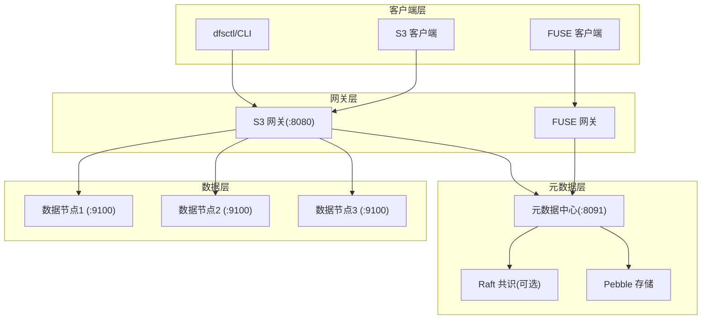
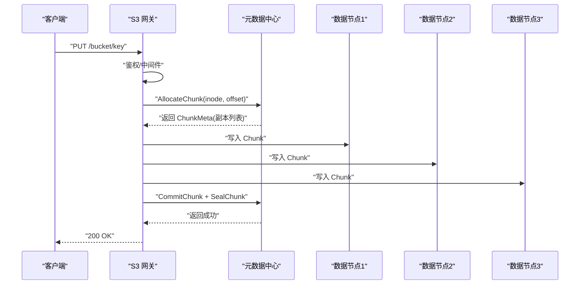
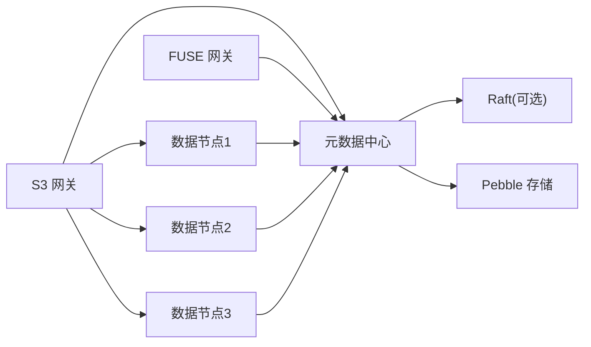

# 常见问题诊断

<cite>
**本文引用的文件**   
- [ARCHITECTURE.md](file://nufs-core/ARCHITECTURE.md)
- [main.go（元数据中心）](file://nufs-core/cmd/metad/main.go)
- [main.go（数据节点）](file://nufs-core/cmd/datanode/main.go)
- [main.go（S3 网关）](file://nufs-core/cmd/s3gw/main.go)
- [main.go（FUSE 网关）](file://nufs-core/cmd/fusegw/main.go)
- [errors.go](file://nufs-core/metadata/errors.go)
- [health.go](file://nufs-core/metadata/health.go)
- [heartbeat.go](file://nufs-core/datanode/heartbeat.go)
- [auth.go](file://nufs-core/gateway/s3/auth.go)
- [service.go](file://nufs-core/metadata/service.go)
- [cluster.yaml](file://nufs-core/deploy/config/cluster.yaml)
- [docker-compose.yml](file://nufs-core/docker-compose.yml)
</cite>

## 目录
1. [简介](#简介)
2. [项目结构](#项目结构)
3. [核心组件](#核心组件)
4. [架构总览](#架构总览)
5. [详细组件分析](#详细组件分析)
6. [依赖分析](#依赖分析)
7. [性能考虑](#性能考虑)
8. [故障排查指南](#故障排查指南)
9. [结论](#结论)
10. [附录](#附录)

## 简介
本文件面向运维与平台工程团队，聚焦 NUFS 分布式文件系统在运行过程中常见的问题类型与诊断方法。内容覆盖连接超时、权限验证失败、元数据不一致、数据节点离线等典型场景，提供症状、可能原因、快速诊断步骤、问题分类与自检清单，并给出解决方案指引与可视化流程图，帮助快速定位与恢复。

## 项目结构
NUFS 采用分层架构：客户端层（S3/FUSE/CLI）、网关层（S3/FUSE）、元数据层（Pebble + Raft）、数据层（DataNode）。各组件以进程形式运行并通过 HTTP/本地接口交互；元数据中心提供强一致写与健康检查；数据节点负责 Chunk 存储与复制；网关层提供兼容 S3 的 REST API 与 POSIX 挂载。

**图表来源**
- [ARCHITECTURE.md](file://nufs-core/ARCHITECTURE.md)
- [docker-compose.yml](file://nufs-core/docker-compose.yml)

**章节来源**
- [ARCHITECTURE.md](file://nufs-core/ARCHITECTURE.md)
- [docker-compose.yml](file://nufs-core/docker-compose.yml)

## 核心组件
- 元数据中心（metad）
  - 提供 HTTP 运维接口（/health、/ready、/metrics、/api/v1/*），内置健康检查与指标采集。
  - 可启用 Raft 共识，支持领导者选举与多数派提交。
- 数据节点（datanode）
  - 提供 TCP Chunk 读写与复制接口，周期性心跳上报状态。
  - 支持复制引擎、链式复制与反熵校验。
- 网关层（S3/FUSE）
  - S3 网关：S3 兼容 API、V4 签名验证、匿名模式。
  - FUSE 网关：Linux 下 POSIX 文件系统挂载。
- 配置与部署
  - docker-compose 提供三副本数据节点与元数据中心示例。
  - cluster.yaml 提供集群参数模板（部署时参考）。

**章节来源**
- [main.go（元数据中心）](file://nufs-core/cmd/metad/main.go)
- [main.go（数据节点）](file://nufs-core/cmd/datanode/main.go)
- [main.go（S3 网关）](file://nufs-core/cmd/s3gw/main.go)
- [main.go（FUSE 网关）](file://nufs-core/cmd/fusegw/main.go)
- [cluster.yaml](file://nufs-core/deploy/config/cluster.yaml)
- [docker-compose.yml](file://nufs-core/docker-compose.yml)

## 架构总览
下图展示一次典型写入路径：S3 客户端发起 PUT 请求，经 S3 网关解析与鉴权后，调用元数据中心分配 Chunk 并选择副本，随后并行写入数据节点，最后元数据中心提交并返回。

**图表来源**
- [ARCHITECTURE.md](file://nufs-core/ARCHITECTURE.md)

## 详细组件分析

### 连接超时
- 症状
  - 客户端请求长时间无响应，最终超时（ReadTimeout/WriteTimeout 生效）。
  - S3 网关与元数据中心之间通信异常。
- 可能原因
  - 元数据中心未就绪（/ready 未返回 200）。
  - 元数据中心 Raft 未选举或领导者不可用。
  - 数据节点未注册或心跳中断导致副本不可用。
  - 网络分区或防火墙阻断端口。
- 快速诊断
  - 检查 /ready 与 /health 健康探针。
  - 检查元数据中心 Raft 状态与领导者角色。
  - 检查数据节点是否注册与心跳上报。
  - 使用 telnet/curl 验证端口连通性。
- 解决方案
  - 等待元数据中心就绪；若非 Raft 模式，确认 standalone 状态。
  - 若领导者缺失，等待选举或手动引导（视部署策略）。
  - 重启离线数据节点并确认注册成功。
  - 修复网络策略与安全组规则。

**章节来源**
- [main.go（元数据中心）](file://nufs-core/cmd/metad/main.go)
- [health.go](file://nufs-core/metadata/health.go)
- [heartbeat.go](file://nufs-core/datanode/heartbeat.go)
- [docker-compose.yml](file://nufs-core/docker-compose.yml)

### 权限验证失败（S3 鉴权）
- 症状
  - S3 客户端收到 403/400，提示签名无效或缺少凭证。
- 可能原因
  - 未配置访问密钥，但客户端强制签名。
  - 凭证不匹配或签名算法不正确。
  - 预签名 URL 参数缺失或过期。
- 快速诊断
  - 确认 S3 网关是否启用鉴权（命令行参数）。
  - 校验 Authorization 头或预签名 URL 参数。
  - 对比日期头与签名时间窗口。
- 解决方案
  - 在 S3 网关启动时提供 access-key/secret-key 或保持匿名模式。
  - 使用正确的 Region、Service 与 SignedHeaders。
  - 重新生成预签名 URL 并确保有效期。

**章节来源**
- [main.go（S3 网关）](file://nufs-core/cmd/s3gw/main.go)
- [auth.go](file://nufs-core/gateway/s3/auth.go)

### 元数据不一致
- 症状
  - 读写一致性异常，读到旧数据或写后未生效。
  - 元数据中心错误率升高，/metrics 显示异常。
- 可能原因
  - Raft 未达成多数派提交，领导者频繁变更。
  - 元数据中心未就绪（未关闭 Ready 通道）。
  - 元数据键空间异常或根 Inode 缺失。
- 快速诊断
  - 检查 /health 与 /ready。
  - 读取 /metrics 观察错误率与延迟。
  - 使用运维工具列出节点与桶，确认根 Inode 存在。
- 解决方案
  - 等待领导者稳定；必要时引导新集群。
  - 修复存储后重启元数据中心。
  - 检查键空间布局与一致性哈希路由。

**章节来源**
- [health.go](file://nufs-core/metadata/health.go)
- [service.go](file://nufs-core/metadata/service.go)
- [main.go（元数据中心）](file://nufs-core/cmd/metad/main.go)

### 数据节点离线
- 症状
  - 读写失败，提示节点离线或副本不足。
  - 元数据中心显示节点 Offline。
- 可能原因
  - 节点进程崩溃或未启动。
  - 心跳上报失败（网络/磁盘 IO 异常）。
  - 节点租约过期（LeaseManager 检测）。
- 快速诊断
  - 检查 /api/v1/nodes 与 /health。
  - 查看数据节点 /ops API 是否可达。
  - 检查磁盘空间与 IO Utilization。
- 解决方案
  - 重启数据节点并确认注册成功。
  - 修复网络与磁盘问题后重试。
  - 触发修复队列或等待 Scrubber 标记损坏并修复。

**章节来源**
- [heartbeat.go](file://nufs-core/datanode/heartbeat.go)
- [main.go（数据节点）](file://nufs-core/cmd/datanode/main.go)
- [errors.go](file://nufs-core/metadata/errors.go)

## 依赖分析
- 组件耦合
  - 网关层依赖元数据中心提供的 MetadataService 接口。
  - 数据节点依赖元数据中心进行节点注册与心跳上报。
  - 元数据中心可选启用 Raft，增强一致性与可用性。
- 外部依赖
  - docker-compose 提供容器化部署与健康检查。
  - cluster.yaml 提供部署参数模板。

**图表来源**
- [ARCHITECTURE.md](file://nufs-core/ARCHITECTURE.md)
- [docker-compose.yml](file://nufs-core/docker-compose.yml)

**章节来源**
- [ARCHITECTURE.md](file://nufs-core/ARCHITECTURE.md)
- [docker-compose.yml](file://nufs-core/docker-compose.yml)

## 性能考虑
- 延迟与吞吐
  - 元数据中心提供读写延迟直方图与错误计数，便于定位热点。
  - 客户端缓存（Attr/Data）显著降低热数据延迟。
- 一致性与可用性
  - Raft 保障强一致写；读一致性可通过路径选择（走领导者或任意副本）平衡。
- 存储与复制
  - 数据节点定期心跳上报磁盘使用与副本状态，辅助容量与健康评估。

**章节来源**
- [health.go](file://nufs-core/metadata/health.go)
- [ARCHITECTURE.md](file://nufs-core/ARCHITECTURE.md)

## 故障排查指南

### 问题分类与分级
- 严重级别
  - P0：完全不可用（全部网关/元数据中心/数据节点均不可用）
  - P1：部分不可用（单点故障或关键路径中断）
  - P2：性能退化（延迟升高、错误率上升）
- 影响范围
  - 全局：影响所有桶/对象
  - 桶级：影响特定桶
  - 业务：影响特定客户端或工作负载

### 问题自检清单
- 基础连通性
  - 元数据中心 /health 与 /ready 是否返回健康。
  - 数据节点 /ops API 是否可达。
  - S3 网关端口是否监听。
- 元数据健康
  - /metrics 是否显示错误率异常。
  - /api/v1/cluster/status 是否显示领导者角色。
  - /api/v1/nodes 是否显示节点在线数量。
- 数据节点状态
  - 心跳是否持续上报。
  - Chunk 数量与磁盘使用是否正常。
- 客户端鉴权
  - S3 网关是否启用鉴权。
  - 客户端签名是否符合 V4 规范。

### 快速定位步骤
- 步骤 1：确认基础连通性
  - curl http://<metad>:8091/health
  - curl http://<metad>:8091/ready
  - curl http://<s3gw>:8080
- 步骤 2：检查元数据中心健康与指标
  - curl http://<metad>:8091/metrics
  - curl http://<metad>:8091/api/v1/cluster/status
  - curl http://<metad>:8091/api/v1/nodes
- 步骤 3：检查数据节点
  - curl http://<datanode>:8092/ops/health
  - 检查心跳上报与磁盘使用
- 步骤 4：S3 鉴权问题
  - 确认网关是否启用鉴权
  - 校验 Authorization 头或预签名 URL

### 常见问题与处置对照
- 连接超时
  - 症状：客户端超时
  - 排查：/ready 与 /health；Raft 状态；端口连通
  - 处置：等待就绪；修复网络；重启节点
- 权限验证失败
  - 症状：403/400
  - 排查：鉴权开关；签名参数；时间窗口
  - 处置：配置凭证；修正签名；重新生成预签名 URL
- 元数据不一致
  - 症状：读写不一致
  - 排查：/metrics 错误率；/health；根 Inode
  - 处置：等待领导者稳定；修复存储；检查键空间
- 数据节点离线
  - 症状：节点 Offline
  - 排查：/api/v1/nodes；/ops/health；心跳
  - 处置：重启节点；修复网络/磁盘；触发修复

**章节来源**
- [main.go（元数据中心）](file://nufs-core/cmd/metad/main.go)
- [main.go（S3 网关）](file://nufs-core/cmd/s3gw/main.go)
- [main.go（数据节点）](file://nufs-core/cmd/datanode/main.go)
- [health.go](file://nufs-core/metadata/health.go)
- [heartbeat.go](file://nufs-core/datanode/heartbeat.go)
- [auth.go](file://nufs-core/gateway/s3/auth.go)

## 结论
通过结合健康检查、指标监控与运维接口，NUFS 的常见问题通常可在分钟级内定位与恢复。建议在生产环境启用健康探针与指标采集，建立自动化巡检与告警，配合本文的自检清单与处置流程，可有效提升系统稳定性与可维护性。

## 附录

### 关键端口与接口
- 元数据中心
  - HTTP 运维接口：/health、/ready、/metrics、/api/v1/*
  - Raft：7000（示例）
  - Ops：8091（示例）
- 数据节点
  - TCP Chunk：9100（示例）
  - Ops：8092（示例）
- S3 网关
  - HTTP：8080（示例）

**章节来源**
- [main.go（元数据中心）](file://nufs-core/cmd/metad/main.go)
- [main.go（数据节点）](file://nufs-core/cmd/datanode/main.go)
- [main.go（S3 网关）](file://nufs-core/cmd/s3gw/main.go)
- [docker-compose.yml](file://nufs-core/docker-compose.yml)