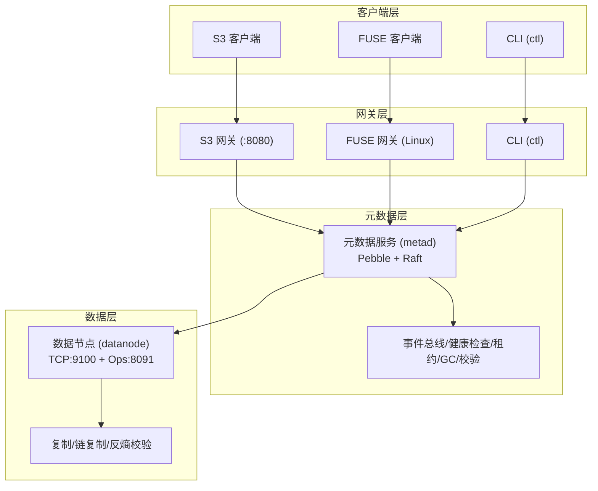
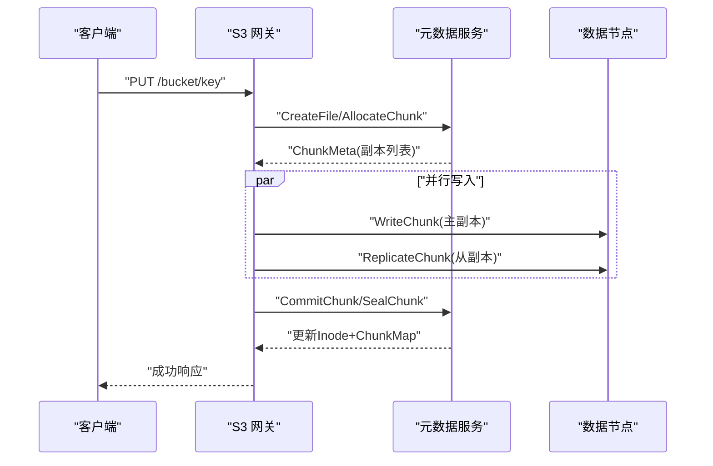
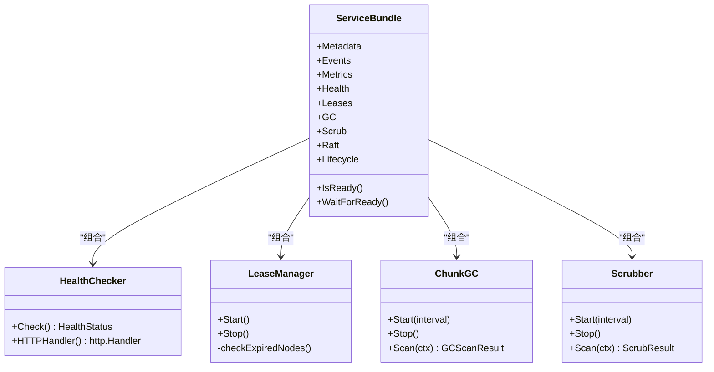
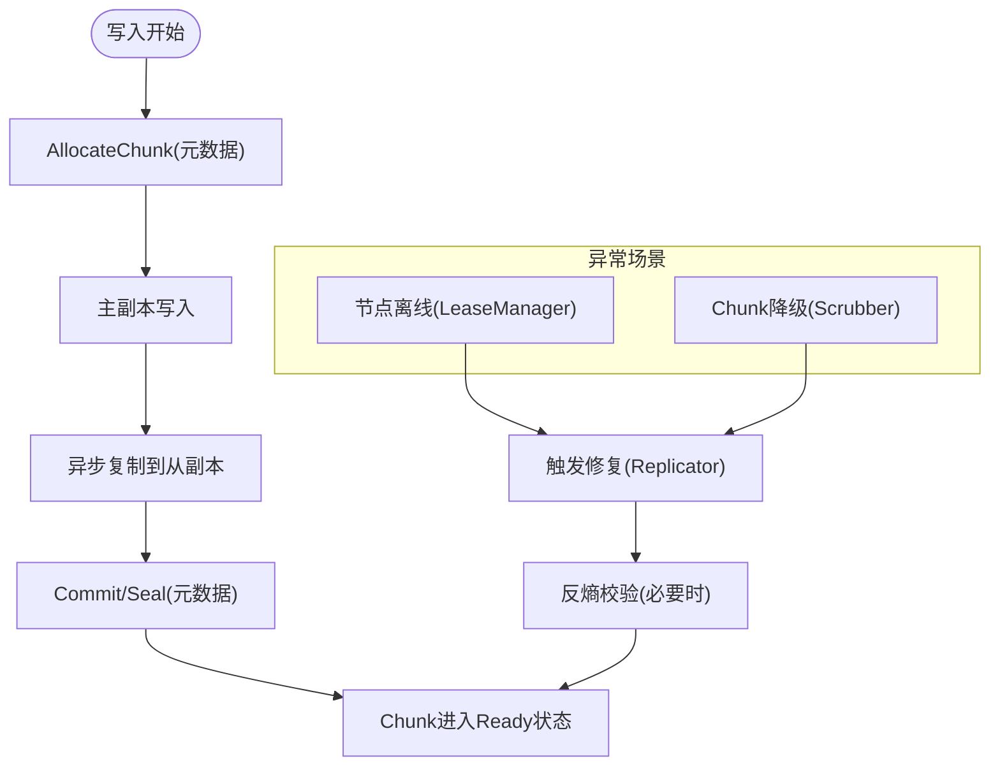
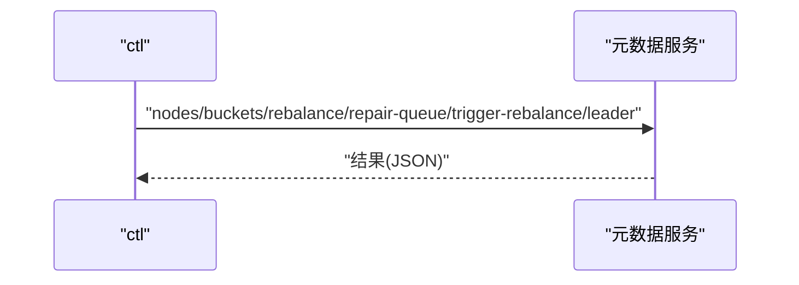
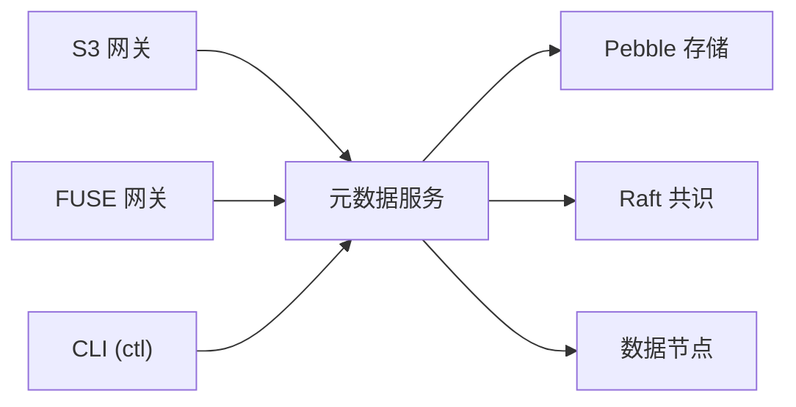
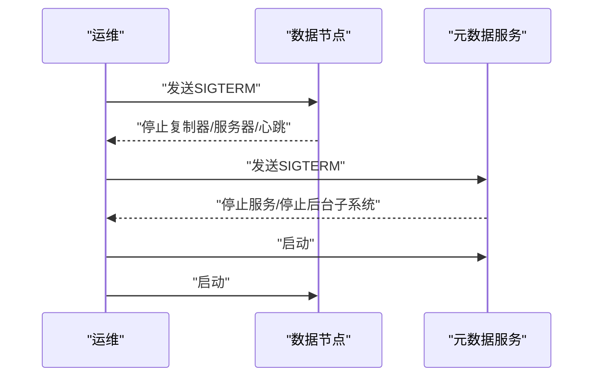

# 应急响应指南

<cite>
**本文引用的文件**
- [ARCHITECTURE.md](file://nufs-core/ARCHITECTURE.md)
- [main.go](file://nufs-core/cmd/ctl/main.go)
- [main.go](file://nufs-core/cmd/datanode/main.go)
- [main.go](file://nufs-core/cmd/metad/main.go)
- [main.go](file://nufs-core/cmd/s3gw/main.go)
- [main.go](file://nufs-core/cmd/fusegw/main.go)
- [service.go](file://nufs-core/metadata/service.go)
- [production.go](file://nufs-core/metadata/production.go)
- [health.go](file://nufs-core/metadata/health.go)
- [errors.go](file://nufs-core/metadata/errors.go)
- [ha.go](file://nufs-core/datanode/ha.go)
- [docker-compose.yml](file://nufs-core/docker-compose.yml)
- [cluster.yaml](file://nufs-core/deploy/config/cluster.yaml)
- [signals.go](file://nufs-fuse/fs/signals.go)
- [TODO.md](file://nufs-core/TODO.md)
</cite>

## 目录
1. [简介](#简介)
2. [项目结构](#项目结构)
3. [核心组件](#核心组件)
4. [架构总览](#架构总览)
5. [详细组件分析](#详细组件分析)
6. [依赖分析](#依赖分析)
7. [性能考虑](#性能考虑)
8. [故障应急处理流程](#故障应急处理流程)
9. [应急联系人与沟通机制](#应急联系人与沟通机制)
10. [灾难恢复与业务连续性](#灾难恢复与业务连续性)
11. [应急工具箱与常用命令](#应急工具箱与常用命令)
12. [法律合规与审计记录](#法律合规与审计记录)
13. [结论](#结论)

## 简介
本指南面向NUFS分布式文件系统运维团队，提供一套完整的应急响应流程与操作手册，覆盖紧急停机、快速恢复、系统重建、故障分级与响应时效、联系人与升级流程、灾难恢复预案、业务连续性保障、应急工具箱与常用命令，以及法律合规与审计记录要求。文档以代码库中的实际组件与接口为依据，确保流程可落地、可验证。

## 项目结构
NUFS系统由三层网关（S3/FUSE/CLI）与三层数据平面（元数据/共识、元数据存储、数据节点）组成，支持单机开发、Docker Compose与Kubernetes部署模式，并提供健康检查、指标采集与Raft共识等生产级能力。

**图表来源**
- [ARCHITECTURE.md:37-101](file://nufs-core/ARCHITECTURE.md#L37-L101)
- [docker-compose.yml:3-148](file://nufs-core/docker-compose.yml#L3-L148)

**章节来源**
- [ARCHITECTURE.md:25-116](file://nufs-core/ARCHITECTURE.md#L25-L116)
- [docker-compose.yml:1-148](file://nufs-core/docker-compose.yml#L1-L148)

## 核心组件
- 元数据服务（metad）：提供Pebble键值存储与可选Raft共识，承载命名空间、Inode/Chunk映射、租约、GC、校验与生命周期管理等。
- 数据节点（datanode）：提供TCP Chunk读写、复制引擎、链复制、反熵校验与心跳上报。
- 网关层：S3兼容网关与FUSE网关，负责协议适配与缓存策略。
- CLI工具（ctl）：集群运维命令行，支持节点列表、桶管理、再平衡、触发修复、查看Leader等。
- 健康检查与指标：内置HTTP健康/就绪探针与指标快照，便于Kubernetes与外部监控系统集成。

**章节来源**
- [service.go:16-67](file://nufs-core/metadata/service.go#L16-L67)
- [main.go:21-149](file://nufs-core/cmd/metad/main.go#L21-L149)
- [main.go:19-133](file://nufs-core/cmd/datanode/main.go#L19-L133)
- [main.go:17-66](file://nufs-core/cmd/ctl/main.go#L17-L66)
- [health.go:190-327](file://nufs-core/metadata/health.go#L190-L327)

## 架构总览
系统采用“网关-元数据-数据”三层架构，元数据层通过Pebble+Raft实现强一致写与Leader选举；数据层通过多副本与链复制保障可用性与一致性；网关层提供S3与FUSE双栈接入，并内置客户端缓存策略。

**图表来源**
- [ARCHITECTURE.md:349-383](file://nufs-core/ARCHITECTURE.md#L349-L383)

**章节来源**
- [ARCHITECTURE.md:537-586](file://nufs-core/ARCHITECTURE.md#L537-L586)

## 详细组件分析

### 元数据服务（metad）
- 关键职责：Pebble存储、可选Raft共识、事件总线、健康检查、租约管理、孤儿Chunk GC、数据校验（Scrubber）、生命周期引擎。
- 运维接口：/health、/ready、/api/v1/buckets、/api/v1/nodes、/api/v1/cluster/status、/api/v1/metrics。
- 健康检查：综合Pebble可读性、根Inode存在、Raft状态与错误率，输出健康状态与检查项明细。

**图表来源**
- [service.go:76-213](file://nufs-core/metadata/service.go#L76-L213)
- [health.go:200-327](file://nufs-core/metadata/health.go#L200-L327)
- [production.go:220-303](file://nufs-core/metadata/production.go#L220-L303)

**章节来源**
- [main.go:107-220](file://nufs-core/cmd/metad/main.go#L107-L220)
- [health.go:218-290](file://nufs-core/metadata/health.go#L218-L290)

### 数据节点（datanode）
- 关键职责：本地Chunk存储、TCP读写、复制引擎、链复制（Head→Tail）、反熵校验、心跳上报、运维HTTP API。
- 容错机制：LeaseManager检测节点离线触发修复；Scrubber发现损坏触发修复；Anti-Entropy定期比对并修复不一致。

**图表来源**
- [ARCHITECTURE.md:418-436](file://nufs-core/ARCHITECTURE.md#L418-L436)
- [production.go:273-303](file://nufs-core/metadata/production.go#L273-L303)
- [production.go:491-528](file://nufs-core/metadata/production.go#L491-L528)
- [ha.go:26-342](file://nufs-core/datanode/ha.go#L26-L342)

**章节来源**
- [main.go:66-122](file://nufs-core/cmd/datanode/main.go#L66-L122)
- [ha.go:53-194](file://nufs-core/datanode/ha.go#L53-L194)

### 网关层（S3/FUSE/CLI）
- S3网关：HTTP服务，支持鉴权与匿名模式，提供S3兼容API。
- FUSE网关：Linux平台挂载，基于hanwen/go-fuse/v2。
- CLI工具（ctl）：节点/桶/再平衡/修复队列/Leader查询等运维命令。

**图表来源**
- [main.go:42-66](file://nufs-core/cmd/ctl/main.go#L42-L66)

**章节来源**
- [main.go:18-90](file://nufs-core/cmd/s3gw/main.go#L18-L90)
- [main.go:17-62](file://nufs-core/cmd/fusegw/main.go#L17-L62)
- [main.go:68-84](file://nufs-core/cmd/ctl/main.go#L68-L84)

## 依赖分析
- 组件耦合：网关层依赖元数据服务；数据节点依赖元数据服务进行注册、心跳与复制；元数据服务组合多个生产子系统（事件、健康、租约、GC、校验、生命周期、Raft）。
- 外部依赖：Pebble（KV存储）、Raft（共识）、Go标准库（HTTP、信号处理、日志）。
- 部署依赖：docker-compose定义了元数据、数据节点、S3网关的服务与端口映射；cluster.yaml提供生产配置示例。

**图表来源**
- [ARCHITECTURE.md:37-101](file://nufs-core/ARCHITECTURE.md#L37-L101)
- [docker-compose.yml:3-148](file://nufs-core/docker-compose.yml#L3-L148)

**章节来源**
- [docker-compose.yml:1-148](file://nufs-core/docker-compose.yml#L1-L148)
- [cluster.yaml:1-62](file://nufs-core/deploy/config/cluster.yaml#L1-L62)

## 性能考虑
- 读写延迟：系统目标P99读<10ms、写<20ms；客户端缓存（属性/数据/LRU）显著降低延迟。
- 一致性：Raft保证强一致写；MVCC乐观并发控制；最终一致读路径用于高吞吐场景。
- 复制与容错：多副本+链复制；LeaseManager检测离线；Scrubber与Anti-Entropy保障数据一致性。

**章节来源**
- [ARCHITECTURE.md:29-36](file://nufs-core/ARCHITECTURE.md#L29-L36)
- [ARCHITECTURE.md:537-586](file://nufs-core/ARCHITECTURE.md#L537-L586)

## 故障应急处理流程

### 一、故障分级与响应时效
- 一级故障（P0）：系统不可用、数据丢失风险、核心服务不可达
  - 响应时效：10分钟内启动应急响应，2小时内恢复业务
- 二级故障（P1）：服务能力下降、大量数据不可读、关键功能受限
  - 响应时效：30分钟内启动应急响应，6小时内恢复业务
- 三级故障（P2）：部分功能异常、性能明显下降、少量数据异常
  - 响应时效：2小时内启动应急响应，24小时内恢复业务
- 四级故障（P3）：轻微异常、用户体验影响小
  - 响应时效：8小时内处理

### 二、紧急停机与快速恢复
- 紧急停机
  - 通过信号优雅关闭：向进程发送SIGINT/SIGTERM，各组件按逆序停止（如数据节点先停止复制器，再停止服务器与心跳）。
  - CLI强制停止：ctl命令结合系统管理工具终止进程。
- 快速恢复
  - 检查健康状态：调用/health与/ready，确认服务状态。
  - 触发修复：使用ctl repair-queue查看待修复任务，必要时触发再平衡。
  - 重启服务：按元数据→数据节点→网关顺序重启，确保依赖服务健康。

**图表来源**
- [main.go:125-133](file://nufs-core/cmd/datanode/main.go#L125-L133)
- [main.go:128-149](file://nufs-core/cmd/metad/main.go#L128-L149)

**章节来源**
- [signals.go:24-47](file://nufs-fuse/fs/signals.go#L24-L47)
- [main.go:125-133](file://nufs-core/cmd/datanode/main.go#L125-L133)
- [main.go:128-149](file://nufs-core/cmd/metad/main.go#L128-L149)

### 三、系统重建步骤
- 元数据重建
  - 若元数据损坏，需重建Pebble存储与Raft快照；在单节点模式下可直接启动，启用Raft后等待Leader选举。
  - 使用/cluster/status确认Leader状态。
- 数据节点重建
  - 注销/下线节点：使用ctl decommission标记节点下线，触发再平衡迁移Chunk。
  - 重新加入：新节点启动后注册到元数据服务，参与复制与心跳上报。
- 网关重建
  - 重启S3/FUSE网关，确保连接元数据服务成功；检查/health与/ready。

**章节来源**
- [main.go:79-87](file://nufs-core/cmd/metad/main.go#L79-L87)
- [main.go:171-182](file://nufs-core/cmd/ctl/main.go#L171-L182)
- [main.go:63-90](file://nufs-core/cmd/s3gw/main.go#L63-L90)

### 四、常见故障与处置
- 节点离线
  - 现象：/nodes显示offline，/repair-queue出现降级任务。
  - 处置：确认LeaseManager检测逻辑；触发修复与再平衡。
- 数据损坏
  - 现象：Scrubber检测到损坏，触发修复事件。
  - 处置：检查副本健康，必要时强制修复。
- 元数据不一致
  - 现象：/metrics显示错误率上升，/health状态degraded。
  - 处置：检查Raft状态，必要时触发快照与Leader切换。

**章节来源**
- [production.go:273-303](file://nufs-core/metadata/production.go#L273-L303)
- [production.go:491-528](file://nufs-core/metadata/production.go#L491-L528)
- [health.go:218-290](file://nufs-core/metadata/health.go#L218-L290)

## 应急联系人与沟通机制
- 一线值班工程师：负责接收告警、初步诊断与临时处置。
- 二线专家：负责深入分析、修复方案制定与跨团队协调。
- 三线架构师：负责重大故障决策、资源协调与业务影响评估。
- 沟通机制
  - 内部即时通讯：建立应急群组，发布故障公告与进展。
  - 外部沟通：根据故障等级向客户/监管机构通报。
  - 升级流程：P0→P1→P2逐级升级，超过时限自动升级至更高层级。

[本节为通用流程说明，不直接分析具体文件]

## 灾难恢复与业务连续性
- 跨机房复制（异步多活+CRDT冲突解决）
  - 元数据：追加日志异步推送，延迟约10s。
  - 数据：仅复制已Seal的Chunk，避免复制中途数据。
  - 冲突：Last-Write-Wins（基于时间戳）。
  - 故障切换：DNS切换至备机（约1分钟），备机提升为主，原主机恢复后增量同步。
- 业务连续性
  - 读一致性：强一致读（走Leader）与最终一致读（走任意副本）并存。
  - 小文件优化：减少元数据压力，提高整体稳定性。
  - 健康检查与指标：/health、/ready、/metrics为Kubernetes与监控系统提供基础。

**章节来源**
- [ARCHITECTURE.md:729-761](file://nufs-core/ARCHITECTURE.md#L729-L761)
- [health.go:292-327](file://nufs-core/metadata/health.go#L292-L327)

## 应急工具箱与常用命令
- 元数据服务（metad）
  - 健康检查：GET /health、/ready、/metrics
  - 集群状态：/api/v1/cluster/status
- CLI工具（ctl）
  - 节点列表：nodes
  - 桶管理：buckets
  - 再平衡：rebalance、trigger-rebalance
  - 修复队列：repair-queue
  - 下线节点：decommission <node_id>
  - 查看Leader：leader
- 数据节点（datanode）
  - 运维API：/health、/ready、/metrics（通过Ops API）
- S3网关（s3gw）
  - 启动参数：监听地址、元数据目录、鉴权开关
- FUSE网关（fusegw）
  - 启动参数：挂载点、元数据目录

**章节来源**
- [main.go:151-220](file://nufs-core/cmd/metad/main.go#L151-L220)
- [main.go:68-84](file://nufs-core/cmd/ctl/main.go#L68-L84)
- [main.go:118-122](file://nufs-core/cmd/datanode/main.go#L118-L122)
- [main.go:18-61](file://nufs-core/cmd/s3gw/main.go#L18-L61)
- [main.go:17-48](file://nufs-core/cmd/fusegw/main.go#L17-L48)

## 法律合规与审计记录
- 审计日志
  - 操作日志：记录关键运维操作（如decommission、trigger-rebalance、repair）。
  - 生命周期执行日志：记录对象生命周期规则执行情况。
  - 故障切换事件日志：记录跨机房切换与恢复过程。
- 合规要求
  - 数据最小化：仅收集必要的运行与审计信息。
  - 存储期限：根据法规要求设定日志保留期限。
  - 访问控制：审计日志访问权限严格限制，防止篡改。
- 平台化Dashboard与告警
  - Prometheus+AlertManager集成，设置磁盘使用率、节点宕机、复制延迟、孤儿Chunk等阈值告警。

**章节来源**
- [TODO.md:107-110](file://nufs-core/TODO.md#L107-L110)

## 结论
本指南基于NUFS系统实际代码与架构文档，提供了从故障分级、应急停机、快速恢复到系统重建的完整流程，并配套健康检查、指标采集、跨机房复制与业务连续性保障措施。建议结合生产环境配置文件与监控体系，持续完善应急演练与工具链，确保在真实故障场景下能够高效、可控地恢复业务。