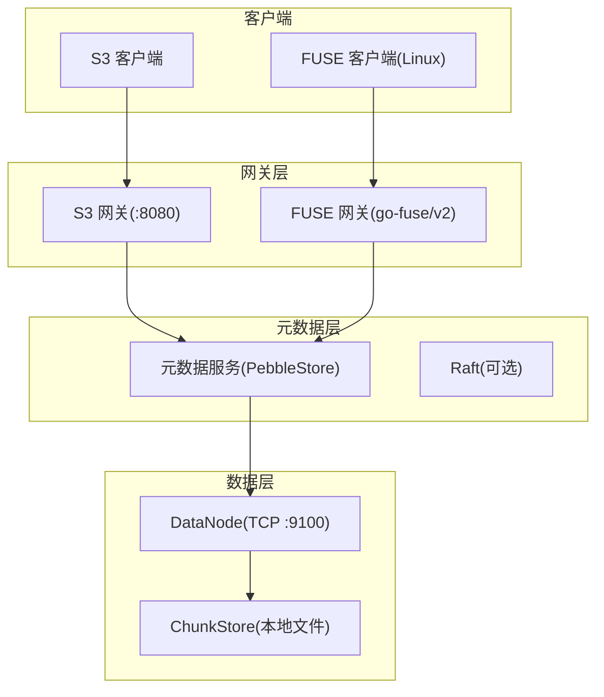
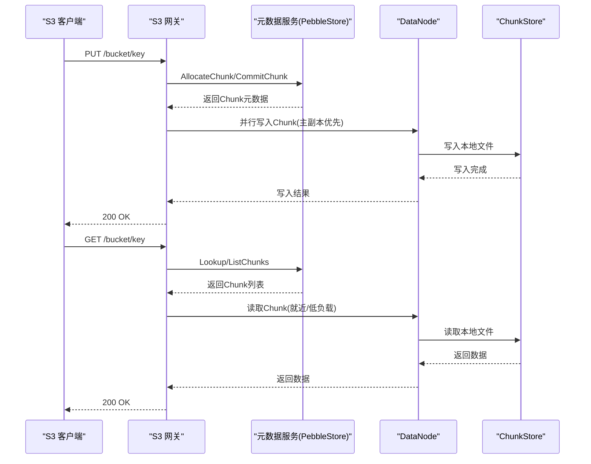
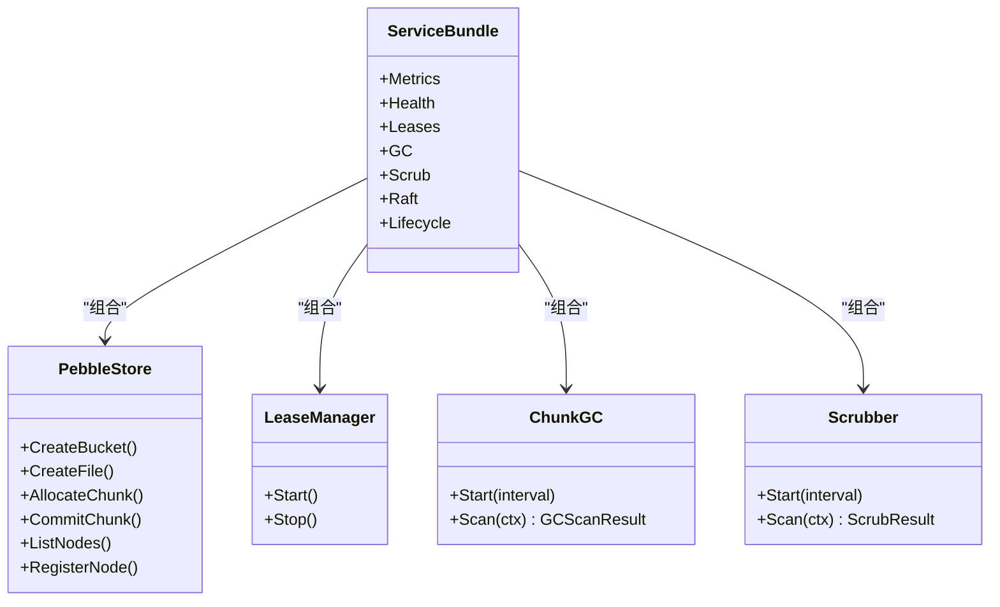
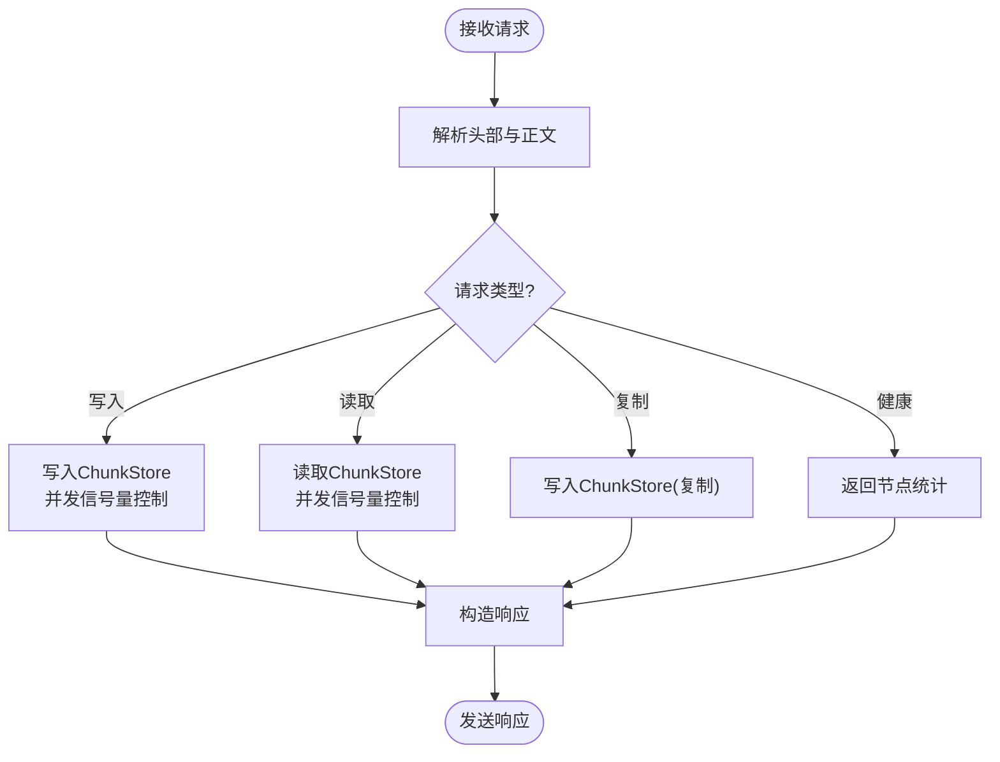
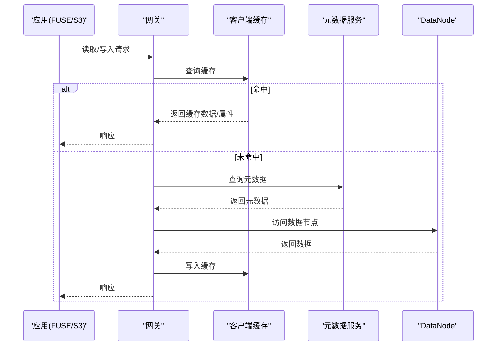
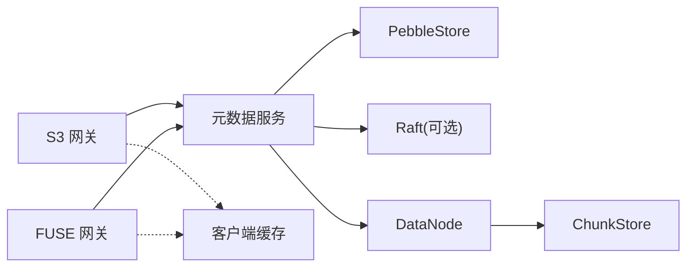

# 性能问题排查

<cite>
**本文引用的文件**
- [ARCHITECTURE.md](file://nufs-core/ARCHITECTURE.md)
- [go.mod](file://nufs-core/go.mod)
- [cmd/datanode/main.go](file://nufs-core/cmd/datanode/main.go)
- [cmd/metad/main.go](file://nufs-core/cmd/metad/main.go)
- [cmd/fusegw/main.go](file://nufs-core/cmd/fusegw/main.go)
- [cmd/s3gw/main.go](file://nufs-core/cmd/s3gw/main.go)
- [datanode/server.go](file://nufs-core/datanode/server.go)
- [datanode/chunkstore.go](file://nufs-core/datanode/chunkstore.go)
- [gateway/cache.go](file://nufs-core/gateway/cache.go)
- [gateway/s3/handler.go](file://nufs-core/gateway/s3/handler.go)
- [gateway/fuse/fs.go](file://nufs-core/gateway/fuse/fs.go)
- [metadata/service.go](file://nufs-core/metadata/service.go)
- [metadata/pebble_store.go](file://nufs-core/metadata/pebble_store.go)
- [metadata/production.go](file://nufs-core/metadata/production.go)
- [nufs-fuse/fs/metrics.go](file://nufs-fuse/fs/metrics.go)
</cite>

## 目录
1. [简介](#简介)
2. [项目结构](#项目结构)
3. [核心组件](#核心组件)
4. [架构总览](#架构总览)
5. [详细组件分析](#详细组件分析)
6. [依赖关系分析](#依赖关系分析)
7. [性能考量](#性能考量)
8. [故障排查指南](#故障排查指南)
9. [结论](#结论)
10. [附录](#附录)

## 简介
本文件面向NUFS分布式文件系统，聚焦于性能问题的识别与分析，覆盖I/O延迟、CPU使用率、内存占用、网络与存储瓶颈，并提供指标含义、阈值设定、工具使用与专项排查方法。内容基于代码库的实际实现，结合架构文档，帮助运维与开发人员快速定位问题并制定优化方案。

## 项目结构
NUFS由三层组成：网关层（S3/FUSE）、元数据层（Pebble+Raft）、数据层（DataNode）。各组件通过清晰的进程边界运行，便于独立监控与调优。

图表来源
- [ARCHITECTURE.md:37-115](file://nufs-core/ARCHITECTURE.md#L37-L115)
- [cmd/s3gw/main.go:18-62](file://nufs-core/cmd/s3gw/main.go#L18-L62)
- [cmd/fusegw/main.go:17-62](file://nufs-core/cmd/fusegw/main.go#L17-L62)
- [cmd/metad/main.go:21-149](file://nufs-core/cmd/metad/main.go#L21-L149)
- [cmd/datanode/main.go:19-133](file://nufs-core/cmd/datanode/main.go#L19-L133)

章节来源
- [ARCHITECTURE.md:25-115](file://nufs-core/ARCHITECTURE.md#L25-L115)
- [cmd/s3gw/main.go:18-91](file://nufs-core/cmd/s3gw/main.go#L18-L91)
- [cmd/fusegw/main.go:17-62](file://nufs-core/cmd/fusegw/main.go#L17-L62)
- [cmd/metad/main.go:21-149](file://nufs-core/cmd/metad/main.go#L21-L149)
- [cmd/datanode/main.go:19-133](file://nufs-core/cmd/datanode/main.go#L19-L133)

## 核心组件
- 元数据服务（PebbleStore）：基于Pebble LSM-Tree的KV存储，支持可选Raft共识；提供命名空间、Inode、Chunk、节点管理等接口。
- 数据节点（DataNode）：提供TCP协议的Chunk读写、复制、健康检查；内置ChunkStore本地文件存储与并发信号量控制。
- 网关层（S3/FUSE）：S3兼容HTTP API与FUSE POSIX挂载；内置客户端缓存（属性缓存、数据缓存、写缓冲）以降低后端压力。
- 生产子系统：事件总线、健康检查、租约管理、孤儿Chunk GC、数据清洗（静默损坏检测）、生命周期引擎等。

章节来源
- [metadata/service.go:16-135](file://nufs-core/metadata/service.go#L16-L135)
- [metadata/pebble_store.go:16-89](file://nufs-core/metadata/pebble_store.go#L16-L89)
- [datanode/server.go:18-63](file://nufs-core/datanode/server.go#L18-L63)
- [datanode/chunkstore.go:18-59](file://nufs-core/datanode/chunkstore.go#L18-L59)
- [gateway/cache.go:29-96](file://nufs-core/gateway/cache.go#L29-L96)

## 架构总览
下图展示典型写入与读取路径，以及关键性能相关组件位置。

图表来源
- [ARCHITECTURE.md:349-436](file://nufs-core/ARCHITECTURE.md#L349-L436)
- [gateway/s3/handler.go:70-166](file://nufs-core/gateway/s3/handler.go#L70-L166)
- [metadata/pebble_store.go:781-803](file://nufs-core/metadata/pebble_store.go#L781-L803)
- [datanode/server.go:130-179](file://nufs-core/datanode/server.go#L130-L179)
- [datanode/chunkstore.go:74-127](file://nufs-core/datanode/chunkstore.go#L74-L127)

## 详细组件分析

### 元数据服务（PebbleStore + 生产子系统）
- 关键职责：命名空间操作、Inode更新、Chunk分配/提交、节点注册/心跳、租约失效检测、孤儿Chunk GC、数据清洗、生命周期管理。
- 性能要点：
  - 写入路径通过Raft日志（可选）确保一致性，批量写入（Batch）保证原子性。
  - 租约管理定期扫描节点心跳，超时标记离线并触发修复。
  - GC扫描遍历Inode与Chunk，清理无引用孤儿Chunk。
  - Scrubber周期校验Chunk一致性，触发修复事件。
- 指标与可观测性：服务bundle包含Metrics、Health、EventBus等，支持/ready与/health探针及指标导出。

图表来源
- [metadata/pebble_store.go:16-89](file://nufs-core/metadata/pebble_store.go#L16-L89)
- [metadata/service.go:76-135](file://nufs-core/metadata/service.go#L76-L135)
- [metadata/production.go:220-303](file://nufs-core/metadata/production.go#L220-L303)
- [metadata/production.go:309-429](file://nufs-core/metadata/production.go#L309-L429)
- [metadata/production.go:435-554](file://nufs-core/metadata/production.go#L435-L554)

章节来源
- [metadata/pebble_store.go:16-89](file://nufs-core/metadata/pebble_store.go#L16-L89)
- [metadata/service.go:76-135](file://nufs-core/metadata/service.go#L76-L135)
- [metadata/production.go:220-303](file://nufs-core/metadata/production.go#L220-L303)
- [metadata/production.go:309-429](file://nufs-core/metadata/production.go#L309-L429)
- [metadata/production.go:435-554](file://nufs-core/metadata/production.go#L435-L554)

### 数据节点（DataNode）
- 关键职责：监听TCP端口，处理写/读/复制/健康检查请求；本地Chunk文件存储；并发读写信号量；心跳上报。
- 性能要点：
  - 请求采用长度前缀消息格式，最大头部64KB、最大Body 128MB，防止异常流量放大。
  - 读写均受并发信号量限制（默认最大并发读256、写64），避免资源争用导致抖动。
  - 写入包含CRC校验，读取返回校验和，保障数据一致性。
- 指标与可观测性：/health接口返回节点统计信息（总字节数、Chunk数量、容量）。

图表来源
- [datanode/server.go:102-271](file://nufs-core/datanode/server.go#L102-L271)
- [datanode/chunkstore.go:74-127](file://nufs-core/datanode/chunkstore.go#L74-L127)
- [datanode/chunkstore.go:169-227](file://nufs-core/datanode/chunkstore.go#L169-L227)

章节来源
- [datanode/server.go:18-63](file://nufs-core/datanode/server.go#L18-L63)
- [datanode/server.go:102-271](file://nufs-core/datanode/server.go#L102-L271)
- [datanode/chunkstore.go:18-59](file://nufs-core/datanode/chunkstore.go#L18-L59)
- [datanode/chunkstore.go:74-127](file://nufs-core/datanode/chunkstore.go#L74-L127)
- [datanode/chunkstore.go:169-227](file://nufs-core/datanode/chunkstore.go#L169-L227)

### 网关层（S3/FUSE）
- S3网关：基于net/http，中间件链（恢复、请求ID、CORS、日志、鉴权），路由到元数据与数据节点。
- FUSE网关：基于hanwen/go-fuse/v2，提供Linux POSIX挂载，支持目录/文件/符号链接与属性转换。
- 客户端缓存：属性缓存（TTL 5s）、数据缓存（TTL 50s）、写缓冲（默认500MB，10s定时刷新），显著降低后端压力。

图表来源
- [gateway/s3/handler.go:46-54](file://nufs-core/gateway/s3/handler.go#L46-L54)
- [gateway/cache.go:103-172](file://nufs-core/gateway/cache.go#L103-L172)
- [gateway/fuse/fs.go:36-56](file://nufs-core/gateway/fuse/fs.go#L36-L56)

章节来源
- [gateway/s3/handler.go:11-54](file://nufs-core/gateway/s3/handler.go#L11-L54)
- [gateway/cache.go:29-96](file://nufs-core/gateway/cache.go#L29-L96)
- [gateway/cache.go:103-172](file://nufs-core/gateway/cache.go#L103-L172)
- [gateway/fuse/fs.go:17-56](file://nufs-core/gateway/fuse/fs.go#L17-L56)

## 依赖关系分析
- 外部依赖：Pebble（LSM-Tree）、Raft（共识）、go-fuse/v2（FUSE）、Prometheus（指标导出）等。
- 内部耦合：网关层依赖元数据服务；元数据服务依赖Pebble；数据节点依赖元数据服务进行Chunk分配与状态上报；客户端缓存贯穿网关层以降低后端压力。

图表来源
- [go.mod:5-50](file://nufs-core/go.mod#L5-L50)
- [cmd/s3gw/main.go:30-52](file://nufs-core/cmd/s3gw/main.go#L30-L52)
- [cmd/fusegw/main.go:34-41](file://nufs-core/cmd/fusegw/main.go#L34-L41)
- [metadata/pebble_store.go:16-89](file://nufs-core/metadata/pebble_store.go#L16-L89)
- [datanode/server.go:18-63](file://nufs-core/datanode/server.go#L18-L63)
- [gateway/cache.go:29-96](file://nufs-core/gateway/cache.go#L29-L96)

章节来源
- [go.mod:5-50](file://nufs-core/go.mod#L5-L50)
- [cmd/s3gw/main.go:30-52](file://nufs-core/cmd/s3gw/main.go#L30-L52)
- [cmd/fusegw/main.go:34-41](file://nufs-core/cmd/fusegw/main.go#L34-L41)
- [metadata/pebble_store.go:16-89](file://nufs-core/metadata/pebble_store.go#L16-L89)
- [datanode/server.go:18-63](file://nufs-core/datanode/server.go#L18-L63)
- [gateway/cache.go:29-96](file://nufs-core/gateway/cache.go#L29-L96)

## 性能考量

### 性能指标与阈值建议
- 元数据层
  - /ready 与 /health：服务就绪与健康探针，用于滚动升级与负载均衡摘除。
  - 指标导出：/metrics（服务bundle暴露），包含运行时、操作计数、错误与重试等。
- 数据节点
  - /health：返回节点统计（总字节数、Chunk数量、容量），用于容量与负载评估。
  - TCP请求：最大头部64KB、最大Body 128MB，避免异常流量放大。
- 网关层
  - 客户端缓存：属性缓存TTL 5s、数据缓存TTL 50s；写缓冲500MB、10s定时刷新。
  - FUSE侧指标：活跃句柄数、各类操作计数、S3操作计数与错误/重试次数。

章节来源
- [cmd/metad/main.go:151-219](file://nufs-core/cmd/metad/main.go#L151-L219)
- [datanode/server.go:256-271](file://nufs-core/datanode/server.go#L256-L271)
- [gateway/cache.go:17-27](file://nufs-core/gateway/cache.go#L17-L27)
- [nufs-fuse/fs/metrics.go:172-229](file://nufs-fuse/fs/metrics.go#L172-L229)

### 性能监控与分析工具
- pprof：Go程序自带性能剖析工具，可用于CPU/内存热点定位与火焰图生成。
- 系统监控：结合Prometheus/Grafana采集/展示系统指标（CPU、内存、磁盘I/O、网络带宽）。
- 应用指标：利用服务bundle的Metrics与/ops/metrics接口输出业务指标，便于端到端追踪。

章节来源
- [go.mod:40-43](file://nufs-core/go.mod#L40-L43)
- [metadata/service.go:150-151](file://nufs-core/metadata/service.go#L150-L151)
- [cmd/metad/main.go:205-211](file://nufs-core/cmd/metad/main.go#L205-L211)

### 网络性能专项排查
- 症状：请求延迟高、吞吐下降、连接数激增。
- 排查步骤：
  - 检查S3/FUSE网关到元数据服务与数据节点的连通性与RTT。
  - 关注DataNode TCP请求大小限制（头部64KB、Body 128MB），避免超大请求导致拥塞。
  - 观察/health与/ready状态，确认节点健康与可用。
- 优化建议：
  - 合理设置客户端缓存（属性/数据/TTL），减少后端查询。
  - 控制并发写入（DataNode并发读写信号量），避免磁盘争用。

章节来源
- [datanode/server.go:281-337](file://nufs-core/datanode/server.go#L281-L337)
- [gateway/cache.go:17-27](file://nufs-core/gateway/cache.go#L17-L27)
- [cmd/datanode/main.go:33-46](file://nufs-core/cmd/datanode/main.go#L33-L46)

### 存储性能专项排查
- 症状：磁盘写入慢、读取抖动、Chunk写入失败。
- 排查步骤：
  - 检查ChunkStore写入/读取路径，关注并发信号量（默认写64、读256）。
  - 校验写入CRC与读取校验和，确认数据一致性。
  - 查看/health返回的总字节数与Chunk数量，评估容量与碎片情况。
- 优化建议：
  - 合理设置并发参数，避免过度并发导致磁盘寻道与写放大。
  - 对大文件采用分块写入与并行复制，缩短端到端延迟。

章节来源
- [datanode/chunkstore.go:74-127](file://nufs-core/datanode/chunkstore.go#L74-L127)
- [datanode/chunkstore.go:169-227](file://nufs-core/datanode/chunkstore.go#L169-L227)
- [datanode/server.go:256-271](file://nufs-core/datanode/server.go#L256-L271)
- [cmd/datanode/main.go:33-46](file://nufs-core/cmd/datanode/main.go#L33-L46)

### 计算性能专项排查
- 症状：CPU使用率高、GC频繁、协程/线程阻塞。
- 排查步骤：
  - 使用pprof采集CPU/Heap/阻塞/互斥剖析，定位热点函数与内存分配。
  - 关注元数据层批量写入（Batch）与Raft日志提交开销。
  - 检查客户端缓存命中率，低命中率会导致频繁后端查询。
- 优化建议：
  - 调整客户端缓存大小与TTL，提升缓存命中。
  - 优化批处理与并发参数，减少上下文切换与锁竞争。

章节来源
- [metadata/pebble_store.go:149-156](file://nufs-core/metadata/pebble_store.go#L149-L156)
- [metadata/production.go:309-429](file://nufs-core/metadata/production.go#L309-L429)
- [gateway/cache.go:17-27](file://nufs-core/gateway/cache.go#L17-L27)

## 故障排查指南

### 常见性能问题根因与优化
- I/O延迟高
  - 根因：磁盘随机读写、并发过大、缓存未命中。
  - 优化：增大客户端缓存、调整并发读写信号量、合并小文件（小文件优化已在架构中定义）。
- CPU使用率过高
  - 根因：热点函数、频繁GC、锁争用。
  - 优化：使用pprof定位热点，减少分配与锁持有时间，优化批处理。
- 内存泄漏/增长
  - 根因：缓存未清理、长生命周期对象未释放。
  - 优化：检查客户端缓存与写缓冲清理逻辑，确保关闭流程触发最终flush。
- 网络拥塞
  - 根因：请求过大、连接数过多、后端不可用。
  - 优化：限制请求大小、控制并发、启用/health与/ready探针配合LB摘除。

章节来源
- [gateway/cache.go:204-221](file://nufs-core/gateway/cache.go#L204-L221)
- [datanode/server.go:281-337](file://nufs-core/datanode/server.go#L281-L337)
- [cmd/metad/main.go:151-219](file://nufs-core/cmd/metad/main.go#L151-L219)

### 专项排查流程示例
- 元数据写入延迟高
  - 步骤：检查/ready与/health，确认Raft状态与Leader；观察批处理写入耗时；评估租约与GC扫描频率。
  - 指标：/metrics中的操作计数与错误/重试。
- 数据节点读取抖动
  - 步骤：查看/health统计；确认ChunkStore并发信号量；核对读取路径与校验和。
  - 指标：活跃句柄数、S3读取计数与错误。
- 网关缓存命中低
  - 步骤：检查属性/数据缓存TTL与大小；评估写缓冲触发条件；对比冷热数据比例。
  - 指标：FUSE侧活跃句柄与S3读取计数。

章节来源
- [cmd/metad/main.go:151-219](file://nufs-core/cmd/metad/main.go#L151-L219)
- [datanode/server.go:256-271](file://nufs-core/datanode/server.go#L256-L271)
- [gateway/cache.go:103-172](file://nufs-core/gateway/cache.go#L103-L172)
- [nufs-fuse/fs/metrics.go:172-229](file://nufs-fuse/fs/metrics.go#L172-L229)

## 结论
NUFS通过清晰的分层架构与可观测性设计，为性能问题排查提供了明确抓手。建议以“指标先行、工具辅助、分层定位”为核心策略：先看/ready与/health，再结合pprof与系统监控，最后落到具体组件的并发、缓存与I/O参数调优。针对网络、存储与计算三类瓶颈，分别采取连接/协议优化、缓存与并发控制、热点与内存优化等手段，可有效提升整体性能与稳定性。

## 附录

### 性能相关配置与参数速览
- DataNode并发参数（默认）
  - 最大并发写：64
  - 最大并发读：256
- 客户端缓存（默认）
  - 缓存大小：1GB
  - 属性TTL：5s
  - 数据TTL：50s
  - 写缓冲：500MB
  - 刷新间隔：10s
- DataNode TCP请求限制
  - 头部最大：64KB
  - Body最大：128MB

章节来源
- [cmd/datanode/main.go:33-46](file://nufs-core/cmd/datanode/main.go#L33-L46)
- [gateway/cache.go:17-27](file://nufs-core/gateway/cache.go#L17-L27)
- [datanode/server.go:281-337](file://nufs-core/datanode/server.go#L281-L337)