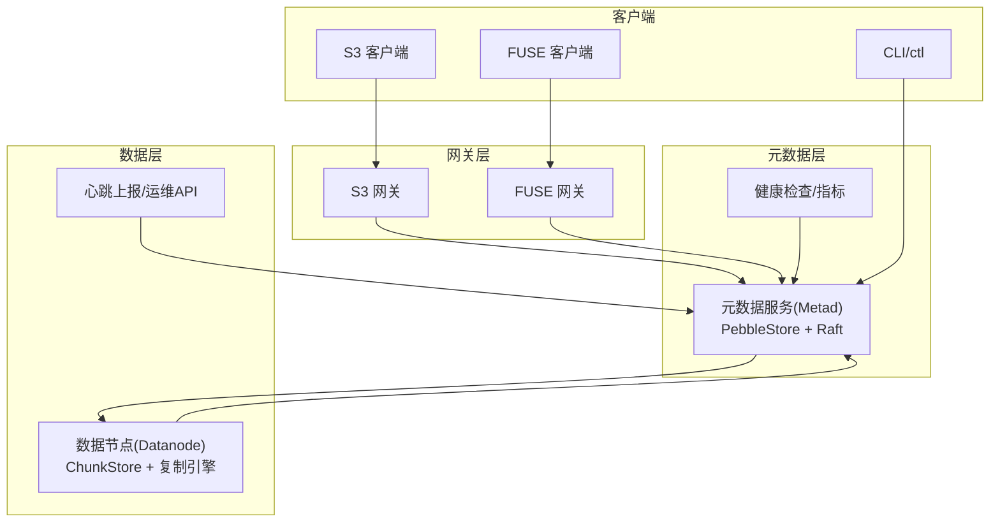
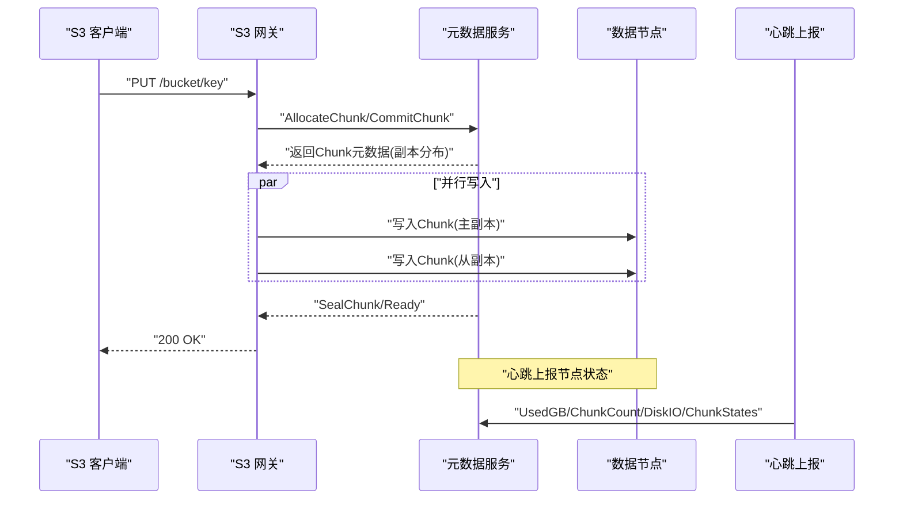
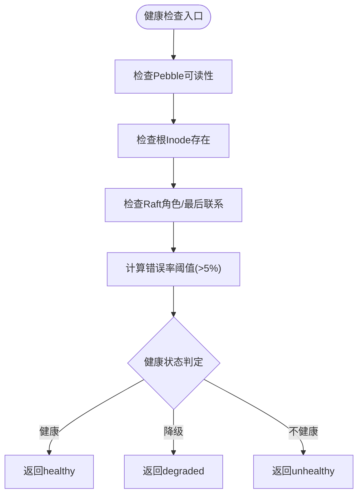
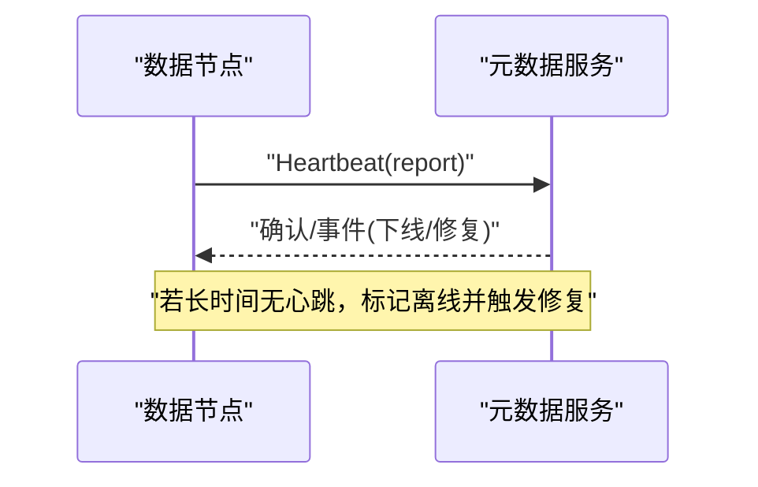
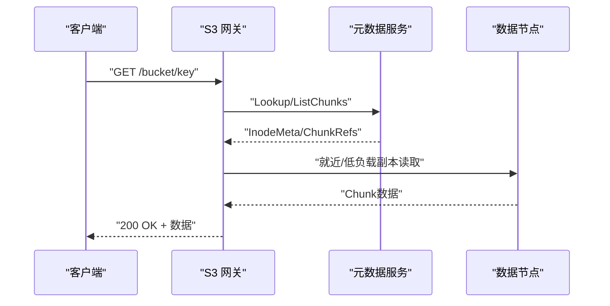
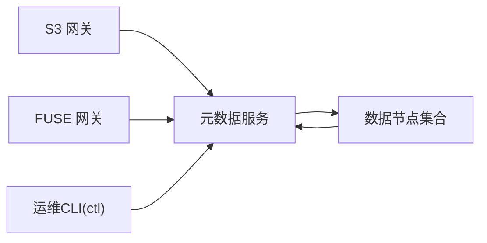
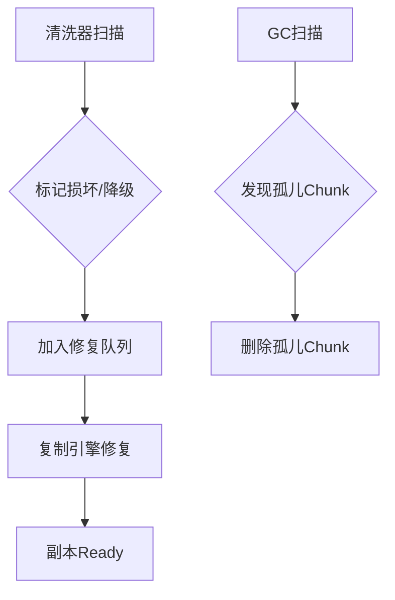

# 故障排除

<cite>
**本文引用的文件**
- [ARCHITECTURE.md](file://nufs-core/ARCHITECTURE.md)
- [TODO.md](file://nufs-core/TODO.md)
- [cmd/ctl/main.go](file://nufs-core/cmd/ctl/main.go)
- [cmd/datanode/main.go](file://nufs-core/cmd/datanode/main.go)
- [cmd/metad/main.go](file://nufs-core/cmd/metad/main.go)
- [metadata/errors.go](file://nufs-core/metadata/errors.go)
- [metadata/health.go](file://nufs-core/metadata/health.go)
- [metadata/service.go](file://nufs-core/metadata/service.go)
- [datanode/server.go](file://nufs-core/datanode/server.go)
- [datanode/heartbeat.go](file://nufs-core/datanode/heartbeat.go)
- [datanode/ops.go](file://nufs-core/datanode/ops.go)
- [gateway/s3/handler.go](file://nufs-core/gateway/s3/handler.go)
- [gateway/fuse/fs.go](file://nufs-core/gateway/fuse/fs.go)
- [deploy/config/cluster.yaml](file://nufs-core/deploy/config/cluster.yaml)
</cite>

## 目录
1. [简介](#简介)
2. [项目结构](#项目结构)
3. [核心组件](#核心组件)
4. [架构总览](#架构总览)
5. [详细组件分析](#详细组件分析)
6. [依赖分析](#依赖分析)
7. [性能考虑](#性能考虑)
8. [故障排除指南](#故障排除指南)
9. [结论](#结论)
10. [附录](#附录)

## 简介
本手册面向NUFS分布式文件系统的运维与平台工程团队，提供系统化的故障诊断与应急处置流程。内容覆盖网络、存储、性能、配置等维度的常见问题定位方法，结合内置健康检查、指标采集与运维CLI工具，帮助快速识别异常、定位根因并实施修复与恢复。

## 项目结构
NUFS由三层网关（S3/FUSE/CLI）、元数据服务（Pebble+Raft）、数据节点（Chunk存储+复制）构成。部署配置集中于集群配置文件，支持单机开发、Docker Compose与Kubernetes等多种模式。

**图表来源**
- [ARCHITECTURE.md:37-101](file://nufs-core/ARCHITECTURE.md#L37-L101)
- [cmd/metad/main.go:108-127](file://nufs-core/cmd/metad/main.go#L108-L127)
- [cmd/datanode/main.go:94-123](file://nufs-core/cmd/datanode/main.go#L94-L123)

**章节来源**
- [ARCHITECTURE.md:25-116](file://nufs-core/ARCHITECTURE.md#L25-L116)
- [deploy/config/cluster.yaml:1-62](file://nufs-core/deploy/config/cluster.yaml#L1-L62)

## 核心组件
- 元数据服务（Metad）
  - 基于Pebble KV + 可选Raft共识，提供命名空间、Inode、Chunk、节点与修复/再平衡等能力。
  - 提供健康检查、指标导出、运维HTTP API。
- 数据节点（Datanode）
  - 本地Chunk存储、TCP读写/复制协议、心跳上报、运维HTTP API。
- 网关层
  - S3兼容REST与FUSE POSIX挂载，内置中间件链与节点列表刷新。
- 运维CLI（ctl）
  - 节点/桶/再平衡/修复队列/Leader查询等运维命令。

**章节来源**
- [metadata/service.go:16-67](file://nufs-core/metadata/service.go#L16-L67)
- [metadata/health.go:16-94](file://nufs-core/metadata/health.go#L16-L94)
- [cmd/metad/main.go:108-127](file://nufs-core/cmd/metad/main.go#L108-L127)
- [cmd/datanode/main.go:94-123](file://nufs-core/cmd/datanode/main.go#L94-L123)
- [cmd/ctl/main.go:42-65](file://nufs-core/cmd/ctl/main.go#L42-L65)

## 架构总览
下图展示典型写入/读取路径与复制修复流程，便于定位端到端故障点。

**图表来源**
- [ARCHITECTURE.md:349-383](file://nufs-core/ARCHITECTURE.md#L349-L383)
- [datanode/heartbeat.go:71-100](file://nufs-core/datanode/heartbeat.go#L71-L100)

## 详细组件分析

### 元数据服务（健康检查与指标）
- 健康检查
  - /health：综合Pebble可读性、根Inode存在、Raft状态、错误率阈值判断健康状态。
  - /ready：服务就绪探测。
  - /metrics：导出运行时指标快照。
- 指标
  - 操作总数/读写次数、错误计数、延迟直方图（P50/P99）、键/Chunk/节点/桶数量、Raft状态/任期/日志索引、快照次数等。

**图表来源**
- [metadata/health.go:218-290](file://nufs-core/metadata/health.go#L218-L290)

**章节来源**
- [metadata/health.go:16-116](file://nufs-core/metadata/health.go#L16-L116)
- [cmd/metad/main.go:152-221](file://nufs-core/cmd/metad/main.go#L152-L221)

### 数据节点（TCP协议与心跳）
- TCP协议
  - 请求头包含类型、校验和、偏移/长度等；响应统一JSON格式。
  - 支持写/读/删除/复制/Chunk信息/列举/健康检查等。
- 心跳上报
  - 定期上报已用容量、Chunk数量、磁盘IO与各Chunk副本状态，用于元数据侧租约与修复触发。

**图表来源**
- [datanode/server.go:103-126](file://nufs-core/datanode/server.go#L103-L126)
- [datanode/heartbeat.go:71-100](file://nufs-core/datanode/heartbeat.go#L71-L100)

**章节来源**
- [datanode/server.go:18-126](file://nufs-core/datanode/server.go#L18-L126)
- [datanode/heartbeat.go:12-107](file://nufs-core/datanode/heartbeat.go#L12-L107)

### 网关层（S3/FUSE）
- S3网关
  - 路由到具体Bucket/Object操作，内置中间件链（恢复/请求ID/CORS/日志/鉴权）。
  - 定期刷新在线数据节点列表，选择就近/低负载副本读取。
- FUSE网关
  - 基于go-fuse，提供DFS根文件系统、目录/文件/符号链接映射与属性转换。

**图表来源**
- [gateway/s3/handler.go:70-166](file://nufs-core/gateway/s3/handler.go#L70-L166)
- [ARCHITECTURE.md:384-411](file://nufs-core/ARCHITECTURE.md#L384-L411)

**章节来源**
- [gateway/s3/handler.go:11-68](file://nufs-core/gateway/s3/handler.go#L11-L68)
- [gateway/fuse/fs.go:17-71](file://nufs-core/gateway/fuse/fs.go#L17-L71)

### 运维CLI（ctl）
- 节点列表、桶列表、再平衡计划、节点下线（退役）、修复队列、触发再平衡、Leader信息等。
- 通过直接连接元数据后端进行运维操作。

**章节来源**
- [cmd/ctl/main.go:42-65](file://nufs-core/cmd/ctl/main.go#L42-L65)
- [cmd/ctl/main.go:86-123](file://nufs-core/cmd/ctl/main.go#L86-L123)
- [cmd/ctl/main.go:125-140](file://nufs-core/cmd/ctl/main.go#L125-L140)
- [cmd/ctl/main.go:142-169](file://nufs-core/cmd/ctl/main.go#L142-L169)
- [cmd/ctl/main.go:171-182](file://nufs-core/cmd/ctl/main.go#L171-L182)
- [cmd/ctl/main.go:184-204](file://nufs-core/cmd/ctl/main.go#L184-L204)
- [cmd/ctl/main.go:206-221](file://nufs-core/cmd/ctl/main.go#L206-L221)

## 依赖分析
- 组件耦合
  - 网关层依赖元数据服务接口；数据节点依赖元数据服务进行节点注册、心跳、Chunk状态上报。
  - 元数据服务内部组合事件总线、健康检查、租约、GC、清洗器、生命周期引擎等子系统。
- 外部依赖
  - 元数据：Pebble KV存储；可选Raft共识。
  - 数据：本地文件系统Chunk存储；复制引擎；磁盘管理。
  - 网关：S3兼容HTTP；FUSE Linux挂载。

**图表来源**
- [metadata/service.go:76-93](file://nufs-core/metadata/service.go#L76-L93)
- [cmd/ctl/main.go:27-34](file://nufs-core/cmd/ctl/main.go#L27-L34)

**章节来源**
- [metadata/service.go:76-135](file://nufs-core/metadata/service.go#L76-L135)

## 性能考虑
- 元数据延迟
  - 读延迟直方图与错误率阈值用于识别异常增长。
- 数据路径
  - 读取路径支持就近/低负载副本选择与客户端缓存，降低网络与存储压力。
- 指标目标
  - 写入QPS、缓存命中延迟、网络读延迟、小文件元数据密度、跨城复制延迟、可用性与持久性目标。

**章节来源**
- [metadata/health.go:16-116](file://nufs-core/metadata/health.go#L16-L116)
- [ARCHITECTURE.md:537-586](file://nufs-core/ARCHITECTURE.md#L537-L586)
- [TODO.md:183-194](file://nufs-core/TODO.md#L183-L194)

## 故障排除指南

### 一、常见问题诊断与日志分析方法
- 元数据服务不可用
  - 检查 /health 与 /ready 是否返回健康状态；关注错误率阈值与Raft状态。
  - 若非Leader模式且长时间无多数派通信，可能处于分区状态。
- 数据节点不可达
  - 检查数据节点TCP监听与Server启动日志；确认心跳是否上报成功。
  - 若长时间无心跳，元数据侧会标记离线并触发修复。
- 网关层错误
  - S3网关中间件链输出请求ID与错误码；检查鉴权、CORS与路由匹配。
  - FUSE挂载失败需检查内核版本与挂载选项。

**章节来源**
- [metadata/health.go:218-290](file://nufs-core/metadata/health.go#L218-L290)
- [cmd/metad/main.go:152-221](file://nufs-core/cmd/metad/main.go#L152-L221)
- [datanode/server.go:36-51](file://nufs-core/datanode/server.go#L36-L51)
- [datanode/heartbeat.go:38-69](file://nufs-core/datanode/heartbeat.go#L38-L69)
- [gateway/s3/handler.go:45-54](file://nufs-core/gateway/s3/handler.go#L45-L54)

### 二、性能问题排查
- 读延迟升高
  - 检查元数据/数据节点指标（读P99us、错误率）；确认是否存在大量错误导致降级。
  - 核对网关侧就近/低负载副本选择是否生效。
- 写吞吐不足
  - 检查数据节点复制引擎与磁盘IO利用率；关注磁盘使用率阈值。
  - 确认写缓冲与异步刷盘策略是否正常。

**章节来源**
- [metadata/health.go:72-94](file://nufs-core/metadata/health.go#L72-L94)
- [datanode/ops.go:254-270](file://nufs-core/datanode/ops.go#L254-L270)

### 三、数据恢复流程
- 损坏检测与修复
  - 清洗器定期扫描Chunk状态，标记损坏并发布修复事件；修复队列驱动复制引擎进行修复。
- 孤儿Chunk清理
  - GC扫描未被引用的Chunk并删除（dry-run模式可用于预检）。
- 再平衡
  - 当集群不平衡超过阈值时，生成迁移计划并执行；可通过CLI触发或自动调度。

**图表来源**
- [ARCHITECTURE.md:235-246](file://nufs-core/ARCHITECTURE.md#L235-L246)
- [ARCHITECTURE.md:224-233](file://nufs-core/ARCHITECTURE.md#L224-L233)

**章节来源**
- [metadata/health.go:218-290](file://nufs-core/metadata/health.go#L218-L290)
- [cmd/ctl/main.go:184-204](file://nufs-core/cmd/ctl/main.go#L184-L204)
- [cmd/ctl/main.go:206-212](file://nufs-core/cmd/ctl/main.go#L206-L212)

### 四、网络问题
- 症状
  - S3/FUSE请求超时或错误；网关路由失败。
- 诊断
  - 检查网关中间件链日志与请求ID；确认数据节点列表刷新是否成功。
  - 核对路由规则与CORS配置。
- 处置
  - 临时绕过鉴权或调整CORS白名单；修复网络连通性后重试。

**章节来源**
- [gateway/s3/handler.go:45-68](file://nufs-core/gateway/s3/handler.go#L45-L68)
- [gateway/s3/handler.go:81-166](file://nufs-core/gateway/s3/handler.go#L81-L166)

### 五、存储问题
- 症状
  - 写入失败、Chunk校验和不匹配、磁盘使用率过高。
- 诊断
  - 检查数据节点TCP写入响应与校验和字段；查看心跳上报的磁盘使用率。
  - 通过运维API获取磁盘/缓存/复制/反熵统计。
- 处置
  - 清理磁盘空间；必要时下线节点并迁移数据；启用GC/修复队列。

**章节来源**
- [datanode/server.go:130-156](file://nufs-core/datanode/server.go#L130-L156)
- [datanode/heartbeat.go:71-100](file://nufs-core/datanode/heartbeat.go#L71-L100)
- [datanode/ops.go:254-291](file://nufs-core/datanode/ops.go#L254-L291)

### 六、配置问题
- 症状
  - 节点无法注册、心跳失败、复制策略异常。
- 诊断
  - 检查集群配置文件中的节点ID、监听地址、容量、拓扑与复制参数。
  - 确认元数据/数据节点启动参数与配置一致。
- 处置
  - 修正配置后重启对应进程；使用ctl验证节点状态与再平衡计划。

**章节来源**
- [deploy/config/cluster.yaml:1-62](file://nufs-core/deploy/config/cluster.yaml#L1-L62)
- [cmd/datanode/main.go:20-47](file://nufs-core/cmd/datanode/main.go#L20-L47)
- [cmd/metad/main.go:22-37](file://nufs-core/cmd/metad/main.go#L22-L37)

### 七、错误类型与含义
- 命名空间/桶/Chunk/节点/一致性/系统类错误
  - 包括桶已存在/不存在、目录项不存在、Chunk未封存、节点离线、版本冲突、超时等。
- 处理建议
  - 对重复创建/删除类错误，先确认状态再重试；对版本冲突类错误，按提示重试并携带最新版本。
  - 对节点离线/不可用，先检查心跳与网络，再触发修复或再平衡。

**章节来源**
- [metadata/errors.go:12-90](file://nufs-core/metadata/errors.go#L12-L90)

### 八、系统监控指标异常识别
- 关键指标
  - 元数据：读P99us、写P99us、错误率、Raft状态/任期/日志索引。
  - 数据节点：磁盘使用率、Chunk数量、复制写入/错误/平均延迟、反熵扫描/不一致/修复数。
- 异常识别
  - 错误率>5%视为降级；磁盘使用率接近阈值视为潜在风险；复制延迟异常需检查网络与磁盘IO。

**章节来源**
- [metadata/health.go:72-116](file://nufs-core/metadata/health.go#L72-L116)
- [datanode/ops.go:236-270](file://nufs-core/datanode/ops.go#L236-L270)

### 九、故障定位技巧与根因分析
- 逐步缩小范围
  - 先看网关层日志与请求ID，再查元数据健康与指标，最后落到数据节点磁盘与复制。
- 事件驱动
  - 关注租约过期、节点离线、修复队列、再平衡计划等事件，这些往往是根因触发点。
- 配置一致性
  - 核对集群配置与各组件启动参数，确保拓扑、容量、复制因子一致。

**章节来源**
- [metadata/health.go:218-290](file://nufs-core/metadata/health.go#L218-L290)
- [ARCHITECTURE.md:537-578](file://nufs-core/ARCHITECTURE.md#L537-L578)

### 十、数据恢复流程（步骤化）
- 步骤1：确认状态
  - 使用ctl查看节点/桶/修复队列/Leader状态。
- 步骤2：触发修复
  - 若存在损坏/降级Chunk，检查修复队列并等待复制引擎自动修复，或手动触发再平衡。
- 步骤3：清理孤儿
  - 在dry-run模式下评估孤儿Chunk数量，确认无误后执行删除。
- 步骤4：容量与健康
  - 监控磁盘使用率与健康检查状态，必要时扩容或迁移数据。

**章节来源**
- [cmd/ctl/main.go:184-221](file://nufs-core/cmd/ctl/main.go#L184-L221)
- [ARCHITECTURE.md:224-246](file://nufs-core/ARCHITECTURE.md#L224-L246)

### 十一、备份策略与灾难恢复
- 备份
  - 元数据：Pebble快照与Raft日志定期备份；快照阈值与保留策略按架构文档配置。
  - 数据：Chunk文件作为对象存储的副本，配合跨机房复制策略。
- 灾难恢复
  - 元数据：从最近快照恢复，必要时回放日志；确保多数派节点可用。
  - 数据：通过修复队列与再平衡恢复副本一致性；跨机房场景按异步多活方案切换与增量同步。

**章节来源**
- [ARCHITECTURE.md:169-174](file://nufs-core/ARCHITECTURE.md#L169-L174)
- [ARCHITECTURE.md:729-761](file://nufs-core/ARCHITECTURE.md#L729-L761)

## 结论
本手册提供了NUFS从网关到元数据再到数据节点的全链路故障排除方法，并结合健康检查、指标与运维CLI形成闭环。建议在生产环境中启用健康探针与指标导出，建立告警阈值与演练流程，确保问题早发现、早定位、早恢复。

## 附录
- 常用运维命令
  - 列出节点/桶/再平衡计划/修复队列/触发再平衡/Leader查询。
- 部署模式
  - 单机开发、Docker Compose、Kubernetes；按集群配置文件调整参数。

**章节来源**
- [cmd/ctl/main.go:68-84](file://nufs-core/cmd/ctl/main.go#L68-L84)
- [deploy/config/cluster.yaml:1-62](file://nufs-core/deploy/config/cluster.yaml#L1-L62)