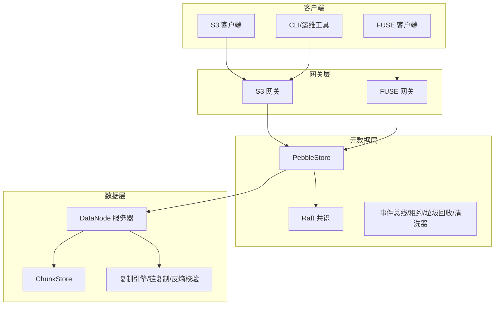
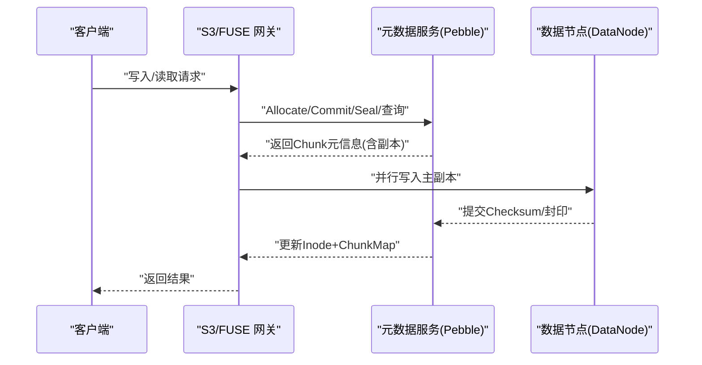
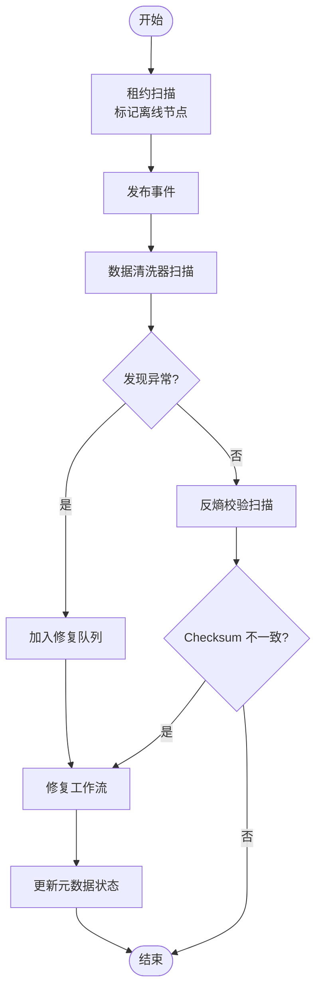
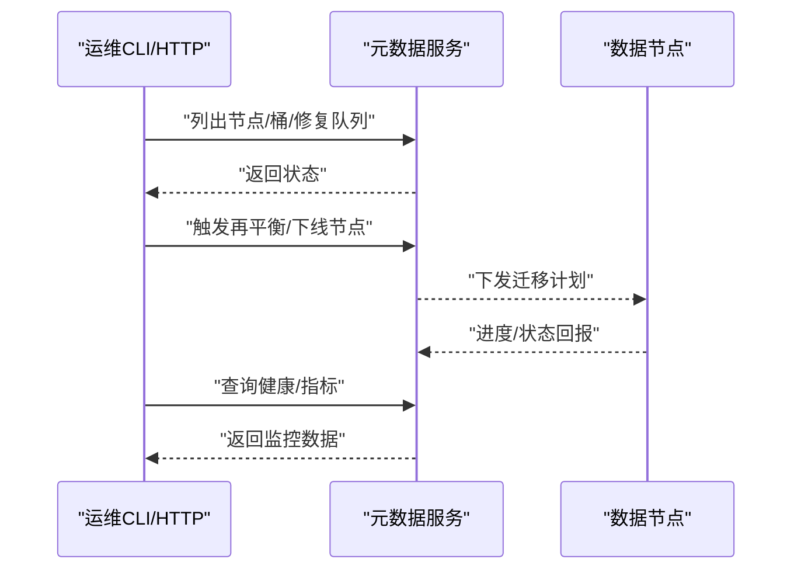
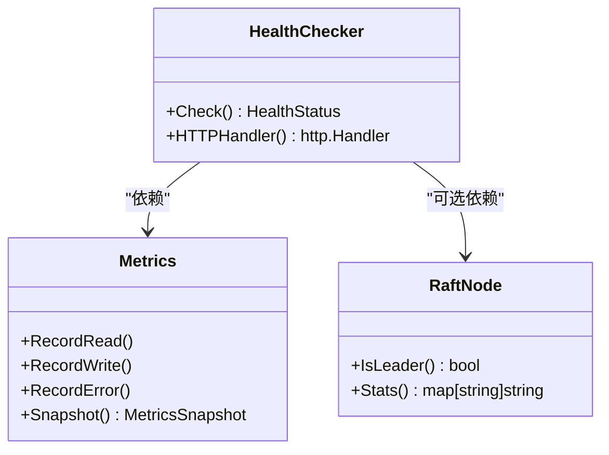
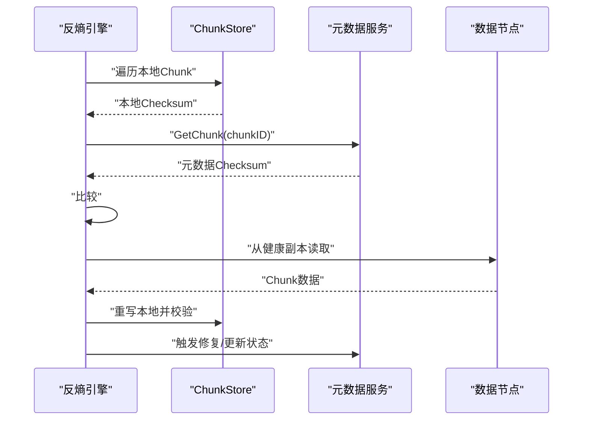
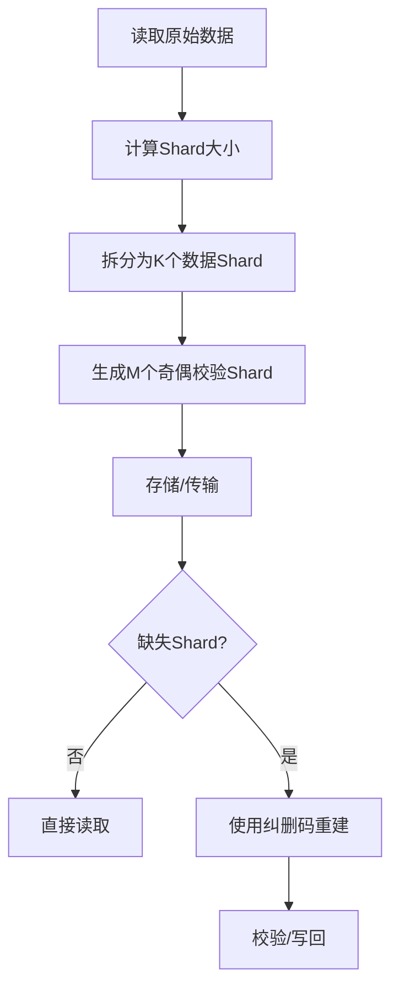
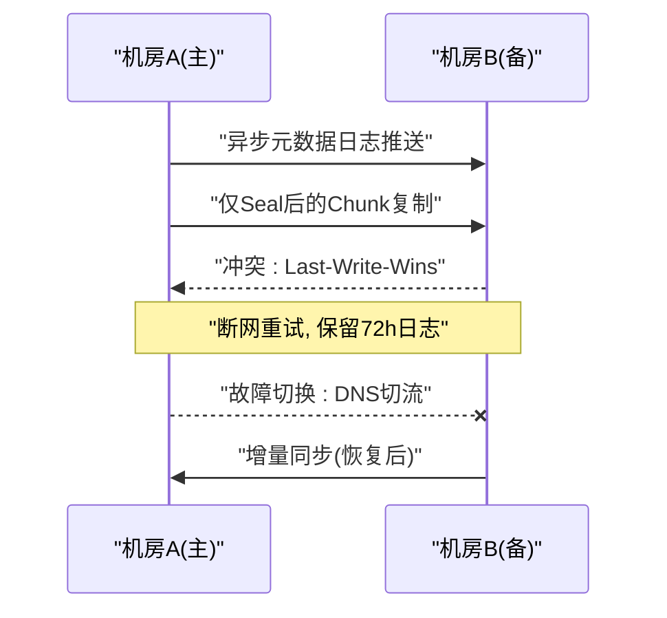
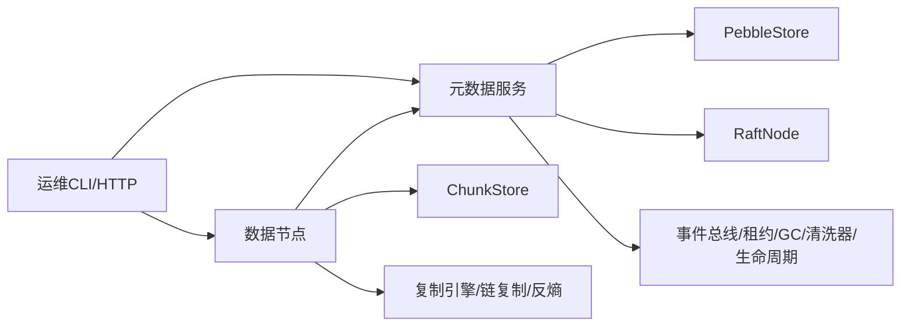

# 数据恢复流程

<cite>
**本文引用的文件**
- [ARCHITECTURE.md](file://nufs-core/ARCHITECTURE.md)
- [service.go](file://nufs-core/metadata/service.go)
- [repair.go](file://nufs-core/datanode/repair.go)
- [ec.go](file://nufs-core/metadata/ec.go)
- [ha.go](file://nufs-core/datanode/ha.go)
- [health.go](file://nufs-core/metadata/health.go)
- [production.go](file://nufs-core/metadata/production.go)
- [ops.go](file://nufs-core/datanode/ops.go)
- [main.go](file://nufs-core/cmd/ctl/main.go)
- [cluster.yaml](file://nufs-core/deploy/config/cluster.yaml)
- [errors.go](file://nufs-core/metadata/errors.go)
- [docker-compose.yml](file://nufs-core/docker-compose.yml)
</cite>

## 目录
1. [简介](#简介)
2. [项目结构](#项目结构)
3. [核心组件](#核心组件)
4. [架构总览](#架构总览)
5. [详细组件分析](#详细组件分析)
6. [依赖关系分析](#依赖关系分析)
7. [性能考量](#性能考量)
8. [故障排查指南](#故障排查指南)
9. [结论](#结论)
10. [附录](#附录)

## 简介
本文件面向NUFS分布式文件系统，围绕“数据丢失、损坏与不一致”的恢复主题，系统化梳理自动修复机制与手动干预流程，给出备份策略与恢复演练步骤，并明确不同场景下的恢复优先级与最佳实践。内容覆盖元数据恢复、数据节点恢复以及跨区域数据同步的完整流程，并提供恢复过程中的监控指标与验证方法。

## 项目结构
NUFS采用分层架构：网关层（S3/FUSE）、元数据层（Pebble+Raft）、数据层（DataNode）。运维侧通过管理API与CLI工具进行集群状态查询、修复触发与再平衡操作；同时内置健康检查、指标与纠删码等能力保障可靠性。

**图表来源**
- [ARCHITECTURE.md:37-101](file://nufs-core/ARCHITECTURE.md#L37-L101)

**章节来源**
- [ARCHITECTURE.md:25-116](file://nufs-core/ARCHITECTURE.md#L25-L116)

## 核心组件
- 元数据服务与生产子系统：提供统一元数据接口、事件总线、租约管理、孤儿Chunk GC、数据清洗器、Raft共识与生命周期引擎。
- 数据节点与修复：包含链复制、反熵校验、修复工作流、运维HTTP API与健康检查。
- 纠删码：提供K+M纠删码编码/解码与校验，支撑数据持久性。
- 运维与监控：健康检查、指标收集、运维HTTP接口、CLI工具。

**章节来源**
- [service.go:16-67](file://nufs-core/metadata/service.go#L16-L67)
- [service.go:76-135](file://nufs-core/metadata/service.go#L76-L135)
- [repair.go:13-49](file://nufs-core/datanode/repair.go#L13-L49)
- [ha.go:31-80](file://nufs-core/datanode/ha.go#L31-L80)
- [ec.go:13-34](file://nufs-core/metadata/ec.go#L13-L34)
- [health.go:16-51](file://nufs-core/metadata/health.go#L16-L51)
- [ops.go:19-71](file://nufs-core/datanode/ops.go#L19-L71)

## 架构总览
系统通过“写入即复制”与“一致性哈希分片”实现高可用；元数据采用Pebble+Raft保证强一致与可恢复；数据层以多副本与纠删码增强持久性；运维侧提供健康检查、指标、修复队列与再平衡能力。

**图表来源**
- [ARCHITECTURE.md:349-383](file://nufs-core/ARCHITECTURE.md#L349-L383)

**章节来源**
- [ARCHITECTURE.md:537-586](file://nufs-core/ARCHITECTURE.md#L537-L586)

## 详细组件分析

### 自动修复机制（元数据/数据层）
- 租约与节点离线检测：定期扫描节点心跳，超过TTL标记离线并发布事件，驱动后续修复。
- 数据清洗器：周期性扫描Chunk，检测无副本、无健康副本、Sealed但无Checksum等异常，发布修复事件并触发修复队列。
- 修复工作流：从健康副本读取数据，向新节点写入并更新元数据状态；支持统计修复成功/失败次数。
- 反熵校验：对比本地Checksum与元数据Checksum，发现不一致则触发修复。
- 纠删码：提供编码/解码与校验，支持部分数据/奇偶校验缺失时的重建。

**图表来源**
- [production.go:220-303](file://nufs-core/metadata/production.go#L220-L303)
- [production.go:435-528](file://nufs-core/metadata/production.go#L435-L528)
- [repair.go:98-182](file://nufs-core/datanode/repair.go#L98-L182)
- [ha.go:285-342](file://nufs-core/datanode/ha.go#L285-L342)

**章节来源**
- [production.go:220-303](file://nufs-core/metadata/production.go#L220-L303)
- [production.go:435-528](file://nufs-core/metadata/production.go#L435-L528)
- [repair.go:98-182](file://nufs-core/datanode/repair.go#L98-L182)
- [ha.go:285-342](file://nufs-core/datanode/ha.go#L285-L342)

### 手动干预流程（运维CLI/HTTP API）
- CLI工具：列出节点、桶、查看修复队列、触发再平衡、查看Raft Leader等。
- 运维HTTP API：节点列表、桶列表、修复队列、GC扫描、健康检查、指标查询、节点下线等。
- 下线与再平衡：通过元数据接口标记节点下线，触发再平衡计划并迁移Chunk。

**图表来源**
- [main.go:42-66](file://nufs-core/cmd/ctl/main.go#L42-L66)
- [ops.go:135-298](file://nufs-core/datanode/ops.go#L135-L298)
- [service.go:51-67](file://nufs-core/metadata/service.go#L51-L67)

**章节来源**
- [main.go:42-66](file://nufs-core/cmd/ctl/main.go#L42-L66)
- [ops.go:135-298](file://nufs-core/datanode/ops.go#L135-L298)
- [service.go:51-67](file://nufs-core/metadata/service.go#L51-L67)

### 元数据恢复（Pebble+Raft）
- 共识与快照：支持Raft多数派共识与快照恢复，按固定阈值生成快照并保留尾随日志，避免OOM。
- 健康检查：提供/health、/ready、/metrics端点，输出服务状态、角色、版本、运行时指标。
- 错误分类：结构化错误码，便于程序化处理与告警。

**图表来源**
- [health.go:200-290](file://nufs-core/metadata/health.go#L200-L290)
- [health.go:16-51](file://nufs-core/metadata/health.go#L16-L51)

**章节来源**
- [health.go:16-51](file://nufs-core/metadata/health.go#L16-L51)
- [health.go:200-290](file://nufs-core/metadata/health.go#L200-L290)
- [errors.go:12-43](file://nufs-core/metadata/errors.go#L12-L43)

### 数据节点恢复（副本修复/链复制/反熵）
- 链复制：写路径采用Head→Node2→Node3的同步管道，读路径优先就近/尾节点以保证一致性。
- 反熵：周期性比对本地Checksum与元数据Checksum，不一致则从健康副本修复。
- 修复工作流：从健康副本读取→在新节点写入→上报状态→触发元数据修复。

**图表来源**
- [ha.go:285-342](file://nufs-core/datanode/ha.go#L285-L342)
- [repair.go:119-182](file://nufs-core/datanode/repair.go#L119-L182)

**章节来源**
- [ha.go:31-80](file://nufs-core/datanode/ha.go#L31-L80)
- [ha.go:285-342](file://nufs-core/datanode/ha.go#L285-L342)
- [repair.go:119-182](file://nufs-core/datanode/repair.go#L119-L182)

### 纠删码与静默损坏检测
- 纠删码：提供K+M编码/解码与校验，支持部分数据/奇偶校验缺失时的重建。
- 静默损坏：清洗器检测无副本、无健康副本、Sealed但无Checksum等情形，标记损坏并触发修复。

**图表来源**
- [ec.go:36-82](file://nufs-core/metadata/ec.go#L36-L82)
- [ec.go:84-187](file://nufs-core/metadata/ec.go#L84-L187)

**章节来源**
- [ec.go:13-34](file://nufs-core/metadata/ec.go#L13-L34)
- [ec.go:36-82](file://nufs-core/metadata/ec.go#L36-L82)
- [ec.go:84-187](file://nufs-core/metadata/ec.go#L84-L187)
- [production.go:435-489](file://nufs-core/metadata/production.go#L435-L489)

### 跨区域数据同步（异步多活）
- 元数据：基于追加日志异步推送，延迟约10s。
- 数据：仅复制已Seal的Chunk，避免复制中途数据。
- 冲突解决：CRDT Last-Write-Wins（基于时间戳）。
- 故障切换：DNS切换至备机（约1分钟），备机提升为主并停止同步；原主机恢复后增量同步并降级为备。

**图表来源**
- [ARCHITECTURE.md:729-761](file://nufs-core/ARCHITECTURE.md#L729-L761)

**章节来源**
- [ARCHITECTURE.md:729-761](file://nufs-core/ARCHITECTURE.md#L729-L761)

## 依赖关系分析
- 元数据服务依赖Pebble存储与可选Raft共识；生产子系统包括事件总线、租约、GC、清洗器、生命周期引擎。
- 数据节点依赖元数据服务进行Chunk元信息查询与状态上报；内部包含ChunkStore、复制引擎、链复制与反熵校验。
- 运维侧通过CLI与HTTP API与元数据/数据节点交互，实现状态查询、修复触发与再平衡。

**图表来源**
- [service.go:76-135](file://nufs-core/metadata/service.go#L76-L135)
- [ops.go:19-71](file://nufs-core/datanode/ops.go#L19-L71)

**章节来源**
- [service.go:76-135](file://nufs-core/metadata/service.go#L76-L135)
- [ops.go:19-71](file://nufs-core/datanode/ops.go#L19-L71)

## 性能考量
- 写入路径：主副本先写，异步复制到从副本；Commit后进入Sealed状态，Ready后进入Ready状态；批量原子更新Inode+ChunkMap。
- 读取路径：优先就近/低负载副本；Attr/Data缓存降低延迟。
- 一致性：Raft保证线性一致性；MVCC乐观并发控制；最终一致读路径用于低延迟场景。
- 容错：节点宕机（Lease超时）→ 标记离线→ 清洗器检测→ 修复；磁盘静默损坏（Checksum校验）→ 标记损坏→ 修复。

**章节来源**
- [ARCHITECTURE.md:349-437](file://nufs-core/ARCHITECTURE.md#L349-L437)
- [ARCHITECTURE.md:537-586](file://nufs-core/ARCHITECTURE.md#L537-L586)

## 故障排查指南
- 健康检查与指标
  - /health：返回服务状态、角色、版本、运行时检查项与时间戳。
  - /ready：就绪探针，健康时返回ready。
  - /metrics：返回操作总数、读写延迟、键/Chunk/节点数量、Raft状态等。
- 常见问题定位
  - 节点离线：检查租约TTL与心跳上报；确认事件总线是否发布离线事件。
  - 修复队列积压：查看修复统计与失败计数；检查源副本与目标节点可达性。
  - 数据不一致：启用反熵扫描，定位Checksum不一致的Chunk并触发修复。
  - 磁盘使用率过高：通过运维HTTP接口查看磁盘使用情况，必要时触发GC或再平衡。
- 错误码与告警
  - 结构化错误码便于程序化处理；健康检查根据错误率判定degraded状态。

**章节来源**
- [health.go:190-327](file://nufs-core/metadata/health.go#L190-L327)
- [ops.go:115-298](file://nufs-core/datanode/ops.go#L115-L298)
- [errors.go:12-90](file://nufs-core/metadata/errors.go#L12-L90)

## 结论
NUFS通过“元数据强一致+数据多副本/纠删码+自动修复+运维可观测”的组合，构建了完整的数据恢复体系。在不同故障场景下，系统能够自动检测并修复，同时提供丰富的运维手段与监控指标，确保快速定位与恢复。

## 附录

### 数据恢复优先级与最佳实践
- 优先级
  - 业务可用性优先：优先修复导致业务不可用的节点/Chunk。
  - 数据完整性优先：优先修复Checksum不一致与损坏的Chunk。
  - 成本与影响最小化：优先使用现有健康副本修复，避免不必要的跨机房复制。
- 最佳实践
  - 定期运行清洗器与反熵扫描，及早发现静默损坏。
  - 控制修复并发度，避免对集群造成过大压力。
  - 在业务低峰期执行再平衡与节点下线，减少对在线业务的影响。
  - 建立跨机房复制，缩短RTO/RPO。

**章节来源**
- [repair.go:30-49](file://nufs-core/datanode/repair.go#L30-L49)
- [cluster.yaml:53-62](file://nufs-core/deploy/config/cluster.yaml#L53-L62)

### 备份策略与恢复演练
- 备份策略
  - 元数据：定期导出/快照（结合Raft快照与Pebble备份策略）。
  - 数据：基于Chunk元信息与纠删码参数，定期验证可恢复性。
  - 配置：保存cluster.yaml与各组件配置，确保环境可重现。
- 恢复演练
  - 模拟节点离线/磁盘损坏：触发修复队列与反熵扫描，验证自动修复。
  - 模拟跨机房故障：演练DNS切换与增量同步流程。
  - 模拟大规模再平衡：评估迁移对业务的影响并优化阈值与并发。

**章节来源**
- [cluster.yaml:1-62](file://nufs-core/deploy/config/cluster.yaml#L1-L62)
- [docker-compose.yml:1-148](file://nufs-core/docker-compose.yml#L1-L148)

### 监控指标与验证方法
- 指标
  - 元数据：操作总数、读写延迟、错误率、Raft状态、键/Chunk/节点数量。
  - 数据节点：磁盘使用率、缓存命中、复制写入/错误/平均延迟、反熵扫描/修复次数。
- 验证
  - 健康检查：/health与/ready端点返回状态。
  - 修复验证：通过/verify接口比对本地Checksum与元数据Checksum。
  - 运维接口：/repair/queue、/gc/scan、/metrics、/health等。

**章节来源**
- [health.go:16-51](file://nufs-core/metadata/health.go#L16-L51)
- [ops.go:177-298](file://nufs-core/datanode/ops.go#L177-L298)