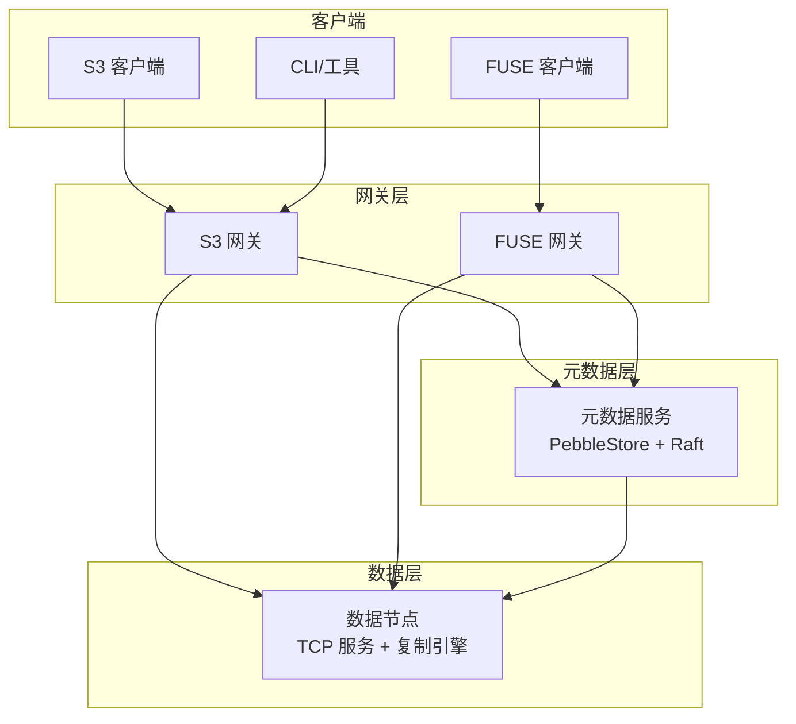
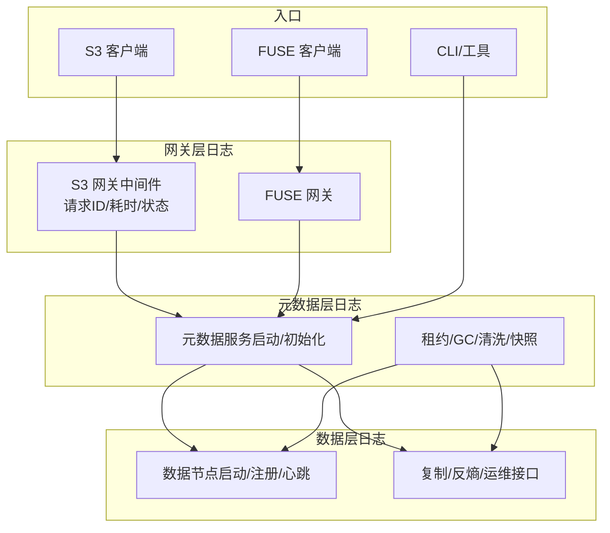
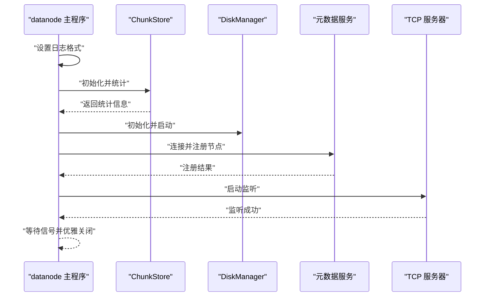
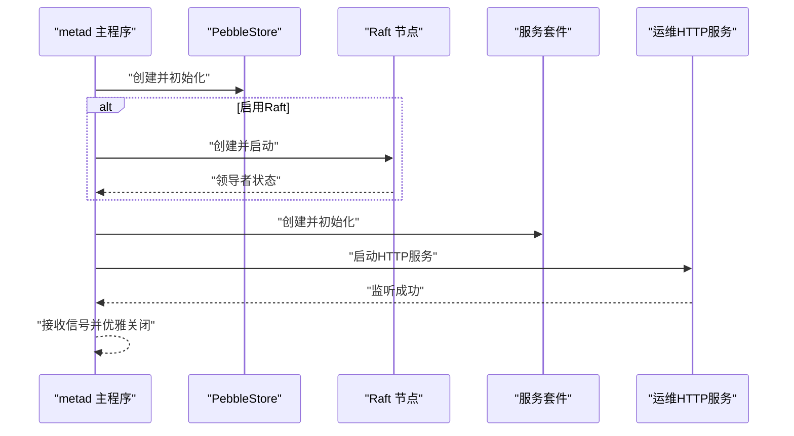
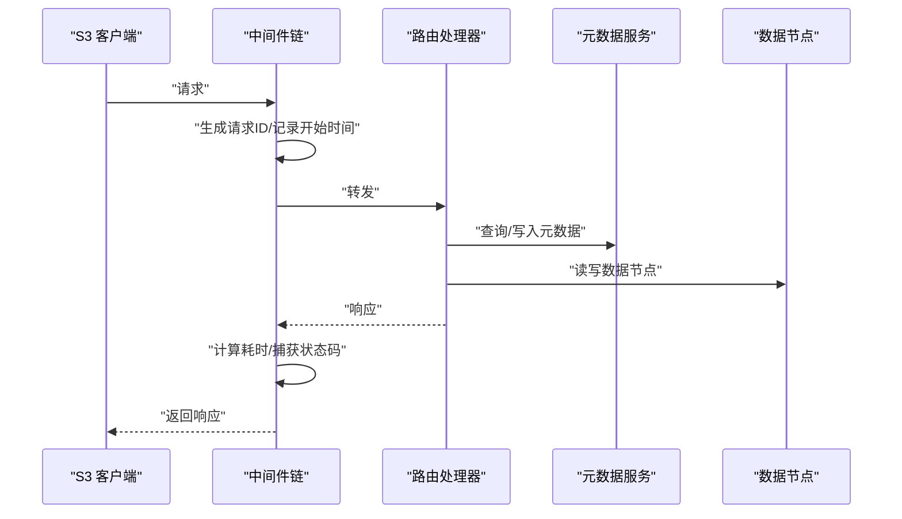
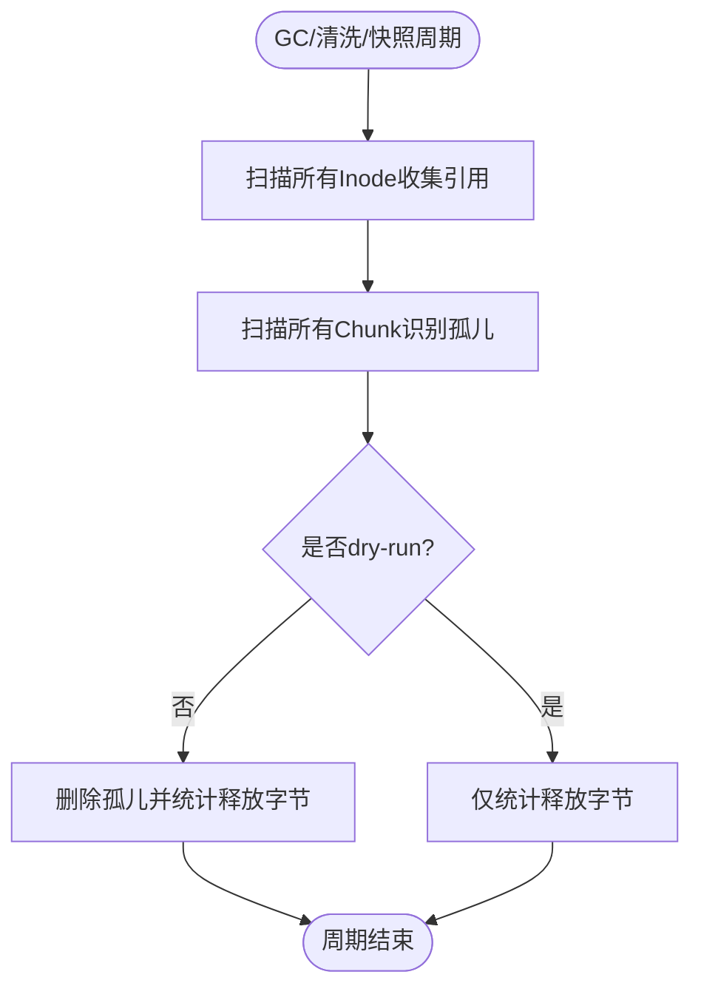
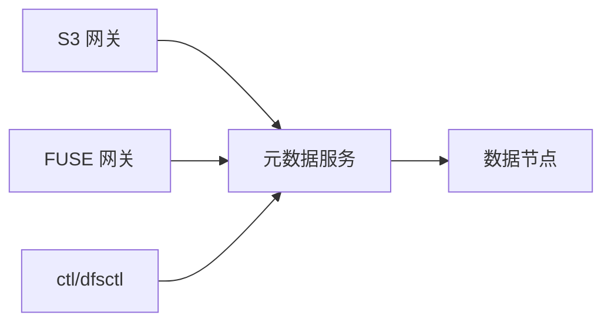

# 日志分析方法

<cite>
**本文引用的文件**   
- [nufs-core/cmd/datanode/main.go](file://nufs-core/cmd/datanode/main.go)
- [nufs-core/cmd/metad/main.go](file://nufs-core/cmd/metad/main.go)
- [nufs-core/cmd/fusegw/main.go](file://nufs-core/cmd/fusegw/main.go)
- [nufs-core/cmd/s3gw/main.go](file://nufs-core/cmd/s3gw/main.go)
- [nufs-core/cmd/ctl/main.go](file://nufs-core/cmd/ctl/main.go)
- [nufs-core/cmd/dfsctl/main.go](file://nufs-core/cmd/dfsctl/main.go)
- [nufs-core/datanode/server.go](file://nufs-core/datanode/server.go)
- [nufs-core/datanode/diskmanager.go](file://nufs-core/datanode/diskmanager.go)
- [nufs-core/metadata/service.go](file://nufs-core/metadata/service.go)
- [nufs-core/metadata/production.go](file://nufs-core/metadata/production.go)
- [nufs-core/metadata/pebble_raft.go](file://nufs-core/metadata/pebble_raft.go)
- [nufs-core/gateway/s3/middleware.go](file://nufs-core/gateway/s3/middleware.go)
- [nufs-core/gateway/s3/handler.go](file://nufs-core/gateway/s3/handler.go)
- [nufs-core/ARCHITECTURE.md](file://nufs-core/ARCHITECTURE.md)
</cite>

## 目录
1. [简介](#简介)
2. [项目结构](#项目结构)
3. [核心组件](#核心组件)
4. [架构总览](#架构总览)
5. [详细组件分析](#详细组件分析)
6. [依赖分析](#依赖分析)
7. [性能考虑](#性能考虑)
8. [故障排查指南](#故障排查指南)
9. [结论](#结论)
10. [附录](#附录)

## 简介
本文件面向NUFS系统的运维与开发人员，提供系统日志分析方法论与实践指南。内容涵盖：
- 如何解读系统日志、错误日志与调试日志
- 不同组件的日志级别与日志格式
- 关键字段含义与定位要点
- 日志搜索技巧、时间范围筛选、错误类型分类与组件特定提取
- 常见错误模式识别与日志关联分析方法
- 日志聚合工具使用建议与自动化分析脚本思路

## 项目结构
NUFS系统由多个守护进程组成，每个进程均采用标准库日志记录关键事件。核心组件包括：
- 元数据服务（metad）：提供元数据存储、Raft共识、租约、GC、清洗等生产子系统
- 数据节点（datanode）：提供TCP协议的数据读写、复制、心跳上报、运维接口
- S3网关（s3gw）：提供S3兼容HTTP API，内置中间件链进行请求追踪
- FUSE网关（fusegw）：提供Linux FUSE挂载
- 管理工具（ctl/dfsctl）：提供命令行与HTTP运维接口

图表来源
- [nufs-core/ARCHITECTURE.md:39-101](file://nufs-core/ARCHITECTURE.md#L39-L101)

章节来源
- [nufs-core/ARCHITECTURE.md:1-120](file://nufs-core/ARCHITECTURE.md#L1-L120)

## 核心组件
本节概述各组件的日志行为与关键字段，便于快速定位问题。

- datanode（数据节点）
  - 启动阶段：打印节点ID、监听地址、数据目录、容量等初始化信息
  - 运行阶段：连接元数据服务、注册节点、启动服务器、复制引擎、反熵、心跳、运维接口
  - 错误处理：对初始化失败、启动失败、注册失败等直接终止；运行期错误通过日志输出
  - 关键字段：node_id、addr、data、capacity、chunks、bytes、signal

- metad（元数据服务）
  - 启动阶段：打印节点ID、数据目录、Go版本、Raft开关、绑定地址、快照阈值、间隔等
  - 运行阶段：创建PebbleStore、可选启用Raft、启动服务套件（指标、健康、租约、GC、清洗）、启动运维HTTP API
  - 关键字段：node_id、data、raft_addr、raft_dir、ops_addr、lease_ttl、gc_interval、scrub_interval

- s3gw（S3网关）
  - 启动阶段：打印监听地址、认证模式（匿名/启用）
  - 运行阶段：创建HTTP服务器，中间件链记录请求ID、耗时、状态码
  - 关键字段：listen、auth_enabled、request_id、status、duration、remote_addr

- fusegw（FUSE网关）
  - 启动阶段：打印挂载点、元数据目录
  - 运行阶段：创建FUSE挂载，等待中断信号
  - 关键字段：mountpoint、meta_dir、signal

- ctl/dfsctl（管理工具）
  - ctl：直接访问PebbleStore，列出节点、桶、再平衡计划、维修队列等
  - dfsctl：通过HTTP调用metad运维接口，查询集群状态、节点列表、桶列表、维修队列、GC扫描、指标、健康

章节来源
- [nufs-core/cmd/datanode/main.go:19-133](file://nufs-core/cmd/datanode/main.go#L19-L133)
- [nufs-core/cmd/metad/main.go:21-148](file://nufs-core/cmd/metad/main.go#L21-L148)
- [nufs-core/cmd/s3gw/main.go:18-90](file://nufs-core/cmd/s3gw/main.go#L18-L90)
- [nufs-core/cmd/fusegw/main.go:17-62](file://nufs-core/cmd/fusegw/main.go#L17-L62)
- [nufs-core/cmd/ctl/main.go:17-66](file://nufs-core/cmd/ctl/main.go#L17-L66)
- [nufs-core/cmd/dfsctl/main.go:30-54](file://nufs-core/cmd/dfsctl/main.go#L30-L54)

## 架构总览
下图展示日志在系统中的流向与关键落点：

图表来源
- [nufs-core/gateway/s3/middleware.go:24-33](file://nufs-core/gateway/s3/middleware.go#L24-L33)
- [nufs-core/cmd/s3gw/main.go:27-70](file://nufs-core/cmd/s3gw/main.go#L27-L70)
- [nufs-core/cmd/metad/main.go:40-105](file://nufs-core/cmd/metad/main.go#L40-L105)
- [nufs-core/metadata/production.go:289-303](file://nufs-core/metadata/production.go#L289-L303)
- [nufs-core/cmd/datanode/main.go:78-123](file://nufs-core/cmd/datanode/main.go#L78-L123)

## 详细组件分析

### datanode 日志分析
- 日志级别与格式
  - 使用标准库日志，包含时间戳、微秒、短文件名等
  - 输出启动参数、初始化结果、组件启动/停止、信号处理等
- 关键字段与定位
  - 节点标识：node_id、addr、data、capacity
  - 统计信息：chunks、bytes
  - 组件生命周期：chunk store ready、registered、server listening、shutdown complete
- 常见问题定位
  - 初始化失败：chunk store、disk manager、元数据连接、注册节点
  - 运行期错误：server启动、replicator/chain replicator/anti-entropy/heartbeat/ops server
- 日志搜索技巧
  - 时间范围：结合系统时间过滤
  - 组件筛选：关键词“datanode:”、“server listening”、“registered”
  - 错误分类：包含“failed to”、“received signal”、“shutdown”

图表来源
- [nufs-core/cmd/datanode/main.go:31-123](file://nufs-core/cmd/datanode/main.go#L31-L123)

章节来源
- [nufs-core/cmd/datanode/main.go:31-133](file://nufs-core/cmd/datanode/main.go#L31-L133)
- [nufs-core/datanode/server.go:37-100](file://nufs-core/datanode/server.go#L37-L100)

### metad 日志分析
- 日志级别与格式
  - 启动阶段：打印节点ID、数据目录、Go版本、Raft配置、ops API地址
  - 运行阶段：PebbleStore初始化、可选Raft启动、服务套件初始化、运维API启动
- 关键字段与定位
  - Raft：raft_addr、raft_dir、bootstrap、snapshot策略
  - 运维：ops_addr、ready/health响应
- 常见问题定位
  - 初始化失败：PebbleStore创建、Raft节点创建
  - 运行期错误：ops server error、snapshot warning、shutdown error
- 日志搜索技巧
  - 关键词：“metad:”、“raft node started”、“ops API listening”、“raft leader”
  - 时间范围：启动/关闭窗口

图表来源
- [nufs-core/cmd/metad/main.go:43-126](file://nufs-core/cmd/metad/main.go#L43-L126)

章节来源
- [nufs-core/cmd/metad/main.go:40-148](file://nufs-core/cmd/metad/main.go#L40-L148)
- [nufs-core/metadata/service.go:136-213](file://nufs-core/metadata/service.go#L136-L213)

### s3gw 日志分析
- 日志级别与格式
  - 启动阶段：打印监听地址、认证模式
  - 运行阶段：中间件链记录请求ID、方法、路径、状态码、耗时、远端地址
- 关键字段与定位
  - 请求追踪：x-amz-request-id、x-amz-id-2
  - 性能：duration、status
- 常见问题定位
  - 认证失败：中间件返回403
  - 服务异常：panic recovered、server error
- 日志搜索技巧
  - 关键词：“s3gw:”、x-amz-request-id、panic recovered
  - 时间范围：请求高峰期

图表来源
- [nufs-core/gateway/s3/middleware.go:24-33](file://nufs-core/gateway/s3/middleware.go#L24-L33)
- [nufs-core/gateway/s3/handler.go:46-54](file://nufs-core/gateway/s3/handler.go#L46-L54)

章节来源
- [nufs-core/cmd/s3gw/main.go:27-90](file://nufs-core/cmd/s3gw/main.go#L27-L90)
- [nufs-core/gateway/s3/middleware.go:14-85](file://nufs-core/gateway/s3/middleware.go#L14-L85)
- [nufs-core/gateway/s3/handler.go:70-166](file://nufs-core/gateway/s3/handler.go#L70-L166)

### fusegw 日志分析
- 日志级别与格式
  - 启动阶段：打印挂载点、元数据目录、挂载成功
  - 运行阶段：等待中断信号、卸载错误
- 关键字段与定位
  - 挂载点：mountpoint、meta_dir
  - 信号：SIGINT/SIGTERM
- 日志搜索技巧
  - 关键词：“fusegw:”、“mounted at”、“unmount error”

章节来源
- [nufs-core/cmd/fusegw/main.go:24-62](file://nufs-core/cmd/fusegw/main.go#L24-L62)

### 生产子系统日志（租约、GC、清洗、快照）
- 租约管理（LeaseManager）
  - 定期扫描节点，标记过期节点为离线，并发布事件
  - 关键日志：节点离线标记、事件发布
- 垃圾回收（ChunkGC）
  - 扫描引用集合，发现孤儿块，删除或dry-run统计
  - 关键日志：扫描结果、删除数量、释放字节数
- 数据清洗（Scrubber）
  - 校验Chunk一致性，触发修复事件
  - 关键日志：损坏/降级计数、修复触发
- Raft快照（pebble_raft.go）
  - 应用日志错误、快照策略、日志保留
  - 关键日志：apply error、快照触发、日志截断

图表来源
- [nufs-core/metadata/production.go:338-422](file://nufs-core/metadata/production.go#L338-L422)

章节来源
- [nufs-core/metadata/production.go:289-303](file://nufs-core/metadata/production.go#L289-L303)
- [nufs-core/metadata/production.go:412-422](file://nufs-core/metadata/production.go#L412-L422)
- [nufs-core/metadata/production.go:491-554](file://nufs-core/metadata/production.go#L491-L554)
- [nufs-core/metadata/pebble_raft.go:205-209](file://nufs-core/metadata/pebble_raft.go#L205-L209)

### 管理工具日志分析
- ctl（直接访问PebbleStore）
  - 列出节点、桶、再平衡计划、维修队列、触发再平衡、查看领导者
- dfsctl（通过HTTP运维接口）
  - 查询集群状态、节点列表、桶列表、维修队列、GC扫描、指标、健康

章节来源
- [nufs-core/cmd/ctl/main.go:86-221](file://nufs-core/cmd/ctl/main.go#L86-L221)
- [nufs-core/cmd/dfsctl/main.go:81-190](file://nufs-core/cmd/dfsctl/main.go#L81-L190)

## 依赖分析
- 组件耦合
  - s3gw/fusegw依赖元数据服务（PebbleStore），并通过数据节点完成数据读写
  - datanode依赖元数据服务进行节点注册、心跳上报、运维接口
  - metad作为核心，组合租约、GC、清洗、生命周期等生产子系统
- 日志依赖
  - 各组件均使用标准库日志，便于统一采集与检索
  - S3网关中间件链提供请求ID，便于端到端追踪

图表来源
- [nufs-core/ARCHITECTURE.md:39-101](file://nufs-core/ARCHITECTURE.md#L39-L101)

章节来源
- [nufs-core/ARCHITECTURE.md:118-201](file://nufs-core/ARCHITECTURE.md#L118-L201)

## 性能考虑
- 日志开销
  - datanode/s3gw/metag/fusegw均使用标准库日志，建议在高吞吐场景控制日志级别与频率
- 关键指标
  - S3网关：请求耗时、状态码分布
  - 元数据服务：租约检查间隔、GC/清洗周期
  - 数据节点：复制/反熵/心跳周期

## 故障排查指南
- 启动失败
  - datanode：检查“failed to init”、“failed to start server”、“failed to connect to metadata service”
  - metad：检查“failed to create”、“raft node created”、“ops server error”
  - s3gw：检查“failed to create metadata store”、“failed to mount”、“server error”
- 运行期错误
  - datanode：server accept/read/write错误、replicator/anti-entropy/heartbeat/ops错误
  - metad：raft apply error、snapshot warning、shutdown error
  - s3gw：panic recovered、403/500错误
- 常见错误模式识别
  - 节点离线：租约管理标记offline并发布事件
  - 孤儿块：GC扫描发现并删除或统计
  - 数据损坏：清洗器检测并触发修复
- 日志关联分析
  - 使用请求ID（x-amz-request-id）串联S3网关、元数据服务与数据节点
  - 结合时间戳定位跨组件调用链

章节来源
- [nufs-core/cmd/datanode/main.go:52-96](file://nufs-core/cmd/datanode/main.go#L52-L96)
- [nufs-core/cmd/metad/main.go:52-146](file://nufs-core/cmd/metad/main.go#L52-L146)
- [nufs-core/cmd/s3gw/main.go:35-89](file://nufs-core/cmd/s3gw/main.go#L35-L89)
- [nufs-core/metadata/production.go:289-303](file://nufs-core/metadata/production.go#L289-L303)
- [nufs-core/metadata/production.go:412-422](file://nufs-core/metadata/production.go#L412-L422)
- [nufs-core/metadata/production.go:491-554](file://nufs-core/metadata/production.go#L491-L554)
- [nufs-core/metadata/pebble_raft.go:205-209](file://nufs-core/metadata/pebble_raft.go#L205-L209)
- [nufs-core/gateway/s3/middleware.go:72-84](file://nufs-core/gateway/s3/middleware.go#L72-L84)

## 结论
- NUFS系统日志以标准库日志为主，覆盖启动、运行、关闭全生命周期
- S3网关中间件链提供请求ID，便于端到端追踪
- 元数据服务组合多项生产子系统，日志涵盖租约、GC、清洗、快照等关键环节
- 建议建立统一的日志采集与检索体系，结合请求ID与时间戳进行跨组件关联分析

## 附录
- 日志搜索技巧与过滤方法
  - 时间范围：使用系统时间过滤（如“YYYY-MM-DD HH:MM:SS”）
  - 组件筛选：关键词“datanode:”、“metad:”、“s3gw:”、“fusegw:”
  - 错误类型：包含“failed to”、“panic recovered”、“error”、“offline”
  - 请求追踪：使用x-amz-request-id串联S3请求链路
- 日志聚合工具使用建议
  - 建议使用集中式日志平台（如ELK/EFK、Loki+Promtail）统一采集
  - 对S3网关中间件输出进行结构化解析，提取method、path、status、duration、request_id
- 自动化分析脚本示例（思路）
  - 统计错误率：按组件统计包含“error/failed/panic”的日志条目
  - 请求时延分析：解析S3网关日志，统计P50/P95/P99耗时
  - 节点健康画像：解析metad租约日志，统计节点离线次数与持续时间
  - 孤儿块趋势：解析metad GC日志，统计孤儿块发现与删除数量