# Chunk存储模型

<cite>
**本文档引用的文件**
- [types.go](file://nufs-core/datanode/types.go)
- [chunkstore.go](file://nufs-core/datanode/chunkstore.go)
- [ops.go](file://nufs-core/datanode/ops.go)
- [replicator.go](file://nufs-core/datanode/replicator.go)
- [repair.go](file://nufs-core/datanode/repair.go)
- [types.go](file://nufs-core/metadata/types.go)
- [ec.go](file://nufs-core/metadata/ec.go)
- [shard.go](file://nufs-core/metadata/shard.go)
- [production.go](file://nufs-core/metadata/production.go)
- [chunkstore_test.go](file://nufs-core/datanode/chunkstore_test.go)
- [ec_test.go](file://nufs-core/metadata/ec_test.go)
</cite>

## 目录
1. [简介](#简介)
2. [项目结构](#项目结构)
3. [核心组件](#核心组件)
4. [架构总览](#架构总览)
5. [详细组件分析](#详细组件分析)
6. [依赖关系分析](#依赖关系分析)
7. [性能考量](#性能考量)
8. [故障排查指南](#故障排查指南)
9. [结论](#结论)
10. [附录](#附录)

## 简介
本文件系统采用分布式块存储架构，以Chunk为核心数据单元。本文档围绕Chunk存储模型进行系统性说明，重点涵盖：
- ChunkRef引用结构如何将文件逻辑地址映射到物理Chunk位置
- ChunkMeta的核心字段：ChunkID生成、大小限制、状态管理、校验和机制
- ChunkState生命周期状态转换：从Sealing到Ready的完整流程
- ReplicaInfo副本信息结构：节点位置、同步状态、磁盘路径
- ECGroupInfo纠删码组信息：数据分片、奇偶分片、分片索引
- ReplicaState同步状态管理
- Chunk元数据的序列化格式与存储键值设计
- Chunk创建、更新、删除的完整操作流程示例

## 项目结构
本项目分为两个主要模块：
- datanode：实现数据节点功能，负责本地Chunk存储、读写、复制、修复等
- metadata：实现元数据服务，负责命名空间、Chunk元数据、纠删码配置、租约与事件总线等

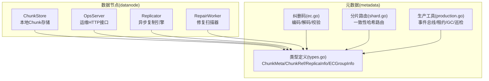

图表来源
- [chunkstore.go:18-31](file://nufs-core/datanode/chunkstore.go#L18-L31)
- [ops.go:19-71](file://nufs-core/datanode/ops.go#L19-L71)
- [replicator.go:23-31](file://nufs-core/datanode/replicator.go#L23-L31)
- [repair.go:13-27](file://nufs-core/datanode/repair.go#L13-L27)
- [types.go:70-125](file://nufs-core/metadata/types.go#L70-L125)
- [ec.go:13-34](file://nufs-core/metadata/ec.go#L13-L34)
- [shard.go:10-22](file://nufs-core/metadata/shard.go#L10-L22)
- [production.go:16-124](file://nufs-core/metadata/production.go#L16-L124)

章节来源
- [chunkstore.go:1-395](file://nufs-core/datanode/chunkstore.go#L1-L395)
- [types.go:1-209](file://nufs-core/metadata/types.go#L1-L209)

## 核心组件
- ChunkRef：文件到Chunk的逻辑映射，包含ChunkID、文件内偏移、长度、MVCC版本
- ChunkMeta：Chunk的元数据，包含ChunkID、大小、状态、副本列表、纠删码组、创建时间、校验和
- ReplicaInfo：副本位置信息，包含节点ID、地址、同步状态、磁盘路径
- ReplicaState：副本同步状态（同步中、就绪、陈旧、失败）
- ECGroupInfo：纠删码组信息，包含组ID、数据分片数、奇偶分片数、分片索引
- ChunkStore：本地Chunk存储引擎，负责文件布局、读写、封存、删除、统计
- Replicator：异步复制引擎，负责跨节点复制与校验
- RepairWorker：修复扫描器，负责检测并触发修复任务
- 类型定义与纠删码：统一的数据类型、纠删码算法与一致性哈希路由

章节来源
- [types.go:70-125](file://nufs-core/metadata/types.go#L70-L125)
- [chunkstore.go:18-31](file://nufs-core/datanode/chunkstore.go#L18-L31)
- [replicator.go:23-31](file://nufs-core/datanode/replicator.go#L23-L31)
- [repair.go:13-27](file://nufs-core/datanode/repair.go#L13-L27)

## 架构总览
下图展示了Chunk在文件系统中的映射关系与生命周期流转：

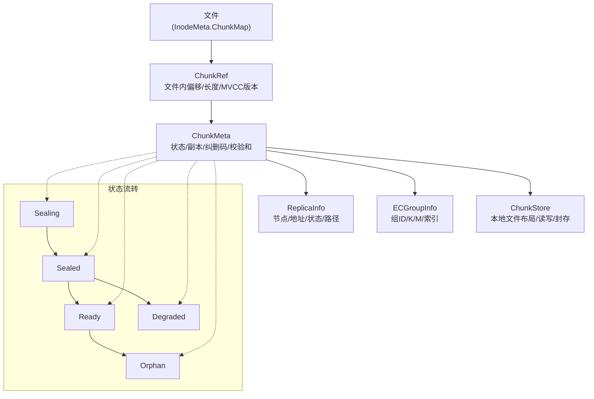

图表来源
- [types.go:70-125](file://nufs-core/metadata/types.go#L70-L125)
- [chunkstore.go:74-127](file://nufs-core/datanode/chunkstore.go#L74-L127)

## 详细组件分析

### ChunkRef引用结构与文件逻辑地址映射
- ChunkRef.ID：指向具体Chunk
- ChunkRef.Offset：该Chunk在文件内的字节偏移
- ChunkRef.Length：该Chunk在文件内的有效长度
- ChunkRef.Version：用于读写一致性（MVCC版本）

文件通过InodeMeta.ChunkMap维护有序Chunk列表，每个ChunkRef描述了文件某段的物理Chunk映射。读取时根据文件偏移计算对应ChunkRef，并按Chunk内的相对偏移访问数据。

章节来源
- [types.go:70-76](file://nufs-core/metadata/types.go#L70-L76)

### ChunkMeta核心字段与语义
- ID：Chunk唯一标识（64位）
- Size：Chunk大小上限（64MB）
- State：Chunk生命周期状态（Sealing/Sealed/Ready/Degraded/Orphan）
- Replicas：副本列表（有序：主副本优先）
- ECGroup：纠删码组信息（可选）
- CreateTime：创建时间戳
- Checksum：CRC32C校验和（Sealed/Ready后填充）

章节来源
- [types.go:78-88](file://nufs-core/metadata/types.go#L78-L88)

### ChunkID生成与大小限制
- ChunkID为64位无符号整数，采用Snowflake风格设计，保证全局唯一
- 单Chunk最大大小为64MB（由Size字段约束）

章节来源
- [types.go:22-23](file://nufs-core/metadata/types.go#L22-L23)
- [types.go](file://nufs-core/metadata/types.go#L82)

### Chunk状态管理与生命周期
状态常量与含义：
- ChunkSealing：正在写入
- ChunkSealed：写入完成，等待复制
- ChunkReady：所有副本确认就绪
- ChunkDegraded：副本丢失，处于修复中
- ChunkOrphan：无inode引用，可被垃圾回收

状态转换流程：
- 写入开始：状态=Sealing
- 封存完成：状态=Sealed
- 副本复制完成：状态=Ready
- 副本丢失或不一致：状态=Degraded
- 无引用且未被修复：状态=Orphan

章节来源
- [types.go:90-99](file://nufs-core/metadata/types.go#L90-L99)

### 校验和机制
- ChunkStore在Write阶段计算CRC32C并写入文件头；在Seal阶段重新读取全量数据计算校验和并更新头
- 元数据层的ChunkMeta.Checksum在Sealed/Ready状态下应非零
- 运维接口支持校验Chunk数据一致性

章节来源
- [chunkstore.go:79-100](file://nufs-core/datanode/chunkstore.go#L79-L100)
- [chunkstore.go:255-264](file://nufs-core/datanode/chunkstore.go#L255-L264)
- [production.go:464-489](file://nufs-core/metadata/production.go#L464-L489)

### ReplicaInfo副本信息结构
- NodeID：目标节点标识
- Addr：数据节点地址（host:port）
- State：副本同步状态（ReplicaSyncing/ReplicaReady/ReplicaStale/ReplicaFailed）
- DiskPath：本地存储路径

章节来源
- [types.go:101-107](file://nufs-core/metadata/types.go#L101-L107)

### ReplicaState同步状态管理
- ReplicaSyncing：正在同步
- ReplicaReady：已就绪
- ReplicaStale：数据陈旧
- ReplicaFailed：同步失败

章节来源
- [types.go:109-117](file://nufs-core/metadata/types.go#L109-L117)

### ECGroupInfo纠删码组信息
- GroupID：纠删码组标识
- DataShards：数据分片数量
- ParityShards：奇偶分片数量
- ShardIndex：当前Chunk在组内的分片索引

纠删码编码/解码/校验：
- 使用简单XOR示例实现（演示用途），生产环境建议使用成熟库如klauspost/reedsolomon
- 支持验证所有奇偶分片一致性

章节来源
- [types.go:119-125](file://nufs-core/metadata/types.go#L119-L125)
- [ec.go:13-82](file://nufs-core/metadata/ec.go#L13-L82)
- [ec.go:84-187](file://nufs-core/metadata/ec.go#L84-L187)
- [ec.go:189-213](file://nufs-core/metadata/ec.go#L189-L213)

### Chunk元数据序列化与存储键值设计
- InodeMeta：键前缀"/inode/{inode_id}"
- ChunkMeta：键前缀"/chunk/{chunk_id}"
- NodeInfo：键前缀"/node/{node_id}"
- PlacementPolicy：键前缀"/policy/{bucket_name}"

一致性哈希分片路由：
- 使用虚拟节点将键映射到不同元数据分片，减少迁移影响

章节来源
- [types.go:30-66](file://nufs-core/metadata/types.go#L30-L66)
- [types.go:129-144](file://nufs-core/metadata/types.go#L129-L144)
- [types.go:174-182](file://nufs-core/metadata/types.go#L174-L182)
- [shard.go:17-21](file://nufs-core/metadata/shard.go#L17-L21)
- [shard.go:82-98](file://nufs-core/metadata/shard.go#L82-L98)

### Chunk文件布局与本地存储
- 文件布局：{DataDir}/chunks/{shard}/{chunk_id}.dat
- 分片策略：chunk_id % 256 → 256个子目录，避免单目录文件过多
- 文件头格式：固定4字节魔数 + 8字节ChunkID + 4字节数据长度 + 4字节CRC32C + 数据体
- 元数据侧车：{DataDir}/chunks/{shard}/{chunk_id}.meta（JSON快照）

章节来源
- [types.go:120-146](file://nufs-core/datanode/types.go#L120-L146)
- [chunkstore.go:61-71](file://nufs-core/datanode/chunkstore.go#L61-L71)

### Chunk创建、更新与删除流程

#### 创建流程（Write）
- 计算CRC32C
- 写入二进制头（魔数、ChunkID、长度、校验和占位）
- 写入数据体
- 同步落盘
- 更新内存索引（LocalWritten）
- 写入元数据侧车

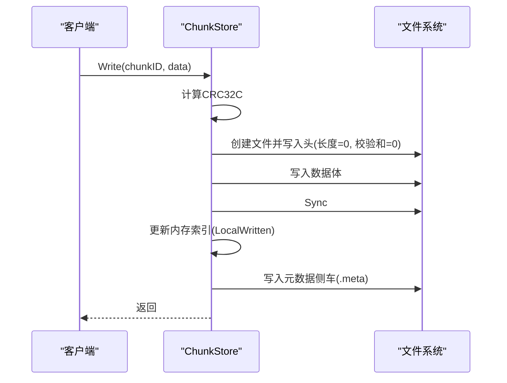

图表来源
- [chunkstore.go:74-127](file://nufs-core/datanode/chunkstore.go#L74-L127)

章节来源
- [chunkstore.go:74-127](file://nufs-core/datanode/chunkstore.go#L74-L127)

#### 封存流程（Seal）
- 打开文件并读取头
- 读取全量数据计算CRC32C
- 更新头中的校验和字段
- 同步落盘
- 更新内存索引（LocalSealed）

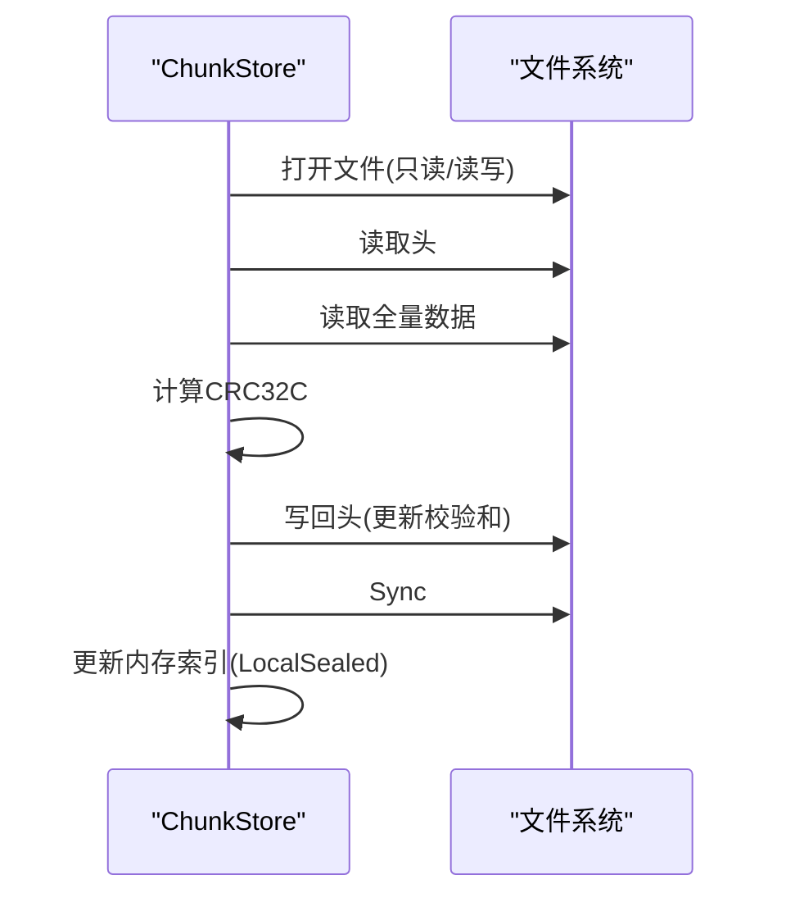

图表来源
- [chunkstore.go:230-275](file://nufs-core/datanode/chunkstore.go#L230-L275)

章节来源
- [chunkstore.go:230-275](file://nufs-core/datanode/chunkstore.go#L230-L275)

#### 更新流程（部分写/追加）
- WriteAt：在指定偏移写入数据，用于复制场景的部分写
- 覆盖写：新Write会覆盖旧数据，读取返回最新版本

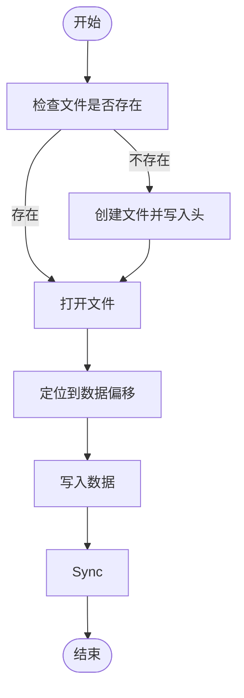

图表来源
- [chunkstore.go:131-167](file://nufs-core/datanode/chunkstore.go#L131-L167)

章节来源
- [chunkstore.go:131-167](file://nufs-core/datanode/chunkstore.go#L131-L167)
- [chunkstore_test.go:275-320](file://nufs-core/datanode/chunkstore_test.go#L275-L320)

#### 删除流程（Delete）
- 更新内存计数（总字节/计数）
- 删除元数据侧车（忽略错误）
- 删除数据文件（忽略不存在错误）

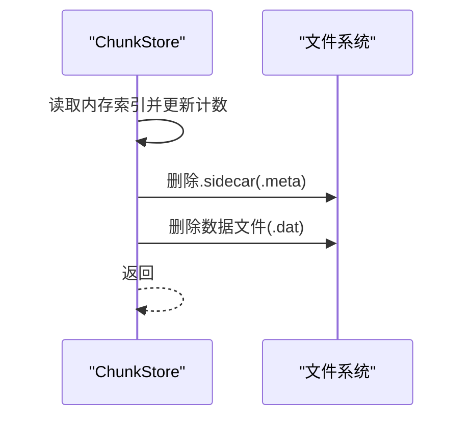

图表来源
- [chunkstore.go:277-296](file://nufs-core/datanode/chunkstore.go#L277-L296)

章节来源
- [chunkstore.go:277-296](file://nufs-core/datanode/chunkstore.go#L277-L296)

### 复制与修复流程

#### 复制流程（Replicator）
- 从源节点读取Chunk
- 发送到目标节点
- 验证校验和一致性
- 指数退避重试（最多3次）

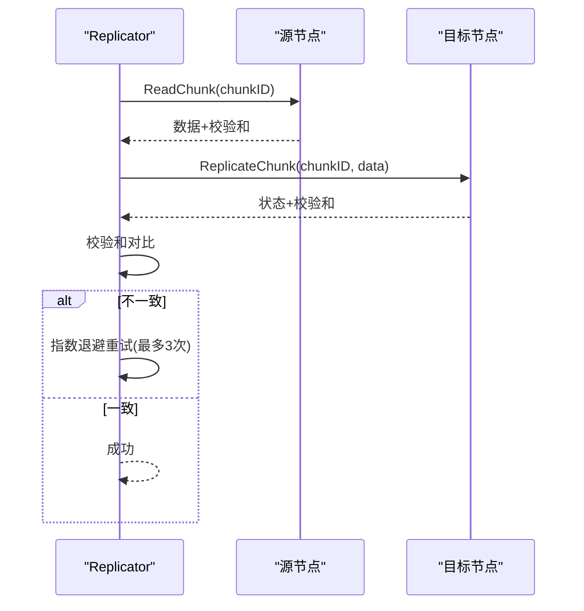

图表来源
- [replicator.go:128-174](file://nufs-core/datanode/replicator.go#L128-L174)

章节来源
- [replicator.go:128-174](file://nufs-core/datanode/replicator.go#L128-L174)

#### 修复流程（RepairWorker）
- 从元数据获取修复队列
- 选择健康副本作为源
- 选择可用节点作为目标
- 报告目标节点的副本状态为同步中
- 触发元数据服务执行修复

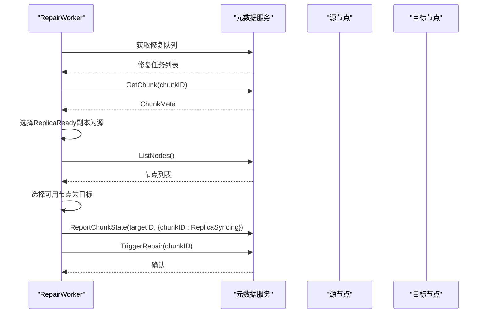

图表来源
- [repair.go:98-182](file://nufs-core/datanode/repair.go#L98-L182)

章节来源
- [repair.go:98-182](file://nufs-core/datanode/repair.go#L98-L182)

## 依赖关系分析

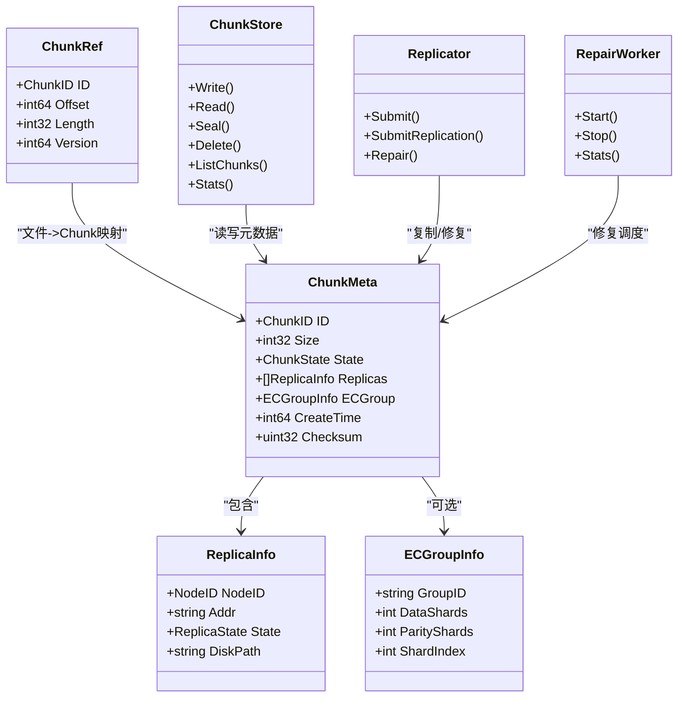

图表来源
- [types.go:70-125](file://nufs-core/metadata/types.go#L70-L125)
- [chunkstore.go:18-31](file://nufs-core/datanode/chunkstore.go#L18-L31)
- [replicator.go:23-31](file://nufs-core/datanode/replicator.go#L23-L31)
- [repair.go:13-27](file://nufs-core/datanode/repair.go#L13-L27)

章节来源
- [types.go:70-125](file://nufs-core/metadata/types.go#L70-L125)
- [chunkstore.go:18-31](file://nufs-core/datanode/chunkstore.go#L18-L31)
- [replicator.go:23-31](file://nufs-core/datanode/replicator.go#L23-L31)
- [repair.go:13-27](file://nufs-core/datanode/repair.go#L13-L27)

## 性能考量
- 并发控制：ChunkStore使用信号量限制并发读写，避免资源争用
- 文件布局：按256个分片目录分布，降低单目录文件数量
- 校验和：Write阶段快速计算，Seal阶段全量校验，确保一致性
- 复制：异步复制与指数退避重试，提升可靠性
- 巡检与GC：定期扫描与垃圾回收，释放未引用的Chunk

章节来源
- [chunkstore.go:29-31](file://nufs-core/datanode/chunkstore.go#L29-L31)
- [types.go:144-146](file://nufs-core/datanode/types.go#L144-L146)
- [replicator.go:34-46](file://nufs-core/datanode/replicator.go#L34-L46)
- [production.go:337-429](file://nufs-core/metadata/production.go#L337-L429)

## 故障排查指南
- 校验和不匹配：通过运维接口验证Chunk数据一致性，检查元数据与本地校验和是否一致
- 副本不一致：检查ReplicaState，必要时触发RepairWorker进行修复
- 磁盘空间不足：通过OpsServer健康接口观察磁盘使用率，及时扩容或清理
- Chunk丢失：通过GC扫描发现孤儿Chunk并清理

章节来源
- [ops.go:177-200](file://nufs-core/datanode/ops.go#L177-L200)
- [ops.go:279-298](file://nufs-core/datanode/ops.go#L279-L298)
- [production.go:337-429](file://nufs-core/metadata/production.go#L337-L429)

## 结论
NUFS的Chunk存储模型通过清晰的引用映射、严格的元数据管理与完善的复制/修复机制，实现了高可靠、高性能的分布式块存储。ChunkRef将文件逻辑地址精确映射到物理Chunk，ChunkMeta承载了状态、副本与纠删码等关键信息，配合Replicator与RepairWorker保障了数据一致性与可用性。通过运维接口与巡检机制，系统具备良好的可观测性与自愈能力。

## 附录

### 关键流程图：状态转换与生命周期

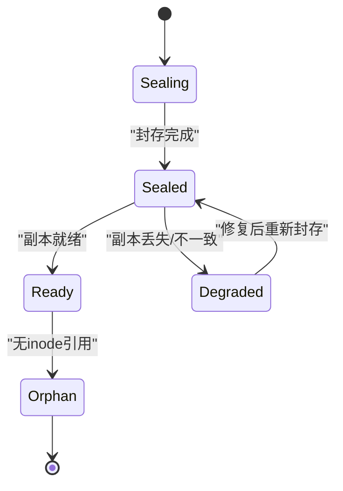

图表来源
- [types.go:90-99](file://nufs-core/metadata/types.go#L90-L99)

### 关键流程图：纠删码编码/解码

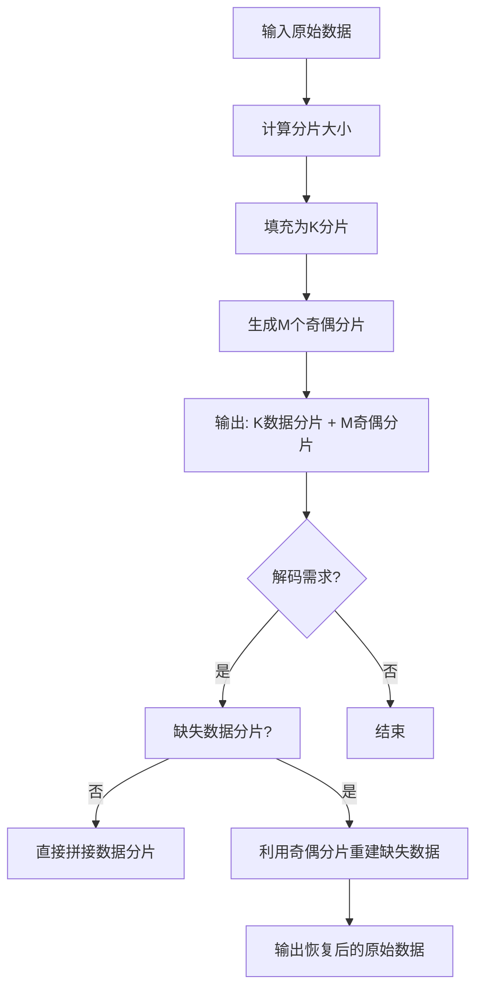

图表来源
- [ec.go:36-82](file://nufs-core/metadata/ec.go#L36-L82)
- [ec.go:84-187](file://nufs-core/metadata/ec.go#L84-L187)