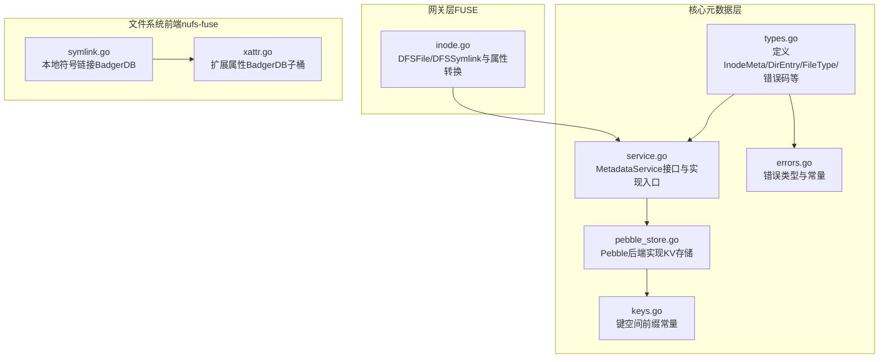
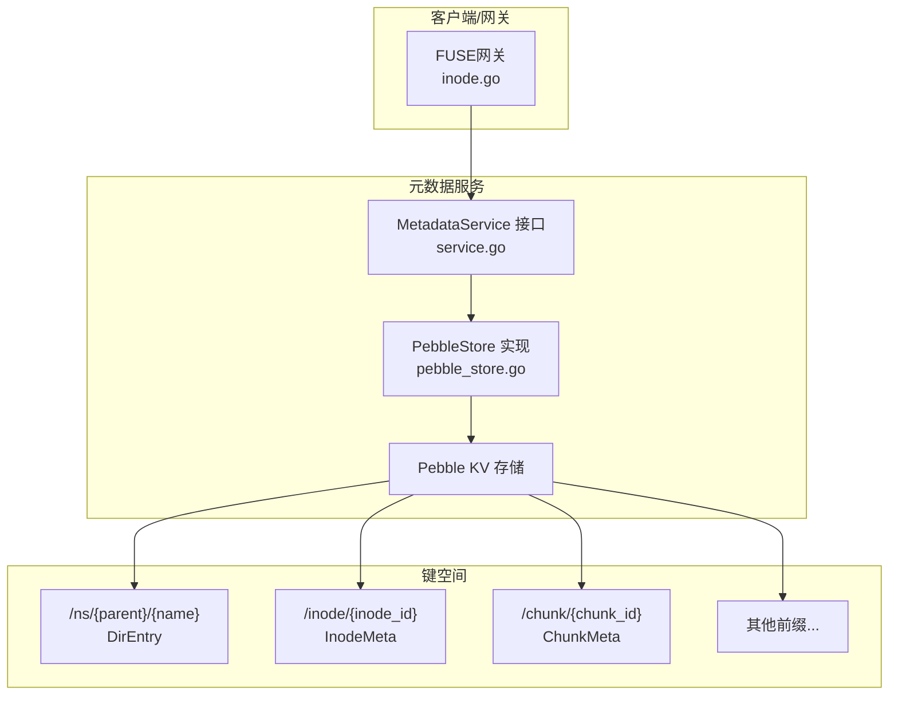
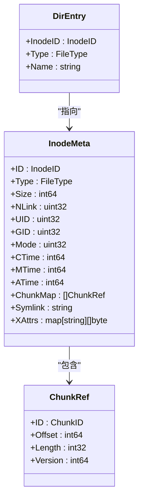
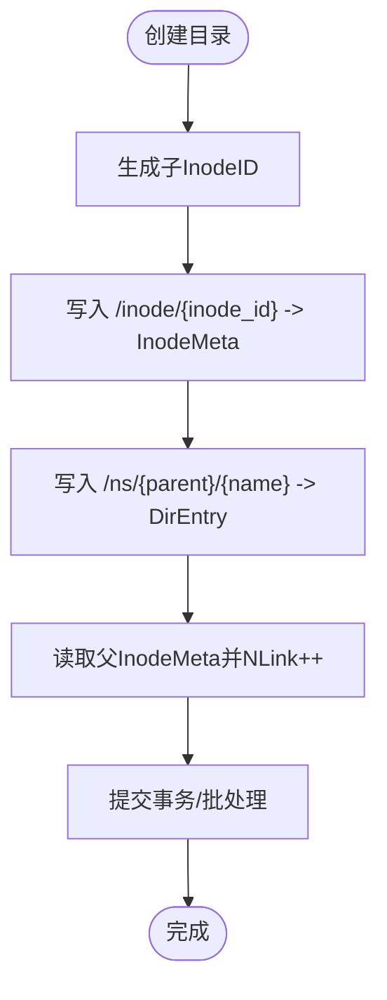
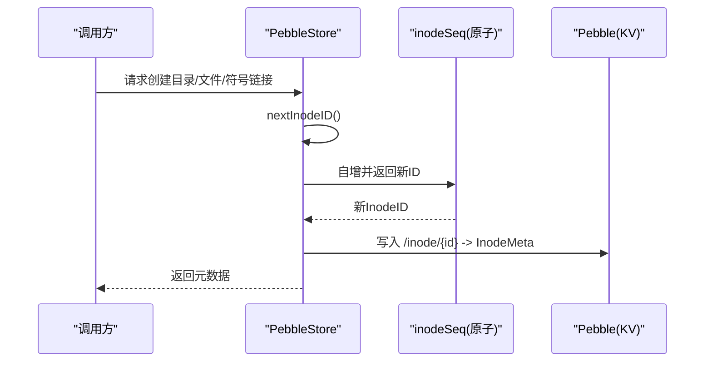
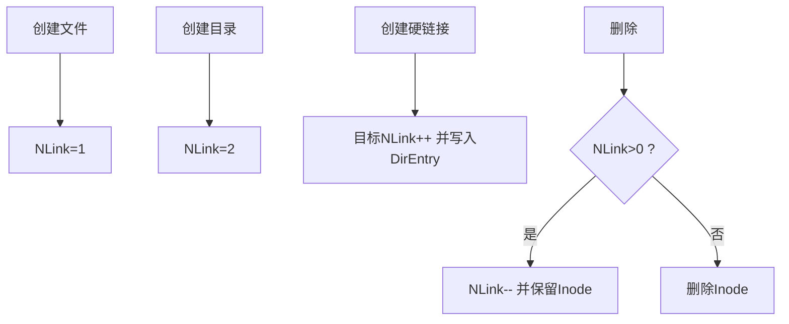
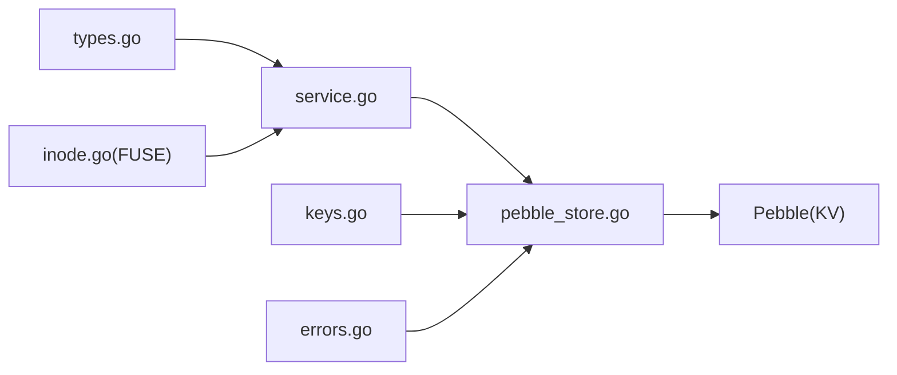

# 命名空间与Inode模型

<cite>
**本文引用的文件**
- [types.go](file://nufs-core/metadata/types.go)
- [service.go](file://nufs-core/metadata/service.go)
- [pebble_store.go](file://nufs-core/metadata/pebble_store.go)
- [errors.go](file://nufs-core/metadata/errors.go)
- [keys.go](file://nufs-core/metadata/keys.go)
- [inode.go](file://nufs-core/gateway/fuse/inode.go)
- [symlink.go](file://nufs-fuse/fs/symlink.go)
- [xattr.go](file://nufs-fuse/fs/xattr.go)
</cite>

## 目录
1. [简介](#简介)
2. [项目结构](#项目结构)
3. [核心组件](#核心组件)
4. [架构总览](#架构总览)
5. [详细组件分析](#详细组件分析)
6. [依赖分析](#依赖分析)
7. [性能考量](#性能考量)
8. [故障排查指南](#故障排查指南)
9. [结论](#结论)
10. [附录](#附录)

## 简介
本文件面向NUFS分布式文件系统的命名空间与Inode模型，系统化阐述以下主题：
- InodeMeta结构设计：文件类型标识、权限模式、时间戳管理、硬链接计数、符号链接目标、扩展属性等字段的职责与语义。
- 目录条目DirEntry的存储格式与命名空间树组织方式（键空间划分）。
- InodeID生成机制与唯一性保障（基于原子自增序列）。
- 元数据存储布局（键值对格式与命名空间路径规则）。
- 硬链接计数NLink的维护策略与符号链接Symlink的实现差异。
- 扩展属性XAttrs的使用场景与存储格式。
- 提供Inode元数据示例与命名空间查询操作的代码示例路径。

## 项目结构
本主题涉及的核心代码分布在如下模块：
- 核心元数据层：定义InodeMeta、DirEntry、错误码、服务接口与Pebble后端实现。
- 网关层（FUSE）：将InodeMeta映射到FUSE节点类型，支持常规文件、目录、符号链接。
- 文件系统前端（nufs-fuse）：本地缓存与BadgerDB存储的符号链接与扩展属性实现。

**图表来源**
- [types.go:10-50](file://nufs-core/metadata/types.go#L10-L50)
- [service.go:16-67](file://nufs-core/metadata/service.go#L16-L67)
- [pebble_store.go:16-31](file://nufs-core/metadata/pebble_store.go#L16-L31)
- [errors.go:12-58](file://nufs-core/metadata/errors.go#L12-L58)
- [keys.go:9-15](file://nufs-core/metadata/keys.go#L9-L15)
- [inode.go:17-231](file://nufs-core/gateway/fuse/inode.go#L17-L231)
- [symlink.go:30-50](file://nufs-fuse/fs/symlink.go#L30-L50)
- [xattr.go:27-32](file://nufs-fuse/fs/xattr.go#L27-L32)

**章节来源**
- [types.go:10-50](file://nufs-core/metadata/types.go#L10-L50)
- [service.go:16-67](file://nufs-core/metadata/service.go#L16-L67)
- [pebble_store.go:16-31](file://nufs-core/metadata/pebble_store.go#L16-L31)
- [errors.go:12-58](file://nufs-core/metadata/errors.go#L12-L58)
- [keys.go:9-15](file://nufs-core/metadata/keys.go#L9-L15)
- [inode.go:17-231](file://nufs-core/gateway/fuse/inode.go#L17-L231)
- [symlink.go:30-50](file://nufs-fuse/fs/symlink.go#L30-L50)
- [xattr.go:27-32](file://nufs-fuse/fs/xattr.go#L27-L32)

## 核心组件
- InodeMeta：文件/目录/符号链接的元数据载体，包含类型、大小、硬链接计数、UID/GID、权限位、各类时间戳、分片列表、符号链接目标以及扩展属性。
- DirEntry：目录项，指向父Inode下的子节点（含名称与类型）。
- MetadataService：统一的元数据操作接口，PebbleStore为其实现。
- 键空间前缀：通过统一前缀划分命名空间、Inode、块、节点、策略、修复队列等键空间。
- 错误体系：结构化错误码，便于上层处理与定位问题。

**章节来源**
- [types.go:30-50](file://nufs-core/metadata/types.go#L30-L50)
- [types.go:52-58](file://nufs-core/metadata/types.go#L52-L58)
- [service.go:16-67](file://nufs-core/metadata/service.go#L16-L67)
- [keys.go:9-15](file://nufs-core/metadata/keys.go#L9-L15)
- [errors.go:12-58](file://nufs-core/metadata/errors.go#L12-L58)

## 架构总览
下图展示命名空间与Inode模型在系统中的位置与交互：

**图表来源**
- [service.go:16-67](file://nufs-core/metadata/service.go#L16-L67)
- [pebble_store.go:16-31](file://nufs-core/metadata/pebble_store.go#L16-L31)
- [keys.go:9-15](file://nufs-core/metadata/keys.go#L9-L15)

## 详细组件分析

### InodeMeta 结构设计与字段语义
- 类型标识：FileType枚举区分普通文件、目录、符号链接。
- 权限模式：Mode为POSIX权限位；UID/GID用于属主与属组。
- 时间戳：CTime/MTime/ATime以纳秒级UNIX时间表示，用于变更、修改、访问时间。
- 文件特定字段：
  - Size：文件总字节数。
  - ChunkMap：有序分片引用列表，支持顺序读写与MVCC版本控制。
  - Symlink：符号链接的目标路径字符串。
- 扩展属性：XAttrs为键值对映射，值为字节串，用于存储自定义元信息。

**图表来源**
- [types.go:30-50](file://nufs-core/metadata/types.go#L30-L50)
- [types.go:52-58](file://nufs-core/metadata/types.go#L52-L58)
- [types.go:70-76](file://nufs-core/metadata/types.go#L70-L76)

**章节来源**
- [types.go:30-50](file://nufs-core/metadata/types.go#L30-L50)
- [types.go:70-76](file://nufs-core/metadata/types.go#L70-L76)

### 目录条目与命名空间树组织
- DirEntry存储于键空间：/ns/{parent_inode}/{name}，值为包含子节点InodeID、类型与名称的结构。
- 命名空间树：以父Inode为根，每个子节点对应一个DirEntry；目录的NLink初始为2（自身与“.”），新增子项时父目录NLink递增；删除子项时父目录NLink递减。
- 路径规则：名称长度受最大限制约束；目录项键按字典序排列，便于范围扫描与前缀遍历。

**图表来源**
- [pebble_store.go:371-428](file://nufs-core/metadata/pebble_store.go#L371-L428)
- [pebble_store.go:412-422](file://nufs-core/metadata/pebble_store.go#L412-L422)

**章节来源**
- [pebble_store.go:371-428](file://nufs-core/metadata/pebble_store.go#L371-L428)
- [pebble_store.go:412-422](file://nufs-core/metadata/pebble_store.go#L412-L422)

### InodeID 生成机制与唯一性保证
- 生成器：PebbleStore内部维护原子自增序列，nextInodeID()返回下一个InodeID。
- 初始化：启动时将序列初始化为根InodeID，确保根节点ID固定且唯一。
- 唯一性：序列自增保证全局单调递增，结合KV存储的原子写入，实现InodeID的强唯一性。

**图表来源**
- [pebble_store.go:137-139](file://nufs-core/metadata/pebble_store.go#L137-L139)
- [pebble_store.go:82-82](file://nufs-core/metadata/pebble_store.go#L82-L82)

**章节来源**
- [pebble_store.go:137-139](file://nufs-core/metadata/pebble_store.go#L137-L139)
- [pebble_store.go:82-82](file://nufs-core/metadata/pebble_store.go#L82-L82)

### 元数据存储布局与键值对格式
- 键空间前缀：
  - /ns/{parent}/{name}：目录项（DirEntry）
  - /inode/{inode_id}：Inode元数据（InodeMeta）
  - /chunk/{chunk_id}：数据块元数据（ChunkMeta）
  - /bucket/{name}：桶信息（BucketInfo）
  - /policy/{bucket}：放置策略（PlacementPolicy）
  - /node/{node_id}：数据节点信息（NodeInfo）
  - /repair/{chunk_id}：修复任务（RepairTask）
- 值格式：均为JSON序列化对象，便于跨语言与工具链使用。
- 前缀扫描：通过upper-bound计算与迭代器进行高效范围扫描，支持分页读取。

**章节来源**
- [keys.go:9-15](file://nufs-core/metadata/keys.go#L9-L15)
- [pebble_store.go:182-231](file://nufs-core/metadata/pebble_store.go#L182-L231)

### 硬链接计数（NLink）维护机制
- 创建文件：InodeMeta.NLink初始为1。
- 创建目录：InodeMeta.NLink初始为2（自身与“.”）。
- 创建硬链接：目标InodeMeta.NLink递增，同时在新父目录写入DirEntry。
- 删除：Unlink时目标InodeMeta.NLink递减，若归零则删除该Inode；Rmdir时父目录NLink递减。
- 维护一致性：所有变更均在批处理中提交，避免部分更新导致不一致。

**图表来源**
- [pebble_store.go:511-549](file://nufs-core/metadata/pebble_store.go#L511-L549)
- [pebble_store.go:551-586](file://nufs-core/metadata/pebble_store.go#L551-L586)
- [pebble_store.go:733-777](file://nufs-core/metadata/pebble_store.go#L733-L777)

**章节来源**
- [pebble_store.go:511-549](file://nufs-core/metadata/pebble_store.go#L511-L549)
- [pebble_store.go:551-586](file://nufs-core/metadata/pebble_store.go#L551-L586)
- [pebble_store.go:733-777](file://nufs-core/metadata/pebble_store.go#L733-L777)

### 符号链接（Symlink）实现
- 存储：
  - 元数据层：InodeMeta.Type为符号链接，Symlink字段保存目标路径；DirEntry指向该Inode。
  - 前端层（nufs-fuse）：符号链接以本地BadgerDB存储，不持久化至S3，适合本地缓存与快速解析。
- 查询与读取：
  - 元数据层：Readlink根据InodeID读取InodeMeta并返回目标路径。
  - 前端层：Symlink节点直接从本地存储读取目标字符串。
- 属性与权限：符号链接的权限与时间戳由各自实现维护。

**章节来源**
- [types.go:30-50](file://nufs-core/metadata/types.go#L30-L50)
- [pebble_store.go:678-731](file://nufs-core/metadata/pebble_store.go#L678-L731)
- [symlink.go:30-50](file://nufs-fuse/fs/symlink.go#L30-L50)
- [symlink.go:77-80](file://nufs-fuse/fs/symlink.go#L77-L80)

### 扩展属性（XAttrs）使用场景与存储格式
- 使用场景：存储自定义元数据（如安全标签、索引键、应用私有属性等），不参与文件内容，但影响文件元信息。
- 存储格式：
  - 前端层（nufs-fuse）：在节点的子桶中以键值对形式存储，键为属性名，值为字节串。
  - 元数据层（nufs-core）：InodeMeta.XAttrs为map[string][]byte，直接序列化到/ inode/{id}。
- 访问接口：提供获取、设置、列出、删除扩展属性的统一方法。

**章节来源**
- [types.go:48-50](file://nufs-core/metadata/types.go#L48-L50)
- [xattr.go:27-32](file://nufs-fuse/fs/xattr.go#L27-L32)
- [xattr.go:88-134](file://nufs-fuse/fs/xattr.go#L88-L134)
- [xattr.go:136-184](file://nufs-fuse/fs/xattr.go#L136-L184)

### 命名空间查询与操作示例（代码示例路径）
- 查找子项：Lookup(parent, name) → 读取/ ns/{parent}/{name} 获取DirEntry，再读取/ inode/{inode_id} 获取InodeMeta。
- 列举目录：ReadDir(parent, offset, limit) → 前缀扫描/ ns/{parent}/... 并截取分页。
- 更新元数据：UpdateInode(meta) → 写回/ inode/{id}。
- 读取符号链接：Readlink(id) → 读取/ inode/{id} 并校验类型。

以上流程在PebbleStore中以KV读写与批处理实现，确保一致性与可恢复性。

**章节来源**
- [pebble_store.go:588-612](file://nufs-core/metadata/pebble_store.go#L588-L612)
- [pebble_store.go:477-509](file://nufs-core/metadata/pebble_store.go#L477-L509)
- [pebble_store.go:629-638](file://nufs-core/metadata/pebble_store.go#L629-L638)
- [pebble_store.go:715-731](file://nufs-core/metadata/pebble_store.go#L715-L731)

## 依赖分析
- 模块内聚与耦合：
  - types.go提供基础类型与常量，被service.go与pebble_store.go广泛依赖。
  - service.go定义统一接口，pebble_store.go实现具体逻辑，二者高内聚、低耦合。
  - keys.go集中管理键空间前缀，避免散落的字符串拼接，提升可维护性。
  - errors.go提供统一错误类型，便于上层分支处理。
- 外部依赖：
  - Pebble作为KV引擎，提供LSM树存储与批量写入能力。
  - FUSE网关层将InodeMeta映射为DFSFile/DFSSymlink等节点类型，实现POSIX语义。

**图表来源**
- [service.go:16-67](file://nufs-core/metadata/service.go#L16-L67)
- [pebble_store.go:16-31](file://nufs-core/metadata/pebble_store.go#L16-L31)
- [keys.go:9-15](file://nufs-core/metadata/keys.go#L9-L15)
- [errors.go:12-58](file://nufs-core/metadata/errors.go#L12-L58)
- [inode.go:17-231](file://nufs-core/gateway/fuse/inode.go#L17-L231)

**章节来源**
- [service.go:16-67](file://nufs-core/metadata/service.go#L16-L67)
- [pebble_store.go:16-31](file://nufs-core/metadata/pebble_store.go#L16-L31)
- [keys.go:9-15](file://nufs-core/metadata/keys.go#L9-L15)
- [errors.go:12-58](file://nufs-core/metadata/errors.go#L12-L58)
- [inode.go:17-231](file://nufs-core/gateway/fuse/inode.go#L17-L231)

## 性能考量
- 前缀扫描与分页：ReadDir通过前缀扫描与上限参数实现高效分页读取。
- 批量写入：创建目录/文件/符号链接等操作采用批处理提交，减少多次写入开销。
- 序列化成本：InodeMeta/DirEntry以JSON存储，读写简单但需注意字段数量与体积增长带来的序列化成本。
- 时间戳精度：纳秒级时间戳满足高精度需求，但需注意跨语言/工具链的兼容性。
- 建议：
  - 对频繁读取的目录项进行缓存（如FUSE网关侧）。
  - 控制XAttrs数量与单值大小，避免InodeMeta膨胀。
  - 合理设置Pebble内存表与打开文件数上限，平衡写放大与读放大。

## 故障排查指南
- 常见错误与定位：
  - 元数据层：命名空间相关错误（如条目已存在、未找到、目录非空、类型不符）、桶相关错误、块相关错误、节点与集群相关错误、系统与一致性错误。
  - 定位建议：优先检查键空间是否正确（/ns、/inode、/chunk等前缀），确认InodeID是否唯一且未越界，核对NLink变化是否与目录树结构一致。
- 排查步骤：
  - 使用前缀扫描验证/ ns/{parent}/...是否存在重复或缺失。
  - 读取/ inode/{id}确认类型与NLink是否符合预期。
  - 对于符号链接，确认/ inode/{id}的Type为符号链接且Symlink字段非空。
  - 对于扩展属性，检查节点子桶是否存在对应键。

**章节来源**
- [errors.go:45-89](file://nufs-core/metadata/errors.go#L45-L89)

## 结论
NUFS的命名空间与Inode模型以清晰的键空间划分与严格的元数据结构为基础，结合原子自增InodeID与批处理写入，实现了高可靠、可扩展的分布式文件系统元数据管理。通过DirEntry与InodeMeta的配合，系统既能表达复杂的目录树结构，又能承载丰富的文件属性与扩展信息。前端层（FUSE与nufs-fuse）进一步将这些抽象映射为用户可感知的文件系统语义，兼顾了易用性与性能。

## 附录
- 关键实现路径参考：
  - InodeMeta与DirEntry定义：[types.go:30-58](file://nufs-core/metadata/types.go#L30-L58)
  - MetadataService接口：[service.go:16-67](file://nufs-core/metadata/service.go#L16-L67)
  - 命名空间与InodeKV实现：[pebble_store.go:371-638](file://nufs-core/metadata/pebble_store.go#L371-L638)
  - 键空间前缀：[keys.go:9-15](file://nufs-core/metadata/keys.go#L9-L15)
  - FUSE节点映射与属性转换：[inode.go:17-231](file://nufs-core/gateway/fuse/inode.go#L17-L231)
  - 本地符号链接与扩展属性：[symlink.go:30-50](file://nufs-fuse/fs/symlink.go#L30-L50), [xattr.go:27-32](file://nufs-fuse/fs/xattr.go#L27-L32)