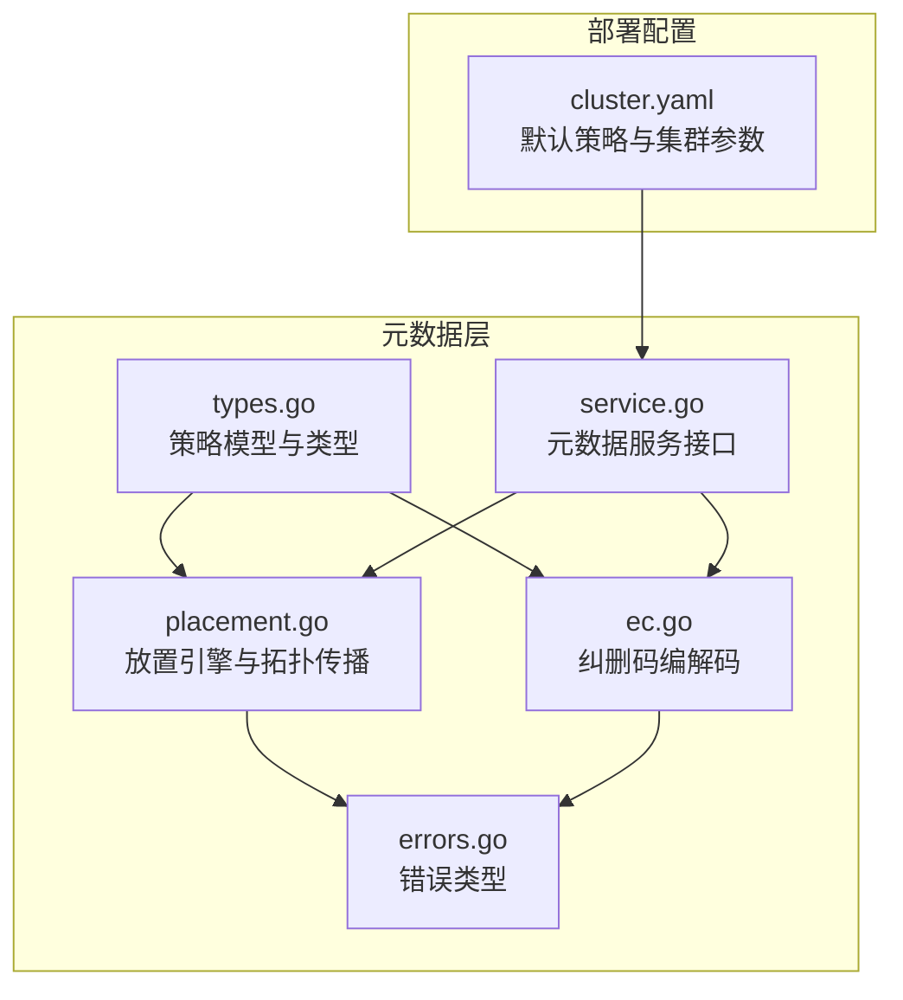
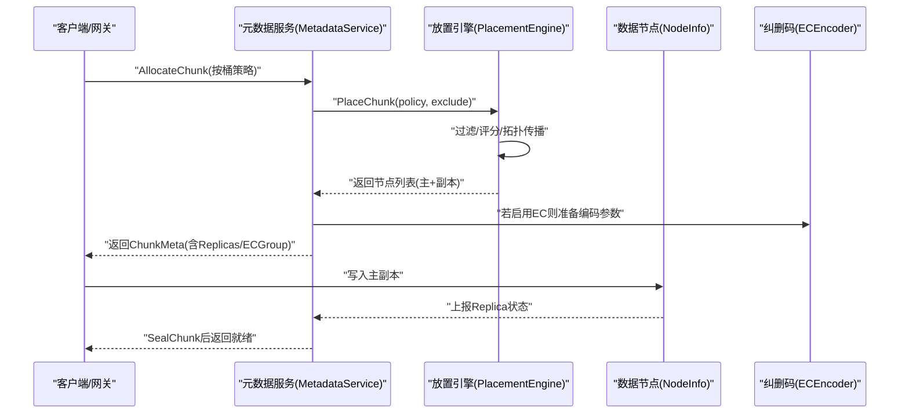
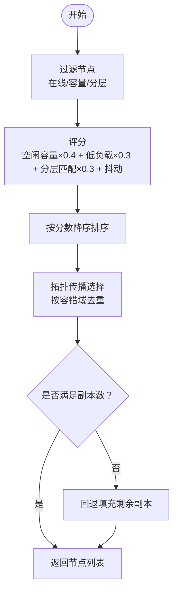
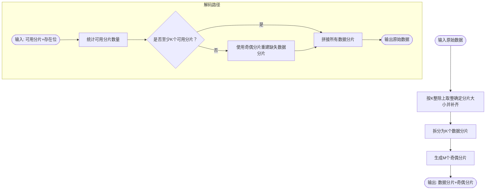
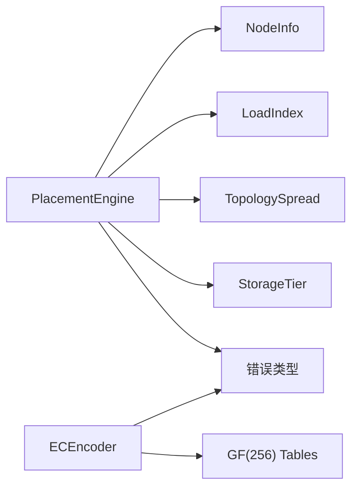

# 放置策略模型

<cite>
**本文引用的文件**
- [types.go](file://nufs-core/metadata/types.go)
- [placement.go](file://nufs-core/metadata/placement.go)
- [ec.go](file://nufs-core/metadata/ec.go)
- [placement_test.go](file://nufs-core/metadata/placement_test.go)
- [ec_test.go](file://nufs-core/metadata/ec_test.go)
- [errors.go](file://nufs-core/metadata/errors.go)
- [cluster.yaml](file://nufs-core/deploy/config/cluster.yaml)
- [service.go](file://nufs-core/metadata/service.go)
</cite>

## 目录
1. [简介](#简介)
2. [项目结构](#项目结构)
3. [核心组件](#核心组件)
4. [架构总览](#架构总览)
5. [详细组件分析](#详细组件分析)
6. [依赖分析](#依赖分析)
7. [性能考量](#性能考量)
8. [故障排查指南](#故障排查指南)
9. [结论](#结论)
10. [附录](#附录)

## 简介
本文件系统采用“复制+纠删码”混合放置策略，围绕以下目标设计：
- 高可用性：通过复制因子与拓扑传播策略实现跨节点/机架/可用区的容错。
- 成本优化：在满足可靠性前提下，优先使用低阶纠删码（如4:2）降低冗余开销。
- 性能优先：结合节点负载与容量评分，动态选择最优节点；支持按存储分层（热/温/冷）进行差异化放置。

## 项目结构
与放置策略直接相关的代码位于 nufs-core/metadata 子模块，关键文件如下：
- 类型定义与策略模型：types.go
- 放置引擎与拓扑传播：placement.go
- 纠删码编码/解码：ec.go
- 单元测试与行为验证：placement_test.go、ec_test.go
- 错误类型与语义：errors.go
- 默认配置与部署样例：cluster.yaml
- 元数据服务接口：service.go

图表来源
- [types.go:172-209](file://nufs-core/metadata/types.go#L172-L209)
- [placement.go:27-195](file://nufs-core/metadata/placement.go#L27-L195)
- [ec.go:13-254](file://nufs-core/metadata/ec.go#L13-L254)
- [errors.go:12-90](file://nufs-core/metadata/errors.go#L12-L90)
- [service.go:16-67](file://nufs-core/metadata/service.go#L16-L67)
- [cluster.yaml:47-62](file://nufs-core/deploy/config/cluster.yaml#L47-L62)

章节来源
- [types.go:172-209](file://nufs-core/metadata/types.go#L172-L209)
- [placement.go:27-195](file://nufs-core/metadata/placement.go#L27-L195)
- [ec.go:13-254](file://nufs-core/metadata/ec.go#L13-L254)
- [errors.go:12-90](file://nufs-core/metadata/errors.go#L12-L90)
- [service.go:16-67](file://nufs-core/metadata/service.go#L16-L67)
- [cluster.yaml:47-62](file://nufs-core/deploy/config/cluster.yaml#L47-L62)

## 核心组件
- 放置策略模型（PlacementPolicy）
  - 复制因子：决定副本数量。
  - 纠删码配置：可选，启用时替代部分复制或与复制共同作用。
  - 拓扑传播：控制容错域隔离级别（节点/机架/可用区）。
  - 存储分层：限定节点性能层级（热/温/冷/归档）。
- 放置引擎（PlacementEngine）
  - 节点过滤：剔除离线、即将退役、接近满载节点。
  - 节点评分：综合空闲容量、低负载、分层匹配权重。
  - 拓扑传播：强制避免同一容错域内重复放置。
  - 返回主从顺序：返回主副本与备副本列表。
- 纠删码引擎（ECEncoder）
  - 编码：将数据切分为K个数据分片与M个奇偶分片。
  - 解码：在缺失若干数据分片时，利用奇偶分片重建。
  - 校验：验证奇偶分片一致性。
- 错误语义
  - 放置失败：节点不足或无法满足拓扑约束。
  - 数据块错误：未封印、校验失败等。

章节来源
- [types.go:174-182](file://nufs-core/metadata/types.go#L174-L182)
- [placement.go:66-137](file://nufs-core/metadata/placement.go#L66-L137)
- [ec.go:13-82](file://nufs-core/metadata/ec.go#L13-L82)
- [errors.go:68-76](file://nufs-core/metadata/errors.go#L68-L76)

## 架构总览
放置策略贯穿对象写入流程：客户端/网关发起写入，元数据服务根据桶策略选择节点或EC组，随后触发数据节点落盘与复制/编码。

图表来源
- [service.go:42-49](file://nufs-core/metadata/service.go#L42-L49)
- [placement.go:66-137](file://nufs-core/metadata/placement.go#L66-L137)
- [ec.go:27-82](file://nufs-core/metadata/ec.go#L27-L82)

## 详细组件分析

### 放置策略模型（PlacementPolicy）
- 复制因子
  - 控制副本数量，影响写放大与读扩展能力。
- 纠删码配置（ECConfig）
  - 数据分片数（K）与奇偶分片数（M），满足任意M个分片丢失仍可恢复。
- 拓扑传播（TopologySpread）
  - 节点级：同节点不放重复副本。
  - 机 rack级：同机架不放重复副本。
  - 可用区级：同可用区/数据中心不放重复副本。
- 存储分层（StorageTier）
  - 热：NVMe/SSD，强调低延迟与高吞吐。
  - 温：SATA SSD，平衡成本与性能。
  - 冷：SATA HDD，强调容量与成本。
  - 归档：远程冷存储，最低成本。

章节来源
- [types.go:174-182](file://nufs-core/metadata/types.go#L174-L182)
- [types.go:184-188](file://nufs-core/metadata/types.go#L184-L188)
- [types.go:190-197](file://nufs-core/metadata/types.go#L190-L197)
- [types.go:199-208](file://nufs-core/metadata/types.go#L199-L208)

### 放置引擎（PlacementEngine）
- 节点过滤
  - 排除离线、退役中与接近95%容量的节点。
  - 若策略指定分层，则仅在匹配分层的节点中选择。
- 节点评分
  - 权重：空闲容量（40%）、低负载（30%）、分层匹配（30%）。
  - 引入轻微抖动以避免“惊群效应”。
- 拓扑传播
  - 优先满足容错域隔离；若无法完全满足，回退填充剩余副本。
- 返回结果
  - 返回有序列表：[主副本, 次副本, ...]。

图表来源
- [placement.go:66-137](file://nufs-core/metadata/placement.go#L66-L137)
- [placement.go:139-195](file://nufs-core/metadata/placement.go#L139-L195)

章节来源
- [placement.go:44-64](file://nufs-core/metadata/placement.go#L44-L64)
- [placement.go:66-137](file://nufs-core/metadata/placement.go#L66-L137)
- [placement.go:139-195](file://nufs-core/metadata/placement.go#L139-L195)

### 纠删码引擎（ECEncoder）
- 设计原则
  - 使用K个数据分片+M个奇偶分片，任意M个分片丢失仍可恢复。
  - 本实现采用基于伽罗瓦域的XOR近似方案用于演示，生产建议使用成熟库（如RS编码）。
- 参数与计算
  - 分片大小：按K整除上取整，数据尾部补零。
  - 奇偶分片：对每个数据分片按旋转系数进行异或运算生成。
- 功能
  - 编码：输出K个数据分片与M个奇偶分片。
  - 解码：在缺失若干数据分片时，利用可用数据与奇偶分片重建。
  - 校验：验证奇偶分片一致性。

图表来源
- [ec.go:36-82](file://nufs-core/metadata/ec.go#L36-L82)
- [ec.go:84-187](file://nufs-core/metadata/ec.go#L84-L187)

章节来源
- [ec.go:13-82](file://nufs-core/metadata/ec.go#L13-L82)
- [ec.go:84-187](file://nufs-core/metadata/ec.go#L84-L187)
- [ec.go:215-254](file://nufs-core/metadata/ec.go#L215-L254)

### 拓扑传播策略（TopologySpread）
- 节点级：每个节点视为独立容错域。
- 机 rack级：避免同一机架内出现重复副本。
- 可用区级：避免同一可用区/数据中心内出现重复副本。
- 回退策略：当无法满足容错域约束时，放宽条件继续填充副本。

章节来源
- [types.go:190-197](file://nufs-core/metadata/types.go#L190-L197)
- [placement.go:139-195](file://nufs-core/metadata/placement.go#L139-L195)

### 存储分层（StorageTier）
- 选择逻辑
  - 若策略未指定分层（Any），则不限制分层。
  - 若指定具体分层（热/温/冷），仅在匹配分层的节点中选择。
- 性能权衡
  - 热层：低延迟、高IOPS，适合频繁访问对象。
  - 冷/归档层：低成本、大容量，适合长期保存与低频访问。

章节来源
- [types.go:199-208](file://nufs-core/metadata/types.go#L199-L208)
- [placement.go:92-96](file://nufs-core/metadata/placement.go#L92-L96)
- [placement.go:113-117](file://nufs-core/metadata/placement.go#L113-L117)

### 动态调整与负载均衡
- 负载指标
  - 节点负载索引（0~1）由数据节点心跳上报，放置引擎据此评分。
- 评分函数
  - 空闲容量权重40%，低负载权重30%，分层匹配权重30%。
- 随机抖动
  - 在相同条件下引入微小随机性，避免热点集中。
- 测试验证
  - 单元测试覆盖了不同负载场景下的选择倾向。

章节来源
- [placement.go:51-56](file://nufs-core/metadata/placement.go#L51-L56)
- [placement.go:104-123](file://nufs-core/metadata/placement.go#L104-L123)
- [placement_test.go:235-268](file://nufs-core/metadata/placement_test.go#L235-L268)

### 策略配置存储与命名空间
- 策略存储位置
  - 桶元数据中包含PlacementPolicy，键空间为 /policy/{bucket_name}。
- 默认配置
  - 集群默认策略可在部署配置中设置，如复制因子、拓扑传播与存储分层。
- 元数据服务接口
  - CreateBucket/CreateFile等操作会携带策略参数，确保后续写入遵循该策略。

章节来源
- [types.go:60-66](file://nufs-core/metadata/types.go#L60-L66)
- [types.go:174-182](file://nufs-core/metadata/types.go#L174-L182)
- [cluster.yaml:47-51](file://nufs-core/deploy/config/cluster.yaml#L47-L51)
- [service.go:20-24](file://nufs-core/metadata/service.go#L20-L24)

## 依赖分析
- 组件耦合
  - PlacementEngine依赖NodeInfo与负载索引，耦合度适中。
  - ECEncoder与PlacementEngine相互独立，通过策略开关协同工作。
- 外部依赖
  - 纠删码演示实现使用伽罗瓦域算术，需初始化查找表。
- 错误边界
  - 节点不足与拓扑约束无法满足时返回明确错误，便于上层处理。

图表来源
- [placement.go:27-42](file://nufs-core/metadata/placement.go#L27-L42)
- [ec.go:215-254](file://nufs-core/metadata/ec.go#L215-L254)
- [errors.go:68-76](file://nufs-core/metadata/errors.go#L68-L76)

章节来源
- [placement.go:27-42](file://nufs-core/metadata/placement.go#L27-L42)
- [ec.go:215-254](file://nufs-core/metadata/ec.go#L215-L254)
- [errors.go:68-76](file://nufs-core/metadata/errors.go#L68-L76)

## 性能考量
- 写入放大
  - 复制因子越高，写入放大越大；纠删码在保证可靠性的同时可降低冗余。
- 读扩展
  - 多副本提升并发读取能力；纠删码在读取时可能需要额外的解码步骤。
- 容量利用率
  - 纠删码K:M配置直接影响冗余率；合理选择可显著降低成本。
- 拓扑传播
  - 机架/可用区级传播限制了可选节点集合，需结合集群规模与拓扑设计。

## 故障排查指南
- 常见错误
  - 节点不足：检查健康节点数量与容量阈值。
  - 拓扑约束冲突：确认集群拓扑与策略设置是否一致。
  - 分层不匹配：核对节点分层标签与策略分层要求。
- 定位方法
  - 查看放置引擎日志与单元测试用例，复现问题场景。
  - 使用心跳上报的负载与容量指标评估节点状态。

章节来源
- [errors.go:68-76](file://nufs-core/metadata/errors.go#L68-L76)
- [placement_test.go:55-71](file://nufs-core/metadata/placement_test.go#L55-L71)
- [placement_test.go:212-233](file://nufs-core/metadata/placement_test.go#L212-L233)

## 结论
NUFS的放置策略模型以“复制+纠删码”为核心，结合拓扑传播与存储分层，在可靠性、成本与性能之间提供灵活平衡。通过评分与回退机制，系统能在复杂拓扑环境中稳定完成放置；通过纠删码与分层选择，兼顾容量效率与访问性能。建议在实际部署中依据业务特征选择合适的策略组合，并持续监控节点负载与容量变化以动态优化。

## 附录

### 最佳实践配置示例
- 高可用优先
  - 复制因子：3
  - 拓扑传播：可用区级
  - 存储分层：热/温（根据访问频率）
- 成本优化优先
  - 复制因子：2
  - 纠删码：K=4, M=2
  - 拓扑传播：机架级
  - 存储分层：冷/归档
- 性能优先
  - 复制因子：2
  - 拓扑传播：节点级
  - 存储分层：热
  - 同时启用纠删码以减少冗余并保持恢复能力

章节来源
- [types.go:174-182](file://nufs-core/metadata/types.go#L174-L182)
- [types.go:184-188](file://nufs-core/metadata/types.go#L184-L188)
- [types.go:190-197](file://nufs-core/metadata/types.go#L190-L197)
- [types.go:199-208](file://nufs-core/metadata/types.go#L199-L208)
- [cluster.yaml:47-51](file://nufs-core/deploy/config/cluster.yaml#L47-L51)