# 数据模型

<cite>
**本文引用的文件**
- [nufs-core/metadata/types.go](file://nufs-core/metadata/types.go)
- [nufs-core/metadata/service.go](file://nufs-core/metadata/service.go)
- [nufs-core/metadata/pebble_store.go](file://nufs-core/metadata/pebble_store.go)
- [nufs-core/metadata/placement.go](file://nufs-core/metadata/placement.go)
- [nufs-core/metadata/ec.go](file://nufs-core/metadata/ec.go)
- [nufs-core/metadata/lifecycle.go](file://nufs-core/metadata/lifecycle.go)
- [nufs-core/metadata/production.go](file://nufs-core/metadata/production.go)
- [nufs-core/metadata/errors.go](file://nufs-core/metadata/errors.go)
- [nufs-core/metadata/health.go](file://nufs-core/metadata/health.go)
- [nufs-core/metadata/pebble_raft.go](file://nufs-core/metadata/pebble_raft.go)
- [nufs-core/datanode/types.go](file://nufs-core/datanode/types.go)
- [nufs-fuse/meta/db.go](file://nufs-fuse/meta/db.go)
</cite>

## 目录
1. [简介](#简介)
2. [项目结构](#项目结构)
3. [核心组件](#核心组件)
4. [架构总览](#架构总览)
5. [详细组件分析](#详细组件分析)
6. [依赖分析](#依赖分析)
7. [性能考虑](#性能考虑)
8. [故障排查指南](#故障排查指南)
9. [结论](#结论)
10. [附录](#附录)

## 简介
本文件面向NUFS分布式文件系统的数据模型与元数据层，聚焦于核心数据结构（InodeMeta、ChunkMeta、NodeInfo）及其关系，系统化梳理字段定义、数据类型、主键/外键、索引与约束、验证与业务规则，并给出数据库模式图、示例数据、数据访问模式、缓存策略、性能考量、数据生命周期与归档规则、迁移路径与版本管理、以及安全与访问控制要点。本文同时覆盖元数据服务接口、生产级子系统（事件总线、租约、垃圾回收、校验器、Raft一致性）与FUSE侧本地元数据缓存。

## 项目结构
- 元数据层位于 nufs-core/metadata，提供统一的MetadataService接口与PebbleStore实现，支持命名空间、桶、inode、chunk、节点与集群管理、生命周期、修复与再平衡、Raft一致性等能力。
- 数据节点层位于 nufs-core/datanode，负责chunk的读写、复制、心跳上报与磁盘布局。
- FUSE侧本地元数据缓存位于 nufs-fuse/meta，使用BadgerDB作为本地缓存以降低元数据访问延迟。

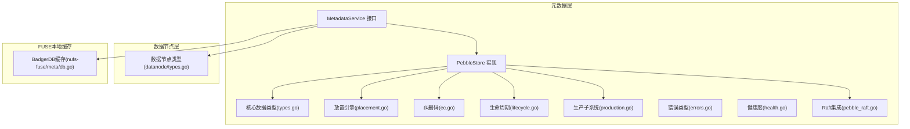

**图表来源**
- [nufs-core/metadata/service.go:15-63](file://nufs-core/metadata/service.go#L15-L63)
- [nufs-core/metadata/pebble_store.go:16-31](file://nufs-core/metadata/pebble_store.go#L16-L31)
- [nufs-core/metadata/types.go:30-144](file://nufs-core/metadata/types.go#L30-L144)
- [nufs-core/metadata/placement.go:27-137](file://nufs-core/metadata/placement.go#L27-L137)
- [nufs-core/metadata/ec.go:13-34](file://nufs-core/metadata/ec.go#L13-L34)
- [nufs-core/metadata/lifecycle.go:35-46](file://nufs-core/metadata/lifecycle.go#L35-L46)
- [nufs-core/metadata/production.go:54-120](file://nufs-core/metadata/production.go#L54-L120)
- [nufs-core/metadata/pebble_raft.go:168-209](file://nufs-core/metadata/pebble_raft.go#L168-L209)
- [nufs-core/datanode/types.go:14-54](file://nufs-core/datanode/types.go#L14-L54)
- [nufs-fuse/meta/db.go:38-58](file://nufs-fuse/meta/db.go#L38-L58)

**章节来源**
- [nufs-core/metadata/service.go:15-63](file://nufs-core/metadata/service.go#L15-L63)
- [nufs-core/metadata/pebble_store.go:16-31](file://nufs-core/metadata/pebble_store.go#L16-L31)
- [nufs-core/metadata/types.go:30-144](file://nufs-core/metadata/types.go#L30-L144)
- [nufs-core/metadata/placement.go:27-137](file://nufs-core/metadata/placement.go#L27-L137)
- [nufs-core/metadata/ec.go:13-34](file://nufs-core/metadata/ec.go#L13-L34)
- [nufs-core/metadata/lifecycle.go:35-46](file://nufs-core/metadata/lifecycle.go#L35-L46)
- [nufs-core/metadata/production.go:54-120](file://nufs-core/metadata/production.go#L54-L120)
- [nufs-core/metadata/pebble_raft.go:168-209](file://nufs-core/metadata/pebble_raft.go#L168-L209)
- [nufs-core/datanode/types.go:14-54](file://nufs-core/datanode/types.go#L14-L54)
- [nufs-fuse/meta/db.go:38-58](file://nufs-fuse/meta/db.go#L38-L58)

## 核心组件
- InodeMeta：文件/目录的元数据，包含类型、权限、时间戳、硬链接计数、大小、扩展属性、符号链接目标、分块映射等。
- ChunkMeta：数据块元数据，包含大小、状态、副本列表、纠删码组信息、创建时间、校验和等。
- NodeInfo：数据节点信息，包含地址、数据目录、拓扑域、容量、使用量、块数量、状态、最后心跳时间等。
- DirEntry：命名空间中的目录项，指向父inode下的子项。
- BucketInfo：桶元数据，根inode、放置策略、创建时间。
- PlacementPolicy：桶级放置策略，包含副本因子、纠删码配置、拓扑隔离级别、存储层级。
- RepairTask：待修复任务。
- ChunkRef：文件到块的引用，含偏移、长度、MVCC版本。
- ReplicaInfo/ReplicaState：副本位置与同步状态。
- ChunkState/NodeState：块与节点生命周期状态。

**章节来源**
- [nufs-core/metadata/types.go:30-144](file://nufs-core/metadata/types.go#L30-L144)
- [nufs-core/metadata/types.go:172-209](file://nufs-core/metadata/types.go#L172-L209)

## 架构总览
元数据服务通过PebbleStore实现统一接口，采用键空间前缀组织数据；放置引擎根据策略选择节点并进行拓扑隔离；纠删码模块提供数据保护；生命周期引擎按规则自动迁移与过期；生产子系统提供事件总线、租约、GC、校验器与Raft一致性。

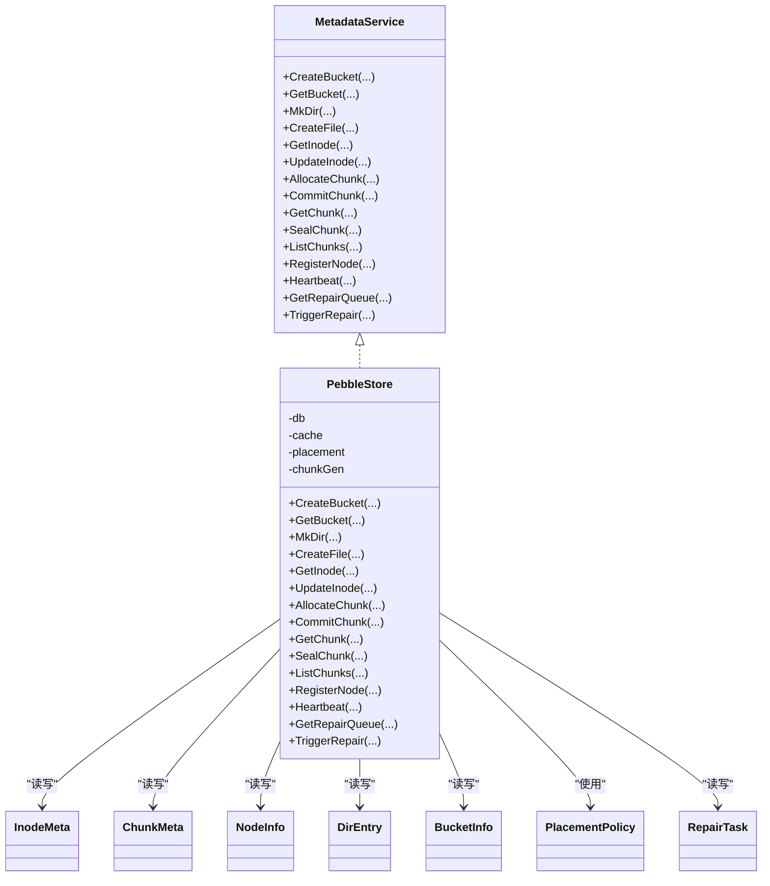

**图表来源**
- [nufs-core/metadata/service.go:15-63](file://nufs-core/metadata/service.go#L15-L63)
- [nufs-core/metadata/pebble_store.go:16-31](file://nufs-core/metadata/pebble_store.go#L16-L31)
- [nufs-core/metadata/types.go:30-144](file://nufs-core/metadata/types.go#L30-L144)

## 详细组件分析

### 数据模型与ER关系
- 键空间前缀约定（示例）
  - /bucket/{name} → BucketInfo
  - /policy/{bucket} → PlacementPolicy
  - /inode/{inode_id} → InodeMeta
  - /ns/{parent_inode}/{name} → DirEntry
  - /chunk/{chunk_id} → ChunkMeta
  - /node/{node_id} → NodeInfo
  - /repair/{chunk_id} → RepairTask
- 主键/外键与索引
  - InodeMeta.id 唯一主键（自增序列）
  - DirEntry.inode 指向 InodeMeta.id
  - ChunkMeta.id 唯一主键（Snowflake风格）
  - ChunkRef.id 引用 ChunkMeta.id
  - NodeInfo.id 唯一主键
  - BucketInfo.root_inode 指向 InodeMeta.id
  - 放置策略与纠删码通过结构体字段关联
- 约束与验证
  - 文件名长度限制、目录非空检查、硬链接计数更新、块状态机转换、节点租约过期标记、MVCC版本冲突检测

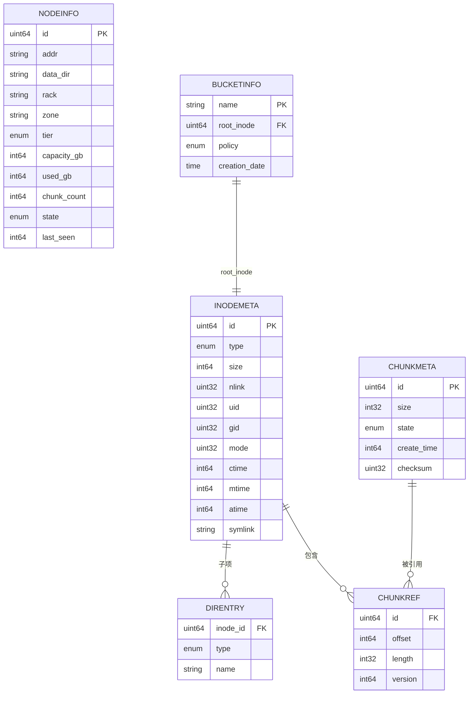

**图表来源**
- [nufs-core/metadata/types.go:30-144](file://nufs-core/metadata/types.go#L30-L144)
- [nufs-core/metadata/pebble_store.go:253-303](file://nufs-core/metadata/pebble_store.go#L253-L303)

**章节来源**
- [nufs-core/metadata/types.go:30-144](file://nufs-core/metadata/types.go#L30-L144)
- [nufs-core/metadata/pebble_store.go:253-303](file://nufs-core/metadata/pebble_store.go#L253-L303)

### InodeMeta 设计与用途
- 字段与语义
  - 类型、权限、时间戳、硬链接计数、大小、扩展属性、符号链接目标、分块映射
- 关键规则
  - 目录的nlink随子目录创建递增，删除时递减
  - 文件写入时追加ChunkRef，更新mtime
  - 软链接类型字段与symlink目标
- 访问模式
  - 读取：GetInode
  - 更新：UpdateInode 或 MVCC CAS
  - 删除：Unlink减少nlink，为0时删除inode
- 并发与一致性
  - 使用MVCC版本号避免并发更新冲突

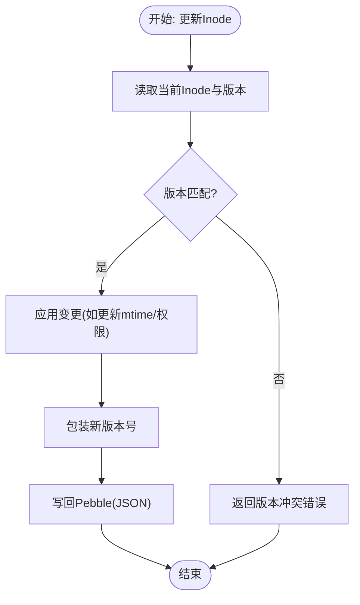

**图表来源**
- [nufs-core/metadata/production.go:140-189](file://nufs-core/metadata/production.go#L140-L189)

**章节来源**
- [nufs-core/metadata/types.go:30-50](file://nufs-core/metadata/types.go#L30-L50)
- [nufs-core/metadata/pebble_store.go:614-638](file://nufs-core/metadata/pebble_store.go#L614-L638)
- [nufs-core/metadata/production.go:140-189](file://nufs-core/metadata/production.go#L140-L189)

### ChunkMeta 设计与用途
- 字段与语义
  - 大小、状态、副本列表、纠删码组、创建时间、校验和
- 生命周期
  - 分配：AllocateChunk生成ChunkID并初始化状态为“封印中”
  - 提交：CommitChunk设置为“已封印”，记录校验和
  - 封印：SealChunk将状态转为“就绪”
  - 报告：ReportChunkState由节点心跳上报副本状态
- 存储布局
  - 数据节点本地磁盘按分片目录组织，文件头包含魔数、chunk_id、数据长度、CRC32C校验

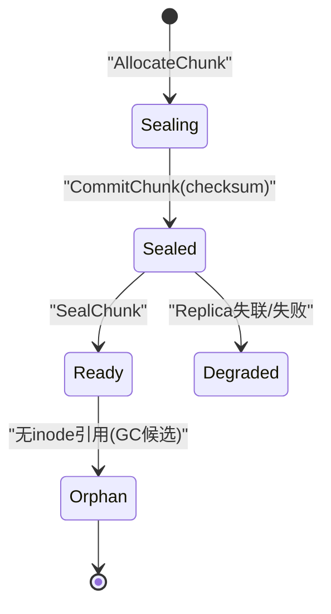

**图表来源**
- [nufs-core/metadata/types.go:90-99](file://nufs-core/metadata/types.go#L90-L99)
- [nufs-core/metadata/pebble_store.go:834-891](file://nufs-core/metadata/pebble_store.go#L834-L891)
- [nufs-core/datanode/types.go:120-146](file://nufs-core/datanode/types.go#L120-L146)

**章节来源**
- [nufs-core/metadata/types.go:78-88](file://nufs-core/metadata/types.go#L78-L88)
- [nufs-core/metadata/pebble_store.go:781-832](file://nufs-core/metadata/pebble_store.go#L781-L832)
- [nufs-core/datanode/types.go:120-146](file://nufs-core/datanode/types.go#L120-L146)

### NodeInfo 设计与用途
- 字段与语义
  - 地址、数据目录、机架/可用区、存储层级、容量/使用量、块数量、状态、最后心跳
- 运维功能
  - 注册：RegisterNode
  - 心跳：Heartbeat更新状态与负载指标
  - 下线：租约过期触发离线标记
  - 下线回收：DecommissionNode进入“正在下线”状态

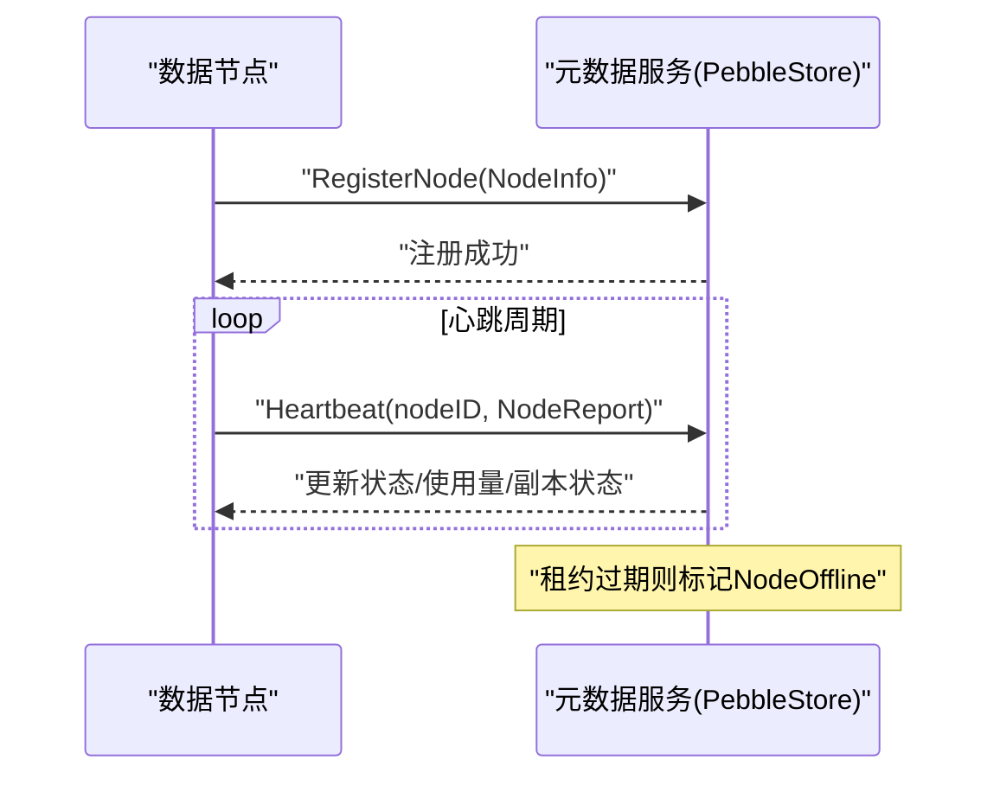

**图表来源**
- [nufs-core/metadata/pebble_store.go:939-989](file://nufs-core/metadata/pebble_store.go#L939-L989)
- [nufs-core/metadata/production.go:273-303](file://nufs-core/metadata/production.go#L273-L303)

**章节来源**
- [nufs-core/metadata/types.go:129-144](file://nufs-core/metadata/types.go#L129-L144)
- [nufs-core/metadata/pebble_store.go:939-1006](file://nufs-core/metadata/pebble_store.go#L939-L1006)
- [nufs-core/metadata/production.go:273-303](file://nufs-core/metadata/production.go#L273-L303)

### 命名空间与目录操作
- 关键操作
  - MkDir/CreateFile：创建目录/文件并建立DirEntry
  - ReadDir：按前缀扫描返回目录项
  - Lookup/Rename/Unlink/Symlink/Link：命名空间维护
- 约束
  - 名称长度限制
  - 目录非空检查
  - 硬链接计数维护

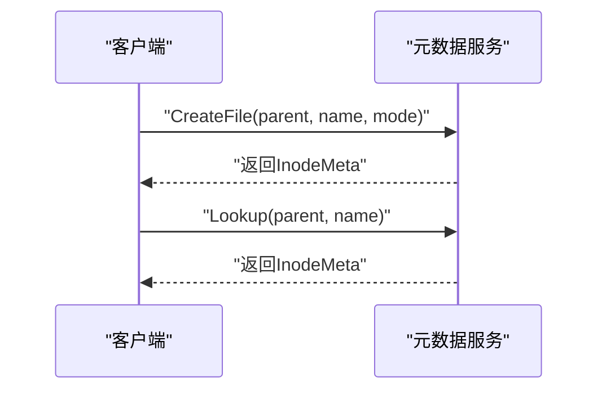

**图表来源**
- [nufs-core/metadata/pebble_store.go:511-549](file://nufs-core/metadata/pebble_store.go#L511-L549)
- [nufs-core/metadata/pebble_store.go:588-612](file://nufs-core/metadata/pebble_store.go#L588-L612)

**章节来源**
- [nufs-core/metadata/pebble_store.go:371-428](file://nufs-core/metadata/pebble_store.go#L371-L428)
- [nufs-core/metadata/pebble_store.go:511-549](file://nufs-core/metadata/pebble_store.go#L511-L549)
- [nufs-core/metadata/pebble_store.go:588-612](file://nufs-core/metadata/pebble_store.go#L588-L612)

### 放置策略与纠删码
- 放置策略
  - 副本因子、拓扑隔离级别（节点/机架/可用区）、存储层级过滤
  - 基于剩余容量、低负载、层级匹配打分，随机抖动避免热点
- 纠删码
  - 数据分片+奇偶分片，提供容错能力
  - 示例实现基于简单XOR校验，生产建议使用成熟库

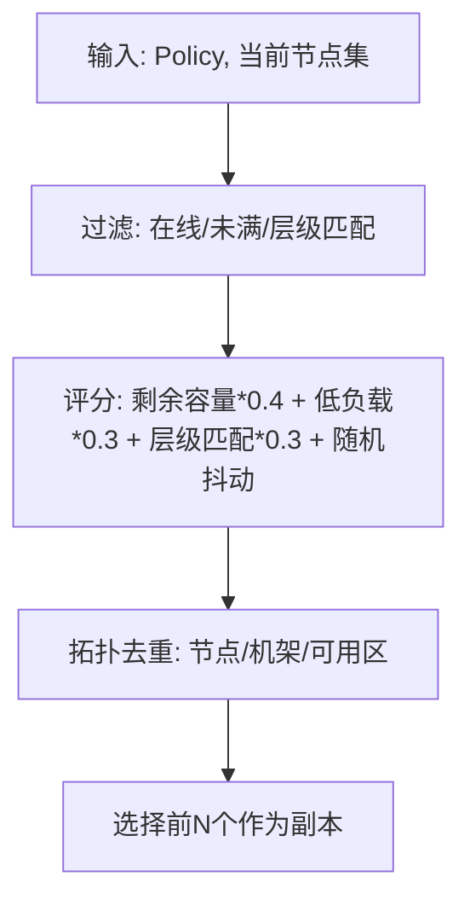

**图表来源**
- [nufs-core/metadata/placement.go:66-137](file://nufs-core/metadata/placement.go#L66-L137)
- [nufs-core/metadata/ec.go:13-82](file://nufs-core/metadata/ec.go#L13-L82)

**章节来源**
- [nufs-core/metadata/placement.go:66-137](file://nufs-core/metadata/placement.go#L66-L137)
- [nufs-core/metadata/ec.go:13-82](file://nufs-core/metadata/ec.go#L13-L82)

### 生命周期与归档
- 规则
  - 过渡：按天迁移到更高层级（如从热到冷）
  - 过期：达到天数后将nlink置0，触发GC删除
- 执行
  - 定时扫描桶内所有inode，匹配前缀与规则，更新元数据或标记删除

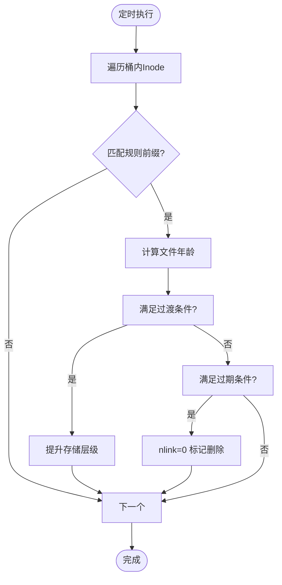

**图表来源**
- [nufs-core/metadata/lifecycle.go:99-178](file://nufs-core/metadata/lifecycle.go#L99-L178)

**章节来源**
- [nufs-core/metadata/lifecycle.go:16-46](file://nufs-core/metadata/lifecycle.go#L16-L46)
- [nufs-core/metadata/lifecycle.go:99-178](file://nufs-core/metadata/lifecycle.go#L99-L178)

### 生产级子系统
- 事件总线：发布/订阅元数据变更事件，用于通知修复、再平衡等后台任务
- 租约管理：基于心跳TTL检测节点离线并触发修复流程
- 垃圾回收：扫描inodes引用，回收孤儿块
- 数据校验器：定期检查块校验一致性，触发修复
- Raft一致性：日志条目编码、快照持久化、状态机恢复

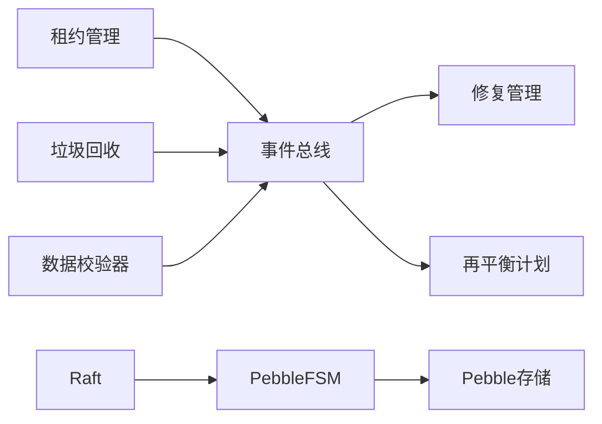

**图表来源**
- [nufs-core/metadata/production.go:54-120](file://nufs-core/metadata/production.go#L54-L120)
- [nufs-core/metadata/production.go:220-303](file://nufs-core/metadata/production.go#L220-L303)
- [nufs-core/metadata/production.go:309-429](file://nufs-core/metadata/production.go#L309-L429)
- [nufs-core/metadata/production.go:435-528](file://nufs-core/metadata/production.go#L435-L528)
- [nufs-core/metadata/pebble_raft.go:168-209](file://nufs-core/metadata/pebble_raft.go#L168-L209)

**章节来源**
- [nufs-core/metadata/production.go:54-120](file://nufs-core/metadata/production.go#L54-L120)
- [nufs-core/metadata/production.go:220-303](file://nufs-core/metadata/production.go#L220-L303)
- [nufs-core/metadata/production.go:309-429](file://nufs-core/metadata/production.go#L309-L429)
- [nufs-core/metadata/production.go:435-528](file://nufs-core/metadata/production.go#L435-L528)
- [nufs-core/metadata/pebble_raft.go:168-209](file://nufs-core/metadata/pebble_raft.go#L168-L209)

### FUSE本地元数据缓存
- 使用BadgerDB在本地缓存元数据，减少对远端元数据服务的访问
- 提供事务、迭代、序列号等能力，兼容BoltDB风格API

**章节来源**
- [nufs-fuse/meta/db.go:38-107](file://nufs-fuse/meta/db.go#L38-L107)
- [nufs-fuse/meta/db.go:165-238](file://nufs-fuse/meta/db.go#L165-L238)

## 依赖分析
- 组件耦合
  - MetadataService抽象与PebbleStore实现解耦，便于替换后端
  - 放置引擎与元数据存储分离，便于独立演进
  - Raft集成通过FSM与快照机制实现强一致
- 外部依赖
  - Pebble（LSM存储）
  - Raft（共识库）
  - BadgerDB（FUSE本地缓存）

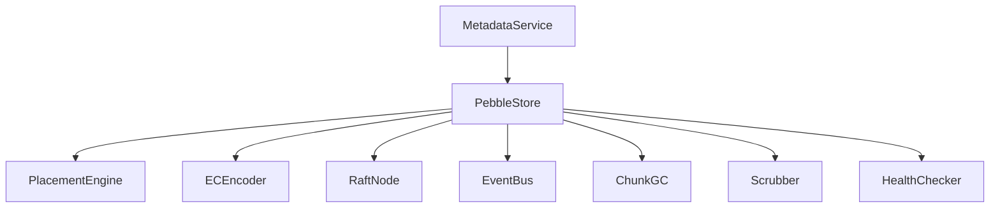

**图表来源**
- [nufs-core/metadata/service.go:15-63](file://nufs-core/metadata/service.go#L15-L63)
- [nufs-core/metadata/pebble_store.go:16-31](file://nufs-core/metadata/pebble_store.go#L16-L31)
- [nufs-core/metadata/placement.go:27-42](file://nufs-core/metadata/placement.go#L27-L42)
- [nufs-core/metadata/ec.go:13-34](file://nufs-core/metadata/ec.go#L13-L34)
- [nufs-core/metadata/pebble_raft.go:384-407](file://nufs-core/metadata/pebble_raft.go#L384-L407)
- [nufs-core/metadata/production.go:54-120](file://nufs-core/metadata/production.go#L54-L120)

**章节来源**
- [nufs-core/metadata/service.go:15-63](file://nufs-core/metadata/service.go#L15-L63)
- [nufs-core/metadata/pebble_store.go:16-31](file://nufs-core/metadata/pebble_store.go#L16-L31)
- [nufs-core/metadata/pebble_raft.go:384-407](file://nufs-core/metadata/pebble_raft.go#L384-L407)

## 性能考虑
- 存储引擎
  - Pebble作为LSM存储，适合高基数、顺序写入场景；可配置内存表大小、最大打开文件数
  - 可选二级Pebble实例作为只读缓存
- 并发与一致性
  - MVCC版本号避免写冲突；批处理原子性写入
- IO与网络
  - 数据节点磁盘布局分片（256个子目录），避免单目录文件过多
  - Raft日志压缩与快照减少日志体积
- 监控与可观测性
  - 操作计数、读写延迟直方图、错误率、Raft状态、运行时长

**章节来源**
- [nufs-core/metadata/pebble_store.go:33-47](file://nufs-core/metadata/pebble_store.go#L33-L47)
- [nufs-core/metadata/production.go:16-51](file://nufs-core/metadata/production.go#L16-L51)
- [nufs-core/metadata/health.go:16-94](file://nufs-core/metadata/health.go#L16-L94)
- [nufs-core/datanode/types.go:120-146](file://nufs-core/datanode/types.go#L120-L146)

## 故障排查指南
- 常见错误类别
  - 命名空间类：桶存在/不存在、条目存在/不存在、名称过长、目录非空
  - 块类：块不存在、未封印、已封印、校验和不匹配
  - 节点/集群类：节点不存在/已存在、节点离线、节点下线、放置失败
  - 系统类：服务关闭、参数无效、内部错误、版本冲突、租约过期、非Leader、Raft应用失败、超时
- 健康检查
  - /health：Pebble可读、根inode存在、Raft状态、错误率阈值
  - /ready：健康状态判定
  - /metrics：导出运行时指标

**章节来源**
- [nufs-core/metadata/errors.go:12-90](file://nufs-core/metadata/errors.go#L12-L90)
- [nufs-core/metadata/health.go:189-327](file://nufs-core/metadata/health.go#L189-L327)

## 结论
NUFS元数据层以清晰的数据模型与接口抽象为核心，结合Pebble存储、Raft一致性、放置与纠删码策略，构建了高可用、可扩展的分布式文件系统元数据体系。通过事件总线、租约、GC与校验器等生产子系统，保障了运维自动化与数据完整性。FUSE本地缓存进一步降低了元数据访问延迟。建议在生产部署中启用Raft、合理配置生命周期规则与GC周期，并持续监控健康指标与错误率。

## 附录

### 数据访问模式与缓存策略
- 元数据访问
  - 读多写少：利用只读缓存（可选二级Pebble）
  - 写路径：批处理原子写入，Raft可选强一致
- FUSE缓存
  - BadgerDB本地缓存，事务隔离，序列号自增，单层迭代
- 数据节点缓存
  - 本地磁盘分片布局，避免目录过大；可选sidecar元数据文件

**章节来源**
- [nufs-core/metadata/pebble_store.go:33-47](file://nufs-core/metadata/pebble_store.go#L33-L47)
- [nufs-fuse/meta/db.go:38-107](file://nufs-fuse/meta/db.go#L38-L107)
- [nufs-core/datanode/types.go:120-146](file://nufs-core/datanode/types.go#L120-L146)

### 数据生命周期、保留与归档
- 过渡：按天迁移到更高存储层级
- 过期：达到天数后标记删除（nlink=0），随后GC清理
- 归档：通过Tier提升实现冷热分层

**章节来源**
- [nufs-core/metadata/lifecycle.go:16-46](file://nufs-core/metadata/lifecycle.go#L16-L46)
- [nufs-core/metadata/lifecycle.go:99-178](file://nufs-core/metadata/lifecycle.go#L99-L178)

### 数据迁移路径与版本管理
- 版本
  - 服务版本通过选项注入，默认版本字符串
- 迁移
  - Raft快照：全量KV流式序列化，支持恢复重建
  - 日志压缩：快照完成后截断旧日志，保留尾部日志

**章节来源**
- [nufs-core/metadata/service.go:188-196](file://nufs-core/metadata/service.go#L188-L196)
- [nufs-core/metadata/pebble_raft.go:246-322](file://nufs-core/metadata/pebble_raft.go#L246-L322)
- [nufs-core/metadata/pebble_raft.go:486-505](file://nufs-core/metadata/pebble_raft.go#L486-L505)

### 安全、隐私与访问控制
- 访问控制
  - 元数据层面：通过桶策略与节点租约控制可见性与可用性
  - 数据层面：块状态与副本分布确保数据冗余与隔离
- 隐私与合规
  - 生命周期规则支持按天过期，便于满足数据保留与删除要求
- 安全建议
  - 启用Raft强一致与快照备份
  - 监控错误率与健康状态，及时发现异常

**章节来源**
- [nufs-core/metadata/types.go:172-209](file://nufs-core/metadata/types.go#L172-L209)
- [nufs-core/metadata/lifecycle.go:16-46](file://nufs-core/metadata/lifecycle.go#L16-L46)
- [nufs-core/metadata/health.go:189-290](file://nufs-core/metadata/health.go#L189-L290)