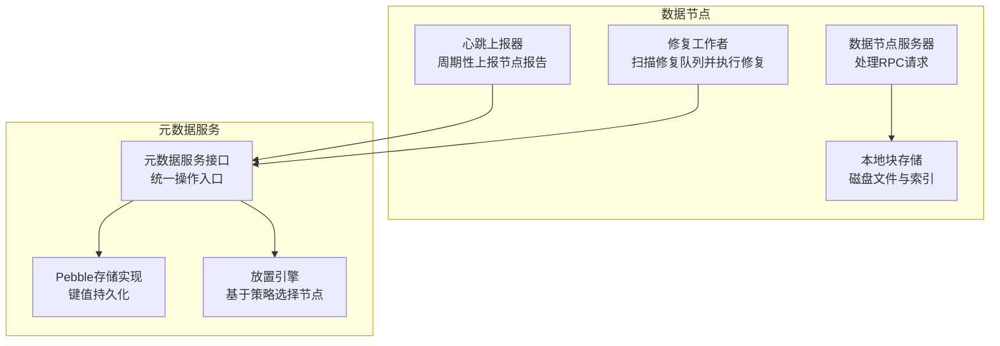
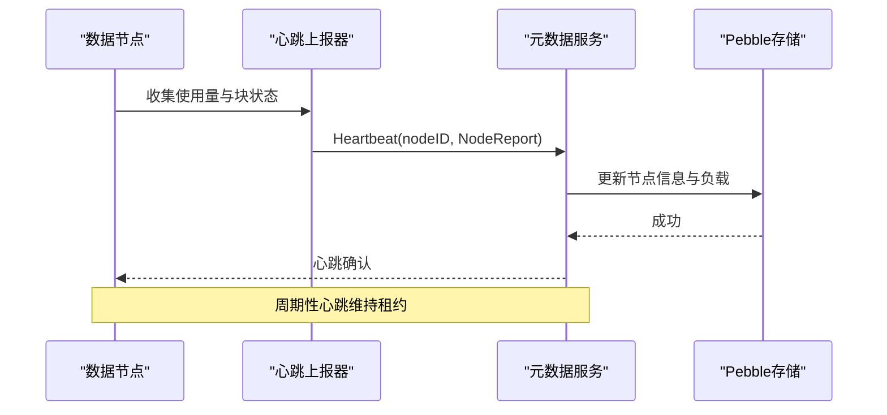
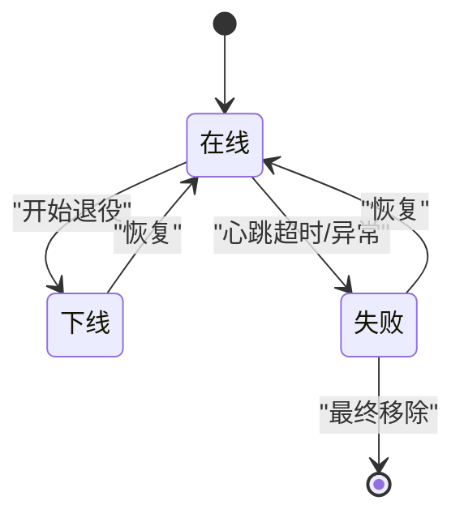
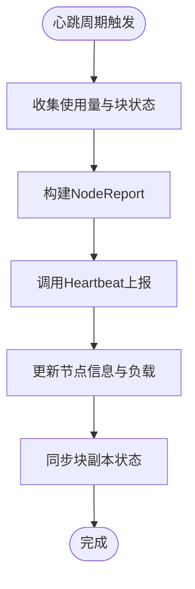
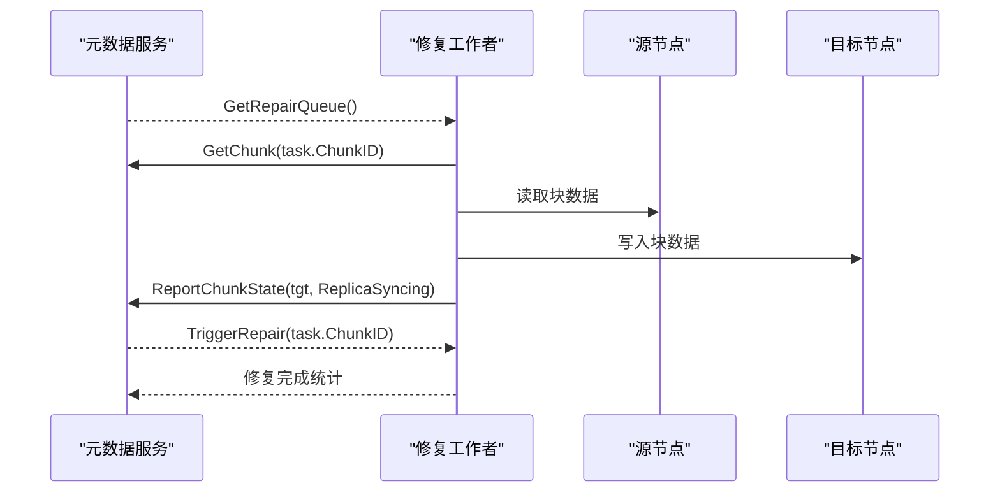
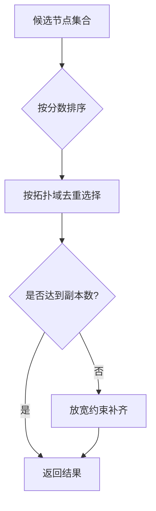
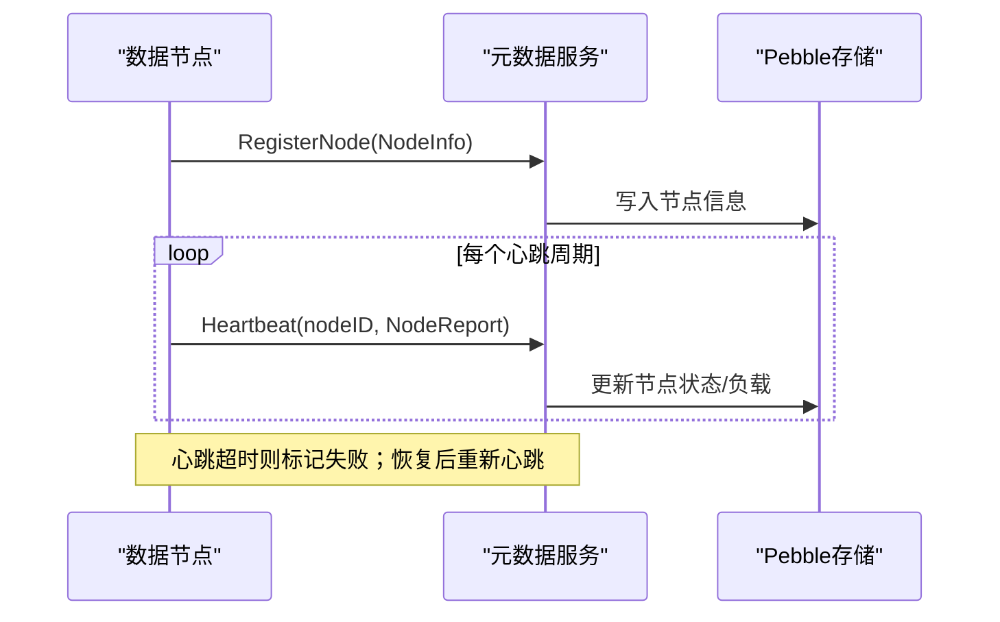
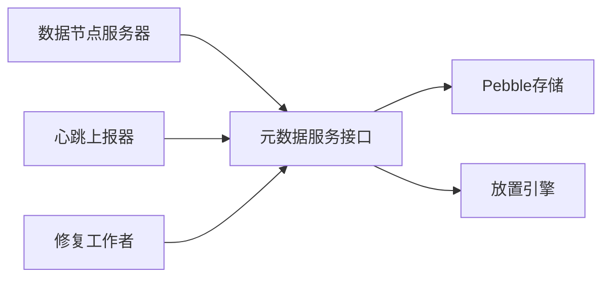

# 节点与集群模型

<cite>
**本文档引用的文件**
- [types.go](file://nufs-core/metadata/types.go)
- [heartbeat.go](file://nufs-core/datanode/heartbeat.go)
- [repair.go](file://nufs-core/datanode/repair.go)
- [placement.go](file://nufs-core/metadata/placement.go)
- [service.go](file://nufs-core/metadata/service.go)
- [server.go](file://nufs-core/datanode/server.go)
- [chunkstore.go](file://nufs-core/datanode/chunkstore.go)
- [pebble_store.go](file://nufs-core/metadata/pebble_store.go)
</cite>

## 目录
1. [简介](#简介)
2. [项目结构](#项目结构)
3. [核心组件](#核心组件)
4. [架构总览](#架构总览)
5. [详细组件分析](#详细组件分析)
6. [依赖分析](#依赖分析)
7. [性能考虑](#性能考虑)
8. [故障排查指南](#故障排查指南)
9. [结论](#结论)
10. [附录](#附录)

## 简介
本文件面向NUFS分布式文件系统的节点与集群模型，围绕以下主题展开：节点信息结构（NodeInfo）、节点状态与故障检测（NodeState）、节点报告（NodeReport）、修复任务（RepairTask）的优先级与执行、存储分层（StorageTier）设计、拓扑传播（TopologySpread）策略、桶信息（BucketInfo）元数据管理，以及集群节点注册、心跳检测与故障恢复的完整流程。

## 项目结构
NUFS采用分层架构：
- 数据节点（datanode）负责本地磁盘上的块存储、读写、复制与健康上报。
- 元数据服务（metadata）负责命名空间、桶策略、块元数据、节点注册与心跳、修复队列等。
- 存储后端（Pebble）作为键值存储，承载元数据持久化；可选集成Raft实现一致性。

图表来源
- [server.go:18-126](file://nufs-core/datanode/server.go#L18-L126)
- [chunkstore.go:18-51](file://nufs-core/datanode/chunkstore.go#L18-L51)
- [heartbeat.go:12-107](file://nufs-core/datanode/heartbeat.go#L12-L107)
- [repair.go:13-183](file://nufs-core/datanode/repair.go#L13-L183)
- [service.go:16-67](file://nufs-core/metadata/service.go#L16-L67)
- [pebble_store.go:16-89](file://nufs-core/metadata/pebble_store.go#L16-L89)
- [placement.go:27-64](file://nufs-core/metadata/placement.go#L27-L64)

章节来源
- [server.go:18-126](file://nufs-core/datanode/server.go#L18-L126)
- [chunkstore.go:18-51](file://nufs-core/datanode/chunkstore.go#L18-L51)
- [heartbeat.go:12-107](file://nufs-core/datanode/heartbeat.go#L12-L107)
- [repair.go:13-183](file://nufs-core/datanode/repair.go#L13-L183)
- [service.go:16-67](file://nufs-core/metadata/service.go#L16-L67)
- [pebble_store.go:16-89](file://nufs-core/metadata/pebble_store.go#L16-L89)
- [placement.go:27-64](file://nufs-core/metadata/placement.go#L27-L64)

## 核心组件
- 节点信息（NodeInfo）：包含节点标识、网络地址、数据目录、拓扑域（机架/可用区）、存储分层、容量与使用量、块数量、状态与最后心跳时间戳。
- 节点状态（NodeState）：在线、下线、失败、退役（用于节点退役流程）。
- 节点报告（NodeReport）：已用容量、块数量、磁盘IO利用率、块状态映射。
- 修复任务（RepairTask）：块ID、原因、优先级、创建时间。
- 存储分层（StorageTier）：任意、热（NVMe）、温（SSD）、冷（HDD）、归档（带库/远程冷存储）。
- 拓扑传播（TopologySpread）：节点级别、机架级别、可用区级别。
- 桶信息（BucketInfo）：桶名、根inode、放置策略、创建时间。

章节来源
- [types.go:129-144](file://nufs-core/metadata/types.go#L129-L144)
- [types.go:146-154](file://nufs-core/metadata/types.go#L146-L154)
- [types.go:156-162](file://nufs-core/metadata/types.go#L156-L162)
- [types.go:164-170](file://nufs-core/metadata/types.go#L164-L170)
- [types.go:199-209](file://nufs-core/metadata/types.go#L199-L209)
- [types.go:190-197](file://nufs-core/metadata/types.go#L190-L197)
- [types.go:60-66](file://nufs-core/metadata/types.go#L60-L66)

## 架构总览
数据节点通过心跳向元数据服务上报节点报告，元数据服务据此更新节点状态与负载，并维护块副本状态。当块处于降级或孤儿状态时，元数据服务生成修复任务，数据节点修复工作者按周期扫描并执行修复。

图表来源
- [heartbeat.go:71-100](file://nufs-core/datanode/heartbeat.go#L71-L100)
- [pebble_store.go:961-989](file://nufs-core/metadata/pebble_store.go#L961-L989)

## 详细组件分析

### 节点信息结构（NodeInfo）
- 字段含义
  - 标识与网络：节点ID、监听地址、数据目录。
  - 拓扑与分层：机架、可用区、存储分层。
  - 容量与使用：总容量（GB）、已用（GB）、块数量。
  - 状态与时间：节点状态、最后心跳时间戳。
- 用途
  - 作为集群节点注册与心跳的基础信息。
  - 用于放置策略与拓扑传播约束。
  - 用于负载均衡与健康检查。

章节来源
- [types.go:129-144](file://nufs-core/metadata/types.go#L129-L144)

### 节点状态与故障检测（NodeState）
- 状态定义
  - 在线：正常运行。
  - 下线：主动退役中。
  - 失败：心跳丢失或异常。
- 故障检测机制
  - 心跳间隔与租约：元数据服务根据心跳时间戳更新节点状态。
  - 租约到期：若超过租约时间未收到心跳，则标记为失败。
  - 退役流程：将节点状态置为下线，逐步驱逐其上的块。

图表来源
- [types.go:146-154](file://nufs-core/metadata/types.go#L146-L154)
- [pebble_store.go:961-989](file://nufs-core/metadata/pebble_store.go#L961-L989)

章节来源
- [types.go:146-154](file://nufs-core/metadata/types.go#L146-L154)
- [pebble_store.go:961-989](file://nufs-core/metadata/pebble_store.go#L961-L989)

### 节点报告（NodeReport）
- 内容
  - 已用容量（GB）、块数量、磁盘IO利用率（0.0–1.0）。
  - 块状态映射：块ID到副本状态的映射。
- 上报流程
  - 数据节点周期性收集本地统计与块状态，封装为NodeReport并发送。
  - 元数据服务更新节点信息、负载索引，并同步块副本状态。

图表来源
- [heartbeat.go:71-100](file://nufs-core/datanode/heartbeat.go#L71-L100)
- [pebble_store.go:961-989](file://nufs-core/metadata/pebble_store.go#L961-L989)

章节来源
- [heartbeat.go:71-100](file://nufs-core/datanode/heartbeat.go#L71-L100)
- [types.go:156-162](file://nufs-core/metadata/types.go#L156-L162)
- [pebble_store.go:961-989](file://nufs-core/metadata/pebble_store.go#L961-L989)

### 修复任务（RepairTask）与执行
- 结构
  - 块ID、原因、优先级、创建时间。
- 优先级与调度
  - 元数据服务维护修复队列，按块状态与策略生成任务。
  - 数据节点修复工作者周期扫描队列，逐个执行修复。
- 执行机制
  - 获取块元数据，定位健康副本源。
  - 选择目标节点（排除已有副本所在节点且状态为在线）。
  - 触发复制与状态上报，更新块副本状态。

图表来源
- [repair.go:98-182](file://nufs-core/datanode/repair.go#L98-L182)
- [pebble_store.go:1061-1087](file://nufs-core/metadata/pebble_store.go#L1061-L1087)

章节来源
- [repair.go:13-183](file://nufs-core/datanode/repair.go#L13-L183)
- [types.go:164-170](file://nufs-core/metadata/types.go#L164-L170)
- [pebble_store.go:1061-1087](file://nufs-core/metadata/pebble_store.go#L1061-L1087)

### 存储分层（StorageTier）设计
- 分层定义
  - 任意、热（NVMe）、温（SSD）、冷（HDD）、归档（带库/远程冷存储）。
- 放置策略中的作用
  - 过滤：若策略指定分层，则仅选择匹配的节点。
  - 评分：匹配分层的节点获得更高权重，提升命中率。

章节来源
- [types.go:199-209](file://nufs-core/metadata/types.go#L199-L209)
- [placement.go:89-96](file://nufs-core/metadata/placement.go#L89-L96)
- [placement.go:113-118](file://nufs-core/metadata/placement.go#L113-L118)

### 拓扑传播（TopologySpread）策略
- 级别
  - 节点级别：副本分布在不同节点。
  - 机架级别：副本分布在不同机架。
  - 可用区级别：副本分布在不同AZ/DC。
- 实现
  - 选择候选节点后，按拓扑域去重，优先满足约束。
  - 若无法完全满足，放宽条件填充至所需副本数。

图表来源
- [placement.go:139-195](file://nufs-core/metadata/placement.go#L139-L195)

章节来源
- [types.go:190-197](file://nufs-core/metadata/types.go#L190-L197)
- [placement.go:139-195](file://nufs-core/metadata/placement.go#L139-L195)

### 桶信息（BucketInfo）元数据管理
- 字段
  - 名称、根inode、放置策略、创建时间。
- 生命周期
  - 创建：原子写入桶信息、根inode与策略。
  - 删除：校验空目录后删除。
  - 查询：按名称检索桶与策略。

章节来源
- [types.go:60-66](file://nufs-core/metadata/types.go#L60-L66)
- [pebble_store.go:253-303](file://nufs-core/metadata/pebble_store.go#L253-L303)
- [pebble_store.go:305-336](file://nufs-core/metadata/pebble_store.go#L305-L336)
- [pebble_store.go:338-367](file://nufs-core/metadata/pebble_store.go#L338-L367)

### 集群节点注册、心跳检测与故障恢复流程
- 注册
  - 数据节点启动时向元数据服务注册节点信息，初始状态为在线。
- 心跳
  - 数据节点周期性上报NodeReport，元数据服务更新节点状态与负载。
- 故障检测与恢复
  - 若心跳超时，节点被标记为失败；恢复后重新上线。
  - 退役流程：将节点置为下线，逐步迁移其上块。

图表来源
- [pebble_store.go:939-989](file://nufs-core/metadata/pebble_store.go#L939-L989)
- [heartbeat.go:71-100](file://nufs-core/datanode/heartbeat.go#L71-L100)

章节来源
- [pebble_store.go:939-989](file://nufs-core/metadata/pebble_store.go#L939-L989)
- [heartbeat.go:71-100](file://nufs-core/datanode/heartbeat.go#L71-L100)

## 依赖分析
- 数据节点依赖元数据服务接口进行注册、心跳、修复上报与块状态同步。
- 元数据服务以Pebble作为存储后端，提供键值查询与批量写入能力。
- 放置引擎依赖节点视图与负载指数，结合拓扑与分层策略选择最优节点。

图表来源
- [server.go:18-126](file://nufs-core/datanode/server.go#L18-L126)
- [heartbeat.go:12-107](file://nufs-core/datanode/heartbeat.go#L12-L107)
- [repair.go:13-183](file://nufs-core/datanode/repair.go#L13-L183)
- [service.go:16-67](file://nufs-core/metadata/service.go#L16-L67)
- [pebble_store.go:16-89](file://nufs-core/metadata/pebble_store.go#L16-L89)
- [placement.go:27-64](file://nufs-core/metadata/placement.go#L27-L64)

章节来源
- [service.go:16-67](file://nufs-core/metadata/service.go#L16-L67)
- [pebble_store.go:16-89](file://nufs-core/metadata/pebble_store.go#L16-L89)
- [placement.go:27-64](file://nufs-core/metadata/placement.go#L27-L64)

## 性能考虑
- 并发控制：数据节点对读写操作使用信号量限制并发，避免磁盘争用。
- 存储布局：块文件按哈希分片，避免单目录文件过多。
- 放置评分：综合剩余容量、低负载与分层匹配度，引入随机抖动避免“惊群”。
- 心跳频率：合理设置心跳间隔与租约，平衡实时性与开销。

章节来源
- [chunkstore.go:29-51](file://nufs-core/datanode/chunkstore.go#L29-L51)
- [chunkstore.go:325-351](file://nufs-core/datanode/chunkstore.go#L325-L351)
- [placement.go:118-123](file://nufs-core/metadata/placement.go#L118-L123)
- [heartbeat.go:38-69](file://nufs-core/datanode/heartbeat.go#L38-L69)

## 故障排查指南
- 心跳失败
  - 现象：节点在元数据侧变为失败。
  - 排查：检查数据节点日志、网络连通性、心跳间隔配置。
- 修复任务堆积
  - 现象：修复工作者统计显示失败计数上升。
  - 排查：检查源节点可达性、目标节点在线状态、磁盘IO与容量。
- 放置失败
  - 现象：分配块时提示节点不足或无法满足拓扑约束。
  - 排查：检查策略分层与拓扑级别、可用节点数量与状态。

章节来源
- [heartbeat.go:97-99](file://nufs-core/datanode/heartbeat.go#L97-L99)
- [repair.go:100-116](file://nufs-core/datanode/repair.go#L100-L116)
- [placement.go:99-101](file://nufs-core/metadata/placement.go#L99-L101)
- [placement.go:132-134](file://nufs-core/metadata/placement.go#L132-L134)

## 结论
NUFS通过清晰的节点与集群模型实现了高可用与可扩展的分布式存储：节点信息与状态驱动健康与退役流程，节点报告支撑动态负载感知，修复任务保障数据一致性，存储分层与拓扑传播确保性能与容错，桶信息与放置策略共同完成元数据与数据的协同管理。

## 附录
- 关键流程路径参考
  - 心跳上报：[heartbeat.go:71-100](file://nufs-core/datanode/heartbeat.go#L71-L100)
  - 节点注册与心跳：[pebble_store.go:939-989](file://nufs-core/metadata/pebble_store.go#L939-L989)
  - 修复队列与触发：[repair.go:98-182](file://nufs-core/datanode/repair.go#L98-L182), [pebble_store.go:1061-1087](file://nufs-core/metadata/pebble_store.go#L1061-L1087)
  - 放置策略：[placement.go:66-137](file://nufs-core/metadata/placement.go#L66-L137)
  - 桶元数据：[pebble_store.go:253-303](file://nufs-core/metadata/pebble_store.go#L253-L303), [pebble_store.go:305-336](file://nufs-core/metadata/pebble_store.go#L305-L336)