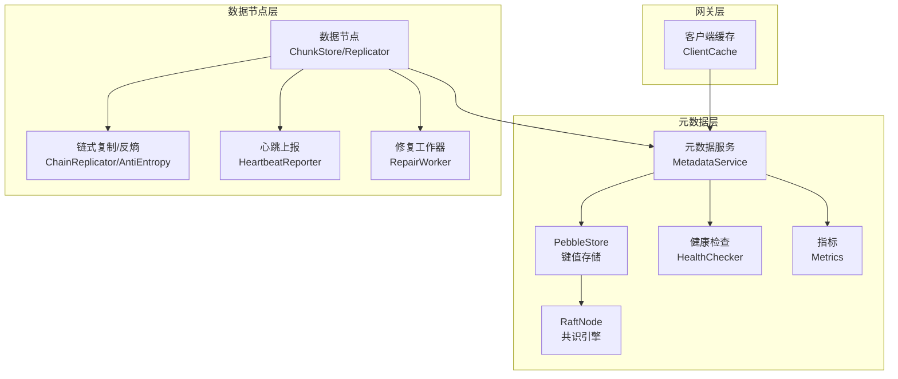
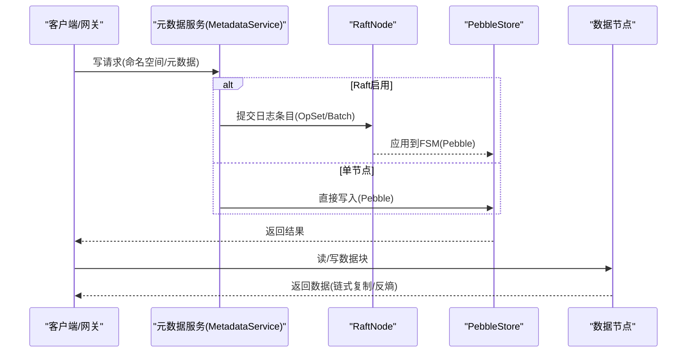
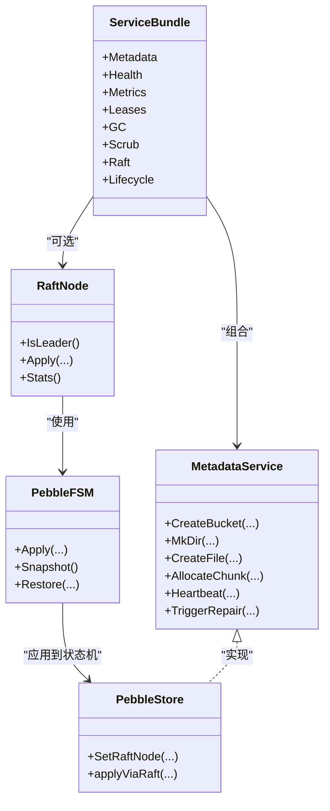
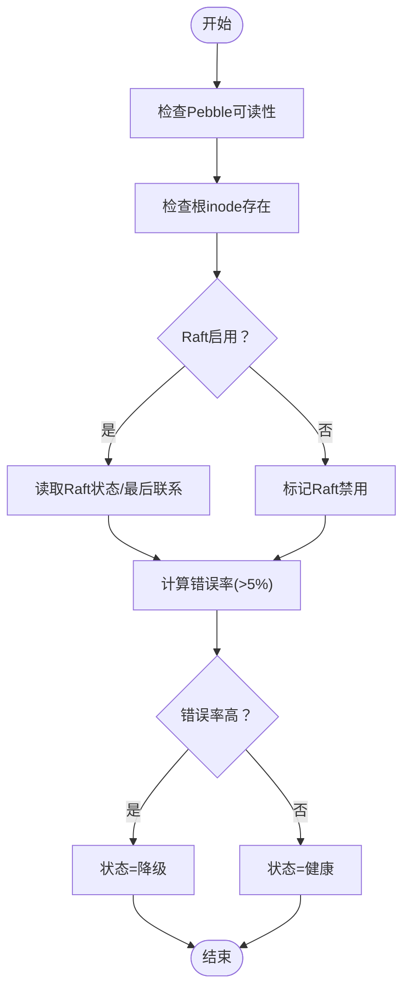
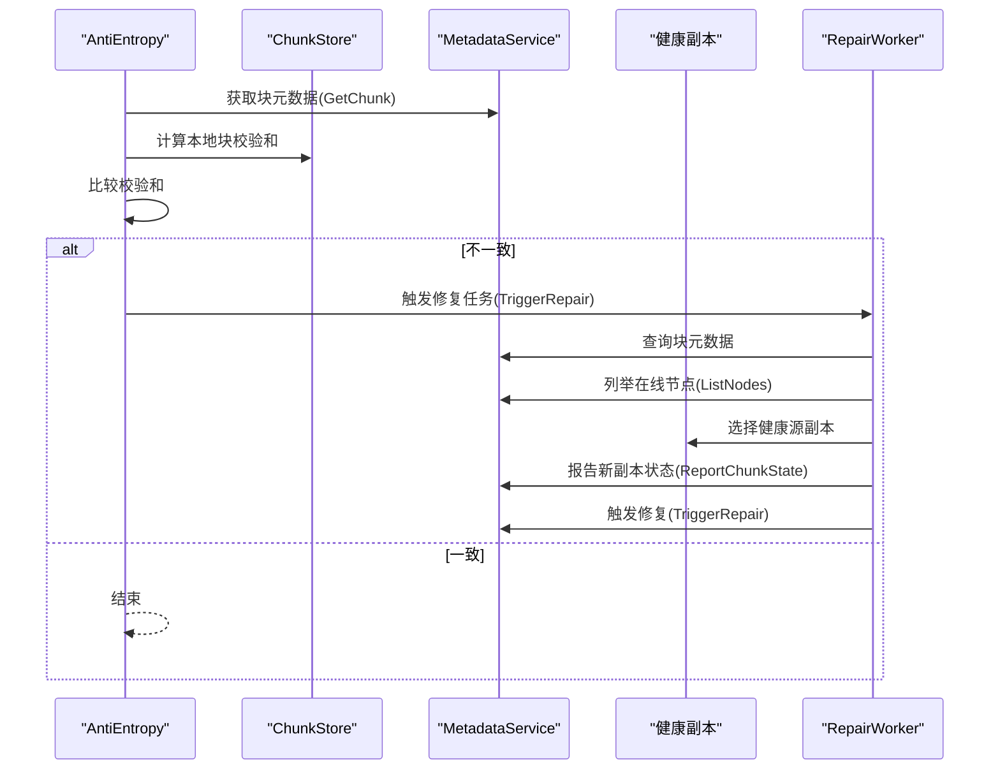
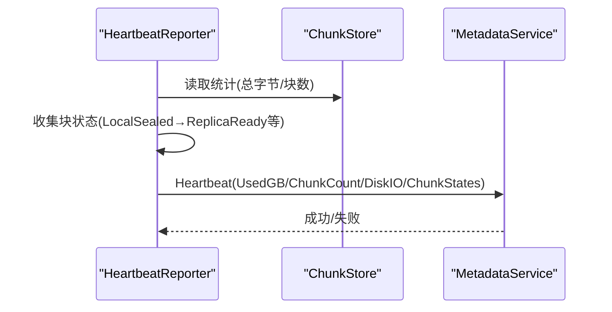
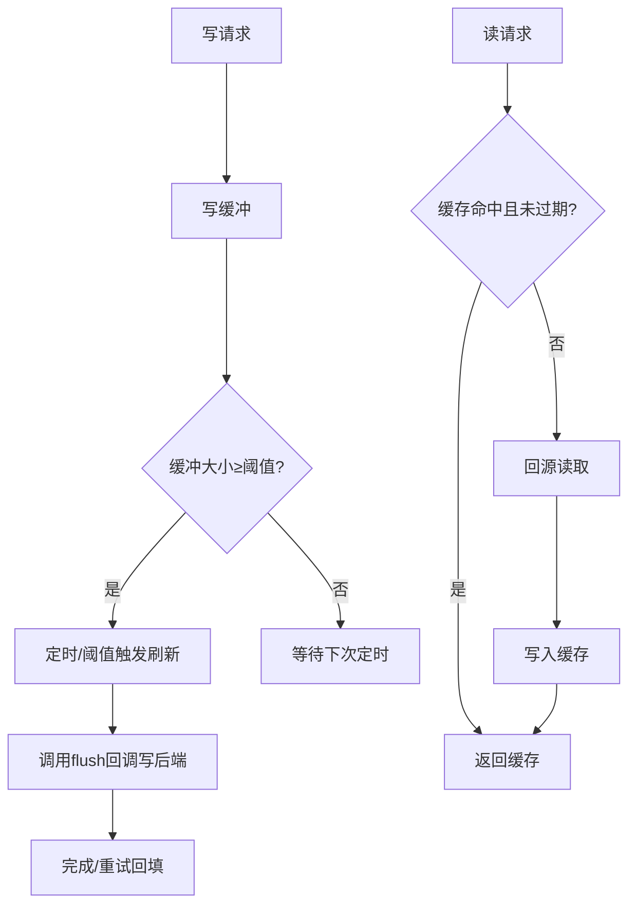
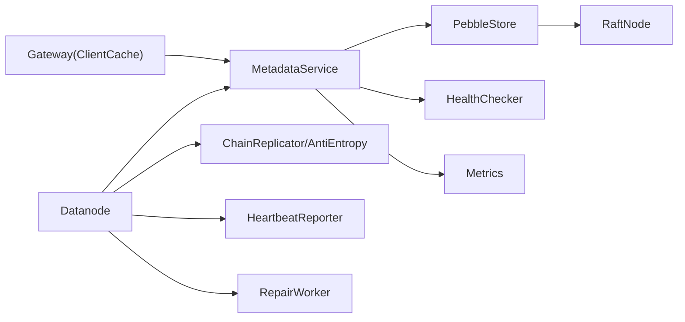

# 一致性模型与容错

<cite>
**本文引用的文件**
- [nufs-core/metadata/service.go](file://nufs-core/metadata/service.go)
- [nufs-core/metadata/pebble_raft.go](file://nufs-core/metadata/pebble_raft.go)
- [nufs-core/metadata/pebble_store.go](file://nufs-core/metadata/pebble_store.go)
- [nufs-core/metadata/health.go](file://nufs-core/metadata/health.go)
- [nufs-core/datanode/ha.go](file://nufs-core/datanode/ha.go)
- [nufs-core/datanode/repair.go](file://nufs-core/datanode/repair.go)
- [nufs-core/datanode/heartbeat.go](file://nufs-core/datanode/heartbeat.go)
- [nufs-core/gateway/cache.go](file://nufs-core/gateway/cache.go)
</cite>

## 目录
1. [引言](#引言)
2. [项目结构](#项目结构)
3. [核心组件](#核心组件)
4. [架构总览](#架构总览)
5. [详细组件分析](#详细组件分析)
6. [依赖关系分析](#依赖关系分析)
7. [性能考量](#性能考量)
8. [故障排查指南](#故障排查指南)
9. [结论](#结论)
10. [附录](#附录)

## 引言
本文件面向NUFS系统的一致性模型与容错机制，系统采用“多层一致性”设计：通过Raft共识保障元数据强一致；通过乐观并发控制（OCC）与版本化语义处理命名空间与inode更新；通过客户端缓存提供最终一致读取。容错方面，系统具备节点心跳与健康检查、自动故障转移、数据修复（含反熵与修复队列）、以及副本修复与再平衡能力。本文将从架构、组件、流程与性能等维度进行深入解析，并给出可操作的排障建议。

## 项目结构
- 元数据服务（metadata）：提供统一的元数据接口，支持Pebble后端与Raft共识集成，包含健康检查、指标统计、租约管理、垃圾回收、数据修复与再平衡等子系统。
- 数据节点（datanode）：负责块存储、链式同步复制、反熵扫描、修复执行与心跳上报。
- 网关（gateway）：FUSE/S3网关侧的客户端缓存，提供属性与数据缓存、写缓冲与异步刷新，实现最终一致读。
- 配置与部署：通过配置项启用/禁用Raft、设置快照阈值与间隔、租约TTL、GC与反熵周期等。

图表来源
- [nufs-core/metadata/service.go:136-213](file://nufs-core/metadata/service.go#L136-L213)
- [nufs-core/metadata/pebble_raft.go:385-485](file://nufs-core/metadata/pebble_raft.go#L385-L485)
- [nufs-core/metadata/pebble_store.go:16-31](file://nufs-core/metadata/pebble_store.go#L16-L31)
- [nufs-core/metadata/health.go:200-216](file://nufs-core/metadata/health.go#L200-L216)
- [nufs-core/datanode/ha.go:31-80](file://nufs-core/datanode/ha.go#L31-L80)
- [nufs-core/datanode/repair.go:13-49](file://nufs-core/datanode/repair.go#L13-L49)
- [nufs-core/datanode/heartbeat.go:12-36](file://nufs-core/datanode/heartbeat.go#L12-L36)
- [nufs-core/gateway/cache.go:29-56](file://nufs-core/gateway/cache.go#L29-L56)

章节来源
- [nufs-core/metadata/service.go:136-213](file://nufs-core/metadata/service.go#L136-L213)
- [nufs-core/metadata/pebble_raft.go:385-485](file://nufs-core/metadata/pebble_raft.go#L385-L485)
- [nufs-core/metadata/pebble_store.go:16-31](file://nufs-core/metadata/pebble_store.go#L16-L31)
- [nufs-core/metadata/health.go:200-216](file://nufs-core/metadata/health.go#L200-L216)
- [nufs-core/datanode/ha.go:31-80](file://nufs-core/datanode/ha.go#L31-L80)
- [nufs-core/datanode/repair.go:13-49](file://nufs-core/datanode/repair.go#L13-L49)
- [nufs-core/datanode/heartbeat.go:12-36](file://nufs-core/datanode/heartbeat.go#L12-L36)
- [nufs-core/gateway/cache.go:29-56](file://nufs-core/gateway/cache.go#L29-L56)

## 核心组件
- 元数据服务与Bundle
  - 统一接口：提供桶、命名空间、inode、chunk、集群、修复与再平衡等操作。
  - 生产组合：将事件总线、指标、健康检查、租约、GC、反熵、生命周期引擎与Raft节点装配到服务包中。
- Raft共识
  - 基于Pebble的FSM与快照，日志条目编码支持单键Set/Delete与批量Batch，快照触发策略与保留策略可配置。
- 元数据存储（Pebble）
  - LSM键值存储，提供原子批写入、前缀扫描、JSON序列化、Raft写路径代理。
- 健康检查与指标
  - 提供HTTP健康/就绪探针、错误率阈值、Raft状态与指标导出。
- 数据节点
  - 链式同步复制、反熵扫描与修复、心跳上报、修复工作器。
- 客户端缓存
  - 属性与数据缓存、写缓冲与定时/阈值触发的异步刷新。

章节来源
- [nufs-core/metadata/service.go:16-67](file://nufs-core/metadata/service.go#L16-L67)
- [nufs-core/metadata/service.go:136-213](file://nufs-core/metadata/service.go#L136-L213)
- [nufs-core/metadata/pebble_raft.go:168-209](file://nufs-core/metadata/pebble_raft.go#L168-L209)
- [nufs-core/metadata/pebble_store.go:16-31](file://nufs-core/metadata/pebble_store.go#L16-L31)
- [nufs-core/metadata/health.go:200-327](file://nufs-core/metadata/health.go#L200-L327)
- [nufs-core/datanode/ha.go:31-80](file://nufs-core/datanode/ha.go#L31-L80)
- [nufs-core/datanode/repair.go:13-49](file://nufs-core/datanode/repair.go#L13-L49)
- [nufs-core/datanode/heartbeat.go:12-36](file://nufs-core/datanode/heartbeat.go#L12-L36)
- [nufs-core/gateway/cache.go:29-56](file://nufs-core/gateway/cache.go#L29-L56)

## 架构总览
NUFS采用分层一致性与多级容错：
- 元数据强一致：Raft在元数据层提供全局顺序与持久化，Pebble作为状态机存储键值。
- 命名空间/inode更新：采用乐观并发控制与版本化语义（如inode修改时间），结合批写入保证原子性。
- 客户端缓存：网关侧缓存属性与数据，写缓冲异步回刷，实现最终一致读。
- 数据层容错：数据节点采用链式同步复制，反熵扫描校验一致性，修复队列驱动副本修复与再平衡。

图表来源
- [nufs-core/metadata/pebble_store.go:1097-1131](file://nufs-core/metadata/pebble_store.go#L1097-L1131)
- [nufs-core/metadata/pebble_raft.go:498-520](file://nufs-core/metadata/pebble_raft.go#L498-L520)
- [nufs-core/datanode/ha.go:17-30](file://nufs-core/datanode/ha.go#L17-L30)

## 详细组件分析

### 元数据服务与Raft集成
- 接口统一：所有元数据操作通过统一接口暴露，便于替换后端或启用共识。
- 服务装配：生产环境通过ServiceBundle注入健康检查、指标、租约、GC、反熵、生命周期引擎与Raft节点。
- Raft状态机：PebbleFSM应用日志条目，支持Set/Delete/Batch；快照以PBL1格式流式序列化Pebble全部KV。
- 写路径：当Raft启用时，所有变更先经Raft提交，再由FSM写入Pebble；否则直接写入本地数据库。

图表来源
- [nufs-core/metadata/service.go:16-67](file://nufs-core/metadata/service.go#L16-L67)
- [nufs-core/metadata/service.go:136-213](file://nufs-core/metadata/service.go#L136-L213)
- [nufs-core/metadata/pebble_raft.go:385-407](file://nufs-core/metadata/pebble_raft.go#L385-L407)
- [nufs-core/metadata/pebble_raft.go:168-209](file://nufs-core/metadata/pebble_raft.go#L168-L209)
- [nufs-core/metadata/pebble_store.go:1091-1131](file://nufs-core/metadata/pebble_store.go#L1091-L1131)

章节来源
- [nufs-core/metadata/service.go:16-67](file://nufs-core/metadata/service.go#L16-L67)
- [nufs-core/metadata/service.go:136-213](file://nufs-core/metadata/service.go#L136-L213)
- [nufs-core/metadata/pebble_raft.go:168-209](file://nufs-core/metadata/pebble_raft.go#L168-L209)
- [nufs-core/metadata/pebble_raft.go:246-376](file://nufs-core/metadata/pebble_raft.go#L246-L376)
- [nufs-core/metadata/pebble_store.go:1091-1131](file://nufs-core/metadata/pebble_store.go#L1091-L1131)

### 健康检查与指标
- 健康探针：/health返回健康状态、角色、版本、检查项与时间戳；/ready用于就绪检查；/metrics导出指标。
- 指标体系：操作总数、读写延迟直方图、错误计数、键/块/节点/桶数量、Raft状态与任期等。
- 健康判定：检查Pebble可读性、根inode存在性、Raft状态与最后联系时间、错误率阈值（>5%视为降级）。

图表来源
- [nufs-core/metadata/health.go:218-290](file://nufs-core/metadata/health.go#L218-L290)
- [nufs-core/metadata/health.go:292-327](file://nufs-core/metadata/health.go#L292-L327)

章节来源
- [nufs-core/metadata/health.go:16-116](file://nufs-core/metadata/health.go#L16-L116)
- [nufs-core/metadata/health.go:200-327](file://nufs-core/metadata/health.go#L200-L327)

### 数据节点：链式复制与反熵
- 链式复制：写路径采用Head→Node2→Node3→Tail的同步管道，失败时自动跳过失效节点，Tail优先保证一致性。
- 反熵扫描：周期性比较本地块校验和与元数据记录，不一致则触发修复任务；修复从健康副本拉取数据。
- 修复工作器：从元数据修复队列取出任务，选择健康源副本与可用目标节点，上报新副本状态并触发修复。

图表来源
- [nufs-core/datanode/ha.go:285-342](file://nufs-core/datanode/ha.go#L285-L342)
- [nufs-core/datanode/repair.go:98-182](file://nufs-core/datanode/repair.go#L98-L182)

章节来源
- [nufs-core/datanode/ha.go:31-80](file://nufs-core/datanode/ha.go#L31-L80)
- [nufs-core/datanode/ha.go:285-342](file://nufs-core/datanode/ha.go#L285-L342)
- [nufs-core/datanode/repair.go:98-182](file://nufs-core/datanode/repair.go#L98-L182)

### 心跳与节点状态
- 心跳上报：周期性收集磁盘使用量、块数量、磁盘IO与块状态映射，上报至元数据服务。
- 节点状态：元数据服务将节点标记为在线并更新负载信息，同时根据上报的块状态更新副本状态。

图表来源
- [nufs-core/datanode/heartbeat.go:71-100](file://nufs-core/datanode/heartbeat.go#L71-L100)
- [nufs-core/metadata/pebble_store.go:961-989](file://nufs-core/metadata/pebble_store.go#L961-L989)

章节来源
- [nufs-core/datanode/heartbeat.go:12-107](file://nufs-core/datanode/heartbeat.go#L12-L107)
- [nufs-core/metadata/pebble_store.go:961-989](file://nufs-core/metadata/pebble_store.go#L961-L989)

### 客户端缓存与最终一致读
- 缓存策略：属性缓存与数据缓存分别维护TTL与LRU淘汰；写缓冲达到阈值或定时触发异步刷新。
- 刷新回调：写缓冲通过flush函数回刷到后端；关闭时进行最后一次刷新并丢弃失败数据。
- 一致性：缓存未命中或过期时回源读取，避免脏读；写路径通过flush确保后端可见。

图表来源
- [nufs-core/gateway/cache.go:174-201](file://nufs-core/gateway/cache.go#L174-L201)
- [nufs-core/gateway/cache.go:225-260](file://nufs-core/gateway/cache.go#L225-L260)
- [nufs-core/gateway/cache.go:103-131](file://nufs-core/gateway/cache.go#L103-L131)

章节来源
- [nufs-core/gateway/cache.go:17-56](file://nufs-core/gateway/cache.go#L17-L56)
- [nufs-core/gateway/cache.go:103-131](file://nufs-core/gateway/cache.go#L103-L131)
- [nufs-core/gateway/cache.go:174-201](file://nufs-core/gateway/cache.go#L174-L201)
- [nufs-core/gateway/cache.go:225-260](file://nufs-core/gateway/cache.go#L225-L260)

## 依赖关系分析
- 元数据服务依赖Pebble作为底层存储，Raft作为可选共识层；健康检查与指标独立于业务逻辑。
- 数据节点依赖元数据服务进行心跳上报、块状态报告与修复任务下发；内部包含链式复制、反熵与修复工作器。
- 网关侧客户端缓存与数据节点解耦，通过元数据服务协调命名空间与块位置信息。

图表来源
- [nufs-core/metadata/service.go:136-213](file://nufs-core/metadata/service.go#L136-L213)
- [nufs-core/metadata/pebble_store.go:16-31](file://nufs-core/metadata/pebble_store.go#L16-L31)
- [nufs-core/metadata/health.go:200-216](file://nufs-core/metadata/health.go#L200-L216)
- [nufs-core/datanode/ha.go:31-80](file://nufs-core/datanode/ha.go#L31-L80)
- [nufs-core/datanode/repair.go:13-49](file://nufs-core/datanode/repair.go#L13-L49)
- [nufs-core/datanode/heartbeat.go:12-36](file://nufs-core/datanode/heartbeat.go#L12-L36)
- [nufs-core/gateway/cache.go:29-56](file://nufs-core/gateway/cache.go#L29-L56)

章节来源
- [nufs-core/metadata/service.go:136-213](file://nufs-core/metadata/service.go#L136-L213)
- [nufs-core/metadata/pebble_store.go:16-31](file://nufs-core/metadata/pebble_store.go#L16-L31)
- [nufs-core/metadata/health.go:200-216](file://nufs-core/metadata/health.go#L200-L216)
- [nufs-core/datanode/ha.go:31-80](file://nufs-core/datanode/ha.go#L31-L80)
- [nufs-core/datanode/repair.go:13-49](file://nufs-core/datanode/repair.go#L13-L49)
- [nufs-core/datanode/heartbeat.go:12-36](file://nufs-core/datanode/heartbeat.go#L12-L36)
- [nufs-core/gateway/cache.go:29-56](file://nufs-core/gateway/cache.go#L29-L56)

## 性能考量
- 元数据写路径
  - Raft启用时：写放大取决于日志条目大小与快照频率；快照阈值与间隔决定日志压缩与内存占用。
  - 批量写：Pebble批写入减少WAL与LSM写放大，适合命名空间/inode原子更新。
- 数据读路径
  - 客户端缓存显著降低回源次数，属性与数据缓存TTL可按场景调整。
  - 链式复制写路径增加网络往返，但保证Tail一致性；读路径可选择就近或尾节点以权衡延迟与一致性。
- 指标与观测
  - 读写延迟直方图与错误率阈值用于容量规划与异常预警；Raft状态与任期变化反映集群稳定性。

[本节为通用性能讨论，无需特定文件引用]

## 故障排查指南
- 健康检查
  - 使用/health与/ready端点快速判断服务状态；若状态为unhealthy或degraded，检查Pebble可读性、根inode存在性、Raft状态与错误率。
- Raft相关
  - 若非Leader写入失败，确认当前Leader地址；检查快照阈值与TrailingLogs配置是否合理。
- 数据修复
  - 查看反熵扫描结果与修复统计；确认修复队列是否存在堆积；核对源副本与目标节点状态。
- 心跳与节点
  - 检查心跳间隔与上报内容；确认节点被标记为在线且负载信息更新正常。

章节来源
- [nufs-core/metadata/health.go:292-327](file://nufs-core/metadata/health.go#L292-L327)
- [nufs-core/metadata/pebble_raft.go:487-520](file://nufs-core/metadata/pebble_raft.go#L487-L520)
- [nufs-core/datanode/ha.go:285-342](file://nufs-core/datanode/ha.go#L285-L342)
- [nufs-core/datanode/repair.go:98-182](file://nufs-core/datanode/repair.go#L98-L182)
- [nufs-core/datanode/heartbeat.go:71-100](file://nufs-core/datanode/heartbeat.go#L71-L100)

## 结论
NUFS通过“元数据强一致+命名空间乐观并发+客户端最终一致读”的多层一致性设计，在保证核心元数据正确性的前提下，兼顾了大规模命名空间的吞吐与延迟。数据层通过链式复制与反熵扫描实现自愈，配合修复队列与再平衡策略，形成闭环的容错体系。健康检查与指标为运维提供了可观测性基础，有助于快速定位与恢复。

[本节为总结性内容，无需特定文件引用]

## 附录

### 一致性级别对比
- 元数据（命名空间/inode/桶）：强一致（Raft），写路径有共识开销，读路径可最终一致（网关缓存）。
- 数据块：强一致写（链式复制），读路径可选择尾节点（强一致）或就近（最终一致）。
- 客户端缓存：属性与数据缓存带TTL，写缓冲异步刷新，整体呈现最终一致。

[本节为概念性对比，无需特定文件引用]

### 故障恢复时间评估
- 快照与日志压缩：快照阈值与间隔决定Leader重启后的恢复时间；TrailingLogs影响落后节点追赶速度。
- 反熵扫描：周期性扫描与修复，通常在数分钟到数十分钟内发现并修复不一致。
- 修复队列：修复任务按队列顺序执行，修复耗时取决于源/目标节点带宽与块大小。
- 心跳与节点剔除：心跳超时后节点被标记离线，后续再平衡与修复逐步恢复冗余度。

章节来源
- [nufs-core/metadata/pebble_raft.go:220-227](file://nufs-core/metadata/pebble_raft.go#L220-L227)
- [nufs-core/metadata/pebble_raft.go:415-424](file://nufs-core/metadata/pebble_raft.go#L415-L424)
- [nufs-core/datanode/ha.go:285-342](file://nufs-core/datanode/ha.go#L285-L342)
- [nufs-core/datanode/repair.go:98-182](file://nufs-core/datanode/repair.go#L98-L182)
- [nufs-core/datanode/heartbeat.go:71-100](file://nufs-core/datanode/heartbeat.go#L71-L100)