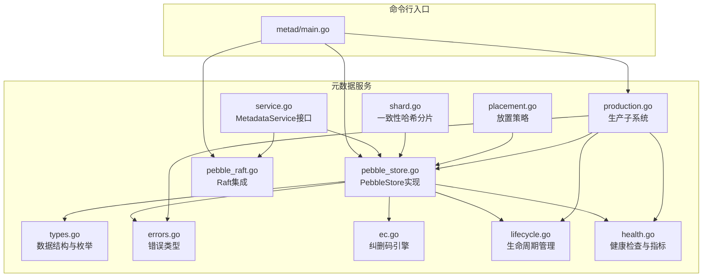
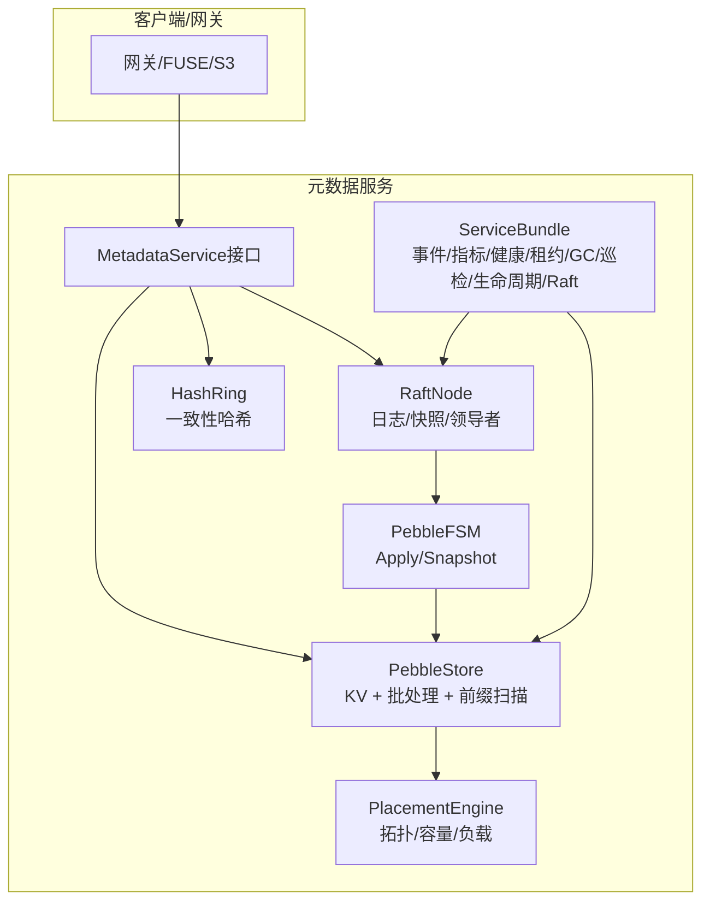
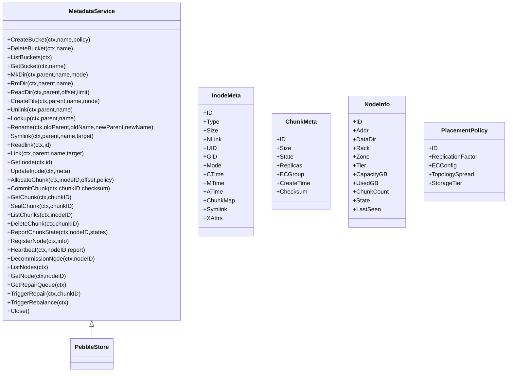
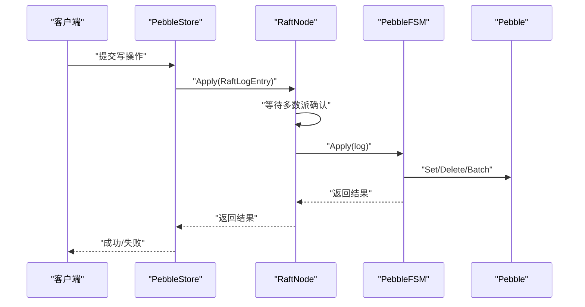
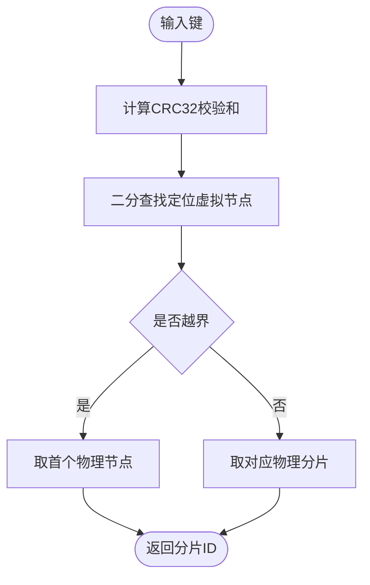
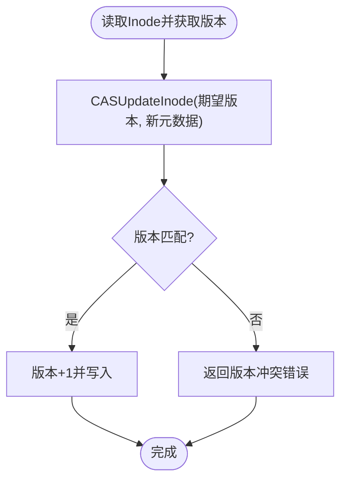
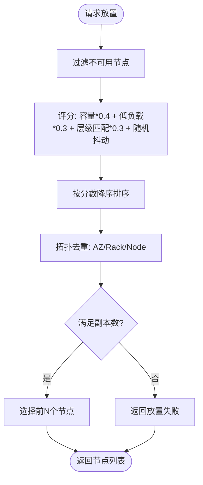
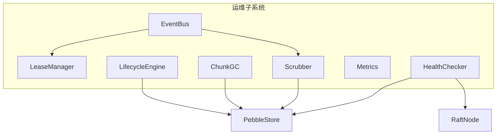
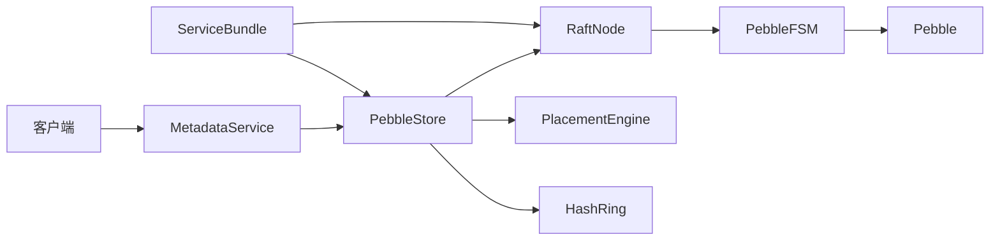

# 元数据服务架构

<cite>
**本文档引用的文件**
- [service.go](file://nufs-core/metadata/service.go)
- [types.go](file://nufs-core/metadata/types.go)
- [shard.go](file://nufs-core/metadata/shard.go)
- [placement.go](file://nufs-core/metadata/placement.go)
- [pebble_store.go](file://nufs-core/metadata/pebble_store.go)
- [pebble_raft.go](file://nufs-core/metadata/pebble_raft.go)
- [production.go](file://nufs-core/metadata/production.go)
- [errors.go](file://nufs-core/metadata/errors.go)
- [ec.go](file://nufs-core/metadata/ec.go)
- [lifecycle.go](file://nufs-core/metadata/lifecycle.go)
- [health.go](file://nufs-core/metadata/health.go)
- [main.go](file://nufs-core/cmd/metad/main.go)
</cite>

## 目录
1. [引言](#引言)
2. [项目结构](#项目结构)
3. [核心组件](#核心组件)
4. [架构总览](#架构总览)
5. [详细组件分析](#详细组件分析)
6. [依赖分析](#依赖分析)
7. [性能考虑](#性能考虑)
8. [故障排查指南](#故障排查指南)
9. [结论](#结论)
10. [附录](#附录)

## 引言
本文件面向NUFS元数据服务，系统化阐述其架构与实现细节。重点覆盖以下方面：
- 核心职责：命名空间管理、Chunk映射、集群拓扑管理与放置策略
- 双存储引擎设计：etcd兼容模式（开发/测试/迁移）与PebbleStore生产模式的技术差异与适用场景
- Raft共识机制：日志复制、领导者选举与快照策略
- 分片路由机制：一致性哈希实现水平扩展
- MVCC乐观并发控制：版本冲突检测与处理
- 接口设计、数据结构与关键算法实现

## 项目结构
元数据服务位于nufs-core/metadata目录，采用按功能域划分的模块化组织方式：
- 接口与类型：定义统一的MetadataService接口、核心数据结构与枚举
- 存储实现：PebbleStore作为生产级键值存储后端
- 协议与共识：Raft集成，支持日志编码、快照与状态机
- 运维子系统：事件总线、租约、垃圾回收、数据巡检、生命周期管理
- 路由与放置：一致性哈希分片路由、拓扑感知放置策略
- 命令行入口：metad守护进程，提供HTTP运维接口

**图表来源**
- [main.go:1-220](file://nufs-core/cmd/metad/main.go#L1-L220)
- [service.go:1-273](file://nufs-core/metadata/service.go#L1-L273)
- [types.go:1-209](file://nufs-core/metadata/types.go#L1-L209)
- [pebble_store.go:1-1178](file://nufs-core/metadata/pebble_store.go#L1-L1178)
- [pebble_raft.go:1-563](file://nufs-core/metadata/pebble_raft.go#L1-L563)
- [shard.go:1-299](file://nufs-core/metadata/shard.go#L1-L299)
- [placement.go:1-234](file://nufs-core/metadata/placement.go#L1-L234)
- [production.go:1-571](file://nufs-core/metadata/production.go#L1-L571)
- [errors.go:1-90](file://nufs-core/metadata/errors.go#L1-L90)
- [ec.go:1-254](file://nufs-core/metadata/ec.go#L1-L254)
- [lifecycle.go:1-191](file://nufs-core/metadata/lifecycle.go#L1-L191)
- [health.go:1-328](file://nufs-core/metadata/health.go#L1-L328)

**章节来源**
- [main.go:1-220](file://nufs-core/cmd/metad/main.go#L1-L220)
- [service.go:1-273](file://nufs-core/metadata/service.go#L1-L273)
- [types.go:1-209](file://nufs-core/metadata/types.go#L1-L209)

## 核心组件
- MetadataService接口：统一抽象命名空间、Inode、Chunk、集群节点等操作，便于不同后端透明替换
- PebbleStore：基于Pebble的生产级键值存储，提供原子批写入、前缀扫描、Raft集成
- RaftNode：封装hashicorp/raft，实现日志编码、快照序列化、领导者选举与成员变更
- ServiceBundle：生产环境组合器，集成事件总线、指标、健康检查、租约、GC、巡检、生命周期引擎与Raft
- 一致性哈希分片：HashRing与ShardedStore，实现跨多PebbleStore实例的水平扩展
- 放置策略：PlacementEngine，结合拓扑域、容量与负载进行拓扑感知选择
- MVCC乐观锁：CAS更新Inode，版本冲突检测
- 纠错码：ECEncoder，演示性RS编码/解码，支撑EC组元信息

**章节来源**
- [service.go:16-135](file://nufs-core/metadata/service.go#L16-L135)
- [pebble_store.go:16-109](file://nufs-core/metadata/pebble_store.go#L16-L109)
- [pebble_raft.go:380-485](file://nufs-core/metadata/pebble_raft.go#L380-L485)
- [shard.go:34-182](file://nufs-core/metadata/shard.go#L34-L182)
- [placement.go:27-137](file://nufs-core/metadata/placement.go#L27-L137)
- [production.go:126-189](file://nufs-core/metadata/production.go#L126-L189)
- [ec.go:13-82](file://nufs-core/metadata/ec.go#L13-L82)

## 架构总览
元数据服务采用“统一接口 + 生产子系统 + 可插拔共识”的架构：
- 统一接口层：MetadataService定义所有元数据操作
- 存储层：PebbleStore提供高性能KV存储与批处理能力
- 共识层：RaftNode将写操作编码为日志条目，应用到PebbleFSM
- 分片层：HashRing将键映射到物理分片，实现水平扩展
- 运维层：事件总线、租约、GC、巡检、生命周期引擎与健康检查

**图表来源**
- [service.go:16-135](file://nufs-core/metadata/service.go#L16-L135)
- [pebble_store.go:16-109](file://nufs-core/metadata/pebble_store.go#L16-L109)
- [pebble_raft.go:380-485](file://nufs-core/metadata/pebble_raft.go#L380-L485)
- [shard.go:34-182](file://nufs-core/metadata/shard.go#L34-L182)
- [placement.go:27-137](file://nufs-core/metadata/placement.go#L27-L137)
- [production.go:54-121](file://nufs-core/metadata/production.go#L54-L121)

## 详细组件分析

### 接口与数据模型
- MetadataService：涵盖桶、命名空间、Inode、Chunk、集群节点、修复与再平衡等操作
- 数据结构：InodeMeta、DirEntry、ChunkMeta、NodeInfo、ReplicaInfo、BucketInfo、PlacementPolicy、ECGroupInfo等
- 枚举：FileType、ChunkState、ReplicaState、NodeState、TopologySpread、StorageTier等

**图表来源**
- [service.go:16-67](file://nufs-core/metadata/service.go#L16-L67)
- [types.go:30-144](file://nufs-core/metadata/types.go#L30-L144)
- [types.go:174-188](file://nufs-core/metadata/types.go#L174-L188)

**章节来源**
- [service.go:16-67](file://nufs-core/metadata/service.go#L16-L67)
- [types.go:30-144](file://nufs-core/metadata/types.go#L30-L144)
- [types.go:174-188](file://nufs-core/metadata/types.go#L174-L188)

### 双存储引擎设计
- etcd兼容模式（开发/测试/迁移）：通过MetadataService接口抽象，可替换为etcd后端；当前仓库未包含etcd实现代码，但接口已预留
- PebbleStore生产模式：使用Pebble作为主存储引擎，支持批处理、前缀扫描、快照与Raft集成，适合海量元数据

技术差异与适用场景：
- 开发/测试/迁移：etcd兼容模式便于快速验证接口与业务逻辑
- 生产部署：PebbleStore提供高吞吐、低延迟的KV存储与批处理能力，配合Raft实现强一致

**章节来源**
- [service.go:16-19](file://nufs-core/metadata/service.go#L16-L19)
- [pebble_store.go:16-89](file://nufs-core/metadata/pebble_store.go#L16-L89)

### Raft共识机制
- 日志复制：RaftLogEntry编码Put/Delete/Batch，通过Apply提交到PebbleFSM
- 领导者选举：RaftNode封装hashicorp/raft，默认配置包含快照阈值、最小快照间隔与尾部日志保留数
- 快照策略：PebbleSnapshot以流式方式序列化全量KV，Raft在触发后截断旧日志

**图表来源**
- [pebble_raft.go:498-520](file://nufs-core/metadata/pebble_raft.go#L498-L520)
- [pebble_raft.go:173-209](file://nufs-core/metadata/pebble_raft.go#L173-L209)
- [pebble_store.go:1113-1131](file://nufs-core/metadata/pebble_store.go#L1113-L1131)

**章节来源**
- [pebble_raft.go:38-142](file://nufs-core/metadata/pebble_raft.go#L38-L142)
- [pebble_raft.go:246-322](file://nufs-core/metadata/pebble_raft.go#L246-L322)
- [pebble_raft.go:380-485](file://nufs-core/metadata/pebble_raft.go#L380-L485)

### 分片路由机制（一致性哈希）
- HashRing：虚拟节点映射，减少扩容/缩容时的数据迁移
- ShardedStore：根据键路由到具体PebbleStore实例，支持扫描全分片与统计

**图表来源**
- [shard.go:81-98](file://nufs-core/metadata/shard.go#L81-L98)
- [shard.go:152-182](file://nufs-core/metadata/shard.go#L152-L182)

**章节来源**
- [shard.go:34-182](file://nufs-core/metadata/shard.go#L34-L182)

### MVCC乐观并发控制
- 版本字段：InodeWithVersion包装InodeMeta，CASUpdateInode通过版本比较实现冲突检测
- 冲突处理：版本不匹配返回ErrVersionConflict，调用方重试或回退

**图表来源**
- [production.go:140-189](file://nufs-core/metadata/production.go#L140-L189)
- [types.go:130-138](file://nufs-core/metadata/types.go#L130-L138)

**章节来源**
- [production.go:126-189](file://nufs-core/metadata/production.go#L126-L189)
- [types.go:130-138](file://nufs-core/metadata/types.go#L130-L138)

### 放置策略与拓扑管理
- PlacementEngine：过滤在线/健康节点、评分（容量/负载/层级匹配）、拓扑约束（AZ/Rack/Node）
- ChunkID生成：Snowflake风格64位ID，含时间戳、节点与序列号

**图表来源**
- [placement.go:66-137](file://nufs-core/metadata/placement.go#L66-L137)
- [placement.go:197-234](file://nufs-core/metadata/placement.go#L197-L234)

**章节来源**
- [placement.go:27-137](file://nufs-core/metadata/placement.go#L27-L137)
- [placement.go:197-234](file://nufs-core/metadata/placement.go#L197-L234)

### 生命周期管理与运维子系统
- 事件总线：Watch/Notify，支持前缀订阅与缓冲
- 租约管理：LeaseManager定期检查心跳，标记离线节点
- 垃圾回收：ChunkGC扫描孤儿Chunk并删除
- 巡检：Scrubber校验Chunk一致性并触发修复
- 生命周期引擎：自动执行Tier转换与过期删除
- 健康检查与指标：HealthChecker与Metrics

**图表来源**
- [production.go:54-121](file://nufs-core/metadata/production.go#L54-L121)
- [production.go:217-303](file://nufs-core/metadata/production.go#L217-L303)
- [production.go:307-429](file://nufs-core/metadata/production.go#L307-L429)
- [production.go:431-554](file://nufs-core/metadata/production.go#L431-L554)
- [lifecycle.go:35-90](file://nufs-core/metadata/lifecycle.go#L35-L90)
- [health.go:16-94](file://nufs-core/metadata/health.go#L16-L94)
- [health.go:200-290](file://nufs-core/metadata/health.go#L200-L290)

**章节来源**
- [production.go:54-121](file://nufs-core/metadata/production.go#L54-L121)
- [lifecycle.go:35-90](file://nufs-core/metadata/lifecycle.go#L35-L90)
- [health.go:16-94](file://nufs-core/metadata/health.go#L16-L94)

### 纠错码（EC）与数据映射
- ECGroupInfo：记录纠删码组信息，ChunkMeta中引用
- ECEncoder：演示性RS编码/解码，用于理解EC组元数据与数据重建流程

**章节来源**
- [types.go:119-125](file://nufs-core/metadata/types.go#L119-L125)
- [ec.go:13-82](file://nufs-core/metadata/ec.go#L13-L82)

## 依赖分析
- 组件耦合：PebbleStore对RaftNode存在可选依赖；ServiceBundle聚合多个子系统
- 外部依赖：hashicorp/raft、cockroachdb/pebble、raft-boltdb
- 关键依赖链：客户端 → MetadataService → PebbleStore → RaftNode → PebbleFSM → Pebble

**图表来源**
- [service.go:76-93](file://nufs-core/metadata/service.go#L76-L93)
- [pebble_store.go:16-31](file://nufs-core/metadata/pebble_store.go#L16-L31)
- [pebble_raft.go:385-392](file://nufs-core/metadata/pebble_raft.go#L385-L392)
- [shard.go:192-197](file://nufs-core/metadata/shard.go#L192-L197)

**章节来源**
- [service.go:76-93](file://nufs-core/metadata/service.go#L76-L93)
- [pebble_store.go:16-31](file://nufs-core/metadata/pebble_store.go#L16-L31)
- [pebble_raft.go:385-392](file://nufs-core/metadata/pebble_raft.go#L385-L392)

## 性能考虑
- 存储层优化：Pebble的MemTable大小、最大打开文件数、格式版本；批处理写入降低WAL压力
- Raft参数：快照阈值、快照间隔、尾部日志保留数影响日志压缩与慢追随者追赶
- 分片与路由：一致性哈希减少迁移比例，建议合理设置虚拟节点数量
- 并发控制：MVCC版本冲突需调用方重试策略；批处理提升吞吐
- 运维开销：GC/巡检周期需权衡资源占用与数据健康度

[本节为通用指导，无需特定文件引用]

## 故障排查指南
- 常见错误：命名空间、桶、Chunk、节点、一致性、系统错误与版本冲突
- 健康检查：/health与/ready端点返回服务状态、角色、版本、检查项与时间戳
- 指标采集：/metrics返回操作总数、读写延迟、键/Chunk/节点/桶计数、Raft状态与任期
- 日志与快照：Raft日志清理与快照触发有助于定位一致性问题

**章节来源**
- [errors.go:12-89](file://nufs-core/metadata/errors.go#L12-L89)
- [health.go:190-290](file://nufs-core/metadata/health.go#L190-L290)
- [health.go:292-327](file://nufs-core/metadata/health.go#L292-L327)
- [pebble_raft.go:212-237](file://nufs-core/metadata/pebble_raft.go#L212-L237)

## 结论
NUFS元数据服务通过统一接口与生产子系统，结合Pebble存储与Raft共识，实现了高可用、可扩展且可观测的元数据管理能力。一致性哈希分片与拓扑感知放置策略支撑水平扩展；MVCC与批处理保障并发与性能；运维子系统完善了数据生命周期与健康监控。针对不同阶段可灵活切换后端与启用/禁用共识，满足开发、测试与生产的多样化需求。

[本节为总结性内容，无需特定文件引用]

## 附录
- 命令行入口：metad守护进程，支持Pebble配置、Raft开关、租约、GC、巡检等参数，并提供HTTP运维接口
- 关键路径示例：CreateBucket、MkDir、CreateFile、AllocateChunk、Heartbeat、TriggerRepair、TriggerRebalance等

**章节来源**
- [main.go:21-149](file://nufs-core/cmd/metad/main.go#L21-L149)
- [main.go:151-220](file://nufs-core/cmd/metad/main.go#L151-L220)