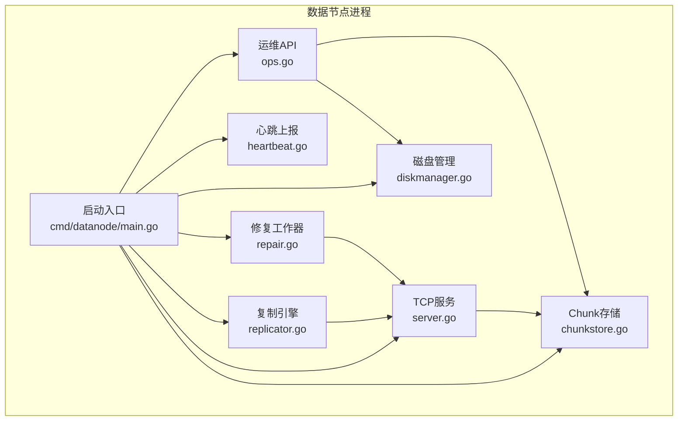
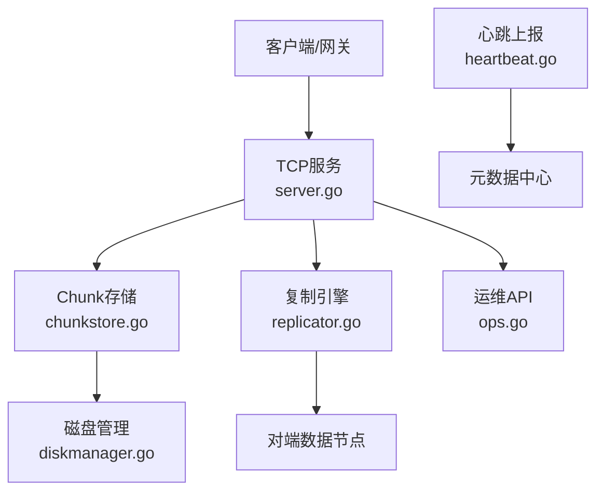
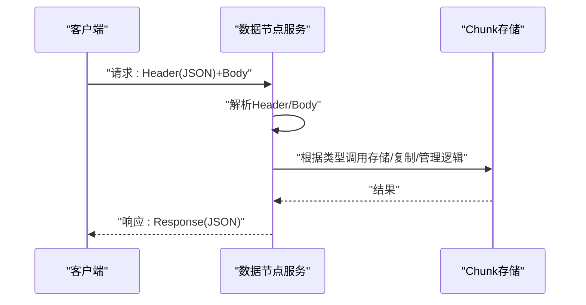
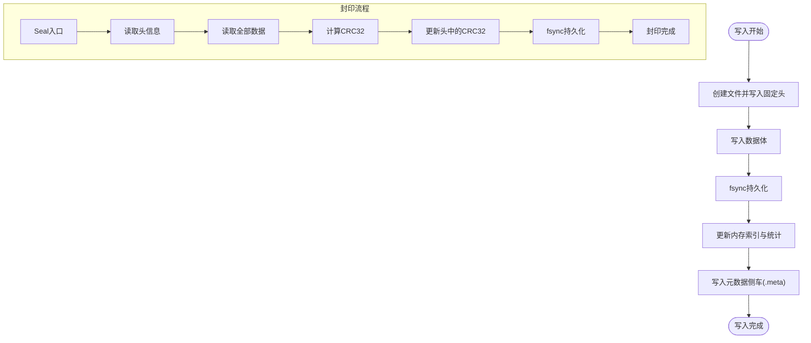
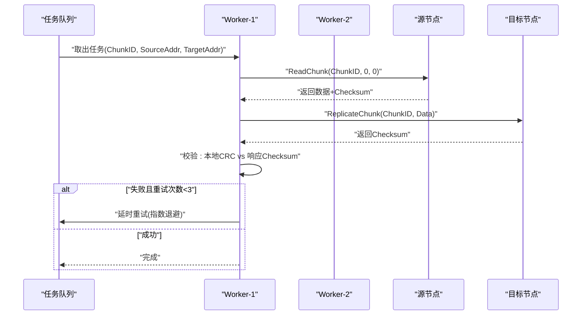
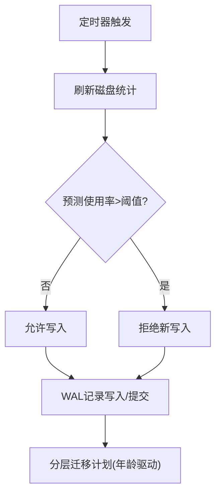
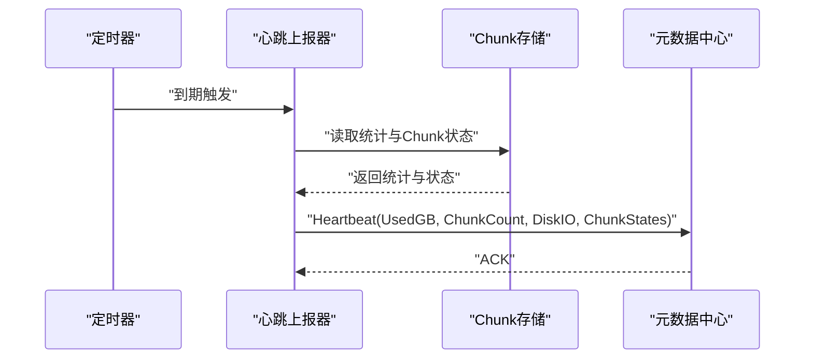
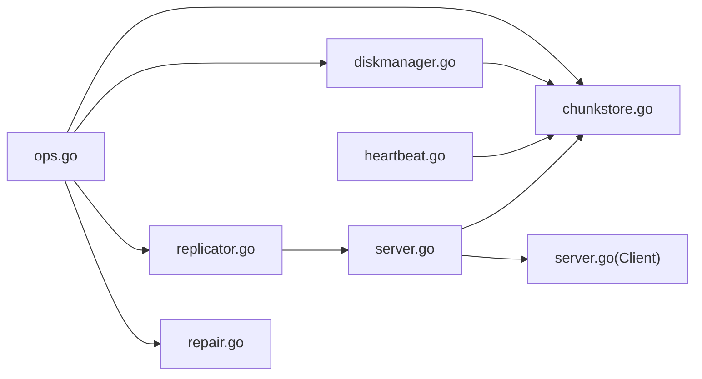

# 数据节点架构

<cite>
**本文引用的文件**
- [main.go](file://nufs-core/cmd/datanode/main.go)
- [types.go](file://nufs-core/datanode/types.go)
- [chunkstore.go](file://nufs-core/datanode/chunkstore.go)
- [server.go](file://nufs-core/datanode/server.go)
- [replicator.go](file://nufs-core/datanode/replicator.go)
- [diskmanager.go](file://nufs-core/datanode/diskmanager.go)
- [heartbeat.go](file://nufs-core/datanode/heartbeat.go)
- [ops.go](file://nufs-core/datanode/ops.go)
- [repair.go](file://nufs-core/datanode/repair.go)
- [chunkstore_test.go](file://nufs-core/datanode/chunkstore_test.go)
- [replicator_test.go](file://nufs-core/datanode/replicator_test.go)
- [server_test.go](file://nufs-core/datanode/server_test.go)
- [ARCHITECTURE.md](file://nufs-core/ARCHITECTURE.md)
- [types.go](file://nufs-core/metadata/types.go)
</cite>

## 目录
1. [简介](#简介)
2. [项目结构](#项目结构)
3. [核心组件](#核心组件)
4. [架构总览](#架构总览)
5. [详细组件分析](#详细组件分析)
6. [依赖分析](#依赖分析)
7. [性能考虑](#性能考虑)
8. [故障排查指南](#故障排查指南)
9. [结论](#结论)
10. [附录](#附录)

## 简介
本文件面向NUFS数据节点（DataNode），系统性阐述其核心职责与实现：Chunk存储、副本管理与数据传输、TCP协议设计、Chunk磁盘布局与元数据管理、复制引擎（多Worker并行复制、指数退避重试与校验）、磁盘管理策略（容量监控、空间回收与性能优化）、心跳上报机制（节点健康检查与状态同步）、生命周期管理、错误处理与性能调优。

## 项目结构
数据节点位于nufs-core/datanode目录，核心模块包括：
- 服务器与协议：server.go（TCP服务、请求分发、消息编解码）
- Chunk存储：chunkstore.go（磁盘布局、文件格式、元数据侧车、并发控制）
- 复制引擎：replicator.go（多Worker并行复制、指数退避重试、校验）
- 磁盘管理：diskmanager.go（容量监控、WAL崩溃恢复、分层迁移）
- 心跳上报：heartbeat.go（周期性上报节点状态）
- 运维接口：ops.go（HTTP管理API）
- 修复流程：repair.go（扫描修复队列、触发修复）
- 元数据类型：metadata/types.go（Chunk/Replica/Node等类型定义）

图表来源
- [main.go:19-133](file://nufs-core/cmd/datanode/main.go#L19-L133)
- [server.go:18-63](file://nufs-core/datanode/server.go#L18-L63)
- [chunkstore.go:18-59](file://nufs-core/datanode/chunkstore.go#L18-L59)
- [replicator.go:23-46](file://nufs-core/datanode/replicator.go#L23-L46)
- [diskmanager.go:22-88](file://nufs-core/datanode/diskmanager.go#L22-L88)
- [heartbeat.go:12-36](file://nufs-core/datanode/heartbeat.go#L12-L36)
- [ops.go:19-71](file://nufs-core/datanode/ops.go#L19-L71)
- [repair.go:13-39](file://nufs-core/datanode/repair.go#L13-L39)

章节来源
- [main.go:19-133](file://nufs-core/cmd/datanode/main.go#L19-L133)
- [ARCHITECTURE.md:248-287](file://nufs-core/ARCHITECTURE.md#L248-L287)

## 核心组件
- 配置与协议类型：types.go定义了Config、Header、Response、状态枚举、Chunk磁盘布局常量与本地Chunk状态等。
- Chunk存储：负责本地磁盘的Chunk写入、读取、封印（Seal）与删除；提供并发写读信号量；维护内存索引与统计。
- TCP服务：解析长度前缀的消息格式，分发到具体请求处理器（写/读/删/复制/信息/列表/健康）。
- 复制引擎：多Worker并行复制，指数退避重试，源节点读取、目标节点写入、校验一致性。
- 磁盘管理：容量监控、拒绝阈值、WAL崩溃恢复、分层迁移（年龄驱动）。
- 心跳上报：周期性向元数据中心上报节点使用情况与Chunk状态。
- 运维API：集群状态、节点管理、桶操作、Chunk校验、修复队列、GC扫描、指标与健康检查。
- 修复工作器：定期扫描修复队列，定位健康副本与新目标节点，触发复制。

章节来源
- [types.go:14-171](file://nufs-core/datanode/types.go#L14-L171)
- [chunkstore.go:18-395](file://nufs-core/datanode/chunkstore.go#L18-L395)
- [server.go:18-462](file://nakinode/server.go#L18-L462)
- [replicator.go:23-192](file://nufs-core/datanode/replicator.go#L23-L192)
- [diskmanager.go:22-421](file://nufs-core/datanode/diskmanager.go#L22-L421)
- [heartbeat.go:12-107](file://nufs-core/datanode/heartbeat.go#L12-L107)
- [ops.go:19-318](file://nufs-core/datanode/ops.go#L19-L318)
- [repair.go:13-183](file://nufs-core/datanode/repair.go#L13-L183)

## 架构总览
数据节点作为分布式存储的数据层，承担以下职责：
- Chunk本地持久化：二进制文件+元数据侧车，支持并发读写与访问统计。
- 副本管理：异步复制引擎，指数退避重试，校验一致性。
- 数据传输：基于TCP的请求/响应协议，支持偏移读取与长数据传输。
- 磁盘治理：容量限制、WAL崩溃恢复、分层迁移（年龄驱动）。
- 健康上报：周期性心跳，上报使用量、Chunk状态与磁盘IO。
- 运维管理：HTTP API提供状态查询、修复队列、指标与健康检查。

图表来源
- [server.go:18-462](file://nufs-core/datanode/server.go#L18-L462)
- [chunkstore.go:18-395](file://nufs-core/datanode/chunkstore.go#L18-L395)
- [replicator.go:23-192](file://nufs-core/datanode/replicator.go#L23-L192)
- [diskmanager.go:22-421](file://nufs-core/datanode/diskmanager.go#L22-L421)
- [heartbeat.go:12-107](file://nufs-core/datanode/heartbeat.go#L12-L107)

## 详细组件分析

### TCP协议与消息编解码
- 请求格式：长度前缀（Header JSON）+ 长度前缀（Body数据）
- 响应格式：长度前缀（Response JSON）
- 请求类型：写Chunk、读Chunk（支持offset/length）、删除Chunk、复制Chunk、Chunk信息、列出Chunk、健康检查
- 校验：写入请求可携带CRC32，服务端进行校验；读取返回文件头中的CRC32

图表来源
- [server.go:273-337](file://nufs-core/datanode/server.go#L273-L337)
- [types.go:74-118](file://nufs-core/datanode/types.go#L74-L118)

章节来源
- [server.go:273-337](file://nufs-core/datanode/server.go#L273-L337)
- [types.go:74-118](file://nufs-core/datanode/types.go#L74-L118)

### Chunk存储机制
- 磁盘布局：每个Chunk以.dat文件存储，采用256路分片目录（chunk_id % 256 → 00-FF），避免单目录文件过多
- 文件格式：固定头（20字节）+ 数据体；头包含魔数、ChunkID、数据长度、CRC32
- 元数据侧车：.meta文件保存LocalChunkInfo快照，便于快速启动
- 并发控制：写/读信号量限制并发；读取时更新访问统计
- 生命周期：Write→WriteAt（部分写/追加）→Seal（计算并写入CRC32）→Delete（删除文件与侧车）
- 启动扫描：重启时读取所有.dat文件头，重建内存索引

图表来源
- [chunkstore.go:73-127](file://nufs-core/datanode/chunkstore.go#L73-L127)
- [chunkstore.go:229-275](file://nufs-core/datanode/chunkstore.go#L229-L275)
- [chunkstore.go:325-395](file://nufs-core/datanode/chunkstore.go#L325-L395)
- [types.go:120-146](file://nufs-core/datanode/types.go#L120-L146)

章节来源
- [chunkstore.go:73-275](file://nufs-core/datanode/chunkstore.go#L73-L275)
- [chunkstore.go:325-395](file://nufs-core/datanode/chunkstore.go#L325-L395)
- [types.go:120-146](file://nufs-core/datanode/types.go#L120-L146)

### 复制引擎设计
- 多Worker并行：默认4个worker，各自从任务队列取任务
- 任务队列：容量1024，满时提交失败
- 指数退避重试：最多3次，每次等待2^retry秒
- 校验机制：源节点读取→目标节点写入→校验CRC32一致性
- 修复流程：从存活副本读取→写入新目标节点→更新元数据

图表来源
- [replicator.go:48-126](file://nufs-core/datanode/replicator.go#L48-L126)
- [replicator.go:128-174](file://nufs-core/datanode/replicator.go#L128-L174)

章节来源
- [replicator.go:48-174](file://nufs-core/datanode/replicator.go#L48-L174)

### 磁盘管理策略
- 容量监控：周期性刷新磁盘统计（总字节、已用、可用、使用率、Chunk数量）
- 拒绝策略：当预测使用率超过阈值（默认90%）时拒绝新写入
- 崩溃恢复：WAL记录未提交写入，重启后清理孤儿Chunk
- 分层迁移：按Chunk写入时间判断是否迁移至更冷层级（年龄驱动）
- I/O统计：记录读写IOPS与字节数，供运维与调度参考

图表来源
- [diskmanager.go:99-184](file://nufs-core/datanode/diskmanager.go#L99-L184)
- [diskmanager.go:200-329](file://nufs-core/datanode/diskmanager.go#L200-L329)
- [diskmanager.go:335-421](file://nufs-core/datanode/diskmanager.go#L335-L421)

章节来源
- [diskmanager.go:99-184](file://nufs-core/datanode/diskmanager.go#L99-L184)
- [diskmanager.go:200-329](file://nufs-core/datanode/diskmanager.go#L200-L329)
- [diskmanager.go:335-421](file://nufs-core/datanode/diskmanager.go#L335-L421)

### 心跳上报机制
- 周期：默认10秒
- 内容：节点使用量（GB）、Chunk数量、磁盘IO利用率、每个Chunk的副本状态
- 状态映射：LocalSealed→ReplicaReady，LocalWritten→ReplicaSyncing，LocalCorrupt→ReplicaFailed
- 失败处理：上报失败记录日志，不影响节点运行

图表来源
- [heartbeat.go:38-100](file://nufs-core/datanode/heartbeat.go#L38-L100)

章节来源
- [heartbeat.go:38-100](file://nufs-core/datanode/heartbeat.go#L38-L100)

### 运维与HTTP API
- 端点：集群状态、节点管理、桶操作、Chunk校验、修复队列、GC扫描、指标、健康检查
- 作用：提供运维操作入口，便于排障与容量治理
- 健康检查：基于使用率阈值返回健康/降级状态

章节来源
- [ops.go:19-318](file://nufs-core/datanode/ops.go#L19-L318)

### 修复流程
- 扫描修复队列：定期从元数据中心获取待修复任务
- 选择源副本：优先选择状态为Ready的副本
- 选择目标节点：从在线节点中挑选未存在的节点作为新副本
- 触发复制：读取源副本数据，写入目标节点，并上报Chunk状态

章节来源
- [repair.go:51-183](file://nufs-core/datanode/repair.go#L51-L183)

## 依赖分析
- 组件耦合
  - Server依赖ChunkStore进行读写；依赖Client发起对端请求
  - Replicator依赖Server（通过Client）进行对端读写
  - DiskManager依赖ChunkStore统计与WAL
  - HeartbeatReporter依赖ChunkStore与元数据中心
  - OpsServer依赖ChunkStore、DiskManager、Replicator、RepairWorker
- 外部依赖
  - 元数据中心接口（metadata.MetadataService）用于注册节点、心跳、修复队列、Chunk元数据等

图表来源
- [server.go:18-462](file://nufs-core/datanode/server.go#L18-L462)
- [chunkstore.go:18-395](file://nufs-core/datanode/chunkstore.go#L18-L395)
- [replicator.go:23-192](file://nufs-core/datanode/replicator.go#L23-L192)
- [diskmanager.go:22-421](file://nufs-core/datanode/diskmanager.go#L22-L421)
- [heartbeat.go:12-107](file://nufs-core/datanode/heartbeat.go#L12-L107)
- [ops.go:19-318](file://nufs-core/datanode/ops.go#L19-L318)
- [repair.go:13-183](file://nufs-core/datanode/repair.go#L13-L183)

## 性能考虑
- 并发控制：写/读信号量限制同时进行的读写操作，避免磁盘争用
- 分片目录：256路分片避免单目录文件过多导致的系统调用开销
- 长度前缀协议：支持大块数据传输，减少网络往返
- 崩溃恢复：WAL确保未提交写入在重启后清理，避免脏数据
- 分层迁移：基于年龄的分层迁移降低热数据访问延迟
- 缓存与I/O统计：通过Ops API暴露磁盘统计，辅助容量与性能治理

## 故障排查指南
- 写入失败
  - 检查容量阈值是否触发（使用率接近90%）
  - 查看WAL是否存在孤儿写入，必要时清理
- 读取异常
  - 确认Chunk是否存在（NotFound）；检查磁盘布局与分片目录
  - 校验CRC32一致性（写入请求携带的校验与文件头中的校验）
- 复制失败
  - 查看指数退避重试日志；确认源/目标节点可达
  - 校验目标节点写入后的Checksum
- 心跳失败
  - 检查元数据中心连通性；查看心跳上报器日志
- 运维接口
  - 使用/health检查节点健康状态；使用/metrics查看磁盘与复制统计

章节来源
- [server.go:130-271](file://nufs-core/datanode/server.go#L130-L271)
- [replicator.go:106-125](file://nufs-core/datanode/replicator.go#L106-L125)
- [diskmanager.go:122-139](file://nufs-core/datanode/diskmanager.go#L122-L139)
- [ops.go:279-298](file://nufs-core/datanode/ops.go#L279-L298)

## 结论
数据节点通过清晰的模块划分与稳健的工程实践，实现了高可靠、高性能的Chunk存储与复制能力。TCP协议简洁高效，Chunk磁盘布局合理，复制引擎具备指数退避与校验保障，磁盘管理提供容量与崩溃恢复能力，心跳与运维接口完善了可观测性与可运维性。结合元数据中心，形成完整的分布式存储闭环。

## 附录
- 启动流程概览：初始化ChunkStore→初始化磁盘管理→连接元数据中心→启动TCP服务→启动复制引擎→启动心跳→启动运维API
- 关键配置项：监听地址、数据目录、元数据中心地址、心跳间隔、并发读写限制、容量、存储层级等

章节来源
- [main.go:33-122](file://nufs-core/cmd/datanode/main.go#L33-L122)
- [types.go:14-70](file://nufs-core/datanode/types.go#L14-L70)