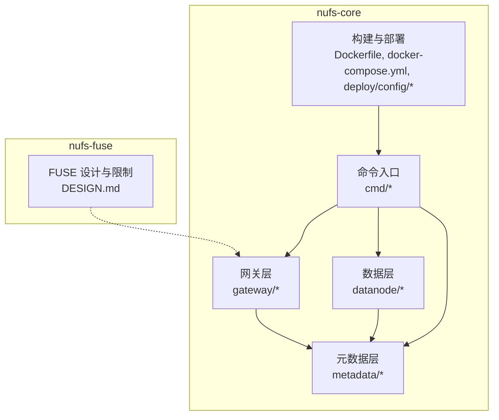
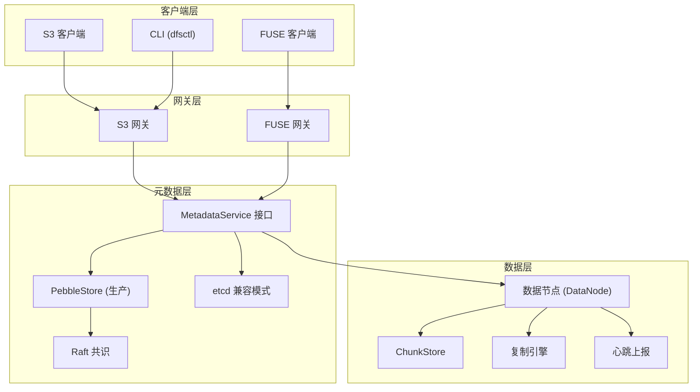
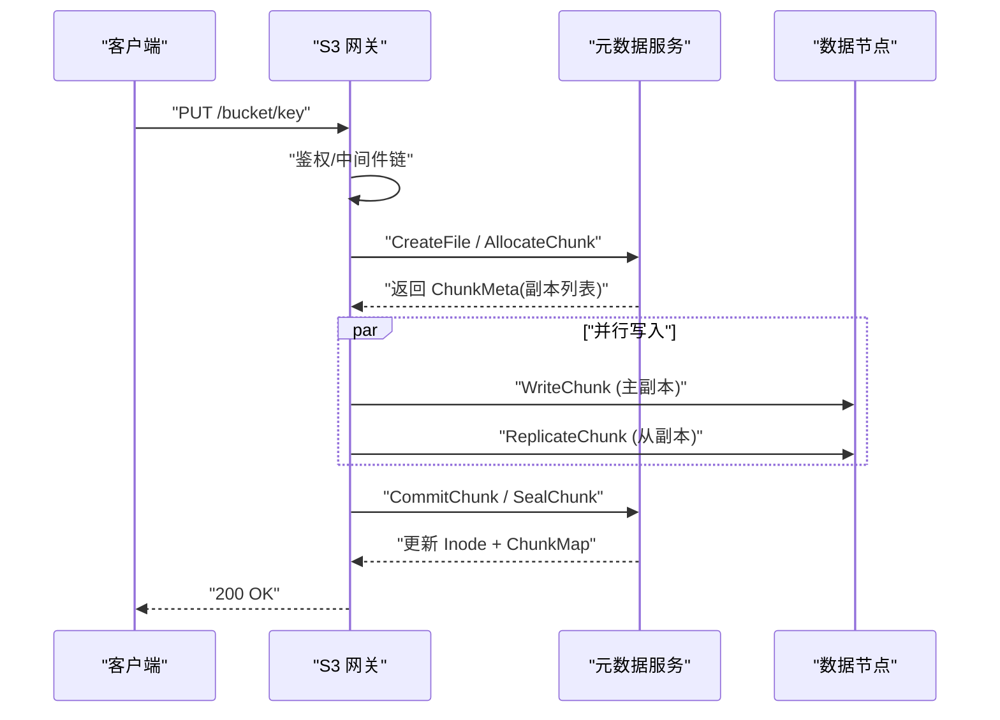
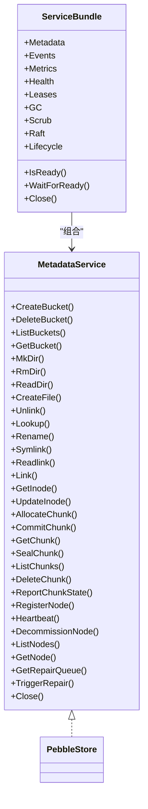
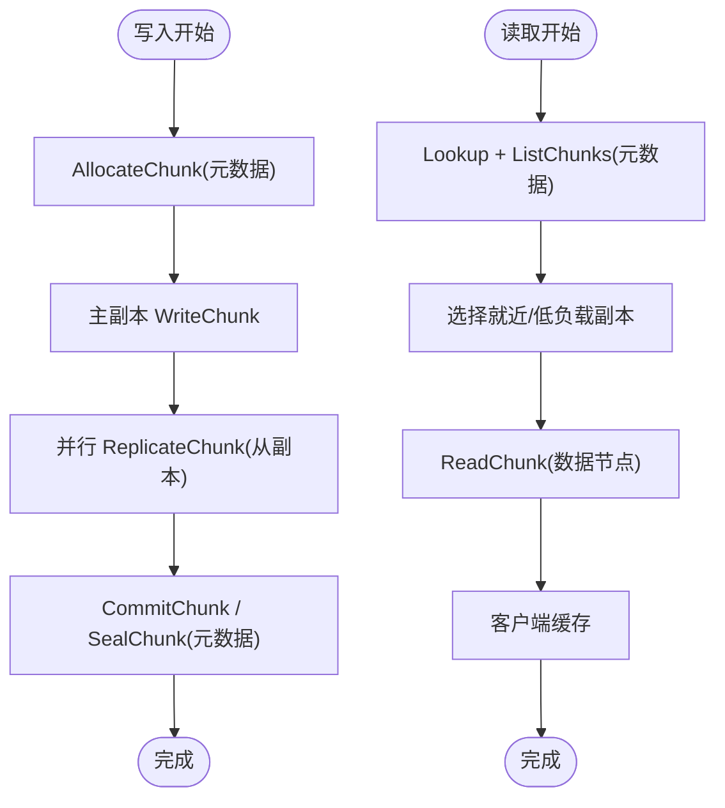
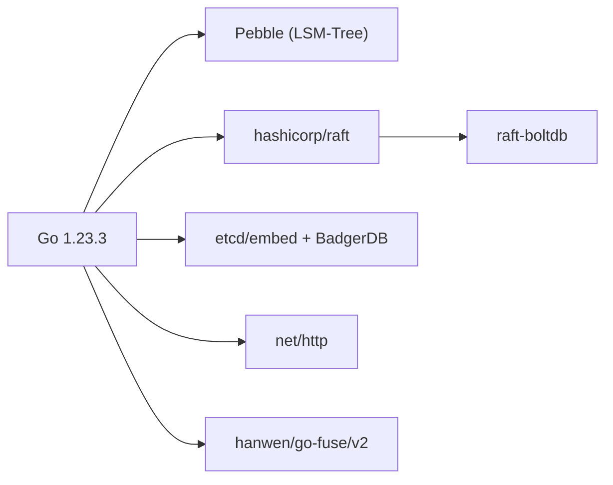

# 架构设计

<cite>
**本文引用的文件**
- [ARCHITECTURE.md](file://nufs-core/ARCHITECTURE.md)
- [go.mod](file://nufs-core/go.mod)
- [docker-compose.yml](file://nufs-core/docker-compose.yml)
- [cluster.yaml](file://nufs-core/deploy/config/cluster.yaml)
- [Dockerfile](file://nufs-core/Dockerfile)
- [main.go（元数据中心）](file://nufs-core/cmd/metad/main.go)
- [main.go（数据节点）](file://nufs-core/cmd/datanode/main.go)
- [main.go（S3 网关）](file://nufs-core/cmd/s3gw/main.go)
- [main.go（FUSE 网关）](file://nufs-core/cmd/fusegw/main.go)
- [service.go（元数据服务接口与组合）](file://nufs-core/metadata/service.go)
- [handler.go（S3 网关路由与中间件）](file://nufs-core/gateway/s3/handler.go)
- [fs.go（FUSE 网关根文件系统）](file://nufs-core/gateway/fuse/fs.go)
- [chunkstore.go（数据节点存储实现）](file://nufs-core/datanode/chunkstore.go)
- [DESIGN.md（FUSE 客户端设计要点）](file://nufs-fuse/DESIGN.md)
</cite>

## 目录
1. [引言](#引言)
2. [项目结构](#项目结构)
3. [核心组件](#核心组件)
4. [架构总览](#架构总览)
5. [详细组件分析](#详细组件分析)
6. [依赖关系分析](#依赖关系分析)
7. [性能考量](#性能考量)
8. [故障排查指南](#故障排查指南)
9. [结论](#结论)
10. [附录](#附录)

## 引言
本文件面向 NUFS 分布式文件系统，提供从高层设计到实现细节的完整架构文档。内容覆盖分层架构（客户端层、网关层、元数据层、数据层）、组件交互、数据流、一致性与容错、部署拓扑、可观测性与安全、以及技术栈与第三方依赖。目标是帮助读者快速理解系统边界、运行机制与运维要点，并为扩展与演进提供参考。

## 项目结构
仓库采用按功能模块划分的多包结构，核心模块包括：
- nufs-core：分布式文件系统核心实现，包含元数据、数据节点、网关、命令入口等
- nufs-fuse：FUSE 客户端相关设计与限制说明

图表来源
- [Dockerfile:1-50](file://nufs-core/Dockerfile#L1-L50)
- [docker-compose.yml:1-137](file://nufs-core/docker-compose.yml#L1-L137)
- [cluster.yaml:1-62](file://nufs-core/deploy/config/cluster.yaml#L1-L62)

章节来源
- [Dockerfile:1-50](file://nufs-core/Dockerfile#L1-L50)
- [docker-compose.yml:1-137](file://nufs-core/docker-compose.yml#L1-L137)
- [cluster.yaml:1-62](file://nufs-core/deploy/config/cluster.yaml#L1-L62)

## 核心组件
- 客户端层：S3 客户端（AWS SDK 等）、FUSE 挂载（Linux）、CLI（dfsctl）
- 网关层：S3 兼容网关（HTTP）、FUSE 网关（POSIX 文件系统）
- 元数据层：PebbleStore（生产模式）、兼容模式（etcd + BadgerDB）
- 数据层：数据节点（ChunkStore + 复制引擎 + 心跳上报）

章节来源
- [ARCHITECTURE.md:37-101](file://nufs-core/ARCHITECTURE.md#L37-L101)
- [service.go（元数据服务接口与组合）:15-61](file://nufs-core/metadata/service.go#L15-L61)

## 架构总览
系统采用分层与多后端并行的架构设计：
- 客户端通过 S3 或 FUSE 访问网关
- 网关调用元数据服务接口，解析命名空间与 Chunk 映射
- 元数据层支持双后端：etcd 兼容模式与 Pebble 生产模式；生产模式内置 Raft 共识
- 数据层以数据节点为中心，负责 Chunk 的本地存储、复制与健康上报

图表来源
- [ARCHITECTURE.md:37-101](file://nufs-core/ARCHITECTURE.md#L37-L101)
- [service.go（元数据服务接口与组合）:15-61](file://nufs-core/metadata/service.go#L15-L61)
- [chunkstore.go（数据节点存储实现）:18-31](file://nufs-core/datanode/chunkstore.go#L18-L31)

章节来源
- [ARCHITECTURE.md:37-101](file://nufs-core/ARCHITECTURE.md#L37-L101)

## 详细组件分析

### 客户端层
- S3 客户端：通过 AWS SDK 或其他 S3 兼容客户端访问 S3 网关
- FUSE 客户端：Linux 下挂载 POSIX 文件系统，映射到 DFS 命名空间
- CLI：运维管理工具（dfsctl），用于集群状态查询与运维操作

章节来源
- [ARCHITECTURE.md:39-56](file://nufs-core/ARCHITECTURE.md#L39-L56)

### 网关层
- S3 网关：提供 S3 兼容 REST API，包含鉴权、CORS、日志、请求追踪等中间件链
- FUSE 网关：基于 go-fuse 实现，提供 DFS 命名空间到 POSIX 的映射，包含目录、文件、符号链接与属性转换

图表来源
- [handler.go（S3 网关路由与中间件）:46-54](file://nufs-core/gateway/s3/handler.go#L46-L54)
- [handler.go（S3 网关路由与中间件）:70-166](file://nufs-core/gateway/s3/handler.go#L70-L166)
- [ARCHITECTURE.md:350-384](file://nufs-core/ARCHITECTURE.md#L350-L384)

章节来源
- [handler.go（S3 网关路由与中间件）:11-54](file://nufs-core/gateway/s3/handler.go#L11-L54)
- [fs.go（FUSE 网关根文件系统）:17-34](file://nufs-core/gateway/fuse/fs.go#L17-L34)

### 元数据层
- MetadataService 接口：统一抽象桶、命名空间、Inode、Chunk、集群与修复操作
- ServiceBundle：生产环境组合器，集成事件总线、指标、健康检查、租约、GC、清洗与生命周期管理
- 双存储引擎：etcd 兼容模式（开发/迁移）与 PebbleStore（生产），后者内置 Raft 共识与分片路由

图表来源
- [service.go（元数据服务接口与组合）:15-61](file://nufs-core/metadata/service.go#L15-L61)
- [service.go（元数据服务接口与组合）:70-108](file://nufs-core/metadata/service.go#L70-L108)

章节来源
- [service.go（元数据服务接口与组合）:15-61](file://nufs-core/metadata/service.go#L15-L61)
- [service.go（元数据服务接口与组合）:130-170](file://nufs-core/metadata/service.go#L130-L170)

### 数据层
- 数据节点：提供 TCP 协议的 Chunk 读写、复制、列举与健康检查
- ChunkStore：本地文件系统存储，二进制头 + 数据体 + 元数据边车，带并发读写信号量
- 复制引擎：多 Worker 并行复制，指数退避重试，支持修复流程
- 心跳上报：周期性上报磁盘使用、Chunk 状态与 IO 指标

图表来源
- [ARCHITECTURE.md:350-412](file://nufs-core/ARCHITECTURE.md#L350-L412)
- [chunkstore.go（数据节点存储实现）:73-127](file://nufs-core/datanode/chunkstore.go#L73-L127)
- [chunkstore.go（数据节点存储实现）:169-227](file://nufs-core/datanode/chunkstore.go#L169-L227)

章节来源
- [chunkstore.go（数据节点存储实现）:18-31](file://nufs-core/datanode/chunkstore.go#L18-L31)
- [chunkstore.go（数据节点存储实现）:73-127](file://nufs-core/datanode/chunkstore.go#L73-L127)
- [chunkstore.go（数据节点存储实现）:169-227](file://nufs-core/datanode/chunkstore.go#L169-L227)

## 依赖关系分析
- 技术栈与版本
  - Go 1.23.3
  - 元数据-共识：hashicorp/raft
  - 元数据-存储：CockroachDB/Pebble
  - 元数据-日志：raft-boltdb
  - 元数据-兼容：etcd/embed + BadgerDB
  - 数据-存储：本地文件系统
  - 网关-S3：net/http
  - 网关-FUSE：hanwen/go-fuse/v2
  - 可观测：内置 Metrics + Health

图表来源
- [go.mod:1-108](file://nufs-core/go.mod#L1-L108)
- [ARCHITECTURE.md:103-116](file://nufs-core/ARCHITECTURE.md#L103-L116)

章节来源
- [go.mod:1-108](file://nufs-core/go.mod#L1-L108)
- [ARCHITECTURE.md:103-116](file://nufs-core/ARCHITECTURE.md#L103-L116)

## 性能考量
- 写入路径：主副本先写，异步复制到从副本；Commit 后进入 Sealed，Ready 后进入 Ready；PebbleStore 使用 Batch 原子更新
- 读取路径：优先 Attr/数据缓存命中；未命中时根据就近/低负载选择副本；小文件合并存储显著降低元数据与提升磁盘利用率
- 缓存策略：内核页缓存 + 用户态 Attr/Data 缓存 + 写缓冲异步刷盘
- 小文件优化：SmallFileBlock 合并存储，阈值与块大小规则明确，有效降低元数据与空间浪费

章节来源
- [ARCHITECTURE.md:350-418](file://nufs-core/ARCHITECTURE.md#L350-L418)
- [ARCHITECTURE.md:642-684](file://nufs-core/ARCHITECTURE.md#L642-L684)
- [ARCHITECTURE.md:589-640](file://nufs-core/ARCHITECTURE.md#L589-L640)

## 故障排查指南
- 元数据层
  - 健康检查：/health 与 /ready 端点
  - 指标查询：/metrics
  - 初始化状态：Ready 通道用于等待初始化完成
- 数据层
  - 通过 Ops HTTP API 查询节点状态、集群状态与指标
  - 心跳上报异常：检查租约 TTL 与节点在线状态
- 网关层
  - 中间件链：Recovery → RequestID → CORS → Logging → Auth → Handler
  - S3 网关：鉴权可匿名模式；FUSE 网关：挂载点存在性校验

章节来源
- [main.go（元数据中心）:152-221](file://nufs-core/cmd/metad/main.go#L152-L221)
- [main.go（数据节点）:120-123](file://nufs-core/cmd/datanode/main.go#L120-L123)
- [handler.go（S3 网关路由与中间件）:46-54](file://nufs-core/gateway/s3/handler.go#L46-L54)

## 结论
NUFS 采用清晰的分层架构与双元数据后端设计，在保证高可用与可扩展的同时，兼顾了开发效率与生产稳定性。通过 Raft 共识、MVCC 乐观并发、分片路由与复制引擎，系统实现了强一致写与最终一致读的灵活选择。结合小文件优化、客户端缓存与生命周期管理，整体具备良好的性能与运维体验。建议在生产部署中优先采用 PebbleStore + Raft 的生产模式，并配合完善的监控与告警体系。

## 附录

### 部署拓扑与基础设施需求
- 单机开发：all-in-one 容器
- Docker Compose：嵌入式 etcd + 多数据节点 + S3/FUSE 网关
- Kubernetes：Helm 安装（具体 Chart 由部署脚本提供）
- 关键端口：元数据 etcd (2379/2380)、数据节点 TCP (9001)、S3 网关 (8080)、运维 API (8091/8092)

章节来源
- [ARCHITECTURE.md:765-800](file://nufs-core/ARCHITECTURE.md#L765-L800)
- [docker-compose.yml:1-137](file://nufs-core/docker-compose.yml#L1-L137)
- [cluster.yaml:1-62](file://nufs-core/deploy/config/cluster.yaml#L1-L62)

### 命令入口与进程职责
- 元数据中心：metad（PebbleStore + 可选 Raft + Ops API）
- 数据节点：datanode（ChunkStore + 复制引擎 + 心跳 + Ops API）
- S3 网关：s3gw（HTTP + 中间件链 + 元数据服务）
- FUSE 网关：fusegw（Linux 下挂载）
- CLI：ctl（运维管理）

章节来源
- [main.go（元数据中心）:21-150](file://nufs-core/cmd/metad/main.go#L21-L150)
- [main.go（数据节点）:19-135](file://nufs-core/cmd/datanode/main.go#L19-L135)
- [main.go（S3 网关）:18-91](file://nufs-core/cmd/s3gw/main.go#L18-L91)
- [main.go（FUSE 网关）:17-63](file://nufs-core/cmd/fusegw/main.go#L17-L63)
- [Dockerfile:14-18](file://nufs-core/Dockerfile#L14-L18)

### 安全与合规
- S3 网关支持 AWS Signature V4 鉴权，亦可匿名模式
- CORS、请求追踪与日志中间件增强可观测性
- FUSE 客户端限制：一次只允许一个对象操作，简化锁机制

章节来源
- [ARCHITECTURE.md:291-318](file://nufs-core/ARCHITECTURE.md#L291-L318)
- [DESIGN.md（FUSE 客户端设计要点）:1-37](file://nufs-fuse/DESIGN.md#L1-L37)