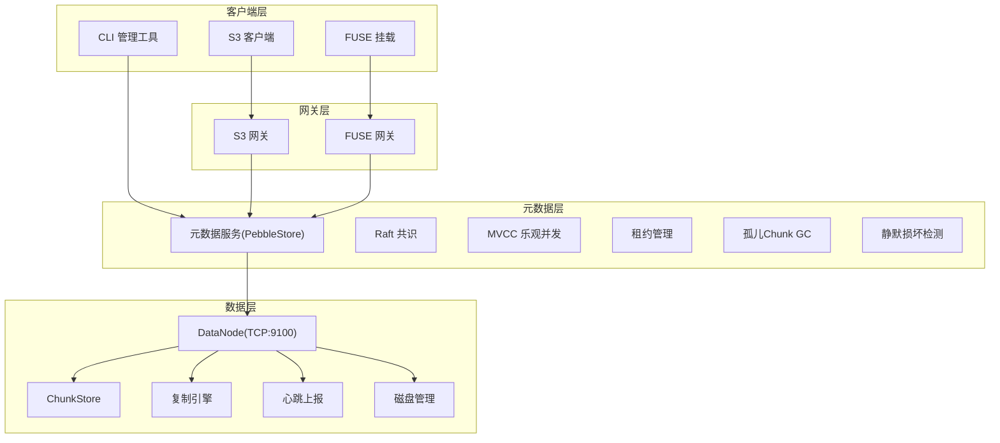
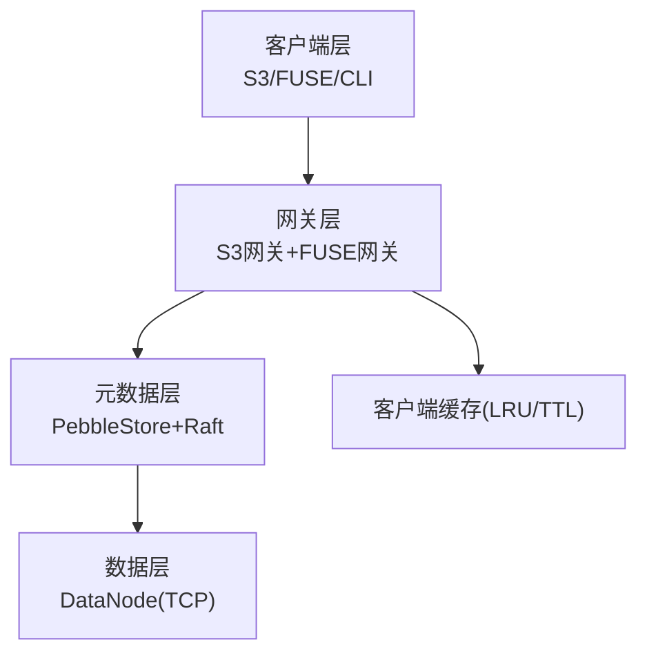
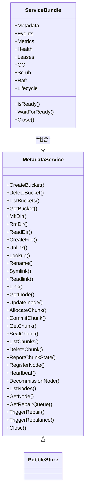
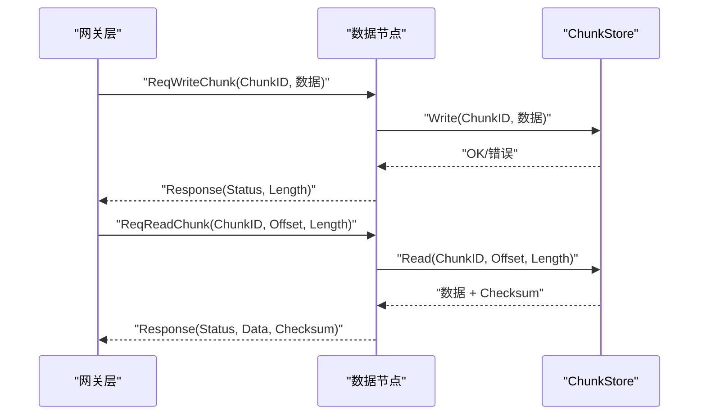
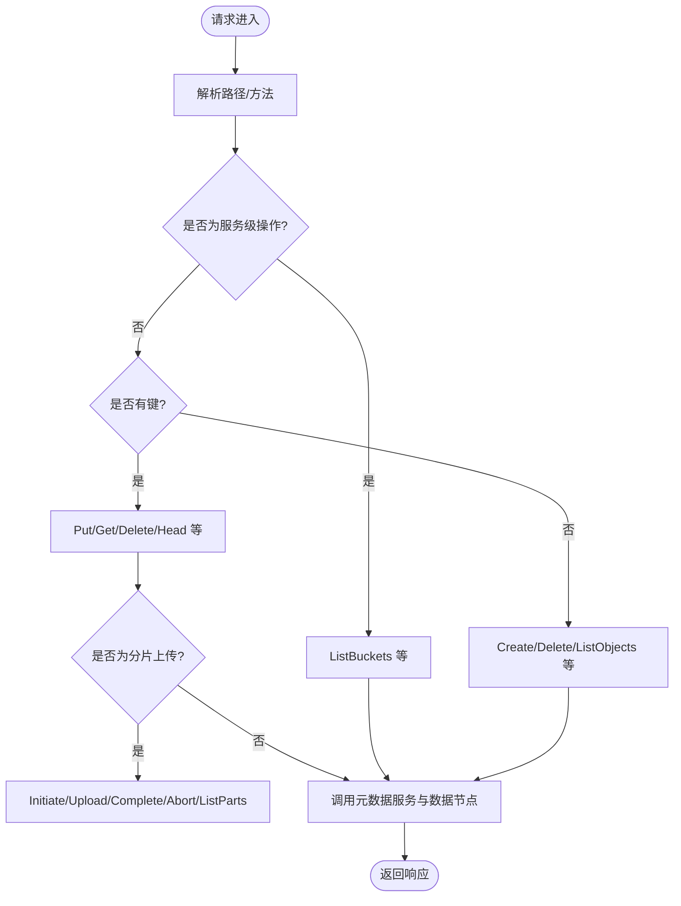
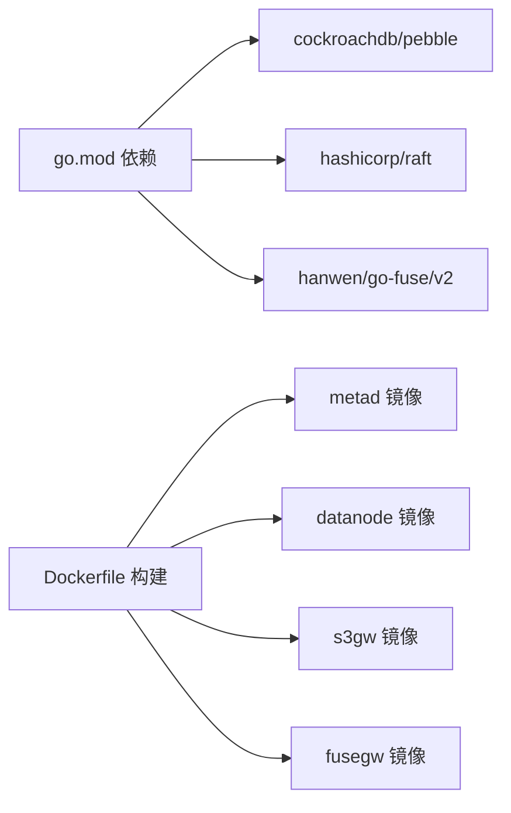

# 系统总览

<cite>
**本文引用的文件**
- [ARCHITECTURE.md](file://nufs-core/ARCHITECTURE.md)
- [go.mod](file://nufs-core/go.mod)
- [Dockerfile](file://nufs-core/Dockerfile)
- [docker-compose.yml](file://nufs-core/docker-compose.yml)
- [DESIGN.md](file://nufs-fuse/DESIGN.md)
- [main.go](file://nufs-core/cmd/metad/main.go)
- [main.go](file://nufs-core/cmd/datanode/main.go)
- [main.go](file://nufs-core/cmd/s3gw/main.go)
- [main.go](file://nufs-core/cmd/fusegw/main.go)
- [main.go](file://nufs-core/cmd/ctl/main.go)
- [service.go](file://nufs-core/metadata/service.go)
- [server.go](file://nufs-core/datanode/server.go)
- [handler.go](file://nufs-core/gateway/s3/handler.go)
- [types.go](file://nufs-core/metadata/types.go)
- [cluster.yaml](file://nufs-core/deploy/config/cluster.yaml)
</cite>

## 目录
1. [系统总览](#系统总览)
2. [项目结构](#项目结构)
3. [核心组件](#核心组件)
4. [架构总览](#架构总览)
5. [详细组件分析](#详细组件分析)
6. [依赖分析](#依赖分析)
7. [性能考虑](#性能考虑)
8. [故障排查指南](#故障排查指南)
9. [结论](#结论)
10. [附录](#附录)

## 系统总览
NUFS 是一个面向大规模场景的分布式文件系统，旨在支撑“百亿文件/PB级存储”的海量数据管理需求，并以“99.99%可用性”和“读P99<10ms、写P99<20ms”的性能目标为核心设计驱动力。系统采用三层架构分层设计：
- 客户端层：提供 S3 API、FUSE 挂载以及 CLI 管理工具，覆盖云原生与传统 POSIX 使用场景
- 网关层：提供 S3 兼容网关与 POSIX FUSE 网关，屏蔽底层细节，统一接入入口
- 元数据层：基于 Pebble + Raft 的高可用元数据服务，负责命名空间、Inode/Chunk 映射、集群拓扑与放置策略
- 数据层：DataNode 以 TCP 协议提供 Chunk 存储与复制，配合复制引擎与心跳上报保障可靠性

系统兼容性方面，既支持 S3 API（便于与现有云生态集成），也支持 POSIX 文件系统（通过 FUSE），并提供 CLI 管理工具。部署层面支持单机开发、Docker Compose 生产小集群以及 Kubernetes 大规模部署。

章节来源
- [ARCHITECTURE.md:27-36](file://nufs-core/ARCHITECTURE.md#L27-L36)
- [ARCHITECTURE.md:37-101](file://nufs-core/ARCHITECTURE.md#L37-L101)
- [ARCHITECTURE.md:103-115](file://nufs-core/ARCHITECTURE.md#L103-L115)

## 项目结构
仓库采用模块化组织方式，核心代码位于 nufs-core，FUSE 相关实现位于 nufs-fuse。关键目录与职责如下：
- nufs-core/cmd：各服务二进制入口（metad、datanode、s3gw、fusegw、ctl）
- nufs-core/metadata：元数据服务（PebbleStore、Raft、MVCC、租约、GC、清洗等）
- nufs-core/datanode：数据节点（ChunkStore、复制引擎、心跳、运维接口）
- nufs-core/gateway：网关层（S3 网关、FUSE 网关、客户端缓存）
- nufs-core/deploy：生产部署配置（cluster.yaml）
- nufs-fuse：FUSE 客户端设计文档与实现

图表来源
- [ARCHITECTURE.md:37-101](file://nufs-core/ARCHITECTURE.md#L37-L101)
- [go.mod:5-10](file://nufs-core/go.mod#L5-L10)

章节来源
- [Dockerfile:1-50](file://nufs-core/Dockerfile#L1-L50)
- [docker-compose.yml:1-148](file://nufs-core/docker-compose.yml#L1-L148)

## 核心组件
- 元数据服务（PebbleStore + Raft）：提供命名空间、Inode/Chunk 映射、租约、GC、清洗、生命周期管理等能力
- 数据节点（DataNode）：提供 TCP 协议的 Chunk 读写、复制、心跳上报、磁盘管理与运维接口
- 网关层（S3/FUSE）：S3 网关提供 S3 兼容 API；FUSE 网关提供 POSIX 文件系统挂载
- 客户端缓存：在网关侧提供属性与数据缓存，降低后端压力并提升延迟表现
- CLI 管理工具：提供节点、桶、修复队列、再平衡等运维能力

章节来源
- [service.go:16-67](file://nufs-core/metadata/service.go#L16-L67)
- [server.go:18-34](file://nufs-core/datanode/server.go#L18-L34)
- [handler.go:11-43](file://nufs-core/gateway/s3/handler.go#L11-L43)

## 架构总览
系统采用“客户端层—网关层—元数据层—数据层”的分层设计，通过统一的元数据服务协调命名空间与数据映射，数据节点负责 Chunk 的持久化与复制，网关层屏蔽差异提供统一接入。

图表来源
- [ARCHITECTURE.md:37-101](file://nufs-core/ARCHITECTURE.md#L37-L101)

## 详细组件分析

### 元数据服务（PebbleStore + Raft）
- 双存储引擎抽象：通过 MetadataService 接口统一访问，PebbleStore 作为唯一后端
- Raft 共识：可选启用，支持多数派共识、快照与日志截断
- MVCC 乐观并发：基于版本号的 CAS 更新，避免写放大
- 租约管理：节点注册与心跳续租，异常检测与事件发布
- GC 与清洗：定期扫描孤儿 Chunk 与静默损坏，保障数据健康
- 生命周期管理：按规则进行对象分层与归档

图表来源
- [service.go:16-67](file://nufs-core/metadata/service.go#L16-L67)
- [service.go:76-134](file://nufs-core/metadata/service.go#L76-L134)

章节来源
- [ARCHITECTURE.md:120-247](file://nufs-core/ARCHITECTURE.md#L120-L247)
- [types.go:30-100](file://nufs-core/metadata/types.go#L30-L100)

### 数据节点（DataNode）
- TCP 协议：请求/响应格式定义，支持写入、读取、删除、复制、信息查询、列表与健康检查
- 复制引擎：多 Worker 并行复制、任务队列与指数退避重试
- 心跳上报：周期性上报磁盘使用、Chunk 状态与 IO 利用率
- 磁盘管理：容量与空间管理，防止过载
- 运维接口：提供健康检查、统计与诊断能力

图表来源
- [ARCHITECTURE.md:248-287](file://nufs-core/ARCHITECTURE.md#L248-L287)
- [server.go:102-126](file://nufs-core/datanode/server.go#L102-L126)
- [server.go:130-193](file://nufs-core/datanode/server.go#L130-L193)

章节来源
- [ARCHITECTURE.md:248-287](file://nufs-core/ARCHITECTURE.md#L248-L287)
- [server.go:18-63](file://nufs-core/datanode/server.go#L18-L63)

### 网关层（S3 网关与 FUSE 网关）
- S3 网关：提供 S3 兼容 API，包含鉴权、中间件链、路由与处理逻辑
- FUSE 网关：基于 go-fuse 提供 POSIX 文件系统挂载，支持目录、文件与符号链接
- 客户端缓存：属性与数据缓存，结合写回缓冲提升吞吐与降低延迟

图表来源
- [ARCHITECTURE.md:288-344](file://nufs-core/ARCHITECTURE.md#L288-L344)
- [handler.go:70-166](file://nufs-core/gateway/s3/handler.go#L70-L166)

章节来源
- [ARCHITECTURE.md:288-344](file://nufs-core/ARCHITECTURE.md#L288-L344)
- [DESIGN.md:1-37](file://nufs-fuse/DESIGN.md#L1-L37)

### 客户端缓存策略
- 用户态缓存：属性缓存（TTL 5s）、数据缓存（TTL 50s）、写缓冲（500MB）
- 写回策略：缓冲阈值、定时刷新与进程退出同步
- 一致性：TTL 过期后重新验证，确保最终一致

章节来源
- [ARCHITECTURE.md:641-684](file://nufs-core/ARCHITECTURE.md#L641-L684)

### CLI 管理工具
- 节点管理：列出节点、触发再平衡、下线节点、查看修复队列
- 集群运维：查看领导节点、集群状态与指标

章节来源
- [main.go:17-66](file://nufs-core/cmd/ctl/main.go#L17-L66)
- [main.go:86-123](file://nufs-core/cmd/ctl/main.go#L86-L123)

## 依赖分析
- 技术栈：Go 1.23，Pebble（LSM-Tree）、Raft（共识）、go-fuse（FUSE）、Prometheus 兼容指标
- 外部依赖：hashicorp/raft、cockroachdb/pebble、hanwen/go-fuse/v2 等
- 部署镜像：基于 distroless 静态镜像构建，S3/FUSE 网关分别包含必要依赖

图表来源
- [go.mod:5-10](file://nufs-core/go.mod#L5-L10)
- [Dockerfile:20-49](file://nufs-core/Dockerfile#L20-L49)

章节来源
- [go.mod:1-51](file://nufs-core/go.mod#L1-L51)
- [Dockerfile:1-50](file://nufs-core/Dockerfile#L1-L50)

## 性能考虑
- 延迟目标：读 P99 < 10ms，写 P99 < 20ms，通过客户端缓存、就近副本选择与高效存储布局达成
- 并发与吞吐：数据节点支持并发读写、复制引擎并行化，元数据层采用分片路由与批量原子写
- 指标监控：内置延迟直方图与健康探针，支持 Prometheus 指标导出

章节来源
- [ARCHITECTURE.md:12-21](file://nufs-core/ARCHITECTURE.md#L12-L21)
- [ARCHITECTURE.md:537-586](file://nufs-core/ARCHITECTURE.md#L537-L586)
- [health.go:67-116](file://nufs-core/metadata/health.go#L67-L116)

## 故障排查指南
- 健康检查：元数据服务提供 /health 与 /ready 探针，网关层健康检查可集成到容器编排
- 指标观测：通过 /metrics 获取延迟、错误、节点在线数等关键指标
- 常见问题定位：
  - 元数据不可用：检查 Raft 领导状态与快照
  - 数据节点异常：查看心跳上报与副本状态
  - 读写延迟高：检查缓存命中率与副本分布

章节来源
- [main.go:152-221](file://nufs-core/cmd/metad/main.go#L152-L221)
- [main.go:18-66](file://nufs-core/cmd/ctl/main.go#L18-L66)

## 结论
NUFS 通过清晰的三层架构、完善的元数据与数据层协同、以及可插拔的网关与客户端缓存策略，在满足大规模存储与高性能访问的同时，提供了良好的兼容性与部署灵活性。结合 Raft 共识与多种容错机制，系统能够在复杂环境中保持高可用与数据一致性。

## 附录
- 部署模式：
  - 单机开发：docker run all-in-one
  - Docker Compose：生产小集群（metad ×1、datanode ×3、s3gw ×1）
  - Kubernetes：Helm 安装，支持副本与资源调度
- 生产配置：cluster.yaml 提供集群名称、元数据/数据节点、网关与放置策略等参数

章节来源
- [ARCHITECTURE.md:764-762](file://nufs-core/ARCHITECTURE.md#L764-L762)
- [docker-compose.yml:1-148](file://nufs-core/docker-compose.yml#L1-L148)
- [cluster.yaml:1-62](file://nufs-core/deploy/config/cluster.yaml#L1-L62)