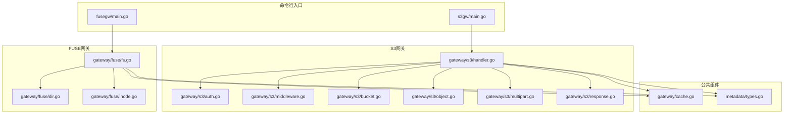
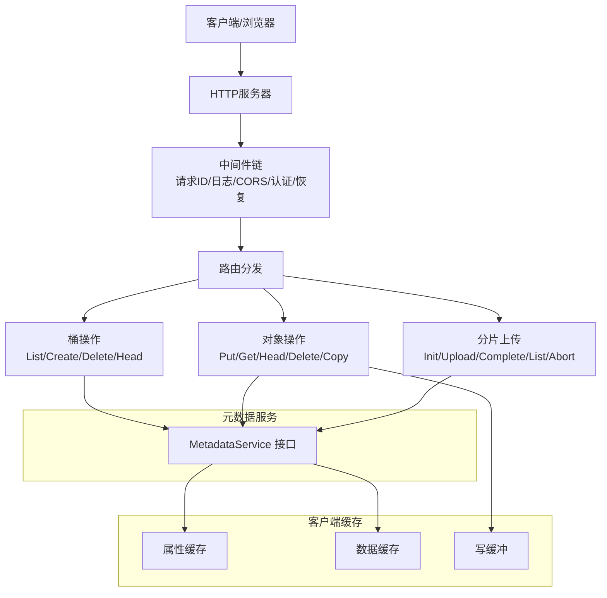
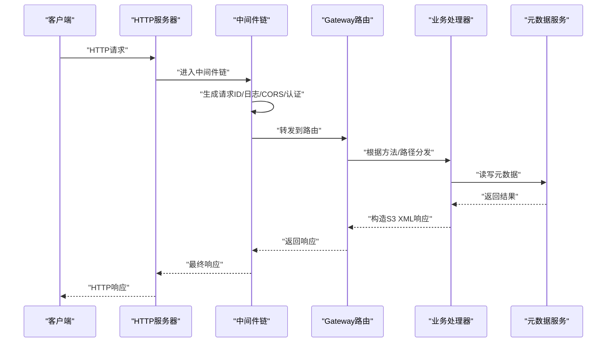
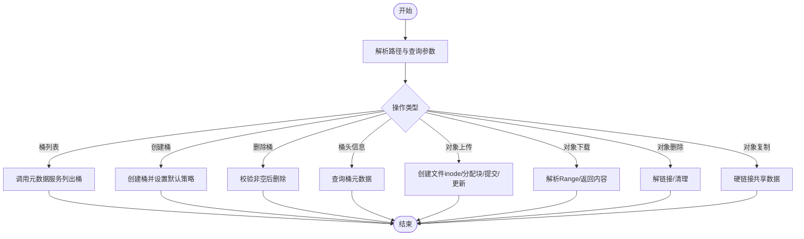
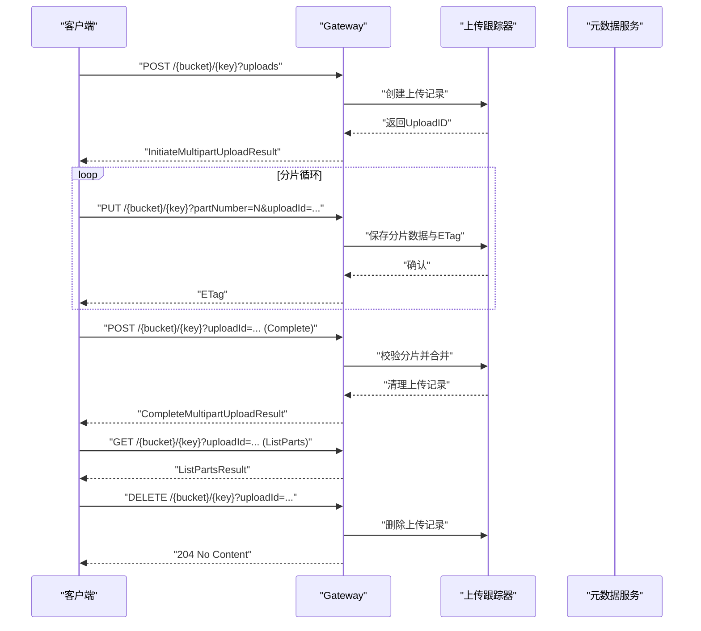
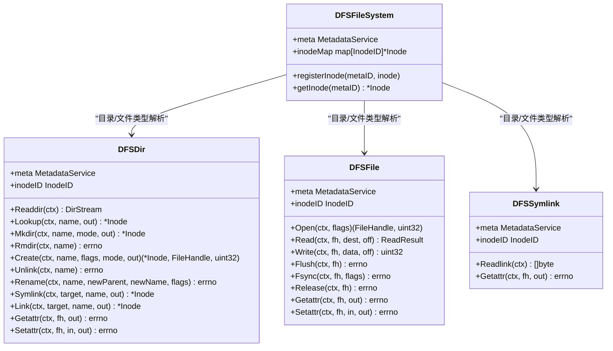
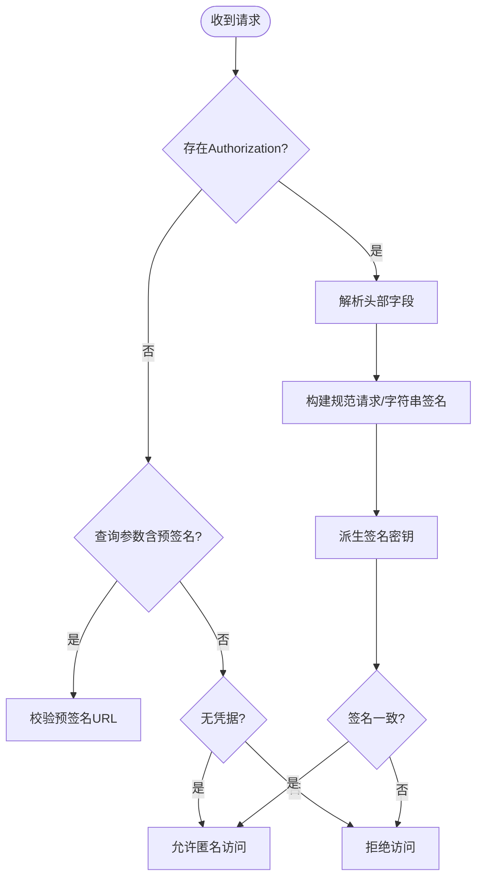
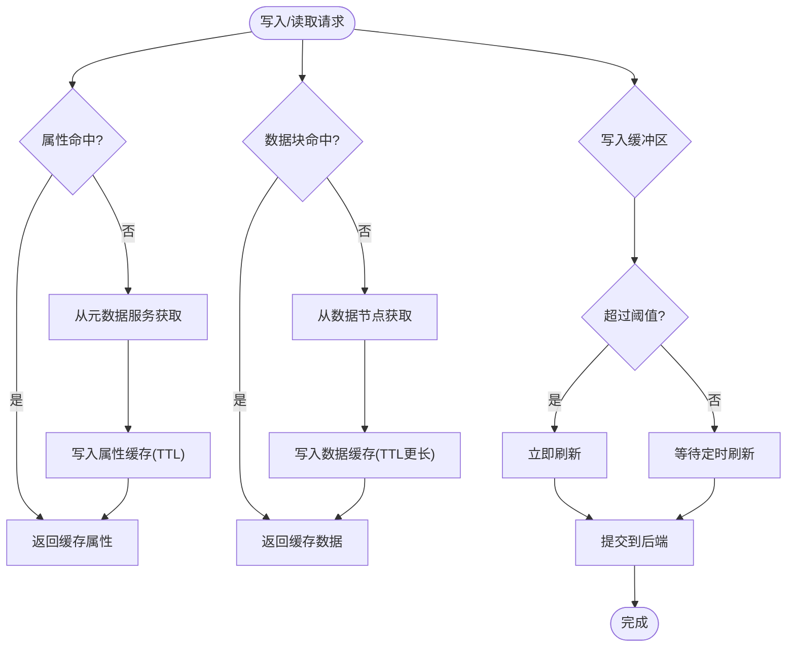
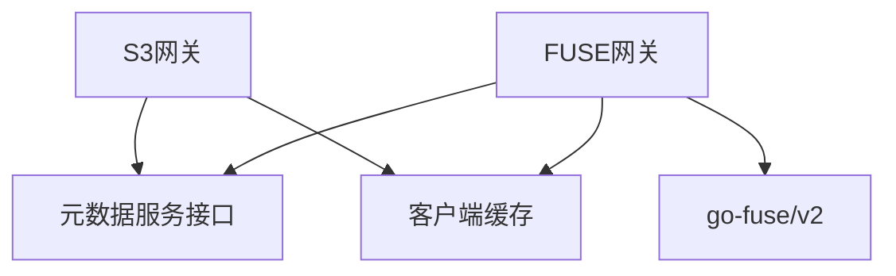

# 网关层架构

<cite>
**本文档引用的文件**
- [handler.go](file://nufs-core/gateway/s3/handler.go)
- [auth.go](file://nufs-core/gateway/s3/auth.go)
- [middleware.go](file://nufs-core/gateway/s3/middleware.go)
- [bucket.go](file://nufs-core/gateway/s3/bucket.go)
- [object.go](file://nufs-core/gateway/s3/object.go)
- [multipart.go](file://nufs-core/gateway/s3/multipart.go)
- [response.go](file://nufs-core/gateway/s3/response.go)
- [cache.go](file://nufs-core/gateway/cache.go)
- [fs.go](file://nufs-core/gateway/fuse/fs.go)
- [dir.go](file://nufs-core/gateway/fuse/dir.go)
- [inode.go](file://nufs-core/gateway/fuse/inode.go)
- [main.go (S3网关)](file://nufs-core/cmd/s3gw/main.go)
- [main.go (FUSE网关)](file://nufs-core/cmd/fusegw/main.go)
- [types.go (元数据类型)](file://nufs-core/metadata/types.go)
</cite>

## 目录
1. [简介](#简介)
2. [项目结构](#项目结构)
3. [核心组件](#核心组件)
4. [架构总览](#架构总览)
5. [详细组件分析](#详细组件分析)
6. [依赖关系分析](#依赖关系分析)
7. [性能考虑](#性能考虑)
8. [故障排查指南](#故障排查指南)
9. [结论](#结论)

## 简介
本文件为NUFS网关层的架构文档，重点阐述双层网关设计：S3 API兼容层与POSIX文件系统层（FUSE）。S3网关提供与Amazon S3兼容的REST API，覆盖桶与对象操作、分片上传、认证授权等；FUSE网关通过hanwen/go-fuse/v2实现Linux文件系统接口，将分布式存储映射为本地POSIX文件系统。文档还涵盖认证授权机制（AWS Signature V4签名验证与匿名访问）、客户端缓存策略（属性缓存、数据缓存、写缓冲）、性能优化（连接池、并发控制、资源管理）以及扩展性与插件化设计建议。

## 项目结构
网关层位于nufs-core/gateway目录，分别实现S3与FUSE两类网关，并在nufs-core/cmd中提供独立的启动入口：
- S3网关：nufs-core/gateway/s3/* 与 nufs-core/cmd/s3gw/main.go
- FUSE网关：nufs-core/gateway/fuse/* 与 nufs-core/cmd/fusegw/main.go
- 公共缓存：nufs-core/gateway/cache.go
- 元数据类型定义：nufs-core/metadata/types.go

图表来源
- [main.go (S3网关):1-91](file://nufs-core/cmd/s3gw/main.go#L1-L91)
- [main.go (FUSE网关):1-63](file://nufs-core/cmd/fusegw/main.go#L1-L63)
- [handler.go:1-184](file://nufs-core/gateway/s3/handler.go#L1-L184)
- [auth.go:1-204](file://nufs-core/gateway/s3/auth.go#L1-L204)
- [middleware.go:1-111](file://nufs-core/gateway/s3/middleware.go#L1-L111)
- [bucket.go:1-259](file://nufs-core/gateway/s3/bucket.go#L1-L259)
- [object.go:1-318](file://nufs-core/gateway/s3/object.go#L1-L318)
- [multipart.go:1-286](file://nufs-core/gateway/s3/multipart.go#L1-L286)
- [response.go:1-216](file://nufs-core/gateway/s3/response.go#L1-L216)
- [fs.go:1-128](file://nufs-core/gateway/fuse/fs.go#L1-L128)
- [dir.go:1-275](file://nufs-core/gateway/fuse/dir.go#L1-L275)
- [inode.go:1-231](file://nufs-core/gateway/fuse/inode.go#L1-L231)
- [cache.go:1-325](file://nufs-core/gateway/cache.go#L1-L325)
- [types.go:1-209](file://nufs-core/metadata/types.go#L1-L209)

章节来源
- [main.go (S3网关):1-91](file://nufs-core/cmd/s3gw/main.go#L1-L91)
- [main.go (FUSE网关):1-63](file://nufs-core/cmd/fusegw/main.go#L1-L63)

## 核心组件
- S3网关核心
  - 路由与调度：根据URL路径与HTTP方法分发到具体处理器
  - 中间件链：统一处理请求ID、日志、CORS、认证、异常恢复
  - 认证授权：支持AWS Signature V4与预签名URL，支持匿名模式
  - 对象与桶操作：列表、创建、删除、头信息查询、复制、范围读取
  - 分片上传：初始化、上传分片、完成、列举、中止
  - 响应格式：统一的S3风格XML错误与成功响应
- FUSE网关核心
  - 文件系统根节点：DFSFileSystem，维护inode映射缓存
  - 目录与文件：DFSDir、DFSFile、DFSSymlink实现POSIX语义
  - 属性转换：将元数据InodeMeta映射为FUSE属性
  - 写缓冲：DFSFile内局部写缓冲，配合后台刷新
- 客户端缓存
  - 属性缓存：按inode缓存元数据，带TTL
  - 数据缓存：按块缓存文件内容，带TTL
  - 写缓冲：异步刷写，定时器与阈值触发
  - 后台刷新：周期性或手动触发，失败重试回滚

章节来源
- [handler.go:11-184](file://nufs-core/gateway/s3/handler.go#L11-L184)
- [middleware.go:11-111](file://nufs-core/gateway/s3/middleware.go#L11-L111)
- [auth.go:14-204](file://nufs-core/gateway/s3/auth.go#L14-L204)
- [bucket.go:11-259](file://nufs-core/gateway/s3/bucket.go#L11-L259)
- [object.go:17-318](file://nufs-core/gateway/s3/object.go#L17-L318)
- [multipart.go:14-286](file://nufs-core/gateway/s3/multipart.go#L14-L286)
- [response.go:11-216](file://nufs-core/gateway/s3/response.go#L11-L216)
- [fs.go:17-128](file://nufs-core/gateway/fuse/fs.go#L17-L128)
- [dir.go:16-275](file://nufs-core/gateway/fuse/dir.go#L16-L275)
- [inode.go:19-231](file://nufs-core/gateway/fuse/inode.go#L19-L231)
- [cache.go:17-325](file://nufs-core/gateway/cache.go#L17-L325)

## 架构总览
S3网关采用HTTP中间件链式处理，路由到具体业务处理器；FUSE网关基于go-fuse框架，将DFS元数据服务暴露为Linux文件系统。两者均通过元数据服务访问底层存储，客户端缓存提升性能。

图表来源
- [handler.go:70-166](file://nufs-core/gateway/s3/handler.go#L70-L166)
- [middleware.go:87-111](file://nufs-core/gateway/s3/middleware.go#L87-L111)
- [bucket.go:11-259](file://nufs-core/gateway/s3/bucket.go#L11-L259)
- [object.go:17-318](file://nufs-core/gateway/s3/object.go#L17-L318)
- [multipart.go:85-286](file://nufs-core/gateway/s3/multipart.go#L85-L286)
- [cache.go:29-325](file://nufs-core/gateway/cache.go#L29-L325)

## 详细组件分析

### S3网关：REST API与中间件链
- 路由与调度
  - 支持服务级（/）、桶级（/{bucket}）、对象级（/{bucket}/{key+}）三类路径
  - 方法匹配：GET/PUT/DELETE/HEAD/POST等，结合查询参数区分不同子操作
- 中间件链
  - 请求ID注入、日志记录、CORS设置、认证检查、异常恢复
  - 中间件顺序：从外到内包裹，确保统一横切能力
- 认证授权
  - 支持AWS Signature V4与预签名URL
  - 匿名模式：未配置凭据时允许访问
- 错误与响应
  - 统一的S3风格XML错误格式，包含Code、Message、Resource、RequestID
  - 成功响应使用XML序列化，时间格式与ETag格式标准化

图表来源
- [handler.go:46-166](file://nufs-core/gateway/s3/handler.go#L46-L166)
- [middleware.go:13-111](file://nufs-core/gateway/s3/middleware.go#L13-L111)
- [response.go:154-216](file://nufs-core/gateway/s3/response.go#L154-L216)

章节来源
- [handler.go:70-166](file://nufs-core/gateway/s3/handler.go#L70-L166)
- [middleware.go:13-111](file://nufs-core/gateway/s3/middleware.go#L13-L111)
- [auth.go:31-98](file://nufs-core/gateway/s3/auth.go#L31-L98)
- [response.go:130-216](file://nufs-core/gateway/s3/response.go#L130-L216)

### S3网关：桶与对象操作
- 桶操作
  - 列表：调用元数据服务列出所有桶
  - 创建：指定放置策略（副本因子、拓扑分布、存储层级）
  - 删除：需保证桶为空
  - 头信息：返回桶所在区域等信息
- 对象操作
  - 上传：创建文件inode，分配块，提交块校验，更新inode
  - 下载：支持Range请求，返回部分或完整内容
  - 删除：硬链接计数减小后清理
  - 复制：服务端硬链接共享相同数据块
- 列表与过滤
  - 支持前缀、分隔符、标记、最大条目数等参数
  - V1/V2列表API差异处理

图表来源
- [bucket.go:11-259](file://nufs-core/gateway/s3/bucket.go#L11-L259)
- [object.go:17-318](file://nufs-core/gateway/s3/object.go#L17-L318)

章节来源
- [bucket.go:11-259](file://nufs-core/gateway/s3/bucket.go#L11-L259)
- [object.go:17-318](file://nufs-core/gateway/s3/object.go#L17-L318)

### S3网关：分片上传流程
- 初始化：生成上传ID，返回UploadID
- 上传分片：按序号接收分片数据，计算ETag
- 完成分片：校验分片完整性，合并为对象
- 列举/中止：支持查询活跃上传与取消

图表来源
- [multipart.go:85-286](file://nufs-core/gateway/s3/multipart.go#L85-L286)

章节来源
- [multipart.go:85-286](file://nufs-core/gateway/s3/multipart.go#L85-L286)

### FUSE网关：POSIX文件系统接口
- 根节点与inode缓存
  - DFSFileSystem作为根节点，维护元数据inode到FUSE inode的映射
- 目录操作
  - Readdir：读取目录项，转换为FUSE目录条目
  - Lookup/Mkdir/Rmdir/Create/Unlink/Rename/Symlink/Link：对应POSIX语义
- 文件操作
  - DFSFile：写缓冲、Flush/Fsync/Release触发持久化
  - 属性设置：Getattr/Setattr支持chmod/truncate等
- 符号链接
  - DFSSymlink：Readlink读取目标路径

图表来源
- [fs.go:17-128](file://nufs-core/gateway/fuse/fs.go#L17-L128)
- [dir.go:16-275](file://nufs-core/gateway/fuse/dir.go#L16-L275)
- [inode.go:19-231](file://nufs-core/gateway/fuse/inode.go#L19-L231)

章节来源
- [fs.go:17-128](file://nufs-core/gateway/fuse/fs.go#L17-L128)
- [dir.go:16-275](file://nufs-core/gateway/fuse/dir.go#L16-L275)
- [inode.go:19-231](file://nufs-core/gateway/fuse/inode.go#L19-L231)

### 认证授权机制：AWS Signature V4与匿名访问
- 凭证存储
  - CredentialStore维护accessKey到secretKey映射
- 签名验证
  - 解析Authorization头部，提取凭证、签名头、签名值
  - 构建规范请求、字符串签名，派生签名密钥并比对
  - 支持预签名URL（查询参数形式）
- 匿名模式
  - 未配置凭据时允许访问，返回“anonymous”标识

图表来源
- [auth.go:31-98](file://nufs-core/gateway/s3/auth.go#L31-L98)
- [auth.go:100-121](file://nufs-core/gateway/s3/auth.go#L100-L121)

章节来源
- [auth.go:14-204](file://nufs-core/gateway/s3/auth.go#L14-L204)

### 客户端缓存策略：属性、数据与写缓冲
- 缓存配置
  - 最大缓存大小、属性TTL、写缓冲大小、刷新间隔
- 属性缓存
  - 以inodeID为键，带过期时间，LRU淘汰
- 数据缓存
  - 以块键（chunkID+offset+length）为键，较长TTL
- 写缓冲
  - 小块写入本地缓冲，达到阈值或定时器触发刷新
  - 刷新失败可回滚重新缓冲
- 关闭与收尾
  - 关闭时触发最后一次刷新，丢弃无法提交的数据

图表来源
- [cache.go:29-325](file://nufs-core/gateway/cache.go#L29-L325)

章节来源
- [cache.go:17-325](file://nufs-core/gateway/cache.go#L17-L325)

## 依赖关系分析
- S3网关依赖
  - 元数据服务接口：用于桶、对象、目录、inode等操作
  - go-fuse/v2：仅在FUSE网关使用
- FUSE网关依赖
  - 元数据服务接口：用于目录与文件操作
  - go-fuse/v2：实现Linux文件系统接口
- 共享组件
  - 客户端缓存：S3与FUSE均可复用
  - 元数据类型：InodeMeta、ChunkRef、PlacementPolicy等

图表来源
- [handler.go:13-18](file://nufs-core/gateway/s3/handler.go#L13-L18)
- [fs.go:12-15](file://nufs-core/gateway/fuse/fs.go#L12-L15)
- [cache.go:3-11](file://nufs-core/gateway/cache.go#L3-L11)
- [types.go:30-88](file://nufs-core/metadata/types.go#L30-L88)

章节来源
- [handler.go:13-18](file://nufs-core/gateway/s3/handler.go#L13-L18)
- [fs.go:12-15](file://nufs-core/gateway/fuse/fs.go#L12-L15)
- [cache.go:3-11](file://nufs-core/gateway/cache.go#L3-L11)
- [types.go:30-88](file://nufs-core/metadata/types.go#L30-L88)

## 性能考虑
- 连接池与并发控制
  - S3网关使用标准HTTP服务器，可通过外部反向代理/负载均衡实现连接池与并发限制
  - FUSE网关受内核VFS并发限制，建议合理配置挂载选项与内核参数
- 资源管理
  - 定时刷新与阈值触发写缓冲，避免频繁网络往返
  - LRU与TTL控制内存占用，防止缓存膨胀
- I/O优化
  - FUSE侧写缓冲减少小块写放大
  - S3侧分片上传降低单次大对象传输风险
- 可扩展性
  - 元数据服务接口抽象，便于替换实现
  - 缓存模块可独立部署或与网关分离

## 故障排查指南
- S3网关常见问题
  - 认证失败：检查Authorization头或预签名URL参数是否正确
  - 桶不存在/对象不存在：确认桶与对象路径
  - 分片上传异常：检查分片序号与ETag一致性
- FUSE网关常见问题
  - 挂载失败：确认挂载点存在且权限足够
  - 目录/文件操作报错：查看元数据服务状态与磁盘空间
- 通用排查
  - 查看中间件日志输出，定位请求ID
  - 检查缓存配置是否合理（TTL、阈值）

章节来源
- [middleware.go:23-85](file://nufs-core/gateway/s3/middleware.go#L23-L85)
- [response.go:154-216](file://nufs-core/gateway/s3/response.go#L154-L216)
- [dir.go:36-275](file://nufs-core/gateway/fuse/dir.go#L36-L275)
- [inode.go:46-182](file://nufs-core/gateway/fuse/inode.go#L46-L182)

## 结论
NUFS网关层通过S3与FUSE双栈实现统一的分布式存储访问方式：S3兼容REST API满足云原生生态，FUSE POSIX接口适配传统应用。认证授权、中间件链、缓存与分片上传等关键机制共同保障了可用性与性能。未来可在元数据服务实现、缓存策略与并发模型上进一步扩展，以适应更大规模与更高性能需求。