# 元数据服务

<cite>
**本文引用的文件**
- [service.go](file://nufs-core/metadata/service.go)
- [types.go](file://nufs-core/metadata/types.go)
- [pebble_store.go](file://nufs-core/metadata/pebble_store.go)
- [production.go](file://nufs-core/metadata/production.go)
- [errors.go](file://nufs-core/metadata/errors.go)
- [placement.go](file://nufs-core/metadata/placement.go)
- [lifecycle.go](file://nufs-core/metadata/lifecycle.go)
- [health.go](file://nufs-core/metadata/health.go)
- [balance.go](file://nufs-core/metadata/balance.go)
- [ec.go](file://nufs-core/metadata/ec.go)
- [shard.go](file://nufs-core/metadata/shard.go)
- [main.go](file://nufs-core/cmd/metad/main.go)
</cite>

## 目录
1. [简介](#简介)
2. [项目结构](#项目结构)
3. [核心组件](#核心组件)
4. [架构总览](#架构总览)
5. [详细组件分析](#详细组件分析)
6. [依赖分析](#依赖分析)
7. [性能考量](#性能考量)
8. [故障排查指南](#故障排查指南)
9. [结论](#结论)
10. [附录](#附录)

## 简介
本文件面向NUFS元数据服务模块，系统化阐述MetadataService统一接口设计、ServiceBundle生产级组合器、以及PebbleStore与可选etcd后端的实现差异与选择策略。文档覆盖桶与命名空间、Inode与Chunk、集群节点、租约与健康检查、垃圾回收、数据修复、再平衡、生命周期管理等生产级能力，并提供配置项说明与最佳实践。

## 项目结构
元数据服务位于nufs-core/metadata目录，核心由以下层次构成：
- 接口与类型：定义统一元数据接口、数据模型与错误码
- 存储实现：PebbleStore（基于Pebble LSM）作为默认后端；支持可选etcd后端（通过接口抽象）
- 生产子系统：事件总线、指标、健康检查、租约、GC、数据修复、再平衡、生命周期引擎
- 命令行入口：metad守护进程，装配ServiceBundle并提供运维HTTP接口

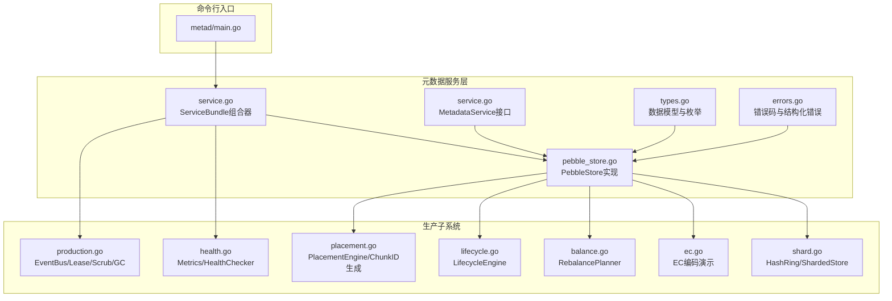

图表来源
- [main.go:21-150](file://nufs-core/cmd/metad/main.go#L21-L150)
- [service.go:16-135](file://nufs-core/metadata/service.go#L16-L135)
- [pebble_store.go:16-90](file://nufs-core/metadata/pebble_store.go#L16-L90)
- [types.go:10-209](file://nufs-core/metadata/types.go#L10-L209)
- [errors.go:12-90](file://nufs-core/metadata/errors.go#L12-L90)
- [production.go:54-121](file://nufs-core/metadata/production.go#L54-L121)
- [health.go:16-116](file://nufs-core/metadata/health.go#L16-L116)
- [placement.go:27-137](file://nufs-core/metadata/placement.go#L27-L137)
- [lifecycle.go:35-90](file://nufs-core/metadata/lifecycle.go#L35-L90)
- [balance.go:14-46](file://nufs-core/metadata/balance.go#L14-L46)
- [ec.go:13-34](file://nufs-core/metadata/ec.go#L13-L34)
- [shard.go:34-101](file://nufs-core/metadata/shard.go#L34-L101)

章节来源
- [main.go:21-150](file://nufs-core/cmd/metad/main.go#L21-L150)
- [service.go:16-135](file://nufs-core/metadata/service.go#L16-L135)
- [pebble_store.go:16-90](file://nufs-core/metadata/pebble_store.go#L16-L90)

## 核心组件
- MetadataService：统一的元数据操作接口，覆盖桶、命名空间、Inode、Chunk、集群、修复与再平衡等能力
- ServiceBundle：生产级组合器，将核心服务与事件、指标、健康、租约、GC、数据修复、再平衡、生命周期、Raft等子系统装配在一起
- PebbleStore：基于Pebble的存储实现，支持批写入、前缀扫描、MVCC版本控制、Raft共识集成
- 数据模型与错误码：统一的类型定义与错误分类，便于上层调用与运维观测
- 生产子系统：事件总线、指标、健康检查、租约、GC、数据修复、再平衡、生命周期、分片路由

章节来源
- [service.go:16-135](file://nufs-core/metadata/service.go#L16-L135)
- [types.go:10-209](file://nufs-core/metadata/types.go#L10-L209)
- [errors.go:12-90](file://nufs-core/metadata/errors.go#L12-L90)
- [pebble_store.go:16-90](file://nufs-core/metadata/pebble_store.go#L16-L90)
- [production.go:54-121](file://nufs-core/metadata/production.go#L54-L121)
- [health.go:16-116](file://nufs-core/metadata/health.go#L16-L116)
- [placement.go:27-137](file://nufs-core/metadata/placement.go#L27-L137)
- [lifecycle.go:35-90](file://nufs-core/metadata/lifecycle.go#L35-L90)
- [balance.go:14-46](file://nufs-core/metadata/balance.go#L14-L46)
- [ec.go:13-34](file://nufs-core/metadata/ec.go#L13-L34)
- [shard.go:34-101](file://nufs-core/metadata/shard.go#L34-L101)

## 架构总览
下图展示了元数据服务的整体架构：命令行入口启动ServiceBundle，内部装配PebbleStore与各生产子系统；对外通过统一的MetadataService接口暴露能力；支持Raft一致性与分片扩展。

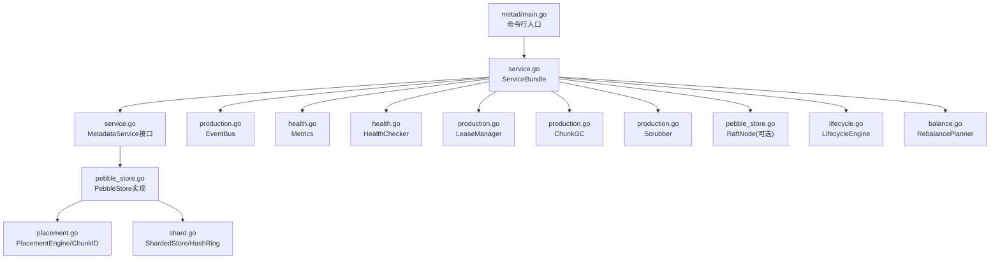

图表来源
- [main.go:21-150](file://nufs-core/cmd/metad/main.go#L21-L150)
- [service.go:76-213](file://nufs-core/metadata/service.go#L76-L213)
- [pebble_store.go:16-90](file://nufs-core/metadata/pebble_store.go#L16-L90)
- [production.go:54-121](file://nufs-core/metadata/production.go#L54-L121)
- [health.go:16-116](file://nufs-core/metadata/health.go#L16-L116)
- [lifecycle.go:35-90](file://nufs-core/metadata/lifecycle.go#L35-L90)
- [balance.go:14-46](file://nufs-core/metadata/balance.go#L14-L46)
- [placement.go:27-137](file://nufs-core/metadata/placement.go#L27-L137)
- [shard.go:192-236](file://nufs-core/metadata/shard.go#L192-L236)

## 详细组件分析

### MetadataService接口设计
- 框架目标：以统一接口屏蔽后端差异，当前PebbleStore实现该接口，未来可替换为etcd或其他实现
- 能力域划分：
  - 桶操作：创建/删除/列举/查询
  - 命名空间操作：目录/文件创建、删除、读取、查找、重命名、符号链接、硬链接
  - Inode操作：获取、更新（含MVCC版本CAS）
  - Chunk操作：分配、提交、封存、查询、列举、删除、上报副本状态
  - 集群操作：节点注册、心跳、下线、列表、查询
  - 修复与再平衡：修复队列、触发修复、触发再平衡
  - 生命周期：Close生命周期管理

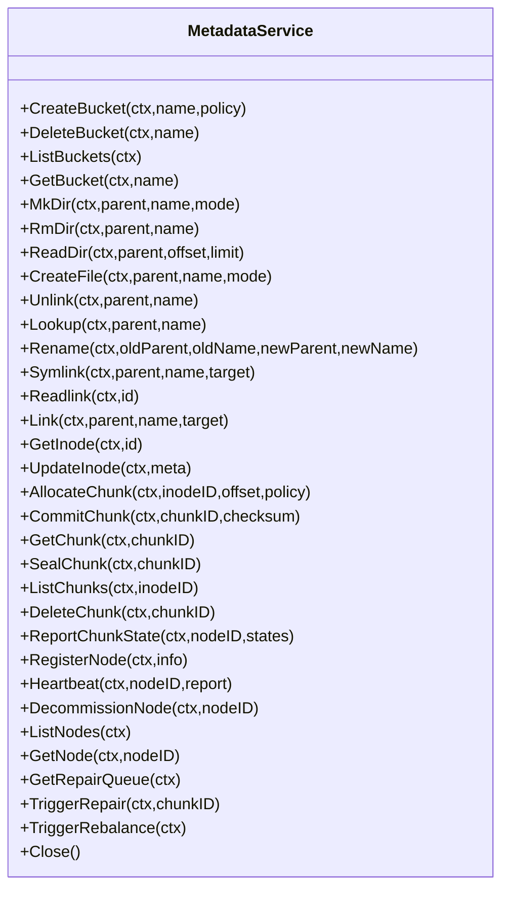

图表来源
- [service.go:16-67](file://nufs-core/metadata/service.go#L16-L67)

章节来源
- [service.go:16-67](file://nufs-core/metadata/service.go#L16-L67)

### ServiceBundle生产部署组合器
- 组合内容：核心MetadataService、EventBus、Metrics、HealthChecker、LeaseManager、ChunkGC、Scrubber、RaftNode、LifecycleEngine
- 初始化流程：按选项装配子系统，支持租约、GC、数据修复、生命周期规则、Raft等
- 关闭顺序：先停止后台任务，再关闭核心服务，确保资源有序释放

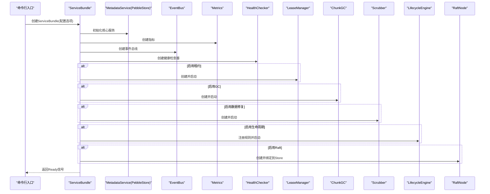

图表来源
- [service.go:136-213](file://nufs-core/metadata/service.go#L136-L213)

章节来源
- [service.go:76-213](file://nufs-core/metadata/service.go#L76-L213)

### 数据模型与错误处理
- 数据模型：InodeMeta、DirEntry、BucketInfo、ChunkMeta、ReplicaInfo、NodeInfo、RepairTask、PlacementPolicy、ECGroupInfo等
- 错误体系：ErrorCode分类、结构化Error、具体错误如桶不存在、命名空间冲突、Chunk未封存、节点离线、版本冲突、Raft失败等

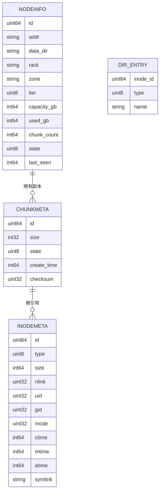

图表来源
- [types.go:30-144](file://nufs-core/metadata/types.go#L30-L144)

章节来源
- [types.go:10-209](file://nufs-core/metadata/types.go#L10-L209)
- [errors.go:12-90](file://nufs-core/metadata/errors.go#L12-L90)

### 桶与命名空间操作
- 桶：原子创建根Inode与策略写入；删除前校验根目录为空
- 命名空间：目录/文件创建、删除、读取、查找、重命名、符号链接、硬链接；维护父目录nlink

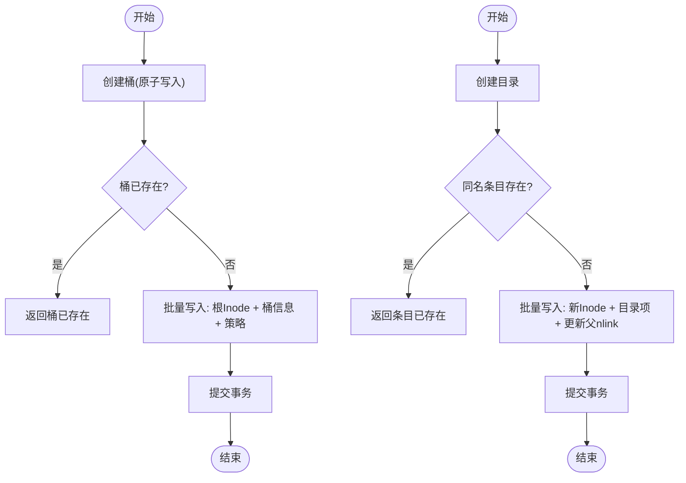

图表来源
- [pebble_store.go:253-303](file://nufs-core/metadata/pebble_store.go#L253-L303)
- [pebble_store.go:371-428](file://nufs-core/metadata/pebble_store.go#L371-L428)

章节来源
- [pebble_store.go:253-303](file://nufs-core/metadata/pebble_store.go#L253-L303)
- [pebble_store.go:371-428](file://nufs-core/metadata/pebble_store.go#L371-L428)

### Inode与Chunk操作
- Inode：获取、更新；支持MVCC版本CAS更新，避免并发写冲突
- Chunk：分配（生成ChunkID、拓扑放置）、提交（设置封存状态与校验和）、封存（Ready）、查询、列举、删除、上报副本状态

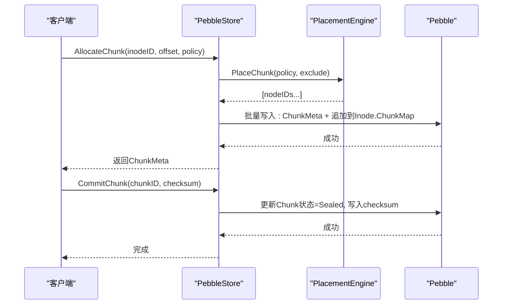

图表来源
- [pebble_store.go:781-832](file://nufs-core/metadata/pebble_store.go#L781-L832)
- [pebble_store.go:834-853](file://nufs-core/metadata/pebble_store.go#L834-L853)
- [placement.go:66-137](file://nufs-core/metadata/placement.go#L66-L137)

章节来源
- [pebble_store.go:781-853](file://nufs-core/metadata/pebble_store.go#L781-L853)
- [placement.go:66-137](file://nufs-core/metadata/placement.go#L66-L137)

### 集群与租约管理
- 节点注册：写入NodeInfo并加入PlacementEngine
- 心跳：更新LastSeen与状态，上报Chunk状态
- 租约：定期检查过期节点并标记离线，发布事件驱动修复

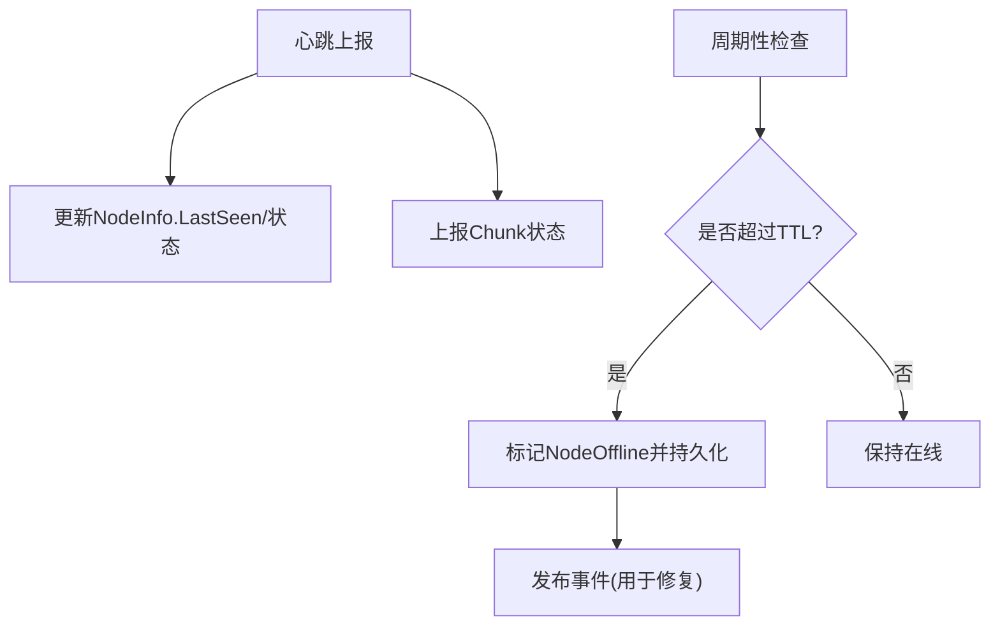

图表来源
- [pebble_store.go:939-989](file://nufs-core/metadata/pebble_store.go#L939-L989)
- [production.go:273-303](file://nufs-core/metadata/production.go#L273-L303)

章节来源
- [pebble_store.go:939-989](file://nufs-core/metadata/pebble_store.go#L939-L989)
- [production.go:273-303](file://nufs-core/metadata/production.go#L273-L303)

### 垃圾回收与数据修复
- 垃圾回收：扫描所有Inode收集引用，扫描所有Chunk识别孤儿并删除或仅统计
- 数据修复：扫描Chunk元数据，验证一致性，触发修复事件

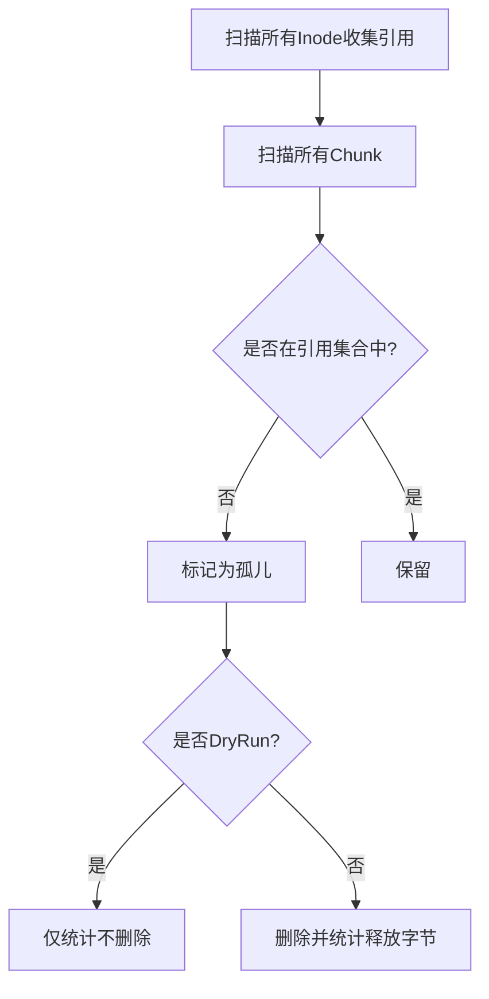

图表来源
- [production.go:337-397](file://nufs-core/metadata/production.go#L337-L397)
- [production.go:491-528](file://nufs-core/metadata/production.go#L491-L528)

章节来源
- [production.go:337-397](file://nufs-core/metadata/production.go#L337-L397)
- [production.go:491-528](file://nufs-core/metadata/production.go#L491-L528)

### 再平衡与生命周期
- 再平衡：计算节点负载与失衡度，生成迁移计划并通过修复队列触发
- 生命周期：按规则对桶内文件进行Tier迁移与到期删除（设置NLink=0）

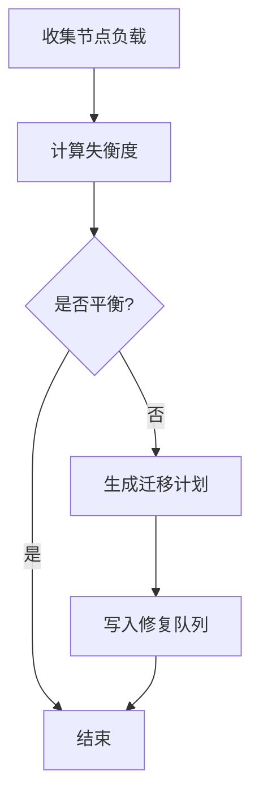

图表来源
- [balance.go:46-177](file://nufs-core/metadata/balance.go#L46-L177)
- [lifecycle.go:99-178](file://nufs-core/metadata/lifecycle.go#L99-L178)

章节来源
- [balance.go:46-177](file://nufs-core/metadata/balance.go#L46-L177)
- [lifecycle.go:99-178](file://nufs-core/metadata/lifecycle.go#L99-L178)

### 分片与一致性哈希
- HashRing：基于CRC32的虚拟节点一致性哈希，支持动态扩缩容
- ShardedStore：根据键路由到具体PebbleStore实例，支持跨分片扫描

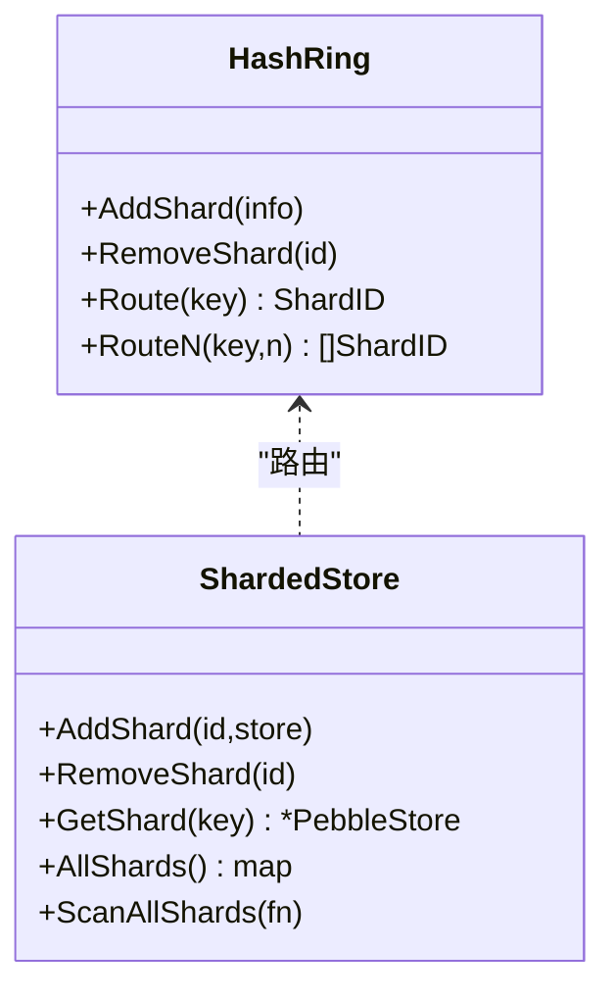

图表来源
- [shard.go:34-101](file://nufs-core/metadata/shard.go#L34-L101)
- [shard.go:192-236](file://nufs-core/metadata/shard.go#L192-L236)

章节来源
- [shard.go:34-101](file://nufs-core/metadata/shard.go#L34-L101)
- [shard.go:192-236](file://nufs-core/metadata/shard.go#L192-L236)

### etcd后端实现差异与选择策略
- 实现差异
  - 数据模型：两者共享同一MetadataService接口，但键空间与序列化可能不同
  - 一致性：etcd采用Raft强一致，适合高可用场景；Pebble适合超大规模键值存储与本地优化
  - 性能：Pebble在LSM树上具备更好的写放大与压缩特性；etcd在分布式读写与事务方面更成熟
  - 可运维：etcd生态完善，监控与运维工具丰富；Pebble需要自建运维链路
- 选择策略
  - 小规模/单机：优先Pebble，成本低、易部署
  - 大规模/多数据中心：优先etcd，强一致与运维成熟度更高
  - 混合：通过MetadataService接口抽象，可在不同环境灵活切换

[本节为概念性说明，不直接分析具体文件]

## 依赖分析
- 组件耦合
  - ServiceBundle对各子系统有装配依赖，但通过接口解耦，便于替换与测试
  - PebbleStore依赖PlacementEngine、ChunkID生成器、RaftNode（可选），并与事件总线交互
  - 健康检查依赖Metrics与Raft状态
- 外部依赖
  - Pebble：LSM存储引擎
  - Raft：一致性协议（可选）
  - HTTP：运维接口（metad）

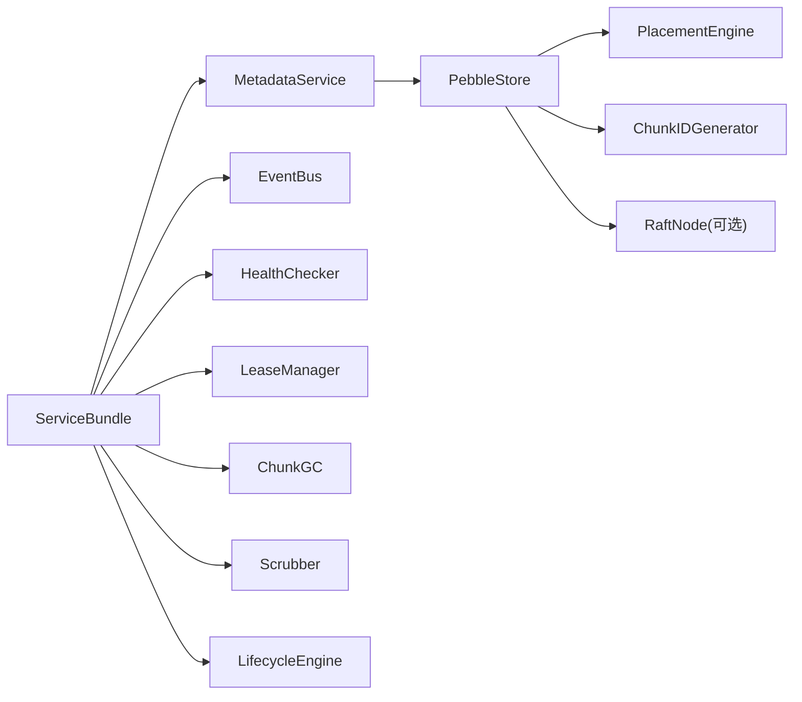

图表来源
- [service.go:76-213](file://nufs-core/metadata/service.go#L76-L213)
- [pebble_store.go:16-90](file://nufs-core/metadata/pebble_store.go#L16-L90)
- [placement.go:27-137](file://nufs-core/metadata/placement.go#L27-L137)
- [health.go:16-116](file://nufs-core/metadata/health.go#L16-L116)
- [production.go:54-121](file://nufs-core/metadata/production.go#L54-L121)
- [lifecycle.go:35-90](file://nufs-core/metadata/lifecycle.go#L35-L90)

章节来源
- [service.go:76-213](file://nufs-core/metadata/service.go#L76-L213)
- [pebble_store.go:16-90](file://nufs-core/metadata/pebble_store.go#L16-L90)

## 性能考量
- 写入路径
  - 批量写入：使用Pebble Batch减少落盘次数
  - 前缀扫描：合理使用scanPrefixWithLimit限制结果集
  - Raft写入：开启Raft时所有写入经日志复制，延迟增加但保证一致性
- 读取路径
  - 使用缓存分层（可选CacheDir）降低热键读取延迟
  - 事件总线缓冲区大小可调，避免慢消费者丢弃事件
- 指标与观测
  - Metrics记录读写延迟直方图，支持p50/p99评估
  - HealthChecker提供健康与就绪探针，适配容器编排

[本节提供通用指导，不直接分析具体文件]

## 故障排查指南
- 常见错误定位
  - 桶/命名空间：桶不存在、目录非空、条目已存在、名称过长
  - Chunk：未封存、已封存、校验和不匹配
  - 节点：节点不存在、离线、不足节点满足放置策略
  - 系统：服务已关闭、参数无效、版本冲突、不是Leader、Raft应用失败
- 建议排查步骤
  - 查看健康与就绪接口输出
  - 检查GC/Scrub运行日志与统计
  - 核对租约TTL与心跳上报情况
  - 审视修复队列与再平衡计划
  - 对比Metrics中的错误率与延迟

章节来源
- [errors.go:12-90](file://nufs-core/metadata/errors.go#L12-L90)
- [health.go:190-328](file://nufs-core/metadata/health.go#L190-L328)
- [production.go:337-397](file://nufs-core/metadata/production.go#L337-L397)
- [production.go:491-528](file://nufs-core/metadata/production.go#L491-L528)

## 结论
NUFS元数据服务通过统一的MetadataService接口与ServiceBundle组合器，实现了从单机到分布式、从本地存储到可选etcd的灵活部署。PebbleStore提供高性能的键值存储与Raft集成，配合事件总线、指标、健康检查、租约、GC、数据修复、再平衡与生命周期管理，形成完整的生产级能力矩阵。通过合理的配置与运维实践，可在不同规模与环境下稳定运行。

[本节为总结性内容，不直接分析具体文件]

## 附录

### 配置选项说明（metad）
- 数据目录与缓存：-data-dir、-cache-dir
- 节点与内存：-node-id、-memtable-size
- Raft：-raft、-raft-addr、-raft-dir、-raft-bootstrap、-raft-peers
- 运维接口：-ops-addr
- 租约与GC/Scrub：-lease-ttl、-gc-interval、-gc-dry-run、-scrub-interval

章节来源
- [main.go:22-37](file://nufs-core/cmd/metad/main.go#L22-L37)
- [main.go:93-98](file://nufs-core/cmd/metad/main.go#L93-L98)

### 最佳实践
- 配置建议
  - 单机模式：禁用Raft，合理设置MemTable与MaxOpenFiles
  - 分布式模式：启用Raft，设置合适的快照阈值与间隔
  - GC/Scrub：根据数据增长速率调整周期，必要时开启DryRun验证
  - 租约：结合心跳频率设置TTL，避免频繁误判离线
- 运维建议
  - 使用/health与/ready接口进行探活
  - 定期查看/cluster/status确认Leader状态
  - 关注Metrics中的错误率与延迟，及时发现异常
  - 对关键操作（迁移、再平衡）进行灰度与回滚预案

章节来源
- [main.go:152-221](file://nufs-core/cmd/metad/main.go#L152-L221)
- [health.go:292-328](file://nufs-core/metadata/health.go#L292-L328)
- [production.go:337-397](file://nufs-core/metadata/production.go#L337-L397)
- [production.go:491-528](file://nufs-core/metadata/production.go#L491-L528)