# 数据节点服务

<cite>
**本文档引用的文件**
- [chunkstore.go](file://nufs-core/datanode/chunkstore.go)
- [diskmanager.go](file://nufs-core/datanode/diskmanager.go)
- [replicator.go](file://nufs-core/datanode/replicator.go)
- [heartbeat.go](file://nufs-core/datanode/heartbeat.go)
- [server.go](file://nufs-core/datanode/server.go)
- [types.go](file://nufs-core/datanode/types.go)
- [ops.go](file://nufs-core/datanode/ops.go)
- [repair.go](file://nufs-core/datanode/repair.go)
- [ha.go](file://nufs-core/datanode/ha.go)
- [main.go](file://nufs-core/cmd/datanode/main.go)
- [chunkstore_test.go](file://nufs-core/datanode/chunkstore_test.go)
- [replicator_test.go](file://nufs-core/datanode/replicator_test.go)
- [server_test.go](file://nufs-core/datanode/server_test.go)
- [ARCHITECTURE.md](file://nufs-core/ARCHITECTURE.md)
</cite>

## 目录
1. [简介](#简介)
2. [项目结构](#项目结构)
3. [核心组件](#核心组件)
4. [架构概览](#架构概览)
5. [详细组件分析](#详细组件分析)
6. [依赖关系分析](#依赖关系分析)
7. [性能考虑](#性能考虑)
8. [故障排查指南](#故障排查指南)
9. [结论](#结论)
10. [附录](#附录)

## 简介

NUFS数据节点服务是分布式存储系统中的核心组件，负责管理本地磁盘存储、处理数据读写请求，并参与数据复制和一致性维护。该服务实现了高效的Chunk存储机制、智能的磁盘管理策略、可靠的复制引擎以及完善的健康检查机制。

数据节点服务采用模块化设计，包含以下主要功能模块：
- **Chunk存储管理**：本地磁盘存储、文件格式、并发控制
- **磁盘管理**：容量监控、存储分层、WAL崩溃恢复
- **复制引擎**：异步复制、链式复制、修复机制
- **心跳上报**：状态监控、健康检查、资源统计
- **网络服务**：TCP协议、请求处理、客户端通信

## 项目结构

NUFS数据节点服务位于`nufs-core/datanode/`目录下，采用清晰的模块化组织：

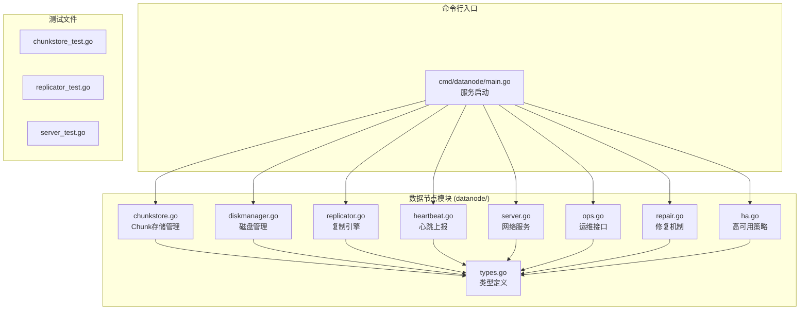

**图表来源**
- [chunkstore.go:1-395](file://nufs-core/datanode/chunkstore.go#L1-L395)
- [diskmanager.go:1-421](file://nufs-core/datanode/diskmanager.go#L1-L421)
- [replicator.go:1-192](file://nufs-core/datanode/replicator.go#L1-L192)
- [heartbeat.go:1-107](file://nufs-core/datanode/heartbeat.go#L1-L107)
- [server.go:1-462](file://nufs-core/datanode/server.go#L1-L462)
- [types.go:1-171](file://nufs-core/datanode/types.go#L1-L171)
- [ops.go:1-318](file://nufs-core/datanode/ops.go#L1-L318)
- [repair.go:1-183](file://nufs-core/datanode/repair.go#L1-L183)
- [ha.go:1-402](file://nufs-core/datanode/ha.go#L1-L402)

**章节来源**
- [main.go:1-134](file://nufs-core/cmd/datanode/main.go#L1-L134)
- [ARCHITECTURE.md:248-287](file://nufs-core/ARCHITECTURE.md#L248-L287)

## 核心组件

### Chunk存储引擎

Chunk存储引擎是数据节点的核心，负责将数据以Chunk形式存储在本地磁盘上。每个Chunk文件包含二进制头部和数据体，支持并发读写操作。

关键特性：
- **文件格式**：二进制头部 + 数据体，包含魔数、ChunkID、长度、校验和
- **分片存储**：256个分片目录，避免单目录文件过多
- **并发控制**：读写信号量限制并发操作数量
- **元数据管理**：JSON格式元数据边车文件

### 磁盘管理系统

磁盘管理系统提供容量监控、存储分层和崩溃恢复功能：

- **容量监控**：实时统计使用量、剩余空间、使用率
- **存储分层**：热/温/冷/归档四层存储策略
- **WAL日志**：崩溃恢复机制，确保数据一致性
- **准入控制**：根据容量使用率拒绝写入请求

### 复制引擎

复制引擎实现异步数据复制和修复机制：

- **异步复制**：多工作线程并行复制，指数退避重试
- **链式复制**：支持同步写入管道，主副本优先
- **修复机制**：自动检测不一致并触发修复
- **反熵引擎**：定期比较副本一致性

### 心跳上报系统

心跳上报系统负责向元数据服务报告节点状态：

- **周期性上报**：默认10秒间隔
- **状态收集**：使用量、Chunk数量、磁盘IO利用率
- **Chunk状态**：Ready/Syncing/Failed状态映射
- **健康检查**：提供HTTP健康检查接口

**章节来源**
- [chunkstore.go:18-59](file://nufs-core/datanode/chunkstore.go#L18-L59)
- [diskmanager.go:22-88](file://nufs-core/datanode/diskmanager.go#L22-L88)
- [replicator.go:23-46](file://nufs-core/datanode/replicator.go#L23-L46)
- [heartbeat.go:12-36](file://nufs-core/datanode/heartbeat.go#L12-L36)

## 架构概览

数据节点服务采用分层架构设计，各组件职责明确、耦合度低：

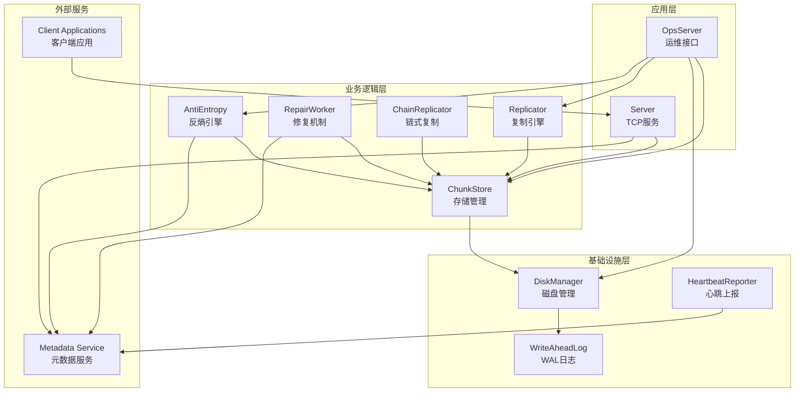

**图表来源**
- [server.go:18-34](file://nufs-core/datanode/server.go#L18-L34)
- [ops.go:19-33](file://nufs-core/datanode/ops.go#L19-L33)
- [chunkstore.go:22-31](file://nufs-core/datanode/chunkstore.go#L22-L31)
- [diskmanager.go:24-45](file://nufs-core/datanode/diskmanager.go#L24-L45)
- [replicator.go:23-31](file://nufs-core/datanode/replicator.go#L23-L31)
- [repair.go:13-27](file://nufs-core/datanode/repair.go#L13-L27)
- [ha.go:53-67](file://nufs-core/datanode/ha.go#L53-L67)

### 数据流向

数据在系统中的流转过程：

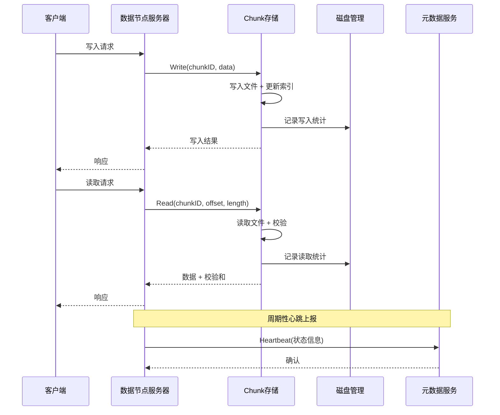

**图表来源**
- [server.go:130-156](file://nufs-core/datanode/server.go#L130-L156)
- [chunkstore.go:74-127](file://nufs-core/datanode/chunkstore.go#L74-L127)
- [diskmanager.go:147-151](file://nufs-core/datanode/diskmanager.go#L147-L151)
- [heartbeat.go:71-100](file://nufs-core/datanode/heartbeat.go#L71-L100)

## 详细组件分析

### Chunk存储组件

Chunk存储组件是数据节点的核心存储引擎，负责管理本地磁盘上的Chunk文件。

#### 数据结构设计

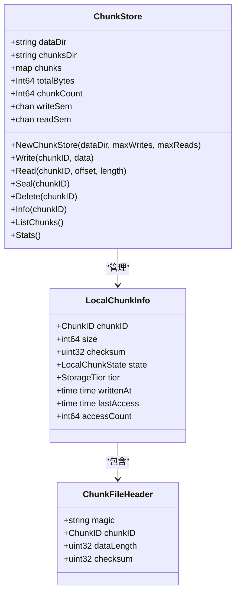

**图表来源**
- [chunkstore.go:22-31](file://nufs-core/datanode/chunkstore.go#L22-L31)
- [types.go:151-160](file://nufs-core/datanode/types.go#L151-L160)
- [types.go:139-146](file://nufs-core/datanode/types.go#L139-L146)

#### 文件存储格式

Chunk文件采用二进制格式存储，包含固定大小的头部和可变长度的数据体：

| 字段 | 大小(字节) | 描述 | 示例值 |
|------|------------|------|--------|
| 魔数 | 4 | 文件标识符 | "DFS\x01" |
| ChunkID | 8 | 唯一标识符 | 123456789 |
| 数据长度 | 4 | 数据体长度 | 1048576 |
| 校验和 | 4 | CRC32校验和 | 0x12345678 |
| 数据体 | N | 实际数据内容 | 1MB数据 |

#### 并发控制机制

存储引擎使用信号量实现并发控制：

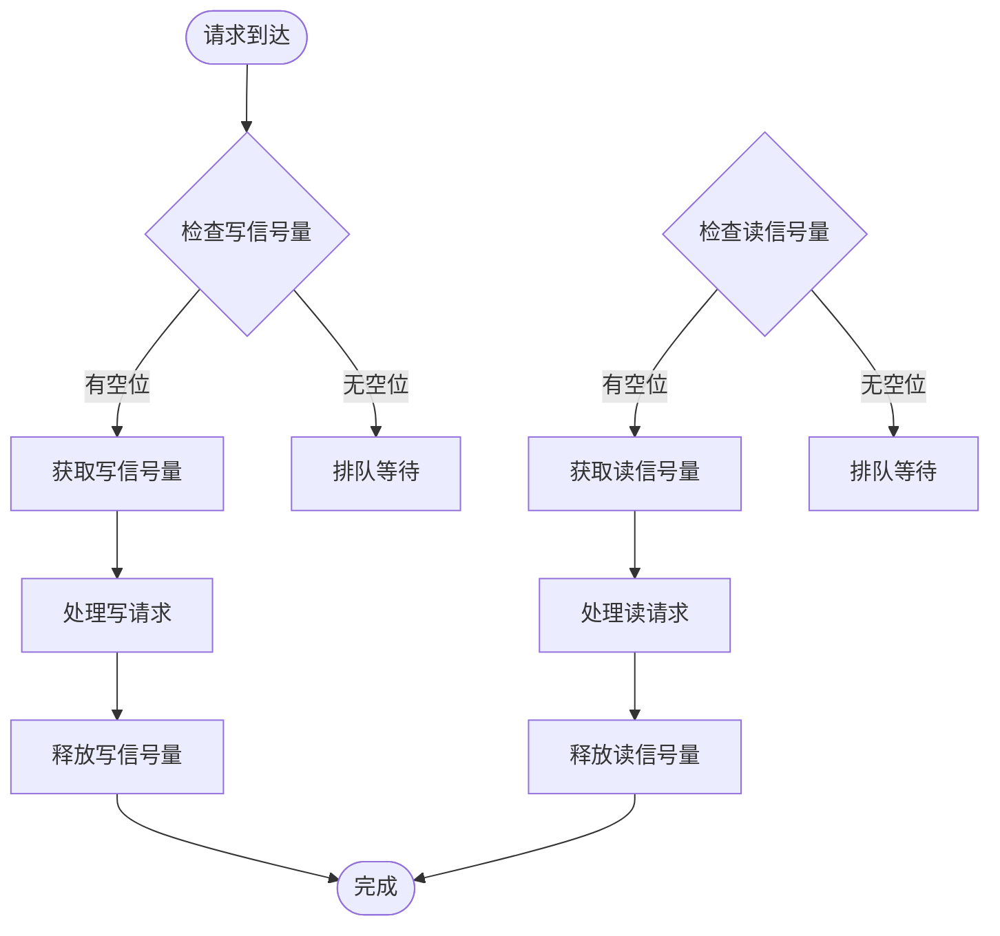

**图表来源**
- [chunkstore.go:74-77](file://nufs-core/datanode/chunkstore.go#L74-L77)
- [chunkstore.go:171-173](file://nufs-core/datanode/chunkstore.go#L171-L173)

**章节来源**
- [chunkstore.go:18-395](file://nufs-core/datanode/chunkstore.go#L18-L395)
- [types.go:120-171](file://nufs-core/datanode/types.go#L120-L171)

### 磁盘管理组件

磁盘管理组件提供完整的磁盘生命周期管理功能，包括容量监控、存储分层和崩溃恢复。

#### 存储分层策略

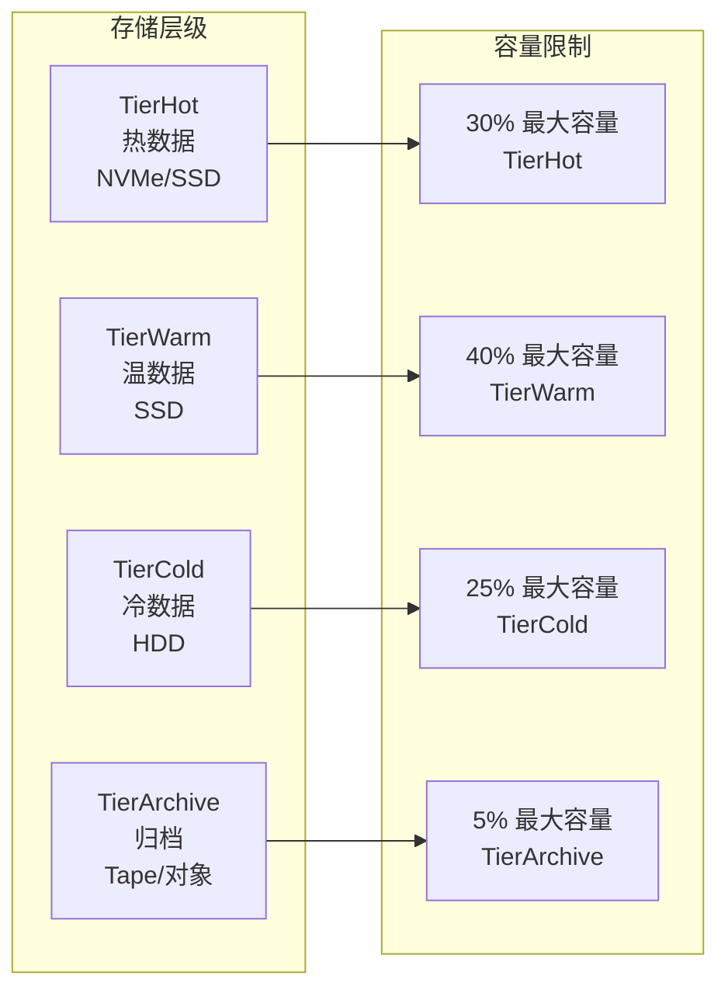

**图表来源**
- [diskmanager.go:90-97](file://nufs-core/datanode/diskmanager.go#L90-L97)

#### WAL崩溃恢复机制

WAL（Write-Ahead Log）提供崩溃恢复能力：

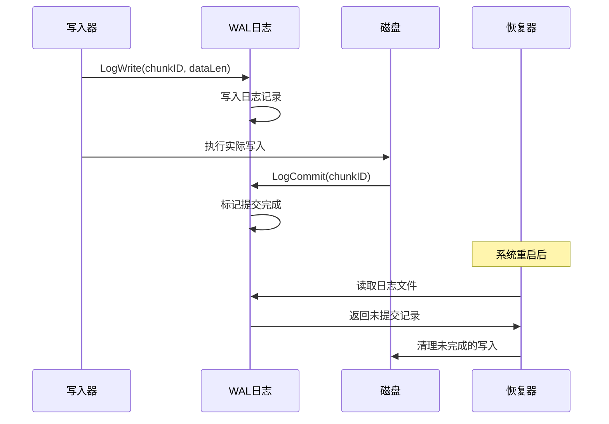

**图表来源**
- [diskmanager.go:220-256](file://nufs-core/datanode/diskmanager.go#L220-L256)

**章节来源**
- [diskmanager.go:22-421](file://nufs-core/datanode/diskmanager.go#L22-L421)

### 复制引擎组件

复制引擎实现高效的数据复制和修复机制，支持异步复制和链式复制两种模式。

#### 异步复制架构

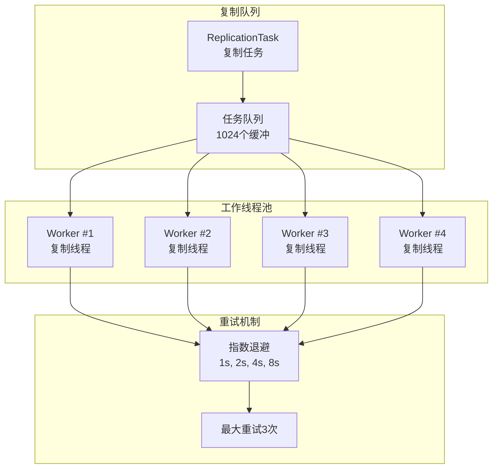

**图表来源**
- [replicator.go:48-75](file://nufs-core/datanode/replicator.go#L48-L75)

#### 链式复制策略

链式复制提供强一致性的写入路径：

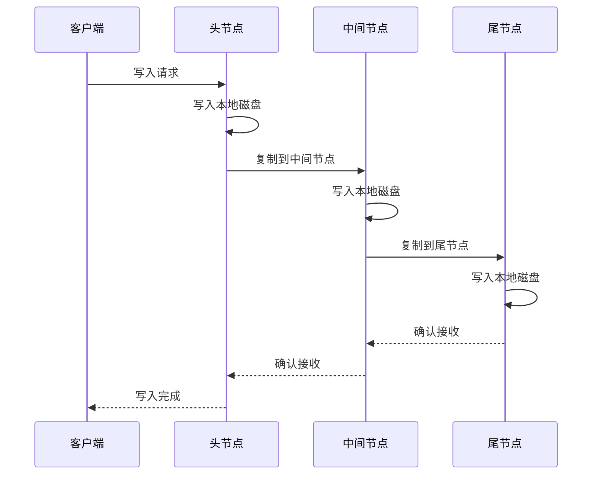

**图表来源**
- [ha.go:20-30](file://nufs-core/datanode/ha.go#L20-L30)

**章节来源**
- [replicator.go:23-192](file://nufs-core/datanode/replicator.go#L23-L192)
- [ha.go:53-194](file://nufs-core/datanode/ha.go#L53-L194)

### 心跳上报组件

心跳上报组件负责定期向元数据服务报告节点状态，确保集群协调和健康监控。

#### 心跳数据结构

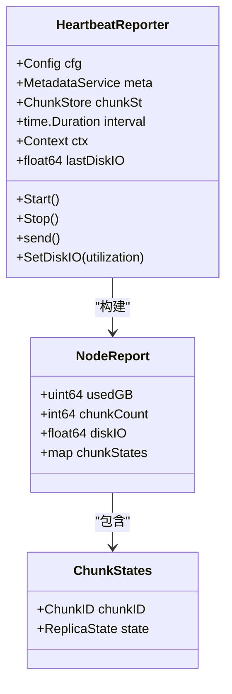

**图表来源**
- [heartbeat.go:14-36](file://nufs-core/datanode/heartbeat.go#L14-L36)
- [heartbeat.go:90-95](file://nufs-core/datanode/heartbeat.go#L90-L95)

#### 健康检查机制

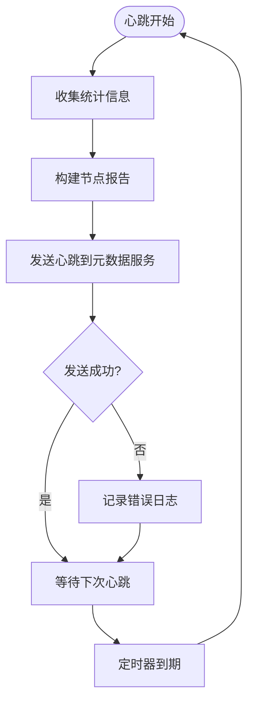

**图表来源**
- [heartbeat.go:52-69](file://nufs-core/datanode/heartbeat.go#L52-L69)

**章节来源**
- [heartbeat.go:12-107](file://nufs-core/datanode/heartbeat.go#L12-L107)

### 网络服务组件

网络服务组件提供TCP协议的客户端-服务器通信，支持多种数据操作。

#### 协议设计

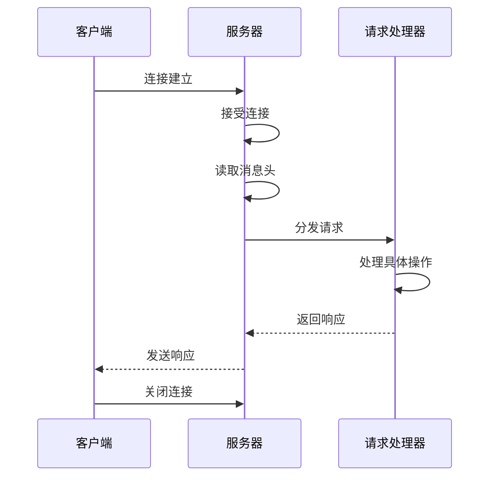

**图表来源**
- [server.go:81-100](file://nufs-core/datanode/server.go#L81-L100)

#### 请求类型定义

| 请求类型 | 常量值 | 描述 | 参数 |
|----------|--------|------|------|
| ReqWriteChunk | 0 | 写入Chunk数据 | ChunkID, Offset, Length, Checksum, Data |
| ReqReadChunk | 1 | 读取Chunk数据 | ChunkID, Offset, Length |
| ReqDeleteChunk | 2 | 删除Chunk | ChunkID |
| ReqReplicateChunk | 3 | 复制Chunk到本节点 | ChunkID, Data |
| ReqChunkInfo | 4 | 查询Chunk元数据 | ChunkID |
| ReqListChunks | 5 | 列出本地所有Chunk | 无 |
| ReqHealth | 6 | 健康检查 | 无 |

**章节来源**
- [server.go:18-462](file://nufs-core/datanode/server.go#L18-L462)
- [types.go:75-118](file://nufs-core/datanode/types.go#L75-L118)

### 运维管理组件

运维管理组件提供HTTP接口，支持集群状态查询、节点管理和修复操作。

#### 运维接口设计

```mermaid
graph TB
subgraph "运维接口"
A[/api/v1/cluster/status<br/>集群状态]
B[/api/v1/nodes<br/>节点列表]
C[/api/v1/nodes/{id}/decommission<br/>节点下线]
D[/api/v1/buckets<br/>桶列表]
E[/api/v1/chunks/{id}/verify<br/>Chunk验证]
F[/api/v1/repair/queue<br/>修复队列]
G[/api/v1/gc/scan<br/>垃圾回收扫描]
H[/api/v1/metrics<br/>指标查询]
I[/api/v1/health<br/>健康检查]
end
subgraph "监控指标"
J[磁盘使用情况]
K[缓存统计]
L[复制统计]
M[反熵统计]
end
A --> J
A --> K
A --> L
A --> M
```

**图表来源**
- [ops.go:45-64](file://nufs-core/datanode/ops.go#L45-L64)

**章节来源**
- [ops.go:19-318](file://nufs-core/datanode/ops.go#L19-L318)

## 依赖关系分析

数据节点服务的组件间依赖关系清晰，遵循单一职责原则：

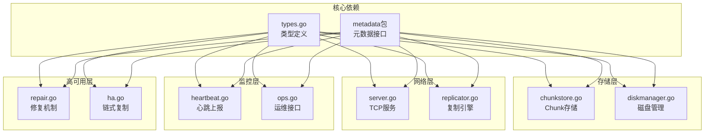

**图表来源**
- [types.go:1-171](file://nufs-core/datanode/types.go#L1-L171)
- [chunkstore.go:1-16](file://nufs-core/datanode/chunkstore.go#L1-L16)
- [diskmanager.go:1-16](file://nufs-core/datanode/diskmanager.go#L1-L16)
- [server.go:1-16](file://nufs-core/datanode/server.go#L1-L16)
- [replicator.go:1-12](file://nufs-core/datanode/replicator.go#L1-L12)
- [heartbeat.go:1-10](file://nufs-core/datanode/heartbeat.go#L1-L10)
- [ops.go:1-13](file://nufs-core/datanode/ops.go#L1-L13)
- [repair.go:1-11](file://nufs-core/datanode/repair.go#L1-L11)
- [ha.go:1-14](file://nufs-core/datanode/ha.go#L1-L14)

### 启动流程

数据节点服务的完整启动流程：

```mermaid
flowchart TD
Start([启动进程]) --> ParseConfig["解析配置参数"]
ParseConfig --> InitChunkStore["初始化Chunk存储"]
InitChunkStore --> InitDiskManager["初始化磁盘管理"]
InitDiskManager --> ConnectMetadata["连接元数据服务"]
ConnectMetadata --> RegisterNode["注册节点到元数据服务"]
RegisterNode --> StartTCPServer["启动TCP服务器"]
StartTCPServer --> StartReplicator["启动复制引擎"]
StartReplicator --> StartChainReplicator["启动链式复制"]
StartChainReplicator --> StartAntiEntropy["启动反熵引擎"]
StartAntiEntropy --> StartHeartbeat["启动心跳上报"]
StartHeartbeat --> StartOpsAPI["启动运维API"]
StartOpsAPI --> Running([服务运行中])
Running --> Shutdown(["优雅关闭"])
Shutdown --> StopOpsAPI["停止运维API"]
StopOpsAPI --> StopHeartbeat["停止心跳上报"]
StopHeartbeat --> StopAntiEntropy["停止反熵引擎"]
StopAntiEntropy --> StopChainReplicator["停止链式复制"]
StopChainReplicator --> StopReplicator["停止复制引擎"]
StopReplicator --> StopTCPServer["停止TCP服务器"]
StopTCPServer --> DisconnectMetadata["断开元数据服务"]
DisconnectMetadata --> StopDiskManager["停止磁盘管理"]
StopDiskManager --> StopChunkStore["停止Chunk存储"]
StopChunkStore --> End([进程退出])
```

**图表来源**
- [main.go:19-133](file://nufs-core/cmd/datanode/main.go#L19-L133)

**章节来源**
- [main.go:19-134](file://nufs-core/cmd/datanode/main.go#L19-L134)

## 性能考虑

### 存储性能优化

1. **分片存储策略**
   - 256个分片目录避免单目录文件过多
   - 基于ChunkID的哈希分布
   - 减少文件系统性能瓶颈

2. **并发控制**
   - 读写信号量限制并发操作
   - 默认64个并发写入，256个并发读取
   - 避免磁盘寻道竞争

3. **内存管理**
   - 增量统计避免全量扫描
   - 元数据边车文件加速启动
   - 原子操作保证数据一致性

### 网络性能优化

1. **协议优化**
   - 长连接复用减少握手开销
   - 流水线处理提高吞吐量
   - 压缩传输减少带宽占用

2. **复制优化**
   - 异步复制避免阻塞主写入
   - 多工作线程并行复制
   - 指数退避重试避免雪崩

### 监控指标

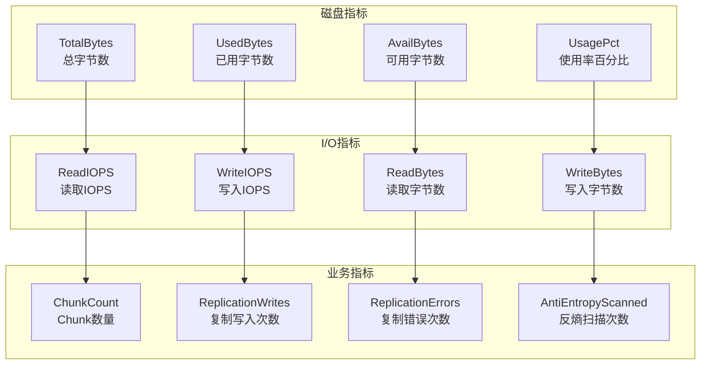

## 故障排查指南

### 常见问题诊断

1. **Chunk存储问题**
   - 检查磁盘空间是否充足
   - 验证Chunk文件完整性
   - 查看WAL日志进行恢复

2. **复制失败问题**
   - 检查源节点和目标节点连通性
   - 验证复制队列状态
   - 查看重试日志

3. **心跳异常问题**
   - 检查元数据服务可达性
   - 验证节点注册状态
   - 查看心跳间隔配置

### 调试工具

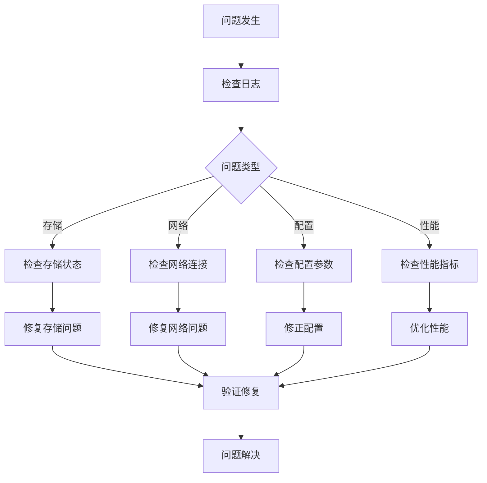

**章节来源**
- [chunkstore_test.go:1-473](file://nufs-core/datanode/chunkstore_test.go#L1-L473)
- [replicator_test.go:1-282](file://nufs-core/datanode/replicator_test.go#L1-L282)
- [server_test.go:1-403](file://nufs-core/datanode/server_test.go#L1-L403)

## 结论

NUFS数据节点服务模块展现了优秀的工程设计和实现质量。通过模块化架构、完善的错误处理、性能优化和监控机制，该服务能够稳定可靠地支撑大规模分布式存储需求。

### 主要优势

1. **架构清晰**：模块职责明确，耦合度低
2. **性能优秀**：并发控制、分片存储、异步复制
3. **可靠性强**：WAL崩溃恢复、心跳监控、自动修复
4. **可运维性好**：丰富的监控指标、HTTP运维接口

### 改进建议

1. **监控增强**：增加更详细的性能指标
2. **配置优化**：提供更多运行时配置选项
3. **安全加固**：添加访问控制和加密支持
4. **扩展性提升**：支持更多存储层级和复制策略

## 附录

### 配置参数说明

| 参数名称 | 类型 | 默认值 | 描述 |
|----------|------|--------|------|
| NodeID | uint64 | 1 | 节点唯一标识符 |
| ListenAddr | string | "0.0.0.0:9100" | TCP监听地址 |
| OpsListenAddr | string | "0.0.0.0:8091" | 运维API监听地址 |
| DataDir | string | "/var/lib/dfs/data" | Chunk存储根目录 |
| MetadataAddr | string | "localhost:8091" | 元数据服务地址 |
| HeartbeatInterval | duration | 10s | 心跳间隔 |
| MaxConcurrentWrites | int | 64 | 最大并发写入数 |
| MaxConcurrentReads | int | 256 | 最大并发读取数 |
| CapacityGB | int64 | 1000 | 节点存储容量(GB) |

### 监控指标参考

| 指标名称 | 类型 | 描述 | 更新频率 |
|----------|------|------|----------|
| UsedGB | gauge | 已用存储空间(GB) | 心跳间隔 |
| ChunkCount | gauge | Chunk数量 | 心跳间隔 |
| DiskIO | gauge | 磁盘IO利用率(0.0-1.0) | 心跳间隔 |
| ReplicationWrites | counter | 复制写入次数 | 实时 |
| ReplicationErrors | counter | 复制错误次数 | 实时 |
| AntiEntropyScanned | counter | 反熵扫描次数 | 实时 |
| AntiEntropyMismatches | counter | 不一致检测次数 | 实时 |
| AntiEntropyRepaired | counter | 修复次数 | 实时 |