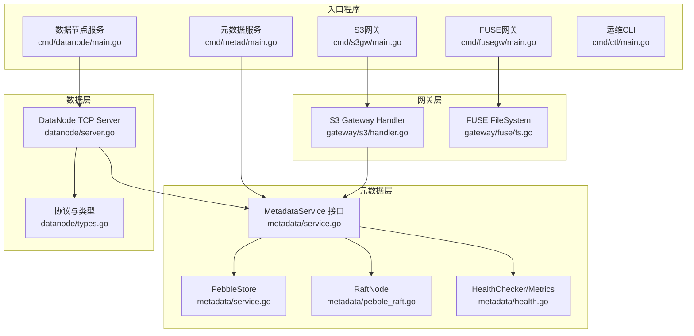
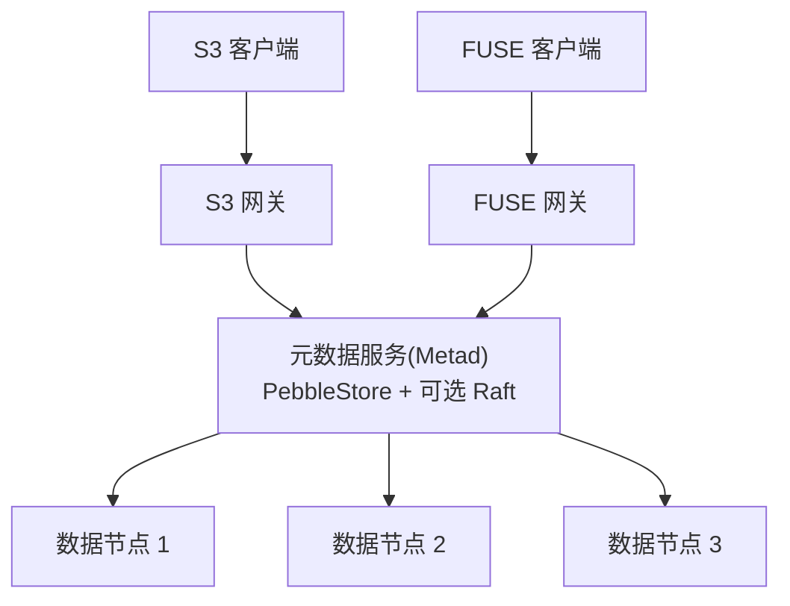
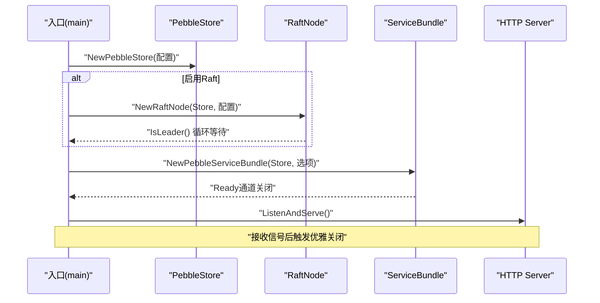
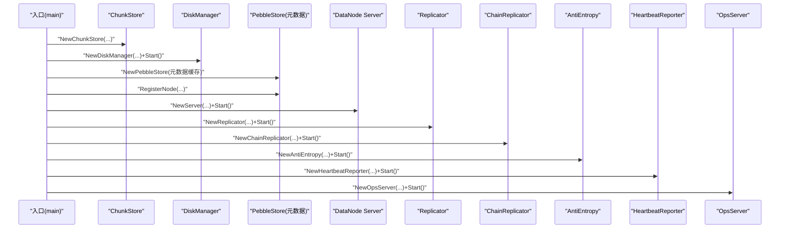
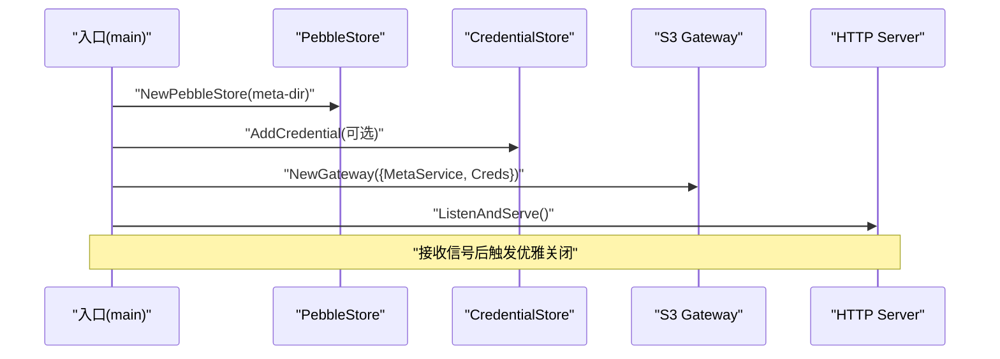
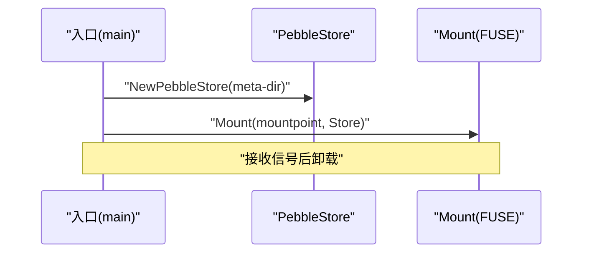
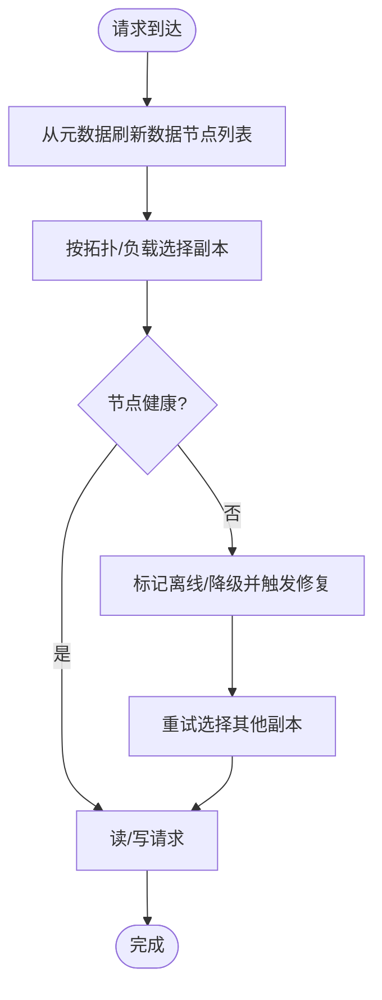
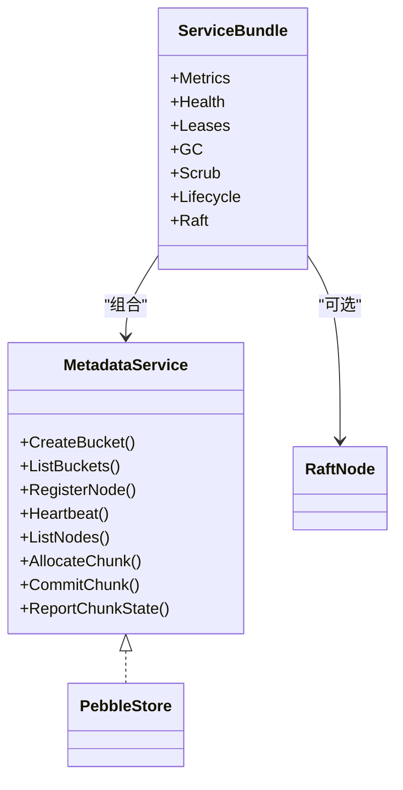
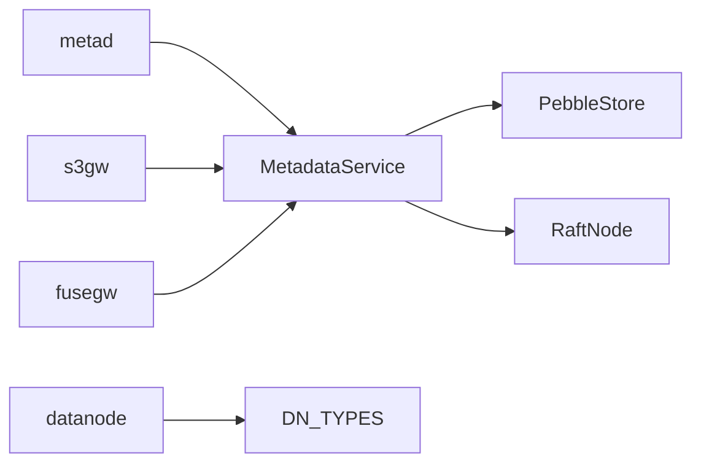

# 服务编排

<cite>
**本文引用的文件**
- [nufs-core/cmd/metad/main.go](file://nufs-core/cmd/metad/main.go)
- [nufs-core/cmd/datanode/main.go](file://nufs-core/cmd/datanode/main.go)
- [nufs-core/cmd/fusegw/main.go](file://nufs-core/cmd/fusegw/main.go)
- [nufs-core/cmd/s3gw/main.go](file://nufs-core/cmd/s3gw/main.go)
- [nufs-core/cmd/ctl/main.go](file://nufs-core/cmd/ctl/main.go)
- [nufs-core/metadata/service.go](file://nufs-core/metadata/service.go)
- [nufs-core/metadata/pebble_raft.go](file://nufs-core/metadata/pebble_raft.go)
- [nufs-core/metadata/health.go](file://nufs-core/metadata/health.go)
- [nufs-core/metadata/types.go](file://nufs-core/metadata/types.go)
- [nufs-core/datanode/server.go](file://nufs-core/datanode/server.go)
- [nufs-core/datanode/types.go](file://nufs-core/datanode/types.go)
- [nufs-core/gateway/s3/handler.go](file://nufs-core/gateway/s3/handler.go)
- [nufs-core/gateway/fuse/fs.go](file://nufs-core/gateway/fuse/fs.go)
- [nufs-core/deploy/config/cluster.yaml](file://nufs-core/deploy/config/cluster.yaml)
- [nufs-core/docker-compose.yml](file://nufs-core/docker-compose.yml)
- [nufs-core/Dockerfile](file://nufs-core/Dockerfile)
- [nufs-core/ARCHITECTURE.md](file://nufs-core/ARCHITECTURE.md)
</cite>

## 目录
1. [简介](#简介)
2. [项目结构](#项目结构)
3. [核心组件](#核心组件)
4. [架构总览](#架构总览)
5. [详细组件分析](#详细组件分析)
6. [依赖分析](#依赖分析)
7. [性能考虑](#性能考虑)
8. [故障排查指南](#故障排查指南)
9. [结论](#结论)
10. [附录](#附录)

## 简介
本文件面向NUFS分布式存储系统的“服务编排”模块，聚焦以下目标：
- 详解各服务入口程序（元数据服务、数据节点服务、S3网关、FUSE网关、运维CLI）的设计与启动流程
- 说明各服务的启动参数与配置项
- 解释服务发现、负载均衡与故障转移机制
- 描述服务间通信协议与协调机制
- 提供Docker容器化与Kubernetes编排最佳实践

## 项目结构
NUFS采用多服务二进制与清晰分层的组织方式：
- cmd/*：各服务入口程序，负责解析参数、初始化组件、启动服务与优雅关闭
- metadata/*：元数据层（Pebble存储 + 可选Raft共识），提供统一MetadataService接口与生产级子系统（租约、GC、清洗、健康检查等）
- datanode/*：数据节点（TCP服务、复制引擎、心跳、磁盘管理、运维API）
- gateway/*：网关层（S3兼容REST与Linux FUSE挂载）
- deploy/*：集群配置与编排样例（YAML、Dockerfile）
- ARCHITECTURE.md：整体架构与数据流说明

图表来源
- [nufs-core/cmd/metad/main.go:21-149](file://nufs-core/cmd/metad/main.go#L21-L149)
- [nufs-core/cmd/datanode/main.go:19-133](file://nufs-core/cmd/datanode/main.go#L19-L133)
- [nufs-core/cmd/s3gw/main.go:18-90](file://nufs-core/cmd/s3gw/main.go#L18-L90)
- [nufs-core/cmd/fusegw/main.go:17-62](file://nufs-core/cmd/fusegw/main.go#L17-L62)
- [nufs-core/cmd/ctl/main.go:17-66](file://nufs-core/cmd/ctl/main.go#L17-L66)
- [nufs-core/metadata/service.go:16-273](file://nufs-core/metadata/service.go#L16-L273)
- [nufs-core/metadata/pebble_raft.go:385-549](file://nufs-core/metadata/pebble_raft.go#L385-L549)
- [nufs-core/metadata/health.go:186-327](file://nufs-core/metadata/health.go#L186-L327)
- [nufs-core/datanode/server.go:18-126](file://nufs-core/datanode/server.go#L18-L126)
- [nufs-core/datanode/types.go:14-118](file://nufs-core/datanode/types.go#L14-L118)
- [nufs-core/gateway/s3/handler.go:13-54](file://nufs-core/gateway/s3/handler.go#L13-L54)
- [nufs-core/gateway/fuse/fs.go:17-56](file://nufs-core/gateway/fuse/fs.go#L17-L56)

章节来源
- [nufs-core/ARCHITECTURE.md:37-101](file://nufs-core/ARCHITECTURE.md#L37-L101)

## 核心组件
- 元数据服务（metad）：以Pebble为存储引擎，可选启用Raft共识；提供HTTP运维接口与健康检查；通过ServiceBundle组合租约、GC、清洗、生命周期等生产子系统。
- 数据节点服务（datanode）：提供TCP数据服务（读写/复制/列举/健康），内置复制引擎、心跳上报、磁盘管理与运维API。
- S3网关（s3gw）：S3兼容REST网关，支持鉴权、中间件链、路径路由与数据节点列表刷新。
- FUSE网关（fusegw）：Linux FUSE挂载，基于go-fuse将DFS元数据映射为POSIX文件系统。
- 运维CLI（ctl）：对元数据进行节点/桶/再平衡/退役/修复队列等运维操作。

章节来源
- [nufs-core/cmd/metad/main.go:21-149](file://nufs-core/cmd/metad/main.go#L21-L149)
- [nufs-core/metadata/service.go:76-213](file://nufs-core/metadata/service.go#L76-L213)
- [nufs-core/cmd/datanode/main.go:19-133](file://nufs-core/cmd/datanode/main.go#L19-L133)
- [nufs-core/datanode/server.go:18-126](file://nufs-core/datanode/server.go#L18-L126)
- [nufs-core/cmd/s3gw/main.go:18-90](file://nufs-core/cmd/s3gw/main.go#L18-L90)
- [nufs-core/gateway/s3/handler.go:13-54](file://nufs-core/gateway/s3/handler.go#L13-L54)
- [nufs-core/cmd/fusegw/main.go:17-62](file://nufs-core/cmd/fusegw/main.go#L17-L62)
- [nufs-core/gateway/fuse/fs.go:17-56](file://nufs-core/gateway/fuse/fs.go#L17-L56)
- [nufs-core/cmd/ctl/main.go:17-66](file://nufs-core/cmd/ctl/main.go#L17-L66)

## 架构总览
下图展示服务编排视角下的系统交互：入口程序负责初始化与启动，元数据层提供统一接口与可选共识，数据节点提供TCP服务，网关层对接外部客户端并通过元数据层定位数据节点。

图表来源
- [nufs-core/cmd/s3gw/main.go:48-61](file://nufs-core/cmd/s3gw/main.go#L48-L61)
- [nufs-core/gateway/s3/handler.go:56-68](file://nufs-core/gateway/s3/handler.go#L56-L68)
- [nufs-core/cmd/fusegw/main.go:34-48](file://nufs-core/cmd/fusegw/main.go#L34-L48)
- [nufs-core/cmd/metad/main.go:44-103](file://nufs-core/cmd/metad/main.go#L44-L103)
- [nufs-core/metadata/service.go:16-67](file://nufs-core/metadata/service.go#L16-L67)

## 详细组件分析

### 元数据服务（metad）启动流程与参数
- 参数要点
  - 存储与缓存：数据目录、读缓存目录、MemTable大小
  - Raft：是否启用、绑定地址、数据目录、引导、快照阈值/间隔/尾随日志
  - 运维API：监听地址、租约TTL、GC扫描间隔与干跑、数据清洗间隔
- 启动步骤
  1) 初始化PebbleStore
  2) 可选初始化RaftNode并等待Leader就位
  3) 创建ServiceBundle（集成Metrics、健康检查、租约、GC、清洗、生命周期、Raft）
  4) 注册运维HTTP端点（/health、/ready、/api/v1/*）
  5) 启动HTTP服务器
  6) 信号处理与优雅关闭（触发Raft快照）

图表来源
- [nufs-core/cmd/metad/main.go:44-125](file://nufs-core/cmd/metad/main.go#L44-L125)
- [nufs-core/metadata/service.go:136-213](file://nufs-core/metadata/service.go#L136-L213)
- [nufs-core/metadata/pebble_raft.go:409-484](file://nufs-core/metadata/pebble_raft.go#L409-L484)

章节来源
- [nufs-core/cmd/metad/main.go:21-149](file://nufs-core/cmd/metad/main.go#L21-L149)
- [nufs-core/metadata/service.go:76-213](file://nufs-core/metadata/service.go#L76-L213)
- [nufs-core/metadata/pebble_raft.go:385-549](file://nufs-core/metadata/pebble_raft.go#L385-L549)
- [nufs-core/metadata/health.go:186-327](file://nufs-core/metadata/health.go#L186-L327)

### 数据节点服务（datanode）启动流程与参数
- 参数要点
  - 节点标识、监听地址、数据目录、元数据服务地址、机架/可用区、容量
- 启动步骤
  1) 初始化ChunkStore与磁盘管理器
  2) 连接元数据服务（注册节点信息）
  3) 启动TCP数据服务（Server）
  4) 启动复制引擎、链式复制、反熵、心跳上报、运维API
  5) 信号处理与逆序优雅关闭

图表来源
- [nufs-core/cmd/datanode/main.go:33-121](file://nufs-core/cmd/datanode/main.go#L33-L121)
- [nufs-core/datanode/server.go:36-63](file://nufs-core/datanode/server.go#L36-L63)

章节来源
- [nufs-core/cmd/datanode/main.go:19-133](file://nufs-core/cmd/datanode/main.go#L19-L133)
- [nufs-core/datanode/server.go:18-126](file://nufs-core/datanode/server.go#L18-L126)
- [nufs-core/datanode/types.go:14-118](file://nufs-core/datanode/types.go#L14-L118)

### S3网关（s3gw）启动流程与参数
- 参数要点
  - 监听地址、元数据目录、访问密钥/密钥
- 启动步骤
  1) 初始化PebbleStore作为元数据后端
  2) 构建凭证存储（匿名或显式凭据）
  3) 创建网关并装配中间件链
  4) 启动HTTP服务器，等待信号触发优雅关闭

图表来源
- [nufs-core/cmd/s3gw/main.go:30-81](file://nufs-core/cmd/s3gw/main.go#L30-L81)
- [nufs-core/gateway/s3/handler.go:26-54](file://nufs-core/gateway/s3/handler.go#L26-L54)

章节来源
- [nufs-core/cmd/s3gw/main.go:18-90](file://nufs-core/cmd/s3gw/main.go#L18-L90)
- [nufs-core/gateway/s3/handler.go:13-54](file://nufs-core/gateway/s3/handler.go#L13-L54)

### FUSE网关（fusegw）启动流程与参数
- 参数要点
  - 挂载点、元数据目录
- 启动步骤
  1) 初始化PebbleStore
  2) 调用Mount挂载FUSE文件系统
  3) 等待中断信号并卸载

图表来源
- [nufs-core/cmd/fusegw/main.go:34-48](file://nufs-core/cmd/fusegw/main.go#L34-L48)
- [nufs-core/gateway/fuse/fs.go:36-56](file://nufs-core/gateway/fuse/fs.go#L36-L56)

章节来源
- [nufs-core/cmd/fusegw/main.go:17-62](file://nufs-core/cmd/fusegw/main.go#L17-L62)
- [nufs-core/gateway/fuse/fs.go:17-56](file://nufs-core/gateway/fuse/fs.go#L17-L56)

### 运维CLI（ctl）命令与功能
- 主要命令
  - nodes：列出数据节点
  - buckets：列出桶
  - rebalance：显示再平衡计划
  - decommission <node_id>：退役指定节点
  - repair-queue：查看待处理修复任务
  - trigger-rebalance：触发全集群再平衡
  - leader：显示Raft领导者信息
- 实现要点
  - 通过PebbleStore执行元数据查询与变更
  - 使用tabwriter美化输出

章节来源
- [nufs-core/cmd/ctl/main.go:17-228](file://nufs-core/cmd/ctl/main.go#L17-L228)

### 服务发现、负载均衡与故障转移
- 服务发现
  - S3网关通过RefreshDataNodes从元数据服务拉取在线数据节点列表，并维护节点ID到地址的映射
- 负载均衡
  - 读路径：根据拓扑与负载选择就近副本
  - 写路径：PlacementEngine按拓扑与权重评分选择目标节点
- 故障转移
  - 节点失联：租约超时触发离线，健康检查与清洗检测降级/损坏，触发修复队列
  - 元数据Leader切换：Raft自动选举，客户端通过元数据接口透明切换

图表来源
- [nufs-core/gateway/s3/handler.go:56-68](file://nufs-core/gateway/s3/handler.go#L56-L68)
- [nufs-core/metadata/types.go:127-171](file://nufs-core/metadata/types.go#L127-L171)
- [nufs-core/metadata/health.go:218-290](file://nufs-core/metadata/health.go#L218-L290)

章节来源
- [nufs-core/gateway/s3/handler.go:56-68](file://nufs-core/gateway/s3/handler.go#L56-L68)
- [nufs-core/metadata/types.go:127-171](file://nufs-core/metadata/types.go#L127-L171)
- [nufs-core/metadata/health.go:218-290](file://nufs-core/metadata/health.go#L218-L290)

### 服务间通信协议与协调机制
- 数据节点TCP协议
  - 请求/响应长度前缀 + JSON头部 + 二进制体
  - 请求类型：写入、读取、删除、复制、查询元数据、列举、健康检查
  - 校验：CRC32校验
- 元数据服务
  - MetadataService统一接口，PebbleStore实现，可选Raft共识
  - ServiceBundle组合Metrics、健康检查、租约、GC、清洗、生命周期、Raft
- 网关协调
  - S3网关：路由S3 API到元数据与数据节点；支持鉴权与中间件链
  - FUSE网关：将DFS元数据映射为POSIX文件系统

图表来源
- [nufs-core/metadata/service.go:16-93](file://nufs-core/metadata/service.go#L16-L93)
- [nufs-core/metadata/pebble_raft.go:385-407](file://nufs-core/metadata/pebble_raft.go#L385-L407)
- [nufs-core/metadata/health.go:16-51](file://nufs-core/metadata/health.go#L16-L51)

章节来源
- [nufs-core/datanode/server.go:273-337](file://nufs-core/datanode/server.go#L273-L337)
- [nufs-core/datanode/types.go:72-118](file://nufs-core/datanode/types.go#L72-L118)
- [nufs-core/metadata/service.go:16-93](file://nufs-core/metadata/service.go#L16-L93)

## 依赖分析
- 元数据服务
  - 依赖：PebbleStore、RaftNode、ServiceBundle（Metrics/健康/租约/GC/清洗/生命周期）
- 数据节点服务
  - 依赖：ChunkStore、DiskManager、Replicator、ChainReplicator、AntiEntropy、HeartbeatReporter、OpsServer
- 网关层
  - 依赖：MetadataService（S3）、go-fuse（FUSE）

图表来源
- [nufs-core/cmd/metad/main.go:44-103](file://nufs-core/cmd/metad/main.go#L44-L103)
- [nufs-core/cmd/datanode/main.go:50-121](file://nufs-core/cmd/datanode/main.go#L50-L121)
- [nufs-core/cmd/s3gw/main.go:30-52](file://nufs-core/cmd/s3gw/main.go#L30-L52)
- [nufs-core/cmd/fusegw/main.go:34-41](file://nufs-core/cmd/fusegw/main.go#L34-L41)
- [nufs-core/metadata/service.go:16-93](file://nufs-core/metadata/service.go#L16-L93)

章节来源
- [nufs-core/cmd/metad/main.go:21-149](file://nufs-core/cmd/metad/main.go#L21-L149)
- [nufs-core/cmd/datanode/main.go:19-133](file://nufs-core/cmd/datanode/main.go#L19-L133)
- [nufs-core/cmd/s3gw/main.go:18-90](file://nufs-core/cmd/s3gw/main.go#L18-L90)
- [nufs-core/cmd/fusegw/main.go:17-62](file://nufs-core/cmd/fusegw/main.go#L17-L62)

## 性能考虑
- 元数据层
  - Metrics直方图与健康检查用于可观测性；租约与GC/清洗降低元数据膨胀与碎片
- 数据层
  - ChunkStore并发读写限制、分片目录、二进制文件格式与校验
- 网关层
  - 客户端缓存（属性与数据）显著降低延迟与后端压力
- 部署
  - Docker多阶段构建与最小镜像；Compose示例展示服务编排与健康检查

章节来源
- [nufs-core/metadata/health.go:16-116](file://nufs-core/metadata/health.go#L16-L116)
- [nufs-core/datanode/types.go:120-171](file://nufs-core/datanode/types.go#L120-L171)
- [nufs-core/ARCHITECTURE.md:641-684](file://nufs-core/ARCHITECTURE.md#L641-L684)
- [nufs-core/Dockerfile:1-50](file://nufs-core/Dockerfile#L1-L50)

## 故障排查指南
- 健康检查
  - 元数据服务提供/health与/ready端点，包含Pebble可读性、根inode存在性、Raft状态与错误率检查
- 优雅关闭
  - 元数据与S3网关均在收到信号后触发优雅关闭，确保资源释放与快照
- 常见问题定位
  - 元数据不可用：检查/health与/ready；查看Raft状态与日志
  - 数据节点异常：检查心跳上报、副本状态、复制队列
  - 网关连接失败：确认元数据地址、节点列表刷新成功

章节来源
- [nufs-core/metadata/health.go:292-327](file://nufs-core/metadata/health.go#L292-L327)
- [nufs-core/cmd/metad/main.go:134-147](file://nufs-core/cmd/metad/main.go#L134-L147)
- [nufs-core/cmd/s3gw/main.go:83-89](file://nufs-core/cmd/s3gw/main.go#L83-L89)

## 结论
NUFS服务编排模块通过清晰的入口程序、统一的元数据接口与生产级子系统，实现了高可用、可扩展的分布式存储服务。元数据层的Raft共识与健康检查保障一致性与可观测性；数据节点的TCP协议与复制引擎确保数据可靠；网关层提供S3与FUSE双入口，满足多样化客户端需求。结合Docker与Compose/K8s编排，可快速落地从小规模到大规模的部署场景。

## 附录

### Docker容器化与Kubernetes编排最佳实践
- Docker
  - 多阶段构建：分别构建各二进制，使用distroless静态镜像运行元数据与数据节点，FUSE网关使用带FUSE库的基础镜像
  - 暴露端口：元数据服务暴露运维与Raft端口；数据节点暴露数据端口；S3网关暴露HTTP端口；FUSE网关挂载卷
  - 健康检查：Compose中对元数据服务配置健康检查探针
- Kubernetes
  - 使用Deployment/Service管理元数据与数据节点副本
  - 使用ConfigMap/Secret管理配置与凭证
  - 使用PersistentVolume提供持久化存储
  - 使用Ingress暴露S3网关
  - 使用Prometheus/Grafana进行监控与告警

章节来源
- [nufs-core/Dockerfile:1-50](file://nufs-core/Dockerfile#L1-L50)
- [nufs-core/docker-compose.yml:1-148](file://nufs-core/docker-compose.yml#L1-L148)
- [nufs-core/deploy/config/cluster.yaml:1-62](file://nufs-core/deploy/config/cluster.yaml#L1-L62)