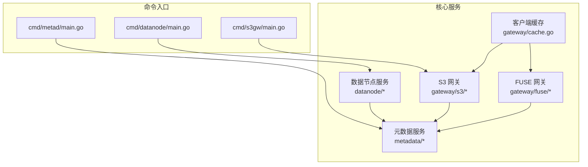
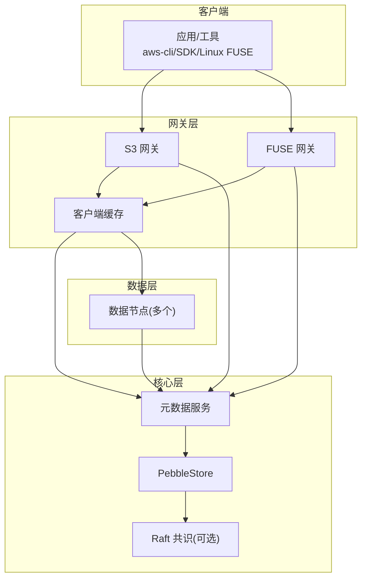
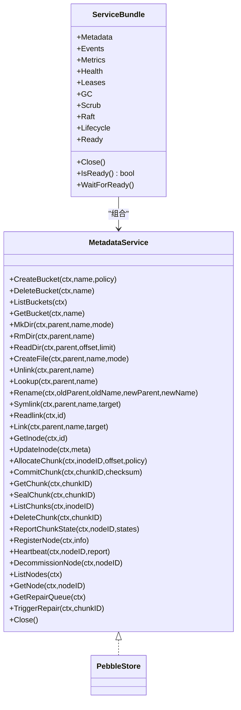
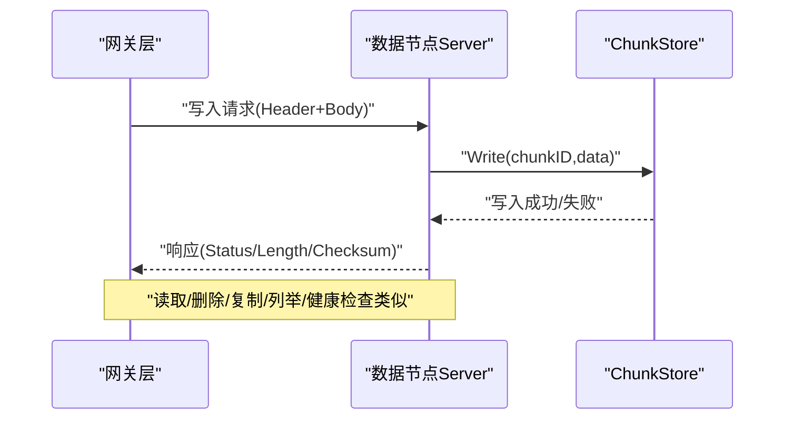
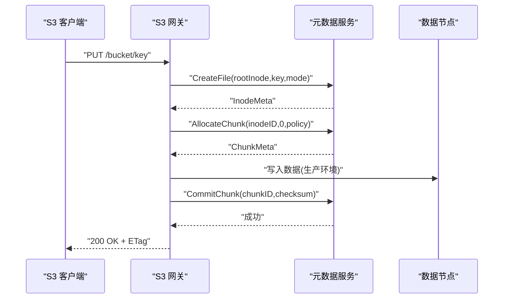
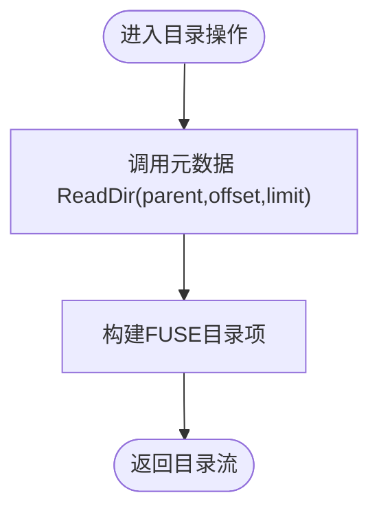
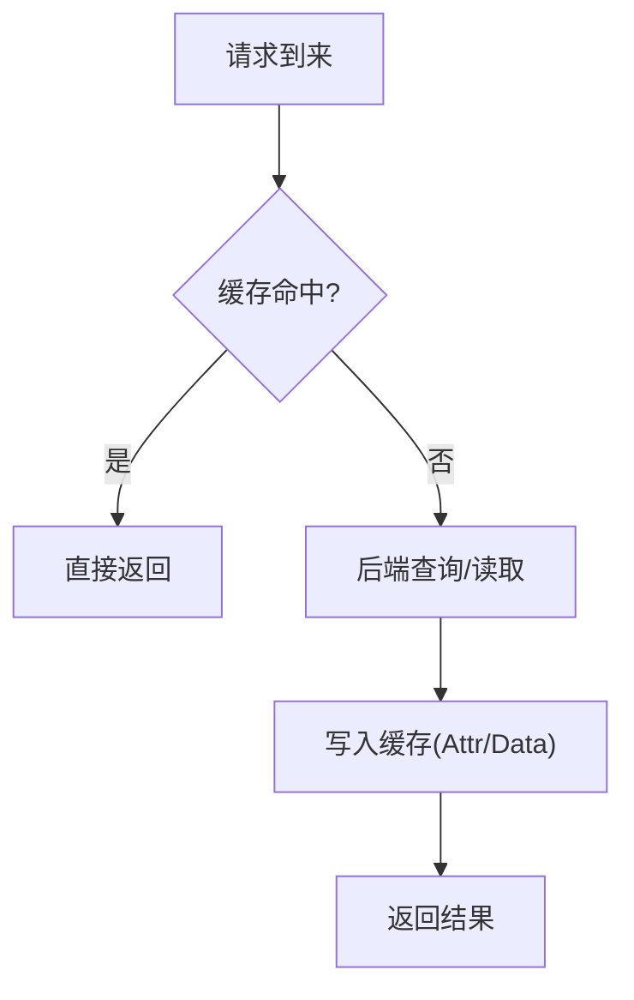
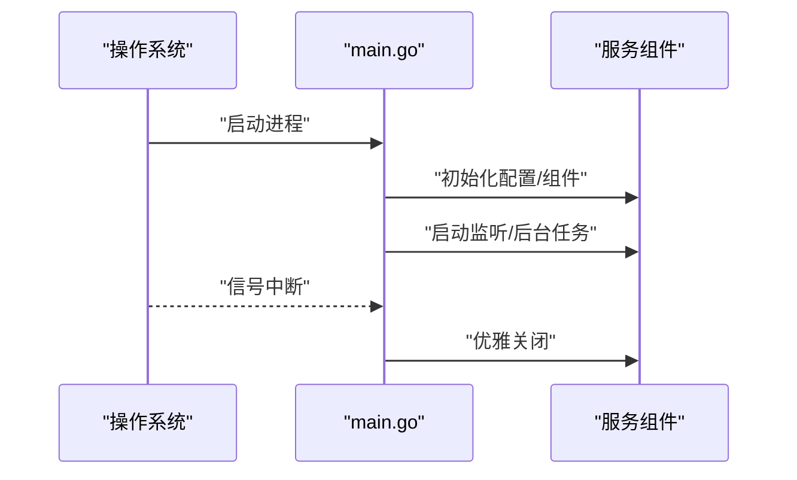
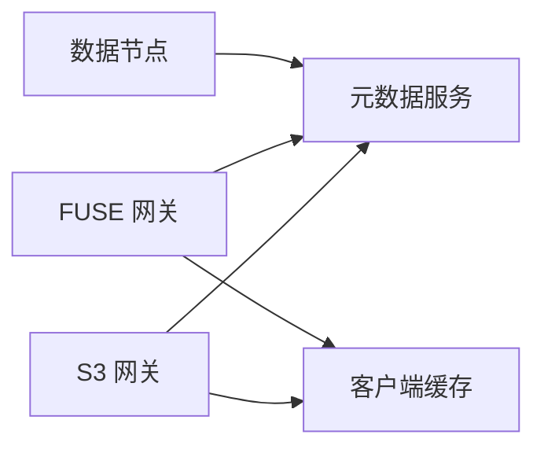

# 核心模块

<cite>
**本文引用的文件**
- [ARCHITECTURE.md](file://nufs-core/ARCHITECTURE.md)
- [go.mod](file://nufs-core/go.mod)
- [metadata/service.go](file://nufs-core/metadata/service.go)
- [metadata/types.go](file://nufs-core/metadata/types.go)
- [datanode/server.go](file://nufs-core/datanode/server.go)
- [datanode/types.go](file://nufs-core/datanode/types.go)
- [datanode/chunkstore.go](file://nufs-core/datanode/chunkstore.go)
- [gateway/cache.go](file://nufs-core/gateway/cache.go)
- [gateway/s3/handler.go](file://nufs-core/gateway/s3/handler.go)
- [gateway/s3/object.go](file://nufs-core/gateway/s3/object.go)
- [gateway/fuse/fs.go](file://nufs-core/gateway/fuse/fs.go)
- [gateway/fuse/dir.go](file://nufs-core/gateway/fuse/dir.go)
- [cmd/metad/main.go](file://nufs-core/cmd/metad/main.go)
- [cmd/datanode/main.go](file://nufs-core/cmd/datanode/main.go)
- [cmd/s3gw/main.go](file://nufs-core/cmd/s3gw/main.go)
</cite>

## 目录
1. [引言](#引言)
2. [项目结构](#项目结构)
3. [核心组件](#核心组件)
4. [架构总览](#架构总览)
5. [详细组件分析](#详细组件分析)
6. [依赖分析](#依赖分析)
7. [性能考虑](#性能考虑)
8. [故障排查指南](#故障排查指南)
9. [结论](#结论)
10. [附录](#附录)

## 引言
本文件面向NUFS分布式文件系统的核心模块，围绕元数据服务、数据节点服务与网关层进行系统化技术文档编写。内容覆盖职责边界、接口设计、内部工作机制、模块间依赖与协作、性能与可靠性考量、错误处理与最佳实践，并提供可视化图示帮助理解。

## 项目结构
- nufs-core：核心代码与命令入口，包含元数据、数据节点、网关与部署脚本。
- nufs-fuse：独立的FUSE挂载客户端（非本文重点，但与网关层存在交互）。

**图表来源**
- [cmd/metad/main.go:1-221](file://nufs-core/cmd/metad/main.go#L1-L221)
- [cmd/datanode/main.go:1-135](file://nufs-core/cmd/datanode/main.go#L1-L135)
- [cmd/s3gw/main.go:1-91](file://nufs-core/cmd/s3gw/main.go#L1-L91)
- [metadata/service.go:1-232](file://nufs-core/metadata/service.go#L1-L232)
- [datanode/server.go:1-462](file://nufs-core/datanode/server.go#L1-L462)
- [gateway/s3/handler.go:1-184](file://nufs-core/gateway/s3/handler.go#L1-L184)
- [gateway/fuse/fs.go:1-128](file://nufs-core/gateway/fuse/fs.go#L1-L128)
- [gateway/cache.go:1-325](file://nufs-core/gateway/cache.go#L1-L325)

**章节来源**
- [ARCHITECTURE.md:1-116](file://nufs-core/ARCHITECTURE.md#L1-L116)
- [go.mod:1-45](file://nufs-core/go.mod#L1-L45)

## 核心组件
- 元数据服务（metadata）：提供统一的元数据接口，封装存储引擎与共识层，支撑命名空间、Inode、Chunk、节点与修复等能力。
- 数据节点服务（datanode）：负责本地Chunk存储、读写、复制、心跳上报与运维接口。
- 网关层（gateway）：S3网关与FUSE网关，前者提供S3兼容REST，后者提供Linux FUSE挂载；二者均通过元数据服务与数据节点协同工作，并内置客户端缓存以提升性能。

**章节来源**
- [metadata/service.go:15-63](file://nufs-core/metadata/service.go#L15-L63)
- [datanode/server.go:18-34](file://nufs-core/datanode/server.go#L18-L34)
- [gateway/s3/handler.go:11-43](file://nufs-core/gateway/s3/handler.go#L11-L43)
- [gateway/fuse/fs.go:17-34](file://nufs-core/gateway/fuse/fs.go#L17-L34)
- [gateway/cache.go:29-56](file://nufs-core/gateway/cache.go#L29-L56)

## 架构总览
下图展示三类组件的职责与交互关系：元数据服务作为中心枢纽，数据节点提供块存储与复制，网关层对外提供S3/FUSE接口并引入客户端缓存。

**图表来源**
- [ARCHITECTURE.md:37-116](file://nufs-core/ARCHITECTURE.md#L37-L116)
- [metadata/service.go:72-89](file://nufs-core/metadata/service.go#L72-L89)
- [datanode/server.go:18-34](file://nufs-core/datanode/server.go#L18-L34)
- [gateway/cache.go:29-56](file://nufs-core/gateway/cache.go#L29-L56)

## 详细组件分析

### 元数据服务（metadata）
- 统一接口：定义了桶、命名空间、Inode、Chunk、集群与修复等完整操作集合，便于上层网关透明使用。
- 生产组合：ServiceBundle将核心元数据服务与事件总线、指标、健康检查、租约、GC、数据清洗、Raft等子系统装配。
- 关键类型：InodeMeta、ChunkMeta、NodeInfo、PlacementPolicy、ReplicaInfo等，支撑命名空间树、Chunk映射与集群拓扑。

**图表来源**
- [metadata/service.go:15-63](file://nufs-core/metadata/service.go#L15-L63)
- [metadata/service.go:72-89](file://nufs-core/metadata/service.go#L72-L89)

**章节来源**
- [metadata/service.go:15-232](file://nufs-core/metadata/service.go#L15-L232)
- [metadata/types.go:30-170](file://nufs-core/metadata/types.go#L30-L170)

### 数据节点服务（datanode）
- TCP协议：统一的长度前缀消息格式，支持写、读、删除、复制、查询、列举与健康检查等请求类型。
- ChunkStore：本地磁盘存储，采用分片目录、二进制头+数据体+校验，支持并发读写信号量控制。
- 服务器与客户端：Server负责接入与分发，Client用于节点间复制调用。
- 运维与复制：心跳上报、复制引擎、链式复制、反熵引擎等保障数据一致性与可用性。

**图表来源**
- [datanode/server.go:102-126](file://nufs-core/datanode/server.go#L102-L126)
- [datanode/chunkstore.go:73-127](file://nufs-core/datanode/chunkstore.go#L73-L127)

**章节来源**
- [datanode/server.go:18-462](file://nufs-core/datanode/server.go#L18-L462)
- [datanode/types.go:14-171](file://nufs-core/datanode/types.go#L14-L171)
- [datanode/chunkstore.go:18-395](file://nufs-core/datanode/chunkstore.go#L18-L395)

### 网关层（gateway）

#### S3 网关
- 路由与中间件：基于标准ServeMux，串联恢复、请求ID、CORS、日志与鉴权中间件。
- 请求处理：实现桶级与对象级操作，如列举、创建、删除、上传、下载、分片、拷贝等。
- 与元数据协作：通过MetadataService完成命名空间与Chunk分配/提交，最终返回S3兼容响应。

**图表来源**
- [gateway/s3/handler.go:70-166](file://nufs-core/gateway/s3/handler.go#L70-L166)
- [gateway/s3/object.go:17-95](file://nufs-core/gateway/s3/object.go#L17-L95)

**章节来源**
- [gateway/s3/handler.go:11-184](file://nufs-core/gateway/s3/handler.go#L11-L184)
- [gateway/s3/object.go:17-318](file://nufs-core/gateway/s3/object.go#L17-L318)

#### FUSE 网关
- 文件系统根：DFSFileSystem作为根Inode，维护元数据InodeID到FUSE Inode的缓存映射。
- 目录与文件操作：通过MetadataService实现Lookup/ReadDir/Mkdir/Rmdir/Create/Unlink/Rename/Symlink/Link等。
- 属性转换：将InodeMeta转换为FUSE Attr，确保权限、时间戳与类型正确。

**图表来源**
- [gateway/fuse/dir.go:36-63](file://nufs-core/gateway/fuse/dir.go#L36-L63)

**章节来源**
- [gateway/fuse/fs.go:17-128](file://nufs-core/gateway/fuse/fs.go#L17-L128)
- [gateway/fuse/dir.go:16-275](file://nufs-core/gateway/fuse/dir.go#L16-L275)

#### 客户端缓存（ClientCache）
- 结构：属性缓存（Attr）、数据缓存（Data）、写缓冲（Write Buffer），分别配置TTL与大小阈值。
- 行为：命中直接返回，未命中从后端拉取并写入缓存；写缓冲按阈值与定时触发异步刷写。
- 回收：LRU策略与容量上限控制，避免内存膨胀。

**图表来源**
- [gateway/cache.go:103-172](file://nufs-core/gateway/cache.go#L103-L172)

**章节来源**
- [gateway/cache.go:17-325](file://nufs-core/gateway/cache.go#L17-L325)

### 命令入口与运行时
- 元数据服务守护进程：初始化PebbleStore，可选启用Raft，装配ServiceBundle并启动运维HTTP API。
- 数据节点守护进程：初始化ChunkStore与磁盘管理，注册节点信息，启动TCP服务、复制引擎、反熵与心跳上报。
- S3网关守护进程：创建PebbleStore，配置凭证，启动HTTP服务并暴露S3兼容接口。

**图表来源**
- [cmd/metad/main.go:21-150](file://nufs-core/cmd/metad/main.go#L21-L150)
- [cmd/datanode/main.go:19-135](file://nufs-core/cmd/datanode/main.go#L19-L135)
- [cmd/s3gw/main.go:18-90](file://nufs-core/cmd/s3gw/main.go#L18-L90)

**章节来源**
- [cmd/metad/main.go:21-221](file://nufs-core/cmd/metad/main.go#L21-L221)
- [cmd/datanode/main.go:19-135](file://nufs-core/cmd/datanode/main.go#L19-L135)
- [cmd/s3gw/main.go:18-91](file://nufs-core/cmd/s3gw/main.go#L18-L91)

## 依赖分析
- 外部依赖：Pebble（KV存储）、Raft（共识）、Raft BoltDB（WAL）、go-fuse（FUSE）、LRU缓存等。
- 模块耦合：网关层依赖元数据服务；数据节点依赖元数据服务进行注册与状态上报；客户端缓存同时服务于S3与FUSE网关。

**图表来源**
- [go.mod:5-44](file://nufs-core/go.mod#L5-L44)
- [metadata/service.go:72-89](file://nufs-core/metadata/service.go#L72-L89)
- [gateway/cache.go:29-56](file://nufs-core/gateway/cache.go#L29-L56)

**章节来源**
- [go.mod:1-45](file://nufs-core/go.mod#L1-L45)

## 性能考虑
- 客户端缓存：Attr缓存5s、Data缓存50s、写缓冲500MB，显著降低后端压力与网络往返。
- 并发控制：数据节点对读写分别设置信号量，避免资源争用导致抖动。
- 存储布局：Chunk按256分片目录分布，避免单目录文件过多；Chunk文件带校验，支持快速校验与定位。
- 一致性与延迟：Raft保证强一致写，MVCC乐观并发控制降低冲突概率；读路径可走任意副本实现最终一致读。

[本节为通用指导，无需特定文件引用]

## 故障排查指南
- 元数据服务
  - 健康检查：通过/health与/ready端点判断服务就绪与健康。
  - 指标查看：/metrics端点输出运行指标快照。
  - 诊断要点：关注租约失效、GC与Scrub运行状态、Raft领导者状态。
- 数据节点
  - 心跳上报：确认节点状态在线、磁盘使用率与Chunk状态正常。
  - 复制与修复：检查复制队列、副本状态与修复任务。
  - 存储问题：校验Chunk文件头魔数、校验和与分片目录完整性。
- 网关层
  - S3网关：确认桶存在、对象存在性、Range解析与ETag计算。
  - FUSE网关：检查目录项读取、权限与时间戳转换是否正确。
  - 客户端缓存：观察命中率、TTL过期与写缓冲刷写频率。

**章节来源**
- [cmd/metad/main.go:152-221](file://nufs-core/cmd/metad/main.go#L152-L221)
- [datanode/server.go:256-271](file://nufs-core/datanode/server.go#L256-L271)
- [gateway/s3/handler.go:56-68](file://nufs-core/gateway/s3/handler.go#L56-L68)
- [gateway/fuse/dir.go:36-63](file://nufs-core/gateway/fuse/dir.go#L36-L63)
- [gateway/cache.go:103-172](file://nufs-core/gateway/cache.go#L103-L172)

## 结论
NUFS核心模块以“元数据服务为中心、数据节点提供块存储与复制、网关层统一对外接口”的架构实现了高可用、高性能的分布式文件系统。通过客户端缓存、并发控制与一致性模型设计，系统在大规模场景下具备良好的扩展性与稳定性。建议在生产环境中启用Raft共识、合理配置缓存参数与复制策略，并持续监控健康检查与指标数据以保障系统稳定运行。

[本节为总结，无需特定文件引用]

## 附录
- 关键配置项（示例）
  - 元数据服务：数据目录、缓存目录、节点ID、内存表大小、Raft开关与地址、租约TTL、GC与Scrub周期等。
  - 数据节点：监听地址、数据目录、元数据地址、机架/可用区、容量、并发读写限制、心跳间隔等。
  - S3网关：监听地址、元数据目录、访问密钥与密钥。
- 使用模式
  - 单机开发：all-in-one容器模式。
  - Docker Compose：小集群部署，包含元数据、数据节点与S3网关。
  - Kubernetes：大规模部署，结合Helm与持久化存储。

**章节来源**
- [cmd/metad/main.go:22-37](file://nufs-core/cmd/metad/main.go#L22-L37)
- [cmd/datanode/main.go:20-29](file://nufs-core/cmd/datanode/main.go#L20-L29)
- [cmd/s3gw/main.go:18-24](file://nufs-core/cmd/s3gw/main.go#L18-L24)
- [ARCHITECTURE.md:765-800](file://nufs-core/ARCHITECTURE.md#L765-L800)