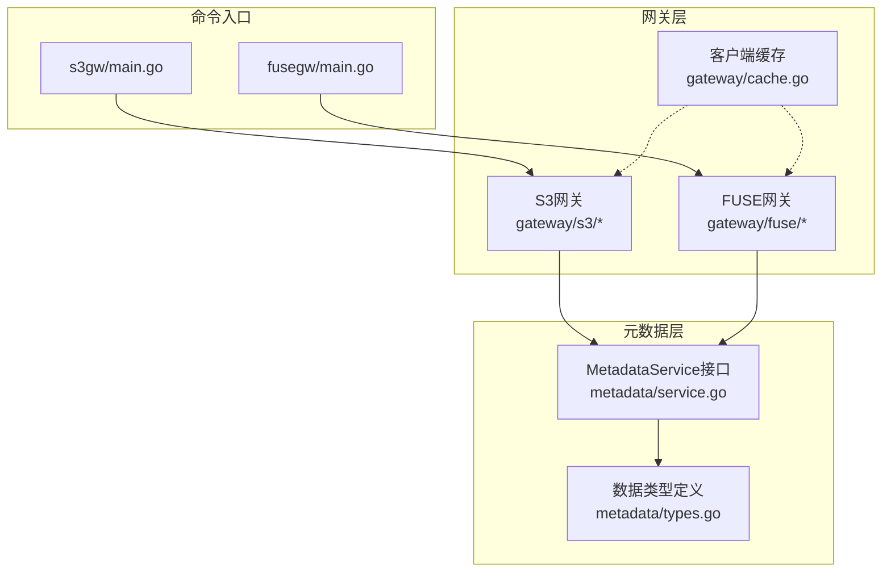
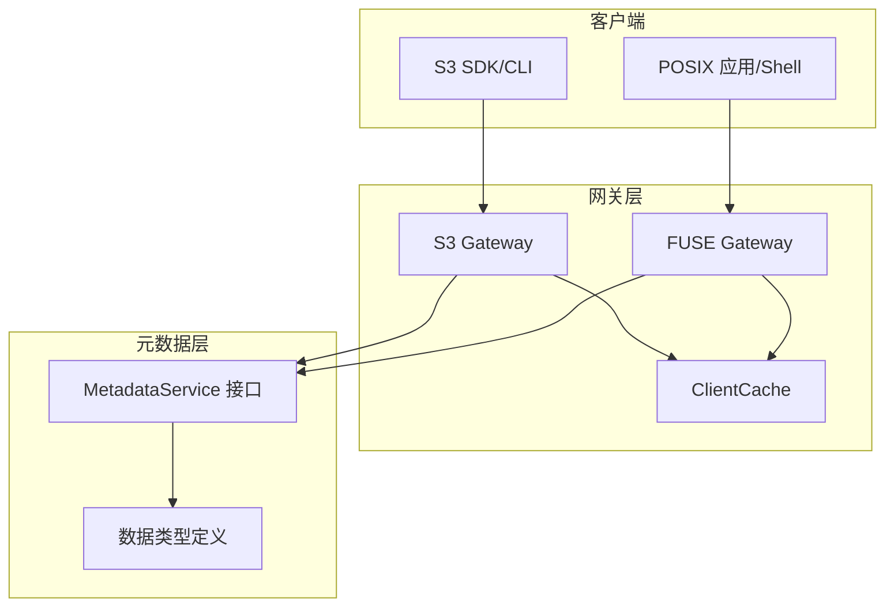
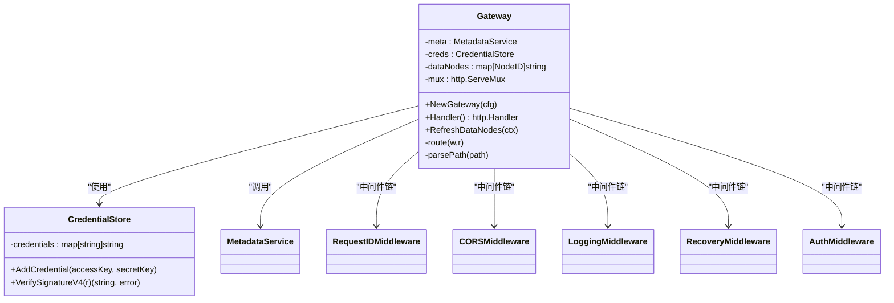
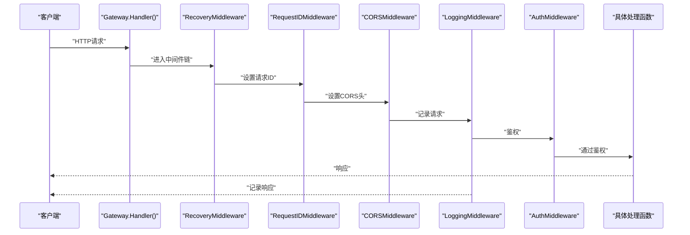
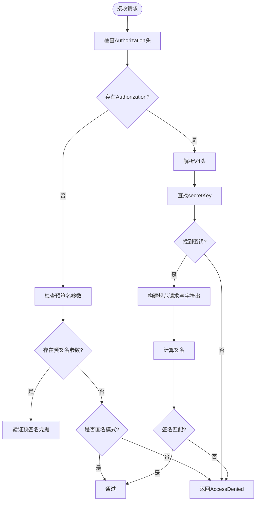
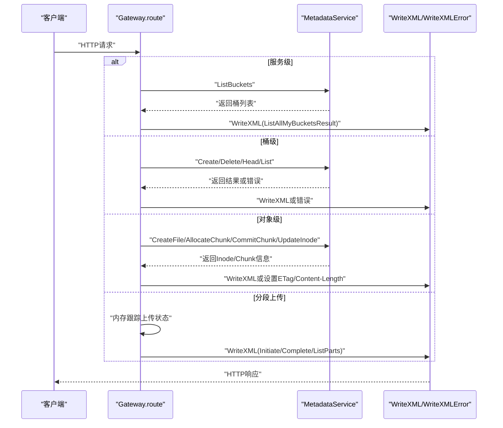
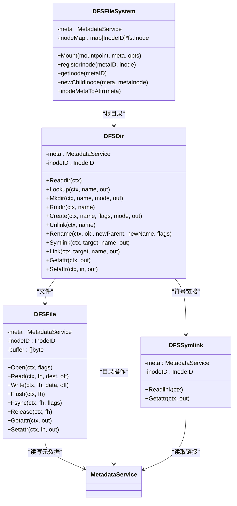
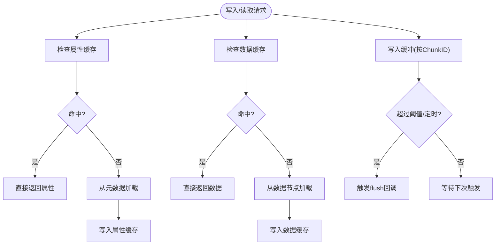
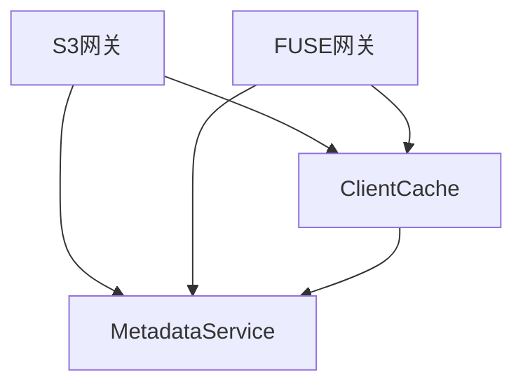
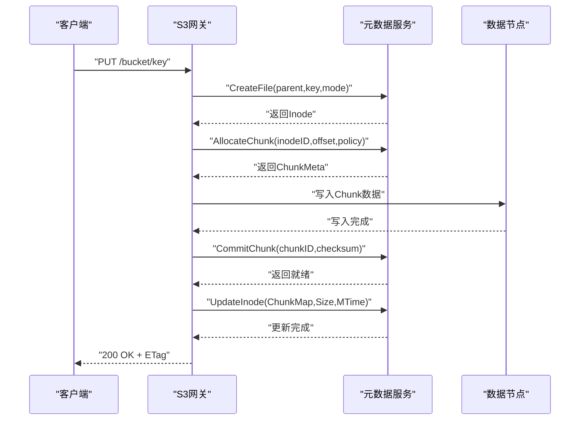

# 网关层实现

<cite>
**本文档引用的文件**
- [nufs-core/gateway/s3/handler.go](file://nufs-core/gateway/s3/handler.go)
- [nufs-core/gateway/s3/middleware.go](file://nufs-core/gateway/s3/middleware.go)
- [nufs-core/gateway/s3/auth.go](file://nufs-core/gateway/s3/auth.go)
- [nufs-core/gateway/s3/bucket.go](file://nufs-core/gateway/s3/bucket.go)
- [nufs-core/gateway/s3/object.go](file://nufs-core/gateway/s3/object.go)
- [nufs-core/gateway/s3/multipart.go](file://nufs-core/gateway/s3/multipart.go)
- [nufs-core/gateway/s3/response.go](file://nufs-core/gateway/s3/response.go)
- [nufs-core/gateway/fuse/fs.go](file://nufs-core/gateway/fuse/fs.go)
- [nufs-core/gateway/fuse/dir.go](file://nufs-core/gateway/fuse/dir.go)
- [nufs-core/gateway/fuse/inode.go](file://nufs-core/gateway/fuse/inode.go)
- [nufs-core/gateway/cache.go](file://nufs-core/gateway/cache.go)
- [nufs-core/cmd/s3gw/main.go](file://nufs-core/cmd/s3gw/main.go)
- [nufs-core/cmd/fusegw/main.go](file://nufs-core/cmd/fusegw/main.go)
- [nufs-core/metadata/service.go](file://nufs-core/metadata/service.go)
- [nufs-core/metadata/types.go](file://nufs-core/metadata/types.go)
- [nufs-core/ARCHITECTURE.md](file://nufs-core/ARCHITECTURE.md)
</cite>

## 目录
1. [简介](#简介)
2. [项目结构](#项目结构)
3. [核心组件](#核心组件)
4. [架构总览](#架构总览)
5. [详细组件分析](#详细组件分析)
6. [依赖分析](#依赖分析)
7. [性能考虑](#性能考虑)
8. [故障排查指南](#故障排查指南)
9. [结论](#结论)
10. [附录](#附录)

## 简介
本文件面向NUFS分布式存储系统的网关层实现，聚焦于S3兼容网关与FUSE文件系统网关的设计与实现细节。内容覆盖：
- S3 API的完整实现（服务级、桶级、对象级、分段上传）
- 认证授权机制（AWS Signature V4与匿名模式）
- 中间件链设计（恢复、请求ID、CORS、日志、鉴权）
- FUSE文件系统的挂载流程、目录与文件操作实现
- 网关配置选项、性能优化与扩展方法
- 与元数据服务的交互模式与数据路由机制

## 项目结构
网关层位于nufs-core/gateway目录，分别包含S3网关与FUSE网关两大模块；命令入口位于nufs-core/cmd目录。

**图表来源**
- [nufs-core/cmd/s3gw/main.go:18-90](file://nufs-core/cmd/s3gw/main.go#L18-L90)
- [nufs-core/cmd/fusegw/main.go:17-62](file://nufs-core/cmd/fusegw/main.go#L17-L62)
- [nufs-core/gateway/s3/handler.go:11-43](file://nufs-core/gateway/s3/handler.go#L11-L43)
- [nufs-core/gateway/fuse/fs.go:17-56](file://nufs-core/gateway/fuse/fs.go#L17-L56)
- [nufs-core/gateway/cache.go:29-96](file://nufs-core/gateway/cache.go#L29-L96)
- [nufs-core/metadata/service.go:19-67](file://nufs-core/metadata/service.go#L19-L67)

**章节来源**
- [nufs-core/cmd/s3gw/main.go:18-90](file://nufs-core/cmd/s3gw/main.go#L18-L90)
- [nufs-core/cmd/fusegw/main.go:17-62](file://nufs-core/cmd/fusegw/main.go#L17-L62)
- [nufs-core/gateway/s3/handler.go:11-43](file://nufs-core/gateway/s3/handler.go#L11-L43)
- [nufs-core/gateway/fuse/fs.go:17-56](file://nufs-core/gateway/fuse/fs.go#L17-L56)
- [nufs-core/gateway/cache.go:29-96](file://nufs-core/gateway/cache.go#L29-L96)
- [nufs-core/metadata/service.go:19-67](file://nufs-core/metadata/service.go#L19-L67)

## 核心组件
- S3网关：HTTP处理器，负责路由、鉴权、中间件链、S3 API实现与XML响应封装。
- FUSE网关：基于go-fuse的Linux文件系统网关，提供目录、文件、符号链接等操作。
- 客户端缓存：通用的属性缓存、数据缓存与写缓冲，提升读写性能。
- 元数据服务：统一的MetadataService接口，抽象命名空间、Inode、Chunk、集群节点等操作。

**章节来源**
- [nufs-core/gateway/s3/handler.go:11-43](file://nufs-core/gateway/s3/handler.go#L11-L43)
- [nufs-core/gateway/fuse/fs.go:17-56](file://nufs-core/gateway/fuse/fs.go#L17-L56)
- [nufs-core/gateway/cache.go:29-96](file://nufs-core/gateway/cache.go#L29-L96)
- [nufs-core/metadata/service.go:19-67](file://nufs-core/metadata/service.go#L19-L67)

## 架构总览
S3与FUSE网关均通过MetadataService与元数据层交互，遵循统一的数据模型与接口契约。S3网关以HTTP形式暴露S3 API，FUSE网关以POSIX文件系统形式对外提供文件操作。

**图表来源**
- [nufs-core/ARCHITECTURE.md:288-344](file://nufs-core/ARCHITECTURE.md#L288-L344)
- [nufs-core/gateway/s3/handler.go:11-43](file://nufs-core/gateway/s3/handler.go#L11-L43)
- [nufs-core/gateway/fuse/fs.go:17-56](file://nufs-core/gateway/fuse/fs.go#L17-L56)
- [nufs-core/gateway/cache.go:29-96](file://nufs-core/gateway/cache.go#L29-L96)
- [nufs-core/metadata/service.go:19-67](file://nufs-core/metadata/service.go#L19-L67)

## 详细组件分析

### S3网关

#### 设计与职责
- HTTP路由与分发：根据URL路径与HTTP方法分派到具体处理函数。
- 中间件链：统一处理请求ID、CORS、日志、恢复与鉴权。
- S3 API实现：覆盖服务级、桶级、对象级与分段上传。
- 响应封装：统一的XML错误与成功响应格式。

**图表来源**
- [nufs-core/gateway/s3/handler.go:11-43](file://nufs-core/gateway/s3/handler.go#L11-L43)
- [nufs-core/gateway/s3/auth.go:14-29](file://nufs-core/gateway/s3/auth.go#L14-L29)
- [nufs-core/gateway/s3/middleware.go:13-93](file://nufs-core/gateway/s3/middleware.go#L13-L93)

**章节来源**
- [nufs-core/gateway/s3/handler.go:11-43](file://nufs-core/gateway/s3/handler.go#L11-L43)
- [nufs-core/gateway/s3/middleware.go:13-93](file://nufs-core/gateway/s3/middleware.go#L13-L93)
- [nufs-core/gateway/s3/auth.go:14-29](file://nufs-core/gateway/s3/auth.go#L14-L29)

#### 中间件链设计
- 请求ID中间件：为每个请求生成唯一x-amz-request-id。
- CORS中间件：设置允许的源、方法、头部与预检处理。
- 日志中间件：记录方法、路径、状态码、耗时与远端地址。
- 恢复中间件：捕获panic并返回内部错误。
- 鉴权中间件：验证AWS Signature V4或匿名模式。

**图表来源**
- [nufs-core/gateway/s3/middleware.go:13-93](file://nufs-core/gateway/s3/middleware.go#L13-L93)
- [nufs-core/gateway/s3/handler.go:46-54](file://nufs-core/gateway/s3/handler.go#L46-L54)

**章节来源**
- [nufs-core/gateway/s3/middleware.go:13-93](file://nufs-core/gateway/s3/middleware.go#L13-L93)

#### 认证与授权
- 凭证存储：支持添加访问密钥/秘密密钥对，或匿名模式。
- AWS Signature V4：解析Authorization头，构建规范请求，计算签名并与期望值比对。
- 预签名URL：简化校验，验证凭据存在性。
- 未知/无效凭据：返回AccessDenied错误。

**图表来源**
- [nufs-core/gateway/s3/auth.go:31-98](file://nufs-core/gateway/s3/auth.go#L31-L98)

**章节来源**
- [nufs-core/gateway/s3/auth.go:31-98](file://nufs-core/gateway/s3/auth.go#L31-L98)

#### S3 API实现概览
- 服务级：列出桶（ListBuckets）。
- 桶级：创建桶（CreateBucket）、删除桶（DeleteBucket）、HEAD桶（HeadBucket）、列举对象（ListObjects）。
- 对象级：PUT/GET/DELETE/HEAD对象、复制对象（CopyObject）。
- 分段上传：初始化（InitiateMultipartUpload）、上传分段（UploadPart）、完成（CompleteMultipartUpload）、取消（AbortMultipartUpload）、列举分段（ListParts）与活动上传（ListMultipartUploads）。

**图表来源**
- [nufs-core/gateway/s3/handler.go:70-166](file://nufs-core/gateway/s3/handler.go#L70-L166)
- [nufs-core/gateway/s3/bucket.go:11-34](file://nufs-core/gateway/s3/bucket.go#L11-L34)
- [nufs-core/gateway/s3/object.go:17-95](file://nufs-core/gateway/s3/object.go#L17-L95)
- [nufs-core/gateway/s3/multipart.go:85-203](file://nufs-core/gateway/s3/multipart.go#L85-L203)

**章节来源**
- [nufs-core/gateway/s3/handler.go:70-166](file://nufs-core/gateway/s3/handler.go#L70-L166)
- [nufs-core/gateway/s3/bucket.go:11-34](file://nufs-core/gateway/s3/bucket.go#L11-L34)
- [nufs-core/gateway/s3/object.go:17-95](file://nufs-core/gateway/s3/object.go#L17-L95)
- [nufs-core/gateway/s3/multipart.go:85-203](file://nufs-core/gateway/s3/multipart.go#L85-L203)

#### 响应与错误处理
- 成功响应：统一使用WriteXML输出S3风格XML。
- 错误响应：WriteXMLError输出标准错误结构，并设置x-amz-request-id。
- 错误码映射：根据S3错误码映射到HTTP状态码。

**章节来源**
- [nufs-core/gateway/s3/response.go:13-216](file://nufs-core/gateway/s3/response.go#L13-L216)

### FUSE网关

#### 设计与职责
- 根文件系统：DFSFileSystem作为根Inode，维护元数据InodeID到FUSE Inode的缓存。
- 挂载流程：Mount在指定挂载点创建根节点并启动FUSE服务器。
- 目录操作：Readdir、Lookup、Mkdir、Rmdir、Create、Unlink、Rename、Symlink、Link、Getattr/Setattr。
- 文件操作：Open/Read/Write/Flush/Fsync/Release与Getattr/Setattr。
- 符号链接：Readlink与Getattr。

**图表来源**
- [nufs-core/gateway/fuse/fs.go:17-122](file://nufs-core/gateway/fuse/fs.go#L17-L122)
- [nufs-core/gateway/fuse/dir.go:16-275](file://nufs-core/gateway/fuse/dir.go#L16-L275)
- [nufs-core/gateway/fuse/inode.go:19-231](file://nufs-core/gateway/fuse/inode.go#L19-L231)

**章节来源**
- [nufs-core/gateway/fuse/fs.go:17-122](file://nufs-core/gateway/fuse/fs.go#L17-L122)
- [nufs-core/gateway/fuse/dir.go:16-275](file://nufs-core/gateway/fuse/dir.go#L16-L275)
- [nufs-core/gateway/fuse/inode.go:19-231](file://nufs-core/gateway/fuse/inode.go#L19-L231)

#### 挂载流程与目录操作
- 挂载：创建DFSFileSystem根节点，使用go-fuse挂载到指定路径。
- 目录遍历：ReadDir调用元数据服务读取目录条目并转换为FUSE目录项。
- 查找与创建：Lookup/Create通过元数据服务定位或创建子项。
- 重命名与链接：Rename、Symlink、Link委托给元数据服务。
- 属性与权限：Getattr/Setattr将InodeMeta转换为fuse.Attr并支持修改。

**章节来源**
- [nufs-core/gateway/fuse/fs.go:36-71](file://nufs-core/gateway/fuse/fs.go#L36-L71)
- [nufs-core/gateway/fuse/dir.go:36-275](file://nufs-core/gateway/fuse/dir.go#L36-L275)

#### 文件读写与缓存
- 写缓冲：DFSFile在用户态维护写缓冲，Flush时更新Inode大小并持久化。
- 读取：Read根据偏移与长度返回数据（示例实现返回零填充数据，生产环境需从数据节点读取）。
- 同步：Fsync与Release触发Flush，确保数据落盘。

**章节来源**
- [nufs-core/gateway/fuse/inode.go:46-131](file://nufs-core/gateway/fuse/inode.go#L46-L131)

### 客户端缓存（ClientCache）
- 属性缓存：InodeMeta缓存，带TTL，支持LRU淘汰。
- 数据缓存：按chunkKey缓存数据块，带较长TTL。
- 写缓冲：按ChunkID聚合脏数据，超过阈值或定时触发刷写。
- 后台刷新：定期或显式触发flush回调，将脏数据写回后端。

**图表来源**
- [nufs-core/gateway/cache.go:103-186](file://nufs-core/gateway/cache.go#L103-L186)
- [nufs-core/gateway/cache.go:225-260](file://nufs-core/gateway/cache.go#L225-L260)

**章节来源**
- [nufs-core/gateway/cache.go:29-96](file://nufs-core/gateway/cache.go#L29-L96)
- [nufs-core/gateway/cache.go:103-186](file://nufs-core/gateway/cache.go#L103-L186)
- [nufs-core/gateway/cache.go:225-260](file://nufs-core/gateway/cache.go#L225-L260)

### 元数据服务与数据模型
- MetadataService接口：统一抽象桶、命名空间、Inode、Chunk、集群节点与生命周期管理等操作。
- 数据类型：InodeMeta、DirEntry、BucketInfo、ChunkMeta、NodeInfo等，支撑S3与FUSE语义。

**章节来源**
- [nufs-core/metadata/service.go:19-67](file://nufs-core/metadata/service.go#L19-L67)
- [nufs-core/metadata/types.go:30-88](file://nufs-core/metadata/types.go#L30-L88)

## 依赖分析
- S3网关依赖MetadataService进行桶与对象的元数据操作，依赖go-fuse中间件链进行鉴权与日志。
- FUSE网关依赖go-fuse库实现文件系统接口，依赖MetadataService进行目录与文件元数据操作。
- 客户端缓存作为通用组件，可被S3与FUSE网关复用以提升性能。

**图表来源**
- [nufs-core/gateway/s3/handler.go:11-43](file://nufs-core/gateway/s3/handler.go#L11-L43)
- [nufs-core/gateway/fuse/fs.go:17-56](file://nufs-core/gateway/fuse/fs.go#L17-L56)
- [nufs-core/gateway/cache.go:29-96](file://nufs-core/gateway/cache.go#L29-L96)

**章节来源**
- [nufs-core/gateway/s3/handler.go:11-43](file://nufs-core/gateway/s3/handler.go#L11-L43)
- [nufs-core/gateway/fuse/fs.go:17-56](file://nufs-core/gateway/fuse/fs.go#L17-L56)
- [nufs-core/gateway/cache.go:29-96](file://nufs-core/gateway/cache.go#L29-L96)

## 性能考虑
- 中间件链顺序：恢复中间件在外层，确保异常被兜底；随后设置请求ID/CORS，最后鉴权与日志，兼顾安全与可观测性。
- 客户端缓存：属性缓存TTL短（降低一致性成本），数据缓存TTL长（提升热数据命中率）；写缓冲阈值与定时刷新平衡吞吐与延迟。
- FUSE读写：示例实现返回零填充数据，生产需从数据节点读取并结合缓存；写缓冲与异步刷写降低写放大。
- 元数据访问：批量读取目录条目、按需查询Inode与Chunk，避免不必要的网络往返。

[本节为通用指导，不直接分析具体文件]

## 故障排查指南
- S3错误响应：通过WriteXMLError输出标准错误结构，包含Code、Message、Resource与x-amz-request-id，便于定位问题。
- 中间件异常：RecoveryMiddleware捕获panic并返回InternalError，结合LoggingMiddleware记录请求详情。
- 鉴权失败：AuthMiddleware在凭证缺失或签名不匹配时返回AccessDenied，检查Authorization头或预签名参数。
- FUSE挂载失败：检查挂载点是否存在、权限与go-fuse依赖；查看fusegw日志输出。

**章节来源**
- [nufs-core/gateway/s3/response.go:154-183](file://nufs-core/gateway/s3/response.go#L154-L183)
- [nufs-core/gateway/s3/middleware.go:72-84](file://nufs-core/gateway/s3/middleware.go#L72-L84)
- [nufs-core/gateway/s3/auth.go:58-70](file://nufs-core/gateway/s3/auth.go#L58-L70)
- [nufs-core/cmd/fusegw/main.go:27-48](file://nufs-core/cmd/fusegw/main.go#L27-L48)

## 结论
NUFS网关层通过清晰的模块划分与统一的MetadataService接口，实现了S3兼容API与POSIX文件系统双入口。S3网关采用中间件链保障安全性与可观测性，FUSE网关提供高效的目录与文件操作。配合客户端缓存与可扩展的元数据模型，系统在性能、一致性与易用性之间取得良好平衡。

[本节为总结性内容，不直接分析具体文件]

## 附录

### S3网关配置选项
- 监听地址：-listen，默认":8080"
- 元数据目录：-meta-dir，默认"/var/lib/dfs/metadata"
- 访问密钥：-access-key，为空表示匿名模式
- 密钥：-secret-key，与访问密钥配合启用鉴权

**章节来源**
- [nufs-core/cmd/s3gw/main.go:18-46](file://nufs-core/cmd/s3gw/main.go#L18-L46)

### FUSE网关配置选项
- 挂载点：-mount，默认"/mnt/dfs"
- 元数据目录：-meta-dir，默认"/var/lib/dfs/metadata"

**章节来源**
- [nufs-core/cmd/fusegw/main.go:17-41](file://nufs-core/cmd/fusegw/main.go#L17-L41)

### 关键流程时序图（S3写入）

**图表来源**
- [nufs-core/gateway/s3/object.go:17-95](file://nufs-core/gateway/s3/object.go#L17-L95)
- [nufs-core/ARCHITECTURE.md:349-376](file://nufs-core/ARCHITECTURE.md#L349-L376)