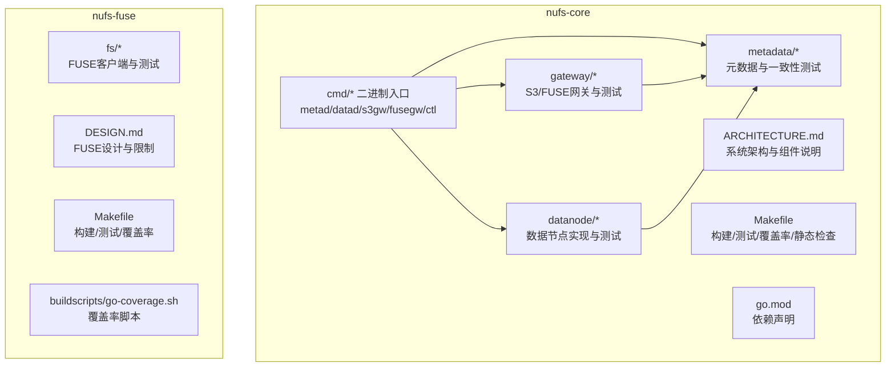
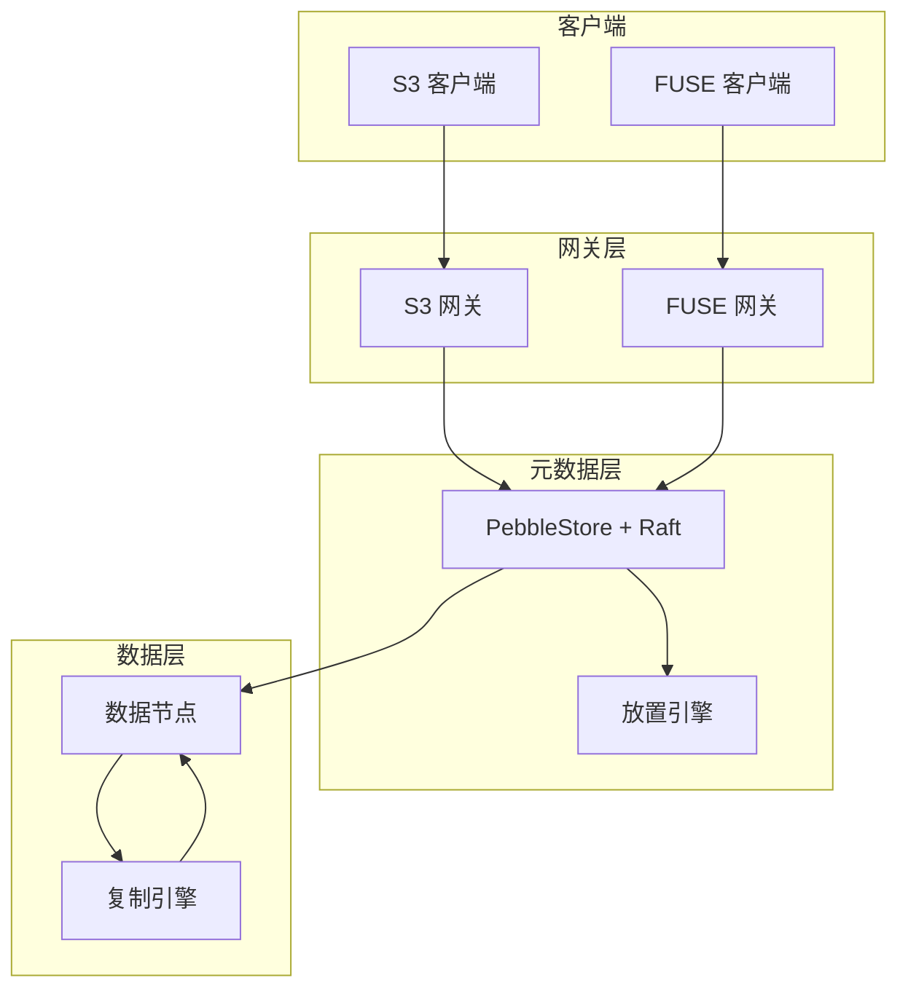
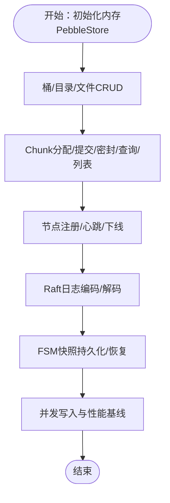
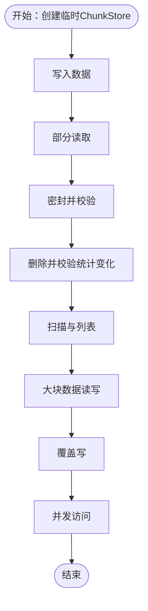
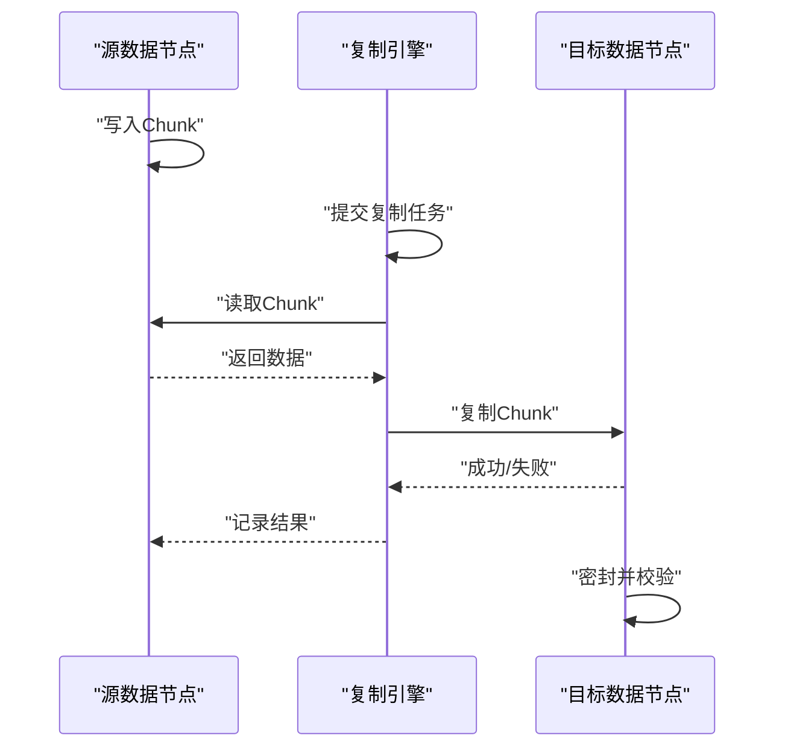
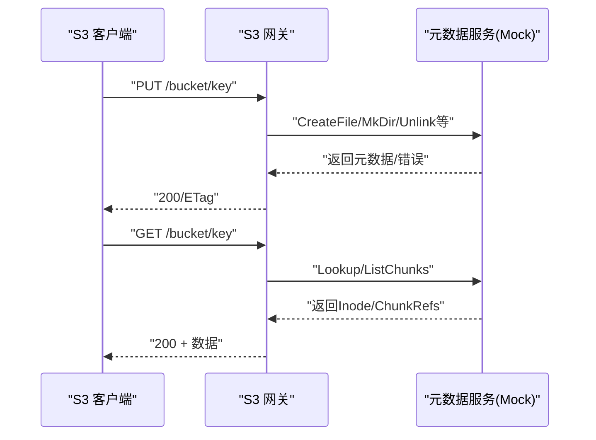
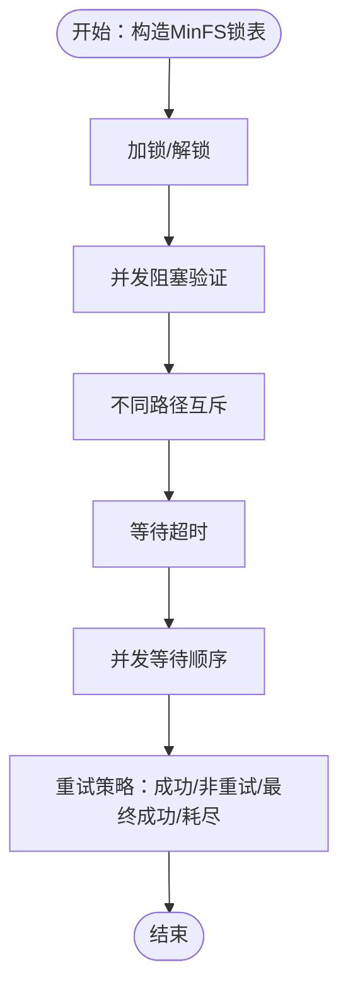
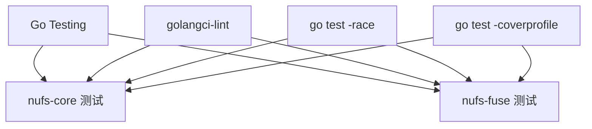

# 测试策略

<cite>
**本文引用的文件**
- [nufs-core/go.mod](file://nufs-core/go.mod)
- [nufs-core/Makefile](file://nufs-core/Makefile)
- [nufs-core/ARCHITECTURE.md](file://nufs-core/ARCHITECTURE.md)
- [nufs-core/datanode/chunkstore_test.go](file://nufs-core/datanode/chunkstore_test.go)
- [nufs-core/datanode/replicator_test.go](file://nufs-core/datanode/replicator_test.go)
- [nufs-core/gateway/s3/handler_test.go](file://nufs-core/gateway/s3/handler_test.go)
- [nufs-core/metadata/pebble_store_test.go](file://nufs-core/metadata/pebble_store_test.go)
- [nufs-core/metadata/placement_test.go](file://nufs-core/metadata/placement_test.go)
- [nufs-core/metadata/ec_test.go](file://nufs-core/metadata/ec_test.go)
- [nufs-core/gateway/fuse/fuse_test.go](file://nufs-core/gateway/fuse/fuse_test.go)
- [nufs-fuse/fs/lock_test.go](file://nufs-fuse/fs/lock_test.go)
- [nufs-fuse/fs/retry_test.go](file://nufs-fuse/fs/retry_test.go)
- [nufs-fuse/DESIGN.md](file://nufs-fuse/DESIGN.md)
- [nufs-fuse/Makefile](file://nufs-fuse/Makefile)
- [nufs-fuse/buildscripts/go-coverage.sh](file://nufs-fuse/buildscripts/go-coverage.sh)
</cite>

## 目录
1. [引言](#引言)
2. [项目结构](#项目结构)
3. [核心组件](#核心组件)
4. [架构总览](#架构总览)
5. [详细组件分析](#详细组件分析)
6. [依赖分析](#依赖分析)
7. [性能考虑](#性能考虑)
8. [故障排查指南](#故障排查指南)
9. [结论](#结论)
10. [附录](#附录)

## 引言
本测试策略文档面向NUFS分布式文件系统的质量保障与自动化测试，覆盖单元测试、集成测试、性能测试与压力测试。文档基于仓库现有测试实现与架构说明，明确测试框架选择、测试用例设计原则、测试数据准备、自动化流程与覆盖率要求，并给出功能测试、回归测试、性能测试与安全测试的最佳实践与工具使用建议。

## 项目结构
NUFS由两大部分组成：
- nufs-core：分布式文件系统核心（元数据、数据节点、网关等）
- nufs-fuse：FUSE挂载客户端（POSIX兼容）

测试分布于各模块的_test.go文件中，配合顶层Makefile提供统一的构建、测试、覆盖率与静态检查命令；nufs-fuse另提供独立的覆盖率脚本。

**图表来源**
- [nufs-core/ARCHITECTURE.md:1-120](file://nufs-core/ARCHITECTURE.md#L1-L120)
- [nufs-core/Makefile:1-76](file://nufs-core/Makefile#L1-L76)
- [nufs-fuse/Makefile:1-58](file://nufs-fuse/Makefile#L1-L58)

**章节来源**
- [nufs-core/ARCHITECTURE.md:1-120](file://nufs-core/ARCHITECTURE.md#L1-L120)
- [nufs-core/Makefile:1-76](file://nufs-core/Makefile#L1-L76)
- [nufs-fuse/Makefile:1-58](file://nufs-fuse/Makefile#L1-L58)

## 核心组件
- 元数据层（metadata）：提供命名空间、Inode/Chunk映射、节点管理、Raft一致性与快照恢复等能力。测试覆盖桶/目录/文件操作、Chunk生命周期、节点管理、Raft日志编码与FSM快照恢复、并发写入等。
- 数据层（datanode）：提供Chunk存储、读写、校验、删除、扫描、复制与修复等能力。测试覆盖Chunk文件格式、部分读、密封与校验、并发访问、复制与重试、关闭清理、队列满等。
- 网关层（gateway）：S3兼容REST API与FUSE挂载接口。测试覆盖桶/对象CRUD、分块上传、CORS、错误码、属性转换与路径解析等。
- FUSE客户端（nufs-fuse）：POSIX挂载与锁、重试策略等。测试覆盖锁机制、等待超时、并发等待顺序、网络错误重试与HTTP状态码重试判定。

**章节来源**
- [nufs-core/metadata/pebble_store_test.go:31-485](file://nufs-core/metadata/pebble_store_test.go#L31-L485)
- [nufs-core/datanode/chunkstore_test.go:43-472](file://nufs-core/datanode/chunkstore_test.go#L43-L472)
- [nufs-core/datanode/replicator_test.go:31-281](file://nufs-core/datanode/replicator_test.go#L31-L281)
- [nufs-core/gateway/s3/handler_test.go:375-800](file://nufs-core/gateway/s3/handler_test.go#L375-L800)
- [nufs-core/gateway/fuse/fuse_test.go:13-148](file://nufs-core/gateway/fuse/fuse_test.go#L13-L148)
- [nufs-fuse/fs/lock_test.go:25-143](file://nufs-fuse/fs/lock_test.go#L25-L143)
- [nufs-fuse/fs/retry_test.go:19-124](file://nufs-fuse/fs/retry_test.go#L19-L124)

## 架构总览
下图展示测试覆盖的关键组件与交互关系，体现从网关到元数据再到数据节点的数据通路，以及复制与修复流程。

**图表来源**
- [nufs-core/ARCHITECTURE.md:288-436](file://nufs-core/ARCHITECTURE.md#L288-L436)

## 详细组件分析

### 元数据层测试策略
- 测试目标
  - 桶/目录/文件操作的正确性与边界条件
  - Chunk分配、提交、密封、查询与列表
  - 节点注册、心跳、下线与扫描
  - Raft日志编码/解码与FSM快照持久化/恢复
  - 并发写入一致性与性能基线
- 关键测试用例
  - 桶CRUD、目录读写、文件CRUD、重命名、软硬链接
  - Chunk生命周期：Allocate/Commit/Seal/Get/List/Delete
  - 节点管理：注册/心跳/下线/查询
  - Raft日志编码与FSM快照恢复
  - 并发写入与10K写性能基线
- 数据准备
  - 使用内存PebbleStore进行隔离测试，避免磁盘副作用
  - 注册多个节点以验证拓扑与容量过滤
- 覆盖率
  - 使用go test -coverprofile生成覆盖率报告，结合CI阈值

**图表来源**
- [nufs-core/metadata/pebble_store_test.go:31-485](file://nufs-core/metadata/pebble_store_test.go#L31-L485)

**章节来源**
- [nufs-core/metadata/pebble_store_test.go:31-485](file://nufs-core/metadata/pebble_store_test.go#L31-L485)

### 数据层测试策略
- 测试目标
  - Chunk文件格式、读写、部分读、密封与校验
  - 删除、统计、扫描与覆盖写
  - 并发访问一致性
- 关键测试用例
  - 创建分片目录、写读全量/部分、越界读裁剪
  - 密封后状态与校验和一致性
  - 删除存在性与统计变更
  - 列表与扫描、大块数据、覆盖写
  - 并发写读一致性
- 数据准备
  - 临时目录作为ChunkStore根目录，确保隔离
- 覆盖率
  - 使用go test -coverprofile生成覆盖率报告

**图表来源**
- [nufs-core/datanode/chunkstore_test.go:43-472](file://nufs-core/datanode/chunkstore_test.go#L43-L472)

**章节来源**
- [nufs-core/datanode/chunkstore_test.go:43-472](file://nufs-core/datanode/chunkstore_test.go#L43-L472)

### 复制与修复测试策略
- 测试目标
  - 基础复制、多目标复制、失败重试、修复流程、优雅关闭、队列满
- 关键测试用例
  - 源/目标服务器启动、写入源Chunk、提交复制任务、等待完成、目标读取校验
  - 多目标复制与自复制跳过
  - 对无效地址复制的指数退避重试
  - 修复：从存活源复制到新目标
  - 关闭清理：提交任务后立即Stop不阻塞
  - 队列满：达到容量后提交失败
- 数据准备
  - 临时目录+随机端口启动两个以上Server实例
- 覆盖率
  - 使用go test -coverprofile生成覆盖率报告

**图表来源**
- [nufs-core/datanode/replicator_test.go:31-148](file://nufs-core/datanode/replicator_test.go#L31-L148)

**章节来源**
- [nufs-core/datanode/replicator_test.go:31-148](file://nufs-core/datanode/replicator_test.go#L31-L148)

### S3网关测试策略
- 测试目标
  - 桶/对象CRUD、Head/Get/Delete、分块上传/列举/完成/中止
  - CORS与错误码
- 关键测试用例
  - 列举空桶、创建/删除桶、Head不存在桶
  - Put/Head/Get/删除对象、删除不存在对象
  - 列举对象、分块上传初始化/上传/列举/完成/中止
  - CORS响应头
- 数据准备
  - 使用httptest.NewServer启动网关处理器，注入Mock元数据服务
- 覆盖率
  - 使用go test -coverprofile生成覆盖率报告

**图表来源**
- [nufs-core/gateway/s3/handler_test.go:375-787](file://nufs-core/gateway/s3/handler_test.go#L375-L787)

**章节来源**
- [nufs-core/gateway/s3/handler_test.go:375-787](file://nufs-core/gateway/s3/handler_test.go#L375-L787)

### FUSE网关与客户端测试策略
- 测试目标
  - Inode元信息到属性的转换、路径解析、锁机制、等待超时、并发等待顺序、网络错误重试与HTTP状态码重试判定
- 关键测试用例
  - InodeMeta到Attr转换（文件/目录/符号链接）
  - 路径解析：根/桶/键解析
  - 锁：加锁/解锁、并发阻塞、不同路径互斥、等待超时
  - 并发等待顺序
  - 重试：成功/非重试错误/最终成功/耗尽、网络错误/HTTP 5xx/4xx判定
- 数据准备
  - 使用内存结构体模拟MinFS锁表
- 覆盖率
  - 使用go test -coverprofile生成覆盖率报告

**图表来源**
- [nufs-core/gateway/fuse/fuse_test.go:13-148](file://nufs-core/gateway/fuse/fuse_test.go#L13-L148)
- [nufs-fuse/fs/lock_test.go:25-143](file://nufs-fuse/fs/lock_test.go#L25-L143)
- [nufs-fuse/fs/retry_test.go:19-124](file://nufs-fuse/fs/retry_test.go#L19-L124)

**章节来源**
- [nufs-core/gateway/fuse/fuse_test.go:13-148](file://nufs-core/gateway/fuse/fuse_test.go#L13-L148)
- [nufs-fuse/fs/lock_test.go:25-143](file://nufs-fuse/fs/lock_test.go#L25-L143)
- [nufs-fuse/fs/retry_test.go:19-124](file://nufs-fuse/fs/retry_test.go#L19-L124)

### 纠删码测试策略
- 测试目标
  - 基本编码/校验、全部可用解码、缺失数据解码、碎片不足错误、GF乘法/逆元、大数据块解码
- 关键测试用例
  - 编码输出分片数量、奇偶校验验证
  - 全部分片可用解码还原
  - 缺失数据/奇偶校验解码还原
  - 碎片不足导致解码失败
  - GF乘法/逆元正确性
  - 大数据块编码/解码
- 数据准备
  - 随机/固定模式数据构造
- 覆盖率
  - 使用go test -coverprofile生成覆盖率报告

**章节来源**
- [nufs-core/metadata/ec_test.go:8-225](file://nufs-core/metadata/ec_test.go#L8-L225)

## 依赖分析
- 测试框架与工具
  - Go原生testing包用于单元测试
  - go test -race启用竞态检测
  - go test -coverprofile生成覆盖率
  - golangci-lint用于静态检查
- 外部依赖
  - 元数据层使用hashicorp/raft与pebble存储
  - 网关层使用hanwen/go-fuse/v2与标准net/http
  - FUSE客户端使用bazil.org/fuse与minio客户端库

**图表来源**
- [nufs-core/Makefile:33-52](file://nufs-core/Makefile#L33-L52)
- [nufs-fuse/Makefile:25-28](file://nufs-fuse/Makefile#L25-L28)
- [nufs-core/go.mod:5-44](file://nufs-core/go.mod#L5-L44)

**章节来源**
- [nufs-core/Makefile:33-52](file://nufs-core/Makefile#L33-L52)
- [nufs-fuse/Makefile:25-28](file://nufs-fuse/Makefile#L25-L28)
- [nufs-core/go.mod:5-44](file://nufs-core/go.mod#L5-L44)

## 性能考虑
- 性能测试方法
  - 使用测试基准与短时压测：如元数据层10K写入基准与读取耗时
  - 通过测试日志输出吞吐与耗时，形成性能基线
- 压力测试策略
  - 并发写入：元数据与数据层均提供并发写测试，验证高并发下的正确性与稳定性
  - 复制压力：多目标复制与失败重试，评估网络抖动下的可靠性
- 性能指标
  - 写入/读取延迟（P99）、吞吐OPS、资源占用（CPU/内存/磁盘IO）
- 优化建议
  - 采用批量写入与异步刷盘
  - 合理设置复制工作线程与队列容量
  - 使用缓存与预读降低延迟

**章节来源**
- [nufs-core/metadata/pebble_store_test.go:453-485](file://nufs-core/metadata/pebble_store_test.go#L453-L485)
- [nufs-core/datanode/chunkstore_test.go:431-472](file://nufs-core/datanode/chunkstore_test.go#L431-L472)
- [nufs-core/datanode/replicator_test.go:103-148](file://nufs-core/datanode/replicator_test.go#L103-L148)

## 故障排查指南
- 常见问题定位
  - 并发写入冲突：使用-race参数运行测试，定位数据竞争
  - 复制失败：检查源/目标可达性、端口监听、指数退避重试是否生效
  - FUSE锁死：验证等待超时与并发等待顺序
  - 网络错误重试：确认isRetryableError对网络错误与HTTP 5xx/4xx的判定
- 建议流程
  - 启用-race与详细日志
  - 使用最小化用例复现
  - 分层验证：网关→元数据→数据节点
  - 回归测试：新增用例覆盖已知缺陷

**章节来源**
- [nufs-core/Makefile:33-37](file://nufs-core/Makefile#L33-L37)
- [nufs-fuse/fs/retry_test.go:65-80](file://nufs-fuse/fs/retry_test.go#L65-L80)
- [nufs-fuse/fs/lock_test.go:90-112](file://nufs-fuse/fs/lock_test.go#L90-L112)

## 结论
本测试策略以现有测试实现为基础，明确了单元测试、集成测试、性能测试与压力测试的范围与方法。通过分层测试与覆盖率要求，结合自动化流程与静态检查，能够有效保障NUFS在功能、性能与可靠性方面的质量目标。建议在CI中强制执行覆盖率阈值与静态检查，并定期回归关键路径测试。

## 附录

### 自动化测试流程与CI配置建议
- 构建与测试
  - 使用nufs-core/nufs-fuse的Makefile统一执行构建、测试、覆盖率与静态检查
  - 在CI中添加步骤：安装依赖、构建二进制、运行测试（含-race）、生成覆盖率报告、上传覆盖率
- 覆盖率要求
  - 建议设置整体覆盖率阈值（例如≥80%），并针对关键模块（如元数据、复制、网关）设定更高阈值
  - nufs-fuse提供独立覆盖率脚本，可在其Makefile中集成
- 持续集成
  - 触发条件：push到主分支/PR触发
  - 并行执行：将单元测试按模块拆分并行执行
  - 失败处理：失败时保留测试日志与覆盖率报告

**章节来源**
- [nufs-core/Makefile:13-76](file://nufs-core/Makefile#L13-L76)
- [nufs-fuse/Makefile:25-36](file://nufs-fuse/Makefile#L25-L36)
- [nufs-fuse/buildscripts/go-coverage.sh:5-5](file://nufs-fuse/buildscripts/go-coverage.sh#L5-L5)

### 测试用例设计与数据准备清单
- 元数据层
  - 桶/目录/文件CRUD、重命名、软硬链接
  - Chunk生命周期：Allocate/Commit/Seal/Get/List/Delete
  - 节点管理：注册/心跳/下线/查询
  - Raft日志编码/解码与FSM快照恢复
  - 并发写入与性能基线
- 数据层
  - 分片目录创建、写读全量/部分、越界裁剪
  - 密封与校验、删除与统计变更、扫描与列表
  - 大块数据、覆盖写、并发访问
- 网关层
  - 桶/对象CRUD、Head/Get/Delete
  - 分块上传/列举/完成/中止
  - CORS与错误码
- FUSE客户端
  - InodeMeta到Attr转换、路径解析
  - 锁机制、等待超时、并发等待顺序
  - 网络错误重试与HTTP状态码重试判定

**章节来源**
- [nufs-core/metadata/pebble_store_test.go:31-485](file://nufs-core/metadata/pebble_store_test.go#L31-L485)
- [nufs-core/datanode/chunkstore_test.go:43-472](file://nufs-core/datanode/chunkstore_test.go#L43-L472)
- [nufs-core/datanode/replicator_test.go:31-281](file://nufs-core/datanode/replicator_test.go#L31-L281)
- [nufs-core/gateway/s3/handler_test.go:375-787](file://nufs-core/gateway/s3/handler_test.go#L375-L787)
- [nufs-core/gateway/fuse/fuse_test.go:13-148](file://nufs-core/gateway/fuse/fuse_test.go#L13-L148)
- [nufs-fuse/fs/lock_test.go:25-143](file://nufs-fuse/fs/lock_test.go#L25-L143)
- [nufs-fuse/fs/retry_test.go:19-124](file://nufs-fuse/fs/retry_test.go#L19-L124)