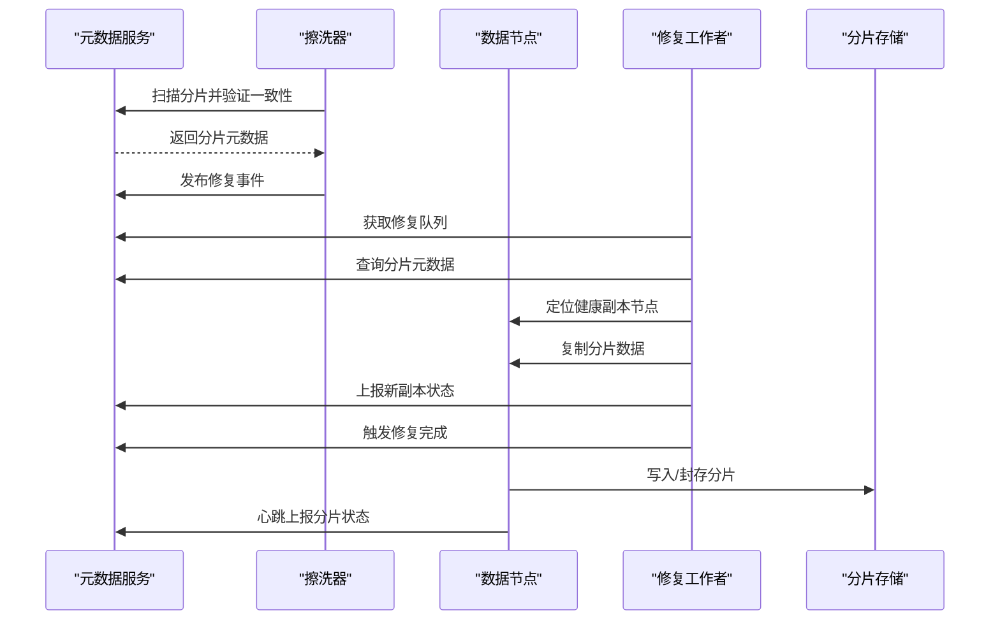
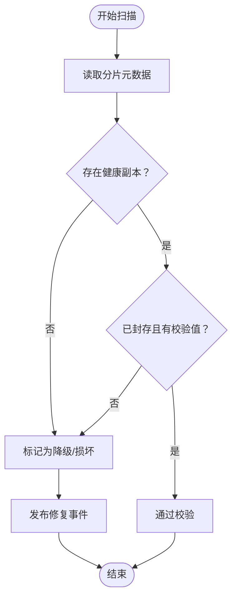
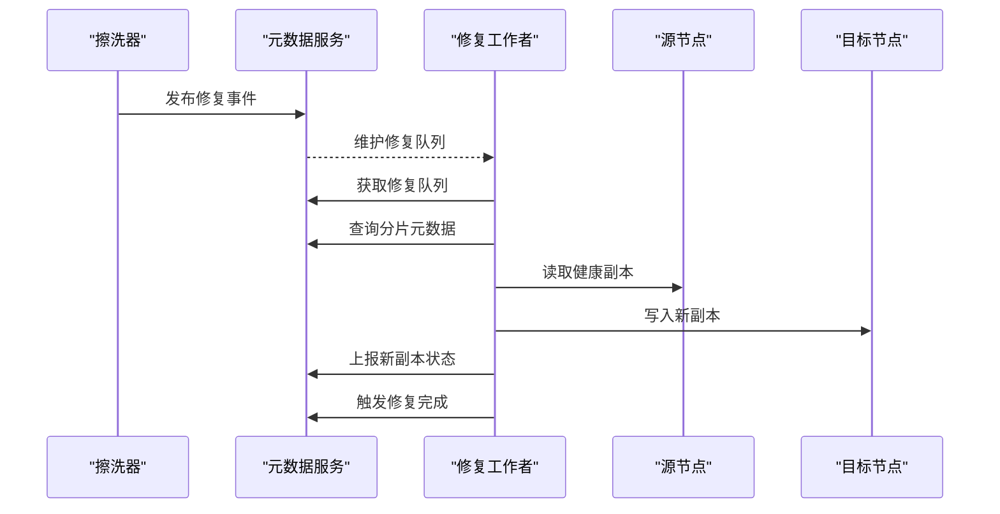
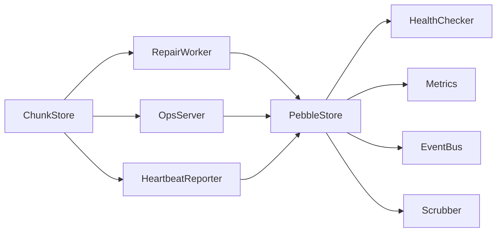

# 修复维护

<cite>
**本文引用的文件列表**
- [repair.go](file://nufs-core/datanode/repair.go)
- [chunkstore.go](file://nufs-core/datanode/chunkstore.go)
- [ops.go](file://nufs-core/datanode/ops.go)
- [heartbeat.go](file://nufs-core/datanode/heartbeat.go)
- [health.go](file://nufs-core/metadata/health.go)
- [service.go](file://nufs-core/metadata/service.go)
- [types.go](file://nufs-core/metadata/types.go)
- [pebble_store.go](file://nufs-core/metadata/pebble_store.go)
- [production.go](file://nufs-core/metadata/production.go)
- [errors.go](file://nufs-core/metadata/errors.go)
- [main.go](file://nufs-core/cmd/ctl/main.go)
</cite>

## 目录
1. [简介](#简介)
2. [项目结构](#项目结构)
3. [核心组件](#核心组件)
4. [架构总览](#架构总览)
5. [详细组件分析](#详细组件分析)
6. [依赖关系分析](#依赖关系分析)
7. [性能考量](#性能考量)
8. [故障排查指南](#故障排查指南)
9. [结论](#结论)
10. [附录](#附录)

## 简介
本文件面向NUFS分布式文件系统的修复与维护场景，系统性阐述错误检测与分类、数据完整性校验、损坏块识别与修复策略、自动修复流程、手动修复命令与维护操作、错误日志分析、修复进度监控与修复效果验证，以及维护窗口规划与最小化业务影响的策略。内容基于代码实现进行归纳总结，帮助运维人员在生产环境中高效开展修复与维护工作。

## 项目结构
NUFS由元数据服务（metadata）与数据节点（datanode）两大部分组成：
- 元数据服务：负责命名空间、桶、分片、节点状态、一致性与事件总线等；提供健康检查、指标导出、数据擦洗（Scrubber）等能力。
- 数据节点：负责本地分片存储、心跳上报、复制与反熵（Anti-Entropy）、管理API等。

```mermaid
graph TB
subgraph "元数据层"
PS["PebbleStore<br/>键值存储"]
HC["健康检查器<br/>HealthChecker"]
MET["指标<br/>Metrics"]
EVT["事件总线<br/>EventBus"]
SCR["擦洗器<br/>Scrubber"]
end
subgraph "数据节点层"
CS["分片存储<br/>ChunkStore"]
HB["心跳上报<br/>HeartbeatReporter"]
OPS["运维API<br/>OpsServer"]
RW["修复工作者<br/>RepairWorker"]
end
PS <- --> HC
PS <- --> MET
PS <- --> EVT
PS <- --> SCR
CS <- --> HB
CS <- --> OPS
CS <- --> RW
RW --> PS
OPS --> PS
HB --> PS
```

图表来源
- [pebble_store.go:16-89](file://nufs-core/metadata/pebble_store.go#L16-L89)
- [health.go:186-327](file://nufs-core/metadata/health.go#L186-L327)
- [production.go:44-120](file://nufs-core/metadata/production.go#L44-L120)
- [chunkstore.go:18-59](file://nufs-core/datanode/chunkstore.go#L18-L59)
- [heartbeat.go:12-50](file://nufs-core/datanode/heartbeat.go#L12-L50)
- [ops.go:19-71](file://nufs-core/datanode/ops.go#L19-L71)
- [repair.go:13-49](file://nufs-core/datanode/repair.go#L13-L49)

章节来源
- [pebble_store.go:16-89](file://nufs-core/metadata/pebble_store.go#L16-L89)
- [health.go:186-327](file://nufs-core/metadata/health.go#L186-L327)
- [production.go:44-120](file://nufs-core/metadata/production.go#L44-L120)
- [chunkstore.go:18-59](file://nufs-core/datanode/chunkstore.go#L18-L59)
- [heartbeat.go:12-50](file://nufs-core/datanode/heartbeat.go#L12-L50)
- [ops.go:19-71](file://nufs-core/datanode/ops.go#L19-L71)
- [repair.go:13-49](file://nufs-core/datanode/repair.go#L13-L49)

## 核心组件
- 分片存储（ChunkStore）：负责本地分片的写入、读取、封存（Seal）与校验，提供CRC32校验与元数据侧车文件。
- 心跳上报（HeartbeatReporter）：周期性向元数据服务上报节点使用量、分片状态等，驱动元数据对节点健康度与分片可用性的判断。
- 修复工作者（RepairWorker）：从元数据服务拉取修复队列，定位健康副本与目标节点，触发修复流程并更新状态。
- 擦洗器（Scrubber）：定期扫描所有分片，验证元数据一致性与分片状态，发现异常时触发修复事件。
- 健康检查（HealthChecker）：提供HTTP健康/就绪探针与指标导出，辅助运维评估系统整体健康状况。
- 运维API（OpsServer）：提供集群状态、节点、桶、分片校验、修复队列、GC扫描、健康与指标查询等接口。
- 元数据服务（MetadataService/PebbleStore）：统一的元数据接口与后端实现，承载分片元数据、节点信息、修复任务等。

章节来源
- [chunkstore.go:73-127](file://nufs-core/datanode/chunkstore.go#L73-L127)
- [heartbeat.go:71-100](file://nufs-core/datanode/heartbeat.go#L71-L100)
- [repair.go:98-182](file://nufs-core/datanode/repair.go#L98-L182)
- [production.go:435-528](file://nufs-core/metadata/production.go#L435-L528)
- [health.go:186-327](file://nufs-core/metadata/health.go#L186-L327)
- [ops.go:115-298](file://nufs-core/datanode/ops.go#L115-L298)
- [service.go:16-67](file://nufs-core/metadata/service.go#L16-L67)

## 架构总览
NUFS的修复维护以“元数据驱动 + 数据节点执行”的模式运行：
- 元数据侧通过擦洗器与心跳上报收集分片与节点状态，生成修复任务或调整分片状态。
- 数据节点侧通过修复工作者消费修复任务，定位健康副本并复制到目标节点，同时上报状态。
- 运维工具与API用于查看修复队列、触发维护动作、监控健康与指标。



图表来源
- [production.go:491-528](file://nufs-core/metadata/production.go#L491-L528)
- [repair.go:98-182](file://nufs-core/datanode/repair.go#L98-L182)
- [chunkstore.go:229-275](file://nufs-core/datanode/chunkstore.go#L229-L275)
- [heartbeat.go:71-100](file://nufs-core/datanode/heartbeat.go#L71-L100)

## 详细组件分析

### 错误检测与分类机制
- 数据完整性检查
  - 分片写入时写入二进制头，包含魔数、分片ID、长度与CRC32校验值；封存时重新计算并更新校验值，确保数据可校验。
  - 分片读取时验证魔数与偏移范围，返回本地校验值供对比。
- 损坏块识别
  - 擦洗器扫描所有分片，验证分片是否有副本、健康副本数量、已封存分片是否具备校验值等；不满足条件则标记为损坏或降级。
  - 心跳上报将本地分片状态映射为ReplicaState，驱动元数据侧对分片状态的判定。
- 修复策略
  - 当发现损坏或降级分片时，擦洗器发布修复事件，修复工作者从元数据拉取修复队列并执行修复。



图表来源
- [production.go:461-489](file://nufs-core/metadata/production.go#L461-L489)
- [chunkstore.go:171-227](file://nufs-core/datanode/chunkstore.go#L171-L227)

章节来源
- [chunkstore.go:73-127](file://nufs-core/datanode/chunkstore.go#L73-L127)
- [chunkstore.go:169-227](file://nufs-core/datanode/chunkstore.go#L169-L227)
- [chunkstore.go:229-275](file://nufs-core/datanode/chunkstore.go#L229-L275)
- [production.go:461-489](file://nufs-core/metadata/production.go#L461-L489)
- [heartbeat.go:71-100](file://nufs-core/datanode/heartbeat.go#L71-L100)

### 自动修复流程
- 元数据侧
  - 擦洗器周期性扫描，发现异常即发布修复事件，元数据维护修复队列。
- 数据节点侧
  - 修复工作者按配置的时间间隔轮询修复队列，获取分片元数据，选择健康副本作为源，寻找可用目标节点，上报新副本状态并触发修复完成。
- 结果反馈
  - 修复工作者统计成功/失败次数；心跳上报反映最新分片状态；运维API提供修复队列与健康状态查询。



图表来源
- [production.go:504-516](file://nufs-core/metadata/production.go#L504-L516)
- [repair.go:98-182](file://nufs-core/datanode/repair.go#L98-L182)

章节来源
- [repair.go:98-182](file://nufs-core/datanode/repair.go#L98-L182)
- [production.go:504-516](file://nufs-core/metadata/production.go#L504-L516)

### 手动修复命令与维护操作
- 使用ctl工具
  - 列出节点、桶、查看修复队列、触发重平衡、查看Raft领导者等。
- 运维API
  - 集群状态、节点列表、桶列表、分片校验、修复队列、GC扫描、健康与指标查询等。
- 心跳与健康
  - 心跳上报节点使用量与分片状态；健康检查器提供/health、/ready与/metrics端点。

章节来源
- [main.go:42-84](file://nufs-core/cmd/ctl/main.go#L42-L84)
- [main.go:184-204](file://nufs-core/cmd/ctl/main.go#L184-L204)
- [ops.go:115-298](file://nufs-core/datanode/ops.go#L115-L298)
- [health.go:292-327](file://nufs-core/metadata/health.go#L292-L327)

### 错误日志分析
- 日志来源
  - 修复工作者在获取修复队列失败、修复失败时输出日志。
  - 擦洗器在扫描过程中记录损坏/降级数量与触发修复次数。
  - 心跳上报在失败时输出日志。
- 日志字段建议
  - 时间戳、节点ID、分片ID、错误类型、原因描述、重试次数等，便于定位问题根因。

章节来源
- [repair.go:100-116](file://nufs-core/datanode/repair.go#L100-L116)
- [production.go:541-548](file://nufs-core/metadata/production.go#L541-L548)
- [heartbeat.go:97-99](file://nufs-core/datanode/heartbeat.go#L97-L99)

### 修复进度监控与修复效果验证
- 进度监控
  - 修复工作者统计修复成功/失败计数；运维API提供修复队列与健康状态；健康检查器提供错误率与就绪状态。
- 效果验证
  - 通过分片校验接口比对本地校验值与元数据校验值；心跳上报反映分片状态变化；指标导出用于观察延迟与吞吐。

章节来源
- [repair.go:75-80](file://nufs-core/datanode/repair.go#L75-L80)
- [ops.go:177-200](file://nufs-core/datanode/ops.go#L177-L200)
- [health.go:292-327](file://nufs-core/metadata/health.go#L292-L327)

### 常见错误类型与诊断步骤
- 分片未封存或校验缺失
  - 现象：分片状态异常、校验失败。
  - 诊断：检查分片写入流程与封存逻辑；确认二进制头与校验值是否正确更新。
- 缺少健康副本
  - 现象：修复工作者无法找到源副本。
  - 诊断：检查节点状态、磁盘空间、心跳上报是否正常；必要时触发重平衡或下线故障节点。
- 修复队列积压
  - 现象：修复工作者统计失败增加、修复队列增长。
  - 诊断：检查网络、磁盘IO、并发限制；适当降低修复频率或增加资源。
- 节点离线或租约过期
  - 现象：心跳失败、节点状态变为离线。
  - 诊断：检查网络连通性、磁盘空间、元数据服务一致性；必要时进行节点退役或重启。

章节来源
- [errors.go:60-89](file://nufs-core/metadata/errors.go#L60-L89)
- [chunkstore.go:229-275](file://nufs-core/datanode/chunkstore.go#L229-L275)
- [heartbeat.go:97-99](file://nufs-core/datanode/heartbeat.go#L97-L99)

### 维护窗口规划与最小化业务影响策略
- 维护窗口规划
  - 选择业务低峰时段执行大规模修复与重平衡；结合健康检查器的就绪状态与指标导出，评估系统负载。
- 最小化业务影响
  - 控制修复频率与并发度，避免过度占用磁盘IO与网络带宽；优先修复高优先级分片；利用心跳上报与运维API动态调整策略。
- 变更控制
  - 通过ctl工具与运维API进行受控变更；在元数据服务启用Raft时，确保领导者切换与快照策略不影响修复流程。

章节来源
- [health.go:292-327](file://nufs-core/metadata/health.go#L292-L327)
- [ops.go:202-227](file://nufs-core/datanode/ops.go#L202-L227)
- [main.go:171-182](file://nufs-core/cmd/ctl/main.go#L171-L182)

## 依赖关系分析
- 元数据服务（PebbleStore）与健康检查器、指标、事件总线、擦洗器耦合紧密，共同构成元数据侧的可观测与自愈能力。
- 数据节点侧的分片存储、心跳上报、运维API与修复工作者相互协作，形成数据侧的自愈闭环。
- 修复工作者依赖元数据服务提供的修复队列与分片元数据，同时通过心跳上报反馈修复结果。



图表来源
- [pebble_store.go:16-89](file://nufs-core/metadata/pebble_store.go#L16-L89)
- [health.go:186-327](file://nufs-core/metadata/health.go#L186-L327)
- [production.go:44-120](file://nufs-core/metadata/production.go#L44-L120)
- [chunkstore.go:18-59](file://nufs-core/datanode/chunkstore.go#L18-L59)
- [heartbeat.go:12-50](file://nufs-core/datanode/heartbeat.go#L12-L50)
- [ops.go:19-71](file://nufs-core/datanode/ops.go#L19-L71)
- [repair.go:13-49](file://nufs-core/datanode/repair.go#L13-L49)

章节来源
- [service.go:16-67](file://nufs-core/metadata/service.go#L16-L67)
- [types.go:164-170](file://nufs-core/metadata/types.go#L164-L170)

## 性能考量
- 并发与限流
  - 分片存储采用读写信号量限制并发，避免磁盘与CPU过载。
- 周期性任务
  - 修复工作者与擦洗器均采用定时器周期执行，应根据集群规模与资源情况合理设置间隔。
- 指标观测
  - 指标系统提供读写延迟直方图与错误计数，可用于评估修复过程对性能的影响。

章节来源
- [chunkstore.go:29-51](file://nufs-core/datanode/chunkstore.go#L29-L51)
- [health.go:122-184](file://nufs-core/metadata/health.go#L122-L184)

## 故障排查指南
- 修复队列为空但仍有异常
  - 检查擦洗器是否正常运行、事件总线是否正常发布；确认分片状态是否被正确上报。
- 修复工作者频繁失败
  - 检查源节点与目标节点的网络连通性、磁盘空间与IO性能；核对分片元数据与实际状态一致性。
- 健康检查器显示异常
  - 查看错误率阈值、Pebble数据库可读性、根inode是否存在；结合指标导出定位瓶颈。
- 心跳上报失败
  - 检查节点租约与元数据服务一致性；确认心跳间隔与上下文超时设置。

章节来源
- [repair.go:100-116](file://nufs-core/datanode/repair.go#L100-L116)
- [production.go:541-548](file://nufs-core/metadata/production.go#L541-L548)
- [health.go:218-289](file://nufs-core/metadata/health.go#L218-L289)
- [heartbeat.go:97-99](file://nufs-core/datanode/heartbeat.go#L97-L99)

## 结论
NUFS通过元数据驱动与数据节点执行相结合的方式，构建了完善的错误检测、分类与修复体系。借助擦洗器、修复工作者、心跳上报与运维API，系统能够在保证业务连续性的同时，持续提升数据可靠性与系统健康度。建议在维护窗口内有序执行修复与重平衡，结合健康检查与指标观测，实现最小化业务影响的运维目标。

## 附录
- 关键术语
  - 分片（Chunk）：文件的固定大小数据块。
  - 副本（Replica）：同一分片在不同节点上的拷贝。
  - 降级（Degraded）：副本不足导致的可用性下降状态。
  - 封存（Seal）：完成写入并计算校验值的过程。
- 常用命令与端点
  - ctl命令：nodes、buckets、rebalance、decommission、repair-queue、trigger-rebalance、leader。
  - 运维API：/api/v1/cluster/status、/api/v1/nodes、/api/v1/buckets、/api/v1/chunks/{id}/verify、/api/v1/repair/queue、/api/v1/gc/scan、/api/v1/metrics、/api/v1/health。
  - 健康检查：/health、/ready、/metrics。

章节来源
- [main.go:68-84](file://nufs-core/cmd/ctl/main.go#L68-L84)
- [ops.go:45-64](file://nufs-core/datanode/ops.go#L45-L64)
- [health.go:292-327](file://nufs-core/metadata/health.go#L292-L327)