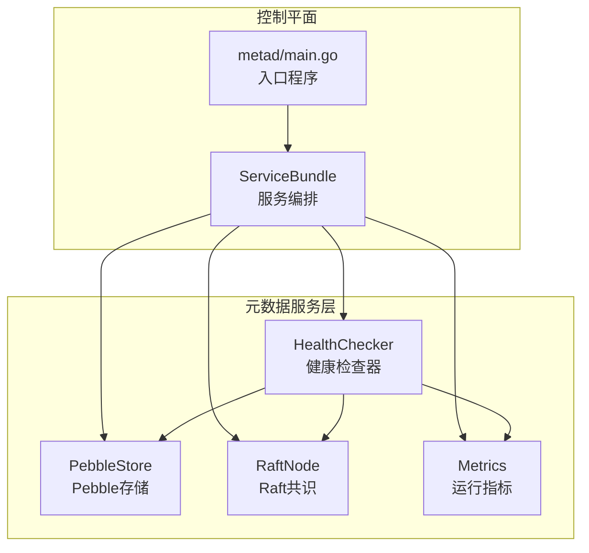
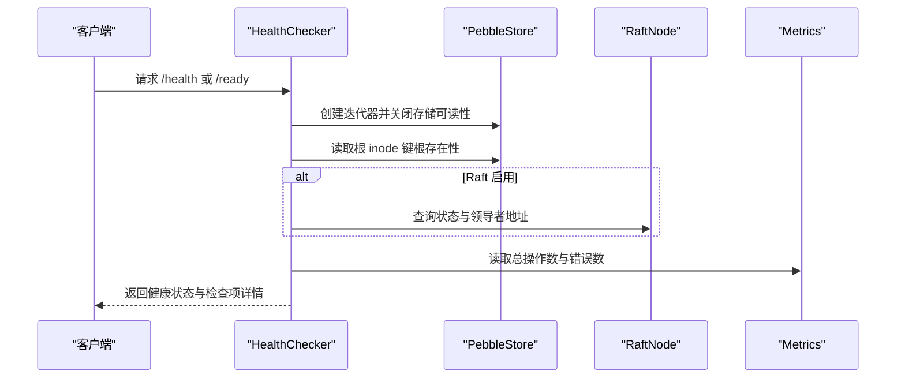
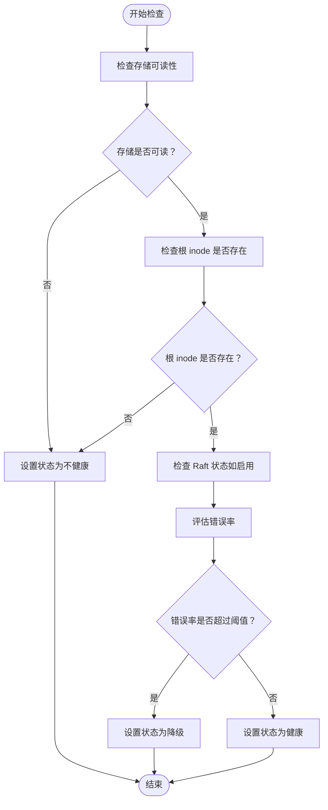
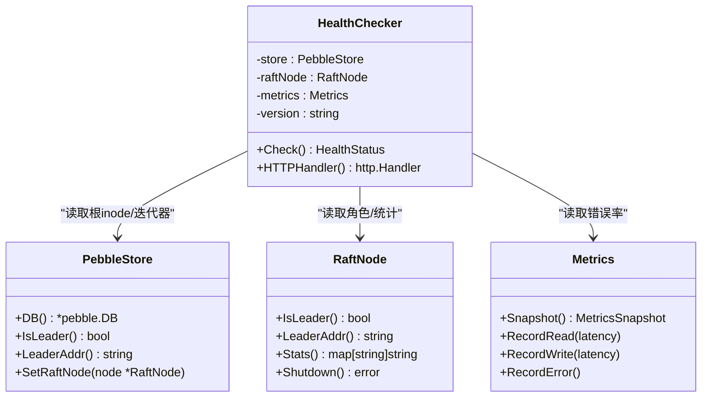

# 健康检查

<cite>
**本文引用的文件列表**
- [health.go](file://nufs-core/metadata/health.go)
- [service.go](file://nufs-core/metadata/service.go)
- [pebble_store.go](file://nufs-core/metadata/pebble_store.go)
- [pebble_raft.go](file://nufs-core/metadata/pebble_raft.go)
- [types.go](file://nufs-core/metadata/types.go)
- [keys.go](file://nufs-core/metadata/keys.go)
- [main.go](file://nufs-core/cmd/metad/main.go)
</cite>

## 目录
1. [简介](#简介)
2. [项目结构与定位](#项目结构与定位)
3. [核心组件](#核心组件)
4. [架构总览](#架构总览)
5. [详细组件分析](#详细组件分析)
6. [依赖关系分析](#依赖关系分析)
7. 性能考量
8. 故障排查指南
9. 结论
10. 附录：Kubernetes 探针配置示例

## 简介
本文件系统健康检查机制围绕元数据服务（metad）展开，重点覆盖以下方面：
- 健康检查器（HealthChecker）的实现原理与检查项
- 健康检查端点（/health、/ready）的行为与返回状态
- Kubernetes 就绪探针与存活探针的配置建议
- 常见健康检查失败原因与解决思路
- 如何通过健康检查端点监控元数据服务状态与性能指标

## 项目结构与定位
- 元数据服务位于 nufs-core/metadata 包中，提供统一的元数据接口与生产级子系统组合（事件总线、指标、健康检查、租约、垃圾回收、数据清洗、Raft 节点等）。
- 健康检查器在元数据包内实现，同时在命令入口（metad/main.go）也提供了简化的健康/就绪端点，用于演示用途。
- 本文档以元数据包内的健康检查器为核心，结合服务编排与 Raft 集成进行说明。

图表来源
- [service.go:136-213](file://nufs-core/metadata/service.go#L136-L213)
- [health.go:200-216](file://nufs-core/metadata/health.go#L200-L216)
- [pebble_store.go:19-31](file://nufs-core/metadata/pebble_store.go#L19-L31)
- [pebble_raft.go:385-484](file://nufs-core/metadata/pebble_raft.go#L385-L484)

章节来源
- [service.go:76-93](file://nufs-core/metadata/service.go#L76-L93)
- [service.go:136-213](file://nufs-core/metadata/service.go#L136-L213)
- [main.go:151-220](file://nufs-core/cmd/metad/main.go#L151-L220)

## 核心组件
- 健康检查器（HealthChecker）
  - 负责对存储、根 inode、Raft 状态、错误率进行综合检查，并输出统一的健康状态。
- 运行指标（Metrics）
  - 记录操作总数、读写次数、错误数、延迟直方图、键/分片/节点/桶计数、Raft 状态等。
- Raft 节点（RaftNode）
  - 提供领导者判断、统计信息、快照触发等能力，作为分布式一致性保障。
- 服务编排（ServiceBundle）
  - 组合元数据服务、事件总线、指标、健康检查器、租约、GC、清洗、Raft、生命周期引擎等子系统。

章节来源
- [health.go:16-51](file://nufs-core/metadata/health.go#L16-L51)
- [health.go:200-216](file://nufs-core/metadata/health.go#L200-L216)
- [pebble_raft.go:385-484](file://nufs-core/metadata/pebble_raft.go#L385-L484)
- [service.go:76-93](file://nufs-core/metadata/service.go#L76-L93)

## 架构总览
健康检查器在服务启动时被注入到 ServiceBundle 中，随后通过 HTTP 处理器暴露 /health、/ready、/metrics 端点。检查流程如下：
- 存储检查：尝试创建迭代器并关闭，确保底层 Pebble 可读。
- 根 inode 检查：读取根 inode 键，确认根目录存在。
- Raft 状态检查：若启用 Raft，则报告角色（leader/follower）、状态与最近联系时间；否则标记为 standalone。
- 错误率评估：基于指标中的总操作数与错误数，计算错误比例阈值（>5% 视为降级），低于阈值则视为正常。
- 端点行为：/health 返回健康状态，不健康时返回 503；/ready 仅在完全健康时返回 200，否则返回 503；/metrics 输出当前指标快照。

图表来源
- [health.go:218-290](file://nufs-core/metadata/health.go#L218-L290)
- [pebble_store.go:113-135](file://nufs-core/metadata/pebble_store.go#L113-L135)
- [pebble_raft.go:487-496](file://nufs-core/metadata/pebble_raft.go#L487-L496)

章节来源
- [health.go:292-327](file://nufs-core/metadata/health.go#L292-L327)

## 详细组件分析

### 健康检查器（HealthChecker）
- 关键职责
  - 对存储、根 inode、Raft 状态、错误率进行检查。
  - 生成统一的健康状态对象，包含状态、角色、版本、运行时间、各检查项结果、时间戳。
- 检查项与判定逻辑
  - 存储可读性：创建迭代器并关闭，失败则标记为不健康。
  - 根 inode 存在性：读取根 inode 键，不存在则标记为不健康。
  - Raft 状态：若启用 Raft，记录角色与状态；未启用则标记为 standalone。
  - 错误率：当总操作数超过阈值且错误比例超过阈值时，标记为降级。
- HTTP 处理器
  - /health：返回健康状态，不健康时返回 503。
  - /ready：仅在状态为 healthy 时返回 200，否则返回 503。
  - /metrics：输出指标快照，若未初始化则返回 404。

图表来源
- [health.go:218-290](file://nufs-core/metadata/health.go#L218-L290)

章节来源
- [health.go:190-290](file://nufs-core/metadata/health.go#L190-L290)
- [health.go:292-327](file://nufs-core/metadata/health.go#L292-L327)

### 运行指标（Metrics）
- 指标类别
  - 操作计数：总操作、读操作、写操作、错误总数。
  - 延迟直方图：读/写 p50/p99（微秒）。
  - 存储统计：键总数、分片总数、在线节点数、桶总数。
  - Raft 状态：角色、任期、日志索引、快照完成数。
  - 运行时间：自启动以来的持续时间。
- 快照导出
  - 提供 Snapshot 方法输出当前指标快照，供 /metrics 端点使用。

章节来源
- [health.go:16-51](file://nufs-core/metadata/health.go#L16-L51)
- [health.go:72-94](file://nufs-core/metadata/health.go#L72-L94)

### Raft 节点（RaftNode）
- 能力
  - 判断是否为领导者、获取领导者地址。
  - 应用日志条目（单键/删除/批量）。
  - 触发手动快照、添加/移除成员、优雅关闭。
  - 导出统计信息（状态、最近联系等）。
- 与健康检查的关系
  - 健康检查器读取角色与统计信息，用于判断集群健康度与领导者状态。

章节来源
- [pebble_raft.go:385-484](file://nufs-core/metadata/pebble_raft.go#L385-L484)
- [pebble_raft.go:540-549](file://nufs-core/metadata/pebble_raft.go#L540-L549)

### 服务编排（ServiceBundle）
- 组合
  - 元数据服务、事件总线、指标、健康检查器、租约、GC、清洗、Raft、生命周期引擎。
- 初始化
  - 在 NewPebbleServiceBundle 中创建健康检查器实例，并根据配置决定是否启用 Raft。
- 就绪信号
  - Ready 通道在所有子系统初始化完成后关闭，供 /ready 端点判断服务是否已就绪。

章节来源
- [service.go:76-93](file://nufs-core/metadata/service.go#L76-L93)
- [service.go:136-213](file://nufs-core/metadata/service.go#L136-L213)

### 健康检查端点与返回状态
- /health
  - 返回健康状态对象，包含状态、角色、版本、运行时间、检查项详情与时间戳。
  - 当状态为 unhealthy 时，HTTP 状态码为 503。
- /ready
  - 仅当状态为 healthy 时返回 200；否则返回 503。
- /metrics
  - 输出指标快照；若未初始化指标则返回 404。

章节来源
- [health.go:292-327](file://nufs-core/metadata/health.go#L292-L327)

### 元数据服务与根 inode
- 根 inode 的作用
  - 根 inode 是命名空间树的根目录，健康检查器会验证其存在性。
- 初始化与键空间
  - 根 inode 键前缀由 prefixInode 定义，根 inode ID 由 RootInodeID 定义。
  - 初始化时若不存在则创建默认根目录元数据。

章节来源
- [keys.go:10-17](file://nufs-core/metadata/keys.go#L10-L17)
- [types.go:16-17](file://nufs-core/metadata/types.go#L16-L17)
- [pebble_store.go:113-135](file://nufs-core/metadata/pebble_store.go#L113-L135)

## 依赖关系分析
- HealthChecker 依赖
  - PebbleStore：执行存储可读性检查与根 inode 读取。
  - RaftNode：读取角色与统计信息。
  - Metrics：读取总操作数与错误数进行错误率评估。
- ServiceBundle 依赖
  - HealthChecker：在服务启动时注入。
  - RaftNode：可选启用，用于分布式一致性。
  - Metrics：可选启用，用于指标采集与导出。

图表来源
- [health.go:200-216](file://nufs-core/metadata/health.go#L200-L216)
- [pebble_store.go:19-31](file://nufs-core/metadata/pebble_store.go#L19-L31)
- [pebble_raft.go:385-484](file://nufs-core/metadata/pebble_raft.go#L385-L484)
- [health.go:16-51](file://nufs-core/metadata/health.go#L16-L51)

章节来源
- [health.go:200-216](file://nufs-core/metadata/health.go#L200-L216)
- [service.go:136-213](file://nufs-core/metadata/service.go#L136-L213)

## 性能考量
- 健康检查开销
  - 存储检查使用轻量迭代器，成本极低。
  - 根 inode 读取为单键读取，性能影响可忽略。
  - Raft 状态读取为内存查询，几乎无额外开销。
  - 错误率评估为原子计数读取，开销很小。
- 指标直方图
  - LatencyHistogram 使用固定大小环形缓冲区，写入 O(1)，百分位计算 O(N log N)，适合高吞吐场景。
- 建议
  - 将健康检查端点暴露在独立监听地址上，避免与业务请求混布。
  - 控制探针探测频率，避免频繁调用导致不必要的负载。

[本节为通用性能讨论，无需特定文件引用]

## 故障排查指南
- 常见失败原因
  - 存储不可读：Pebble 数据目录损坏或权限不足。
  - 根 inode 缺失：初始化失败或数据被意外清理。
  - Raft 不可用：未启用 Raft 或 Raft 集群未选举出领导者。
  - 错误率过高：后端写入失败、磁盘 IO 抖动、网络不稳定。
- 定位步骤
  - 查看 /health 返回的检查项详情，定位具体失败项。
  - 通过 /metrics 获取 p50/p99 延迟与错误总数，判断是否存在异常波动。
  - 若启用 Raft，检查 Raft 统计信息（状态、最近联系时间）。
- 解决方案
  - 存储问题：修复权限、恢复数据、重建元数据。
  - 根 inode 问题：重新初始化或从备份恢复。
  - Raft 问题：检查集群成员、网络连通性、日志截断策略。
  - 错误率问题：优化写入路径、提升磁盘性能、排查网络抖动。

章节来源
- [health.go:218-290](file://nufs-core/metadata/health.go#L218-L290)
- [health.go:72-94](file://nufs-core/metadata/health.go#L72-L94)
- [pebble_raft.go:540-549](file://nufs-core/metadata/pebble_raft.go#L540-L549)

## 结论
NUFS 的健康检查机制通过“存储可读性 + 根 inode 存在性 + Raft 状态 + 错误率”四要素，形成对元数据服务的全面健康评估。结合 /health、/ready、/metrics 端点，运维人员可以快速定位问题并采取相应措施。在 Kubernetes 环境中，建议将 /ready 作为就绪探针，/health 作为存活探针，配合合理的探测参数与重试策略，确保服务稳定运行。

[本节为总结性内容，无需特定文件引用]

## 附录：Kubernetes 探针配置示例
- 就绪探针（/ready）
  - 用途：容器启动后仅在服务完全就绪时对外提供流量。
  - 建议参数：初始延迟 10s，探测间隔 5s，超时 3s，失败阈值 3。
- 存活探针（/health）
  - 用途：检测容器是否仍在运行，不健康时重启。
  - 建议参数：初始延迟 10s，探测间隔 10s，超时 3s，失败阈值 3。
- 指标端点（/metrics）
  - 用途：Prometheus 抓取指标，辅助容量规划与性能监控。
  - 建议参数：单独暴露端口，限制抓取频率，避免与业务请求冲突。

[本节为通用配置建议，无需特定文件引用]