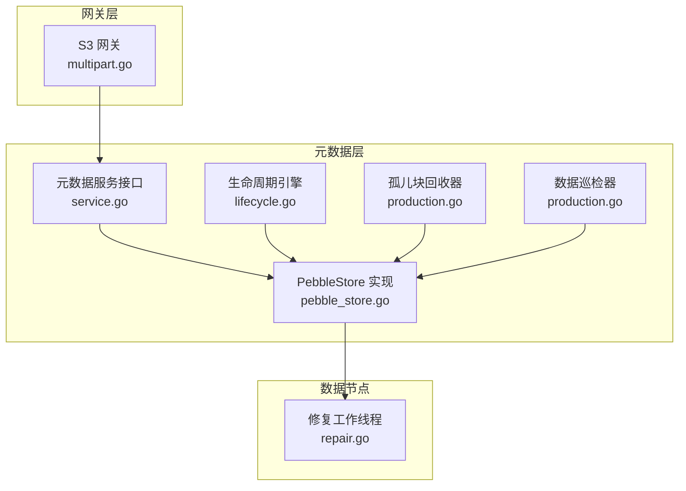
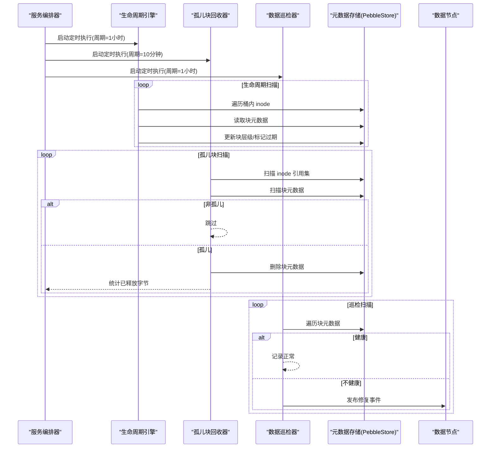
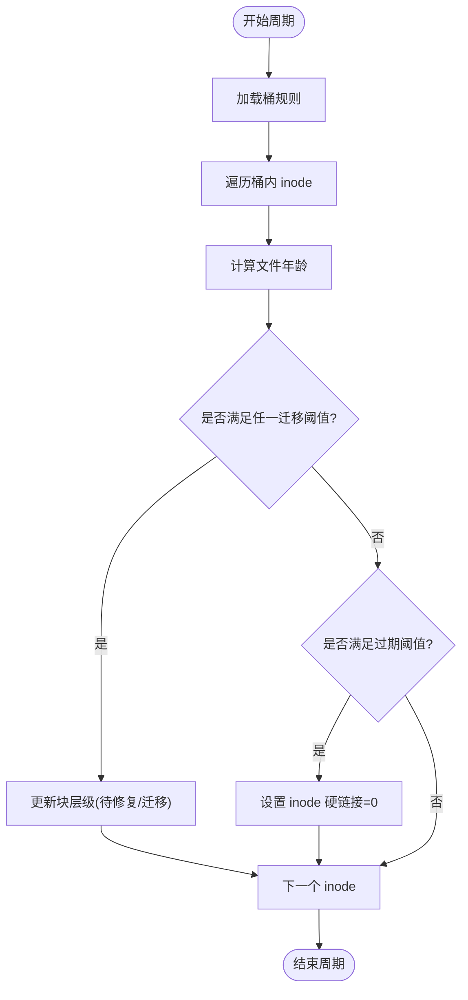
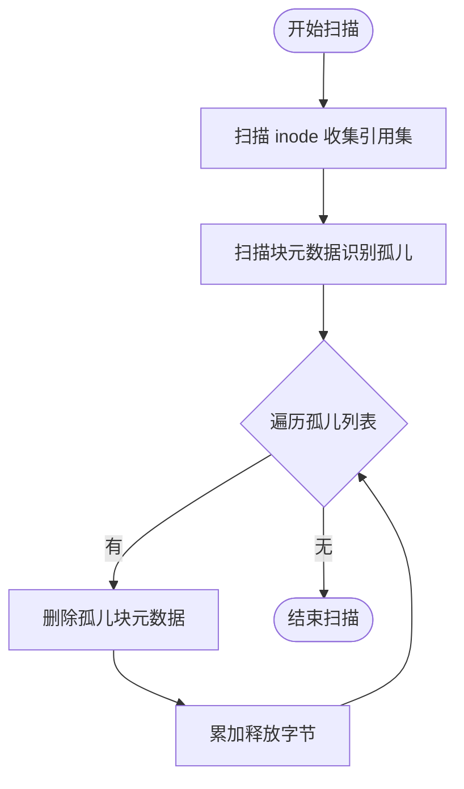
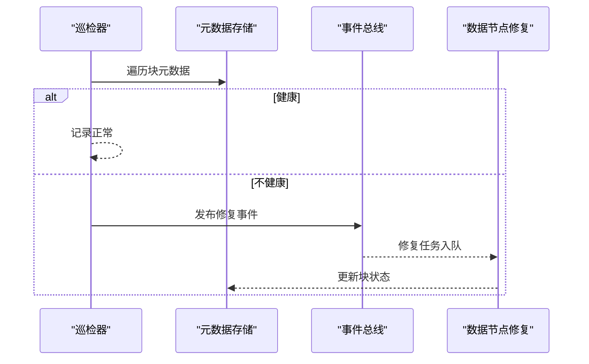
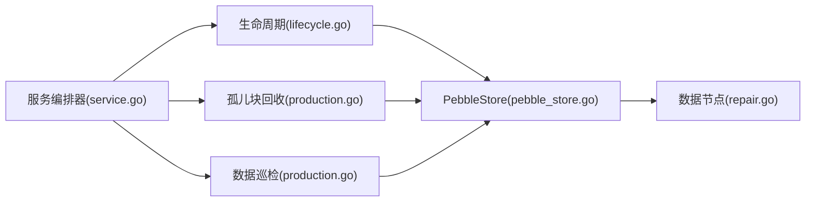

# 垃圾回收

<cite>
**本文引用的文件列表**
- [lifecycle.go](file://nufs-core/metadata/lifecycle.go)
- [production.go](file://nufs-core/metadata/production.go)
- [service.go](file://nufs-core/metadata/service.go)
- [types.go](file://nufs-core/metadata/types.go)
- [pebble_store.go](file://nufs-core/metadata/pebble_store.go)
- [multipart.go](file://nufs-core/gateway/s3/multipart.go)
- [cluster.yaml](file://nufs-core/deploy/config/cluster.yaml)
- [repair.go](file://nufs-core/datanode/repair.go)
</cite>

## 目录
1. [简介](#简介)
2. [项目结构与定位](#项目结构与定位)
3. [核心组件](#核心组件)
4. [架构总览](#架构总览)
5. [详细组件分析](#详细组件分析)
6. [依赖关系分析](#依赖关系分析)
7. [性能与容量规划](#性能与容量规划)
8. [监控与可观测性](#监控与可观测性)
9. [故障排查指南](#故障排查指南)
10. [结论](#结论)

## 简介
本文件系统提供两类关键的垃圾回收能力：
- 对象生命周期管理：基于规则的自动过期与分层迁移（Tier Transition），用于控制数据生命周期与成本优化。
- 孤儿块回收：定期扫描并删除不再被任何文件引用的数据块，释放底层存储空间。

同时，系统还提供数据“巡检”（Scrub）以发现损坏或不一致的块，并通过修复通道触发修复任务，保障数据一致性与可靠性。

## 项目结构与定位
- 生命周期管理与孤儿块回收均在元数据子系统中实现，由服务编排器统一启动与调度。
- S3 网关负责对象上传接口，但当前未持久化多段上传跟踪信息；未完成上传的清理需结合网关与元数据策略共同考虑。
- 数据节点负责块的实际存储与健康上报，配合巡检与修复机制维持整体可用性。

图表来源
- [lifecycle.go:1-190](file://nufs-core/metadata/lifecycle.go#L1-L190)
- [production.go:308-570](file://nufs-core/metadata/production.go#L308-L570)
- [service.go:136-213](file://nufs-core/metadata/service.go#L136-L213)
- [pebble_store.go:1-1178](file://nufs-core/metadata/pebble_store.go#L1-L1178)
- [multipart.go:1-286](file://nufs-core/gateway/s3/multipart.go#L1-L286)
- [repair.go:75-136](file://nufs-core/datanode/repair.go#L75-L136)

章节来源
- [service.go:136-213](file://nufs-core/metadata/service.go#L136-L213)
- [lifecycle.go:1-190](file://nufs-core/metadata/lifecycle.go#L1-L190)
- [production.go:308-570](file://nufs-core/metadata/production.go#L308-L570)

## 核心组件
- 生命周期引擎（LifecycleEngine）
  - 规则驱动的对象过期与分层迁移
  - 统计指标：过期对象数量、迁移次数
- 孤儿块回收器（ChunkGC）
  - 扫描 inode 引用，识别孤儿块并删除
  - 支持干跑模式（仅统计，不删除）
- 数据巡检器（Scrubber）
  - 校验块的副本健康度与校验和状态
  - 发现异常时发布修复事件
- 服务编排器（ServiceBundle）
  - 统一装配生命周期、GC、巡检等后台任务
  - 提供配置项：GC 间隔、巡检间隔、是否启用 Raft 等

章节来源
- [lifecycle.go:35-90](file://nufs-core/metadata/lifecycle.go#L35-L90)
- [production.go:308-430](file://nufs-core/metadata/production.go#L308-L430)
- [production.go:435-561](file://nufs-core/metadata/production.go#L435-L561)
- [service.go:136-213](file://nufs-core/metadata/service.go#L136-L213)

## 架构总览
生命周期与垃圾回收在元数据层以“规则 + 定时扫描”的方式运行，依赖于统一的元数据存储接口。S3 网关负责对象写入入口，但多段上传的中间态目前未持久化到元数据，需要额外策略确保未完成上传的清理。

图表来源
- [service.go:136-213](file://nufs-core/metadata/service.go#L136-L213)
- [lifecycle.go:99-178](file://nufs-core/metadata/lifecycle.go#L99-L178)
- [production.go:337-422](file://nufs-core/metadata/production.go#L337-L422)
- [production.go:491-554](file://nufs-core/metadata/production.go#L491-L554)

## 详细组件分析

### 生命周期引擎（对象过期与分层迁移）
- 规则模型
  - 每条规则绑定一个桶与可选前缀，支持多个迁移规则与一个过期规则
  - 迁移规则按“天数阈值”触发，将块迁移到更高/更低的存储层级
  - 过期规则按“天数阈值”将文件标记为可删除（设置硬链接计数为0）
- 执行逻辑
  - 每个周期遍历指定桶的 inode 子树，计算文件年龄并应用规则
  - 迁移：对满足条件的块更新其层级（通过后续修复/迁移任务落地）
  - 过期：将 inode 的硬链接计数置零，后续由元数据层的删除流程回收
- 统计与日志
  - 统计迁移次数与过期次数
  - 日志记录每次迁移/过期的块 ID 与 inode ID，便于审计与排障

图表来源
- [lifecycle.go:99-178](file://nufs-core/metadata/lifecycle.go#L99-L178)

章节来源
- [lifecycle.go:16-90](file://nufs-core/metadata/lifecycle.go#L16-L90)
- [lifecycle.go:99-178](file://nufs-core/metadata/lifecycle.go#L99-L178)

### 孤儿块回收器（未引用块清理）
- 扫描策略
  - 第一阶段：扫描所有 inode，收集所有被引用的块 ID
  - 第二阶段：扫描所有块元数据，若不在引用集中则标记为孤儿
  - 第三阶段：逐个删除孤儿块元数据，并累加释放字节数
- 干跑模式
  - 可在不实际删除的情况下统计孤儿数量与释放字节，用于评估回收效果
- 执行时机
  - 由服务编排器按配置的 GC 间隔启动定时任务

图表来源
- [production.go:337-397](file://nufs-core/metadata/production.go#L337-L397)

章节来源
- [production.go:308-430](file://nufs-core/metadata/production.go#L308-L430)

### 数据巡检器（损坏/降级检测）
- 校验内容
  - 块是否有副本、是否存在健康副本
  - 已封印/就绪块是否具备校验和
- 行为
  - 发现异常时记录日志并发布修复事件
  - 修复由数据节点侧的修复工作线程消费并执行

图表来源
- [production.go:491-554](file://nufs-core/metadata/production.go#L491-L554)
- [repair.go:98-136](file://nufs-core/datanode/repair.go#L98-L136)

章节来源
- [production.go:435-561](file://nufs-core/metadata/production.go#L435-L561)
- [repair.go:75-136](file://nufs-core/datanode/repair.go#L75-L136)

### 未完成上传的处理
- 当前现状
  - S3 网关使用内存跟踪多段上传，未持久化到元数据
  - 未完成上传的清理依赖于内存中的上传跟踪器，重启后会丢失
- 建议策略
  - 将活跃上传持久化到元数据（例如新增上传表），并在元数据层增加“超时清理”逻辑
  - 或在网关层引入持久化存储（如嵌入式数据库）保存上传上下文
  - 结合生命周期规则，对长时间未完成的上传进行清理

章节来源
- [multipart.go:14-83](file://nufs-core/gateway/s3/multipart.go#L14-L83)

## 依赖关系分析
- 生命周期引擎依赖元数据存储接口，直接读取/更新 inode 与块元数据
- 孤儿块回收器与巡检器均依赖元数据存储的扫描接口
- 服务编排器根据配置决定是否启动生命周期、GC、巡检等后台任务
- 数据节点通过事件总线接收修复任务并执行修复

图表来源
- [service.go:136-213](file://nufs-core/metadata/service.go#L136-L213)
- [lifecycle.go:1-190](file://nufs-core/metadata/lifecycle.go#L1-L190)
- [production.go:308-570](file://nufs-core/metadata/production.go#L308-L570)
- [pebble_store.go:1-1178](file://nufs-core/metadata/pebble_store.go#L1-L1178)
- [repair.go:75-136](file://nufs-core/datanode/repair.go#L75-L136)

章节来源
- [service.go:136-213](file://nufs-core/metadata/service.go#L136-L213)
- [lifecycle.go:1-190](file://nufs-core/metadata/lifecycle.go#L1-L190)
- [production.go:308-570](file://nufs-core/metadata/production.go#L308-L570)
- [pebble_store.go:1-1178](file://nufs-core/metadata/pebble_store.go#L1-L1178)
- [repair.go:75-136](file://nufs-core/datanode/repair.go#L75-L136)

## 性能与容量规划
- 周期性扫描的开销
  - 生命周期扫描：按桶遍历 inode，复杂度近似 O(N)，其中 N 为桶内文件数
  - 孤儿块扫描：两次全量扫描，复杂度 O(I + C)，I 为 inode 数，C 为块数
  - 巡检扫描：遍历块元数据，复杂度 O(C)
- IO 与网络
  - 扫描操作主要为顺序读取元数据键值，IO 开销可控
  - 修复过程涉及跨节点复制，受带宽与磁盘 IO 限制
- 调度频率建议
  - 默认 GC 间隔 10 分钟、巡检 1 小时、生命周期 1 小时，可根据集群规模与负载调整
- 干跑模式
  - 在生产环境先启用干跑，观察回收效果后再开启删除，降低风险

章节来源
- [service.go:229-237](file://nufs-core/metadata/service.go#L229-L237)
- [production.go:337-397](file://nufs-core/metadata/production.go#L337-L397)
- [production.go:491-554](file://nufs-core/metadata/production.go#L491-L554)

## 监控与可观测性
- 生命周期引擎
  - 指标：迁移次数、过期次数
  - 日志：每次迁移/过期的块 ID 与 inode ID
- 孤儿块回收器
  - 指标：扫描耗时、孤儿数量、删除数量、释放字节数
  - 日志：扫描结果摘要
- 数据巡检器
  - 指标：扫描总数、损坏块数、降级块数、触发修复数
  - 日志：异常块详情与修复事件
- 配置参考
  - 通过服务选项设置 GC 间隔、巡检间隔、是否启用干跑等

章节来源
- [lifecycle.go:187-190](file://nufs-core/metadata/lifecycle.go#L187-L190)
- [production.go:328-335](file://nufs-core/metadata/production.go#L328-L335)
- [production.go:452-459](file://nufs-core/metadata/production.go#L452-L459)
- [service.go:249-262](file://nufs-core/metadata/service.go#L249-L262)

## 故障排查指南
- 回收未生效
  - 检查 GC 是否启动与间隔配置是否合理
  - 使用干跑模式验证回收范围与预期释放字节
- 过期未触发
  - 确认规则的桶名、前缀与阈值天数
  - 检查文件年龄是否超过阈值
- 巡检频繁告警
  - 查看巡检日志，确认是副本缺失还是校验和不一致
  - 关注修复队列是否积压
- 未完成上传堆积
  - 当前内存跟踪会在重启后丢失，建议引入持久化上传跟踪
  - 或在网关层增加超时清理策略

章节来源
- [service.go:136-213](file://nufs-core/metadata/service.go#L136-L213)
- [lifecycle.go:99-178](file://nufs-core/metadata/lifecycle.go#L99-L178)
- [production.go:491-554](file://nufs-core/metadata/production.go#L491-L554)
- [multipart.go:14-83](file://nufs-core/gateway/s3/multipart.go#L14-L83)

## 结论
NUFS 的垃圾回收体系由“生命周期规则 + 孤儿块回收 + 数据巡检”构成，覆盖了对象过期、版本清理（通过硬链接计数与层级迁移）、以及底层块的健康维护。通过服务编排器统一启动与配置，可在保证性能的前提下实现自动化运维。针对未完成上传，建议引入持久化上传跟踪与超时清理策略，进一步完善生命周期闭环。