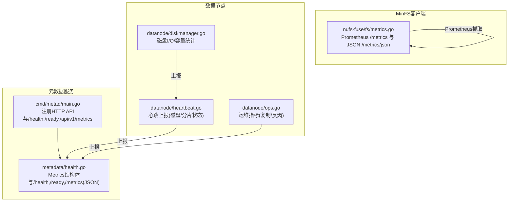
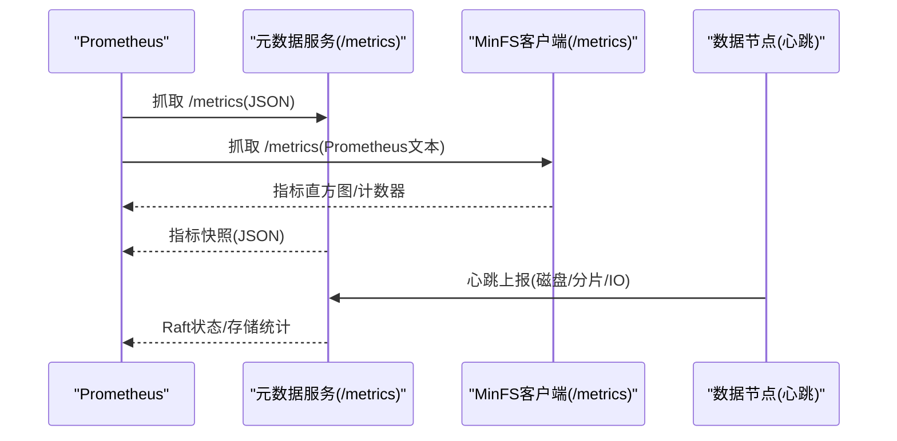
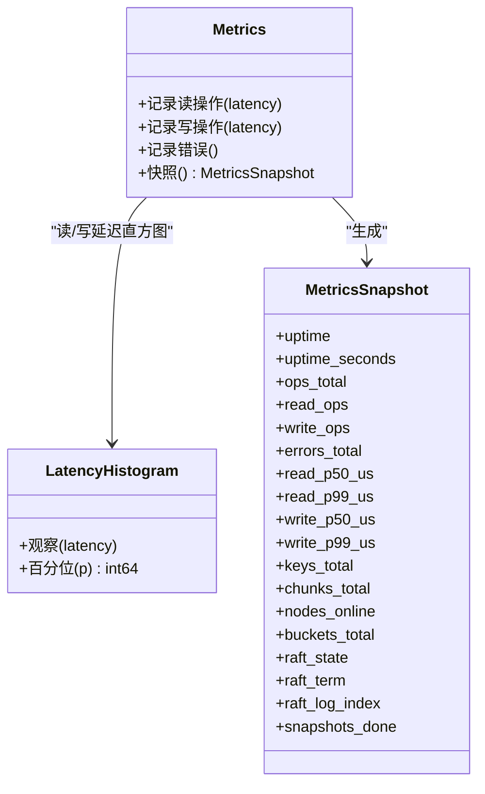
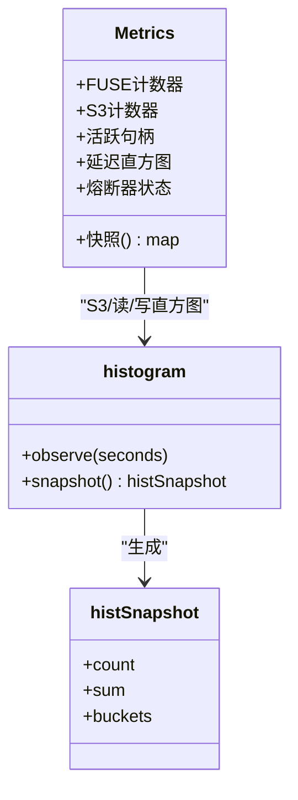
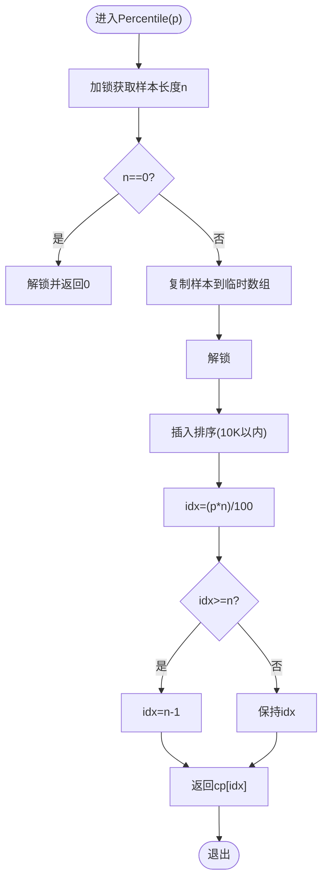
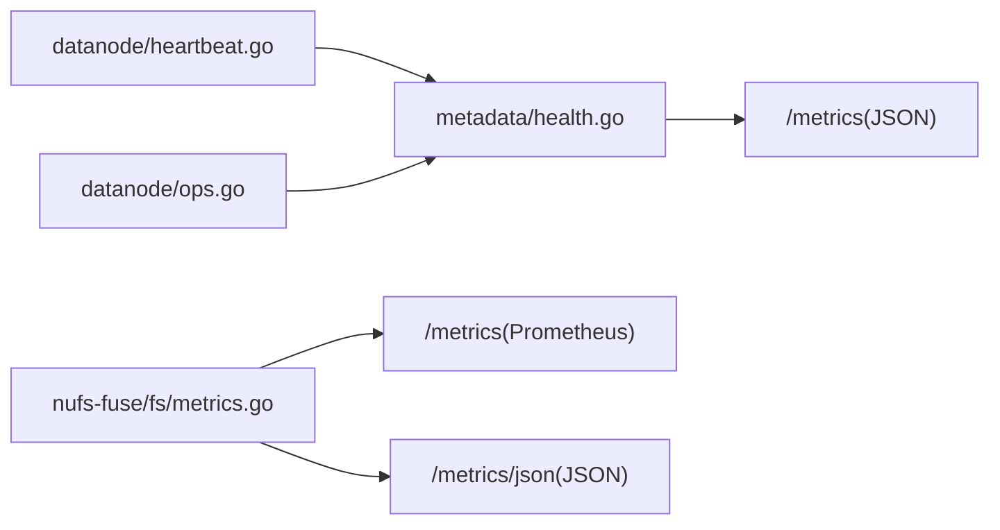

# 指标监控

<cite>
**本文引用的文件**
- [nufs-core/metadata/health.go](file://nufs-core/metadata/health.go)
- [nufs-fuse/fs/metrics.go](file://nufs-fuse/fs/metrics.go)
- [nufs-core/cmd/metad/main.go](file://nufs-core/cmd/metad/main.go)
- [nufs-core/ARCHITECTURE.md](file://nufs-core/ARCHITECTURE.md)
- [nufs-core/datanode/heartbeat.go](file://nufs-core/datanode/heartbeat.go)
- [nufs-core/datanode/ops.go](file://nufs-core/datanode/ops.go)
- [nufs-core/datanode/diskmanager.go](file://nufs-core/datanode/diskmanager.go)
</cite>

## 目录
1. [简介](#简介)
2. [项目结构](#项目结构)
3. [核心组件](#核心组件)
4. [架构总览](#架构总览)
5. [详细组件分析](#详细组件分析)
6. [依赖分析](#依赖分析)
7. [性能考量](#性能考量)
8. [故障排查指南](#故障排查指南)
9. [结论](#结论)
10. [附录](#附录)

## 简介
本文件面向NUFS分布式文件系统的指标监控体系，系统性阐述元数据服务与MinFS客户端两套指标子系统：包括操作计数器、延迟直方图、存储统计与Raft状态等；详解延迟直方图的实现原理与百分位数计算方法；说明指标导出格式、Prometheus集成方式与监控仪表板配置思路；给出关键性能指标阈值与告警规则建议；并提供通过/metrics端点获取实时监控数据的操作指引。

## 项目结构
- 元数据服务（metad）指标：位于 nufs-core/metadata/health.go，提供JSON格式的/metrics端点，包含操作计数、错误计数、读写延迟P50/P99、存储统计与Raft状态。
- MinFS客户端指标：位于 nufs-fuse/fs/metrics.go，提供Prometheus文本格式的/metrics端点与JSON格式的/metrics/json端点，包含FUSE/S3操作计数、延迟直方图、活跃句柄数与熔断器状态。
- 元数据服务HTTP API：位于 nufs-core/cmd/metad/main.go，注册了/health、/ready与/api/v1/metrics等端点。
- 架构与指标清单：位于 nufs-core/ARCHITECTURE.md，给出指标命名规范与告警规则建议。
- 数据节点健康与磁盘指标：位于 nufs-core/datanode/heartbeat.go、ops.go、diskmanager.go，提供磁盘使用率、缓存统计、复制与一致性修复等观测数据。

**图表来源**
- [nufs-core/cmd/metad/main.go:151-219](file://nufs-core/cmd/metad/main.go#L151-L219)
- [nufs-core/metadata/health.go:292-327](file://nufs-core/metadata/health.go#L292-L327)
- [nufs-fuse/fs/metrics.go:317-340](file://nufs-fuse/fs/metrics.go#L317-L340)
- [nufs-core/datanode/heartbeat.go:70-106](file://nufs-core/datanode/heartbeat.go#L70-L106)
- [nufs-core/datanode/ops.go:254-270](file://nufs-core/datanode/ops.go#L254-L270)
- [nufs-core/datanode/diskmanager.go:115-160](file://nufs-core/datanode/diskmanager.go#L115-L160)

**章节来源**
- [nufs-core/cmd/metad/main.go:151-219](file://nufs-core/cmd/metad/main.go#L151-L219)
- [nufs-core/metadata/health.go:292-327](file://nufs-core/metadata/health.go#L292-L327)
- [nufs-fuse/fs/metrics.go:317-340](file://nufs-fuse/fs/metrics.go#L317-L340)

## 核心组件
- 元数据服务Metrics（JSON导出）
  - 指标类型：操作计数器（总操作、读、写、错误）、延迟直方图（P50/P99，微秒）、存储统计（键总数、分片总数、在线节点数、桶总数）、Raft状态（状态、任期、日志索引、快照次数）。
  - 导出端点：/metrics（JSON），用于健康检查与外部监控系统拉取。
- MinFS客户端Metrics（Prometheus导出）
  - 指标类型：FUSE操作计数器、S3后端操作计数器、延迟直方图（秒级桶）、活跃句柄数、熔断器状态。
  - 导出端点：/metrics（Prometheus文本格式）、/metrics/json（JSON）。
- 健康检查与就绪探针
  - /health、/ready：返回服务健康状态，便于容器编排与负载均衡。
- 数据节点观测
  - 心跳上报：磁盘使用量、分片数量、分片状态分布、磁盘IO利用率。
  - 运维指标：复制写入、错误、平均延迟；反熵扫描/不一致/修复计数。

**章节来源**
- [nufs-core/metadata/health.go:16-94](file://nufs-core/metadata/health.go#L16-L94)
- [nufs-fuse/fs/metrics.go:85-137](file://nufs-fuse/fs/metrics.go#L85-L137)
- [nufs-core/cmd/metad/main.go:151-219](file://nufs-core/cmd/metad/main.go#L151-L219)
- [nufs-core/datanode/heartbeat.go:70-106](file://nufs-core/datanode/heartbeat.go#L70-L106)
- [nufs-core/datanode/ops.go:236-270](file://nufs-core/datanode/ops.go#L236-L270)

## 架构总览
下图展示指标采集与导出的关键交互路径：元数据服务与MinFS客户端分别提供独立的HTTP服务端口，Prometheus按配置周期抓取指标；同时，数据节点通过心跳向元数据服务上报运行态信息。

**图表来源**
- [nufs-core/metadata/health.go:317-324](file://nufs-core/metadata/health.go#L317-L324)
- [nufs-fuse/fs/metrics.go:216-301](file://nufs-fuse/fs/metrics.go#L216-L301)
- [nufs-core/datanode/heartbeat.go:70-106](file://nufs-core/datanode/heartbeat.go#L70-L106)

## 详细组件分析

### 元数据服务Metrics结构与导出
- 结构体字段
  - 操作计数器：总操作、读、写、错误。
  - 延迟直方图：读/写延迟（微秒），内部采用固定大小环形缓冲区记录样本。
  - 存储统计：键总数、分片总数、在线节点数、桶总数。
  - Raft状态：状态、任期、日志索引、快照完成数。
- 导出行为
  - Snapshot生成JSON快照，包含时间戳、各类计数与百分位延迟。
  - /metrics端点返回JSON；/health与/ready返回健康状态。
- 健康检查
  - 包含Pebble可读性、根inode存在性、Raft状态与错误率阈值（>5%）检查。

**图表来源**
- [nufs-core/metadata/health.go:16-94](file://nufs-core/metadata/health.go#L16-L94)
- [nufs-core/metadata/health.go:122-184](file://nufs-core/metadata/health.go#L122-L184)

**章节来源**
- [nufs-core/metadata/health.go:16-116](file://nufs-core/metadata/health.go#L16-L116)
- [nufs-core/metadata/health.go:292-327](file://nufs-core/metadata/health.go#L292-L327)

### MinFS客户端Metrics结构与导出
- 结构体字段
  - FUSE操作计数器：open/read/write/release/lookup/readdir/mkdir/remove/rename/create/flush。
  - S3后端操作计数器：get/put/copy/remove/list，以及错误与重试计数。
  - 活跃句柄数：当前打开的文件句柄数。
  - 延迟直方图：S3 Get/Put/List与本地读/写的秒级桶直方图。
  - 熔断器状态：字符串表示当前状态。
- 导出行为
  - /metrics输出Prometheus文本格式（含HELP/TYPE注释、bucket/sum/count）。
  - /metrics/json输出JSON快照（uptime、活跃句柄、熔断器状态、各操作计数）。
  - /healthz简单健康探测。

**图表来源**
- [nufs-fuse/fs/metrics.go:85-137](file://nufs-fuse/fs/metrics.go#L85-L137)
- [nufs-fuse/fs/metrics.go:30-81](file://nufs-fuse/fs/metrics.go#L30-L81)

**章节来源**
- [nufs-fuse/fs/metrics.go:85-201](file://nufs-fuse/fs/metrics.go#L85-L201)
- [nufs-fuse/fs/metrics.go:216-301](file://nufs-fuse/fs/metrics.go#L216-L301)

### LatencyHistogram实现与百分位数计算
- 实现要点
  - 固定大小环形缓冲区（默认10000样本），写入O(1)，避免锁竞争。
  - 百分位查询时复制当前样本数组，排序后按公式idx=(p*n)/100取值，确保查询期间不持有锁。
- 计算流程

**图表来源**
- [nufs-core/metadata/health.go:152-184](file://nufs-core/metadata/health.go#L152-L184)

**章节来源**
- [nufs-core/metadata/health.go:122-184](file://nufs-core/metadata/health.go#L122-L184)

### Prometheus导出格式与集成
- 指标命名与类型
  - Gauge：minfs_uptime_seconds、minfs_active_handles、minfs_circuit_breaker_state。
  - Counter：minfs_ops_total、minfs_s3_ops_total。
  - Histogram：minfs_s3_get_duration_seconds、minfs_s3_put_duration_seconds、minfs_s3_list_duration_seconds、minfs_read_duration_seconds、minfs_write_duration_seconds。
- 导出内容
  - HELP与TYPE注释明确指标含义与类型。
  - 每个直方图输出bucket、sum、count三部分，便于PromQL聚合。
- 集成步骤
  - 在Prometheus配置中添加job，目标为MinFS客户端/metrics端点。
  - 在Grafana中基于直方图sum/count绘制SLA与延迟分布。
  - 可选：在元数据服务侧也启用Prometheus抓取（如需统一导出）。

**章节来源**
- [nufs-fuse/fs/metrics.go:205-301](file://nufs-fuse/fs/metrics.go#L205-L301)

### 监控仪表板配置思路
- 元数据服务（JSON指标）
  - 关键面板：总操作速率、读写比、错误率、P99延迟（微秒）、键/分片/桶/节点数、Raft状态与任期。
  - 告警：错误率>5%、P99延迟突增、Raft状态异常、节点离线。
- MinFS客户端（Prometheus指标）
  - 关键面板：FUSE/S3操作速率、延迟直方图分位（P50/P95/P99）、活跃句柄、熔断器状态。
  - 告警：S3错误率、PUT/GET延迟P99超阈、熔断器打开、句柄泄漏。

[本节为概念性说明，无需列出具体文件来源]

## 依赖分析
- 组件耦合
  - 元数据服务Metrics与HealthChecker通过HTTP接口暴露JSON指标，供外部系统消费。
  - MinFS客户端Metrics通过全局实例与HTTP处理器导出Prometheus指标，便于集中抓取。
  - 数据节点通过心跳与运维接口向元数据服务上报运行态，辅助整体健康判断。
- 外部依赖
  - Prometheus相关库已在模块中声明，用于指标导出与文本格式化。

**图表来源**
- [nufs-core/metadata/health.go:317-324](file://nufs-core/metadata/health.go#L317-L324)
- [nufs-fuse/fs/metrics.go:317-340](file://nufs-fuse/fs/metrics.go#L317-L340)
- [nufs-core/datanode/heartbeat.go:70-106](file://nufs-core/datanode/heartbeat.go#L70-L106)
- [nufs-core/datanode/ops.go:254-270](file://nufs-core/datanode/ops.go#L254-L270)

**章节来源**
- [nufs-core/metadata/health.go:292-327](file://nufs-core/metadata/health.go#L292-L327)
- [nufs-fuse/fs/metrics.go:317-340](file://nufs-fuse/fs/metrics.go#L317-L340)

## 性能考量
- 元数据服务延迟直方图
  - 环形缓冲区限制样本规模，避免内存膨胀；百分位查询为O(N log N)，适合10K以内的样本规模。
  - 建议：若需要更高吞吐或更长窗口，可考虑滑动窗口或外部采样策略。
- MinFS直方图
  - 秒级指数桶覆盖1ms至60s，适合S3与FUSE典型延迟范围；直方图聚合可在PromQL层进行。
- 并发安全
  - 元数据服务使用原子计数器与互斥锁保护直方图；MinFS使用原子计数器与互斥锁保护直方图快照。
- I/O与CPU开销
  - 导出端点仅做聚合与格式化，对生产环境影响较小；建议在低频抓取场景下开启/healthz轻量探测。

[本节为通用指导，无需列出具体文件来源]

## 故障排查指南
- 元数据服务
  - /metrics返回空或未找到：确认bundle.Metrics已初始化且未被关闭。
  - 健康检查状态异常：查看/health与/ready响应，结合错误率阈值（>5%）与Raft状态判断。
- MinFS客户端
  - /metrics抓取失败：检查监听地址与防火墙；确认Prometheus配置正确。
  - 熔断器状态异常：关注minfs_circuit_breaker_state指标，结合S3错误与重试计数定位问题。
- 数据节点
  - 磁盘使用率接近阈值：根据心跳上报的UsedGB与ChunkCount调整容量规划；必要时触发再平衡或下线节点。

**章节来源**
- [nufs-core/metadata/health.go:292-327](file://nufs-core/metadata/health.go#L292-L327)
- [nufs-fuse/fs/metrics.go:317-340](file://nufs-fuse/fs/metrics.go#L317-L340)
- [nufs-core/datanode/heartbeat.go:70-106](file://nufs-core/datanode/heartbeat.go#L70-L106)

## 结论
NUFS的指标监控体系分为两部分：元数据服务提供JSON指标与健康检查，MinFS客户端提供Prometheus直方图与JSON指标。两者互补，既满足集中式监控平台的统一抓取，又能在Prometheus生态中进行灵活的延迟与SLA分析。结合架构文档中的阈值与告警建议，可快速构建稳定可靠的监控与告警体系。

[本节为总结性内容，无需列出具体文件来源]

## 附录

### 指标导出端点与格式
- 元数据服务
  - /metrics：JSON，包含uptime、ops_total、read/write_ops、errors_total、P50/P99（微秒）、存储统计与Raft状态。
  - /health、/ready：JSON，返回健康状态与就绪状态。
- MinFS客户端
  - /metrics：Prometheus文本格式，包含Gauge/Counter/Histogram。
  - /metrics/json：JSON，包含uptime、活跃句柄、熔断器状态与各操作计数。
  - /healthz：简单健康探测。

**章节来源**
- [nufs-core/metadata/health.go:317-324](file://nufs-core/metadata/health.go#L317-L324)
- [nufs-fuse/fs/metrics.go:216-301](file://nufs-fuse/fs/metrics.go#L216-L301)
- [nufs-fuse/fs/metrics.go:317-340](file://nufs-fuse/fs/metrics.go#L317-L340)

### 关键性能指标阈值与告警规则
- 阈值建议（示例）
  - 错误率：>5%（样本>100）视为degraded。
  - P99延迟：读/写P99微秒超过业务SLA阈值（例如>10ms）触发告警。
  - Raft状态：非leader持续时间过长或频繁切换。
  - 磁盘使用率：>90%触发P1告警。
- 告警规则（示例）
  - 磁盘使用率>90%持续5分钟。
  - 节点宕机>5分钟。
  - 复制延迟>30s。
  - 孤儿Chunk>1000。
  - 错误率>5%。
  - Raft选举频繁（1小时内>3次）。

**章节来源**
- [nufs-core/ARCHITECTURE.md:904-914](file://nufs-core/ARCHITECTURE.md#L904-L914)

### 使用/metrics端点获取实时监控数据
- 元数据服务
  - GET http://<metad-host>:<port>/api/v1/metrics 获取JSON指标快照。
  - GET http://<metad-host>:<port>/health 或 /ready 获取健康状态。
- MinFS客户端
  - GET http://<fuse-host>:<port>/metrics 获取Prometheus文本格式指标。
  - GET http://<fuse-host>:<port>/metrics/json 获取JSON指标快照。
  - GET http://<fuse-host>:<port>/healthz 获取轻量健康探测。

**章节来源**
- [nufs-core/cmd/metad/main.go:205-211](file://nufs-core/cmd/metad/main.go#L205-L211)
- [nufs-core/metadata/health.go:317-324](file://nufs-core/metadata/health.go#L317-L324)
- [nufs-fuse/fs/metrics.go:317-340](file://nufs-fuse/fs/metrics.go#L317-L340)